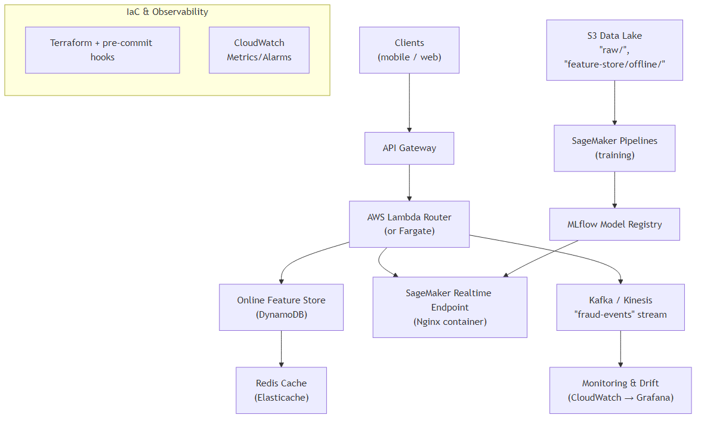

+75
-59

# Fraud Detection System

[](https://codecov.io/gh/EsosaOrumwese/fraud-detection-system)

> **Enterprise-grade, real-time fraud-prediction platform** built with Terraform, Polars/Faker, XGBoost, MLflow and Airflow.



## Overview

The goal of this project is to demonstrate an end-to-end machine learning platform capable of generating realistic transactions, training fraud models and orchestrating data pipelines. The Terraform stack provisions all required AWS infrastructure while Airflow coordinates data generation and model training workflows.

## Dependencies

- Python 3.11+
- [Poetry](https://python-poetry.org/) for environment and package management

Install dependencies with:

```bash
poetry install --with dev
```

## Quick Start

```bash
# 1  Clone & install
git clone https://github.com/EsosaOrumwese/fraud-detection-system.git
cd fraud-detection-system
poetry install --with dev

# 2  Bootstrap Terraform sandbox (≈ 2 min, free-tier)
make tf-init && make tf-plan && make tf-apply

# 3  Generate 1 M synthetic transactions + profile
make pull-raw-bucket           # pulls SSM param into .env
make gen-data      ROWS=1000000
make profile

# 4  Train baseline model & view MLflow UI
make ml-train      ROWS=500000
make mlflow-ui-start    # → http://localhost:5000
```

## Directory Structure

```
docs/                - ADRs, images and data dictionary
infra/               - Terraform modules and scripts
orchestration/       - Local Airflow stack
project_config/      - Data generator configuration
schema/              - Data schema definitions
scripts/             - Helper utilities
src/                 - Application code
tests/               - Unit tests
```

## Data Generation

Generate data locally or upload directly to S3:

```bash
make gen-data-local      # local Parquet files
make gen-data-raw        # writes to S3
make profile             # profile latest dataset
make validate-data       # run Great Expectations checks
```

## Model Training

Train a baseline model and inspect runs via MLflow:

```bash
make ml-train ROWS=500000
make mlflow-ui-start  # http://localhost:5000
```

Stop the UI with `make mlflow-ui-stop`.

## Running Tests

```bash
poetry run pytest
```

## Airflow

Bootstrap secrets and start services:

```bash
make airflow-bootstrap
make airflow-up            # visit http://localhost:8080
```

Tear down with `make airflow-down` or `make airflow-reset` to also remove volumes. Smoke test the DAG with `make airflow-test-dag`.

## Infrastructure

Provision the sandbox:

```bash
make tf-init
make tf-plan
make tf-apply
```

Destroy all resources when done:

```bash
make nuke
```

## Documentation

- [Project Charter](PROJECT_CHARTER.md)
- [Architecture Decision Records](docs/adr/)
- [Data Dictionary](docs/data-dictionary/)

## License

This project is licensed under the [MIT License](LICENSE).

## Contributing

Contributions are welcome! Please open an issue to propose changes before submitting a pull request.