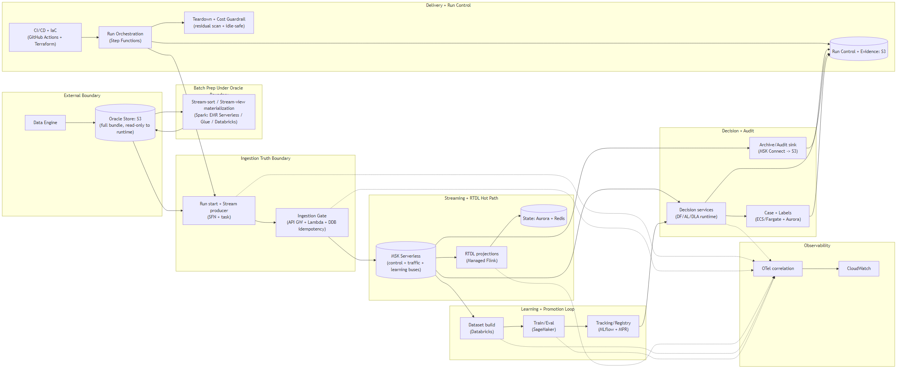

# Closed-World Fraud Platform

Production-shaped fraud platform built on a closed-world data contract.

This repository contains:
1. A sealed Data Engine interface boundary (treated as black-box for platform work).
2. A multi-plane fraud platform (Control/Ingress, RTDL, Decision/Audit, Case/Labels, Learning/Evolution, Obs/Gov).
3. Migration and implementation maps from local parity to managed dev substrates.

## Architecture Overview (Dev Full)



Source graph:
- `docs/design/platform/dev_full/graph/dev_full_platform_overview_v2.mermaid.mmd`

## What This Platform Does

At a high level:
1. Streams runtime traffic through a governed ingestion boundary.
2. Projects real-time context/features and executes decision/action/audit flows.
3. Manages case and labels as append-only operational truth.
4. Builds learning datasets and model-evaluation artifacts on managed lanes.
5. Enforces run-scoped evidence, replayability, and fail-closed gates.

## Current Posture

As of March 2, 2026:
1. Data Engine is sealed for platform work; consume only the interface pack.
2. `dev_min` migration baseline is completed as the managed spine baseline.
3. `dev_full` build map is closed through M14 (runtime repin) and M15 (data semantics realization) with certification handoff prepared.
4. Runtime and Ops/Gov certification tracks exist as separate plans and are the next operational closure step.

Authoritative status files:
- `docs/model_spec/platform/implementation_maps/dev_substrate/dev_full/platform.build_plan.md`
- `docs/model_spec/platform/implementation_maps/dev_substrate/dev_full/platform.impl_actual.md`
- `docs/model_spec/platform/implementation_maps/dev_substrate/dev_full/cert_handoff.md`

## Environment Ladder

1. `local_parity`: semantic harness and deterministic local validation.
2. `dev_min`: managed-substrate spine baseline.
3. `dev_full`: full-platform managed stack and production-shaped operations.
4. `prod_target`: future hardening/expansion target.

## Repository Map

Core areas:
1. `src/fraud_detection/`: platform component implementations.
2. `packages/engine/`: data engine package (black-box boundary for platform track).
3. `docs/model_spec/platform/`: design authority, migration runbooks, handles, build/impl maps.
4. `docs/model_spec/data-engine/interface_pack/`: contract boundary from engine to platform.
5. `infra/terraform/`: substrate IaC stacks.
6. `.github/workflows/`: managed execution lanes (build/migration/certification workflows).
7. `runs/`: local run artifacts and generated evidence snapshots.

## Read First (Source-of-Truth Order)

For platform work, start here:
1. `docs/model_spec/platform/pre-design_decisions/dev-full_managed-substrate_migration.design-authority.v0.md`
2. `docs/model_spec/platform/migration_to_dev/dev_full_platform_green_v0_run_process_flow.md`
3. `docs/model_spec/platform/migration_to_dev/dev_full_handles.registry.v0.md`
4. `docs/model_spec/platform/implementation_maps/dev_substrate/dev_full/platform.build_plan.md`
5. `docs/model_spec/platform/implementation_maps/dev_substrate/dev_full/platform.impl_actual.md`

For engine integration boundary:
1. `docs/model_spec/data-engine/interface_pack/data_engine_interface.md`

## Local Development Quickstart

Prerequisites:
1. Python `>=3.11,<3.13`
2. Poetry
3. Docker (for selected local/parity lanes)

Install:

```bash
poetry install
python -m pre_commit install --install-hooks
```

Useful checks:

```bash
python -m pre_commit run --all-files
pytest -q
```

## Useful Make Targets

Local/parity orchestration:
1. `make platform-stack-up`
2. `make platform-stack-status`
3. `make platform-stack-down`
4. `make platform-parity-bootstrap`
5. `make platform-run-new`

Platform operate packs:
1. `make platform-operate-control-ingress-up`
2. `make platform-operate-rtdl-core-up`
3. `make platform-operate-rtdl-decision-up`
4. `make platform-operate-case-labels-up`
5. `make platform-operate-learning-jobs-up`
6. `make platform-operate-obs-gov-up`
7. `make platform-operate-parity-up`
8. `make platform-operate-parity-down`

Oracle-boundary helpers:
1. `make platform-oracle-pack`
2. `make platform-oracle-stream-sort`
3. `make platform-oracle-check`

Reporting/governance helpers:
1. `make platform-run-report`
2. `make platform-governance-query`
3. `make platform-env-conformance`

## Managed Workflow Lanes

Managed execution is driven from `.github/workflows/` (examples):
1. `dev_full_m1_packaging.yml`
2. `dev_full_m6f_streaming_active.yml`
3. `dev_full_m6h_ingest_commit.yml`
4. `dev_full_m7k_throughput_cert.yml`
5. `dev_full_m10_ab_managed.yml`
6. `dev_full_m11_managed.yml`
7. `dev_full_m12_managed.yml`
8. `dev_full_m13_managed.yml`

Dev-min operational lanes remain under `dev_min_*` workflow files.

## Design Laws in Practice

This project is run with strict implementation laws:
1. Fail-closed gates (no silent pass on missing evidence).
2. Decision-completeness before phase execution.
3. Phase-coverage (anti-cram) planning.
4. Drift sentinel checks against authority docs.
5. Performance-first and cost-control as acceptance criteria.
6. Append-only provenance and replay-safe posture.

Primary law router:
- `AGENTS.md`

## Security and Secrets

1. Do not commit credentials or runtime tokens.
2. Use GitHub Secrets / AWS SSM / Secrets Manager for managed lanes.
3. Keep `.env*` files local and gitignored unless explicitly intended.

## License

MIT - see `LICENSE`.
