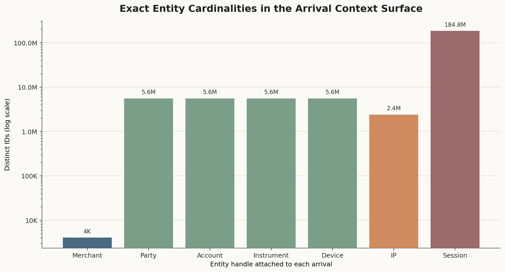
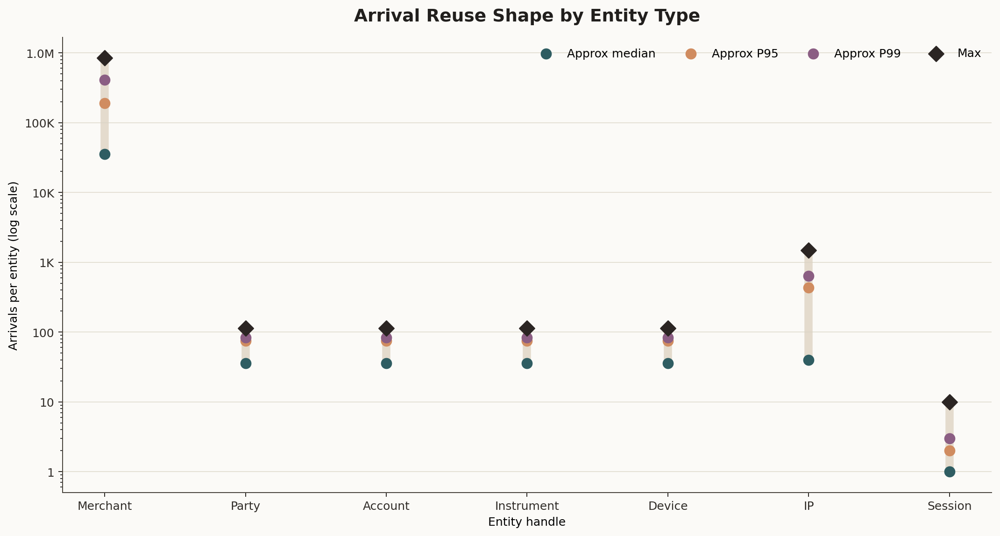
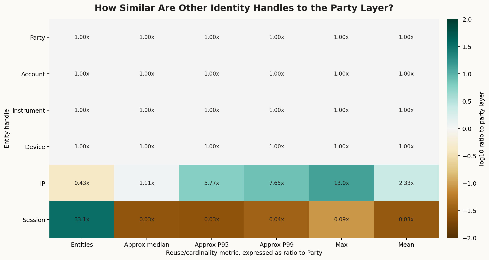
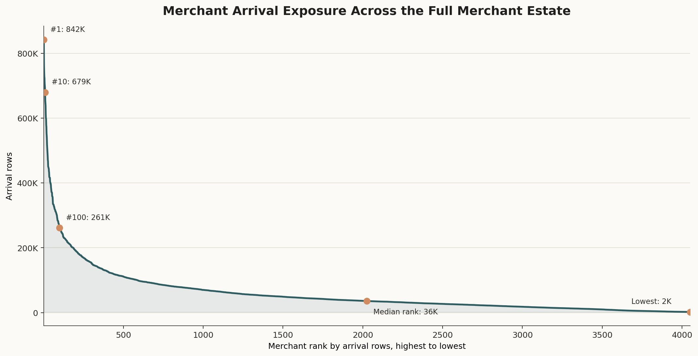
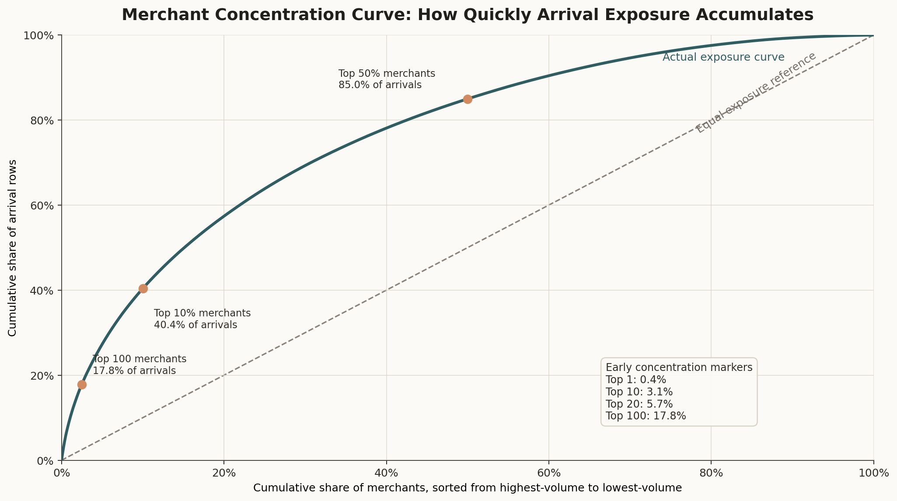
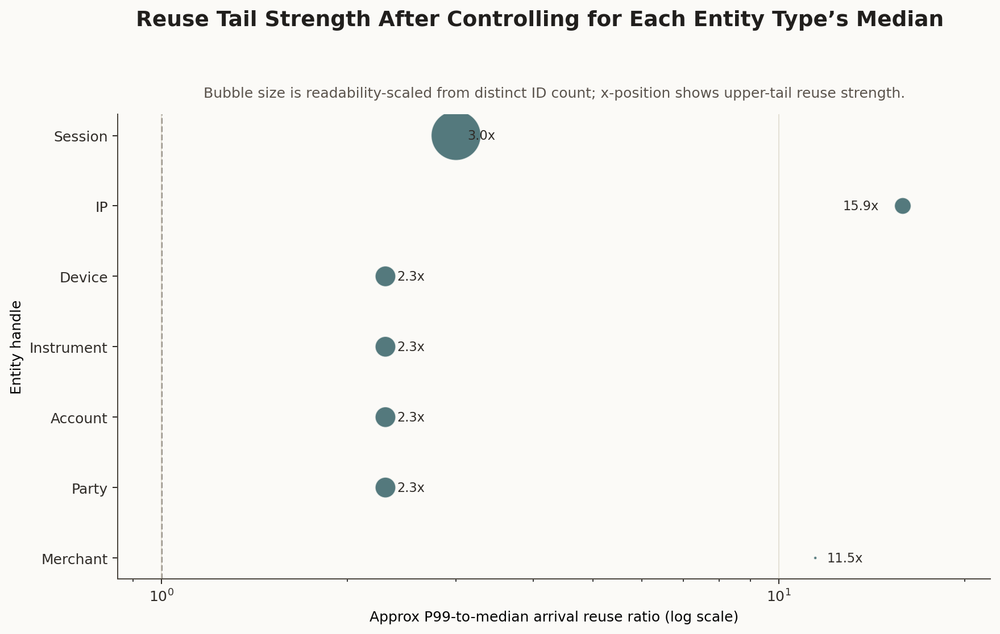

# Branch Investigation: Entity Grain and Identity Graph

## Branch question

The parent behavioural-context investigation established that `s1_arrival_entities_6B` is the arrival-level context surface that attaches entity identifiers to the operating stream world. This branch asks:

> What does the entity context surface actually represent, and what kind of identity graph does it expose for later fraud analytics?

The short answer is that `s1_arrival_entities_6B` is not a customer master table and not a merchant catalogue. It is an arrival-grain identity binding surface. Each row records one arrival and attaches that arrival to a merchant, party, account, instrument, device, IP, and session. In platform terms, this is the surface that makes a thin authorization stream analytically usable: it gives the operating world the entity handles needed for feature construction, replay, case review, entity risk, and network-style investigation.

The important caution is that the entity graph currently looks broad but also highly governed. Party, account, instrument, and device populations are almost identical in size and have nearly identical arrival-reuse distributions. That suggests a tightly coupled synthetic identity design. The IP layer behaves differently and is much more reused. So the first analytical read is not simply "we have an identity graph"; it is that some parts of the graph may be more useful for network analysis than others.

## Evidence used

Primary report:

- [`../behavioural_context_investigation.md`](../behavioural_context_investigation.md)

Contract references:

- [`docs/model_spec/data-engine/interface_pack/data_engine_interface.md`](../../../../../../../../docs/model_spec/data-engine/interface_pack/data_engine_interface.md)
- [`docs/model_spec/data-engine/layer-3/specs/contracts/6B/dataset_dictionary.layer3.6B.yaml`](../../../../../../../../docs/model_spec/data-engine/layer-3/specs/contracts/6B/dataset_dictionary.layer3.6B.yaml)
- [`docs/model_spec/data-engine/layer-3/specs/contracts/6B/schemas.6B.yaml`](../../../../../../../../docs/model_spec/data-engine/layer-3/specs/contracts/6B/schemas.6B.yaml)

Pinned data surface:

- [`runs/local_full_run-7/a3bd8cac9a4284cd36072c6b9624a0c1/data/layer3/6B/s1_arrival_entities_6B`](../../../../../../../../runs/local_full_run-7/a3bd8cac9a4284cd36072c6b9624a0c1/data/layer3/6B/s1_arrival_entities_6B)

Parent exports:

- [`arrival_entities_schema.csv`](../../../../exports/interface_world/behavioural_context/arrival_entities_schema.csv)
- [`arrival_entities_profile.csv`](../../../../exports/interface_world/behavioural_context/arrival_entities_profile.csv)
- [`arrival_entities_nulls.csv`](../../../../exports/interface_world/behavioural_context/arrival_entities_nulls.csv)

Branch exports:

- [`entity_cardinality_profile.csv`](../../../../exports/interface_world/behavioural_context/branches/entity_grain_identity_graph/entity_cardinality_profile.csv)
- [`entity_arrival_reuse_summary.csv`](../../../../exports/interface_world/behavioural_context/branches/entity_grain_identity_graph/entity_arrival_reuse_summary.csv)
- [`top_merchant_id_by_arrivals.csv`](../../../../exports/interface_world/behavioural_context/branches/entity_grain_identity_graph/top_merchant_id_by_arrivals.csv)
- [`merchant_arrival_counts.csv`](../../../../exports/interface_world/behavioural_context/branches/entity_grain_identity_graph/merchant_arrival_counts.csv)

The branch adds exact cardinality and arrival-reuse summaries for `s1_arrival_entities_6B`, plus a targeted full-merchant compact export used to inspect merchant exposure and concentration. A broader entity fanout scan was deliberately not carried forward into the report because the useful first-order branch question can be answered from exact cardinalities, per-entity arrival reuse, merchant exposure counts, and the contract-defined row grain without materializing heavy many-to-many projections.

## What this surface is

The contract describes `s1_arrival_entities_6B` as arrival events enriched with entity attachments and session identifiers, with one row per arrival. Its primary key is:

- `seed`
- `manifest_fingerprint`
- `scenario_id`
- `merchant_id`
- `arrival_seq`

That key matters. It means the grain is not "one row per party" or "one row per account." The row is one observed arrival in the operating world, and the entity columns are the identifiers attached to that arrival.

The surface has these required business/context fields:

| Field | Operating meaning in this platform |
|---|---|
| `merchant_id` | The merchant/outlet-facing operating entity where the arrival occurs. |
| `arrival_seq` | The merchant-local arrival sequence used to identify the arrival within the run. |
| `ts_utc` | The event-time timestamp for the arrival. |
| `party_id` | The customer/person-like party attached to the arrival. |
| `account_id` | The account relationship used by the party for the arrival. |
| `instrument_id` | The payment instrument or card-like handle used for the arrival. |
| `device_id` | The device handle associated with the arrival. |
| `ip_id` | The IP/network handle associated with the arrival. |
| `session_id` | The session handle that groups one or more arrivals. |

So the row is best read as an arrival-level identity binding rather than a proven ownership hierarchy:

`arrival = {merchant_id, party_id, account_id, instrument_id, device_id, ip_id, session_id, ts_utc}`

This proves co-occurrence at arrival grain. It does not yet prove that these IDs form a validated many-to-many graph or a strict directed chain. That fanout question is a follow-on branch.

This is exactly why the behavioural streams are intentionally thin. The event stream carries the authorization event grammar. `s1_arrival_entities_6B` carries the entity handles needed to make those events meaningful for risk analysis.

## Physical profile and completeness

The surface contains:

| Metric | Value |
|---|---:|
| Rows / arrivals | `236,691,694` |
| Merchants | `4,050` |
| Time span | `2026-01-01T00:00:00.001940Z` to `2026-03-31T23:59:59.944516Z` |
| Arrival sequence range | `1` to `841,654` |
| Seeds / manifests / parameter hashes / scenarios | `1` each |

The required fields are complete. There are no nulls in `scenario_id`, `arrival_seq`, `merchant_id`, `ts_utc`, `party_id`, `account_id`, `instrument_id`, `device_id`, `ip_id`, `session_id`, `seed`, `manifest_fingerprint`, or `parameter_hash`.

That gives us a clean join surface. Missingness is not the first issue here. The more important question is what kind of entity world the complete surface is describing.

## Exact entity cardinalities

The exact distinct counts from the branch export are:

| Entity type | Distinct entities | Arrival rows represented |
|---|---:|---:|
| `merchant_id` | `4,050` | `236,691,694` |
| `party_id` | `5,588,988` | `236,691,694` |
| `account_id` | `5,589,035` | `236,691,694` |
| `instrument_id` | `5,589,071` | `236,691,694` |
| `device_id` | `5,589,056` | `236,691,694` |
| `ip_id` | `2,394,218` | `236,691,694` |
| `session_id` | `184,820,742` | `236,691,694` |

This is the first important shape. The merchant population is tiny compared with the customer/account/device world. There are only `4,050` merchants, but roughly `5.59M` parties, accounts, instruments, and devices. That means any analysis that stays only at merchant grain will miss most of the identity structure exposed by the platform.

The second shape is more subtle. Party, account, instrument, and device counts are almost the same. In a real financial-services identity graph, we would often expect these populations to differ more strongly: one party can have several accounts, one account can have several instruments, a device can be shared, and an instrument can move across devices. Here, the equal cardinalities do not prove a strict one-to-one mapping, but they are a strong early signal that the synthetic identity design may be highly coupled.

The IP population is different: `2.39M` IPs for `236.69M` arrivals. That is materially fewer than parties/devices/accounts, which means IPs are reused more heavily. This makes IP one of the more promising context handles for network-style analysis, shared-infrastructure analysis, and concentration checks.

The session population is much larger: `184.82M` sessions. That does not mean sessions are the richest identity layer. It means sessions are numerous and short, which the reuse profile confirms.

## Arrival reuse by entity type

The arrival-reuse summary shows how many arrival rows each entity type tends to carry. The entity counts, represented arrivals, minimums, maximums, and means are exact in the export; the percentile columns are approximate quantiles from DuckDB and should be read as distribution-shape evidence rather than exact order statistics.

| Entity type | Entities | Approx median arrivals | Approx P95 arrivals | Approx P99 arrivals | Max arrivals | Mean arrivals |
|---|---:|---:|---:|---:|---:|---:|
| `merchant_id` | `4,050` | `35,618` | `189,890` | `408,075` | `841,654` | `58,442.39` |
| `party_id` | `5,588,988` | `36` | `75` | `83` | `114` | `42.35` |
| `account_id` | `5,589,035` | `36` | `75` | `83` | `114` | `42.35` |
| `instrument_id` | `5,589,071` | `36` | `75` | `83` | `114` | `42.35` |
| `device_id` | `5,589,056` | `36` | `75` | `83` | `114` | `42.35` |
| `ip_id` | `2,394,218` | `40` | `433` | `635` | `1,481` | `98.86` |
| `session_id` | `184,820,742` | `1` | `2` | `3` | `10` | `1.28` |

This table gives the branch its main analytical shape.

Merchants are high-volume operating nodes. The median merchant has `35,618` arrivals, the P95 merchant has `189,890`, and the maximum merchant has `841,654`. This is expected because merchants are the operating venues where many parties and transactions pass through.

Party, account, instrument, and device IDs have almost identical reuse distributions. Median reuse is `36` arrivals, P95 is `75`, P99 is `83`, and max is `114` across all four entity types. That is unusually symmetric. It strongly suggests that these four identities were generated under a shared template or tightly coupled policy. For analytics, that means we should be careful before assuming that account-level, instrument-level, and device-level analyses are independent views of the world. They may produce similar results because the underlying synthetic design made them move together.

IP IDs break that symmetry. The median IP carries `40` arrivals, but P95 is `433`, P99 is `635`, and max is `1,481`. IP reuse is much heavier than party/account/instrument/device reuse. If we want a branch that can actually expose shared infrastructure, concentration, bot-like reuse, or network-risk behaviour, IP is a better first lead than account/device fanout.

Sessions are mostly short. The median session has `1` arrival, P95 has `2`, P99 has `3`, and the maximum has `10`. This agrees with the parent session-index finding that most sessions contain one or two arrivals. So session is useful for reconstructing short behavioural windows, but it is not a long-chain behavioural history for most traffic.

## What the identity graph can and cannot support

The surface can support several real analytical tasks:

- joining thin stream events back to entity handles
- counting exposure by party, account, instrument, device, IP, session, or merchant
- comparing row-weighted traffic to entity-weighted traffic
- checking whether fraud, abuse, disputes, chargebacks, or bank-action disagreements concentrate on specific entity handles
- building offline features and case-review context around entity recurrence
- asking whether shared IPs or repeated sessions mark operationally meaningful risk clusters

But the current branch also exposes limits.

First, the row does not by itself prove true many-to-many identity relationships. It records co-occurrence at arrival grain. To prove that devices are shared by many parties, or that parties use many accounts, we need a fanout branch that explicitly groups one entity type against another. This branch gives the first evidence that such a fanout branch is worth doing, but it does not claim to have completed it.

Second, the symmetric reuse profile across party/account/instrument/device suggests that those surfaces may not add as much independent analytical variety as their names imply. They are still useful handles, but we should not assume they behave like separately evolved real-world identity systems until fanout evidence proves that.

Third, session context is operationally different from the other identity handles. `session_id` is present on the arrival entity surface, but the separate `s1_session_index_6B` contains closure fields such as `session_end_utc` and `arrival_count`, which are batch-only. So session identity can be attached to an arrival, but full session summary features must not be treated as live decision-time features.

## Operating-platform interpretation

For the live fraud decisioning platform, the entity context layer is the bridge between event movement and entity meaning.

An authorization stream row can tell us that a request or response occurred. It cannot, by itself, tell us which party, account, instrument, device, IP, or session should be considered when evaluating risk. `s1_arrival_entities_6B` supplies those handles at arrival grain.

This matters for later stakeholder-facing analytics. If the eventual question is about customer friction, account exposure, suspicious device reuse, repeated IP infrastructure, merchant concentration, or case-review workload, the context surface is where those denominators come from. A fraud dashboard that only counts event rows will not know whether it is seeing many customers, one customer many times, many devices, one IP pool, or one merchant's high-volume operating pattern.

The graph is therefore useful, but it is not automatically realistic enough for every advanced analytics claim. The current evidence says:

- merchant grain is broad enough to support merchant-volume and merchant-risk analysis
- entity grain is broad enough to support party/account/device/instrument exposure analysis
- IP grain is the strongest early candidate for shared-network analysis
- session grain is mostly short-window reconstruction, not long behavioural history
- party/account/instrument/device symmetry is a realism and modelling caution

## Leads exposed by this branch

1. **Fanout branch needed.** The next deeper identity question is whether parties, accounts, instruments, devices, and IPs form meaningful many-to-many relationships or mostly move in lockstep.

2. **IP reuse looks analytically promising.** IPs are fewer and more reused than parties/accounts/instruments/devices, making IP a strong candidate for network-risk and concentration analysis.

3. **Party/account/instrument/device symmetry may limit realism.** Their exact cardinalities and reuse distributions are nearly identical. That could make some entity-level analyses redundant unless fanout proves otherwise.

4. **Session identity is not the same as session summary.** `session_id` can identify the arrival's session, but session closure attributes belong to batch/offline reconstruction.

5. **Merchant-volume inequality still matters.** The top merchant reaches `841,654` arrivals, while the median merchant has `35,618`. Merchant exposure can dominate row-weighted context analysis if not controlled.

## Working conclusion

`s1_arrival_entities_6B` is the arrival-grain identity binding surface for the behavioural context layer. It turns thin stream traffic into a usable fraud-platform world by attaching each arrival to merchant, party, account, instrument, device, IP, and session handles.

The surface is complete and coherent at required-field level, and it is rich enough to support entity-aware analytics. But the first statistical read shows a governed synthetic identity world rather than an obviously organic one. Party, account, instrument, and device IDs are broad but highly symmetric. IPs are much more reused. Sessions are numerous and short.

So the next useful branch should not simply describe more columns. It should test identity fanout directly: how many accounts per party, instruments per account, devices per party, parties per device, parties per IP, and merchants per entity. That is the branch that will tell us whether the context layer can support realistic network-style fraud analytics or whether its strongest defensible use is simpler entity exposure and IP/session concentration analysis.

## Appendix: visual evidence and assessment

This appendix holds the visual evidence behind the branch. The figures are not included as decoration: they are here to make the entity-context structure visible at human scale. The branch is asking what kind of identity surface the platform has received, so the figures focus on cardinality, reuse, symmetry, merchant exposure, and the limits of what arrival-grain co-occurrence can prove.

### A1. Entity cardinality contrast

This figure shows how differently sized the identity layers are even though every layer is attached to the same `236.7M` arrival rows. The merchant layer is tiny at `4,050` IDs. Party, account, instrument, and device sit together at roughly `5.59M` IDs. IP is smaller at `2.39M` IDs. Session is much larger at `184.8M` IDs.

The log scale is necessary because the surface contains several orders of magnitude in one view. Without the log scale, merchant count would disappear visually and session count would dominate the chart. The important point is not merely that the bars have different heights; it is that the same arrival table exposes several different denominators. A merchant-grain question, a customer-grain question, an IP-grain question, and a session-grain question are not interchangeable, even when they all start from the same `s1_arrival_entities_6B` surface.

The figure also makes the first realism caution visible. Party, account, instrument, and device are almost the same size. In an organic financial-services identity estate, we would usually expect more separation between those populations because customers, accounts, instruments, and devices do not normally move as perfectly matched layers. This chart does not prove one-to-one mapping, but it explains why the branch treats that symmetry as a lead rather than as a settled fact.

What this figure proves is the cardinality structure of the identity handles. What it does not prove is relationship structure. It does not tell us whether one party has many accounts, whether one device is shared by many parties, or whether one IP joins unrelated customers. Those are fanout questions, and they require a separate grouped relationship scan.

### A2. Arrival reuse shape by entity type

This figure moves from "how many IDs exist" to "how many arrivals each ID tends to carry." That distinction matters because a large entity population can still be weak analytically if each entity appears only once, while a smaller population can be powerful if entities recur often enough to support behavioural evidence.

Merchants are the high-volume operating nodes. The median merchant has about `35.6K` arrivals, the P95 merchant has about `189.9K`, the P99 merchant has about `408.1K`, and the maximum reaches about `841.7K`. That shape is expected because merchants are venues through which many transactions pass. It also warns us that row-weighted summaries will be influenced by high-volume merchants unless we explicitly choose a merchant-weighted view.

Party, account, instrument, and device form a second and very different pattern. Their median, P95, P99, and maximum reuse values sit almost on top of each other. The median is `36` arrivals, P95 is `75`, P99 is `83`, and the maximum is `114` for all four layers. That is not just "similar"; it is close enough to suggest these layers were authored under a shared synthetic identity template. For analysis, this means account-level, instrument-level, and device-level summaries may look independent because the columns have different names, while statistically they may carry nearly the same recurrence structure.

IP breaks that symmetry. Its median reuse is only slightly above party-level reuse, but its upper tail is much heavier: P95 is `433`, P99 is `635`, and the maximum is `1,481`. That means the IP layer has a stronger shared-infrastructure signature than party/account/instrument/device in this first-order view. If we are looking for network-style fraud analytics, IP deserves attention earlier than a generic "all entity handles are equally useful" approach.

Session behaves differently again. Most sessions are short: median `1`, P95 `2`, P99 `3`, max `10`. The platform can attach session identity to arrivals, but this figure does not support treating sessions as long behavioural histories for most traffic. Session is more naturally a short-window reconstruction handle unless a later branch shows a richer session subset.

The percentile points are approximate quantiles, not exact order statistics. They are still valid for reading distribution shape. The figure proves recurrence contrast across entity types; it does not prove cross-entity fanout or causality.

### A3. Symmetry diagnostic against the party layer

This heatmap is a direct diagnostic for the branch's main caution: party, account, instrument, and device may not be independent analytical surfaces in this synthetic world.

Each cell compares an entity layer to the party layer. A value near `1.00x` means that layer is effectively the same as party on that metric. Account, instrument, and device stay at `1.00x` across entity count, approximate median reuse, approximate P95 reuse, approximate P99 reuse, maximum reuse, and mean reuse. That is why the report does not casually say "we have four separate customer-side identity behaviours." Statistically, the first-order evidence says those four layers are moving almost as one.

The IP row shows the opposite pattern. IP has fewer distinct IDs than party (`0.43x`), similar median reuse (`1.11x`), but far heavier upper-tail reuse: P95 is `5.77x` party, P99 is `7.65x` party, and max is `13.0x` party. This is the statistical reason IP is called out as the stronger network lead. It is not because the IP column sounds interesting; it is because its reuse behaviour differs materially from the tightly coupled party/account/instrument/device block.

The session row should be read carefully. Session has far more distinct IDs than party (`33.1x`), but each session is much shorter: median, P95, P99, max, and mean reuse are all far below party-level reuse. That combination means the platform has many session handles, not that it has long session histories. A dashboard that simply counts session IDs would miss that distinction.

This figure proves metric-level symmetry and contrast. It does not prove that the identity graph is structurally one-to-one, because it compares marginal distributions rather than pairwise mappings. The correct next step for that question remains a fanout branch.

### A4. Merchant arrival exposure across the full merchant estate

This figure uses the full `4,050`-merchant compact export, not only the top-merchant slice. It ranks merchants by arrival rows and shows the entire exposure surface from the highest-volume merchant to the lowest-volume merchant.

The top of the curve is steep. The highest merchant carries about `842K` arrivals, the tenth merchant still carries about `679K`, and the hundredth merchant carries about `261K`. By the middle of the merchant estate, the ranked merchant is around `36K` arrivals, and the lowest merchant is around `2K`. This is a large spread inside a single operating layer.

The point of this figure is not that high-volume merchants are suspicious. High volume can be normal operating scale. The point is denominator discipline. If we compute a row-weighted fraud rate, decline rate, case rate, device-reuse rate, or IP-reuse rate, high-volume merchants will naturally carry more influence because they produce more arrivals. That is correct for platform-load questions. It is not automatically correct for "typical merchant" questions.

The figure therefore supports the branch's warning that merchant exposure can dominate row-grain analysis. It does not prove merchant risk, merchant quality, or merchant fraud. It only proves the exposure shape that later risk analyses must control for.

### A5. Merchant concentration curve

This figure turns the ranked merchant surface into a concentration view. The dashed diagonal is the equal-exposure reference: if every merchant contributed evenly, the top `10%` of merchants would contribute `10%` of arrivals, the top `50%` would contribute `50%`, and the curve would sit on the diagonal. The observed curve rises above that reference, which means arrival exposure is concentrated among higher-volume merchants.

The top `100` merchants contribute `17.8%` of all arrivals. The top `10%` of merchants contribute `40.4%`. The top `50%` contribute `85.0%`. Those numbers are the practical reason merchant grain matters. A row-level view of the context surface is not a neutral view of all merchants; it is an exposure-weighted view of the operating world.

This does not mean the merchant layer is unusable. It means we must be explicit about the analytical question. If the stakeholder question is platform throughput, queue load, total exposure, or total case burden, the exposure-weighted view is the right view. If the question is whether a typical merchant experiences a certain pattern, this curve says a merchant-weighted view is needed as well.

The early concentration markers are included because the curve alone can make the concentration look smooth and abstract. The callouts show the actual business implication: a small subset of high-volume merchants can materially shape row-level statistics. This figure proves concentration of arrival exposure across merchants. It does not prove concentration of fraud, fraud loss, case burden, or bank action; those must be tested by joining to truth/case surfaces.

### A6. Reuse tail strength by entity type

This figure compresses the reuse evidence into one tail-strength comparison. The x-axis is the approximate P99-to-median ratio for each entity type. A larger ratio means the upper tail sits much higher above the typical entity in that layer. Bubble size is readability-scaled from the number of distinct IDs, so it should be read as population context rather than as an exact proportional encoding.

Party, account, instrument, and device cluster at about `2.3x`. That reinforces the same point seen in the table and heatmap: these layers have almost the same recurrence posture. Their upper tails exist, but they are not dramatically separated from the median compared with IP or merchant.

IP sits far to the right at about `15.9x`. This is the strongest visual evidence in this branch that IP is the identity handle with a meaningfully heavier reuse tail. In platform terms, IP can represent shared network infrastructure, repeated access context, public/shared connectivity, or synthetic reuse policy. The figure does not tell us which of those explanations is true, but it tells us IP is statistically different enough to justify deeper inspection.

Merchant also has a large tail ratio, about `11.5x`, but it should be interpreted differently from IP. A merchant with many arrivals is not an identity-sharing signal by itself; merchants are operating venues, so high volume is part of the business surface. IP reuse is more suggestive of shared infrastructure because IP is not the transaction venue in the same way. That is why the same numerical idea, reuse tail strength, has different operational meaning depending on the entity handle.

Session has a ratio of `3.0x`, but its median is only `1` and P99 is `3`. That ratio should not be overread as a rich long-tail behaviour. In absolute terms, sessions remain short for almost all traffic. The figure helps separate relative tail strength from practical behavioural depth.

This figure is useful as a prioritization view. It supports IP and merchant exposure as stronger first-order leads than party/account/instrument/device recurrence alone. It does not replace fanout analysis, and it should not be used to claim that IP reuse is fraudulent without truth, amount, channel, time, and case context.
