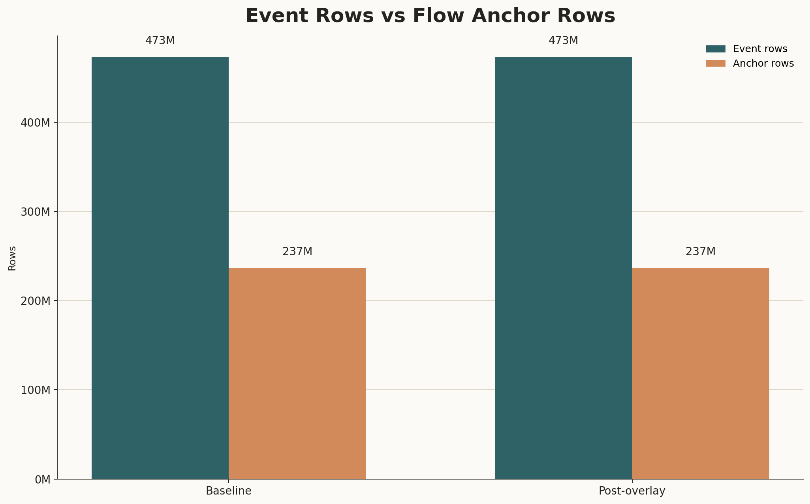
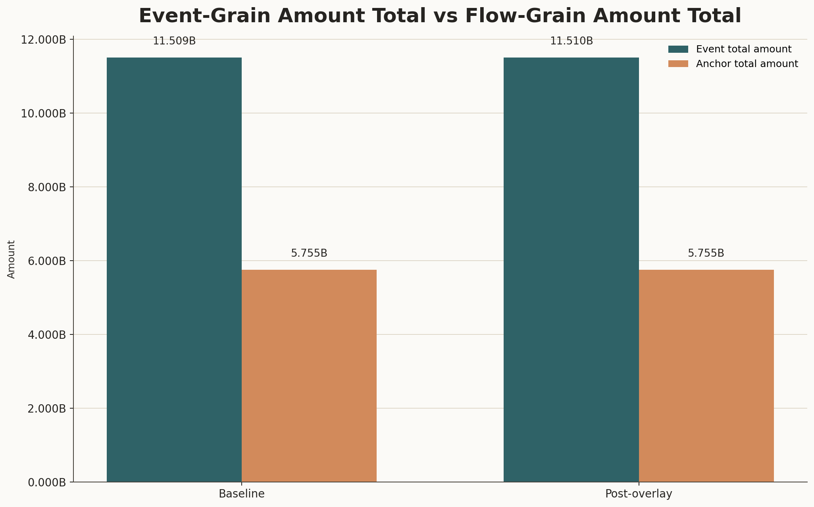
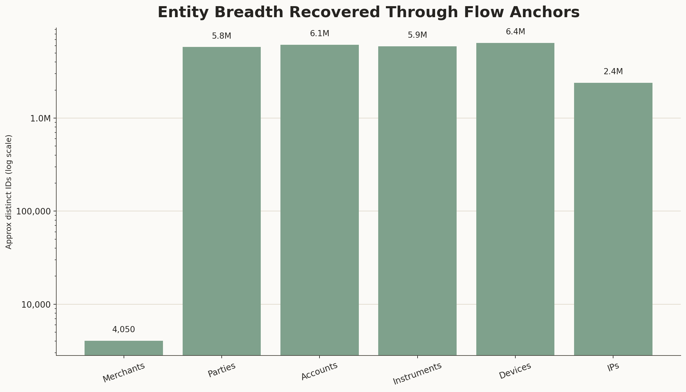
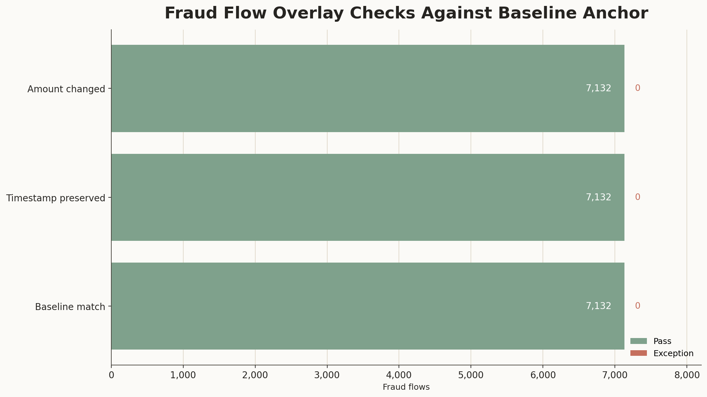
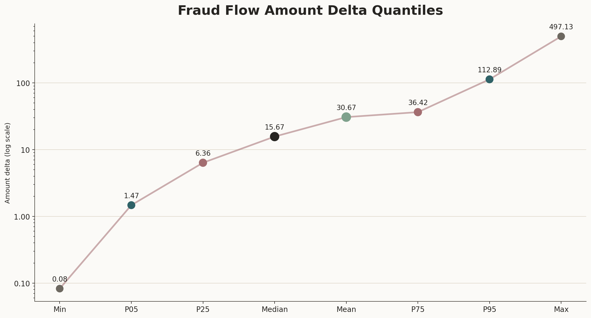

# Branch Investigation: Flow Anchor Contract

## Branch question

The behavioural streams are intentionally thin. They carry the event body:

- `flow_id`
- `event_seq`
- `event_type`
- `ts_utc`
- `amount`
- lineage fields
- post-overlay fraud fields where applicable

This branch asks:

> How do thin event streams recover flow, entity, and amount context through the flow anchors?

The answer is that the flow anchors are the flow-grain context surfaces for the event streams. `s2_event_stream_baseline_6B` is interpreted through `s2_flow_anchor_baseline_6B`; `s3_event_stream_with_fraud_6B` is interpreted through `s3_flow_anchor_with_fraud_6B`. The event streams express the authorization grammar. The anchors carry the one-row-per-flow context needed to make those event rows analytically usable: merchant, arrival, party, account, instrument, device, IP, timestamp, amount, lineage, and post-overlay fraud/campaign fields.

So the anchor contract is not decorative. It is the mechanism that lets a streaming event remain small while still being recoverable into the operating fraud world.

## Evidence used

Primary reports:

- [`../behavioural_context_investigation.md`](../behavioural_context_investigation.md)
- [`../../behavioural_streams/behavioural_streams_investigation.md`](../../behavioural_streams/behavioural_streams_investigation.md)
- [`../../behavioural_streams/branches/baseline_vs_fraud_overlay_contract.md`](../../behavioural_streams/branches/baseline_vs_fraud_overlay_contract.md)

Contract references:

- [`docs/model_spec/data-engine/interface_pack/data_engine_interface.md`](../../../../../../../../docs/model_spec/data-engine/interface_pack/data_engine_interface.md)
- [`docs/model_spec/data-engine/interface_pack/engine_outputs.catalogue.yaml`](../../../../../../../../docs/model_spec/data-engine/interface_pack/engine_outputs.catalogue.yaml)
- [`docs/model_spec/data-engine/layer-3/specs/contracts/6B/dataset_dictionary.layer3.6B.yaml`](../../../../../../../../docs/model_spec/data-engine/layer-3/specs/contracts/6B/dataset_dictionary.layer3.6B.yaml)
- [`docs/model_spec/data-engine/layer-3/specs/contracts/6B/schemas.6B.yaml`](../../../../../../../../docs/model_spec/data-engine/layer-3/specs/contracts/6B/schemas.6B.yaml)

Pinned data surfaces:

- [`runs/local_full_run-7/a3bd8cac9a4284cd36072c6b9624a0c1/data/layer3/6B/s2_event_stream_baseline_6B`](../../../../../../../../runs/local_full_run-7/a3bd8cac9a4284cd36072c6b9624a0c1/data/layer3/6B/s2_event_stream_baseline_6B)
- [`runs/local_full_run-7/a3bd8cac9a4284cd36072c6b9624a0c1/data/layer3/6B/s3_event_stream_with_fraud_6B`](../../../../../../../../runs/local_full_run-7/a3bd8cac9a4284cd36072c6b9624a0c1/data/layer3/6B/s3_event_stream_with_fraud_6B)
- [`runs/local_full_run-7/a3bd8cac9a4284cd36072c6b9624a0c1/data/layer3/6B/s2_flow_anchor_baseline_6B`](../../../../../../../../runs/local_full_run-7/a3bd8cac9a4284cd36072c6b9624a0c1/data/layer3/6B/s2_flow_anchor_baseline_6B)
- [`runs/local_full_run-7/a3bd8cac9a4284cd36072c6b9624a0c1/data/layer3/6B/s3_flow_anchor_with_fraud_6B`](../../../../../../../../runs/local_full_run-7/a3bd8cac9a4284cd36072c6b9624a0c1/data/layer3/6B/s3_flow_anchor_with_fraud_6B)

Branch exports:

- [`event_anchor_field_map.csv`](../../../../exports/interface_world/behavioural_context/branches/flow_anchor_contract/event_anchor_field_map.csv)
- [`event_anchor_pair_profile.csv`](../../../../exports/interface_world/behavioural_context/branches/flow_anchor_contract/event_anchor_pair_profile.csv)
- [`baseline_event_schema.csv`](../../../../exports/interface_world/behavioural_context/branches/flow_anchor_contract/baseline_event_schema.csv)
- [`fraud_event_schema.csv`](../../../../exports/interface_world/behavioural_context/branches/flow_anchor_contract/fraud_event_schema.csv)
- [`baseline_anchor_schema.csv`](../../../../exports/interface_world/behavioural_context/branches/flow_anchor_contract/baseline_anchor_schema.csv)
- [`fraud_anchor_schema.csv`](../../../../exports/interface_world/behavioural_context/branches/flow_anchor_contract/fraud_anchor_schema.csv)
- [`fraud_anchor_amount_delta_distribution.csv`](../../../../exports/interface_world/behavioural_context/branches/flow_anchor_contract/fraud_anchor_amount_delta_distribution.csv)

Parent exports reused:

- [`context_key_reconciliation.csv`](../../../../exports/interface_world/behavioural_context/context_key_reconciliation.csv)
- [`fraud_anchor_vs_baseline.csv`](../../../../exports/interface_world/behavioural_context/fraud_anchor_vs_baseline.csv)
- [`fraud_anchor_overlay_summary.csv`](../../../../exports/interface_world/behavioural_context/fraud_anchor_overlay_summary.csv)
- [`fraud_anchor_campaign_summary.csv`](../../../../exports/interface_world/behavioural_context/fraud_anchor_campaign_summary.csv)

This branch uses compact schema, profile, field-map, key-reconciliation, and amount-delta distribution exports. It does not claim that a full row-level event-to-anchor anti-join was completed inside this branch. That full validation is still a useful engineering check, but the current report only makes claims supported by the compact evidence available here.

## What an anchor is in this operating world

A flow anchor is a one-row-per-flow context record.

In the fraud decisioning platform framing, the event stream is what moves through the traffic path. The anchor is the context surface that lets the platform, replay notebook, offline learner, case reviewer, or analyst recover the flow's business and entity meaning.

The baseline pair is:

- event stream: `s2_event_stream_baseline_6B`
- flow anchor: `s2_flow_anchor_baseline_6B`

The post-overlay pair is:

- event stream: `s3_event_stream_with_fraud_6B`
- flow anchor: `s3_flow_anchor_with_fraud_6B`

That pairing matters because the post-overlay world is not just the baseline world with an extra label column. Fraud overlay can change the amount and add campaign/fraud fields. So if a post-overlay event row needs context, it should be read against the post-overlay anchor, not lazily joined to the baseline anchor unless the analytical question is specifically a baseline-versus-overlay comparison.

## Thin stream, thick anchor

The field map shows the contract clearly.

Common fields carried by both stream and anchor:

- `flow_id`
- `amount`
- `ts_utc`
- `seed`
- `manifest_fingerprint`
- `parameter_hash`
- `scenario_id`

Fields carried by the event stream but not the anchor:

- `event_seq`
- `event_type`

Fields carried by the anchor but not the event stream:

- `arrival_seq`
- `merchant_id`
- `party_id`
- `account_id`
- `instrument_id`
- `device_id`
- `ip_id`

Post-overlay fields carried by both post-overlay stream and post-overlay anchor:

- `fraud_flag`
- `campaign_id`

This is the intended split. The stream keeps the moving event grammar: which flow, which event within the flow, what kind of event, when it occurred, and what amount it carried. The anchor keeps the flow's enrichment context: who the flow belongs to, which merchant and entities are attached, which arrival sequence it came from, and which fraud/campaign state applies after overlay.

That means the event stream alone is not enough for most analytics. It can answer traffic-shape questions, but it cannot answer merchant, party, account, device, IP, or arrival-sequence questions without the anchor.

## Shape reconciliation

The compact profile gives the first structural reconciliation:

| Pair | Event rows | Anchor rows | Event rows per anchor row | Event types | Event sequences |
|---|---:|---:|---:|---:|---:|
| Baseline | `473,383,388` | `236,691,694` | `2.0` | `2` | `2` |
| Post-overlay | `473,383,388` | `236,691,694` | `2.0` | `2` | `2` |

This is the core flow/event relationship at aggregate shape. Each anchor row represents a flow, and the stream has exactly two event rows for every anchor row in aggregate: request and response. So the event stream is not missing the entity columns by accident. It is operating at event grain, while the anchor operates at flow grain.

The amount totals also match that grammar:

| Pair | Event total amount | Anchor total amount | Ratio |
|---|---:|---:|---:|
| Baseline | `11.509B` | `5.755B` | `2.0` |
| Post-overlay | `11.510B` | `5.755B` | `2.0` |

The ratio is not a fraud signal. It is the two-event grammar showing up economically. Because both request and response rows carry the flow amount, the event-stream total is approximately twice the anchor total. This is a denominator warning: event-grain amount totals can double the flow-grain economic surface if the request/response pair is not collapsed.

So if we later build stakeholder-facing amount metrics, we need to decide whether the metric is event-exposure or flow-economic value. For fraud-loss, authorization value, or merchant value, the anchor or a flow-collapsed stream is usually the safer denominator.

## Anchor as entity recovery surface

The anchor is where the thin event row gets its operating identity back.

Both anchor surfaces carry:

- `merchant_id`
- `party_id`
- `account_id`
- `instrument_id`
- `device_id`
- `ip_id`

The approximate anchor cardinality profile is the same in the baseline and post-overlay profiles:

| Entity field | Approx distinct count |
|---|---:|
| Merchants | `4,050` |
| Parties | `5.80M` |
| Accounts | `6.14M` |
| Instruments | `5.93M` |
| Devices | `6.45M` |
| IPs | `2.39M` |

This is what makes the anchor operationally important. Without it, the stream can tell us that `flow_id = X` had an authorization request and response. With it, the same flow can be placed into the merchant/customer/device/IP world needed by RTDL enrichment, offline feature work, replay, case review, and entity-level investigation.

The anchor is therefore not only a join convenience. It is the boundary between traffic grammar and fraud-platform context.

## Baseline and post-overlay anchors are the same flow universe

The parent key reconciliation gives strong compact evidence that the baseline and post-overlay anchors are aligned:

| Surface | Rows | Arrival-key hash | Flow-key hash |
|---|---:|---|---|
| `s1_arrival_entities_6B` | `236,691,694` | same as anchors | n/a |
| `s2_flow_anchor_baseline_6B` | `236,691,694` | same as arrival entities | same as post-overlay anchor |
| `s3_flow_anchor_with_fraud_6B` | `236,691,694` | same as arrival entities | same as baseline anchor |

This strongly supports a clear read: the post-overlay anchor is not behaving like a new population of flows. The compact evidence says it carries the same row count and the same flow/arrival key hash surface as the baseline anchor, then modifies selected flow attributes and adds fraud/campaign state.

The parent profiles also show a single pinned lineage context for both anchors: one `seed`, one `manifest_fingerprint`, one `parameter_hash`, and one `scenario_id`. Under that single-context run, the fraud-flow comparison from the parent export confirms the overlay behaviour for the positive class:

| Metric | Value |
|---|---:|
| Fraud flows | `7,132` |
| Matched baseline flows | `7,132` |
| Missing baseline flows | `0` |
| Same timestamp rows | `7,132` |
| Same amount rows | `0` |
| Mean amount delta | `+30.67` |
| Minimum amount delta | `+0.08` |
| Maximum amount delta | `+497.13` |

For fraud flows inside this pinned context, the anchor relationship says: the selected flow keys match back to baseline, timing is preserved, amount is changed, and fraud/campaign state is added. That is the observed overlay contract at flow grain.

This is also why the correct analytical comparison is not "did fraud create new traffic?" At least for these anchor surfaces, the better question is "which existing flow keys were selected and economically altered?"

## How event streams recover context through anchors

The recovery path is:

1. A stream row arrives with `flow_id`, lineage fields, `event_seq`, `event_type`, `ts_utc`, and `amount`.
2. The platform or offline analysis uses `flow_id` plus lineage context to bind the event row to the matching flow anchor.
3. The anchor supplies `arrival_seq`, merchant context, entity context, IP context, and post-overlay fraud/campaign state where applicable.
4. The event row can now be interpreted as part of a merchant/entity/arrival world instead of as a thin traffic row.

The important grain distinction is that the join is event-to-flow, not event-to-event. The event stream is designed as a two-row request/response grammar at flow grain. The anchor has one row per flow. If the anchor is joined to the stream without collapsing the event grammar, anchor context will be repeated across the event rows in the joined result.

That repetition is not wrong. It is only wrong if the analyst forgets it happened. For event-time operational questions, the repetition may be appropriate. For flow-level merchant, amount, fraud, or loss questions, the joined result must be collapsed back to flow grain or read directly from the anchor.

## What this branch proves and does not prove

This branch proves:

- the event streams are thin by design
- the flow anchors carry the missing merchant/entity/IP/arrival context
- baseline and post-overlay event streams have exactly two event rows per anchor row at aggregate shape
- event amount totals are approximately two times anchor amount totals, consistent with request/response duplication
- compact key reconciliation strongly supports that baseline and post-overlay anchors share the same flow and arrival identity universe
- fraud-marked post-overlay anchor rows all match baseline flows in the parent comparison under the single pinned lineage context
- fraud overlay preserves timestamp and changes amount for those fraud flows

This branch does not prove:

- a completed full-population anti-join showing every single event row has a matching anchor row
- that anchor fields were consumed correctly by a live model or feature service
- that campaign IDs are semantically meaningful without a campaign catalogue or truth/case context
- that event-grain amount totals should be used as economic exposure

The first limitation is important. The aggregate shape is very strong, and the contract is coherent, but a production validation suite should still include a targeted full event-to-anchor coverage check. That check should be engineered carefully because a naive full join over `473.38M` event rows and `236.69M` anchor rows is expensive.

## Time-safety and operating use

Unlike the completed session index, the flow anchors are live-compatible context surfaces in concept. They describe the current flow and its attached entities. That makes them candidates for RTDL context enrichment, event replay, offline training joins, and case reconstruction.

However, live-compatible does not mean every anchor field is automatically safe in every path. The baseline anchor and post-overlay anchor belong to different operating states:

- baseline anchor: context for the baseline stream
- post-overlay anchor: context for the post-overlay stream, including `fraud_flag` and `campaign_id`

For live model scoring, `fraud_flag` and `campaign_id` would not be ordinary decision-time features if they represent injected or later-known fraud state. They are valid for investigation, replay, labelling analysis, and controlled post-overlay experiments, but they must not be casually treated as real-time predictor inputs.

So the safe rule is:

- use anchor identity fields to recover flow context
- keep event and flow grain separate
- choose the anchor matching the stream state being analyzed
- avoid treating post-overlay fraud/campaign fields as live predictor features unless the feature design explicitly permits that state

## Leads exposed by this branch

1. **Full event-to-anchor coverage validation.** The branch has aggregate and compact key evidence, but not a full anti-join proof. If this becomes a platform-quality gate, run it as a targeted engineered validation rather than an ad hoc notebook join.

2. **Flow-grain amount discipline.** Event stream totals can double flow economic value because request and response both carry amount. Future dashboards must decide whether they report event exposure or flow value.

3. **Post-overlay anchor usage.** Fraud/campaign fields are useful for investigation, but they should be classified carefully before any live-feature story.

4. **Anchor-to-truth bridge.** The next truth/case analyses should use anchors to recover entity context for labelled flows, but must avoid double-counting by event row.

5. **Entity-context expansion.** Since anchors carry merchant, party, account, instrument, device, and IP, later fraud analytics can branch into entity reuse, network concentration, and merchant/entity risk posture.

## Working conclusion

The flow anchors are the contract that makes the thin behavioural streams usable.

The stream rows carry the authorization event grammar. The anchors recover the flow's merchant, arrival, entity, IP, amount, and overlay context. The aggregate shape is coherent: the event-row count is twice the anchor-row count, and event amount totals are approximately doubled for the same reason. Compact key reconciliation strongly supports that the baseline and post-overlay anchors share the same flow universe, while fraud overlay changes selected flow amounts and attaches fraud/campaign state.

The practical analytical rule is straightforward: use streams to understand event movement, use anchors to recover flow context, and collapse back to flow grain before making flow-level economic, fraud, or stakeholder claims.

## Appendix: visual evidence and assessment

### Figure A1. Event rows per anchor row

This figure makes the grain contract visible. Both the baseline and post-overlay streams have `473.38M` event rows, while their matching anchor surfaces have `236.69M` flow rows. The relationship is exactly `2.0` event rows per anchor row in the compact profile, which is the expected shape for a two-event authorization grammar: one `AUTH_REQUEST` row and one `AUTH_RESPONSE` row for each flow-level anchor.

The important point is not only that the counts are large. It is that the two surfaces are answering different questions. The event stream is the moving authorization record; it tells us what happened at event grain. The anchor is the flow context record; it tells us what the flow belongs to. If an analyst joins anchor context onto event rows, every flow-level attribute from the anchor will be repeated across the two event rows. That repetition is contract-correct, but it becomes analytically dangerous if a flow-level metric is then summed at event grain.

The figure also shows that the baseline and post-overlay streams preserve the same aggregate grammar. Fraud overlay does not create a third event row, remove an event side, or change the event-to-anchor ratio. What this figure does not prove is a full per-key anti-join showing that every individual event row has a matching anchor row. It supports the structural contract at aggregate shape; full row-level coverage would need a dedicated validation pass.

### Figure A2. Event amount versus anchor amount denominator

This figure shows the economic version of the same grain issue. In the baseline world, the event stream totals about `11.509B` while the anchor totals about `5.755B`. In the post-overlay world, the event stream totals about `11.510B` while the anchor totals about `5.755B`. The event total is approximately twice the anchor total because the request and response rows both carry the flow amount.

That doubling is not a fraud effect and should not be interpreted as extra economic value. It is the authorization grammar appearing in the amount denominator. A flow with amount `x` appears once in the anchor, but twice in the event stream. So if we later build amount dashboards, fraud exposure views, merchant value summaries, or loss-adjacent metrics, we need to decide whether we are describing event exposure or flow economic value. The anchor total, or a stream collapsed back to one row per flow, is the safer denominator for flow-level economic claims.

The small difference between the baseline and post-overlay amount bars is also useful context. It confirms that overlay changes the amount surface slightly, but it does not alter the basic denominator relationship. This figure proves that amount totals are duplicated by event grammar; it does not by itself explain which flows changed or how the fraud overlay selected them. That more specific overlay question is handled by the fraud-anchor checks and amount-delta distribution later in the appendix.

### Figure A3. Anchor entity cardinality profile

This figure shows what the anchor recovers that the thin event stream does not carry. The event stream can identify the flow and event side, but the anchor attaches the flow to the operating entity world: merchants, parties, accounts, instruments, devices, and IPs. The entity breadth is large: about `5.8M` parties, `6.1M` accounts, `5.9M` instruments, `6.4M` devices, and `2.4M` IPs. Merchants sit on a much smaller surface at `4,050`, which is why merchant-level analysis and customer/device/IP-level analysis will have very different denominators.

The log scale matters here. On a linear axis, the merchant count would be visually crushed by the million-scale entity counts, and the reader could miss how different the entity layers are. The figure is not saying that merchants are unimportant because they are fewer. It is saying that merchant context is a compact business surface, while parties/accounts/instruments/devices/IPs form a much broader identity and behaviour surface. That is exactly why the anchor is central to investigation: it is the bridge from a thin authorization event into the entity graph needed for fraud analysis.

The counts should be read as approximate distinct cardinalities from compact profiling, not exact audited set sizes. The figure also does not prove an ownership hierarchy such as merchant-to-party-to-account-to-instrument. It proves breadth of recoverable context fields on the anchor surface. Relationship structure, reuse, fanout, and risk concentration require separate branches or joins.

### Figure A4. Fraud overlay anchor checks

This figure focuses only on the fraud-marked flow subset in the post-overlay anchor. There are `7,132` fraud flows in the comparison. All `7,132` match back to a baseline flow under the single pinned lineage context, all `7,132` preserve timestamp, and all `7,132` have changed amount. The exception side is explicitly shown as zero for each check, which is the key validation point: the observed fraud overlay is not introducing unmatched fraud-flow keys, not shifting their anchor timestamps, and not leaving their anchor amount unchanged.

The statistical meaning is that fraud overlay behaves like an alteration of selected existing flows, not like a separate traffic generator. The platform-facing implication is important. When we analyze fraud rows in this surface, we should not ask whether fraud created new flow identities. The evidence says the better question is which existing flow keys were selected for overlay, how their economic surface changed, and what campaign or truth context explains that selection.

The limit still matters. This is exact for the compared fraud-flow subset under the pinned run context, not a full proof of every event-to-anchor relationship in the entire `473.38M` event-row estate. It also does not prove that the fraud amount changes are realistic from a business standpoint. It proves the mechanical overlay contract for the positive anchor rows: matched baseline identity, timestamp preservation, and amount mutation.

### Figure A5. Fraud flow amount delta quantiles

This figure explains what "amount changed" means for the `7,132` fraud flows. The deltas are all positive, but they are not uniform. The minimum uplift is only about `0.08`, the 5th percentile is `1.47`, the 25th percentile is `6.36`, the median is `15.67`, the mean is `30.67`, the 75th percentile is `36.42`, the 95th percentile is `112.89`, and the maximum is `497.13`. The log scale is appropriate because the distribution spans from cents-level changes to several hundred units; without the log scale, the lower and middle parts of the distribution would be visually flattened by the maximum.

The shape gives us two readings at once. First, most fraud-overlay amount changes are modest: half of the fraud flows receive an uplift of roughly `15.67` or less. Second, the right tail is meaningful: the mean sits above the median, the 95th percentile is much larger than the 75th percentile, and the maximum is far beyond the central mass. That means the overlay amount posture is right-skewed. A small number of larger uplifts pull the average upward, so the mean alone would overstate the typical fraud-flow uplift.

For analytics, this is both useful and cautionary. It gives us a concrete amount-change surface for the post-overlay anchor, but it also reinforces the realism concern we have already started documenting: some fraud-marked flows carry very small economic changes, while the overall fraud population is sparse. This figure does not decide whether the data is fit for stakeholder-facing fraud analytics. It gives us the evidence needed to ask that question more carefully: if later fraud claims depend on economic materiality, we must distinguish positive-class identity from financially material fraud impact.
