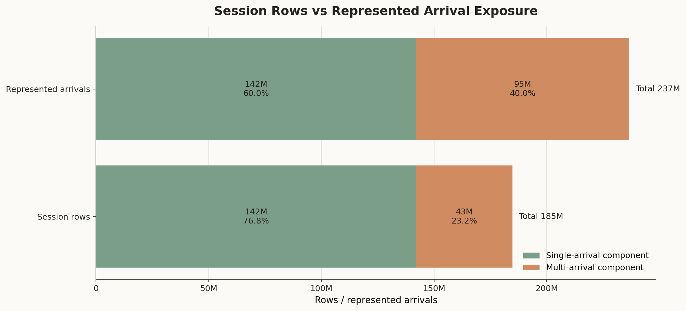
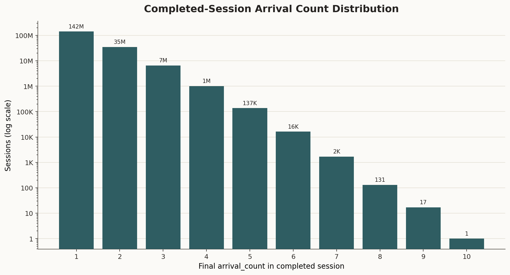
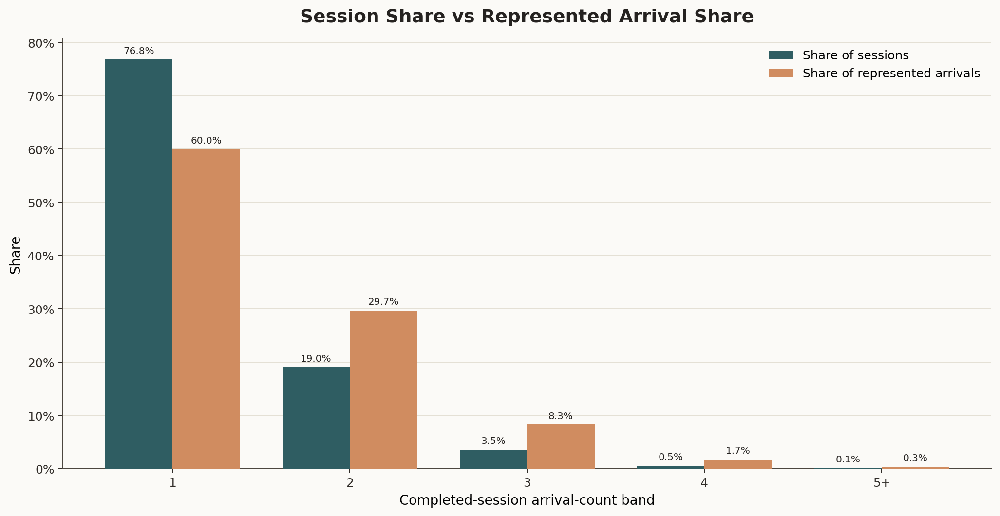
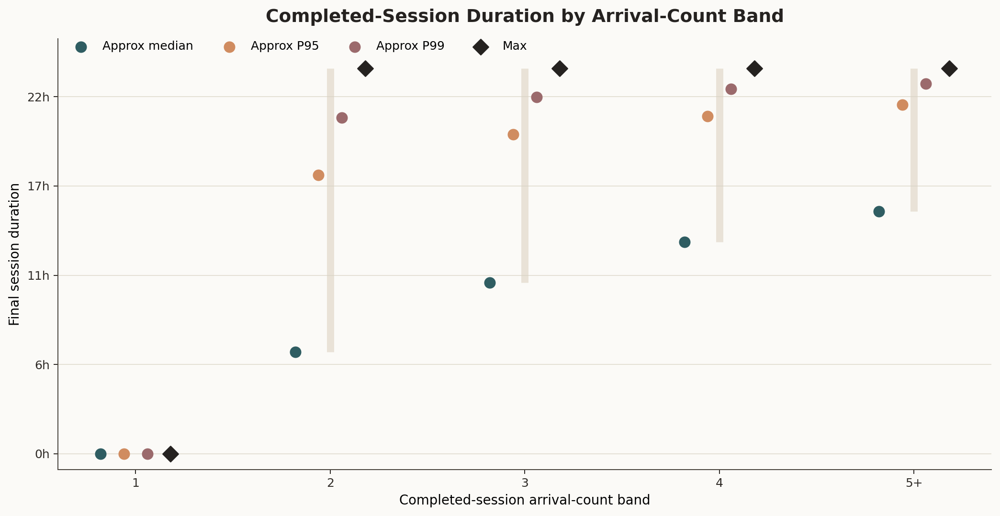
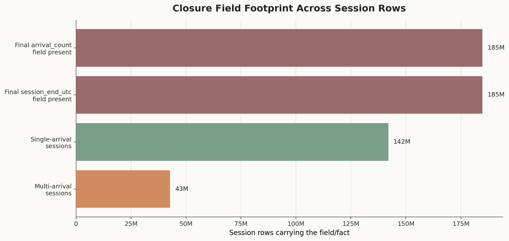
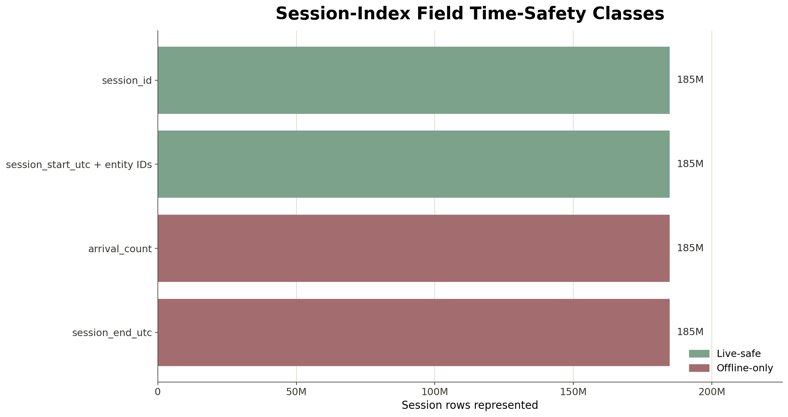

# Branch Investigation: Session Index and Time Safety

## Branch question

The parent behavioural-context investigation established that `s1_session_index_6B` is the session-level context surface exposed in the interface pack. This branch asks:

> Why is session context useful for offline fraud analytics, but dangerous if treated as a live decision-time feature source?

The answer is that `s1_session_index_6B` is a completed-session index. It is valuable because it compresses the arrival world into session units and tells us how many arrivals each completed session carried, when the session began, when it ended, and which merchant/customer-side entities were attached to it. That makes it useful for offline reconstruction, case review, replay analysis, session-level exposure, and post-hoc behavioural summaries.

But the same fields that make it useful offline make it unsafe for live-time modelling if used naively. `session_end_utc` and `arrival_count` require knowledge of the full completed session. At the moment the first arrival in a session is being authorized, the platform cannot know whether that session will end immediately, continue for another arrival, or continue for several more arrivals. So this surface must be treated as offline/session-closure context, not as a hot RTDL feature table.

## Evidence used

Primary report:

- [`../behavioural_context_investigation.md`](../behavioural_context_investigation.md)

Contract references:

- [`docs/model_spec/data-engine/interface_pack/data_engine_interface.md`](../../../../../../../../docs/model_spec/data-engine/interface_pack/data_engine_interface.md)
- [`docs/model_spec/data-engine/interface_pack/engine_outputs.catalogue.yaml`](../../../../../../../../docs/model_spec/data-engine/interface_pack/engine_outputs.catalogue.yaml)
- [`docs/model_spec/data-engine/layer-3/specs/contracts/6B/dataset_dictionary.layer3.6B.yaml`](../../../../../../../../docs/model_spec/data-engine/layer-3/specs/contracts/6B/dataset_dictionary.layer3.6B.yaml)
- [`docs/model_spec/data-engine/layer-3/specs/contracts/6B/schemas.6B.yaml`](../../../../../../../../docs/model_spec/data-engine/layer-3/specs/contracts/6B/schemas.6B.yaml)

Pinned data surface:

- [`runs/local_full_run-7/a3bd8cac9a4284cd36072c6b9624a0c1/data/layer3/6B/s1_session_index_6B`](../../../../../../../../runs/local_full_run-7/a3bd8cac9a4284cd36072c6b9624a0c1/data/layer3/6B/s1_session_index_6B)

Parent exports:

- [`session_index_schema.csv`](../../../../exports/interface_world/behavioural_context/session_index_schema.csv)
- [`session_index_profile.csv`](../../../../exports/interface_world/behavioural_context/session_index_profile.csv)
- [`session_index_nulls.csv`](../../../../exports/interface_world/behavioural_context/session_index_nulls.csv)
- [`session_index_arrival_count_summary.csv`](../../../../exports/interface_world/behavioural_context/session_index_arrival_count_summary.csv)

Branch exports:

- [`session_time_safety_profile.csv`](../../../../exports/interface_world/behavioural_context/branches/session_index_time_safety/session_time_safety_profile.csv)
- [`session_arrival_count_distribution.csv`](../../../../exports/interface_world/behavioural_context/branches/session_index_time_safety/session_arrival_count_distribution.csv)
- [`session_duration_by_arrival_count_band.csv`](../../../../exports/interface_world/behavioural_context/branches/session_index_time_safety/session_duration_by_arrival_count_band.csv)
- [`session_live_safety_classification.csv`](../../../../exports/interface_world/behavioural_context/branches/session_index_time_safety/session_live_safety_classification.csv)

The branch uses compact session summaries and one targeted scan of `s1_session_index_6B` to quantify session closure, duration, and arrival-count structure. It does not scan the behavioural streams or truth products because this branch is about whether the session index itself is time-safe.

## What this surface is

The contract describes `s1_session_index_6B` as one row per session. Its primary key is:

- `seed`
- `manifest_fingerprint`
- `scenario_id`
- `session_id`

The observed columns are:

| Field | Operating meaning in this platform | Time-safety read |
|---|---|---|
| `session_id` | The handle that identifies a session. | Safe as an identifier after it is emitted/known. |
| `session_start_utc` | The timestamp at which the session began. | Safe only once the session has started. |
| `session_end_utc` | The timestamp at which the completed session ended. | Offline closure field; unsafe at session start or before session close. |
| `arrival_count` | The total number of arrivals in the completed session. | Offline closure field; unsafe before the session is complete. |
| `merchant_id` | Merchant attached to the session row. | Context field, but its live safety depends on when the session row is being used. |
| `party_id` | Party attached to the session row. | Context field, but not a substitute for arrival-grain identity binding. |
| `account_id` | Account attached to the session row. | Context field, but not a substitute for fanout evidence. |
| `instrument_id` | Instrument attached to the session row. | Context field, but not a substitute for fanout evidence. |
| `device_id` | Device attached to the session row. | Context field, but not a substitute for fanout evidence. |
| lineage fields | `seed`, `manifest_fingerprint`, `parameter_hash`, `scenario_id`. | Needed for run identity and reproducibility. |

The important distinction is between a session identifier and a completed-session summary. A live system can attach an event to a known `session_id` if the session state is maintained online. That does not mean the final `arrival_count` or final `session_end_utc` is available at the time of the first request.

This is the core time-safety issue. A final session index is a good offline reconstruction surface, but a bad live feature source unless each feature is explicitly converted into an as-of-time version.

## Physical profile

The pinned session index contains:

| Metric | Value |
|---|---:|
| Sessions / rows | `184,820,742` |
| Represented arrivals | `236,691,694` |
| Merchants | `4,050` |
| Minimum session start | `2026-01-01T00:00:00.001940Z` |
| Maximum session end | `2026-03-31T23:59:59.944516Z` |
| Negative-duration sessions | `0` |
| Zero-duration sessions | `141,986,429` |
| Positive-duration sessions | `42,834,313` |
| Single-arrival sessions | `141,986,429` |
| Multi-arrival sessions | `42,834,313` |
| Arrivals inside multi-arrival sessions | `94,705,265` |
| Approx median duration | `0` seconds |
| Approx P95 duration | `45,041` seconds |
| Approx P99 duration | `66,945` seconds |
| Maximum duration | `86,386` seconds |

The surface is complete in required fields and internally coherent: the sum of `arrival_count` exactly reconstructs the `236,691,694` arrival rows. It also has no negative durations. So the issue is not data corruption. The issue is feature timing.

The zero-duration count is exactly the single-arrival session count. That means a session with one arrival is represented as starting and ending at the same timestamp. This is coherent as a completed-session record. It is not safe as a live-time feature because knowing that a session has ended at the first arrival means knowing that no later arrival will occur in that session.

## Arrival-count shape

The arrival-count distribution is:

| Arrival count | Sessions | Session share | Represented arrivals | Represented arrival share |
|---:|---:|---:|---:|---:|
| `1` | `141,986,429` | `76.82%` | `141,986,429` | `59.99%` |
| `2` | `35,140,408` | `19.01%` | `70,280,816` | `29.69%` |
| `3` | `6,525,895` | `3.53%` | `19,577,685` | `8.27%` |
| `4` | `1,013,373` | `0.55%` | `4,053,492` | `1.71%` |
| `5+` | `154,637` | `0.08%` | `793,272` | `0.34%` |

Most sessions are short. `76.82%` of sessions have one arrival, and `95.84%` have one or two arrivals. At arrival grain, single-arrival sessions still represent `59.99%` of arrivals, while two-arrival sessions represent another `29.69%`. So session context exists across the whole operating world, but most of it is not a long behavioural chain.

This matters for stakeholder-facing analytics. If we later say "session behaviour," we should not let the term imply a long web-session journey for most traffic. In this extract, a session is usually a very short operating unit. Session-level analysis can still be valuable, but the evidence says it is mostly useful for short-window reconstruction, not for long-horizon behavioural narratives.

## Duration and closure behaviour

Duration follows the arrival-count structure:

| Arrival-count band | Sessions | Represented arrivals | Approx median duration | Approx P95 duration | Approx P99 duration | Max duration |
|---|---:|---:|---:|---:|---:|---:|
| `1` | `141,986,429` | `141,986,429` | `0s` | `0s` | `0s` | `0s` |
| `2` | `35,140,408` | `70,280,816` | `22,839s` | `62,417s` | `75,367s` | `86,386s` |
| `3` | `6,525,895` | `19,577,685` | `38,367s` | `71,525s` | `79,885s` | `86,385s` |
| `4` | `1,013,373` | `4,053,492` | `47,452s` | `75,623s` | `81,717s` | `86,363s` |
| `5+` | `154,637` | `793,272` | `54,314s` | `78,217s` | `82,882s` | `86,334s` |

The duration profile is coherent. More arrivals per session generally means longer sessions. The maximum duration is just under one day, which suggests the session construction is bounded inside a daily-style operating horizon rather than allowing arbitrarily long sessions.

That coherence is exactly why the index is useful offline. It lets us reconstruct completed session windows and inspect how traffic clusters inside them. For case review, this can answer questions such as:

- was this flow isolated or part of a short repeated session?
- how many arrivals occurred in the same completed session?
- was the session a single-arrival event or a multi-arrival sequence?
- how long did the completed session last?
- which merchant and customer-side handles were attached to the session row?

But this same coherence is why the surface is dangerous for live-time features. If a model uses final duration, final `arrival_count`, or final `session_end_utc` while scoring the first or middle arrival, it has been given information from the future. The model would learn from a completed-session outcome that was not available at the time of decision.

## Why `arrival_count` is the clearest leakage field

`arrival_count` looks harmless because it is just a count. It is not harmless.

At live time, the count the platform can know is an as-of count: how many arrivals have occurred in this session up to the current event. The `arrival_count` in `s1_session_index_6B` is different. It is the final count after the session has ended.

For a session with `arrival_count = 3`, using that value on the first arrival tells the model that two more arrivals will happen later. For a session with `arrival_count = 1`, using that value on the first arrival tells the model that no later arrival will happen. Both are future knowledge. The single-arrival case is easy to overlook because the value is small, but it is still a completed-session fact.

So the problem is not only the `42.83M` multi-arrival sessions. The closure field exists on all `184.82M` session rows. The analytical rule is:

- final `arrival_count` is valid for offline reconstruction, labelling, case review, and post-hoc analysis
- final `arrival_count` is not valid as a live decision-time feature unless transformed into an as-of count from online state

## Why `session_end_utc` is also unsafe

`session_end_utc` has the same issue in timestamp form.

At session start, the platform can know the start time. It cannot know the final end time unless the session has already ended. If a live feature uses the final session end, final duration, or any derivative such as "session length" before closure, the feature leaks future session state.

For one-arrival sessions, `session_end_utc` equals `session_start_utc`. That is coherent after the fact. It is not a safe live signal at the moment of authorization because it says the session closes immediately. For multi-arrival sessions, the end timestamp can be many hours after the first arrival. The duration table shows approximate P95 duration of `62,417s` for two-arrival sessions and `78,217s` for `5+` sessions. Those end times are plainly unavailable at the beginning of the session.

So `session_end_utc` should be read as a session-closure timestamp. It is valuable offline, but it is not a live feature source.

## What remains useful for live-time reasoning

This does not mean sessions are useless to the live fraud platform. It means the final session index is the wrong object to use directly.

A live-safe session feature would need to be built as an online/as-of projection, for example:

- current known `session_id`
- session age so far
- arrivals seen so far in the current session
- time since previous arrival in the same session
- rolling amount or count up to the current event
- current merchant/account/device/session state as of the event timestamp

Those features are not the same as the final `arrival_count`, final duration, or final `session_end_utc` in `s1_session_index_6B`. The distinction is not technical pedantry. It is the difference between a model that could run honestly in the live fraud decisioning path and a model that only performs well because it sees the future.

The current branch does not verify whether such online session projections already exist elsewhere. It only classifies `s1_session_index_6B` itself.

## A small contract caution

The dataset dictionary description says the session index includes party/device/IP relationships and anchor metadata. The observed schema and parent export include `party_id`, `account_id`, `instrument_id`, `device_id`, and `merchant_id`, but not `ip_id`.

That means `s1_session_index_6B` should not be used as the sole source for session-IP analysis. IP context is available on `s1_arrival_entities_6B`, and any session-IP claim should be built by joining or grouping from arrival-grain context rather than assuming the session index directly carries IP.

This is not a blocker for the current branch, but it is a useful traceability note. The session index is a session closure surface, not a complete identity graph.

## What this surface can and cannot support

The session index can support:

- offline session reconstruction
- case review around completed sessions
- replay/debug context after the fact
- session-level exposure summaries
- post-hoc comparison of single-arrival and multi-arrival sessions
- offline training labels or features only when the modelling question explicitly allows completed-session knowledge

The session index cannot safely support:

- live RTDL features using final `arrival_count`
- live RTDL features using final `session_end_utc`
- live RTDL features using final session duration
- claims about real-time model behaviour unless features are rebuilt as as-of-time projections
- IP-session analytics without joining back to arrival entity context

The safe analytical wording is therefore not "session features are bad." The correct wording is "completed-session features are offline-only unless converted into live as-of features."

## Leads exposed by this branch

1. **As-of session feature branch.** If we later need live session features, the next question is how to derive online-safe versions such as arrivals-so-far and session-age-so-far.

2. **Session versus fraud branch.** The current branch does not join to truth products. A later branch can test whether fraud flows are more likely to sit in single-arrival or multi-arrival sessions, but it must state whether the view is offline-only.

3. **Session-IP bridge.** Since `s1_session_index_6B` does not directly carry `ip_id`, session-IP analysis should be built through `s1_arrival_entities_6B`.

4. **Session duration realism.** Multi-arrival sessions can span many hours, with upper bounds just under a day. That may be acceptable for the synthetic operating world, but it is a realism point worth remembering before making strong stakeholder claims about user session behaviour.

## Working conclusion

`s1_session_index_6B` is a coherent completed-session surface. It covers `184.82M` sessions, reconstructs `236.69M` arrivals through `arrival_count`, has no required-field missingness, and has no negative durations. It is therefore useful for offline reconstruction, case review, replay, and post-hoc session analytics.

It is not live-safe as a direct feature source. The fields that make it analytically useful, especially `arrival_count`, `session_end_utc`, and final duration, are closure fields. They tell us what the session became after completion, not what the platform could know at the moment of authorization.

The practical rule for the fraud decisioning platform is simple: use `session_id` and online-maintained as-of session state in live paths; use `s1_session_index_6B` for offline reconstruction and completed-session analysis. Mixing those two would create temporal leakage and would overstate what the live system could honestly know.

## Appendix: visual evidence and assessment

### Figure A1. Session rows versus represented arrival exposure

This figure separates two denominators that can easily be confused: session rows and represented arrival exposure. The session index has `184.82M` completed-session rows, but those rows reconstruct `236.69M` arrivals once `arrival_count` is summed. The single-arrival component is the same absolute count in both bars, `141.99M`, because one single-arrival session contributes exactly one arrival. The difference appears in the multi-arrival component: `42.83M` multi-arrival sessions expand into `94.71M` represented arrivals.

The statistical point is that session-grain and arrival-grain answers are not interchangeable. A session-weighted statement describes a typical completed session, while an arrival-weighted statement describes the exposure seen by authorization traffic. Single-arrival sessions dominate session rows at `76.8%`, but they account for a smaller `60.0%` of represented arrivals. Multi-arrival sessions are only `23.2%` of sessions but contribute `40.0%` of represented arrivals. That is why later analytics must state the denominator explicitly. A fraud or behaviour pattern that looks small at session grain may represent a much larger share of live arrival exposure.

The figure supports the claim that `s1_session_index_6B` is a coherent reconstruction surface: the completed-session rows expand cleanly into the arrival estate. It does not prove that final session fields are live-safe. In fact, the expansion is part of the leakage caution. The completed row already knows whether a session stayed single-arrival or became multi-arrival, which is not necessarily knowable when the first authorization request is being scored.

### Figure A2. Completed-session arrival-count distribution

The arrival-count distribution falls sharply as final session size increases. The log scale is necessary because the head and tail are separated by many orders of magnitude: `141.99M` sessions have one arrival, `35.14M` have two, `6.53M` have three, and the estate continues down to a single observed session with ten arrivals. On a linear axis, the tail would visually disappear, which would hide the fact that longer completed sessions exist even though they are rare.

The operational meaning is that this platform's session surface is not mainly a long browsing-journey surface. It is mostly a short operating unit: one-arrival sessions dominate, two-arrival sessions are substantial, and longer sessions rapidly become exceptional. That matters for how we speak about "session behaviour" later. If we use session language with stakeholders, we should not imply that most customers or merchants are producing long multi-step session journeys. The evidence says the typical completed session is short.

The figure also clarifies why `arrival_count` is such a sensitive field. The final count is a compact summary of the future shape of the session. For a one-arrival session, it says no later arrival occurred. For a two-arrival or larger session, it says additional arrivals occurred after the session opened. Those statements are valid after completion, but unsafe if injected into a model before those later arrivals have either happened or failed to happen.

### Figure A3. Session share versus represented arrival share

This view keeps the same arrival-count bands but compares their share of completed sessions against their share of represented arrivals. The one-arrival band shows the strongest denominator gap: `76.8%` of sessions but only `60.0%` of arrivals. Every multi-arrival band moves in the opposite direction. Two-arrival sessions are `19.0%` of sessions but `29.7%` of represented arrivals; three-arrival sessions are `3.5%` of sessions but `8.3%` of represented arrivals; the smaller four and `5+` bands also carry more arrival exposure than their session share alone would suggest.

The point is not just that multi-arrival sessions exist. The point is that they are exposure-amplifying at arrival and authorization grain. A completed session with multiple arrivals receives more chances to appear in flow-level and authorization-level reads than a single-arrival session. If we later compare fraud rates, review burden, or behavioural outcomes by session type, a session-weighted read and an arrival-weighted read may answer different questions. Session weighting answers "what kind of completed sessions do we have?" Arrival weighting answers "what kind of session context does live traffic encounter?"

This figure does not say multi-arrival sessions are riskier. It does not join to fraud labels or case outcomes. It only establishes the denominator discipline needed before making that kind of claim. The safe conclusion is that multi-arrival sessions are a minority of completed sessions but a larger part of operating exposure, so they cannot be dismissed simply because their session count is smaller.

### Figure A4. Completed-session duration by arrival-count band

The duration profile confirms that final session length is tied to final arrival count. One-arrival sessions sit at zero duration across the plotted summary points, which is expected because a single-arrival completed session starts and ends on the same event. Once a session has two or more arrivals, the median duration becomes positive and rises with the arrival-count band. The approximate median moves from about `6.34h` for two-arrival sessions to about `15.09h` for the `5+` band. The upper quantiles and maximum values cluster below the one-day boundary, with maxima just under `24h`.

The statistical reality behind the figure is a mixture of coherence and caution. Coherence comes from the monotonic shape: sessions with more arrivals generally last longer, and the maximum is bounded rather than unbounded. That supports the view that the session index was built under a consistent session-window rule. The caution comes from the same facts. Final duration and final end time are completed-session facts. They are excellent for offline reconstruction and post-hoc analysis, but they would leak future knowledge if used during a live authorization decision before the session has closed.

The figure also helps separate two different questions. It supports the internal consistency of the session construction; it does not automatically validate the realism of the session policy. Multi-arrival sessions can span many hours, so if a later stakeholder analysis interprets sessions as normal customer checkout sessions, that assumption should be checked. In this platform extract, "session" may be better understood as a bounded operating grouping rather than a short web visit in every case.

### Figure A5. Closure field footprint across session rows

This figure shows why the leakage issue is not limited to a small tail of unusual sessions. The final `arrival_count` and final `session_end_utc` fields are present across the full `184.82M` session rows. The same surface also separates single-arrival sessions from multi-arrival sessions, showing that the final closure fields cover both parts of the estate. That means even a one-arrival session row carries completed-session knowledge: it tells us the session did not continue.

The key inference is that live-safety cannot be decided by looking only at whether a session is multi-arrival. Multi-arrival rows make the issue obvious because later arrivals plainly exist. Single-arrival rows are more subtle but still time-sensitive because the completed record says the session ended immediately. At the first authorization event, the platform may know the session has started, but it cannot honestly know the final closure state unless the online session logic has already closed it under an explicit as-of rule.

The figure proves field footprint, not modelling harm by itself. It does not show that a particular model used these fields incorrectly. What it establishes is that the raw session index contains closure information everywhere, so any modelling or analytics workflow that imports the surface directly must classify fields before use. The safe posture is to allow this surface for offline reconstruction and case review, while requiring as-of projections for live features.

### Figure A6. Session-index field time-safety classes

This figure turns the time-safety argument into a field-level classification. `session_id` and session-opening context are live-compatible concepts because an online system can maintain those values as-of the current arrival. That does not mean they should be sourced directly from `s1_session_index_6B` inside the live decision path; in this branch, the session index itself remains a completed-session surface. `arrival_count` and `session_end_utc` are classified as offline-only because they describe the completed session. All four fields cover the same `184.82M` session rows, so the difference is not coverage. The difference is whether the value can be known as-of authorization without looking ahead.

That distinction is the practical rule this branch is trying to preserve. A field can be complete, clean, and analytically useful while still being unsafe for live decisioning when read from the wrong surface. Completeness tells us whether the data is populated. Time-safety tells us whether the platform could have known the value at the moment of authorization from an online/as-of source. `arrival_count` and `session_end_utc` pass the first test and fail the second if used naively as live features.

The figure should therefore be read as a usage map, not as a quality score. The offline-only fields are not bad data. They are good completed-session data. The problem would arise only if we crossed the operating boundary and treated completed-session facts as if they were available inside the live fraud decisioning path. For notebook work, dashboarding, and stakeholder analysis, this figure anchors the rule: use completed-session fields for retrospective analysis, but rebuild session features as as-of-time projections before making live model claims.
