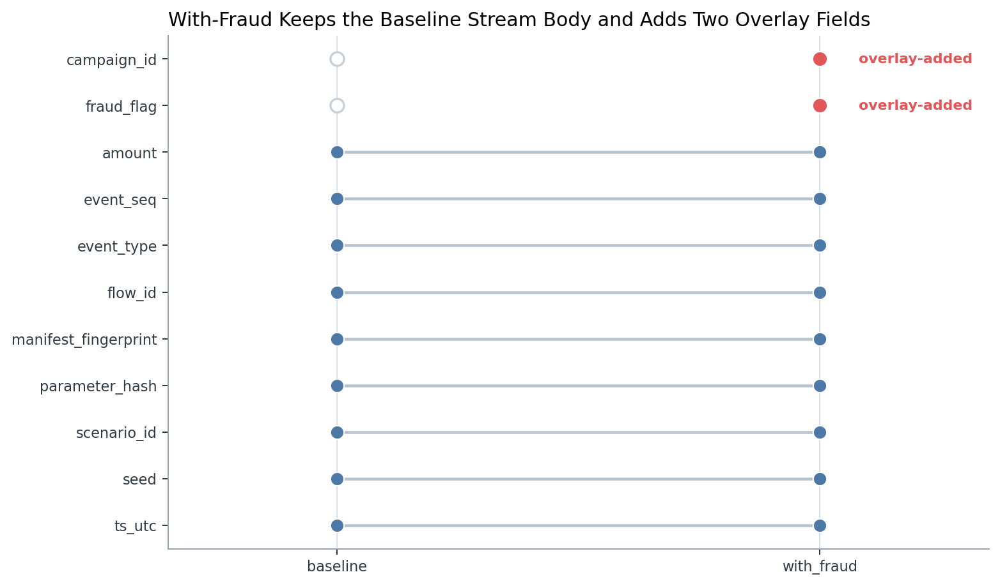
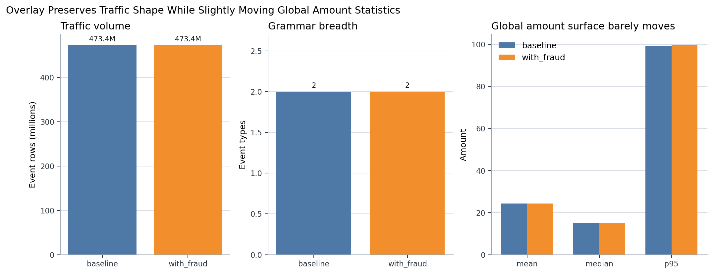
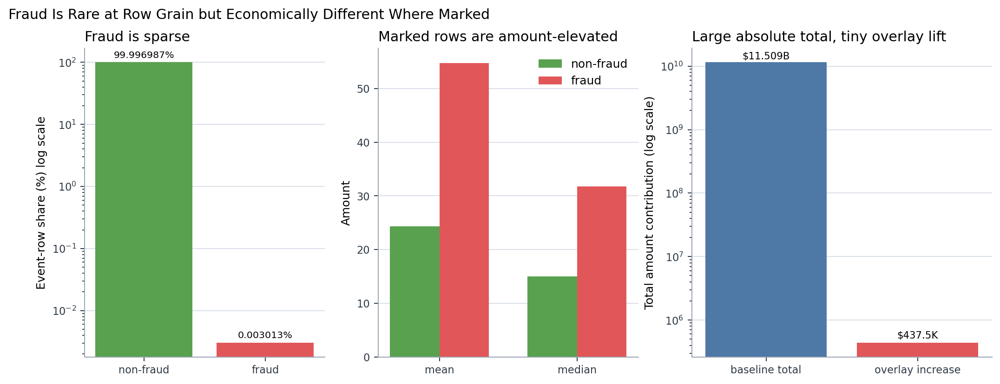
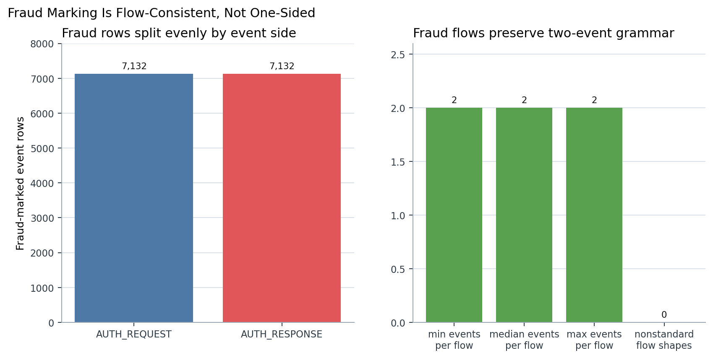
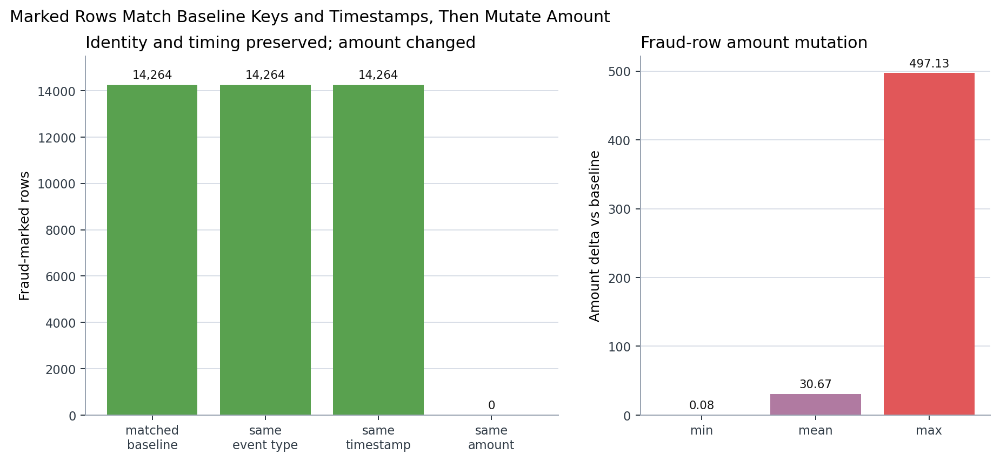
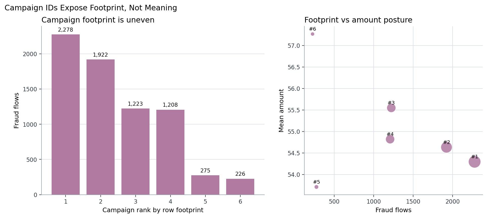
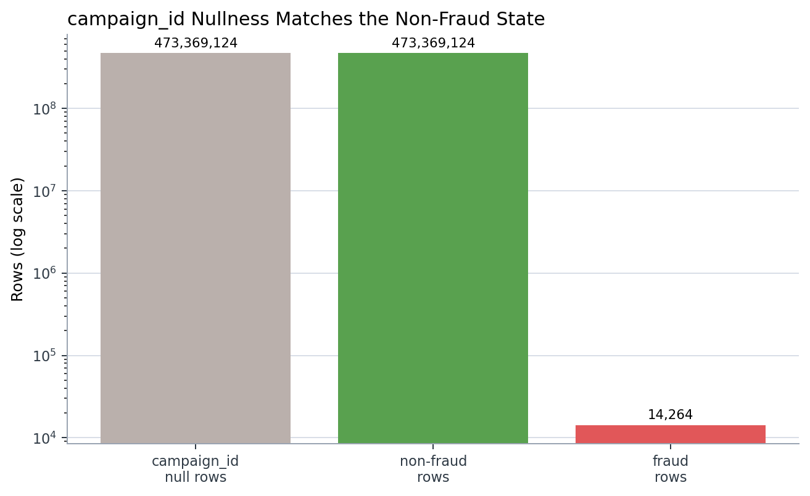
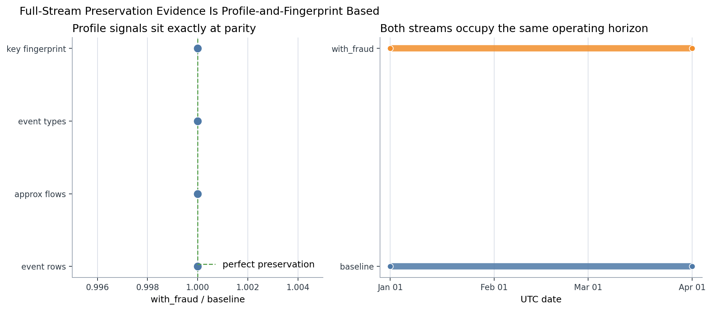
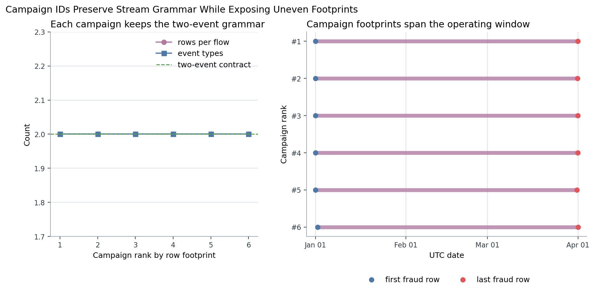

# Branch Investigation: Baseline vs Fraud Overlay Contract

## Branch question

The parent behavioural-stream investigation established that `s2_event_stream_baseline_6B` and `s3_event_stream_with_fraud_6B` have the same broad traffic shape, while the post-overlay stream adds fraud fields. This branch asks the contract question more directly:

> Is `s3_event_stream_with_fraud_6B` a new traffic population, or is it an overlay on the baseline event stream?

The short answer is that the with-fraud stream behaves as an overlay on the baseline traffic contract. It does not add event rows, event types, or a new timing universe. It preserves the event grammar and adds two overlay fields, `fraud_flag` and `campaign_id`. For the rows marked fraud, the overlay matches the baseline event key and timestamp, then changes the economic value carried by `amount`.

That contract matters operationally. In the live fraud decisioning platform, the with-fraud stream should be read as the same traffic body after fraud behaviour has been injected, not as a second independent stream of extra transactions. The analytical comparison is therefore not "how many new events did fraud add?" The comparison is "which existing event keys were marked, and how did their attributes change?"

## Evidence used

Primary report:

- [`behavioural_streams_investigation.md`](../behavioural_streams_investigation.md)

Branch script:

- [`analyze_behavioural_baseline_vs_fraud_overlay_contract.py`](../../../../scratch/analyze_behavioural_baseline_vs_fraud_overlay_contract.py)

Branch exports:

- [`stream_contract_profile.csv`](../../../../exports/interface_world/behavioural_streams/branches/baseline_vs_fraud_overlay_contract/stream_contract_profile.csv)
- [`baseline_with_fraud_contract_delta.csv`](../../../../exports/interface_world/behavioural_streams/branches/baseline_vs_fraud_overlay_contract/baseline_with_fraud_contract_delta.csv)
- [`schema_overlay_contract.csv`](../../../../exports/interface_world/behavioural_streams/branches/baseline_vs_fraud_overlay_contract/schema_overlay_contract.csv)
- [`stream_key_fingerprint.csv`](../../../../exports/interface_world/behavioural_streams/branches/baseline_vs_fraud_overlay_contract/stream_key_fingerprint.csv)
- [`with_fraud_overlay_summary.csv`](../../../../exports/interface_world/behavioural_streams/branches/baseline_vs_fraud_overlay_contract/with_fraud_overlay_summary.csv)
- [`fraud_rows_vs_baseline.csv`](../../../../exports/interface_world/behavioural_streams/branches/baseline_vs_fraud_overlay_contract/fraud_rows_vs_baseline.csv)
- [`fraud_flag_by_event_type.csv`](../../../../exports/interface_world/behavioural_streams/branches/baseline_vs_fraud_overlay_contract/fraud_flag_by_event_type.csv)
- [`fraud_flow_shape.csv`](../../../../exports/interface_world/behavioural_streams/branches/baseline_vs_fraud_overlay_contract/fraud_flow_shape.csv)
- [`campaign_overlay_summary.csv`](../../../../exports/interface_world/behavioural_streams/branches/baseline_vs_fraud_overlay_contract/campaign_overlay_summary.csv)
- [`baseline_nulls.csv`](../../../../exports/interface_world/behavioural_streams/branches/baseline_vs_fraud_overlay_contract/baseline_nulls.csv)
- [`with_fraud_nulls.csv`](../../../../exports/interface_world/behavioural_streams/branches/baseline_vs_fraud_overlay_contract/with_fraud_nulls.csv)
- [`baseline_vs_fraud_overlay_contract_summary.json`](../../../../exports/interface_world/behavioural_streams/branches/baseline_vs_fraud_overlay_contract/baseline_vs_fraud_overlay_contract_summary.json)

The branch is built from compact summaries already produced in the behavioural-stream investigation. It does not rerun the full raw-stream comparison. The exact row-level comparison in this branch is limited to the fraud-marked rows joined back to baseline under the single pinned lineage context for this run: `seed = 42`, one `parameter_hash`, one `manifest_fingerprint`, and `scenario_id = baseline_v1` in both streams. For the full non-fraud key universe, the evidence is profile-and-fingerprint evidence: same row count, same approximate flow count, same event-type count, same event-sequence range, same timestamp horizon, and same summed hash fingerprint over `flow_id + event_seq`. That is strong profiling evidence of preservation, but it is not the same thing as a full anti-join proof over every non-fraud event key.

## Schema contract: the overlay adds columns, not a new event grammar

The schema comparison shows that the with-fraud stream keeps the baseline event body and adds two fields:

| Column | In baseline | In with-fraud | Overlay-added |
|---|---:|---:|---:|
| `amount` | yes | yes | no |
| `campaign_id` | no | yes | yes |
| `event_seq` | yes | yes | no |
| `event_type` | yes | yes | no |
| `flow_id` | yes | yes | no |
| `fraud_flag` | no | yes | yes |
| `manifest_fingerprint` | yes | yes | no |
| `parameter_hash` | yes | yes | no |
| `scenario_id` | yes | yes | no |
| `seed` | yes | yes | no |
| `ts_utc` | yes | yes | no |

This is the first contract-level read. The with-fraud stream is not structurally broader in the sense of carrying merchant, session, case, or truth context directly in the stream. It remains the same thin traffic event stream, but with fraud overlay metadata added.

`fraud_flag` is the binary marker that says whether an event row belongs to the fraud overlay. `campaign_id` is the campaign handle for fraud-marked traffic. The null pattern supports this interpretation: `campaign_id` is null for `473,369,124` rows, exactly matching the non-fraud row count. That makes `campaign_id` nullness a semantic state rather than a missing-data problem:

- non-fraud event row -> no campaign ID
- fraud event row -> campaign ID present

So the overlay contract is not "every row gets a campaign." The contract is "only the rows selected into the fraud campaign layer carry a campaign identity."

## Traffic-shape preservation

At the broad stream-contract level, baseline and with-fraud have the same traffic body:

| Metric | Baseline | With-fraud | Delta |
|---|---:|---:|---:|
| Rows | `473,383,388` | `473,383,388` | `0` |
| Approx flows (profiling) | `244,190,267` | `244,190,267` | `0` |
| Event types | `2` | `2` | `0` |
| Minimum event sequence | `0` | `0` | `0` |
| Maximum event sequence | `1` | `1` | `0` |
| Minimum UTC timestamp | `2026-01-01T00:00:00.001940Z` | `2026-01-01T00:00:00.001940Z` | same |
| Maximum UTC timestamp | `2026-04-01T00:01:41.104298Z` | `2026-04-01T00:01:41.104298Z` | same |

The key fingerprint profile also matches:

| Stream | Rows | Approx flows (profiling) | Key hash sum over `flow_id + event_seq` |
|---|---:|---:|---:|
| `baseline` | `473,383,388` | `244,190,267` | `4.365982797643315e+27` |
| `with_fraud` | `473,383,388` | `244,190,267` | `4.365982797643315e+27` |

The correct interpretation is preservation, not expansion. The with-fraud stream does not increase the event-row count and does not add another event side to the grammar. The approximate flow count is a profiling metric, not exact identity evidence; the stronger preservation signal here is the combination of unchanged row count, unchanged grammar, unchanged horizon, and matching key fingerprint. Together, those show that the with-fraud stream preserves the two-event authorization shape and changes selected attributes inside that stream.

There is one evidence caveat. The branch has not performed a full exact anti-join across all `473M` event keys. The exact join evidence is for the fraud-marked subset. For the full stream, we rely on same row count, same grammar, same horizon, and matching hash fingerprint. That is enough to support the branch's analytical posture, but if this were an audit-control proof of full key identity, the next step would be a bounded or distributed exact key anti-join.

## Fraud layer scale

The fraud overlay is extremely sparse at event-row grain:

| Fraud flag | Rows | Row share | Campaigns | Mean amount | Median amount | Max amount |
|---|---:|---:|---:|---:|---:|---:|
| `false` | `473,369,124` | `99.996987%` | `0` | `24.31` | `14.99` | `3,401.78` |
| `true` | `14,264` | `0.003013%` | `6` | `54.76` | `31.75` | `729.73` |

This is an important denominator point. The fraud layer is not a large alternate traffic body. It is a very small subset of the same stream. At row grain, only about `0.003%` of events are fraud-marked. That means most full-stream aggregate metrics will barely move, even when fraud-marked rows themselves differ materially from normal traffic.

That is exactly what the amount-surface deltas show:

| Metric | Baseline | With-fraud | Delta |
|---|---:|---:|---:|
| Total amount | `11,509,248,225.40` | `11,509,685,771.69` | `437,546.30` |
| Mean amount | `24.312742` | `24.313666` | `0.000924` |
| Median amount | `14.991537` | `14.995169` | `0.003632` |
| P95 amount | `99.443375` | `99.712272` | `0.268898` |

The total amount increases by about `437.5K`, but that is only about `0.0038%` of the baseline total amount. The fraud rows are materially higher-value than non-fraud rows, but they are so sparse that the global stream surface barely changes. This is why the fraud story cannot be understood from whole-stream averages alone. We need both views:

- full-stream view: the overlay preserves traffic scale and barely moves global summaries
- fraud-subset view: the marked rows have a different economic profile

### Realism and calibration lead

This branch exposes a realism concern for any later stakeholder-facing fraud analytics. The fraud overlay is structurally clean, but it is extremely sparse: `14,264` fraud-marked rows inside `473,383,388` event rows, with `7,132` exact fraud flows inside an approximate `244.2M`-flow behavioural surface. That is a very low fraud incidence for a run intended to support realistic fraud-rate, fraud-loss, campaign, or decisioning conclusions.

The amount posture is also low-impact at portfolio scale. Fraud-marked rows are amount-elevated relative to non-fraud rows, but the fraud median is `31.75`, and the total amount lift is only about `437.5K` against an `11.5B` stream amount surface. Low-ticket fraud can be realistic in card-testing, credential validation, digital goods abuse, or probe-transaction scenarios. It is less convincing as a broad fraud-loss world unless later truth/case surfaces introduce stronger severity, escalation, or campaign semantics.

So the current extract should not be treated as fully calibrated for serious stakeholder fraud analytics. It remains valid for understanding the overlay contract, keyed mutation, grain, and event-flow mechanics. But the fraud generation policy may need a future recalibration pass before we rely on this run for business-facing conclusions about fraud incidence or financial exposure.

## Fraud event grammar is balanced

The fraud rows preserve the request/response grammar:

| Event type | Fraud flag | Rows | Share within event type |
|---|---:|---:|---:|
| `AUTH_REQUEST` | `false` | `236,684,562` | `99.996987%` |
| `AUTH_REQUEST` | `true` | `7,132` | `0.003013%` |
| `AUTH_RESPONSE` | `false` | `236,684,562` | `99.996987%` |
| `AUTH_RESPONSE` | `true` | `7,132` | `0.003013%` |

The exact fraud-flow shape confirms the same point:

| Fraud flows | Minimum events per flow | Median events per flow | Maximum events per flow | Nonstandard flow shapes |
|---:|---:|---:|---:|---:|
| `7,132` | `2` | `2` | `2` | `0` |

This means the overlay is flow-consistent for fraud-marked traffic. A fraud-marked flow has both event sides represented. Fraud is not appearing as a one-sided event artifact where only request rows or only response rows were selected.

That matters for downstream labels and case workflows. If fraud were marked only on one event side, any flow-level analysis would need special reconstruction rules. Here, the fraud overlay is already aligned with the stream grammar: one fraud-marked request row and one fraud-marked response row per fraud flow.

## What changes on fraud-marked rows

The exact comparison back to baseline was performed for the `14,264` fraud-marked rows:

| Check | Rows |
|---|---:|
| Fraud rows | `14,264` |
| Matched baseline rows | `14,264` |
| Missing baseline rows | `0` |
| Same event type rows | `14,264` |
| Same timestamp rows | `14,264` |
| Same amount rows | `0` |

The amount deltas are:

| Delta metric | Amount delta |
|---|---:|
| Mean amount delta | `+30.67` |
| Minimum amount delta | `+0.08` |
| Maximum amount delta | `+497.13` |

This is the clearest contract evidence in the branch. For the fraud-marked subset, the overlay does not create new event keys under the pinned single-lineage context, does not alter the event type, and does not alter the timestamp. It selects existing baseline event keys and changes `amount`. In platform language, the fraud overlay changes the economic signal that downstream decisioning, learning, and investigation would see, while preserving the event-bus identity and timing envelope for the marked rows.

This also tells us how not to compare the streams. A naive row-count comparison will say "nothing changed" because the row count is preserved. A naive full-stream mean comparison will also understate the change because fraud rows are rare. The correct comparison is keyed: locate the marked event keys, compare them back to their baseline versions, and inspect which attributes were preserved and which were mutated.

## Campaign IDs are exposed, but not self-explaining

The overlay exposes six campaign IDs. Their row and flow counts are:

| Campaign rank | Rows | Flows | Event types | Mean amount | Time span |
|---:|---:|---:|---:|---:|---|
| 1 | `4,556` | `2,278` | `2` | `54.30` | Jan 1 to Mar 31 |
| 2 | `3,844` | `1,922` | `2` | `54.64` | Jan 1 to Mar 31 |
| 3 | `2,446` | `1,223` | `2` | `55.55` | Jan 1 to Mar 31 |
| 4 | `2,416` | `1,208` | `2` | `54.82` | Jan 1 to Mar 31 |
| 5 | `550` | `275` | `2` | `53.71` | Jan 1 to Mar 31 |
| 6 | `452` | `226` | `2` | `57.27` | Jan 1 to Mar 31 |

Every campaign has two event types, and each campaign's row count is exactly twice its flow count. That preserves the same event grammar inside the campaign layer.

The campaign IDs are not self-explaining. At this stage, we can say how large each campaign footprint is, whether the grammar is preserved, and how the campaign amounts behave. We should not infer campaign semantics from the hashed IDs alone. Their business meaning would need to be read from the campaign catalogue or later truth/case context.

## What this proves and what it does not prove

This branch proves that the with-fraud stream preserves the stream-level event grammar and adds fraud overlay fields. It also proves, for the fraud-marked subset under the pinned single-lineage context, that every fraud row matches a baseline event key, preserves event type, preserves timestamp, and changes amount.

It does not prove full key identity for every non-fraud row through an exact all-stream anti-join. The branch's full-stream preservation claim is based on matching profile and fingerprint evidence. That is acceptable for the current investigative branch, but an audit-grade reconciliation would need an exact full-key comparison using a warehouse/distributed posture.

It also does not explain the meaning of the six campaign IDs. The stream exposes campaign handles, not campaign definitions. The definitions would need to be read from the campaign catalogue or later truth/case context.

## Leads exposed by this branch

1. The with-fraud stream should be analyzed as an overlay on the baseline traffic body, not as an appended fraud population.

2. Fraud is sparse at event-row grain, so full-stream averages will hide most fraud-specific behaviour.

3. Fraud-marked rows preserve event key, event type, and timestamp while changing amount.

4. Fraud marking is flow-consistent: every fraud flow has both request and response rows.

5. `campaign_id` nullness is semantic, not a completeness defect.

6. Campaign IDs require a later semantic bridge; the stream alone gives footprint, not campaign meaning.

7. If a future audit requires full baseline/with-fraud reconciliation, the next step is an exact key anti-join over the full stream, not another profile comparison.

## Working conclusion

The baseline stream is the clean traffic contract. The with-fraud stream is the same traffic contract after a sparse, campaign-tagged fraud overlay has been applied.

The overlay preserves the event-bus shape and changes selected economic values. That makes the with-fraud stream analytically different from baseline, but not because it adds a new traffic population. It is different because a tiny set of existing event keys has been marked, campaign-tagged, and amount-mutated while the surrounding stream remains structurally stable.

## Appendix: visual evidence

### Figure 1. Schema overlay contract

The first figure makes the schema contract visible as a before-and-after surface rather than as a table of column names. Most fields are connected from `baseline` to `with_fraud`, which means they exist on both sides of the stream comparison: `flow_id`, `event_seq`, `event_type`, `ts_utc`, lineage fields, and `amount` remain part of the same event body. The two fields that do not connect back to baseline are `campaign_id` and `fraud_flag`; they appear only on the with-fraud side and are marked as overlay-added.

That distinction is the first important guardrail for the branch. The with-fraud stream is not carrying a broader operating object with new merchant context, case context, or truth context attached to every row. It is the same thin behavioural event stream with two additional fraud-layer fields. The plot therefore supports the contract reading that `s3_event_stream_with_fraud_6B` should be treated as an overlay on the baseline stream, not as a separately authored population of events.

The figure does not prove row identity by itself. A shared schema can still hide row-level differences. Its role is narrower: it shows that the structural change between the two surfaces is limited to overlay metadata, which is why the later preservation and keyed-comparison figures matter.

### Figure 2. Contract shape and amount delta

This figure separates two questions that can easily be confused. The first two panels ask whether the with-fraud stream expands the traffic contract. It does not: both streams carry `473.4M` event rows and both retain the same two-event grammar. The event count and grammar breadth sit at parity, so the fraud overlay is not producing another stream of extra transaction events.

The third panel asks a different question: if the traffic body is preserved, does the amount surface move? The answer is yes, but only slightly at the global stream level. The mean, median, and P95 amount bars are almost visually on top of each other, which is consistent with the branch table where the mean changes by less than one tenth of a cent and the median changes by less than half a cent. That does not mean fraud had no effect. It means the denominator is enormous, so sparse fraud mutations are diluted when read through whole-stream summary statistics.

The right inference is therefore two-part. The with-fraud stream preserves the broad operating contract, and the global amount surface barely shifts because the changed rows are rare relative to the full event body. This figure should not be used to conclude that fraud rows are economically normal; Figure 3 and Figure 5 address the fraud subset directly.

### Figure 3. Fraud sparsity and amount contrast

The left panel shows why full-stream averages are a weak lens for this branch. Fraud-marked rows are only `0.003013%` of the with-fraud event stream, while non-fraud rows make up `99.996987%`. The y-axis is logarithmic because a normal linear scale would visually crush the fraud bar into the baseline. This is a denominator warning: row-grain fraud is present, but it is extremely sparse.

The middle panel then shows why the sparse subset still matters. Fraud-marked rows have higher mean and median amounts than non-fraud rows. The mean amount for fraud-marked rows is about `54.76`, compared with about `24.31` for non-fraud rows; the median is also higher, around `31.75` versus `14.99`. The fraud subset is therefore not just a random sliver of the same amount distribution. It carries a different economic posture.

The right panel puts both facts together. The baseline total amount is roughly `$11.509B`, while the overlay lift is roughly `$437.5K`, so the overlay is visible in absolute value but small relative to the full amount surface. This is why the branch needs both full-stream and fraud-subset views. The full-stream view tells us the operating surface is preserved; the fraud-subset view tells us the marked rows are materially different.

### Figure 4. Fraud event-side balance

This figure checks whether fraud marking respects the behavioural stream grammar. The left panel shows that fraud-marked rows are split evenly across `AUTH_REQUEST` and `AUTH_RESPONSE`: `7,132` rows on each side. That matters because the behavioural stream is not a single-row transaction table; it is a two-event authorization flow. A fraud overlay that marked only one side would create a reconstruction problem for any downstream flow-level analysis.

The right panel confirms the same point at flow grain. Fraud flows have a minimum, median, and maximum of two events per flow, and there are zero nonstandard fraud flow shapes. In practical terms, each fraud-marked flow carries the expected request and response pair. The overlay does not appear to create partial fraud flows, orphan response rows, or request-only fraud artifacts.

This figure supports flow consistency, not campaign meaning. It tells us the fraud overlay is aligned with the event grammar of the stream. It does not tell us why a flow was selected, what campaign logic selected it, or what business scenario each campaign represents.

### Figure 5. Fraud-row preservation and mutation

This is the strongest row-level evidence in the branch. The left panel focuses only on the `14,264` fraud-marked rows and compares them back to baseline under the pinned single-lineage context. Every fraud-marked row matches a baseline row, every matched row keeps the same event type, and every matched row keeps the same timestamp. The `same amount` bar is zero, which is the visible break in the pattern: identity and timing are preserved, but amount is deliberately changed.

The right panel quantifies the size of that change. The minimum amount increase is small but positive, the mean increase is about `30.67`, and the largest increase is about `497.13`. This means the mutation is not merely a binary label being attached to an unchanged event. The fraud overlay changes the economic signal that the live fraud decisioning platform would see on those event keys.

The figure also defines the correct analytical comparison. A row-count comparison would miss the effect because no rows are added. A full-stream average would mute the effect because the fraud rows are sparse. The useful comparison is keyed: find the marked rows, join them back to their baseline versions, and ask which attributes were preserved and which were mutated. The limitation remains that this exact row-level proof is for the fraud-marked subset, not for every non-fraud row in the `473M`-row stream.

### Figure 6. Campaign overlay footprint

This figure treats `campaign_id` as an exposed footprint rather than as an interpretable campaign label. The left panel ranks the six campaigns by fraud-flow count. The first two campaigns are much larger than the last two: rank 1 has `2,278` fraud flows, rank 2 has `1,922`, while ranks 5 and 6 have only `275` and `226`. The campaign layer is therefore uneven; it is not six equally sized partitions of fraud traffic.

The right panel compares footprint against mean amount. The largest campaigns do not simply occupy the highest mean amount positions. Campaign 6 is the smallest by flow count but has the highest mean amount, while campaign 1 is the largest by footprint but has a lower mean amount than several smaller campaigns. That tells us campaign size and campaign amount posture are related surfaces worth tracking separately.

The figure should not be read as a semantic explanation of the campaigns. The IDs are handles. From this stream alone, we can measure footprint, row/flow consistency, and amount posture, but we cannot infer what each campaign was designed to represent. That semantic bridge belongs to the campaign catalogue or downstream truth/case context.

### Figure 7. Campaign ID null semantics

This figure addresses whether `campaign_id` nulls are a data-quality defect or a meaningful state. The count of `campaign_id` null rows exactly matches the count of non-fraud rows: `473,369,124`. Fraud rows account for the remaining `14,264` rows and carry campaign identity. The log scale is necessary because the non-fraud body is several orders of magnitude larger than the fraud body.

The interpretation is that `campaign_id` is conditionally populated. It is not supposed to exist for every behavioural event row. It exists when a row belongs to the fraud overlay and remains null when the row is outside the campaign layer. That is important for completeness checks: treating all campaign nulls as missing values would produce a false alarm over almost the entire stream.

This figure does not say the campaign IDs themselves are correct, meaningful, or complete as business definitions. It only establishes that the null pattern aligns with fraud state. Campaign-level meaning still needs to come from a surface that defines campaigns, not from the presence or absence of the ID alone.

### Figure 8. Stream profile preservation evidence

This figure visualizes the preservation claim without pretending it is a full key-level reconciliation. The left panel expresses several profile signals as `with_fraud / baseline` ratios. Event rows, approximate flows, event types, and the key hash fingerprint all sit exactly on the parity line at `1.0`. This says the with-fraud stream has the same broad event body and the same fingerprint profile as the baseline stream.

The right panel shows that both streams occupy the same UTC operating horizon, from the beginning of January through the slight April spillover already discussed in the time-coverage branch. The with-fraud stream is not shifted into a different time window and is not adding an additional period of traffic. It is aligned to the same operating extract.

The caution in this figure is important. A parity plot is strong profiling evidence, especially when multiple signals agree, but it is not the same as a full exact anti-join over every event key. The branch has exact keyed evidence for the fraud-marked rows. For the non-fraud universe, this figure supports preservation at profile/fingerprint level and identifies what an audit-grade follow-up would need to tighten.

### Figure 9. Campaign grammar and time span

This figure checks whether the campaign layer respects the same grammar and temporal footprint visible in the broader fraud overlay. The left panel shows that each campaign has two rows per flow and two event types. Both lines sit on the two-event contract, which means campaign membership is not breaking the request/response structure. Even the smallest campaigns preserve the expected event-pair shape.

The right panel shows that each campaign spans the operating window rather than appearing as a narrow burst in a single week or month. The first and last fraud-row markers for all campaigns extend across January to late March or the April boundary. This matters because campaign footprint is not only a count question. A small campaign that spans the whole period has a different operating meaning from a small campaign concentrated into one short incident window.

Taken together with Figure 6, the campaign layer has uneven footprint and slightly different amount posture, but it remains structurally coherent. Campaign IDs partition fraud-marked traffic without breaking stream grammar or collapsing into short isolated bursts. The figure still does not explain campaign semantics; it only shows that the exposed campaign handles behave like stable overlay partitions across the extract.
