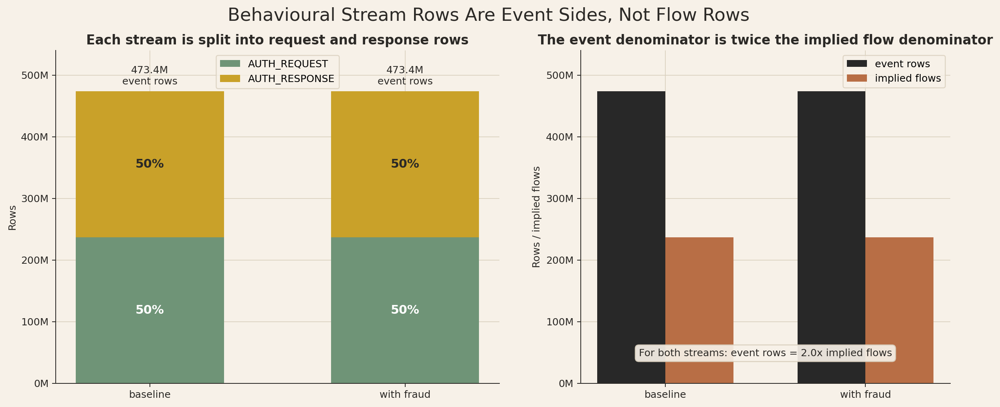
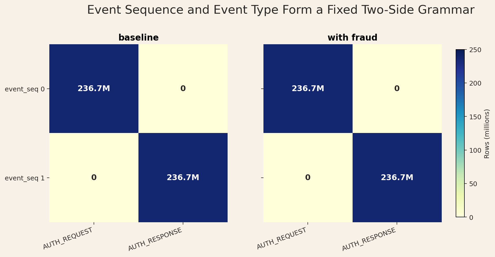
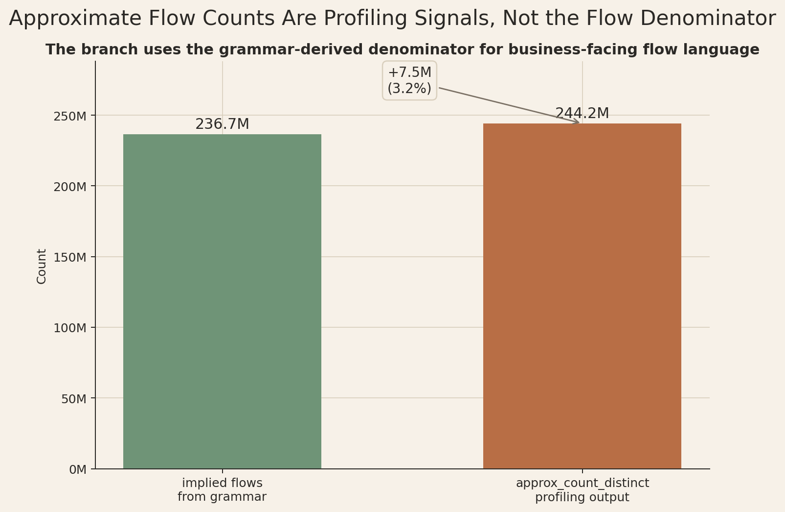
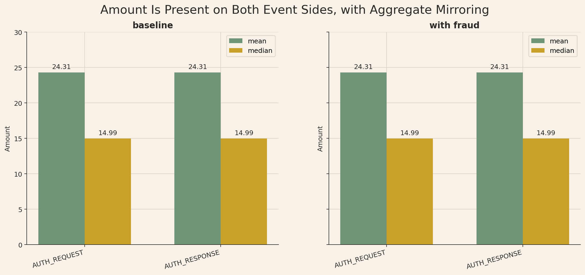
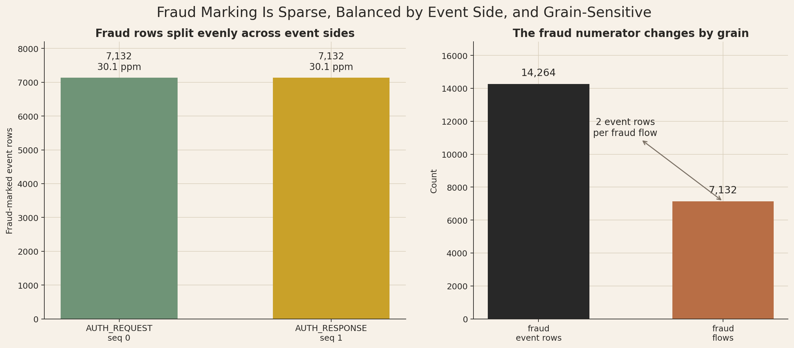

# Branch Investigation: Behavioural Stream Event Grammar and Grain

## Branch question

The main behavioural-stream investigation established that `s2_event_stream_baseline_6B` and `s3_event_stream_with_fraud_6B` are not arrival skeletons. They are platform traffic streams. This branch asks the next grain question:

> What does one behavioural-stream row represent, and how should `flow_id`, `event_seq`, and `event_type` be read before we compute rates, volumes, fraud shares, or downstream joins?

The short answer is that one row is one authorization event side, not one business flow. The stream presents a two-side authorization grammar:

1. `event_seq = 0`, `event_type = AUTH_REQUEST`
2. `event_seq = 1`, `event_type = AUTH_RESPONSE`

That means event-row counts are twice the implied authorization-flow count under the stream contract. Any later analysis that wants flow-level behaviour must collapse or select the request/response side deliberately; any analysis that stays at event-row grain must be explicit that it is measuring platform event traffic, not unique flows.

## Evidence used

Primary report:

- [`behavioural_streams_investigation.md`](../behavioural_streams_investigation.md)

Branch script:

- [`analyze_behavioural_event_grammar_and_grain.py`](../../../../scratch/analyze_behavioural_event_grammar_and_grain.py)

Branch exports:

- [`stream_event_flow_grain.csv`](../../../../exports/interface_world/behavioural_streams/branches/event_grammar_and_grain/stream_event_flow_grain.csv)
- [`event_seq_type_shape.csv`](../../../../exports/interface_world/behavioural_streams/branches/event_grammar_and_grain/event_seq_type_shape.csv)
- [`amount_surface_by_event_side.csv`](../../../../exports/interface_world/behavioural_streams/branches/event_grammar_and_grain/amount_surface_by_event_side.csv)
- [`fraud_balance_by_event_side.csv`](../../../../exports/interface_world/behavioural_streams/branches/event_grammar_and_grain/fraud_balance_by_event_side.csv)
- [`baseline_overlay_key_fingerprint.csv`](../../../../exports/interface_world/behavioural_streams/branches/event_grammar_and_grain/baseline_overlay_key_fingerprint.csv)
- [`event_grammar_and_grain_summary.json`](../../../../exports/interface_world/behavioural_streams/branches/event_grammar_and_grain/event_grammar_and_grain_summary.json)

The branch deliberately uses compact exports from the main behavioural-stream pass rather than performing another full raw-stream materialization. A full exact flow-pair self-join across the whole stream would be expensive and is not needed for the branch's immediate grain finding. The claims here are therefore framed around the exact row/sequence balances, the contract grammar, the fraud-flow checks already performed in the main investigation, and the existing stream fingerprint evidence. Where the evidence is aggregate rather than pairwise, the report says so explicitly.

## One row is an event side, not a flow

Both streams have the same event-grain shape:

| Stream | Event rows | Request rows | Response rows | Request minus response | Implied flows | Event rows per implied flow |
|---|---:|---:|---:|---:|---:|---:|
| `baseline` | `473,383,388` | `236,691,694` | `236,691,694` | `0` | `236,691,694` | `2.0` |
| `with_fraud` | `473,383,388` | `236,691,694` | `236,691,694` | `0` | `236,691,694` | `2.0` |

This is the first discipline point. The stream is not one row per transaction-flow in the way a business analyst might casually say "transactions." It is one row per authorization event side. The row count is doubled under the declared grammar: the stream has one request-side population and one response-side population of the same size.

That does not make the doubling an error. In a live fraud decisioning platform, the request and response phases are different operational moments. The request side is what the decisioning path sees as the authorization comes in. The response side records the outcome-side event in the stream grammar. The contract says these sides belong to the same flow identity, but they remain separate stream events.

The consequence is straightforward:

- If the question is "how many event messages moved through the platform?", use event-row grain.
- If the question is "how many authorization flows occurred?", collapse to flow grain or select one event side under the declared request/response grammar.
- If the question is "what share of flows were fraudulent?", do not use raw event rows unless the numerator and denominator both preserve the same two-event grammar.
- If the question is "what did the RTDL path see as traffic?", event grain may be the correct operating view because event messages are what the stream carries.

## `event_seq` and `event_type` form a fixed grammar

The grammar is exact in both streams:

| Stream | `event_seq` | `event_type` | Rows | Row share |
|---|---:|---|---:|---:|
| `baseline` | `0` | `AUTH_REQUEST` | `236,691,694` | `50.0%` |
| `baseline` | `1` | `AUTH_RESPONSE` | `236,691,694` | `50.0%` |
| `with_fraud` | `0` | `AUTH_REQUEST` | `236,691,694` | `50.0%` |
| `with_fraud` | `1` | `AUTH_RESPONSE` | `236,691,694` | `50.0%` |

There are only two sequence values: `0` and `1`. There are only two event types: `AUTH_REQUEST` and `AUTH_RESPONSE`. At the aggregate stream level, the mapping is stable: `0` is request, and `1` is response.

This means `event_seq` is not just a row-order decoration. It is part of the event identity and part of the stream contract. `flow_id` identifies the flow handle, while `event_seq` identifies the side of the flow. Treating `flow_id` alone as unique would be a grain error because the declared key requires `event_seq` to distinguish event rows.

The contract read supports the same point. The primary key includes:

`seed + manifest_fingerprint + scenario_id + flow_id + event_seq`

The join key adds `parameter_hash`:

`seed + manifest_fingerprint + parameter_hash + scenario_id + flow_id + event_seq`

So the platform's own identity contract says that `event_seq` is required to distinguish rows. A downstream join that drops `event_seq` will risk turning a one-row event join into a two-row flow join.

## Approximate flow counts should not be used as exact flow counts

The earlier broad profile exported an `approx_flows` field from `approx_count_distinct(flow_id)`. In this branch, that field is useful only as a rough profiling signal. It should not be read as the true flow count.

The approximate estimator reports about `244.2M` flows for each event side, while the sequence-balanced row count gives `236,691,694` implied authorization flows under the stream grammar. The latter is the cleaner operating number for this branch because it comes from the observed request/response row balance and the declared two-side event contract.

This matters because the difference should not be interpreted as fraud-platform behaviour. The `approx_flows` field came from an approximate distinct-count estimator, so it is not suitable as the business-facing flow count here. If a later report says there are `244.2M` flows, it would be importing profiling noise into a place where the grammar already gives us a cleaner count.

The discipline is:

- Use `473,383,388` when discussing event rows.
- Use `236,691,694` when discussing implied authorization flows.
- Avoid using `approx_flows = 244,190,267` as a business-facing flow count.

## The aggregate amount surface is mirrored across the two event sides

The request and response sides have the same broad aggregate amount surface:

| Stream | Event type | Rows | Mean amount | Median amount | Maximum amount |
|---|---|---:|---:|---:|---:|
| `baseline` | `AUTH_REQUEST` | `236,691,694` | `24.3127` | `14.99` | `3,401.78` |
| `baseline` | `AUTH_RESPONSE` | `236,691,694` | `24.3127` | `14.99` | `3,401.78` |
| `with_fraud` | `AUTH_REQUEST` | `236,691,694` | `24.3137` | `14.99` | `3,401.78` |
| `with_fraud` | `AUTH_RESPONSE` | `236,691,694` | `24.3137` | `14.99` | `3,401.78` |

The important point is not that request and response are economically different. At aggregate level, the amount field is present on both sides of the authorization grammar and has the same central mean/median profile on request and response rows. That is useful operationally because both event sides can stand as event messages with the economic signal present.

But it creates an analytical trap. The branch evidence proves aggregate mirroring, not pairwise equality for every `flow_id`. Even with that limitation, the correct discipline is clear: do not sum both request and response sides as if they were independent business transactions. That may be valid if the question is "amount-bearing event payload passing through the stream," but it is unsafe if the question is "transaction value processed by the business." For business-value questions, the analysis should collapse to flow grain, explicitly choose one event side, or run a dedicated pairwise amount check before making a total-value claim.

This is one of the clearest examples of why grain is not a cosmetic concern. The same field, `amount`, means different things depending on whether the denominator is event messages or flows.

## Fraud marking preserves the two-sided grammar

Fraud marking in the post-overlay stream is also balanced across the two event sides:

| Event sequence | Event type | Fraud flag | Rows | Share within event type |
|---:|---|---|---:|---:|
| `0` | `AUTH_REQUEST` | `false` | `236,684,562` | `99.996987%` |
| `0` | `AUTH_REQUEST` | `true` | `7,132` | `0.003013%` |
| `1` | `AUTH_RESPONSE` | `false` | `236,684,562` | `99.996987%` |
| `1` | `AUTH_RESPONSE` | `true` | `7,132` | `0.003013%` |

This matters because fraud could have appeared as a one-sided marker. For example, a weaker stream contract might mark only the request row or only the response row. That is not what we see here. At aggregate level, the same number of fraud-marked rows exists on the request side and on the response side.

The main behavioural-stream report also performed the stronger per-fraud-flow check: `7,132` fraud flows have exactly two fraud-marked events each, with `0` nonstandard fraud-flow shapes. That lets us read the fraud-marked subset at either event grain or flow grain as long as we respect the two-event multiplier:

- fraud event rows: `14,264`
- fraud flows: `7,132`
- fraud rows per fraud flow: `2`

So a raw fraud-row count is not wrong, but it is an event count. For the fraud-marked subset, the checked fraud-flow shape shows that the flow count is half of the fraud-event count because the overlay marks both sides of the same authorization flow.

## Baseline and post-overlay streams keep the same event-key shape

The broad key-fingerprint export shows the same row count and the same `flow_id + event_seq` hash fingerprint for baseline and post-overlay streams:

| Stream | Rows | Key hash fingerprint |
|---|---:|---:|
| `baseline` | `473,383,388` | `4.365982797643315e+27` |
| `with_fraud` | `473,383,388` | `4.365982797643315e+27` |

This is supporting evidence that the overlay is not changing the event grammar or appending an additional traffic population. It is best read as a compact key-shape fingerprint: the two streams have the same row count and the same aggregate `flow_id + event_seq` hash sum.

We should not read the fingerprint as a substitute for every possible exact join assertion. The main investigation already checked the fraud-marked rows back to baseline and found that all `14,264` fraud rows match baseline rows on `flow_id + event_seq`, preserve event type, and preserve timestamp. This branch's grain point is narrower: the post-overlay stream should be compared to baseline at the same event-key grain, not as a separate population of extra events.

## Working interpretation

The behavioural stream is a thin, regular authorization-event stream. Its row grain is event side. Its flow grain is the paired request/response authorization flow.

That gives us a strict rule for later analysis:

- Event bus, ingestion-load, stream-volume, and RTDL-message questions can legitimately operate at event-row grain.
- Fraud incidence, transaction value, customer/merchant exposure, and case-level questions usually need flow grain or a clearly chosen event side.
- `flow_id` alone is a flow handle, not a unique event-row key.
- `event_seq` is required for event-row identity.
- `amount` is mirrored across request and response sides at aggregate level, so business-value analysis should choose a side, collapse to flow grain, or run a pairwise amount check before summing both sides.
- Fraud rows are balanced across request and response, and the fraud-marked subset has already passed a per-flow two-event shape check, so fraud-row counts must be translated carefully into fraud-flow counts.

This branch therefore closes the first behavioural-stream denominator issue. Before asking what the stream says about fraud, amount, campaigns, or time, we must decide whether we are reading event traffic or authorization flows.

## Leads carried forward

- The time boundary branch should decide whether reporting windows use request time, response time, flow start, or flow completion, especially because of the small April spillover.
- The overlay branch should inspect baseline-vs-post-overlay changes at event-key grain, not by treating the overlay as a separate event population.
- The amount branch should explicitly separate event-payload amount exposure from deduplicated flow-level transaction value.
- The behavioural-context investigation should test whether context surfaces join cleanly at `flow_id` or require event-side specificity for some joins.

## Appendix: visual evidence and assessment

The figures below are the visual evidence for the branch's grain discipline. They are not meant to decorate the report; they make the denominator problem visible. The same behavioural stream can be read as event traffic, implied authorization flows, request/response grammar, amount-bearing payload exposure, or fraud-flow numerator evidence. The correct reading depends on which denominator the analysis is using.

### A1. Event rows versus implied flows

This figure shows the core grain problem in the behavioural streams. The left panel keeps the stream at event-row grain: both the baseline and post-overlay streams have `473.4M` event rows, split exactly into a request-side half and a response-side half. This is why the behavioural stream cannot be casually described as one row per transaction flow. It is one row per authorization event side.

The right panel makes the denominator conversion explicit. The event-row denominator is `473.4M`; the implied authorization-flow denominator under the two-side grammar is `236.7M`. The relationship is `2.0x`, not because the data is duplicated accidentally, but because the stream intentionally represents two operational sides of the authorization lifecycle. The request side and response side are separate event messages in the platform traffic stream.

The figure proves the row/sequence balance and the event-vs-implied-flow multiplier. It does not prove pairwise request/response equality for every `flow_id`; that distinction remains important because this branch is intentionally using compact aggregate evidence rather than a full raw-stream self-join. Even so, the visual is enough to establish the practical discipline: event-volume analysis can use `473.4M` rows, while flow-level language should not use that row count as if it were unique transaction flow count.

### A2. Sequence and event-type grammar

This matrix shows that the event grammar is not only balanced; it is structurally specific. In both streams, `event_seq = 0` maps to `AUTH_REQUEST`, and `event_seq = 1` maps to `AUTH_RESPONSE`. The off-diagonal cells are zero, meaning there are no request rows sitting under sequence `1` and no response rows sitting under sequence `0` in the aggregate stream shape.

That matters for join and key discipline. `flow_id` tells us the flow handle, but `event_seq` tells us which side of that flow the row represents. If an analyst joins on `flow_id` alone when the downstream surface is event-grain, the join can unintentionally turn a one-row event relationship into a two-row flow relationship. The matrix makes that risk visible: the event side is not optional metadata; it is part of the row identity.

The figure also shows that the fraud overlay does not disturb this grammar. The post-overlay stream has the same sequence/type structure as the baseline stream. That supports the report's statement that the overlay should be compared at event-key grain rather than treated as an extra traffic population. What the figure does not establish is full event-key equality between the two streams; it establishes that the visible event grammar and row allocation are preserved.

### A3. Approximate-flow-count caution

This figure explains why the branch does not use `approx_flows` as a business-facing flow denominator. The grammar-derived implied flow count is `236.7M`, while the approximate distinct-count output reports `244.2M`, about `7.5M` higher. That gap is about `3.2%` of the grammar-derived denominator.

The point is not that the platform secretly has `7.5M` extra flows. The point is that `approx_count_distinct(flow_id)` is a profiling estimator, not the right business count for this branch. Once the stream has a declared two-side grammar and equal request/response row populations, the cleaner denominator for branch language is the implied flow count from the event-side balance.

This figure is a guardrail against a common analytical mistake: carrying a convenient profiling field into stakeholder-facing flow language. If this investigation later needs exact distinct `flow_id` counts, that should be a dedicated query with a clear purpose and cost. For this branch, the visual supports a narrower decision: use `473.4M` for event rows, use `236.7M` for implied authorization flows, and do not present `244.2M` as the flow count.

### A4. Aggregate amount surface by event side

This figure shows why `amount` needs grain discipline. In both baseline and post-overlay streams, the request side and response side have the same broad amount profile: mean amount is about `24.31`, and median amount is about `14.99`. The post-overlay stream is only slightly higher in the mean, which is consistent with the sparse fraud overlay affecting selected rows without changing the overall event grammar.

The statistical point is central aggregate mirroring, not pairwise proof. The figure tells us that the amount field exists on both event sides and that the two sides have the same mean and median profile at this summary level. It does not prove that every request row and its response-side counterpart have identical `amount`, and it does not fully describe the tails of the amount distribution. That is why the report avoids saying pairwise duplication is proven here.

Even with that limitation, the operating implication is important. If an analyst sums `amount` across both request and response rows, the result is an event-payload amount total, not automatically business transaction value. For business-value questions, the analysis should choose one side, collapse to flow grain, or run a dedicated pairwise amount check before summing both sides. The visual exists to prevent a technically valid event-grain sum from being misread as economic value processed by the business.

### A5. Fraud balance and grain translation

This figure takes the grain issue into the fraud numerator. The left panel shows that fraud marking is balanced across the two event sides: `7,132` fraud-marked request rows and `7,132` fraud-marked response rows. Each side has the same tiny fraud share, about `30.1` fraud-marked rows per million event rows. That is the visible event-grain fraud surface.

The right panel shows the numerator translation. At event grain, the fraud numerator is `14,264` rows. At fraud-flow grain, the numerator is `7,132` flows. This is not a contradiction; it is the same fraud-marked subset read through two different denominators. The main behavioural-stream investigation already performed the stronger fraud-flow shape check, showing that these `7,132` fraud flows have exactly two fraud-marked events each and no nonstandard fraud-flow shapes.

This figure proves why fraud reporting must declare its grain. Saying "14,264 fraud rows" is correct if the report is about event traffic. Saying "7,132 fraud flows" is correct if the report is about authorization flows. Mixing the two would either double-count fraud incidence or understate stream-event workload, depending on the question. That is the branch's broader lesson in miniature: the numbers are not confusing once the denominator is declared.
