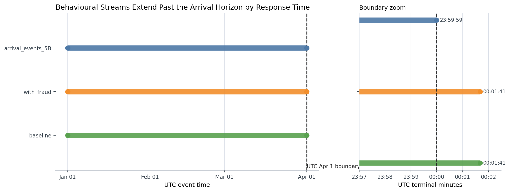
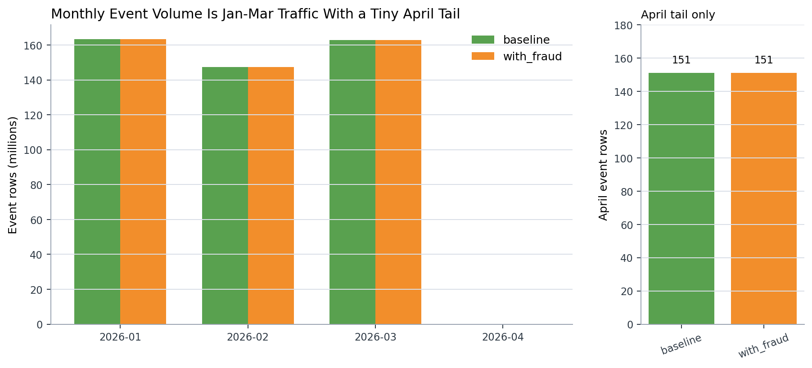
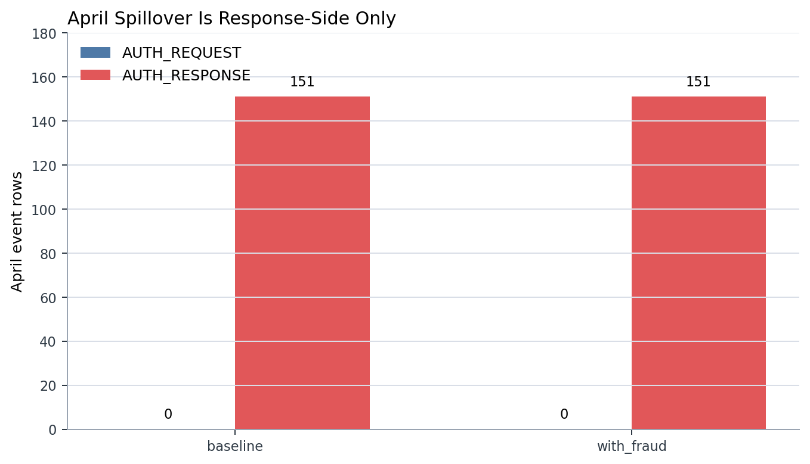
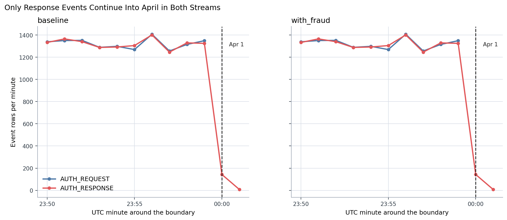
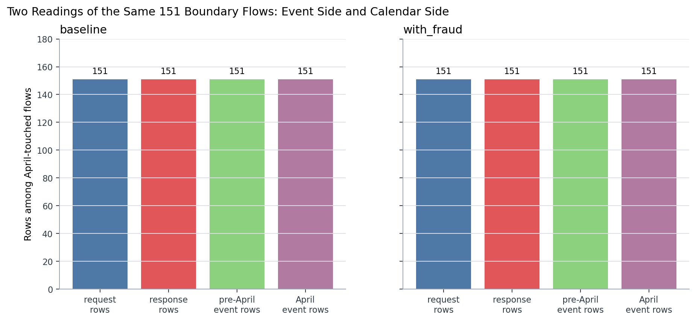
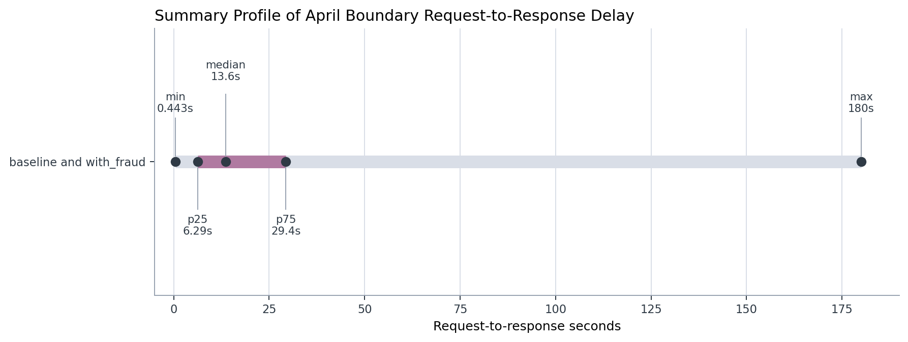
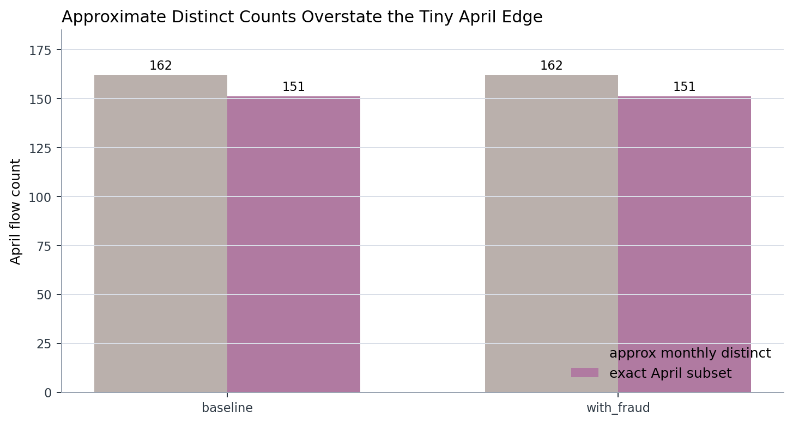

# Branch Investigation: Behavioural Stream Time Coverage and April Spillover

## Branch question

The main behavioural-stream investigation found that `s2_event_stream_baseline_6B` and `s3_event_stream_with_fraud_6B` extend slightly beyond the March arrival horizon:

- arrival primitive ends at `2026-03-31T23:59:59.944516Z`
- behavioural streams end at `2026-04-01T00:01:41.104298Z`
- each behavioural stream has `151` April event rows

This branch asks what those April rows mean. The question is not just whether April exists in the timestamp range. The operating question is whether the April rows represent unwanted extract leakage, a normal request/response lifecycle crossing midnight, or a reporting-boundary decision that later analytics must handle deliberately.

The short answer is that the April spillover is a lifecycle-boundary effect. In both behavioural streams, all `151` April rows are `AUTH_RESPONSE` rows. They belong to `151` flows whose paired `AUTH_REQUEST` rows occurred before midnight on March 31. That means the flows start inside the Jan-Mar operating window and complete just after the UTC month boundary.

## Evidence used

Primary report:

- [`behavioural_streams_investigation.md`](../behavioural_streams_investigation.md)

Branch script:

- [`analyze_behavioural_time_coverage_april_spillover.py`](../../../../scratch/analyze_behavioural_time_coverage_april_spillover.py)

Branch exports:

- [`time_horizon_profile.csv`](../../../../exports/interface_world/behavioural_streams/branches/time_coverage_and_april_spillover/time_horizon_profile.csv)
- [`monthly_boundary_counts.csv`](../../../../exports/interface_world/behavioural_streams/branches/time_coverage_and_april_spillover/monthly_boundary_counts.csv)
- [`april_rows_by_event_side.csv`](../../../../exports/interface_world/behavioural_streams/branches/time_coverage_and_april_spillover/april_rows_by_event_side.csv)
- [`boundary_days_by_event_side.csv`](../../../../exports/interface_world/behavioural_streams/branches/time_coverage_and_april_spillover/boundary_days_by_event_side.csv)
- [`boundary_minutes_by_event_side.csv`](../../../../exports/interface_world/behavioural_streams/branches/time_coverage_and_april_spillover/boundary_minutes_by_event_side.csv)
- [`april_touched_flow_shape.csv`](../../../../exports/interface_world/behavioural_streams/branches/time_coverage_and_april_spillover/april_touched_flow_shape.csv)
- [`april_touched_flow_latency_summary.csv`](../../../../exports/interface_world/behavioural_streams/branches/time_coverage_and_april_spillover/april_touched_flow_latency_summary.csv)
- [`latest_april_events_sample.csv`](../../../../exports/interface_world/behavioural_streams/branches/time_coverage_and_april_spillover/latest_april_events_sample.csv)
- [`time_coverage_and_april_spillover_summary.json`](../../../../exports/interface_world/behavioural_streams/branches/time_coverage_and_april_spillover/time_coverage_and_april_spillover_summary.json)

The branch uses compact DuckDB aggregations and boundary-window joins. It does not materialize the full behavioural streams into memory. The only exact join performed here is restricted to the `151` flows touched by the April boundary so that the request side of those flows can be inspected.

## The operating window is Jan-Mar, but event time can cross the boundary

The horizon profile shows the distinction:

| Surface | Rows | Minimum UTC timestamp | Maximum UTC timestamp | April rows |
|---|---:|---|---|---:|
| `arrival_events_5B` | `236,691,694` | `2026-01-01T00:00:00.001940Z` | `2026-03-31T23:59:59.944516Z` | `0` |
| `baseline` | `473,383,388` | `2026-01-01T00:00:00.001940Z` | `2026-04-01T00:01:41.104298Z` | `151` |
| `with_fraud` | `473,383,388` | `2026-01-01T00:00:00.001940Z` | `2026-04-01T00:01:41.104298Z` | `151` |

This is the first discipline point. The extract is Jan-Mar by arrival coverage, but the behavioural stream is an event-time stream. It records two event sides for each flow: request and response. If a request arrives just before midnight and its response is recorded just after midnight, the stream can legitimately contain a response timestamp in April without implying that April arrivals were admitted.

That distinction matters because the platform consumes event-time traffic, not a single static transaction row. A reporting period can be defined by arrival time, request time, response time, flow start, or flow completion. Those choices are not interchangeable near period boundaries.

## The April rows are response-side only

The branch export gives an exact event-side read for the April population:

| Stream | `event_seq` | `event_type` | Rows | Distinct flows | Minimum April timestamp | Maximum April timestamp |
|---|---:|---|---:|---:|---|---|
| `baseline` | `1` | `AUTH_RESPONSE` | `151` | `151` | `2026-04-01T00:00:00.006427Z` | `2026-04-01T00:01:41.104298Z` |
| `with_fraud` | `1` | `AUTH_RESPONSE` | `151` | `151` | `2026-04-01T00:00:00.006427Z` | `2026-04-01T00:01:41.104298Z` |

There are no April `AUTH_REQUEST` rows. This is the strongest evidence against treating the April tail as a new April traffic population. If April contained both requests and responses, or if it contained request rows that began new flows after the operating window, the concern would be different. Here, the April population is one-sided and completion-side.

The baseline and with-fraud streams also have the same aggregate boundary profile. The April total amount is `3,411.73` in both streams, and the mean April response amount is about `22.59`. The existing month-by-fraud summary also shows that April has `151` non-fraud rows and no fraud-marked rows. So the April edge is not being introduced by the fraud overlay; it is visible in the baseline stream lifecycle and preserved at aggregate shape in the with-fraud stream.

## The paired requests sit before midnight

The exact paired-flow check answers the more important question: do these April responses belong to flows that started inside the operating window?

| Stream | April-touched flows | Event rows for those flows | Request rows | Response rows | Pre-April event rows | April event rows |
|---|---:|---:|---:|---:|---:|---:|
| `baseline` | `151` | `302` | `151` | `151` | `151` | `151` |
| `with_fraud` | `151` | `302` | `151` | `151` | `151` | `151` |

For both streams, every April-touched flow has exactly two event rows under the declared grammar:

- one `AUTH_REQUEST` before April
- one `AUTH_RESPONSE` in April

The paired request window runs from `2026-03-31T23:57:27.903525Z` to `2026-03-31T23:59:59.944516Z`. The paired response window runs from `2026-04-01T00:00:00.006427Z` to `2026-04-01T00:01:41.104298Z`.

That pattern is what a midnight lifecycle boundary looks like. The stream is not saying that `151` new April flows arrived. It is saying that `151` March-end flows completed their response-side event after midnight.

## The spillover is short-lived

The latency summary confirms that the boundary is operationally small:

| Stream | Paired flows | Minimum delay | Median delay | P75 delay | Maximum delay | Mean delay |
|---|---:|---:|---:|---:|---:|---:|
| `baseline` | `151` | `0.443s` | `13.615s` | `29.403s` | `180.000s` | `24.436s` |
| `with_fraud` | `151` | `0.443s` | `13.615s` | `29.403s` | `180.000s` | `24.436s` |

This matters because the April tail is bounded in the observed extract. Most of the boundary-crossing flows complete within tens of seconds. The longest request-to-response delay among these boundary flows is exactly `180` seconds, and the latest response lands at `00:01:41.104298Z`.

So the spillover is not merely small by row count; it is also tight in elapsed time within this extract. It is consistent with authorization lifecycle completion around midnight, not with an additional April operating day.

## Why the monthly approximate flow count should not drive this branch

The existing monthly behavioural export includes an approximate flow count for April. It reports `162` approximate flows against `151` April rows. That is impossible if read literally, because a distinct count cannot exceed the number of rows when each row has one `flow_id`.

This is not a data defect in the stream. It is a measurement caution. The monthly export used approximate distinct counting, and the approximation is not reliable for a tiny boundary population. The branch therefore uses exact `COUNT(DISTINCT flow_id)` on the bounded April subset, which gives the correct boundary count: `151` April rows and `151` April-touched flows per stream.

That caution should carry forward. Approximate distinct counts are useful for very large stream-scale profiling, but they should not be used as the final authority for small edge populations, exception buckets, tail cohorts, or audit-sensitive boundary checks.

## Reporting boundary discipline

This branch exposes a boundary decision we need to keep explicit in later analysis:

- If we report by request-side period, these `151` flows belong to March because their request side occurred before midnight.
- If we report by response/event timestamp, the `151` response events belong to April.
- If we report by flow completion, these flows complete in April even though they started in March.
- If we report by event-row traffic, April has `151` response events and no request events.

None of those views is universally "wrong." The wrong move would be to mix them without naming the grain. A dashboard that counts event rows by `ts_utc` will show a small April tail. A request-side flow dashboard should pin those same flows to March. A response-latency or completion-SLA view may intentionally keep them in April.

For the live fraud decisioning platform, this matters because different teams may be asking different questions. RTDL traffic monitoring may care about event-time messages. Offline performance analysis may care about flow-level windows. Finance or business reporting may care about authorization start date. Case workflows may care about when a response, label, or case action completed. The same `151` boundary flows can therefore be valid evidence in multiple windows, but only if the boundary definition is stated.

## What this proves and what it does not prove

This branch proves that the April spillover in the behavioural streams is response-side completion for flows that began before midnight on March 31. It also proves that the baseline and with-fraud streams have the same April boundary shape, so the fraud overlay is not creating the spillover.

It does not prove that every later surface uses the same boundary convention. Truth labels, case timelines, bank views, or offline feature outputs may use flow-time, event-time, decision-time, or case-time semantics. Those surfaces need their own boundary checks when we reach them.

It also does not mean April should be blindly dropped. Dropping April event rows may be correct for a strict Jan-Mar event-time extract, but it would split complete request/response pairs for the `151` boundary flows. If later analysis needs complete flow grammar, the safer default is to keep complete flows and then define reporting windows by the appropriate timestamp.

## Leads exposed by this branch

1. Boundary-sensitive analysis must name its time anchor: request time, response time, flow start, flow completion, or event row timestamp.

2. The event stream can be complete at flow grain while slightly exceeding the arrival horizon at event-time grain.

3. Approximate distinct counts should not be used to interpret tiny boundary populations; exact bounded checks are required.

4. The fraud overlay does not explain the April edge. The edge exists in the baseline stream and is preserved in the with-fraud stream.

5. Later truth and case surfaces need their own period-boundary checks because their timestamps may represent different operating moments.

## Working conclusion

The April spillover is not evidence of a rogue April data population. It is a normal consequence of a two-event authorization stream at a UTC reporting boundary: `151` March-end requests complete as April response events.

For the rest of the behavioural-stream investigation, the practical rule is to stop treating `ts_utc` as a single universal reporting clock. It is the event timestamp. When the analytical question is flow-level, we need to decide whether the flow belongs to the period of its request side, response side, or completion side. This branch gives us the first concrete reason to keep that distinction explicit.

## Appendix: visual evidence and assessment

### A1. Horizon profile and boundary zoom

The left panel establishes the broad operating horizon: all three surfaces begin at the same UTC opening instant, but the arrival surface stops at the March boundary while the two behavioural streams continue slightly into April. On its own, the full-horizon view would make the difference look almost invisible because the spillover is only about one minute and forty-one seconds against a three-month window. That is why the boundary zoom matters; it is the part of the figure that makes the actual evidence readable.

The zoom panel shows the distinction cleanly. `arrival_events_5B` terminates at `23:59:59`, while both behavioural streams continue to `00:01:41`. This supports the branch's first claim: the behavioural streams carry event-time lifecycle semantics that can extend past the arrival horizon. It does not yet prove why the extension exists. It only proves that the terminal timestamps differ and that the difference is concentrated at the UTC month boundary. The later figures and the paired-flow check explain the event-side reason for that difference.

For downstream analysis, this figure is the warning against treating every timestamped surface as though it shares one universal period boundary. The arrival horizon and the behavioural event horizon are aligned for almost all of the Jan-Mar window, but the edge behaviour differs exactly where reporting windows are most vulnerable to mistaken inclusion/exclusion rules.

### A2. Monthly event volume with April tail

The main panel shows why the April population cannot be interpreted from the monthly scale alone. January, February, and March each contain roughly `147M` to `163M` behavioural event rows per stream. Against that scale, April is visually flattened at zero even though it is not actually empty. The right panel isolates the April tail and shows the exact count: `151` rows in baseline and `151` rows in with-fraud.

This split view is important because it prevents two opposite mistakes. If we only look at the full monthly bars, we might miss the boundary tail entirely. If we only look at the April inset, we might overstate its importance by forgetting that it is tiny relative to the operating body. The correct reading is both: April exists, but it is a boundary edge rather than a fourth operating month.

The figure also supports the statement that the fraud overlay is not changing the aggregate boundary volume. Baseline and with-fraud match at the April tail count. This is still an aggregate comparison, not a row-identity proof; the stronger point established elsewhere is that the April edge is present before the overlay and remains visible after it.

### A3. April response-side-only event rows

This figure answers the first concrete grammar question about the April tail: what kind of event rows are those `151` rows? In both streams, April has `0` `AUTH_REQUEST` rows and `151` `AUTH_RESPONSE` rows. That is the key evidence against reading April as a new traffic population. If April represented new traffic starting after the extract boundary, we would expect request-side rows to appear. They do not.

The denominator here is only the April subset, not the whole stream. That matters because the figure is not trying to describe normal request/response balance across the full Jan-Mar horizon. It is isolating the boundary exception and showing that the exception is one-sided. The April tail belongs to the completion side of the event grammar.

The practical consequence is that any event-time report will show April response events, while any request-side flow-origin report should keep these flows anchored to March. This figure does not by itself prove that the March request rows exist; it shows that April contains no requests. The paired-flow figure supplies the complementary evidence that those response rows are matched to pre-April request rows.

### A4. Boundary-minute request and response profile

This figure brings the boundary into minute-level view for both streams. Before midnight, request and response rows move together at roughly the same per-minute scale, around the low-thousands per minute in this terminal slice. At `00:00`, the request line disappears while the response line continues with `143` rows in the first April minute and `8` rows in the next minute. The same shape appears in baseline and with-fraud.

The important point is not that traffic "drops" at midnight in a normal operating sense. The plotted window is the end of the extract, so the edge is expected to look truncated. The statistical point is the side-specific truncation: requests stop at the boundary, but responses continue briefly. That is exactly the shape expected when flows that began before midnight are allowed to complete after midnight.

This figure should be read together with the paired-flow evidence. The minute profile shows the temporal pattern and the event-side asymmetry. It does not alone prove that each April response has a March request partner; that comes from the bounded join over the `151` April-touched flows. Together, they give the branch its lifecycle interpretation rather than a generic "April leakage" interpretation.

### A5. April-touched flow pair shape

This figure is deliberately titled as two readings of the same `151` boundary flows. The first pair of bars reads the flows by event side: `151` request rows and `151` response rows. The second pair reads the same event rows by calendar side: `151` pre-April rows and `151` April rows. These four bars are not four independent populations; they are two ways of slicing the same `302` event rows attached to the `151` April-touched flows.

That distinction is the core of the branch. At flow grain, the boundary population is complete: each April-touched flow has both sides of the two-event grammar. At event-time grain, the same flow is split across the month boundary: request before April, response in April. This is why blindly dropping April rows can damage completeness if the later analysis needs full request/response pairs.

The figure also shows that baseline and with-fraud have the same boundary shape under this check. It does not claim the overlay rows are identical at every field; it shows that the event-side and calendar-side counts match for the bounded April-touched flow population. That is enough for the branch question, because the branch is focused on period semantics rather than full overlay identity.

### A6. Request-to-response latency profile

This figure summarizes the request-to-response delay for the `151` flows whose response falls in April. It is not a full per-flow distribution plot; it is a compact summary profile. The minimum delay is `0.443` seconds, the median is `13.6` seconds, the p75 is `29.4` seconds, and the maximum is `180` seconds. Baseline and with-fraud have the same summary profile for this boundary cohort.

The statistical reading is that the April spillover is bounded in both row count and elapsed time within this extract. Most of the boundary cohort completes within tens of seconds, while the maximum observed delay reaches three minutes. That supports the interpretation of a short lifecycle tail around midnight rather than a broad April continuation.

The figure should not be read as a service-level agreement or a latency performance claim for the whole platform. It only describes the April-touched boundary cohort. A full latency investigation would need the complete request/response delay distribution across all flows, not only the `151` flows that crossed this particular reporting boundary.

### A7. Approximate distinct boundary caution

This figure makes the measurement caution visible. The monthly profiling export reports `162` approximate April flows, while the bounded exact April subset has `151` distinct flows. Because April has only `151` event rows, a literal flow count above `151` is not credible for this subset. The mismatch is a property of using approximate distinct counting on a tiny edge population, not evidence that the stream has more April flows than April rows.

The point is not that approximate distinct counts are useless. At full-stream scale, approximate distinct counting is often a practical way to profile hundreds of millions of rows without expensive exact counting. The problem is using the same approximate measure as authority for small boundary cohorts, exception buckets, audit checks, or other places where a difference of a few rows changes the interpretation.

For this branch, the exact bounded count is the one that should drive the conclusion: `151` April rows and `151` April-touched flows in each stream. The approximate monthly count is useful as a warning that large-surface profiling methods need to be swapped out for exact checks when the question becomes narrow, boundary-sensitive, or audit-like.
