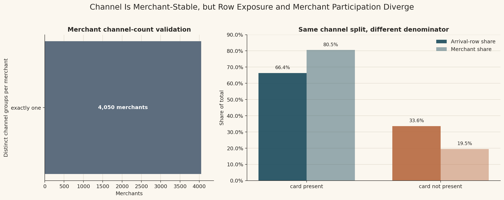
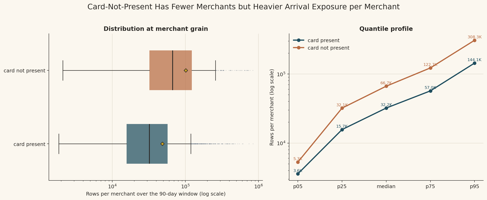
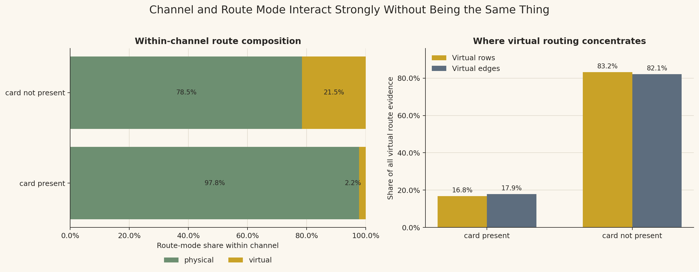
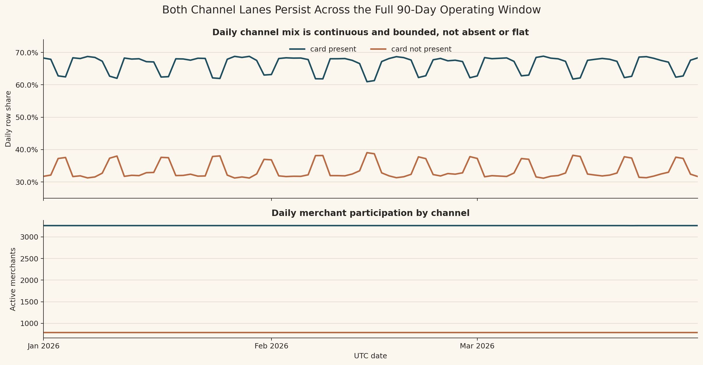
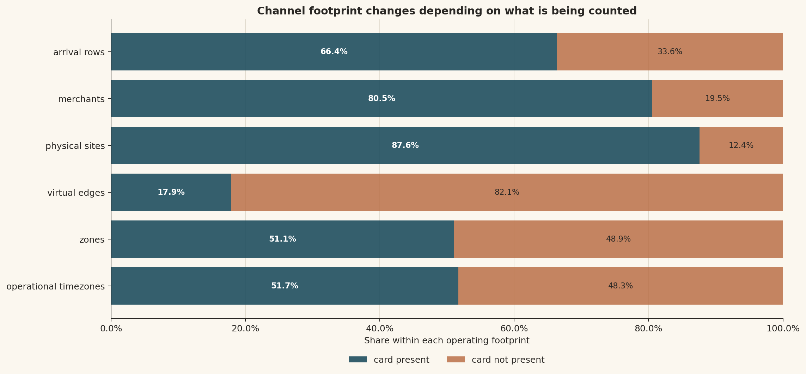

# Branch Investigation: `arrival_events_5B` Channel Structure

## Branch question

The surface-level report says that `arrival_events_5B` has two channel groups, and that no merchant appears in more than one channel.

This branch exists to unpack what that means in the operating fraud platform.

The question is:

> Is `channel_group` behaving like event-level variation, merchant-level operating identity, or something else inside the arrival-context surface?

That distinction matters because a channel field can be misread very easily. If channel varied freely row by row, then it would describe transaction-level routing choice at arrival grain. If channel is stable per merchant, then it behaves more like the merchant's operating lane inside the platform's arrival context. Those two readings lead to different later analyses.

## Evidence used

Primary references:

- [`docs/model_spec/data-engine/interface_pack/data_engine_interface.md`](../../../../../../../docs/model_spec/data-engine/interface_pack/data_engine_interface.md)
- [`docs/model_spec/data-engine/layer-2/specs/contracts/5B/dataset_dictionary.layer2.5B.yaml`](../../../../../../../docs/model_spec/data-engine/layer-2/specs/contracts/5B/dataset_dictionary.layer2.5B.yaml)
- [`docs/model_spec/data-engine/layer-2/specs/contracts/5B/schemas.5B.yaml`](../../../../../../../docs/model_spec/data-engine/layer-2/specs/contracts/5B/schemas.5B.yaml)
- [`docs/model_spec/platform/migration_to_dev/dev_full_platform_green_v0_run_process_flow.md`](../../../../../../../docs/model_spec/platform/migration_to_dev/dev_full_platform_green_v0_run_process_flow.md)

Workbench evidence:

- [`arrival_events_5B_investigation.md`](../arrival_events_5B_investigation.md)
- [`analyze_arrival_events_channel_structure.py`](../../../../scratch/analyze_arrival_events_channel_structure.py)
- [`channel_overview.csv`](../../../../exports/interface_world/traffic_primitives/branches/channel_structure/channel_overview.csv)
- [`channel_by_route_mode.csv`](../../../../exports/interface_world/traffic_primitives/branches/channel_structure/channel_by_route_mode.csv)
- [`merchant_channel_stability.csv`](../../../../exports/interface_world/traffic_primitives/branches/channel_structure/merchant_channel_stability.csv)
- [`merchant_volume_by_channel.csv`](../../../../exports/interface_world/traffic_primitives/branches/channel_structure/merchant_volume_by_channel.csv)
- [`channel_daily_summary.csv`](../../../../exports/interface_world/traffic_primitives/branches/channel_structure/channel_daily_summary.csv)
- [`channel_daily_share_stats.csv`](../../../../exports/interface_world/traffic_primitives/branches/channel_structure/channel_daily_share_stats.csv)
- [`channel_structure_summary.json`](../../../../exports/interface_world/traffic_primitives/branches/channel_structure/channel_structure_summary.json)

## What channel means at arrival grain

At the surface grain, one row is one merchant-local arrival-context observation. `channel_group` does not identify the row by itself. It gives the arrival's operating lane:

- `card_present`
- `card_not_present`

The key question is whether the same merchant can appear in both lanes. In this run, the answer is no.

| Distinct channel groups per merchant | Merchants | Rows |
|---:|---:|---:|
| `1` | `4,050` | `236,691,694` |

Every merchant has exactly one observed `channel_group`.

That is the central finding of this branch. Inside `arrival_events_5B`, channel behaves as merchant-stable operating identity, not as a row-by-row customer or transaction choice. A merchant's arrivals are all carried through one channel lane in this primitive.

This does not mean real payment behaviour could never vary by channel in a different system. It means that in this interface surface, as received for this operating horizon, `channel_group` partitions the merchant population into two stable lanes.

## Participation versus exposure

The two channel groups do not carry the same amount of merchant participation or row exposure.

| Channel | Rows | Row share | Merchants | Merchant share | Sites | Edges |
|---|---:|---:|---:|---:|---:|---:|
| `card_present` | `157,117,536` | `66.38%` | `3,261` | `80.52%` | `68,780` | `537` |
| `card_not_present` | `79,574,158` | `33.62%` | `789` | `19.48%` | `9,736` | `2,468` |

The participation story and the exposure story are not the same.

`card_present` contains most merchants: `80.52%` of the merchant population. It also contains most rows: `66.38%` of arrivals. So card-present is the broad merchant-participation lane and the larger arrival-volume lane.

`card_not_present` contains only `19.48%` of merchants but still carries `33.62%` of arrivals. That means card-not-present merchants are heavier, on average, at arrival grain. The channel is smaller by merchant count, but not proportionally small by platform exposure.

This is why channel analysis cannot stop at raw row share. A row-weighted read answers "what share of arrival exposure belongs to this channel?" A merchant-weighted read answers "what share of merchants operate in this channel?" Here those answers diverge.

## Merchant volume inside each channel

The per-merchant arrival distribution confirms that card-not-present is the heavier lane at merchant grain.

| Channel | Merchants | Median rows per merchant | Mean rows per merchant | p95 rows per merchant | Max rows per merchant |
|---|---:|---:|---:|---:|---:|
| `card_present` | `3,261` | `32,162` | `48,181` | `144,057` | `841,654` |
| `card_not_present` | `789` | `66,662` | `100,854` | `308,314` | `836,294` |

Card-not-present has:

- `2.09x` the mean rows per merchant of card-present
- `2.07x` the median rows per merchant of card-present
- `2.14x` the p95 rows per merchant of card-present

This makes the exposure imbalance clearer. Card-not-present is not just a smaller lane with fewer merchants. Its merchants are materially more arrival-dense across the distribution, including at the center and the upper tail.

That matters for later fraud and case analysis. If a future chart shows card-not-present contributing a large share of events, alerts, fraud labels, or cases, that may reflect both risk difference and exposure difference. We will need rates and denominators, not only counts.

## Channel and route mode are related, but not identical

Before reading the channel-route table, the terms need to be pinned down in operating language.

`channel_group` is the payment-acceptance lane attached to the merchant's arrival context:

- `card_present` means the merchant is operating in a card-present acceptance lane: the payment interaction is treated as in-person / point-of-interaction commerce where the card or card credential is presented at the merchant's acceptance point.
- `card_not_present` means the merchant is operating in a remote or non-face-to-face acceptance lane: the card credential is used without the cardholder/card being physically present at a point-of-sale interaction. It does **not** mean "no card details are used." It means the credential is submitted or used through a remote/digital acceptance context rather than a physical-presentment context.

Because every merchant has exactly one observed channel in this primitive, these labels should be read as merchant operating lanes in `arrival_events_5B`, not as proof that each individual arrival row captured a customer choosing a physical card, phone wallet, manual entry, or any other specific payment instrument.

`is_virtual` is different. It describes the routing endpoint used by the arrival-context fabric:

- `is_virtual = false` means the arrival is routed to a physical merchant site, so `site_id` is populated and `edge_id` is null.
- `is_virtual = true` means the arrival is routed to a virtual edge, so `edge_id` is populated and `site_id` is null.

So `channel_group` tells us the merchant's acceptance lane, while `is_virtual` tells us whether the arrival was routed through a physical site or a virtual edge. These are related operating concepts, but they are not the same field, and the data proves they should not be collapsed into one another.

| Channel | Route mode | Rows | Share within channel | Share within route mode | Merchants | Sites | Edges |
|---|---|---:|---:|---:|---:|---:|---:|
| `card_present` | physical | `153,665,526` | `97.80%` | `71.10%` | `3,229` | `68,780` | `0` |
| `card_present` | virtual | `3,452,010` | `2.20%` | `16.79%` | `32` | `0` | `537` |
| `card_not_present` | physical | `62,470,581` | `78.51%` | `28.90%` | `664` | `9,736` | `0` |
| `card_not_present` | virtual | `17,103,577` | `21.49%` | `83.21%` | `125` | `0` | `2,468` |

The card-present lane is overwhelmingly physical: `97.80%` of its rows are physical-site arrivals. Only `2.20%` of card-present rows are virtual.

The card-not-present lane is still mostly physical by row count, but it carries a much larger virtual component: `21.49%` of card-not-present rows are virtual. Card-not-present also holds `83.21%` of all virtual rows and `82.13%` of all virtual edges.

This is the important nuance. Card-not-present is not equivalent to virtual routing, because most card-not-present rows are still physically routed in this surface. That can happen because "remote/card-not-present acceptance lane" and "physical route endpoint" are not logically contradictory in this interface view: one describes acceptance context, the other describes the route object attached to the arrival. But virtual routing is still heavily concentrated inside card-not-present. So the right interpretation is:

> Channel is a merchant-stable operating lane; virtual route mode is a routing context; the two interact strongly but are not interchangeable.

If we collapse them, we lose information. If we separate them, we can later ask better questions: whether fraud, flow behaviour, case creation, or false-positive burden is driven by channel, virtual routing, or their intersection.

## Daily continuity of the channel lanes

Both channel lanes are present across the full 90-day operating window.

| Channel | Days present | Min daily share | Median daily share | Mean daily share | Max daily share | Daily share stddev |
|---|---:|---:|---:|---:|---:|---:|
| `card_present` | `90` | `60.96%` | `67.68%` | `66.34%` | `68.84%` | `2.62pp` |
| `card_not_present` | `90` | `31.16%` | `32.32%` | `33.66%` | `39.04%` | `2.62pp` |

The daily merchant counts are also stable:

- card-not-present has `789` active merchants every day
- card-present has `3,261` active merchants on most days, with a minimum of `3,260`

So the channel split is not caused by a short-lived period where one channel appears or disappears. Both channels are continuously present through the three-month extract.

The daily shares move within a bounded range. Card-present stays between `60.96%` and `68.84%` of daily arrival rows, while card-not-present stays between `31.16%` and `39.04%`. This is enough movement to matter for time-aware analysis, but not enough to suggest that channel coverage is intermittent or broken.

For the operating platform, this means channel is a stable segmentation axis. It can be used as a persistent denominator when later comparing traffic, fraud, labels, and cases, provided we keep the exposure imbalance in view.

## What this branch lets us trust

This branch gives us confidence in four things.

First, `channel_group` is complete and stable at merchant level in this arrival primitive. There is no evidence of merchants crossing channel lanes in this surface.

Second, both channel lanes are present throughout the full 90-day window. The channel split is not a partial-period artefact.

Third, channel is analytically meaningful because it changes both participation and exposure. Card-present is the broad merchant lane; card-not-present is the smaller but heavier lane.

Fourth, channel and route mode need to be handled together but separately. Card-not-present carries most virtual routing complexity, but it is not synonymous with virtual routing.

## What this branch does not prove

This branch does not prove that card-not-present is riskier.

It does not prove that virtual routing is riskier.

It does not prove that the platform should score channels differently.

It does not prove that card-present and card-not-present have different fraud rates, false-positive rates, case rates, or operational burdens.

Those claims require behavioural streams, truth products, and case surfaces. At this stage, the only defensible conclusion is about the shape of arrival exposure and merchant-channel identity.

## Working interpretation

`arrival_events_5B` exposes channel as a stable merchant operating lane in the arrival-context world.

The main split is not simply "two channels by row count." The stronger structure is:

- card-present is the larger and broader merchant lane
- card-not-present is a smaller merchant lane with heavier arrival exposure per merchant
- virtual routing is a minority route mode overall, but it is concentrated inside card-not-present
- both channels persist through the full January-March operating window

So channel should be carried forward as a first-class segmentation field, but not as a standalone explanation. Later investigations should compare channel against route mode, merchant volume, behavioural traffic, fraud truth, and case outcomes. The channel field tells us where operating exposure is partitioned; it does not yet tell us whether that exposure is safer, riskier, or more operationally costly.

## Leads exposed

1. Card-not-present has heavier arrival exposure per merchant. Later behavioural and truth analyses should compare channel-level rates using both row-weighted and merchant-weighted denominators.

2. Virtual routing is concentrated inside card-not-present. Later route-mode analysis should separate physical card-not-present from virtual card-not-present instead of treating all CNP traffic as one homogeneous block.

3. Channel is merchant-stable in `arrival_events_5B`. When inspecting `6B` event streams, we should verify whether that merchant-stable channel assignment carries through the behavioural surfaces or whether richer event bodies introduce additional channel semantics.

4. Daily channel shares are stable but not flat. If later fraud or case rates vary by date, channel mix should be checked as a possible denominator effect before interpreting the movement as a risk change.

5. The small set of card-present virtual merchants is unusual enough to preserve as a later check. It may be legitimate platform routing context, but it should not be silently absorbed into the ordinary physical card-present story.

## Appendix: visual evidence and assessment

This appendix holds the visual evidence behind the channel-structure branch. The figures are not meant to prove a fraud claim. They are meant to make the channel structure visible: whether channel behaves as merchant identity or event variation, how row exposure differs from merchant participation, how route mode intersects with channel, and how stable the channel lanes are across the operating window.

### A1. Channel identity and denominator split

This figure combines two checks that need to be read together.

The left panel validates the channel-stability claim at merchant grain. All `4,050` merchants sit in the "exactly one" channel-count bucket. That means the surface does not show merchants moving between `card_present` and `card_not_present` inside the three-month arrival-context extract. At this grain, channel is therefore not behaving like a row-by-row transaction attribute. It is behaving like a stable merchant operating lane.

The right panel shows why that stable channel assignment still needs denominator discipline. `card_present` contains `80.5%` of merchants but `66.4%` of arrival rows. `card_not_present` contains only `19.5%` of merchants but `33.6%` of arrival rows. So the two channels can be described in two correct but different ways: card-present is the broader merchant-participation lane, while card-not-present carries more arrival exposure than its merchant share would suggest.

The figure proves that channel is stable per merchant in this primitive and that row share and merchant share diverge. It does not prove anything about fraud risk, customer behaviour, approval rate, or case burden. Those require later behavioural, truth, and case surfaces. The immediate lesson is that a channel-level statistic must declare its denominator: arrival-weighted and merchant-weighted statements are not interchangeable.

### A2. Merchant exposure distribution by channel

This figure moves from channel totals into the merchant-level distribution inside each channel. That is necessary because total row share alone cannot tell us whether card-not-present has more exposure because of many small merchants, a few extreme merchants, or a generally heavier merchant population.

The boxplot shows that the card-not-present distribution is shifted to the right of card-present. The median card-not-present merchant has about `66.7K` rows over the 90-day window, while the median card-present merchant has about `32.2K`. The quantile panel makes the same point across the distribution: card-not-present is higher at p05, p25, median, p75, and p95. The p95 comparison is especially important: `308.3K` rows for card-not-present versus `144.1K` for card-present. This is not only a top-end anomaly; the heavier exposure appears across the merchant distribution.

The log scale is doing analytical work here. Merchant row counts span from low thousands into hundreds of thousands, so a linear scale would compress the lower and middle ranges and make the distribution harder to read. The log scale lets the center and the tail remain visible together.

This figure supports the branch claim that card-not-present merchants are materially more arrival-dense. It does not explain why they are denser. The cause could be merchant mix, operating model, route structure, synthetic world policy, or something that only becomes visible when we inspect the behavioural streams. For later fraud analysis, the caution is direct: if card-not-present shows more labels or cases in raw counts, the first check should be exposure-normalized rates, not immediate risk interpretation.

### A3. Channel and route-mode interaction

This figure addresses a common misread: treating `card_not_present` and `virtual` as if they mean the same thing.

In this branch, `card_not_present` is the merchant's remote/non-face-to-face acceptance lane. It does not mean the transaction has no card details; it means the card credential is used without physical-presentment context. `virtual` is different: it means the arrival was routed through a virtual edge rather than a physical `site_id`. One is an acceptance lane, the other is a routing endpoint.

The left panel shows route composition within each channel. Card-present is almost entirely physical: `97.8%` physical and `2.2%` virtual. Card-not-present is still mostly physical, but with a much larger virtual component: `78.5%` physical and `21.5%` virtual. That means virtual routing is not absent from card-present, and physical routing is not absent from card-not-present. The fields are related, but they are not substitutes for one another.

The right panel flips the denominator and asks where all virtual evidence sits. Here the concentration becomes sharp: card-not-present carries `83.2%` of virtual rows and `82.1%` of virtual edges. So card-not-present is not equivalent to virtual routing, but virtual routing is overwhelmingly concentrated inside card-not-present.

This is the statistical reason the branch separates channel from route mode. If we collapse the two fields, we lose the ability to tell whether a later fraud or case pattern is a channel effect, a virtual-routing effect, or the intersection of the two. If we keep them separate, later analysis can compare physical card-present, virtual card-present, physical card-not-present, and virtual card-not-present as distinct operating contexts.

The figure proves concentration and interaction. It does not prove causal risk. It also does not prove that virtual card-present is wrong; the `2.2%` card-present virtual slice may be a legitimate routing lane. It simply flags that this slice should not be silently treated as ordinary physical card-present traffic.

### A4. Daily channel share and merchant presence

This figure checks whether the channel structure is persistent through time or produced by a temporary coverage issue.

The upper panel shows daily row share for both channel lanes. Both lines are present across the full January-March window. Card-present remains the larger daily share, while card-not-present remains the smaller daily share. The movement is bounded rather than chaotic: card-present sits roughly in the low-60s to high-60s percent range, while card-not-present mirrors it in the low-30s to high-30s range. The repeated movement shows that the channel mix is not perfectly flat, but the levels remain structurally stable.

The lower panel checks merchant participation by day. Card-not-present has `789` active merchants every day, while card-present is essentially constant at `3,261`, with one day at `3,260`. This matters because a daily shift in row share could otherwise be mistaken for changing merchant coverage. Here, the daily merchant base is stable; the daily row-share movement is more likely about traffic intensity within the stable channel lanes than about channels appearing or disappearing.

The figure proves that both channel lanes are continuously represented across the full operating window. It does not prove daily risk stability. A stable channel denominator can still have changing fraud rates or case rates later. The correct use of this evidence is denominator control: if later metrics move by date, channel mix should be checked as one possible exposure factor, but not assumed to be the explanation by itself.

### A5. Channel operating footprint across different counted objects

This figure broadens the denominator question beyond rows and merchants. It asks how much of each operating footprint belongs to each channel: arrival rows, merchants, physical sites, virtual edges, zones, and operational timezones.

The first three rows show the physical-world skew toward card-present. Card-present has `66.4%` of arrival rows, `80.5%` of merchants, and `87.6%` of physical sites. This makes sense with the earlier route-mode evidence: card-present is the broad physical-site lane of the arrival surface.

The virtual-edge row reverses the pattern. Card-not-present holds `82.1%` of virtual edges, while card-present holds only `17.9%`. This reversal is important because it shows that the operating footprint depends on what is being counted. If we count merchants, card-present dominates. If we count virtual-edge identity, card-not-present dominates. A single "channel share" is therefore incomplete unless the counted object is named.

The last two rows add another nuance. Zones and operational timezones are nearly balanced across the two channels, despite the strong merchant/site skew toward card-present and the virtual-edge skew toward card-not-present. That means card-not-present is not geographically or timezone-trivial just because it has fewer merchants. It has broad context coverage, even though its merchant population is smaller.

This figure proves that channel structure is multi-dimensional. The same two channel labels have different footprints depending on whether the analysis is about arrival exposure, merchant participation, physical-site estate, virtual-routing estate, or geographic/timezone context. It does not prove which footprint is the "right" one. The right footprint depends on the question: load and throughput use row exposure, merchant behaviour uses merchant grain, route operations use site/edge context, and later case or truth analysis must introduce label and case denominators.
