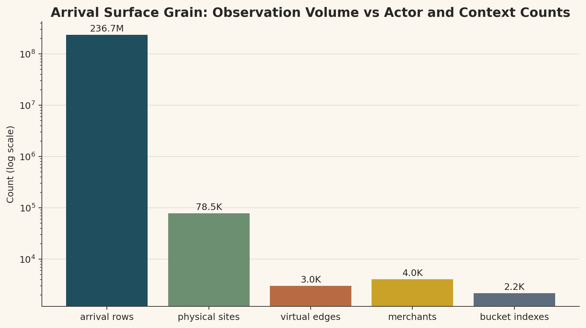
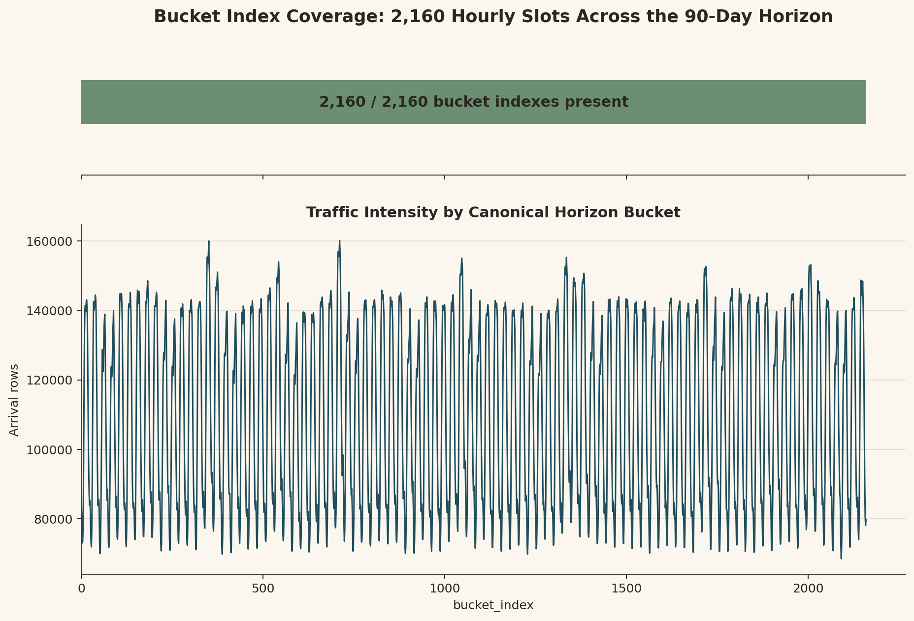
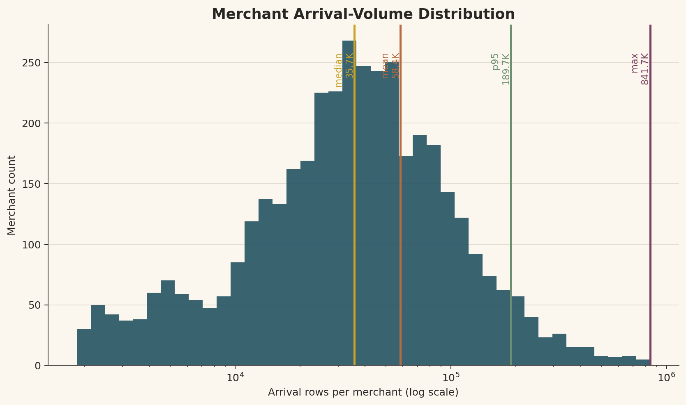
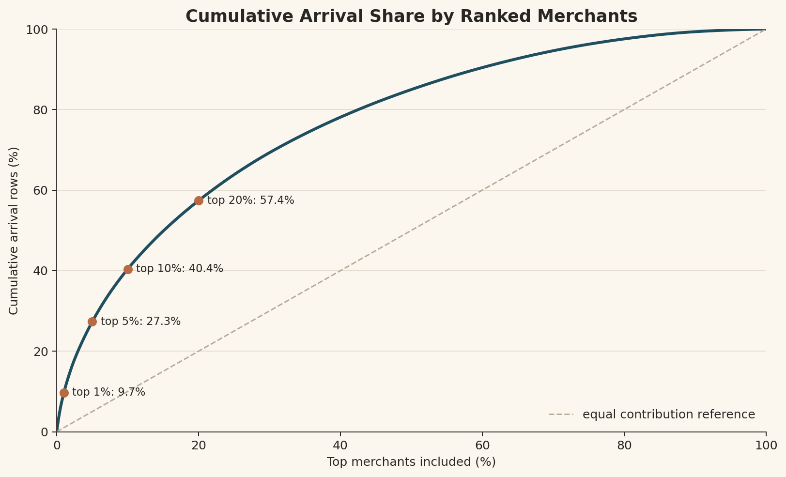
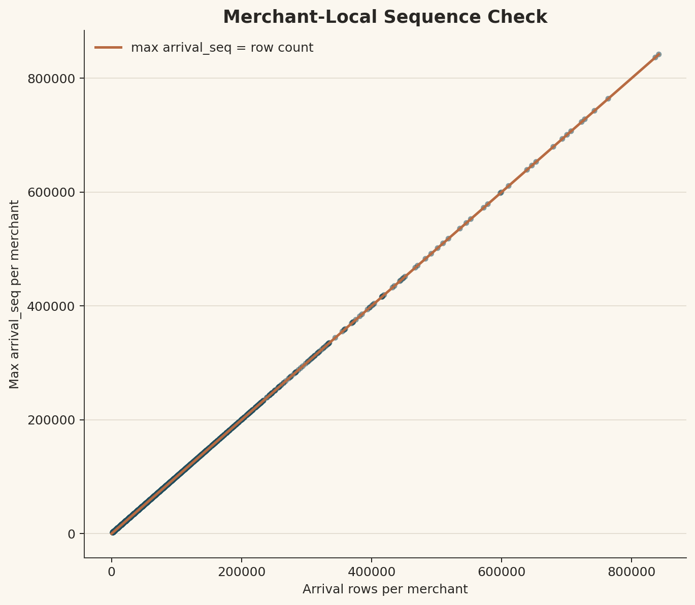
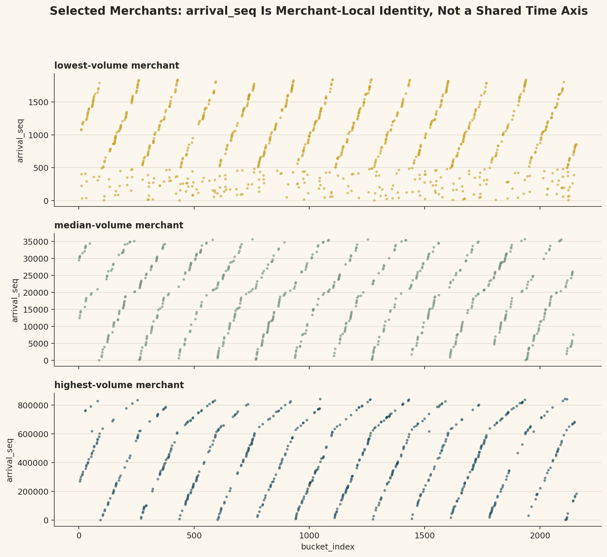
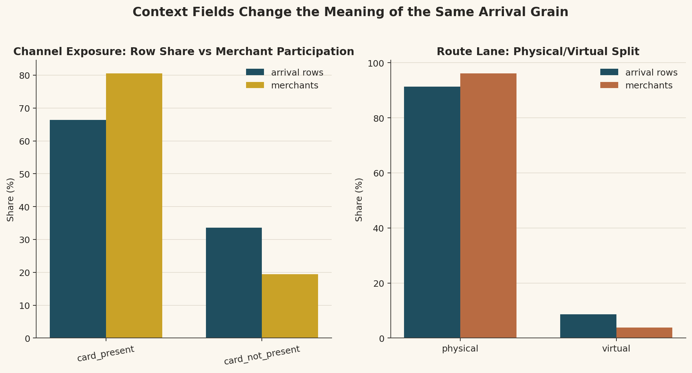

# Branch Investigation: `arrival_events_5B` Grain and Identity

## Branch question

The surface-level report says that `arrival_events_5B` has `236,691,694` arrival rows but only `4,050` merchants, and that row-level analysis will be dominated by merchant-volume inequality unless we control the grain.

This branch exists to unpack what that actually means.

The question is not whether the grain is "good" or "bad" in isolation. The question is:

> What does one row in `arrival_events_5B` represent in the operating fraud platform, how is that row identified, and what does that imply for how we should analyse the data?

## Evidence used

Primary references:

- [`docs/model_spec/data-engine/interface_pack/data_engine_interface.md`](../../../../../../../docs/model_spec/data-engine/interface_pack/data_engine_interface.md)
- [`docs/model_spec/data-engine/layer-2/specs/contracts/5B/dataset_dictionary.layer2.5B.yaml`](../../../../../../../docs/model_spec/data-engine/layer-2/specs/contracts/5B/dataset_dictionary.layer2.5B.yaml)
- [`docs/model_spec/data-engine/layer-2/specs/contracts/5B/schemas.5B.yaml`](../../../../../../../docs/model_spec/data-engine/layer-2/specs/contracts/5B/schemas.5B.yaml)
- [`docs/model_spec/platform/migration_to_dev/dev_full_platform_green_v0_run_process_flow.md`](../../../../../../../docs/model_spec/platform/migration_to_dev/dev_full_platform_green_v0_run_process_flow.md)

Workbench evidence:

- [`arrival_events_5B_investigation.md`](../arrival_events_5B_investigation.md)
- [`arrival_events_schema.csv`](../../../../exports/interface_world/traffic_primitives/arrival_events_schema.csv)
- [`arrival_events_identity_summary.csv`](../../../../exports/interface_world/traffic_primitives/arrival_events_identity_summary.csv)
- [`arrival_events_profile.csv`](../../../../exports/interface_world/traffic_primitives/arrival_events_profile.csv)
- [`arrival_events_merchant_volume_stats.csv`](../../../../exports/interface_world/traffic_primitives/arrival_events_merchant_volume_stats.csv)
- [`arrival_events_nulls.csv`](../../../../exports/interface_world/traffic_primitives/arrival_events_nulls.csv)

## What grain means here

Grain is the level at which one row is true.

For `arrival_events_5B`, the declared primary key is:

`seed + manifest_fingerprint + scenario_id + merchant_id + arrival_seq`

That means one row is not "one merchant", "one customer", "one site", "one hour", or "one transaction label." One row is one arrival occurrence for one merchant inside one pinned scenario/world/run identity.

In company-operating terms, this surface is the arrival-context feed behind the fraud platform. It is the record that says:

> At this point in the operating horizon, this merchant had this arrival, in this route/time context.

The row is therefore an arrival-context observation. It is not yet a scored transaction, not yet a fraud decision, not yet a case, and not yet a label.

## Why the key is shaped this way

The identity fields do different jobs:

| Field | Operational meaning |
|---|---|
| `seed` | Realisation/run-shape identity for the generated operating world. |
| `manifest_fingerprint` | Sealed world identity; this keeps the row tied to the admitted world basis. |
| `scenario_id` | Scenario identity; here the run is `baseline_v1`. |
| `merchant_id` | The business actor receiving the arrival. |
| `arrival_seq` | The merchant-local arrival counter that makes arrivals uniquely addressable. |

The important point is that `arrival_seq` is only unique within a merchant and scenario/world identity. It is not a global event id by itself.

So `merchant_id = 123, arrival_seq = 50` means "the arrival occurrence assigned sequence 50 for merchant 123 in this sealed scenario basis." Another merchant can also have `arrival_seq = 50`; that is not a collision because the merchant is part of the key.

This is why the primary key includes both `merchant_id` and `arrival_seq`.

## What `arrival_seq` captures

The sequence checks are clean:

- every merchant begins at `arrival_seq = 1`
- every merchant's maximum `arrival_seq` equals its row count
- `0` merchants have sequence-span mismatch

That tells us `arrival_seq` is behaving like a stable merchant-local arrival ledger.

This matters operationally because it lets other surfaces point back to arrival context without needing a global arrival id. A downstream flow/event surface can recover arrival-routing context through:

`seed + manifest_fingerprint + scenario_id + merchant_id + arrival_seq`

For analysis, this means `arrival_seq` can be used to reason about merchant-local identity and total merchant volume, but it should not be treated as a shared time axis. The visual check against `bucket_index` shows that sequence values need to be interpreted with `ts_utc` or `bucket_index` when the question is chronological.

So `arrival_seq = 10,000` is not a universal business moment. It is a merchant-local identifier inside the sealed world key. If we want calendar-time ordering, the time fields carry that responsibility.

## What `bucket_index` captures

The observed `bucket_index` range is:

- minimum: `0`
- maximum: `2,159`
- distinct bucket indexes: `2,160`

The surface spans `90` active UTC days. `90 * 24 = 2,160`, so in this run the bucket index behaves as an hourly UTC horizon bucket over the January-March operating window.

The contract confirms the broader rule: the time-grid policy defines a canonical bucket grid with `bucket_index_base = 0` and `bucket_index_origin = horizon_start_utc`, while the policy duration can be one of the permitted bucket durations.

So `bucket_index` should be read as a time-grid coordinate, not a merchant identifier and not a risk score.

Operationally, it answers:

> Which canonical horizon bucket does this arrival belong to?

That is useful for time-window analysis, traffic intensity, local-time comparison, replay ordering, and later feature construction. It is not enough by itself to identify an arrival, because many merchants and many arrivals can share the same bucket.

## What the other identity/context columns capture

The grain is defined by the primary key, but the row carries more context than the key.

| Column family | Columns | What it tells us |
|---|---|---|
| World/run identity | `seed`, `manifest_fingerprint`, `parameter_hash`, `scenario_id`, `s4_spec_version` | Which admitted world/config/spec this row belongs to. |
| Merchant arrival identity | `merchant_id`, `arrival_seq` | Which merchant arrival this row is. |
| Time coordinate | `bucket_index`, `ts_utc`, local timestamp fields | Where the arrival sits in UTC and local operating time. |
| Timezone context | `tzid_primary`, `tzid_settlement`, `tzid_operational` | Which timezones matter for primary, settlement, and operational interpretations. |
| Routing context | `zone_representation`, `routing_universe_hash`, `is_virtual`, `site_id`, `edge_id` | Where/how the arrival is routed through physical or virtual infrastructure. |
| Channel context | `channel_group` | Whether the arrival belongs to the card-present or card-not-present operating lane. |

The columns therefore do not all answer the same question. Some make the row reproducible, some make it joinable, some make it interpretable in time, and some tell us the route/channel context.

## Why `236.7M` rows and `4,050` merchants is not automatically good or bad

The row count and merchant count are answering different questions.

`236,691,694` rows means:

> The platform has 236.7M arrival-context observations over the three-month operating horizon.

`4,050` merchants means:

> Those arrivals are attached to 4,050 business actors.

That is not a contradiction. It means merchants are repeated actors in the arrival stream.

Whether that is "good" depends on the analytical question:

| Analytical question | Appropriate grain | What goes wrong if we use the wrong grain |
|---|---|---|
| How much traffic does the platform process? | arrival/event row grain | Merchant-level aggregation would hide operating load. |
| Which merchants dominate activity? | merchant grain | Row-level totals reveal dominance but can drown out smaller merchants. |
| What is the routing/timezone shape of arrivals? | arrival row plus route/time fields | Merchant-only analysis would lose time and routing variation. |
| Are fraud/case outcomes concentrated by merchant? | flow/case/label grain joined back to merchant | Arrival row grain can over-weight high-volume merchants. |
| How should RTDL context be joined? | declared key grain | Joining on partial keys can duplicate or lose context. |

So the grain is not bad. It is correct for arrival-context truth. But it is not sufficient for every question.

## Merchant-volume inequality and why it matters

The observed merchant-volume distribution is uneven:

- merchants: `4,050`
- minimum rows per merchant: `1,842`
- median rows per merchant: `35,671`
- mean rows per merchant: `58,442`
- p95 rows per merchant: `189,748`
- maximum rows per merchant: `841,654`

The mean is higher than the median, and the maximum is far above the p95. That means high-volume merchants contribute a disproportionate share of rows.

This is where the surface-level comment came from.

If we analyse at row grain, high-volume merchants naturally have more influence because they have more arrivals. That is appropriate when measuring platform load, event throughput, or total operating exposure.

But if we are asking "what is typical for a merchant?", row grain can mislead us. It will answer "what is typical for an arrival," not "what is typical for a merchant."

A practical example:

- If a large merchant has 800k arrivals and a small merchant has 2k arrivals, a row-level average gives the large merchant 400 times more weight.
- That may be correct for system-load analysis.
- It is not correct if we want each merchant to count equally.

So the issue is not that the grain is bad. The issue is that every later question must declare whether it is arrival-weighted, merchant-weighted, flow-weighted, case-weighted, or label-weighted.

## What the grain lets us trust

This grain is useful because it gives us:

- a stable arrival identity per merchant
- a complete three-month arrival-context surface
- clean lineage for one sealed world/scenario
- a joinable key into later behavioural context
- a time-grid coordinate through `bucket_index`
- physical/virtual route interpretation through `site_id`, `edge_id`, and `is_virtual`

The clean sequence check is especially important. If `arrival_seq` were broken, downstream joins by arrival identity could duplicate, miss, or misattribute context. In this run, the sequence behaviour supports the surface's use as arrival-context authority, while the chronological reading still belongs to `ts_utc` and `bucket_index`.

## What the grain does not let us conclude

This grain does not let us directly conclude:

- whether an arrival is fraudulent
- whether the bank acted on it
- whether a case was opened
- whether a merchant is risky
- whether a customer, account, device, or IP is suspicious
- whether the transaction was approved or declined

Those questions require behavioural streams, behavioural context, truth products, or case surfaces.

At this branch, we are only establishing the arrival-context unit of analysis and how it can safely support later joins.

## Working interpretation

`arrival_events_5B` is an arrival-context ledger.

Its grain is one merchant-local arrival, identified by the sealed world/scenario identity plus `merchant_id + arrival_seq`. The row tells us the arrival's time, route, channel, timezone, and physical/virtual context. It does not tell us final fraud truth.

The `236.7M` rows are not a problem by themselves. They are the operating volume at arrival grain. The `4,050` merchants are the actor population behind that volume. The analytical risk is not the existence of many rows per merchant; the risk is forgetting which grain we are using when we summarize.

For platform-load questions, row grain is appropriate. For merchant-behaviour questions, merchant grain is needed. For fraud supervision, flow/label grain is needed. For case operations, case grain is needed. The discipline is to choose the grain that matches the question.

## Leads exposed

1. We need a grain discipline note or notebook anchor before deeper analysis: arrival-weighted, merchant-weighted, flow-weighted, event-weighted, label-weighted, and case-weighted views answer different questions. This has been opened as [`grain_discipline_for_interface_analysis.md`](grain_discipline_for_interface_analysis.md).

2. Merchant-volume inequality should be explored as its own branch because it will affect every later row-level rate: fraud rate, case rate, traffic share, and model-evaluation exposure.

3. `bucket_index` deserves a later time-grid branch. At minimum, we need to inspect how hourly UTC buckets relate to local operating time and whether traffic rhythms differ by channel/routing mode.

4. The `site_id` / `edge_id` split should be investigated as a route-identity branch because it changes the meaning of nulls and separates physical from virtual operating lanes.

5. `zone_representation` should not be treated as merchant-home identity. It is arrival/routing context and needs its own branch before any geographical claim is made.

## Appendix: visual evidence and assessment

This appendix holds the visual evidence behind the branch. Each figure is read as evidence for a specific part of the grain argument: what one row represents, how the time and sequence fields behave, and why row-weighted analysis must be handled carefully.

### A1. Arrival grain versus actor and context counts

This figure sets the scale of the surface. The arrival table contains `236.7M` rows, but those rows are distributed across a much smaller set of operating actors and context objects: `4.0K` merchants, `2.2K` bucket indexes, `78.5K` physical sites, and `3.0K` virtual edges.

That separation is the first evidence that `arrival_events_5B` is an observation ledger, not an entity catalog. The large number is the number of arrival observations, not the number of merchants. A merchant can therefore appear many times, and a row-level summary will naturally describe arrival exposure rather than the typical merchant.

The y-axis is logarithmic because the counts live on very different scales. Without that scale transformation, the actor and context counts would visually collapse under the arrival row count. The chart is not saying that rows, merchants, sites, edges, and buckets are equivalent objects. It is showing that the observation grain is much denser than the entity and context grains, which is why the rest of the investigation has to keep grain explicit.

### A2. Bucket index as complete time-grid authority

This figure has two readings: coverage and intensity.

The top strip confirms that all `2,160` bucket indexes are present. Since the operating horizon spans 90 UTC days, and `90 * 24 = 2,160`, the observed `bucket_index` behaves as an hourly UTC horizon coordinate in this run. The field is therefore not an arbitrary integer and not a sparse category; it is a complete time-grid index for the arrival surface.

The lower panel turns that grid into an operating view by counting arrival rows inside each bucket. The repeated peaks and troughs show that the arrival surface carries temporal rhythm. This branch does not yet explain the cause of that rhythm; it only establishes that `bucket_index` is the field that lets us inspect traffic intensity over the sealed horizon.

That distinction matters for analysis. `bucket_index` tells us where an arrival sits in the operating horizon. It does not identify the arrival. Many merchants and many arrivals can share the same bucket, so the field is useful for time-window analysis, replay framing, and later feature construction, but it must be combined with the declared key when the question is row identity.

### A3. Merchant arrival-volume distribution

This figure turns the grain warning into a distributional fact.

Merchant arrival volume is not evenly distributed. The median merchant has about `35.7K` arrivals, while the mean is about `58.4K`. Because the mean is higher than the median, the average is being pulled upward by merchants above the center of the distribution. The p95 merchant has about `189.7K` arrivals, and the maximum merchant reaches about `841.7K`, which shows that the upper tail extends far beyond the central merchant experience.

The implication is that "average merchant" and "typical merchant" are not interchangeable here. The typical merchant is better represented by the median, while the mean is influenced by high-volume merchants. Any rate or average computed at row grain will inherit that exposure pattern, because merchants with more arrivals contribute more rows to the calculation.

The x-axis is log-scaled because merchant volumes span a wide range. This is not a cosmetic choice; it lets the lower, middle, and upper parts of the distribution remain visible at the same time. The shape is the statistical basis for the branch's caution: if we summarize at row grain, we are summarizing the arrival surface; if we want a merchant-level statement, we need a merchant-weighted view.

### A4. Ranked merchant contribution to total arrivals

This figure answers a stronger question than the histogram. The histogram shows that merchant volumes vary; the ranked contribution curve shows how much that variation matters to total row-level exposure.

The dashed diagonal is the equal-contribution reference. If every merchant contributed the same number of arrivals, the top `10%` of merchants would contribute `10%` of arrivals, the top `20%` would contribute `20%`, and so on. The observed curve rises well above that reference. The top `1%` of merchants contribute about `9.7%` of arrivals, the top `5%` contribute about `27.3%`, the top `10%` contribute about `40.4%`, and the top `20%` contribute about `57.4%`.

This is the evidence behind the statement that row-level analysis will be shaped by merchant-volume inequality unless we control the grain. The claim is not that one merchant owns the surface. The claim is that the highest-volume merchants carry much more influence in row-weighted summaries than they would carry in a merchant-weighted view.

That weighting is valid when the question is platform load, exposure, queue pressure, or total operating volume, because large merchants genuinely produce more arrivals. It becomes misleading when the question is about a typical merchant, because the calculation then answers a different question: what the typical arrival looks like, not what the typical merchant looks like.

The practical rule is that every later rate, share, or average needs a declared grain. The same source data can support both arrival-weighted and merchant-weighted analysis, but those are different analytical claims.

### A5. Merchant-local sequence validation

Each point is a merchant. The x-axis is the number of arrival rows for that merchant, and the y-axis is the maximum `arrival_seq` observed for that merchant. The points sit on the equality line, which means each merchant's maximum sequence value matches its row count. Combined with the evidence that every merchant starts at `arrival_seq = 1`, this supports the branch claim that `arrival_seq` is a clean merchant-local ledger counter.

The operational inference is join-safety. If this relationship were broken, downstream joins using `merchant_id + arrival_seq` could duplicate, miss, or misattribute arrival context. In this run, the sequence evidence supports using the declared grain as arrival-context authority.

### A6. `arrival_seq` as merchant-local identity, not shared chronology

This figure corrects an easy interpretation error. The previous figure shows that `arrival_seq` is clean as a merchant-local counter. It does not mean that `arrival_seq` is a platform-wide clock.

All three panels sit over the same `bucket_index` horizon, but the sequence scales are very different. The low-volume merchant remains in the low thousands. The median-volume merchant reaches tens of thousands. The high-volume merchant reaches hundreds of thousands. Therefore, the same sequence value does not mean the same calendar moment for different merchants.

The practical reading is that `arrival_seq` is a merchant's own counter, not the platform's clock. Merchant A reaching sequence `10,000` and Merchant B reaching sequence `10,000` are not equivalent business moments unless we also inspect their timestamps or bucket positions. If we need chronology, we must use `ts_utc`, `bucket_index`, or derived time windows. If we need merchant-local ledger position, `arrival_seq` is the right field.

The scattered pattern also reinforces why `bucket_index` deserves its own later branch. The relationship between merchant-local sequence accumulation and horizon bucket rhythm is not uniform across merchants. That difference is not a defect; it is a consequence of merchants having different arrival intensities.

### A7. Context fields change the reading of the same arrival grain

This figure shows that once the grain is fixed, context still changes the meaning of what we are counting.

On the channel side, card-present accounts for a larger share of arrival rows than card-not-present, but it accounts for an even larger share of merchants. That means channel context has two separate readings: exposure and participation. Exposure asks how many arrivals the platform sees through each lane. Participation asks how many merchants operate in each lane. These are related but not identical questions.

On the route side, physical rows dominate both row share and merchant participation, while the virtual lane remains structurally present. This matters because the physical/virtual split changes how route columns should be interpreted. `site_id` belongs naturally to physical route context, while `edge_id` belongs naturally to virtual route context. A null in one of those fields may therefore be structural, not evidence of missing or bad data.

The broader inference is that grain tells us what one row is, but context tells us how that row should be read. `arrival_events_5B` is one arrival-context ledger, but the same row can carry time meaning, route meaning, channel meaning, timezone meaning, and lineage meaning. Later analysis should preserve those meanings instead of flattening every column into a generic feature.
