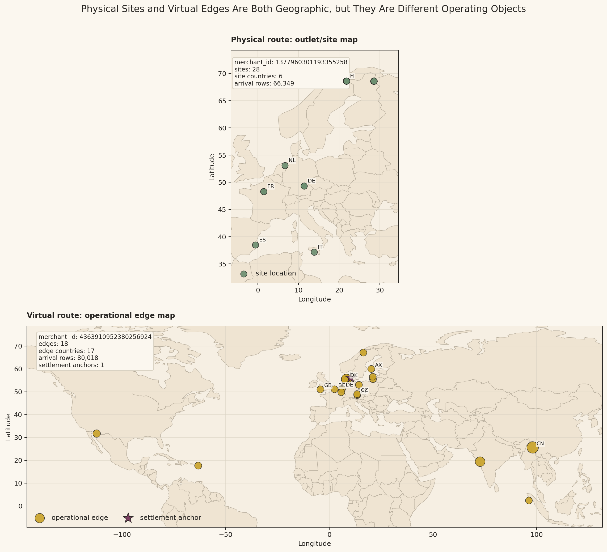
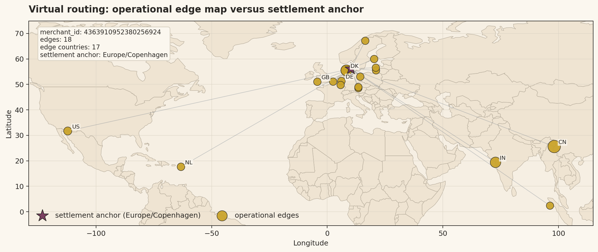
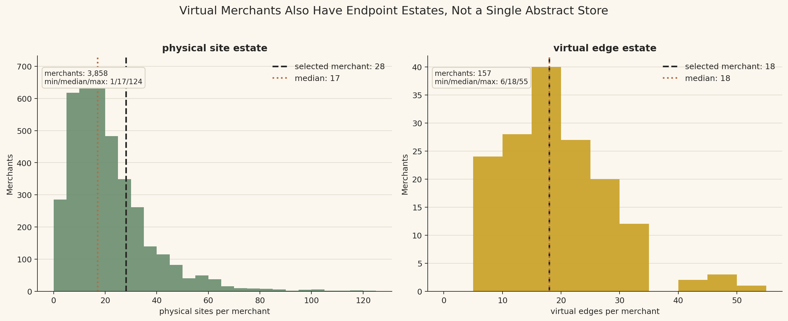

# Sub-Branch Investigation: `arrival_events_5B` Physical and Virtual Endpoint Geography

## Sub-branch question

The physical/virtual routing branch established that physical arrivals resolve through `site_id`, while virtual arrivals resolve through `edge_id`.

This sub-branch asks a more concrete question:

> Can we visualize the difference between physical site geography and virtual edge geography so that the route split is understandable as an operating distinction, not just a null-profile rule?

The short answer is yes, but with one correction to the initial intuition: virtual routing is not non-geographic. Virtual edges also carry coordinates. The difference is what the coordinates represent.

## Evidence used

Primary workbench evidence:

- [`arrival_events_physical_virtual_routing.md`](arrival_events_physical_virtual_routing.md)
- [`plot_arrival_events_physical_virtual_endpoint_geography.py`](../../../../scratch/plot_arrival_events_physical_virtual_endpoint_geography.py)
- [`selected_endpoint_merchants.csv`](../../../../exports/interface_world/traffic_primitives/branches/physical_virtual_routing/endpoint_geography/selected_endpoint_merchants.csv)
- [`representative_physical_merchant_sites.csv`](../../../../exports/interface_world/traffic_primitives/branches/physical_virtual_routing/endpoint_geography/representative_physical_merchant_sites.csv)
- [`representative_virtual_merchant_edges.csv`](../../../../exports/interface_world/traffic_primitives/branches/physical_virtual_routing/endpoint_geography/representative_virtual_merchant_edges.csv)
- [`representative_virtual_merchant_settlement.csv`](../../../../exports/interface_world/traffic_primitives/branches/physical_virtual_routing/endpoint_geography/representative_virtual_merchant_settlement.csv)
- [`endpoint_counts_by_route_merchant.csv`](../../../../exports/interface_world/traffic_primitives/branches/physical_virtual_routing/endpoint_geography/endpoint_counts_by_route_merchant.csv)
- Natural Earth 110m country boundaries cached under [`reference/ne_110m_admin_0_countries`](../../../../exports/interface_world/traffic_primitives/branches/physical_virtual_routing/endpoint_geography/reference/ne_110m_admin_0_countries)

Coordinate authorities used from the pinned run:

- `data/layer1/1B/site_locations`
- `data/layer1/3B/edge_catalogue`
- `data/layer1/3B/virtual_settlement`
- `data/layer2/5B/arrival_events`

## What the geography means

Physical route geography and virtual route geography are both spatial, but they describe different operating objects.

For physical routing, the geography is an outlet/site estate. The coordinate rows describe physical merchant sites: places the platform can treat as concrete merchant operating locations. In the coordinate authority used here, those locations are expressed as `merchant_id`, `legal_country_iso`, `site_order`, `lat_deg`, and `lon_deg`. In `arrival_events_5B`, physical arrivals carry `site_id` rather than `edge_id`, so the arrival is being attached to the physical site side of the route model.

For virtual routing, the geography is an operational edge estate. The coordinate rows describe virtual edges: network/payment/commerce endpoints that can carry routed traffic for the virtual merchant. They are still geographic because the edge catalogue carries `country_iso`, `lat_deg`, `lon_deg`, `tzid_operational`, and `edge_weight`. But those points should not be read as storefronts. They are route endpoints in a virtualized operating fabric.

The virtual merchant also has a settlement anchor. That anchor has its own `lat_deg`, `lon_deg`, and `tzid_settlement`. It is not the same thing as every operational edge. This is why virtual geography can have at least two layers: the edge locations that carry operational route context, and the settlement location that anchors settlement-time context.

## Why this uses a merchant pair, not one merchant

The current `arrival_events_5B` route-mode evidence says every merchant belongs to exactly one route mode in this primitive. A merchant is physical-routed or virtual-routed here; no merchant appears in both route modes.

So a single merchant cannot honestly demonstrate both physical sites and virtual edges inside this surface. To make the distinction visible without inventing a mixed merchant, this sub-branch uses:

| Example role | Merchant | Endpoint estate | Arrival rows |
|---|---:|---:|---:|
| physical example | `1377960301193355258` | `28` physical site coordinates across `6` countries | `66,349` |
| virtual example | `4363910952380256924` | `18` virtual edge coordinates across `17` countries, plus `1` settlement anchor | `80,018` |

The physical example is selected as a Europe-bounded multi-country site footprint so the explanatory map stays focused on the physical-versus-virtual distinction rather than on overseas-territory or legal-country edge cases. The virtual example is selected near the median virtual edge count, so it demonstrates that a virtual merchant can have multiple operational edges without needing an extreme case.

## Visual evidence and assessment

### G1. Physical site geography versus virtual edge geography

The upper map places one physical-route merchant against country outlines. This merchant has `28` site coordinates across `6` countries and `66,349` arrival rows in the arrival primitive. Each point is part of the merchant's physical site estate. The visual reads like an outlet geography: multiple concrete places where the platform can attach physical route context. The points should not be read as transactions. They are the spatial reference points behind the merchant's physical endpoint model.

The country labels in the upper map help make the concept concrete. The merchant's site estate is not only a count of locations; it has spatial spread across a recognizable regional map. Some sites cluster around nearby European countries, while another point sits away from that cluster. That matters because a physical `site_id` is not merely an arbitrary endpoint token. It represents a site-like geography that can later matter for local-time interpretation, country/site grouping, and endpoint-level exposure.

The lower map uses a virtual-route merchant instead, with `18` operational edges across `17` countries and `80,018` arrival rows. These points are also geographic, but they do not represent storefronts or outlet sites. They represent operational edge coordinates in the virtual routing fabric. That is why the virtual map has a broader edge-country footprint than the physical example even though it has fewer endpoint points.

The purple star in the lower map is the settlement anchor. It appears in the same regional frame as the operational edges, but it should not be read as just another edge. It is a separate coordinate concept attached to the virtual merchant. The lower map therefore carries two virtual geographies at once: operational edge geography and settlement anchor geography.

Reading the two panels together corrects the initial intuition. The difference is not that physical routing has geography and virtual routing has only a network id. Both have geography. The difference is the object represented by the geography. Physical coordinates describe site-like places. Virtual coordinates describe edge-like route endpoints, with settlement geography carried separately.

### G2. Virtual edge estate versus settlement anchor

The virtual side needs its own map because the two coordinate concepts can easily get collapsed inside the side-by-side comparison. This view is zoomed to the selected merchant's observed edge-and-settlement footprint rather than showing the whole world, so the edge spread can be read against actual country outlines.

The gold points are the `18` operational edges. Most sit across Europe, while others extend into the United States, the Caribbean/Central America region, India, China, and Southeast Asia. The map makes the point more concretely than a raw longitude/latitude grid: the edge estate is a distributed operational footprint, not a single location disguised as an id.

The star is the settlement anchor, shown here with `Europe/Copenhagen` settlement time. It sits near the European edge cluster, but it is still a separate object from the edge points. The faint connecting lines are not observed payment paths or transaction routes. They are only a visual device showing that the same merchant carries one settlement anchor while also carrying many operational edges.

The statistical implication is about grouping and denominators. If we later group virtual traffic by `tzid_operational`, we are reading the operational edge estate. If we group by `tzid_settlement`, we are reading settlement-clock anchoring. Both are attached to the same virtual merchant, but they are not the same geography. A case-rate view by operational edge and a case-rate view by settlement timezone may therefore answer different questions.

### G3. Endpoint counts per merchant

The left panel shows the distribution of physical site counts per physical merchant. Most physical merchants sit around the low tens of sites, with a median of `17`. The selected illustrative merchant has `34` sites, so it is above the median but still inside the ordinary body of the distribution rather than being a maximum-edge case. The full range runs from `1` to `124` physical sites per merchant.

That left panel is useful because it keeps the physical example honest. The map used a visibly multi-site physical merchant, but the distribution shows that multi-site physical routing is normal in this surface. Physical endpoint geography is not one merchant equals one site. Many physical merchants have site estates, and those estates vary in size.

The right panel performs the same check for virtual merchants. The median virtual merchant has `18` edges, and the selected virtual example also has `18`. That makes the virtual example a typical edge-count case rather than a cherry-picked extreme. The observed virtual range runs from `6` to `55` edges per merchant.

The right panel also corrects the idea that virtual means one abstract online store. In this surface, virtual merchants have edge estates. The edge estate is smaller than the physical site estate in total count, but it is still plural and variable. So a merchant-level comparison hides a second structure: endpoint-estate size.

Taken together, the two panels show why route geography cannot be reduced to merchant geography alone. A merchant can have many physical sites or many virtual edges. If we compare physical and virtual at merchant grain, endpoint-estate size disappears. If we compare them at endpoint grain, the unit of analysis changes. Both views are useful, but they are not interchangeable.

## Working interpretation

Physical and virtual route geography should be read as two different endpoint models, not as geographic versus non-geographic traffic.

Physical route geography is site geography: concrete locations/outlets where physical route context attaches. Virtual route geography is edge geography: distributed operational endpoints through which virtual route context attaches, with settlement geography carried separately by the virtual settlement anchor.

For later interface-world analysis, this means route mode should travel with geography and timezone interpretation. A physical `site_id` and a virtual `edge_id` are not interchangeable keys. They both help locate traffic, but they locate different operating objects.

## Lead carried forward

When we later inspect behavioural streams, truth products, and case products, route geography should be tested with at least three denominators:

- merchant-level route mode
- endpoint-level estate size
- operational versus settlement geography for virtual traffic

That prevents us from accidentally treating a virtual edge location, a settlement anchor, and a physical site as the same kind of place.
