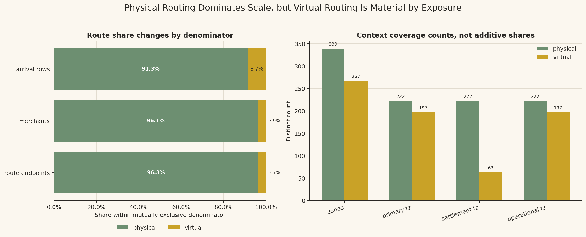
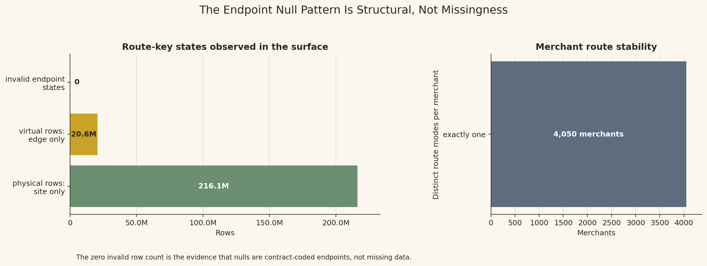
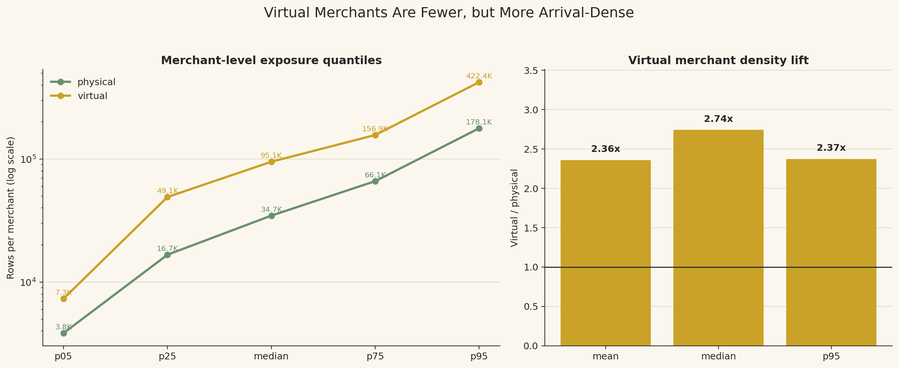
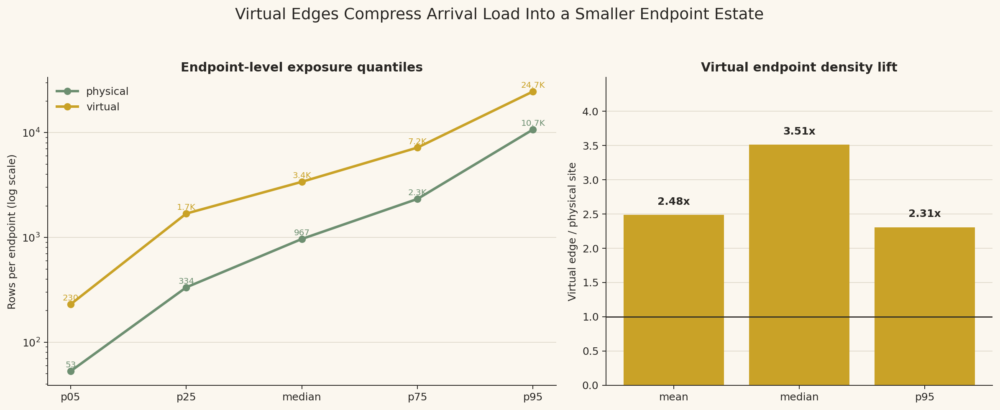
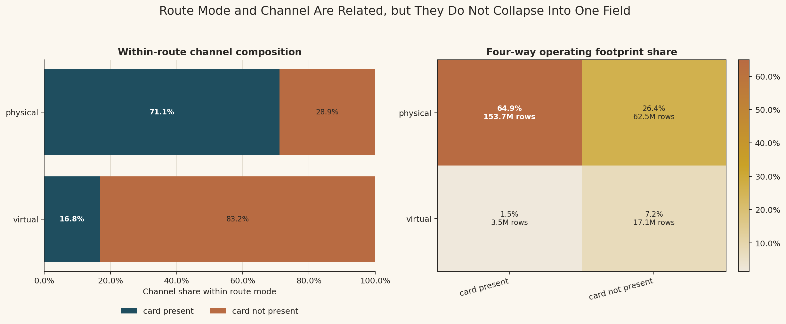
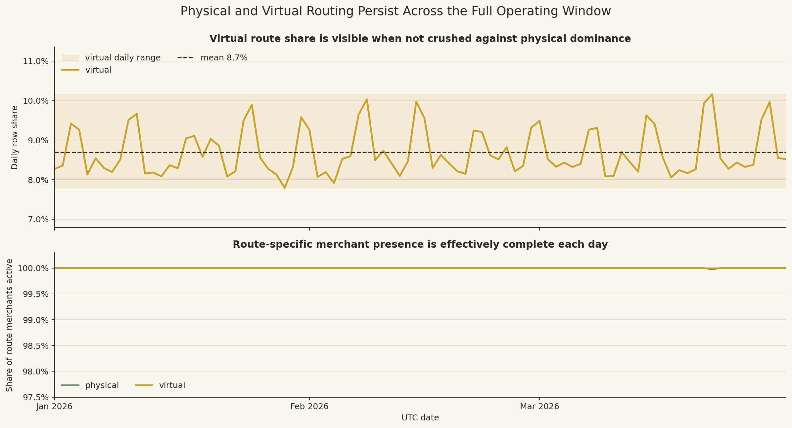
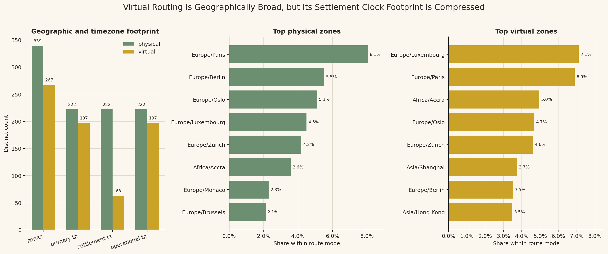

# Branch Investigation: `arrival_events_5B` Physical Versus Virtual Routing

## Branch question

The surface-level report says that the `site_id` / `edge_id` null profile is not random missingness. It encodes two route modes:

- physical arrivals: `is_virtual = false`, `site_id` populated, `edge_id` null
- virtual arrivals: `is_virtual = true`, `edge_id` populated, `site_id` null

This branch exists to unpack what that means in the operating fraud platform.

The question is:

> Is physical versus virtual routing merely a data-quality/null-profile detail, or is it a first-class operating split in the arrival-context surface?

The answer matters because downstream analysis will eventually compare behavioural streams, fraud truth, and case products. If route mode changes the denominator, endpoint density, merchant population, or channel intersection, then route mode must be preserved as analytical context rather than treated as a nuisance column.

## Evidence used

Primary references:

- [`docs/model_spec/data-engine/interface_pack/data_engine_interface.md`](../../../../../../../docs/model_spec/data-engine/interface_pack/data_engine_interface.md)
- [`docs/model_spec/data-engine/layer-2/specs/contracts/5B/dataset_dictionary.layer2.5B.yaml`](../../../../../../../docs/model_spec/data-engine/layer-2/specs/contracts/5B/dataset_dictionary.layer2.5B.yaml)
- [`docs/model_spec/data-engine/layer-2/specs/contracts/5B/schemas.5B.yaml`](../../../../../../../docs/model_spec/data-engine/layer-2/specs/contracts/5B/schemas.5B.yaml)
- [`docs/model_spec/data-engine/layer-2/specs/state-flow/5B/state.5B.s4.expanded.md`](../../../../../../../docs/model_spec/data-engine/layer-2/specs/state-flow/5B/state.5B.s4.expanded.md)
- [`docs/model_spec/data-engine/layer-2/specs/state-flow/5B/state.5B.s5.expanded.md`](../../../../../../../docs/model_spec/data-engine/layer-2/specs/state-flow/5B/state.5B.s5.expanded.md)

Workbench evidence:

- [`arrival_events_5B_investigation.md`](../arrival_events_5B_investigation.md)
- [`analyze_arrival_events_physical_virtual_routing.py`](../../../../scratch/analyze_arrival_events_physical_virtual_routing.py)
- [`route_overview.csv`](../../../../exports/interface_world/traffic_primitives/branches/physical_virtual_routing/route_overview.csv)
- [`route_consistency.csv`](../../../../exports/interface_world/traffic_primitives/branches/physical_virtual_routing/route_consistency.csv)
- [`merchant_route_stability.csv`](../../../../exports/interface_world/traffic_primitives/branches/physical_virtual_routing/merchant_route_stability.csv)
- [`merchant_volume_by_route.csv`](../../../../exports/interface_world/traffic_primitives/branches/physical_virtual_routing/merchant_volume_by_route.csv)
- [`endpoint_density.csv`](../../../../exports/interface_world/traffic_primitives/branches/physical_virtual_routing/endpoint_density.csv)
- [`route_by_channel.csv`](../../../../exports/interface_world/traffic_primitives/branches/physical_virtual_routing/route_by_channel.csv)
- [`route_daily_summary.csv`](../../../../exports/interface_world/traffic_primitives/branches/physical_virtual_routing/route_daily_summary.csv)
- [`route_daily_share_stats.csv`](../../../../exports/interface_world/traffic_primitives/branches/physical_virtual_routing/route_daily_share_stats.csv)
- [`top_zones_by_route.csv`](../../../../exports/interface_world/traffic_primitives/branches/physical_virtual_routing/top_zones_by_route.csv)
- [`physical_virtual_routing_summary.json`](../../../../exports/interface_world/traffic_primitives/branches/physical_virtual_routing/physical_virtual_routing_summary.json)

## What physical and virtual routing mean here

`is_virtual` is the route-endpoint flag of the arrival-context surface.

It is not the same thing as `channel_group`.

It is also not a generic boolean for "online transaction." In this surface, it tells the platform which kind of route endpoint the arrival is attached to:

| Route mode | Field contract | Operating meaning |
|---|---|---|
| physical | `is_virtual = false`, `site_id` populated, `edge_id` null | The arrival is attached to a physical merchant site/outlet. |
| virtual | `is_virtual = true`, `edge_id` populated, `site_id` null | The arrival is attached to a virtual edge from the virtual routing fabric. |

In operating terms, a physical site is a concrete merchant location or outlet that the platform can attach arrival context to. Examples include a supermarket branch, restaurant location, fuel station, pharmacy outlet, hotel desk, or any other merchant location where the transaction can be routed back to a physical operating site.

A virtual edge is different. It is a commerce or payment endpoint that is not represented as a physical outlet in this surface. Examples include an e-commerce checkout, marketplace seller endpoint, app checkout, hosted payment page, subscription billing endpoint, cloud POS fleet, or virtual-terminal-like route. The arrival is still real platform traffic, but the endpoint that carries the route context is an `edge_id`, not a `site_id`.

This is why `channel_group` and `is_virtual` must be kept separate. `channel_group` describes the payment-acceptance lane, such as `card_present` or `card_not_present`. `is_virtual` describes the route endpoint, meaning whether the arrival resolves through a physical `site_id` or a virtual `edge_id`. A card-not-present transaction can still be tied to a physical site, such as an online order fulfilled by a specific restaurant branch. A card-present transaction can also appear on a virtual edge, such as a mobile POS, transit, event, kiosk, or cloud POS setup where the payment is card-present in acceptance behaviour but routed through a virtualized endpoint estate.

The 5B contract is strict on this. Physical arrivals must resolve to a valid `site_id`. Virtual arrivals must resolve to a valid `edge_id`. A row with both endpoint ids populated, both endpoint ids missing, or endpoint ids inconsistent with `is_virtual` is invalid by the route contract.

In company-operating language, this field tells us whether the arrival-context system should recover physical site context or virtual edge context when enriching later traffic. That affects joins, denominators, endpoint-level analysis, feature context, and later comparison of fraud/case rates by route mode.

For the geography-specific clarification, see the sub-branch [`arrival_events_physical_virtual_endpoint_geography.md`](arrival_events_physical_virtual_endpoint_geography.md). That sub-branch illustrates the difference between physical site coordinates, virtual edge coordinates, and virtual settlement anchors without overloading this routing report.

## Route-mode scale

The arrival surface is mostly physical by rows and by merchants, but virtual routing is still a meaningful lane.

| Route mode | Rows | Row share | Merchants | Merchant share | Sites | Edges | Zones |
|---|---:|---:|---:|---:|---:|---:|---:|
| physical | `216,136,107` | `91.32%` | `3,893` | `96.12%` | `78,516` | `0` | `339` |
| virtual | `20,555,587` | `8.68%` | `157` | `3.88%` | `0` | `3,005` | `267` |

Physical routing is the dominant operating route. It covers nearly all merchants and most arrival rows.

Virtual routing is smaller, but not negligible. It accounts for only `3.88%` of merchants, yet `8.68%` of arrival rows. So virtual merchants are more arrival-dense on average than their merchant count suggests.

This is the first route-level denominator warning. If we count merchants, virtual routing looks very small. If we count arrival exposure, it is still a minority but more material. If we later count endpoints, it becomes another shape again: physical has `78,516` sites, while virtual has `3,005` edges.

## Endpoint key consistency

The endpoint-null profile is structurally clean.

| Route key state | Rows | Merchants |
|---|---:|---:|
| `physical_valid_site_only` | `216,136,107` | `3,893` |
| `virtual_valid_edge_only` | `20,555,587` | `157` |

No inconsistent route-key states appear in the compact check:

- no rows with both `site_id` and `edge_id` null
- no rows with both `site_id` and `edge_id` populated
- no physical rows missing `site_id`
- no virtual rows missing `edge_id`

This is why the nulls should not be treated as missing data. A null `edge_id` on a physical row is expected because physical rows are keyed by `site_id`. A null `site_id` on a virtual row is expected because virtual rows are keyed by `edge_id`.

The branch therefore changes how those columns should be handled in analysis. A generic null-count report would make the surface look partially missing. The contract-aware read says the route endpoint is complete, but represented by mutually exclusive columns.

## Merchant route stability

Route mode is merchant-stable in this primitive.

| Distinct route modes per merchant | Merchants | Rows |
|---:|---:|---:|
| `1` | `4,050` | `236,691,694` |

Every merchant appears in exactly one route mode over the three-month arrival-context extract.

This is a major interpretive fact. Route mode is not behaving as a row-by-row endpoint choice for the same merchant. It behaves like a merchant route assignment in this arrival primitive: a merchant is physical-routed or virtual-routed for this surface.

That does not mean future behavioural streams cannot carry more detailed event context. It means that within `arrival_events_5B`, route mode partitions the merchant population into stable route lanes. Later analysis should treat route mode as a merchant-level segmentation field unless a downstream surface proves more granular behaviour.

## Merchant exposure by route mode

Virtual routing has fewer merchants but heavier arrival exposure per merchant.

| Route mode | Merchants | Median rows per merchant | Mean rows per merchant | p95 rows per merchant | Max rows per merchant |
|---|---:|---:|---:|---:|---:|
| physical | `3,893` | `34,690` | `55,519` | `178,077` | `841,654` |
| virtual | `157` | `95,103` | `130,927` | `422,411` | `763,822` |

The virtual lane has:

- `2.36x` the mean rows per merchant of the physical lane
- `2.74x` the median rows per merchant of the physical lane
- `2.37x` the p95 rows per merchant of the physical lane

So virtual routing is not merely a tiny edge case attached to a few low-volume merchants. It is a smaller merchant population with materially heavier arrival exposure per merchant.

This matters for future fraud and case analysis. A virtual lane can produce a disproportionate amount of row-level activity relative to merchant count. Raw counts may therefore overstate or understate route differences unless the denominator is declared: arrival-weighted, merchant-weighted, endpoint-weighted, flow-weighted, label-weighted, or case-weighted.

## Endpoint density

Physical and virtual route endpoints also have different density profiles.

| Endpoint type | Endpoints | Rows | Median rows per endpoint | Mean rows per endpoint | p95 rows per endpoint | Max rows per endpoint |
|---|---:|---:|---:|---:|---:|---:|
| physical site | `78,516` | `216,136,107` | `967` | `2,753` | `10,710` | `403,212` |
| virtual edge | `3,005` | `20,555,587` | `3,394` | `6,840` | `24,693` | `137,585` |

Virtual edges are fewer than physical sites, but they are more arrival-dense:

- `2.49x` the mean rows per endpoint of physical sites
- `3.51x` the median rows per endpoint of physical sites
- `2.31x` the p95 rows per endpoint of physical sites

That gives route mode a second denominator layer. Merchant exposure is heavier in the virtual lane, and endpoint exposure is also heavier in the virtual lane. This suggests that virtual route analysis should not be reduced to "small share of rows." It has a compressed endpoint estate carrying a meaningful arrival load.

The endpoint maximums also show tails on both sides. The largest physical site carries `403,212` rows, while the largest virtual edge carries `137,585` rows. So physical has the broader estate and the highest single endpoint in this run, while virtual has the denser typical endpoint.

## Channel interaction

Route mode intersects with channel, but it does not collapse into channel.

| Route mode | Channel | Rows | Share within route mode | Share within channel | Merchants | Sites | Edges |
|---|---|---:|---:|---:|---:|---:|---:|
| physical | `card_present` | `153,665,526` | `71.10%` | `97.80%` | `3,229` | `68,780` | `0` |
| physical | `card_not_present` | `62,470,581` | `28.90%` | `78.51%` | `664` | `9,736` | `0` |
| virtual | `card_not_present` | `17,103,577` | `83.21%` | `21.49%` | `125` | `0` | `2,468` |
| virtual | `card_present` | `3,452,010` | `16.79%` | `2.20%` | `32` | `0` | `537` |

The route split and channel split are related in a strong but incomplete way.

Physical routing is mostly card-present, but not exclusively. Virtual routing is mostly card-not-present, but not exclusively. This is consistent with the channel branch's interpretation: `channel_group` describes acceptance lane, while `is_virtual` describes routing endpoint.

The route branch therefore preserves four operating contexts:

- physical card-present
- physical card-not-present
- virtual card-present
- virtual card-not-present

That four-way structure is likely more useful for later fraud/case analysis than either `channel_group` alone or `is_virtual` alone.

## Time continuity

Both route modes are present across the full 90-day operating window.

| Route mode | Days present | Min daily share | Median daily share | Mean daily share | Max daily share | Daily share stddev |
|---|---:|---:|---:|---:|---:|---:|
| physical | `90` | `89.84%` | `91.50%` | `91.30%` | `92.21%` | `0.59pp` |
| virtual | `90` | `7.79%` | `8.50%` | `8.70%` | `10.16%` | `0.59pp` |

The virtual lane is not a short-period insertion or a partial extract artefact. It is present every day.

The daily share is also bounded. Virtual routing moves between `7.79%` and `10.16%` of daily arrivals. That is enough variation to matter when reading daily rates, but not enough to suggest that virtual coverage is intermittent.

So route mode can be used as a stable denominator across the full January-March period. Later daily fraud or case movements should still control for route mix, but the route denominator itself appears continuously available.

## Zone and timezone footprint

Physical routing covers all `339` observed zones. Virtual routing covers `267` zones.

Physical routing has `222` primary, settlement, and operational timezones. Virtual routing has `197` primary and operational timezones, but only `63` settlement timezones.

That tells us virtual routing is geographically broad but semantically different in its clock footprint. The route is not just a small local special case: it spans many zones and timezones. At the same time, its settlement-timezone footprint is more compressed than its primary/operational footprint, which matches the idea that virtual edge routing can carry different settlement versus operational clock semantics.

The top zones also differ by route mode:

| Route mode | Top zone | Rows | Share within route |
|---|---|---:|---:|
| physical | `Europe/Paris` | `17,433,798` | `8.07%` |
| virtual | `Europe/Luxembourg` | `1,461,604` | `7.11%` |

The top zone share is not overwhelming in either route mode. Physical and virtual route contexts are broad rather than dominated by one zone.

This is a caution for later geography work. Route mode and zone should not be collapsed. A virtual route is not automatically a single virtual geography; it still carries a distributed route/time context.

## What this branch lets us trust

This branch gives us confidence in the route endpoint structure of `arrival_events_5B`.

The endpoint keys are contract-consistent. Physical rows have `site_id` and no `edge_id`; virtual rows have `edge_id` and no `site_id`. The null pattern is therefore structural and should be interpreted, not cleaned away.

The route mode is stable at merchant level in this primitive. Every merchant appears in exactly one route lane.

Both route lanes persist through the whole operating window. Virtual routing is smaller, but present every day and materially arrival-dense.

Route mode carries independent analytical meaning from channel. Channel and route interact, but neither replaces the other.

## What this branch does not prove

This branch does not prove that virtual traffic is riskier.

It does not prove that physical traffic is safer.

It does not prove that virtual edges cause higher case rates, fraud rates, false-positive rates, or model burden.

It does not prove that the platform should score physical and virtual routes differently.

Those questions require behavioural streams, truth products, and case surfaces. At this stage, the defensible claim is about arrival-context route structure: endpoint mode, denominator shape, exposure density, and route-channel intersection.

## Working interpretation

Physical versus virtual routing is a first-class operating split in `arrival_events_5B`.

The surface is physically dominated by rows, merchants, and site estate, but virtual routing is not marginal in analytical meaning. It has fewer merchants and fewer endpoints, yet it carries heavier exposure per merchant and per endpoint. It is also present every day, spans many zones/timezones, and intersects strongly with card-not-present without being identical to it.

So route mode should be carried forward as a required segmentation field when we inspect behavioural streams, truth products, and case products. The wrong posture would be to treat `site_id` and `edge_id` nulls as missingness or to collapse virtual routing into card-not-present. The right posture is to preserve the route endpoint model and declare the denominator being used whenever physical and virtual are compared.

## Leads exposed

1. Virtual routing is more arrival-dense per merchant and per endpoint. Later fraud/case analysis should compare route-level rates using row, merchant, endpoint, flow, label, and case denominators where appropriate.

2. Route mode is merchant-stable in this primitive. When moving to `6B`, we should verify whether behavioural streams preserve this route assignment or introduce additional event-level route semantics.

3. The route-channel intersection should remain a four-way segmentation, not two separate one-dimensional cuts. Physical card-not-present and virtual card-present are both real observed contexts in this surface.

4. Virtual settlement-timezone coverage is much more compressed than virtual primary/operational timezone coverage. A later timezone branch should inspect what that means before using local-time features or settlement-time summaries.

5. Endpoint density is uneven in both physical and virtual estates. If later cases or fraud labels concentrate by endpoint, the first question should be whether that reflects endpoint exposure before interpreting it as endpoint risk.

## Appendix: visual evidence and assessment

This appendix holds the visual evidence behind the branch. Several figures contain more than one plot, so the assessment reads them panel by panel before drawing the combined implication. The point is not to restate the branch in shorter form, but to expose the statistical situation visible in each view.

### A1. Route scale and denominator shape

The left plot reads the same physical/virtual split through three different denominators. On arrival rows, physical routing carries `91.3%` of observed traffic and virtual routing carries `8.7%`. That is the exposure view: it tells us how much of the operating arrival surface each route lane contributes. If the question is platform load, traffic share, queue pressure, or row-weighted model exposure, this is the denominator that matters.

The second bar in the left plot changes the denominator from rows to merchants. Virtual falls to `3.9%` of merchants. That difference between `8.7%` of rows and `3.9%` of merchants is not a rounding detail; it says virtual merchants are carrying more row exposure per merchant than their population share would imply. The row denominator and merchant denominator are therefore answering different questions. A statement like "virtual is small" is technically true, but incomplete unless we state whether we mean small by merchant count or small by arrival exposure.

The third bar in the left plot moves to route endpoints. Virtual is `3.7%` of route endpoints, close to its merchant share rather than its row share. This tightens the reading: virtual is not only a smaller merchant population, it is also a smaller endpoint estate. Yet it has a larger row share than either of those two structural denominators. That is the earliest visual sign of virtual-route compression.

The right plot is not a share plot; it is a context-coverage plot. Physical routing covers `339` zones, while virtual routing still covers `267`. The virtual lane is therefore not a tiny local exception. It has broad geographic reach despite having fewer merchants and endpoints.

The timezone bars add the more subtle point. Virtual has `197` primary timezones and `197` operational timezones, but only `63` settlement timezones. So virtual routing is broad in operational context, but more compressed in settlement-clock context. That distinction will matter later if we compare outcomes by local operating time versus settlement time. The combined message of the figure is that route mode changes both denominator and clock/geography semantics.

### A2. Endpoint-key contract and merchant route stability

The left plot is a contract-read of the endpoint keys. Physical rows appear only in the valid `site_id`-only state, with `216.1M` rows. Virtual rows appear only in the valid `edge_id`-only state, with `20.6M` rows. The invalid endpoint states are explicitly shown as zero. That zero is important because it tells us the mutually exclusive endpoint structure is not merely assumed from schema notes; it is observed in the data.

This changes how we should read nulls. If we ran a generic null report, `site_id` and `edge_id` would look incomplete because one of them is null on every row. But the plot shows that this is not missingness. A physical row is complete when `site_id` is populated and `edge_id` is null. A virtual row is complete when `edge_id` is populated and `site_id` is null. So the endpoint key is complete, but represented through two mutually exclusive columns.

The right plot then moves from rows to merchants. All `4,050` merchants have exactly one route mode in this primitive. That means route mode is merchant-stable inside `arrival_events_5B`. It is not behaving like a transaction-by-transaction routing choice where the same merchant alternates between physical and virtual endpoints.

Those two panels together give the route contract its analytical meaning. At row level, the endpoint key is structurally clean. At merchant level, the route assignment partitions the merchant universe. Later, if a row-weighted outcome differs by route, we cannot interpret it as "same merchants behaving differently by endpoint" unless a downstream surface proves that more granular behaviour exists. In this primitive, the route split is also a population split.

### A3. Merchant-level arrival exposure by route

The left plot compares rows per merchant across route modes using quantiles. The x-axis moves from p05 to p95, so we are not only seeing a mean; we are seeing how the lower, middle, and upper parts of each route population behave. The virtual line sits above the physical line at every displayed quantile. That means heavier virtual merchant exposure is not being driven only by one extreme high-volume merchant. It is visible across the distribution.

At the center of the distribution, the median virtual merchant carries about `95.1K` arrivals, while the median physical merchant carries about `34.7K`. In practical terms, a typical virtual merchant in this primitive receives almost three times the arrival exposure of a typical physical merchant. This matters because a row-weighted calculation will naturally hear more from virtual merchants than their merchant count suggests.

At the upper end, the p95 virtual merchant reaches about `422.4K` arrivals, compared with about `178.1K` for physical. The gap therefore persists in the high-exposure band. The use of a log scale is not cosmetic here. It lets us compare p05, median, and p95 values on the same visual surface without losing the lower quantiles under the larger upper-tail values.

The right plot translates those quantile differences into lift ratios: virtual is `2.36x` physical at the mean, `2.74x` at the median, and `2.37x` at p95. The median lift being the largest of the three is informative. It says the virtual density difference is especially strong around the typical merchant, not merely at the tail. The analytical consequence is clear: route comparisons must distinguish between "share of merchants" and "share of merchant exposure." Virtual has few merchants, but those merchants are arrival-dense.

### A4. Endpoint-level exposure by route

The left plot repeats the exposure question at endpoint grain. The unit is no longer a merchant. For physical routing, the endpoint is a site. For virtual routing, the endpoint is an edge. This matters because endpoint-level analysis answers a different question: how much arrival load is carried by the places or route endpoints through which traffic is attached.

At the median, a virtual edge carries about `3.4K` arrivals, while a physical site carries about `967`. So the typical virtual endpoint is much denser than the typical physical endpoint. This is not the same statement as "virtual merchants are denser"; it is a second density statement at a different grain.

At p95, virtual edges carry about `24.7K` arrivals compared with about `10.7K` for physical sites. The high-exposure endpoint tail is therefore also heavier for virtual edges. But the visual still shows both route modes have endpoint tails; physical has dense sites too, just not as dense at the shown quantiles.

The right plot gives the lift ratios: `2.48x` at the mean, `3.51x` at the median, and `2.31x` at p95. The median lift again stands out. A typical virtual edge carries more than three times the arrival load of a typical physical site. This is the endpoint version of compression: fewer virtual endpoints are carrying a heavier load per endpoint. If later case or fraud products concentrate on virtual edges, the first investigation should be exposure-adjustment before any risk interpretation.

### A5. Route and channel intersection

The left plot reads channel composition inside each route mode. Physical routing is mostly card-present at `71.1%`, but the remaining `28.9%` is card-not-present. That is not a small rounding cell; it is more than a quarter of physical-route arrivals. So physical route does not mean "customer physically presented a card at a storefront" in a simplistic way. It means the arrival resolves through physical site routing, while channel still has its own acceptance-lane meaning.

The same left plot shows the inverse pattern for virtual routing. Virtual is mostly card-not-present at `83.2%`, but `16.8%` is card-present. That minority cell is conceptually important because it prevents us from collapsing virtual routing into CNP. A virtual edge can carry a card-present acceptance context, just as a physical site can carry card-not-present context.

The right plot changes from within-route composition to total operating footprint. Physical card-present is the dominant cell at `64.9%` of all arrival rows. Physical card-not-present is the second major cell at `26.4%`. Together, those two physical cells explain why the whole surface looks physically dominated.

The two virtual cells are smaller but analytically real. Virtual card-not-present contributes `7.2%` of total arrivals, and virtual card-present contributes `1.5%`. If we erase the smaller virtual card-present cell because it is small, we also erase the evidence that route and channel are not the same variable. The figure therefore supports a four-cell operating segmentation: physical CP, physical CNP, virtual CP, and virtual CNP.

### A6. Daily route continuity

The upper plot focuses only on virtual daily row share, rather than plotting physical and virtual on the same full-scale axis where the virtual movement would be visually crushed. This choice matters because the question is not whether physical is larger; we already know that. The question is whether the virtual lane is consistently present and how much its daily share moves.

The virtual line stays within a bounded range, roughly `7.8%` to `10.2%`, with a mean around `8.7%`. There are visible peaks and troughs, so daily route mix is not perfectly flat. That means a daily fraud or case-rate chart could be affected by route mix if virtual and physical later show different outcome behaviour. But the route share is not behaving like a late-arriving feed, a short outage, or a partial-period insertion.

The lower plot checks merchant presence rather than row share. Both route populations are effectively active across the operating window. This is the denominator support behind using route mode over the full January-March extract. We are not comparing one route mode with full-period merchant coverage against another route mode that only exists for part of the horizon.

Taken together, the panels give a useful boundary. Route mode is stable enough to carry as a full-period segmentation field, but its daily share is not perfectly constant. Later daily outcome analysis should therefore preserve route mode and, where necessary, control for route mix.

### A7. Geographic and timezone footprint

The left plot compares the breadth of route context. Physical routing covers all `339` observed zones. Virtual routing covers `267` zones. That is smaller, but still broad. So virtual routing should not be read as a narrow special geography or a single virtual region.

The same left plot then separates primary, settlement, and operational timezone counts. Physical has `222` in all three timezone categories. Virtual has `197` primary timezones and `197` operational timezones, but only `63` settlement timezones. That is the key statistical asymmetry: virtual route geography is broad at the operational edge layer, but settlement clock geography is much more compressed.

The middle plot ranks the top physical zones. `Europe/Paris` leads at `8.1%`, followed by several European zones and `Africa/Accra`. The lead zone is not dominant enough to define the whole physical lane. Physical routing is broad and distributed, even though some zones carry more share than others.

The right plot ranks the top virtual zones. `Europe/Luxembourg` leads at `7.1%`, with `Europe/Paris` very close at `6.9%`, and `Africa/Accra`, `Europe/Oslo`, `Europe/Zurich`, and Asian zones also appearing. Again, there is no single-zone dominance. The virtual lane has a different top-zone shape from physical, but it is still distributed.

The combined reading is that geography and clock semantics need to be handled carefully. A physical site zone, a virtual operational zone, and a virtual settlement timezone can all sound like "location", but they are not the same analytical object. If later analysis uses local time, settlement time, operational zone, or geographic footprint, the route model has to remain visible.
