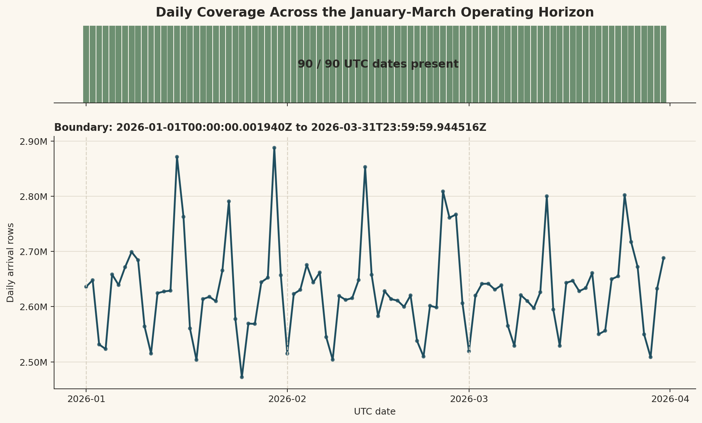
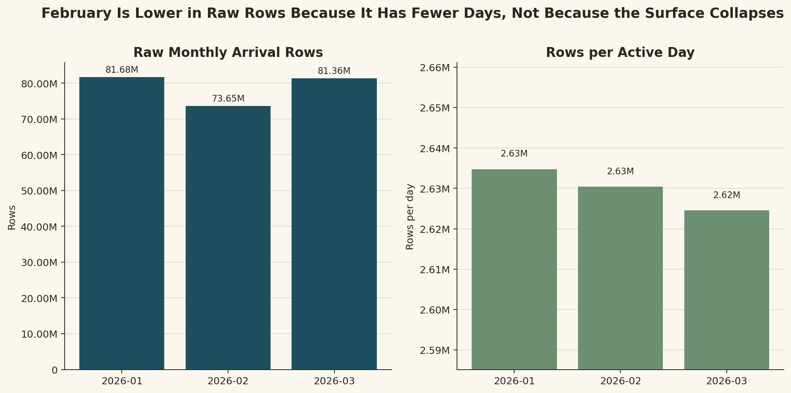
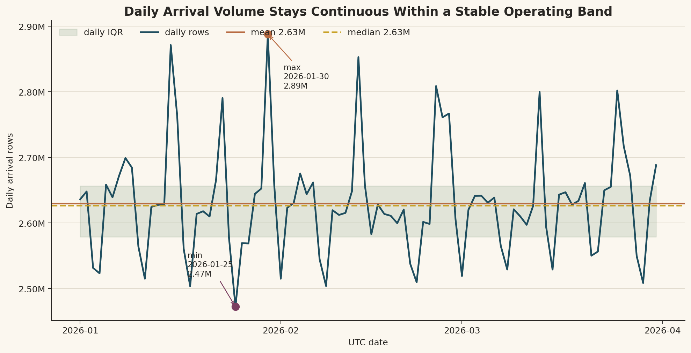
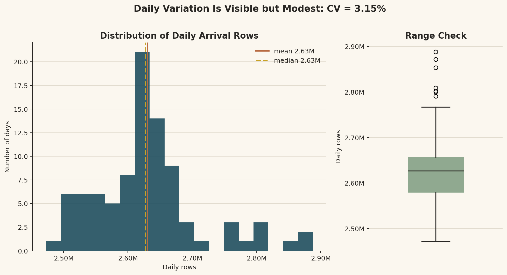
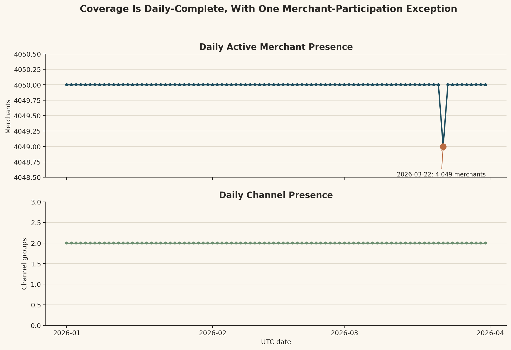
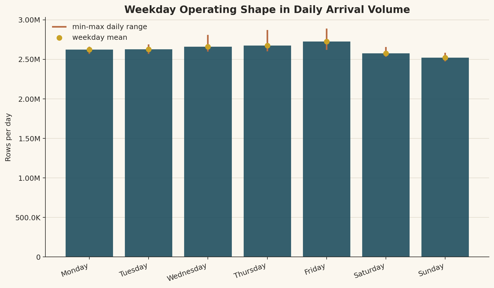
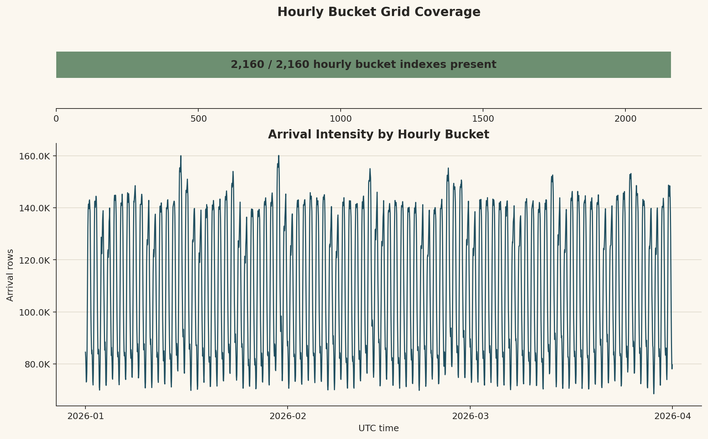
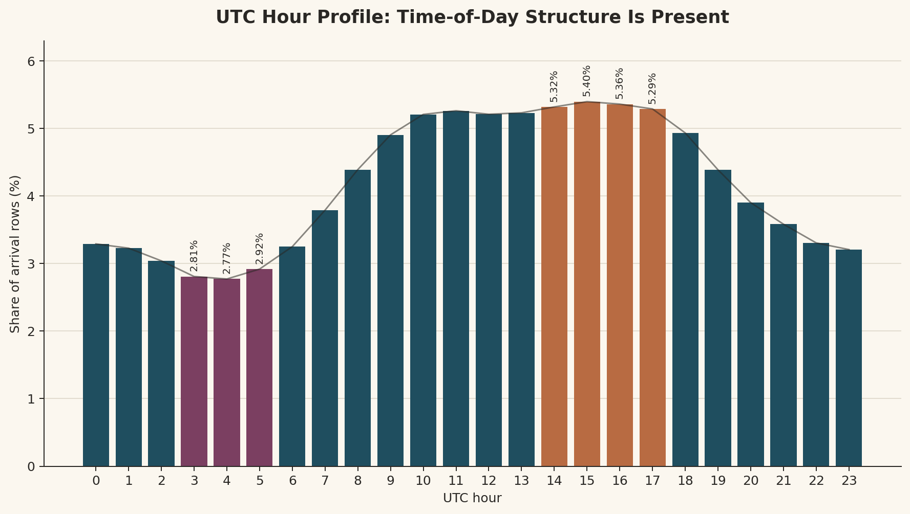

# Branch Investigation: `arrival_events_5B` Time Coverage

## Branch question

The main `arrival_events_5B` report says the surface spans the full January-March operating window and looks like a complete extract rather than an obviously gapped period.

This branch unpacks that claim.

The question is:

> Does `arrival_events_5B` give us a continuous three-month operating context surface, and what does that continuity allow us to trust or not trust in later analysis?

## Evidence used

Primary report:

- [`arrival_events_5B_investigation.md`](../arrival_events_5B_investigation.md)

Workbench exports:

- [`arrival_events_identity_summary.csv`](../../../../exports/interface_world/traffic_primitives/arrival_events_identity_summary.csv)
- [`arrival_events_month_summary.csv`](../../../../exports/interface_world/traffic_primitives/arrival_events_month_summary.csv)
- [`arrival_events_daily_summary.csv`](../../../../exports/interface_world/traffic_primitives/arrival_events_daily_summary.csv)
- [`arrival_events_daily_stats.csv`](../../../../exports/interface_world/traffic_primitives/arrival_events_daily_stats.csv)
- [`arrival_events_utc_hour_summary.csv`](../../../../exports/interface_world/traffic_primitives/arrival_events_utc_hour_summary.csv)
- [`bucket_index_summary.csv`](../../../../exports/interface_world/traffic_primitives/branches/grain_and_identity/bucket_index_summary.csv)

## What time coverage means here

Time coverage is not the same thing as traffic uniformity.

For this surface, time coverage means the arrival-context ledger spans the expected operating horizon without an obvious missing month, missing day sequence, or broken bucket grid. It asks whether the data gives us a continuous observation window that can support later traffic, label, and case-rate analysis.

It does not mean every hour has the same number of arrivals. It does not mean every merchant contributes equally every day. It also does not mean fraud, bank action, or case outcomes are covered here; those questions belong to later truth and case surfaces.

## Horizon boundary

The observed UTC boundary is:

- first timestamp: `2026-01-01T00:00:00.001940Z`
- last timestamp: `2026-03-31T23:59:59.944516Z`
- active UTC dates: `90`

That is the full January-March operating window. The surface starts immediately after midnight on January 1 and ends just before midnight on March 31. At this level, there is no evidence that the extract begins late, ends early, or omits a major part of the quarter.

This matters because many later metrics will use this surface as the timing/routing context for behavioural traffic. If the context surface had a partial horizon, later rate denominators could become misleading. Here, the horizon boundary supports treating the primitive as a full three-month operating context baseline.

## Calendar-month coverage

Monthly totals are:

| Month | Rows | Active merchants | Active days | Rows per active day |
|---|---:|---:|---:|---:|
| `2026-01` | `81,678,596` | `4,050` | `31` | `2,634,793` |
| `2026-02` | `73,652,566` | `4,050` | `28` | `2,630,449` |
| `2026-03` | `81,360,532` | `4,050` | `31` | `2,624,533` |

The raw monthly totals show February lower than January and March. That raw difference is mostly calendar length, not an obvious February traffic collapse. Once normalized by active days, the monthly daily averages are close:

- January: about `2.635M` rows per active day
- February: about `2.630M` rows per active day
- March: about `2.625M` rows per active day

This is the first reason the surface reads like a complete operating extract. The month totals behave as we would expect from a continuous daily process over months of different lengths.

The active-merchant count is also stable at month level. Each month touches all `4,050` merchants at least once. That does not mean every merchant is active every day, but it does mean no month loses a major merchant population.

## Daily coverage and stability

The daily summary contains `90` rows, one for each UTC date from `2026-01-01` through `2026-03-31`.

Daily row statistics:

| Metric | Value |
|---|---:|
| Minimum daily rows | `2,472,304` |
| p25 daily rows | `2,578,974` |
| Mean daily rows | `2,629,908` |
| Median daily rows | `2,626,903` |
| p75 daily rows | `2,656,527` |
| Maximum daily rows | `2,887,820` |
| Daily standard deviation | `82,932` |

The mean and median are close, which tells us the daily volume center is stable. The daily standard deviation is about `3.15%` of the mean, so the day-to-day variation is visible but not large relative to the daily traffic base.

The minimum daily volume occurs on `2026-01-25` with `2,472,304` rows. The maximum occurs on `2026-01-30` with `2,887,820` rows. Relative to the mean, the minimum is about `94.0%` of average daily volume and the maximum is about `109.8%` of average daily volume.

That range supports the continuity claim. The surface is not perfectly flat, and it should not be expected to be flat, but the daily totals do not show an obvious missing-day collapse or runaway duplicate-day explosion.

## Daily merchant and channel presence

The daily summary shows both channels present every day.

Merchant presence is nearly complete every day:

- `89` days have `4,050` active merchants
- `1` day has `4,049` active merchants: `2026-03-22`

This is an important nuance. The main report's month-level statement that every month has `4,050` active merchants is true, but the daily view shows one day where one merchant does not appear. That is not evidence of a coverage defect by itself. It is a normal distinction between month-level participation and day-level participation.

The practical reading is that the surface has full calendar-day coverage and nearly complete daily merchant participation. We should not phrase it as "every merchant appears every day" unless that one-day exception is handled.

## Weekday shape

A simple weekday aggregation shows a mild operating-week pattern:

| Weekday | Days | Rows | Mean rows per day |
|---|---:|---:|---:|
| Monday | `13` | `34,105,596` | `2,623,507` |
| Tuesday | `13` | `34,150,828` | `2,626,987` |
| Wednesday | `12` | `31,935,013` | `2,661,251` |
| Thursday | `13` | `34,785,982` | `2,675,845` |
| Friday | `13` | `35,448,430` | `2,726,802` |
| Saturday | `13` | `33,497,724` | `2,576,748` |
| Sunday | `13` | `32,768,121` | `2,520,625` |

Friday is the strongest average day, and Sunday is the weakest. This does not change the coverage conclusion, but it does tell us the surface is not temporally featureless. The arrival process carries a weekly rhythm.

That rhythm is useful for later analysis because fraud rates, case rates, and review workload should not be interpreted against a flat-time assumption. If later surfaces show outcome changes by day, we need to distinguish true outcome movement from ordinary traffic rhythm.

## Bucket-grid coverage

The observed `bucket_index` range is:

- minimum: `0`
- maximum: `2,159`
- distinct bucket indexes: `2,160`

The branch-level bucket summary confirms all expected bucket indexes are present. Since `90 * 24 = 2,160`, this supports the reading that the run behaves as an hourly UTC grid over the 90-day horizon.

This gives us stronger evidence than date coverage alone. A dataset could have all dates present but still have missing hourly sections. Here, the bucket grid supports continuous hourly horizon coverage at the primitive's declared time-grid level.

That does not mean every bucket has the same row count. It means every bucket exists and carries arrivals.

## UTC-hour profile as a coverage sanity check

The UTC-hour summary is not the main time-coverage evidence, but it helps confirm that the surface carries operating-time structure.

The lowest row shares occur around early UTC hours:

- `03:00`: `2.81%`
- `04:00`: `2.77%`
- `05:00`: `2.92%`

The strongest row shares occur during the late-morning to late-afternoon UTC band:

- `14:00`: `5.32%`
- `15:00`: `5.40%`
- `16:00`: `5.36%`
- `17:00`: `5.29%`

This pattern is consistent with an operating traffic surface rather than a uniformly sprayed timestamp field. The field carries time-of-day shape, which will matter when we later compare UTC time with operational local time.

## What this coverage lets us trust

The time coverage supports these uses:

- treating January-March as a continuous operating context horizon
- computing daily and monthly arrival-volume baselines
- joining later behavioural, truth, and case surfaces back to a stable context period
- using `bucket_index` for hourly time-grid analysis
- comparing later outcome rates against a continuous traffic denominator

The main value is denominator trust. If later analysis says "fraud rate per day," "case rate per month," or "traffic share by hour," this surface gives us a continuous arrival-context denominator for the same operating period.

## What this coverage does not prove

The coverage does not prove:

- that fraud labels are complete across the same horizon
- that case timelines finish inside January-March
- that every merchant appears every day
- that local-time interpretation is already solved
- that daily traffic should be treated as uniform
- that `arrival_events_5B` is the canonical scored transaction stream

The last point matters. This is a time-safe arrival-context surface. It gives timing and routing context behind the platform's traffic, but it is not by itself the behavioural transaction stream, the truth surface, or the case surface.

## Working interpretation

`arrival_events_5B` has complete time coverage for the January-March operating horizon at the date and hourly bucket levels.

The month totals align with calendar length, the daily totals remain within a relatively stable operating band, both channels appear every day, and the bucket grid covers all `2,160` expected hourly slots. There is one small daily merchant-participation exception on `2026-03-22`, where `4,049` merchants appear instead of `4,050`, but that does not undermine the broader coverage claim.

The correct conclusion is not "traffic is uniform." The correct conclusion is that the arrival-context surface is continuous enough to serve as a three-month operating denominator for later traffic, label, and case-rate interpretation.

## Leads exposed

1. `bucket_index` deserves a deeper time-grid branch: hourly coverage is complete, but the repeated traffic rhythm needs its own analysis.

2. UTC time should later be compared with local operating time, because the surface carries primary, settlement, and operational local timestamp fields.

3. The one-day `4,049` merchant participation exception on `2026-03-22` should be kept in mind if a later analysis requires strict merchant-by-day completeness.

4. When truth products and case timelines are inspected, we should verify whether their effective time coverage aligns with this arrival-context denominator or extends beyond it.

## Appendix: visual evidence

