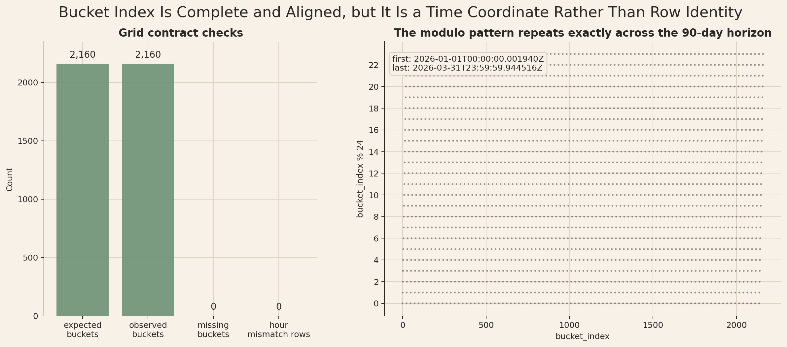
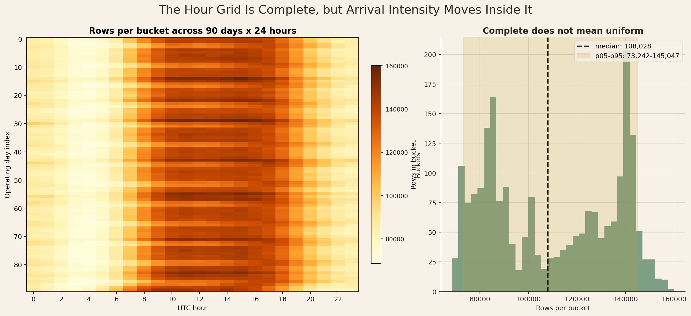
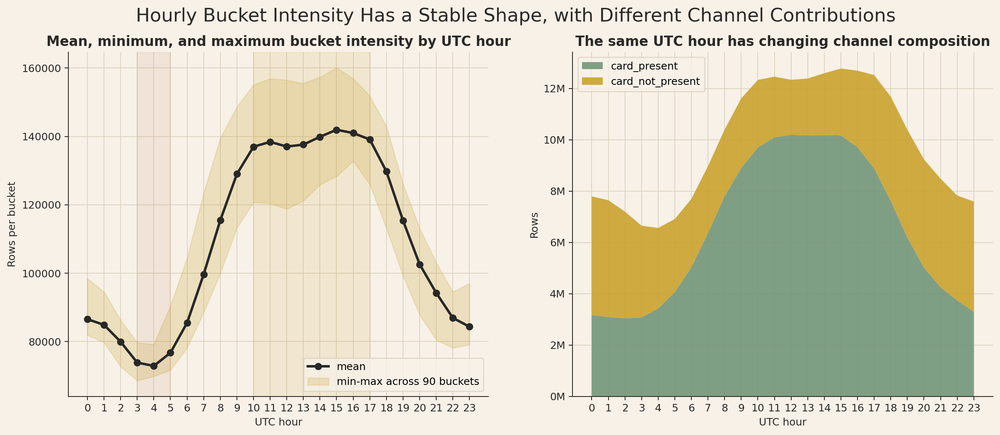
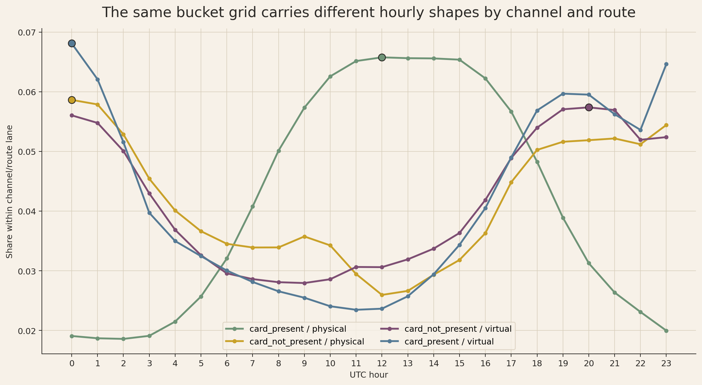
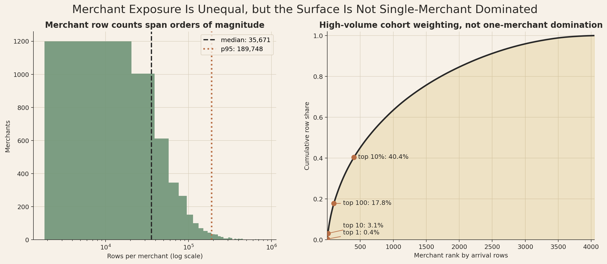
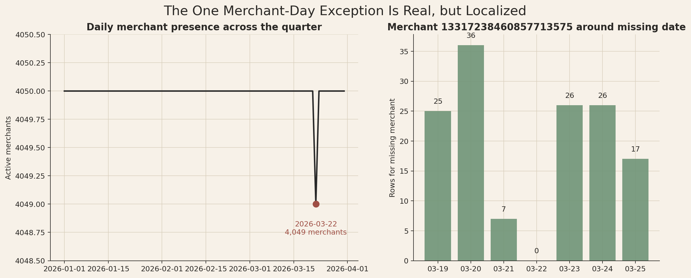

# Branch Investigation: `arrival_events_5B` Time Grid and Exposure Discipline

## Branch question

The earlier `arrival_events_5B` branches left three related issues unresolved:

- `bucket_index` is complete, but its repeated hourly rhythm had not been inspected as its own operating coordinate.
- Merchant arrival volume is unequal, which can distort later row-weighted rates.
- One date, `2026-03-22`, has `4,049` active merchants instead of `4,050`.

This branch closes those points together because they are all denominator-discipline questions:

> Can we trust `bucket_index` as a time-grid coordinate, and what exposure caveats must travel with it when later analysis moves into behavioural streams, truth products, and cases?

The short answer is yes, `bucket_index` is a clean UTC-hour grid coordinate. It covers every expected hour from `0` to `2,159`, and `bucket_index % 24` matches the UTC hour on every row. But it is not neutral: bucket intensity varies strongly by hour, channel, route mode, and merchant exposure. The one merchant-day exception is real but small and localized to a very low-volume merchant.

## Evidence used

Primary report:

- [`arrival_events_5B_investigation.md`](../arrival_events_5B_investigation.md)

Related branches:

- [`arrival_events_grain_and_identity.md`](arrival_events_grain_and_identity.md)
- [`arrival_events_time_coverage.md`](arrival_events_time_coverage.md)
- [`arrival_events_zone_timezone_structure.md`](arrival_events_zone_timezone_structure.md)
- [`grain_discipline_for_interface_analysis.md`](grain_discipline_for_interface_analysis.md)

Workbench script:

- [`analyze_arrival_events_time_grid_exposure_discipline.py`](../../../../scratch/analyze_arrival_events_time_grid_exposure_discipline.py)

Workbench exports:

- [`bucket_grid_summary.csv`](../../../../exports/interface_world/traffic_primitives/branches/time_grid_exposure_discipline/bucket_grid_summary.csv)
- [`bucket_profile.csv`](../../../../exports/interface_world/traffic_primitives/branches/time_grid_exposure_discipline/bucket_profile.csv)
- [`bucket_distribution_stats.csv`](../../../../exports/interface_world/traffic_primitives/branches/time_grid_exposure_discipline/bucket_distribution_stats.csv)
- [`bucket_hour_profile.csv`](../../../../exports/interface_world/traffic_primitives/branches/time_grid_exposure_discipline/bucket_hour_profile.csv)
- [`bucket_hour_by_channel_route.csv`](../../../../exports/interface_world/traffic_primitives/branches/time_grid_exposure_discipline/bucket_hour_by_channel_route.csv)
- [`merchant_exposure_ranked.csv`](../../../../exports/interface_world/traffic_primitives/branches/time_grid_exposure_discipline/merchant_exposure_ranked.csv)
- [`merchant_exposure_summary.csv`](../../../../exports/interface_world/traffic_primitives/branches/time_grid_exposure_discipline/merchant_exposure_summary.csv)
- [`daily_merchant_presence.csv`](../../../../exports/interface_world/traffic_primitives/branches/time_grid_exposure_discipline/daily_merchant_presence.csv)
- [`merchant_day_exception_context.csv`](../../../../exports/interface_world/traffic_primitives/branches/time_grid_exposure_discipline/merchant_day_exception_context.csv)
- [`time_grid_exposure_discipline_summary.json`](../../../../exports/interface_world/traffic_primitives/branches/time_grid_exposure_discipline/time_grid_exposure_discipline_summary.json)

## `bucket_index` is a complete UTC-hour grid

The bucket grid is exact:

| Check | Value |
|---|---:|
| rows | `236,691,694` |
| merchants | `4,050` |
| minimum `bucket_index` | `0` |
| maximum `bucket_index` | `2,159` |
| observed buckets | `2,160` |
| expected buckets | `2,160` |
| missing buckets | `0` |
| rows where `bucket_index % 24 != utc_hour` | `0` |
| buckets with any hour mismatch | `0` |

This is the strongest possible result for the field as a time-grid coordinate. The bucket index spans the full `90 x 24 = 2,160` hour grid, and its modulo-24 hour agrees with the parsed UTC timestamp on every row.

That does not make `bucket_index` a row identity. Many merchants and many arrivals share the same bucket. The field answers "which UTC-hour slot in the operating horizon does this arrival belong to?" It does not answer "which arrival is this?" Row identity still requires the declared key, especially `merchant_id + arrival_seq` inside the sealed run/scenario identity.

## Complete grid does not mean uniform traffic

Bucket row counts vary materially:

| Metric | Rows per bucket |
|---|---:|
| minimum | `68,584` |
| p05 | `73,242` |
| p25 | `84,559` |
| median | `108,028` |
| mean | `109,579` |
| p75 | `137,248` |
| p95 | `145,047` |
| maximum | `160,084` |

Each bucket is present, but the hourly intensity is not flat. The median bucket has about `108K` rows, while the maximum bucket has about `160K`. That is not a data-quality problem. It is the operating rhythm of the arrival-context surface.

The hourly bucket profile shows the same shape already seen in the UTC-hour branch, now grounded directly in `bucket_index`:

| UTC hour | Buckets | Rows | Mean rows per bucket |
|---:|---:|---:|---:|
| `3` | `90` | `6,647,756` | `73,864` |
| `4` | `90` | `6,560,221` | `72,891` |
| `5` | `90` | `6,907,887` | `76,754` |
| `10` | `90` | `12,328,907` | `136,988` |
| `11` | `90` | `12,456,834` | `138,409` |
| `14` | `90` | `12,590,512` | `139,895` |
| `15` | `90` | `12,775,002` | `141,944` |
| `17` | `90` | `12,519,701` | `139,108` |

The grid is complete at every UTC hour; each hour has `90` buckets, one per date. The difference is intensity. Early UTC hours around `03:00-05:00` carry much less traffic than the stronger daytime/afternoon hours.

The branch conclusion is therefore precise: `bucket_index` is safe as a time-coordinate denominator, but the analyst must not treat each bucket as equal traffic exposure.

## Hourly rhythm differs by operating lane

The grid-level hour shape is not identical across channel and route mode:

| Channel | Route mode | Rows | Peak UTC hour | Peak share | Trough UTC hour | Trough share |
|---|---|---:|---:|---:|---:|---:|
| `card_present` | physical | `153,665,526` | `12` | `6.58%` | `2` | `1.86%` |
| `card_present` | virtual | `3,452,010` | `0` | `6.81%` | `11` | `2.35%` |
| `card_not_present` | physical | `62,470,581` | `0` | `5.86%` | `12` | `2.60%` |
| `card_not_present` | virtual | `17,103,577` | `20` | `5.74%` | `9` | `2.80%` |

This is the important operating-context wrinkle. The same UTC-hour grid carries different rhythms depending on the lane being read. Card-present physical traffic peaks around midday UTC. Card-not-present physical traffic peaks around midnight UTC. Virtual card-not-present peaks later in UTC. Small card-present virtual traffic has its own shape.

That does not make the grid inconsistent. It means the grid is a common coordinate over heterogeneous operating lanes. If a later fraud or case metric varies by UTC hour, the first question should be whether the numerator changed, the denominator changed, or whether the channel/route mix changed inside that hour.

This is also why the zone/timezone branch matters. UTC-hour is useful for platform-wide alignment, but local-hour interpretation depends on the question and the lane.

## Merchant exposure inequality is cohort-weighted, not single-merchant dominated

Merchant row counts remain highly unequal:

| Metric | Rows per merchant |
|---|---:|
| minimum | `1,842` |
| p05 | `3,935` |
| p25 | `17,176` |
| median | `35,671` |
| mean | `58,442` |
| p75 | `69,228` |
| p95 | `189,748` |
| maximum | `841,654` |

The mean is well above the median, and the p95 is more than five times the median. That is the statistical basis for the row-weighting caution.

But the exposure is not dominated by one merchant:

| Merchant rank group | Cumulative row share |
|---|---:|
| top `1` merchant | `0.36%` |
| top `5` merchants | `1.65%` |
| top `10` merchants | `3.13%` |
| top `50` merchants | `11.19%` |
| top `100` merchants | `17.78%` |
| top `10%` of merchants (`405`) | `40.39%` |

This is a cohort concentration pattern. No single merchant controls the surface, but the high-volume merchant cohort matters a lot. The top `10%` of merchants carry about `40%` of all arrival rows.

That distinction matters for later stakeholder language. It would be wrong to say the arrival primitive is "dominated by a few merchants" if that implies one or two actors determine the surface. It is more accurate to say that arrival-weighted analysis is materially shaped by the high-volume merchant cohort. If we ask platform-load questions, that weighting is appropriate. If we ask typical-merchant questions, it is misleading.

The highest-ranked merchants also appear across all `2,160` buckets and all `90` dates. That means their high exposure is not caused by a short burst in one part of the horizon. It is sustained across the operating window.

## The `2026-03-22` merchant-day exception is localized

The daily merchant count is `4,050` on every date except `2026-03-22`, where it is `4,049`.

The missing merchant is:

| Missing UTC date | Merchant |
|---|---:|
| `2026-03-22` | `13317238460857713575` |

Its surrounding daily activity is small:

| Date | Rows |
|---|---:|
| `2026-03-19` | `25` |
| `2026-03-20` | `36` |
| `2026-03-21` | `7` |
| `2026-03-22` | `0` |
| `2026-03-23` | `26` |
| `2026-03-24` | `26` |
| `2026-03-25` | `17` |

This reads like a low-volume merchant with no arrivals on one date, not a platform-wide coverage failure. The date itself still has a full arrival surface and every other merchant is present.

The exception should still be recorded because it matters for strict merchant-day completeness claims. If an analysis later assumes every merchant appears every day, that assumption is false by one merchant-day. But for row-level denominator analysis, the exception is negligible.

## Working interpretation

This branch closes the remaining `arrival_events_5B` denominator issues.

`bucket_index` is a trustworthy UTC-hour grid coordinate. It is complete, ordered, and aligned with UTC hour. It can support time-window analysis, replay framing, hourly denominators, and joins into later surfaces.

The caution is that a complete grid is not a neutral grid. Arrival intensity varies by hour, lane, and merchant exposure. Later fraud, case, or event rates should therefore declare whether they are row-weighted, merchant-weighted, hourly, local-time, channel-specific, route-specific, or some combination.

The one merchant-day exception is real but localized. It should be carried as a completeness footnote, not treated as a blocker.

## Leads carried forward

This branch does not create another arrival-events branch. It converts the remaining arrival-surface concerns into rules for later interface-world analysis:

- Use `bucket_index` for UTC-hour alignment, but use local timestamp fields for local operating behaviour.
- Treat row-weighted rates as exposure-weighted rates.
- Use merchant-weighted views when the question is about the typical merchant rather than platform load.
- Check channel and route mix before interpreting hour-of-day movement as risk movement.
- Keep the `2026-03-22` merchant-day exception in mind only when strict merchant-day completeness is required.

## Appendix: visual evidence and assessment

The figures below are not decorative summaries. They are the visual evidence behind the branch's denominator discipline: whether `bucket_index` can be trusted as a UTC-hour coordinate, whether the complete grid carries uniform or uneven exposure, and how merchant-volume inequality and the one merchant-day exception should be handled before this surface is used beside behavioural streams, truth products, or case products.

### A1. Bucket grid contract

This figure separates two questions that are easy to collapse: coverage and identity.

The left panel is the hard contract check. The expected number of hourly buckets is `2,160`, which is exactly `90` operating days multiplied by `24` UTC hours. The observed number of buckets is also `2,160`, with `0` missing buckets and `0` rows where `bucket_index % 24` disagrees with the parsed UTC hour. That means `bucket_index` is not merely an integer field that happens to be present. In this extract, it behaves as a complete UTC-hour grid coordinate across the full January-to-March operating window.

The right panel shows the same point in coordinate form. The modulo pattern runs from hour `0` through hour `23` and repeats cleanly across the whole bucket range. If there were gaps, resets, partial-day truncations, or timestamp/grid disagreement, the striping would break or the contract checks would show non-zero mismatch. They do not.

The statistical inference is therefore narrow but strong: `bucket_index` is safe to use for UTC-hour alignment, replay framing, and hourly denominators. It does not prove that traffic is uniform inside those buckets, and it does not make `bucket_index` a row identity. Many arrival rows share the same bucket. Arrival identity still lives at the row grain, especially through `merchant_id + arrival_seq` inside the run/scenario context.

### A2. Bucket intensity surface

This figure turns the complete grid into an exposure surface. The heatmap keeps the grid structure visible: each row is an operating day, each column is a UTC hour, and the color is the number of arrival rows in that day-hour bucket. The absence of blank cells supports the coverage finding from A1, but the color pattern shows why coverage is not the same thing as neutral exposure.

The darker band through the middle of the UTC day appears repeatedly across the `90` days. Early UTC hours are consistently lighter, while the late morning through afternoon UTC hours carry materially more rows. This is not a one-day spike or a small number of isolated hot cells. The pattern is a recurring operating rhythm over the quarter. That matters because an hourly fraud rate computed at row grain will inherit this denominator shape: some hours have many more chances for events, labels, reviews, and cases to appear than others.

The histogram on the right makes the spread measurable. The median bucket has about `108,028` rows, while the p05-p95 band runs from about `73,242` to `145,047` rows, and the maximum reaches about `160,084`. So the grid is complete, but bucket intensity differs by more than a rounding error. A bucket is a valid time slot; it is not a constant-exposure unit.

The correct reading is therefore not "the platform has all buckets, so every hour is comparable by default." The correct reading is "the platform has all buckets, so hourly analysis is structurally possible, but any rate, dashboard, or comparison must carry its denominator." If a later metric rises at a given hour, the first check should be whether the numerator changed, whether exposure changed, or both.

### A3. Hourly bucket profile and channel mix

This figure compresses the heatmap into two operational readings: the recurring hour-of-day shape and the channel composition behind that shape.

The left panel summarizes bucket intensity by UTC hour across the `90` daily buckets for each hour. The black line is the mean rows per bucket at that UTC hour, while the shaded band shows the observed minimum-to-maximum range across the quarter. The profile has a clear trough around `03:00-05:00` UTC, rises sharply from about `06:00-10:00`, and then holds a high plateau through the middle and later part of the UTC day before falling again in the evening. The shaded band is important because it shows daily variation, but the mean line shows that the broad shape is stable enough to treat as a real operating rhythm rather than visual noise.

The right panel explains why this hourly rhythm cannot be read as a single homogeneous traffic stream. Card-present and card-not-present rows contribute differently across the day. Card-present traffic expands strongly through the high-volume middle of the UTC day, while card-not-present traffic occupies a larger relative share in the lower-volume edge hours. The total height of the stack is still the row denominator; the colored areas show how that denominator is composed.

This figure therefore sharpens the caution from A2. If a later fraud or case outcome varies by UTC hour, it may be responding to the hour itself, the changing channel mix inside that hour, or the different merchant and route populations that come with those channel shifts. The bucket grid gives a clean time axis, but the population inside each hour is changing.

### A4. Channel and route hour shapes

This figure normalizes the question one level deeper. Instead of showing raw row counts, each line shows how a given channel/route lane distributes its own rows across the `24` UTC hours. That distinction matters: the figure is not saying the virtual lanes are larger than the physical lanes. It is showing when each lane concentrates its own activity.

The card-present physical lane has the clearest daytime operating shape. Its share is low in the early UTC hours, rises through the morning, and reaches its strongest band around midday UTC. That is consistent with the physical-store interpretation of this lane: in-person card-present activity concentrates around business-day activity windows rather than being evenly spread across the clock.

The card-not-present physical lane behaves differently. It is strongest around midnight UTC and weaker around midday UTC, almost the opposite of the card-present physical pattern. The virtual lanes also carry their own shapes: card-present virtual has strong edge-hour concentration, while card-not-present virtual is more evening-weighted. These are different operating populations sharing the same bucket coordinate.

The inference is that `bucket_index` is a common coordinate, not a common behavioural law. A UTC hour means the same thing structurally across lanes, but the traffic inside that hour is lane-dependent. Later analysis should therefore avoid treating "hour effect" as a single global explanation until channel and route composition have been checked. A movement in an hourly metric can be a true temporal effect, a lane-mix effect, or both.

### A5. Merchant exposure distribution and concentration

This figure addresses the second denominator problem in the branch: merchant exposure. The left panel uses a log-scaled x-axis because merchant row counts span orders of magnitude. Without the log scale, the lower- and middle-volume merchants would be visually compressed by the long upper tail.

The median merchant has `35,671` rows, while the p95 merchant has `189,748` rows. The gap between those two vertical reference lines is the operational warning. A row-weighted calculation does not describe the typical merchant; it describes the typical arrival row. Since high-volume merchants contribute many more rows, they naturally receive more influence in row-grain rates, averages, and model-facing summaries.

The right panel shows that this is not the same as single-merchant domination. The top merchant contributes only about `0.4%` of all rows, the top `10` merchants contribute about `3.1%`, and the top `100` contribute about `17.8%`. The meaningful concentration appears at cohort level: the top `10%` of merchants account for about `40.4%` of all arrival rows. That is high enough to shape row-weighted analysis, but not so high that one or two merchants determine the surface.

This distinction should travel forward. If the question is platform load, operational exposure, queue pressure, or event volume, row weighting may be the correct view because high-volume merchants genuinely create more arrivals. If the question is the typical merchant experience, merchant-level risk profile, or portfolio fairness, row weighting will over-represent the high-volume cohort unless we explicitly rebalance or report merchant-weighted summaries beside it.

### A6. Merchant-day exception context

This figure explains the one daily completeness exception without inflating it into a platform-wide defect.

The left panel intentionally uses a tight y-axis because the difference is only one merchant. Across the quarter, the daily active-merchant count sits at `4,050` on every date except `2026-03-22`, where it falls to `4,049`. This confirms the exception is real. It is not a formatting artifact, and it is not hidden by aggregation.

The right panel identifies the missing merchant's local activity around the date. Merchant `13317238460857713575` has small row counts on nearby days: `25`, `36`, and `7` rows before the missing date, then `0` on `2026-03-22`, followed by `26`, `26`, and `17` rows after. This is the pattern of a low-volume merchant with no arrivals on one day, not a high-volume merchant disappearing from the platform or a broad ingestion break affecting many merchants.

The correct treatment is therefore a completeness footnote, not a blocker. If an analysis requires a strict merchant-day panel with every merchant present every day, this one merchant-day must be handled explicitly. For row-level denominator analysis, the exception is negligible relative to `236.7M` arrival rows. The important discipline is to avoid overstating either side: the exception is real, but localized.
