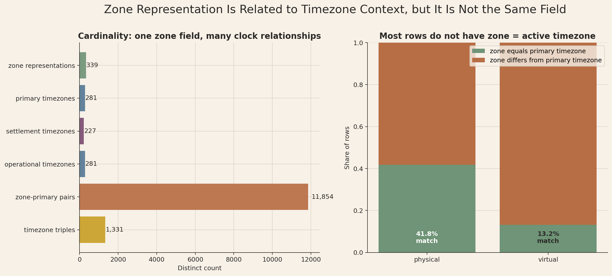
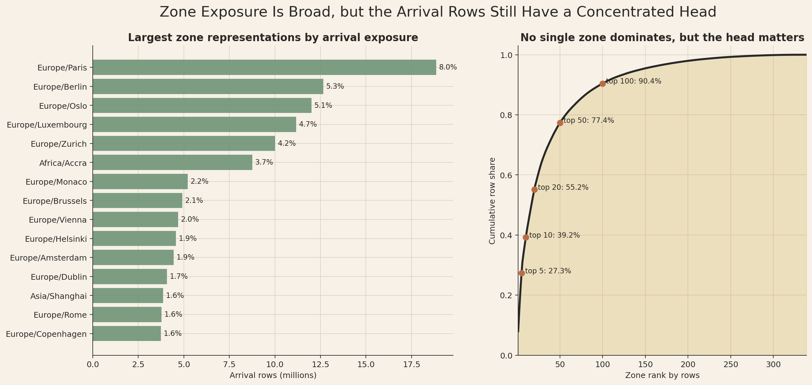
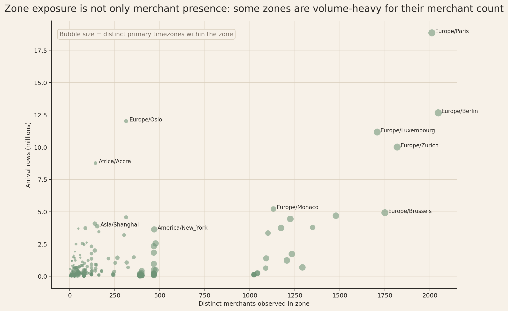
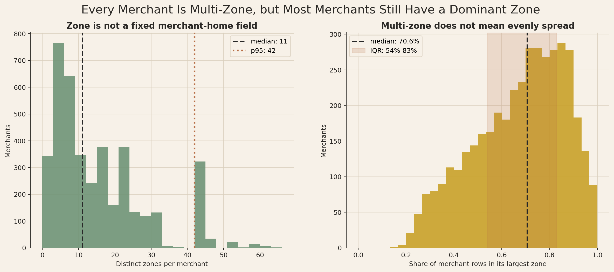
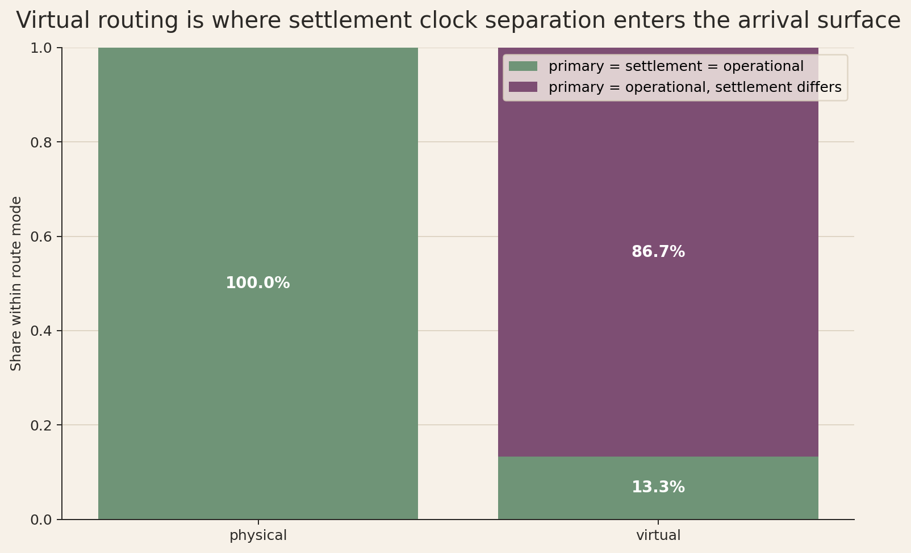
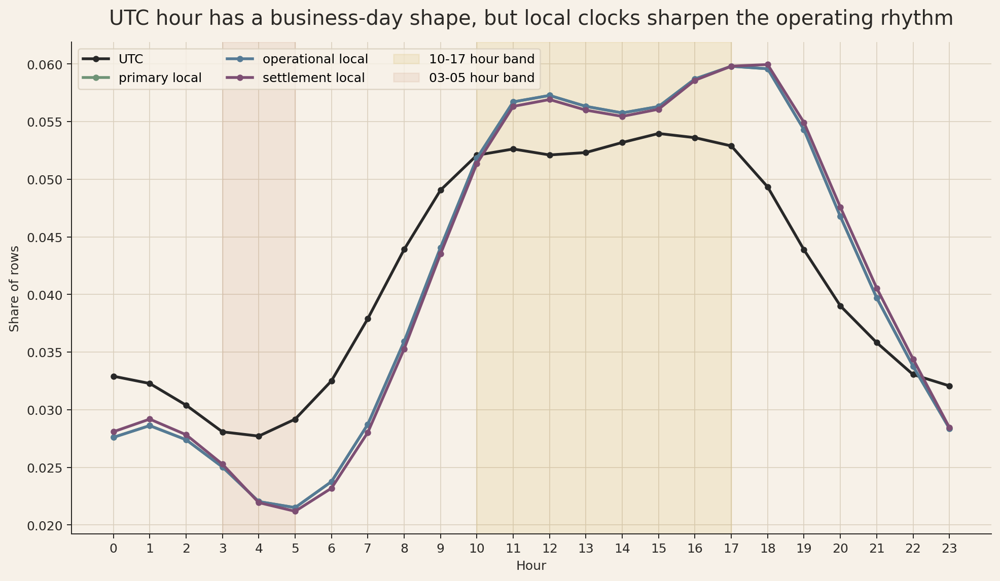
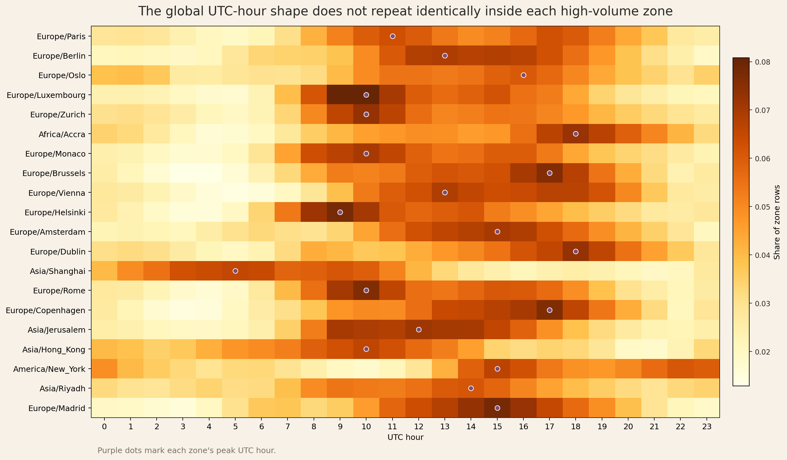
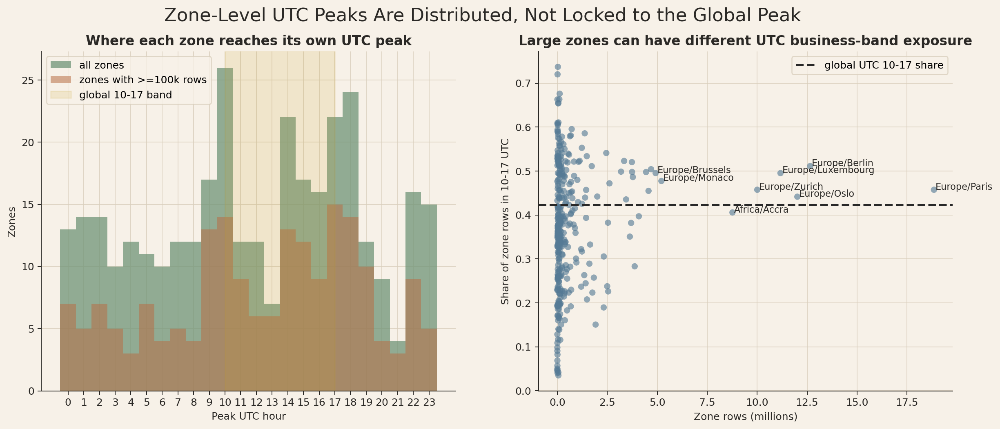

# Branch Investigation: `arrival_events_5B` Zone and Timezone Structure

## Branch question

The main `arrival_events_5B` report says the surface covers `339` zone representations, that every merchant appears in more than one zone, and that the UTC-hour profile has a visible business-day shape.

This branch unpacks those statements together because they are connected. The question is:

> What does `zone_representation` mean in the arrival-context surface, how does it relate to the timezone fields, and does the global UTC-hour shape hold once we inspect zone-level structure?

The short answer is that `zone_representation` is not merchant domicile and not simply the active timezone. It is an arrival/routing representation attached to the arrival context. The timezone fields carry the clock interpretation. The UTC-hour shape is real at the global surface level, but it should not be treated as a universal zone-level pattern.

## Evidence used

Primary report:

- [`arrival_events_5B_investigation.md`](../arrival_events_5B_investigation.md)

Workbench script:

- [`analyze_arrival_events_zone_timezone_structure.py`](../../../../scratch/analyze_arrival_events_zone_timezone_structure.py)

Workbench exports:

- [`zone_timezone_overview.csv`](../../../../exports/interface_world/traffic_primitives/branches/zone_timezone_structure/zone_timezone_overview.csv)
- [`zone_timezone_null_profile.csv`](../../../../exports/interface_world/traffic_primitives/branches/zone_timezone_structure/zone_timezone_null_profile.csv)
- [`zone_overview.csv`](../../../../exports/interface_world/traffic_primitives/branches/zone_timezone_structure/zone_overview.csv)
- [`zone_distribution_stats.csv`](../../../../exports/interface_world/traffic_primitives/branches/zone_timezone_structure/zone_distribution_stats.csv)
- [`zone_concentration_ranked.csv`](../../../../exports/interface_world/traffic_primitives/branches/zone_timezone_structure/zone_concentration_ranked.csv)
- [`merchant_zone_distribution.csv`](../../../../exports/interface_world/traffic_primitives/branches/zone_timezone_structure/merchant_zone_distribution.csv)
- [`merchant_top_zone_dependence.csv`](../../../../exports/interface_world/traffic_primitives/branches/zone_timezone_structure/merchant_top_zone_dependence.csv)
- [`timezone_field_relationships.csv`](../../../../exports/interface_world/traffic_primitives/branches/zone_timezone_structure/timezone_field_relationships.csv)
- [`timezone_field_relationships_by_route.csv`](../../../../exports/interface_world/traffic_primitives/branches/zone_timezone_structure/timezone_field_relationships_by_route.csv)
- [`zone_timezone_equality_by_route.csv`](../../../../exports/interface_world/traffic_primitives/branches/zone_timezone_structure/zone_timezone_equality_by_route.csv)
- [`hour_profile_utc.csv`](../../../../exports/interface_world/traffic_primitives/branches/zone_timezone_structure/hour_profile_utc.csv)
- [`hour_profile_local.csv`](../../../../exports/interface_world/traffic_primitives/branches/zone_timezone_structure/hour_profile_local.csv)
- [`local_vs_utc_peak_summary.csv`](../../../../exports/interface_world/traffic_primitives/branches/zone_timezone_structure/local_vs_utc_peak_summary.csv)
- [`zone_hour_profile_top_zones.csv`](../../../../exports/interface_world/traffic_primitives/branches/zone_timezone_structure/zone_hour_profile_top_zones.csv)
- [`zone_hour_shape_summary.csv`](../../../../exports/interface_world/traffic_primitives/branches/zone_timezone_structure/zone_hour_shape_summary.csv)
- [`zone_hour_shape_rollup.csv`](../../../../exports/interface_world/traffic_primitives/branches/zone_timezone_structure/zone_hour_shape_rollup.csv)
- [`zone_timezone_structure_summary.json`](../../../../exports/interface_world/traffic_primitives/branches/zone_timezone_structure/zone_timezone_structure_summary.json)

## What the zone field is doing

`arrival_events_5B` carries four related but distinct fields:

| Field | What it gives us in the operating surface |
|---|---|
| `zone_representation` | Arrival/routing zone label attached to the context row. |
| `tzid_primary` | Primary local-clock interpretation for the arrival. |
| `tzid_settlement` | Settlement-clock interpretation for the arrival. |
| `tzid_operational` | Operational local-clock interpretation for the arrival. |

These fields are complete. There are no nulls in `zone_representation`, the three timezone ids, UTC hour, or the local-hour fields extracted from the primary, settlement, and operational timestamps.

That completeness is useful, but it does not mean the fields are interchangeable. A row can have a zone representation that differs from the timezone used to interpret its local clock. In the full surface:

- rows: `236,691,694`
- zone representations: `339`
- primary timezones: `281`
- settlement timezones: `227`
- operational timezones: `281`
- distinct `zone_representation + tzid_primary` pairs: `11,854`
- distinct timezone triples: `1,331`
- rows where `zone_representation = tzid_primary`: `93,072,135`, or about `39.3%`
- rows where `zone_representation = tzid_operational`: `93,072,135`, also about `39.3%`

So `zone_representation` sometimes matches the active timezone label, but most rows do not have that equality. The field should therefore not be read as "the timezone of the row" without checking the timezone columns. In the platform context, the safer interpretation is that zone belongs to arrival/routing representation, while the timezone columns tell us which clocks should be used for primary, settlement, and operational reads.

## Zone exposure is broad, but not flat

The largest zones by row count are:

| Zone | Rows | Row share | Merchants | Sites | Edges | Primary timezones |
|---|---:|---:|---:|---:|---:|---:|
| `Europe/Paris` | `18,850,372` | `7.96%` | `2,011` | `33,785` | `1,214` | `136` |
| `Europe/Berlin` | `12,651,836` | `5.35%` | `2,046` | `37,876` | `1,365` | `140` |
| `Europe/Oslo` | `12,011,938` | `5.07%` | `313` | `6,146` | `264` | `43` |
| `Europe/Luxembourg` | `11,168,076` | `4.72%` | `1,707` | `25,376` | `934` | `132` |
| `Europe/Zurich` | `10,006,135` | `4.23%` | `1,818` | `26,585` | `1,122` | `134` |
| `Africa/Accra` | `8,764,162` | `3.70%` | `143` | `2,763` | `178` | `35` |
| `Europe/Monaco` | `5,208,486` | `2.20%` | `1,131` | `14,049` | `416` | `80` |

The top zone is meaningful, but it does not dominate the surface by itself. `Europe/Paris` holds less than `8%` of all rows. At the same time, the zone surface is not flat:

- top `5` zones hold about `27.3%` of rows
- top `10` zones hold about `39.2%` of rows
- top `20` zones hold about `55.2%` of rows
- top `50` zones hold about `77.4%` of rows
- top `100` zones hold about `90.4%` of rows

This is an exposure-concentration pattern, not a single-zone domination pattern. The arrival-context platform surface is geographically and operationally broad, but most arrival exposure still sits in a relatively concentrated head of the zone distribution.

The top-zone table also shows why zone cannot be simplified to timezone. `Europe/Paris` appears with `136` distinct primary timezones, and `Europe/Berlin` appears with `140`. Those are not plausible if the zone field simply meant "the row's local clock." They make sense if the zone is a routing/representation surface that can carry traffic whose active local-clock fields vary.

## Zone is not merchant-home identity

The main report already noted that every merchant appears in more than one zone. The branch-level distribution makes the point stronger:

| Metric | Value |
|---|---:|
| merchants | `4,050` |
| minimum zones per merchant | `2` |
| p25 zones per merchant | `5` |
| median zones per merchant | `11` |
| mean zones per merchant | `15.05` |
| p75 zones per merchant | `22` |
| p95 zones per merchant | `42` |
| maximum zones per merchant | `64` |

If `zone_representation` were merchant domicile or a fixed merchant-home field, the minimum and median would not look like this. A merchant can participate across many zones in this arrival-context surface.

There is a second nuance. Multi-zone does not mean evenly distributed across zones. For each merchant, we measured the share of that merchant's rows held by its largest zone:

| Metric | Top-zone row share per merchant |
|---|---:|
| p25 | `54.0%` |
| median | `70.6%` |
| mean | `67.5%` |
| p75 | `82.9%` |
| p95 | `93.6%` |

So most merchants are multi-zone, but many still have a dominant zone. That matters for later analysis. A merchant-level read and a zone-level read can both be true while answering different questions. If we group fraud, case, or flow behaviour by zone, we are grouping arrival exposure by routing representation. We are not simply grouping merchants by home country or home timezone.

## Timezone fields carry different clock meanings

Most rows have all three timezone fields equal:

| Timezone relationship | Rows | Row share | Merchants | Zones |
|---|---:|---:|---:|---:|
| all three equal | `218,869,380` | `92.47%` | `3,988` | `339` |
| primary equals operational only | `17,822,314` | `7.53%` | `157` | `267` |

The route split explains this relationship:

| Route mode | Timezone relationship | Rows | Share within route | Merchants | Zones |
|---|---|---:|---:|---:|---:|
| physical | all three equal | `216,136,107` | `100.00%` | `3,893` | `339` |
| virtual | primary equals operational only | `17,822,314` | `86.70%` | `157` | `267` |
| virtual | all three equal | `2,733,273` | `13.30%` | `95` | `205` |

This is an operating distinction. Physical arrivals collapse primary, settlement, and operational clocks into the same timezone in this primitive. Virtual arrivals usually do not: for most virtual rows, primary and operational clocks match while settlement is separate.

That fits the route model already exposed in the physical/virtual branch. Physical arrivals attach to physical site context. Virtual arrivals attach to operational edge context and can carry a separate settlement anchor. Therefore, if we later compare case rates or traffic rhythms by local time, we must choose the clock deliberately. Operational local time and settlement local time are not guaranteed to answer the same question for virtual traffic.

## UTC-hour shape exists, but it is a mixed-clock view

At the global surface level, UTC hour has the business-day shape described in the main report:

| Clock field | Peak hour | Peak share | Trough hour | Trough share | Share in 10-17 band | Share in 03-05 band |
|---|---:|---:|---:|---:|---:|---:|
| UTC | `15` | `5.40%` | `4` | `2.77%` | `42.28%` | `8.50%` |
| primary local | `17` | `5.98%` | `5` | `2.15%` | `45.27%` | `6.86%` |
| operational local | `17` | `5.98%` | `5` | `2.15%` | `45.27%` | `6.86%` |
| settlement local | `18` | `6.00%` | `5` | `2.12%` | `45.05%` | `6.84%` |

The UTC profile is therefore real, but it is not the cleanest clock for operating interpretation. UTC mixes traffic from many active local clocks. The local-clock profiles concentrate a little more strongly into the operating-day band and reduce the early-hour low band. That is exactly what we should expect if the platform receives traffic from a global operating world but each row also carries local clock context.

The zone-level check prevents overclaiming the global UTC shape. Across all `339` zones:

- `134` zones have their UTC peak hour inside the global `10:00-17:00` UTC band
- `77` zones have their UTC trough inside the global `03:00-05:00` UTC low band

Restricting to the `189` zones with at least `100,000` rows:

- `84` zones have their UTC peak inside `10:00-17:00`
- `59` zones have their UTC trough inside `03:00-05:00`

So the global UTC-hour story does not flow cleanly through every zone. Some high-volume zones peak inside the global band, but many do not. Examples from the largest zones show the variation:

| Zone | Rows | Peak UTC hour | Trough UTC hour | Share in 10-17 UTC |
|---|---:|---:|---:|---:|
| `Europe/Paris` | `18,850,372` | `11` | `5` | `45.74%` |
| `Europe/Berlin` | `12,651,836` | `13` | `23` | `51.11%` |
| `Africa/Accra` | `8,764,162` | `18` | `4` | `40.57%` |
| `Asia/Shanghai` | `3,870,505` | `5` | `21` | `28.32%` |
| `America/New_York` | `3,628,474` | `15` | `10` | `35.08%` |

That variation is not a defect. It is the expected consequence of global traffic viewed through UTC. For platform analysis, UTC is useful for checking extract continuity, global ingestion rhythm, and warehouse scheduling. It is weaker for interpreting local customer or merchant operating behaviour unless we explicitly frame the question as UTC-facing.

## Working interpretation

`arrival_events_5B` carries a zone/time structure with three layers:

- `zone_representation` gives the arrival/routing representation.
- `tzid_primary`, `tzid_settlement`, and `tzid_operational` give the clock contexts.
- UTC hour gives a global time axis that is useful but mixed across local operating clocks.

The practical rule is that zone-level analysis must be named carefully. A zone finding is not automatically a merchant-home finding, a country finding, or a local-time finding. It is a finding about arrival exposure under the zone representation carried by the traffic primitive.

The UTC-hour branch should not be split off as a separate universal assumption. It belongs here because its interpretation depends on zone and timezone structure. The global UTC rhythm is visible, but later analytical work should prefer local-clock views when the question concerns merchant/customer operating behaviour, and UTC views when the question concerns global platform ingestion or extract coverage.

## Leads carried forward

This branch creates several later checks:

- When behavioural streams are joined back to arrival context, test whether risk/event patterns differ by `zone_representation`, but phrase them as arrival-route exposure unless other evidence justifies a stronger geographic claim.
- For physical traffic, a single local clock is usually enough because primary, settlement, and operational timezones are equal in this primitive.
- For virtual traffic, operational-time and settlement-time views should be kept separate because most virtual rows have a distinct settlement clock.
- Any dashboard using hour-of-day should decide upfront whether it is a UTC operations dashboard or a local operating-time dashboard.
- Zone-level rate denominators should be exposure-weighted and merchant-aware, because merchants are multi-zone but often have a dominant zone.

## Appendix: visual evidence and assessment

### Z1. Zone representation versus timezone identity

The left panel starts with a simple count question: if `zone_representation` were just another timezone field, the number of zone labels, timezone labels, and pairings would sit much closer together. Instead, the surface has `339` zone representations, `281` primary/operational timezones, `227` settlement timezones, but `11,854` distinct zone-primary pairs. The important visual signal is the order-of-magnitude jump from individual field cardinalities to relationship cardinality. The small bars are not there for fine-grained comparison against each other; they establish the baseline from which the `zone_representation + tzid_primary` pairing explodes.

That jump is the statistical clue that zone and timezone are related fields, not duplicate fields. One zone can appear with many primary clocks, and one clock can be seen under many zone representations. In operating terms, the arrival row is not carrying a single "where/time" concept. It is carrying a route/zone representation and separate clock contexts that can combine in many ways.

The `1,331` timezone triples reinforce the same point from another angle. The row does not only carry one clock. It carries a primary clock, a settlement clock, and an operational clock, and those combinations form their own structure. This matters because a later dashboard or query that groups by `zone_representation` is not automatically grouping by local time. It is grouping by the arrival/routing zone label and only indirectly touching clock interpretation.

The right panel turns that concept into a row-weighted check. On physical rows, `zone_representation` equals `tzid_primary` for only `41.8%` of rows. On virtual rows, the match rate falls to `13.2%`. The denominator here is arrival rows, not merchants or zones, so the figure is telling us how much traffic exposure has direct equality between the zone label and the primary timezone label. Most row exposure does not have that equality. This does not mean the data is wrong. It means the platform surface is carrying more than one kind of location/time concept in the same row.

The practical warning is direct: do not rename `zone_representation` in your head as "timezone." When we need local-clock behaviour, the timezone fields are the safer authority. When we need route/zone exposure, `zone_representation` is the field of interest.

### Z2. Zone exposure concentration

The left panel ranks the largest zone representations by arrival rows. This is row exposure, not merchant count, so the bars answer "where does the arrival-context volume sit?" rather than "where are the merchants based?" `Europe/Paris` is the largest zone at about `18.9M` rows and `8.0%` of the surface, followed by `Europe/Berlin`, `Europe/Oslo`, `Europe/Luxembourg`, and `Europe/Zurich`. The first read is that no single zone owns the traffic primitive. Even the largest zone is below `10%` of all rows.

The right panel adds the distribution shape that the bar chart alone cannot show. The top `5` zones hold `27.3%` of rows, the top `10` hold `39.2%`, the top `20` hold `55.2%`, the top `50` hold `77.4%`, and the top `100` hold `90.4%`. That is a concentrated head with a long tail. The surface is broad enough that many zones exist, but most row exposure is still in a relatively small subset of zones.

This distinction is important for later rate analysis. If we eventually calculate fraud rate, case rate, or event intensity by zone, high-volume zones will dominate row-weighted summaries even though the full zone catalogue is much wider. A stakeholder could truthfully say the platform has global zone coverage, but an analyst must still ask whether a metric is being driven by the head of the distribution.

The figure does not prove that the head zones are riskier, more profitable, or more operationally important. It only proves that they carry more arrival-context exposure. Risk or business importance must wait for behavioural streams, truth products, and case products.

### Z3. Zone rows versus merchant presence

This scatter plot tests whether zone exposure is simply a merchant-count story. The x-axis is distinct merchants observed in the zone. The y-axis is arrival rows in millions. If row exposure were only a function of merchant presence, the points would sit close to a simple rising line. They do not. The spread tells us that the row denominator and the merchant denominator are measuring different things.

`Europe/Paris` and `Europe/Berlin` are high on both axes: many merchants and many rows. But `Europe/Oslo` and `Africa/Accra` sit much higher in row volume than their merchant counts would suggest. `Africa/Accra`, for example, has far fewer merchants than the largest European zones but still carries a large amount of arrival exposure. That means its rows-per-merchant intensity is high relative to zones with broader merchant participation. `Europe/Oslo` shows a similar pattern: it is not near the right edge of the merchant-count axis, but it is high on row exposure.

The reverse pattern also matters. Some high-merchant European zones sit lower in row volume than `Europe/Paris` or `Europe/Berlin`, which means merchant presence alone cannot explain the exposure surface. A zone can have many participating merchants without carrying proportionally high row volume, and a zone can have fewer merchants while still carrying heavy traffic exposure. This is exactly the kind of denominator problem that can mislead later fraud-rate or case-rate summaries if we do not separate row-weighted and merchant-weighted readings.

The bubble size adds another layer: it represents distinct primary timezones observed within the zone. Larger bubbles mean the zone is associated with a more varied clock context, not necessarily more rows by itself. This matters because zones such as `Europe/Paris` and `Europe/Berlin` are not just large in row count; they also carry many distinct primary timezone contexts. That reinforces the earlier point that zone is an arrival/routing representation rather than a one-to-one local-clock label.

The plot should not be read as a geographic map or as a causal explanation. A point above the rough cloud does not tell us why that zone has high rows per merchant. It tells us where to investigate later: merchant mix, route mode, endpoint estate size, channel composition, and behavioural streams may explain why some zones are volume-heavy relative to merchant count.

### Z4. Merchant zone spread and dominant-zone dependence

The left panel moves from zone-level exposure to merchant-level spread. Each bar counts merchants by the number of distinct zone representations they appear in. The important baseline is that the minimum is not `1`; every merchant is multi-zone in this surface. The median merchant appears in `11` zones, and the p95 merchant appears in `42` zones. That is why `zone_representation` cannot be treated as a fixed merchant-home field.

The distribution is not smooth, and that is itself useful. The merchant-zone shape has clumps rather than a perfect bell curve, which suggests the zone footprint is tied to structured operating patterns rather than random noise. We should not overfit that shape yet, but it tells us not to flatten merchants into a single zone without losing information.

The right panel answers the natural follow-up: if every merchant is multi-zone, are merchants evenly spread across those zones? The answer is no. For each merchant, the figure takes that merchant's largest zone by row count and computes the share of the merchant's rows held by that top zone. The median is `70.6%`, and the interquartile range is roughly `54%` to `83%`. So most merchants are multi-zone, but many still have one dominant zone.

This is the denominator lesson. A merchant-level analysis and a zone-level analysis are both valid, but they are not interchangeable. At merchant grain, one merchant contributes once. At arrival-row grain, a merchant's dominant zone can carry most of that merchant's exposure. If we later compare case counts by zone without controlling for merchant spread, high-volume dominant zones may look more important simply because more of the merchant's arrival exposure sits there.

### Z5. Timezone relationship by route mode

This figure isolates the clock relationship by route mode, which is the cleanest way to understand why the timezone fields exist separately. Physical arrivals are simple in this surface: `100%` of physical rows have `tzid_primary = tzid_settlement = tzid_operational`. For physical site traffic, the primitive collapses the three clocks into one local-time interpretation.

Virtual routing behaves differently. Only `13.3%` of virtual rows have all three clocks equal. The remaining `86.7%` have primary and operational clocks equal while settlement differs. That is not a formatting curiosity; it is a route-structure finding. Virtual traffic can operate through an edge context while settlement is anchored elsewhere.

This connects directly to the physical/virtual routing branch. Physical arrivals resolve through `site_id`; virtual arrivals resolve through `edge_id` and can carry separate settlement anchoring. The timezone split is therefore part of the operating model, not a data-quality defect. If we later ask "what time of day does virtual traffic happen?", we need to decide whether we mean operational edge time or settlement time.

The figure does not say that settlement time is more important than operational time. It says they are different enough on virtual traffic that we cannot lazily use one and claim to have answered all local-time questions.

### Z6. UTC versus local-hour profiles

This line chart compares the global UTC-hour profile against the three local-hour interpretations. The black UTC line has the broad business-day shape identified in the main report: lower row share in the early UTC hours and stronger activity through the UTC daytime band. The profile is not flat, so the arrival primitive is not behaving like rows were uniformly scattered across the day.

The local-clock lines sharpen that story. Primary local and operational local lie almost exactly on top of each other, and both peak around local hour `17`. Settlement local is very close but peaks around `18`. The local profiles also put less share into the `03-05` low band than UTC does. That is what happens when global traffic is translated back into its local operating clocks: some of the UTC spread tightens into a more recognizable operating-day rhythm.

The yellow band marks `10-17`; the reddish band marks `03-05`. These are not business rules hardcoded into the platform. They are reference bands used to compare the shape described in the report. The figure shows that the row distribution is meaningfully higher across the operating-day band and lower in the early-hour band, especially under local clocks.

The correct inference is limited but important. UTC is good for platform-wide timing, extract continuity, and global scheduling. Local-hour fields are better when the question concerns customer, merchant, operational-edge, or settlement-clock behaviour. The chart does not prove store opening hours or customer intent; it shows the row-level temporal rhythm available in the arrival-context surface.

### Z7. UTC-hour shape inside high-volume zones

This heatmap asks whether the global UTC-hour shape repeats inside each high-volume zone. Each row is a zone, each column is a UTC hour, and the colour is the share of that zone's own rows in that hour. That denominator matters. Darker cells do not mean the zone has more total rows than another zone; they mean that hour is more important within that zone's own daily UTC profile.

The purple dots mark each zone's peak UTC hour. Those dots do not line up. `Europe/Paris` peaks around `11`, `Europe/Berlin` around `13`, `Africa/Accra` around `18`, `Asia/Shanghai` around `5`, and `America/New_York` around `15`. This is the visual evidence behind the report's statement that the global UTC-hour story does not flow cleanly through every zone.

The heatmap also shows why UTC can be misleading if treated as local behaviour. Some Asian zones have strong UTC activity early in the UTC day because their local operating day is shifted forward relative to UTC. Some American zones peak later in UTC. European zones tend to sit closer to the middle UTC hours, but even they do not share one identical peak.

The chart does not invalidate the global UTC-hour profile. It explains it. The global line in Z6 is an aggregate of many zone-level rhythms viewed through UTC. For operational platform monitoring, that aggregate is useful. For local behaviour, it is mixed.

### Z8. Zone-level UTC peak-hour rollup

The left panel compresses the heatmap into a distribution of peak UTC hours. Green bars count all zones. Rust bars restrict the view to zones with at least `100,000` rows, which removes very small zones that might have unstable peak hours. The yellow background marks the global `10-17` UTC band. Peaks appear inside that band, but they also appear outside it. Numerically, `134` of `339` zones peak inside `10-17 UTC`; among the larger zones, `84` of `189` zones peak inside that band. So the global UTC business-day window is important, but it is not where most zones necessarily reach their own peak.

That distinction matters because the global profile is row-weighted while this histogram is zone-count weighted. A row-weighted global peak can be driven by high-volume zones, while many individual zones still peak elsewhere. The plot therefore answers a different question from the global line chart: not "when do most rows happen?", but "when does each zone reach its own highest UTC hour?"

The right panel asks a related question: does zone size determine how much of a zone's traffic sits in the `10-17` UTC band? The x-axis is zone rows in millions, and the y-axis is the share of that zone's rows in the global UTC business band. The dashed line is the global share, about `42.3%`. Large zones do not all sit at the same value. `Europe/Berlin`, `Europe/Luxembourg`, and `Europe/Brussels` sit above the global line, while `Africa/Accra` is slightly below it and `Europe/Paris` is only modestly above it despite being the largest zone.

This panel is useful because it prevents a second overclaim: not only are peak hours distributed, but even large zones vary in how concentrated they are inside the global UTC business band. A high row count does not imply the same UTC-hour shape.

Together, the two panels close the UTC-hour assumption. The global UTC profile is real, but it is not a universal zone-level law. The left panel shows that zone peaks are distributed across the day; the right panel shows that even large zones differ in how much of their traffic sits inside the global UTC business band. Later work should choose UTC when the analytical question is platform-wide timing, and local-clock fields when the question is operating behaviour inside a zone, merchant, edge, or settlement context.
