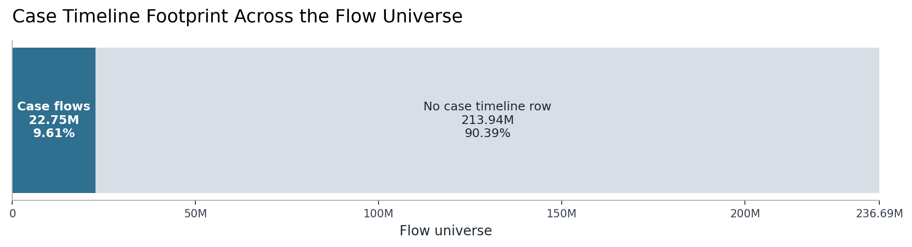
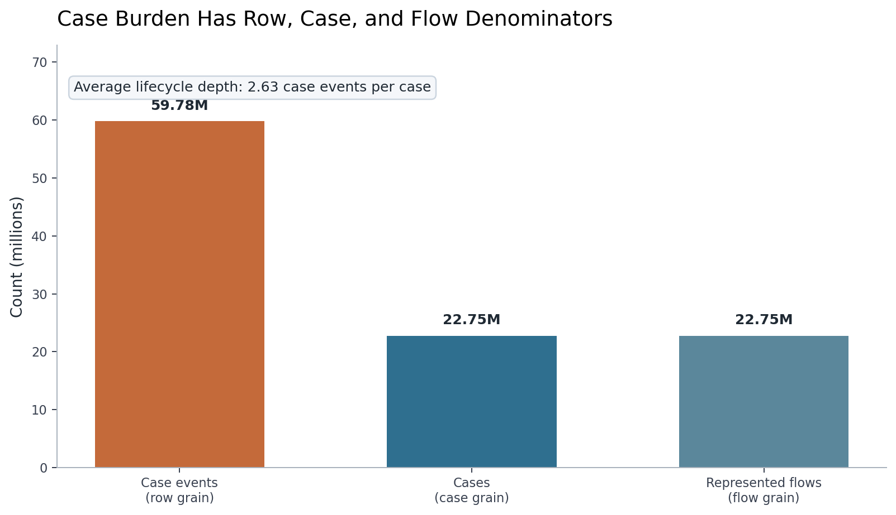
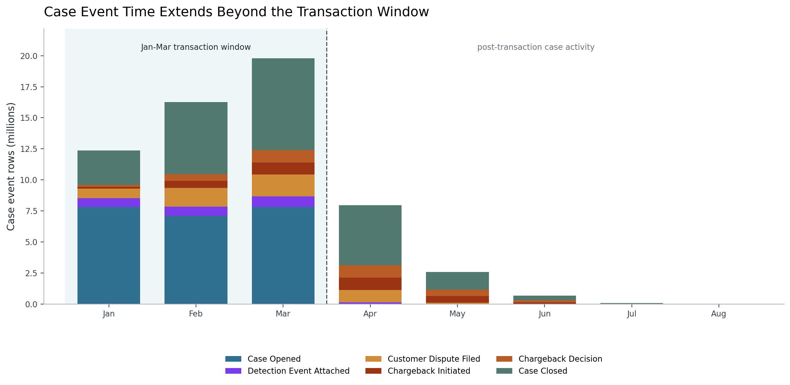
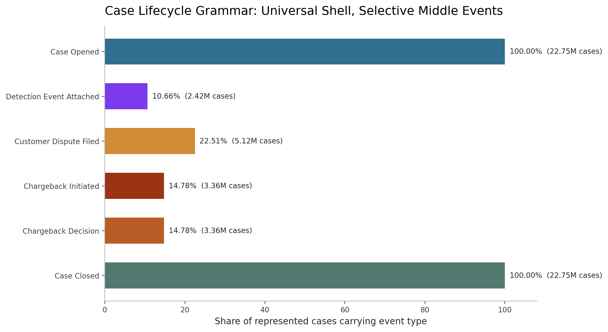
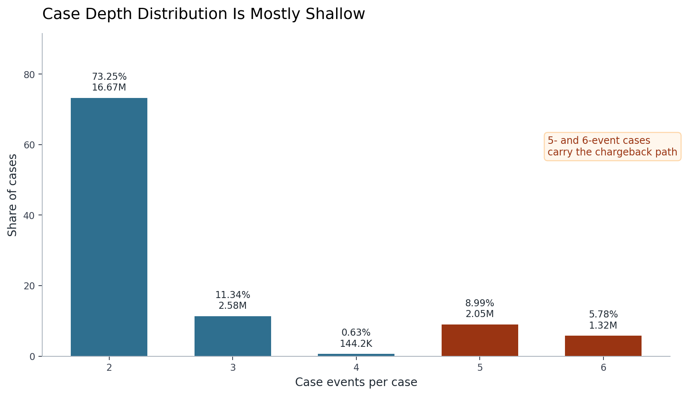
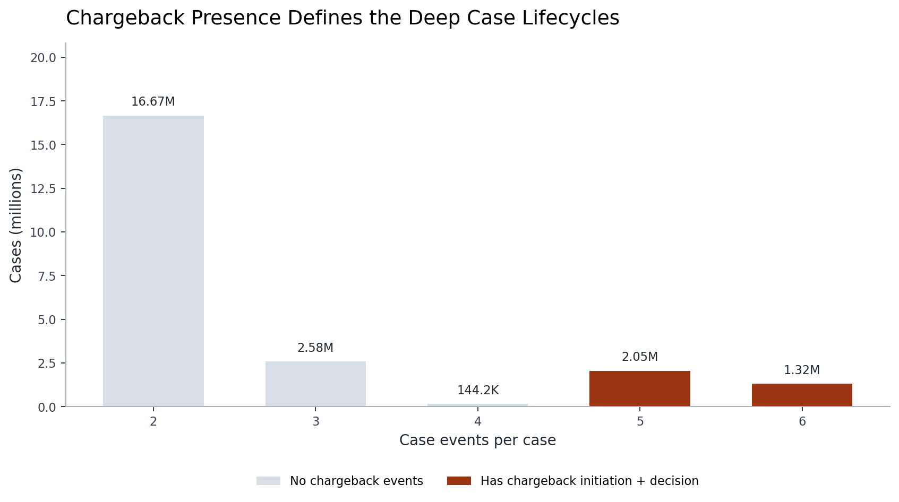
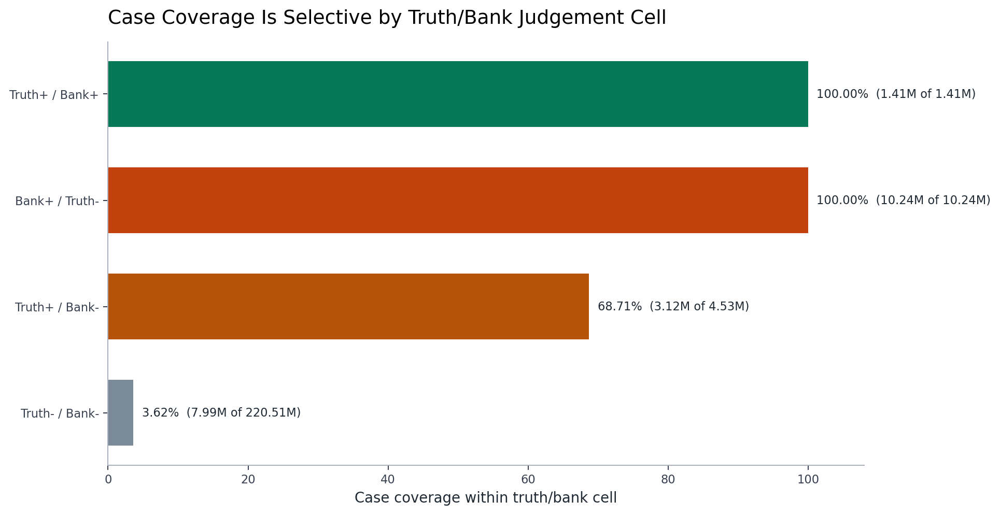
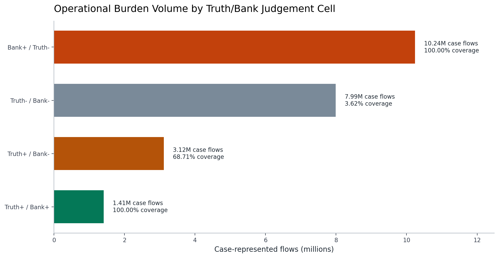
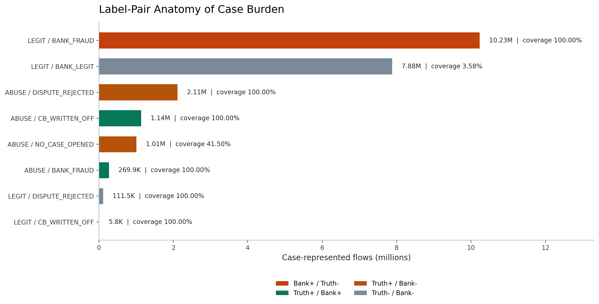

# Branch Investigation: Case Timeline and Operational Burden

## Branch question

The parent truth-products investigation established that `s4_case_timeline_6B` is the post-decision operational lifecycle surface. This branch asks:

> What kind of case world does the platform expose, and what operational burden does that case world imply?

The immediate answer is that the case timeline is broad, selective, and mostly shallow. It covers about `9.61%` of all flows, produces `59.78M` case events across `22.75M` cases, and mostly consists of two-event open/close lifecycles. But the burden is not evenly distributed across the truth/bank judgement space: bank-positive/truth-negative flows and true-positive aligned flows are fully represented in cases, while only a small share of true-negative aligned flows enter the case world.

## Evidence used

Primary report:

- [`truth_products_investigation.md`](../truth_products_investigation.md)

Branch and parent exports:

- [`case_timeline_profile.csv`](../../../../exports/interface_world/truth_products/case_timeline_profile.csv)
- [`case_event_type_summary.csv`](../../../../exports/interface_world/truth_products/case_event_type_summary.csv)
- [`case_length_summary.csv`](../../../../exports/interface_world/truth_products/case_length_summary.csv)
- [`case_truth_bank_reconciliation.csv`](../../../../exports/interface_world/truth_products/case_truth_bank_reconciliation.csv)
- [`case_timeline_nulls.csv`](../../../../exports/interface_world/truth_products/case_timeline_nulls.csv)
- [`case_coverage_by_truth_bank_cell.csv`](../../../../exports/interface_world/truth_products/branches/case_timeline_operational_burden/case_coverage_by_truth_bank_cell.csv)
- [`case_coverage_by_truth_bank_label_pair.csv`](../../../../exports/interface_world/truth_products/branches/case_timeline_operational_burden/case_coverage_by_truth_bank_label_pair.csv)
- [`case_depth_by_chargeback_presence.csv`](../../../../exports/interface_world/truth_products/branches/case_timeline_operational_burden/case_depth_by_chargeback_presence.csv)
- [`case_event_monthly_summary.csv`](../../../../exports/interface_world/truth_products/branches/case_timeline_operational_burden/case_event_monthly_summary.csv)

Related branch:

- [`truth_vs_bank_view.md`](truth_vs_bank_view.md)

The branch primarily uses compact exports from the truth-products investigation and one derived coverage aggregate, exported in two views, that joins those compact case counts to the label-pair anatomy from `truth_vs_bank_view`. Two targeted compact scans of `s4_case_timeline_6B` were added after the first read: one to prove chargeback-depth at case level and one to summarize case-event timing by month. Those scans produce small support exports only; they do not materialize the raw case timeline into the report.

## What the case timeline is allowed to answer

`s4_case_timeline_6B` is not a label table and not a live decision input. It is an offline operational history surface. Its grain is one row per case event:

| Metric | Value |
|---|---:|
| Case timeline rows | `59,775,740` |
| Cases | `22,752,610` |
| Represented flows | `22,752,610` |
| Case event types | `6` |
| Case event sequence range | `0` to `5` |
| Average events per case | `2.63` |
| Share of all flows represented in cases | `9.61%` |

The surface is clean at required-field level. There are no nulls in `case_id`, `case_event_seq`, `flow_id`, `case_event_type`, `ts_utc`, or lineage fields in the compact null profile.

The case timeline therefore answers operational questions: which flows entered case history, what events were attached to them, how deep the lifecycle became, and how much post-decision work exists. It should not be used as a shortcut for ground truth. Case presence means operational representation, not automatic fraud truth.

## Case time extends beyond transaction time

The timeline runs from `2026-01-01T00:00:00.694988Z` to `2026-08-13T08:47:09.708142Z`, a span of about `224.37` days. This is much longer than the January-March operating transaction window we have been using for the interface world.

That is not a defect by itself. Cases are post-decision operational objects. A transaction may occur in January, February, or March, but dispute handling, chargeback initiation, chargeback decision, and closure can extend well after the original authorization event. This is why the case timeline belongs to offline operational analytics rather than live decision-time payloads.

The key caution is reporting-window discipline. If we later calculate case workload by calendar date, we must not mix transaction-window interpretation with case-event-window interpretation. A case event in August does not mean August transaction traffic exists in the interface pack. It means a case lifecycle continued into August.

## Event grammar of the case lifecycle

The event-type distribution is:

| Case event type | Rows | Cases | Case event sequence | Row share | Case share |
|---|---:|---:|---|---:|---:|
| `CASE_OPENED` | `22,752,610` | `22,752,610` | `0` | `38.0633%` | `100.0000%` |
| `CASE_CLOSED` | `22,752,610` | `22,752,610` | `5` | `38.0633%` | `100.0000%` |
| `CUSTOMER_DISPUTE_FILED` | `5,121,378` | `5,121,378` | `2` | `8.5677%` | `22.5090%` |
| `CHARGEBACK_INITIATED` | `3,362,198` | `3,362,198` | `3` | `5.6247%` | `14.7772%` |
| `CHARGEBACK_DECISION` | `3,362,198` | `3,362,198` | `4` | `5.6247%` | `14.7772%` |
| `DETECTION_EVENT_ATTACHED` | `2,424,746` | `2,424,746` | `1` | `4.0564%` | `10.6570%` |

Every represented case has an open and close event. That gives the surface a complete lifecycle frame: cases do not appear as dangling openings without closure in this extract.

The middle events are selective. Only `10.66%` of cases attach a detection event. `22.51%` have a customer dispute filed. `14.78%` progress into chargeback initiation and chargeback decision. So the case timeline is not a uniform six-step workflow for every case. It is a common open/close shell with optional operational stages in the middle.

That matters for burden analysis. A row count of `59.78M` does not mean `59.78M` separate cases. It means `22.75M` case objects generating multiple operational events. The work profile is partly case count and partly lifecycle depth.

## Case depth is broad but mostly shallow

Case length distribution:

| Case events | Cases | Case share |
|---:|---:|---:|
| `2` | `16,666,405` | `73.2505%` |
| `3` | `2,579,827` | `11.3386%` |
| `4` | `144,180` | `0.6337%` |
| `5` | `2,046,459` | `8.9944%` |
| `6` | `1,315,739` | `5.7828%` |

The dominant lifecycle has exactly two events. These are cases with the open/close frame and no additional middle events. That is `73.25%` of all cases.

The deeper case population is smaller but still operationally material. `5`-event and `6`-event cases together represent `3,362,198` cases, or `14.78%` of the case population. A case-level chargeback-depth cross-tab confirms that all `5`-event and `6`-event cases carry both `CHARGEBACK_INITIATED` and `CHARGEBACK_DECISION`, while `2`-, `3`-, and `4`-event cases carry neither. So the chargeback path is not just numerically aligned with deeper lifecycle counts; in this extract, it is the defining operational feature of those deeper lifecycles.

So the case world is not "small but complicated." It is large and mostly shallow, with a meaningful chargeback-depth minority. That distinction matters for project framing: a workload project could focus on volume containment and triage, while a loss/project branch could focus on the smaller but deeper chargeback path.

## Case coverage across truth/bank judgement cells

The case timeline covers `22,752,610` flows out of `236,691,694` total flows. The broad coverage rate is `9.61%`, but the coverage is very different by truth/bank cell:

| Truth/bank cell | Total flows | Case flows | Case coverage |
|---|---:|---:|---:|
| bank-positive/truth-negative | `10,238,501` | `10,238,501` | `100.0000%` |
| true-positive alignment | `1,406,618` | `1,406,618` | `100.0000%` |
| truth-positive/bank-negative | `4,533,921` | `3,115,199` | `68.7087%` |
| true-negative alignment | `220,512,654` | `7,992,292` | `3.6244%` |

This is the key burden finding of the branch. The case world is selective, but it is not uniformly selective. Every bank-positive/truth-negative flow is represented in the case timeline. Every true-positive aligned flow is represented too. Most truth-positive/bank-negative flows are represented, while only a small fraction of true-negative aligned flows enter cases.

That shape gives operational meaning to the truth/bank disagreement from the previous branch. The large over-action cell, `LEGIT / BANK_CONFIRMED_FRAUD`, is not just a label disagreement sitting outside operations; it is fully case-represented. That makes it a real candidate for customer-friction, investigation burden, false-positive review, or bank-action-quality analytics.

The true-positive aligned cell is also fully case-represented, which makes sense operationally: when truth and bank view both agree positively, the case surface carries the handling trail.

The truth-positive/bank-negative cell is more complex. `68.71%` of those flows still appear in case history, even though the bank flag is negative. This is where the labels need careful reading. Bank-negative does not mean operationally invisible. It can include `NO_CASE_OPENED` and `CUSTOMER_DISPUTE_REJECTED`, and those labels are not equivalent to absence from the case timeline.

## Label-pair burden inside cases

The largest case-flow label pairs are:

| Truth label | Bank label | Cell | Total flows | Case flows | Case coverage |
|---|---|---|---:|---:|---:|
| `LEGIT` | `BANK_CONFIRMED_FRAUD` | bank-positive/truth-negative | `10,232,664` | `10,232,664` | `100.0000%` |
| `LEGIT` | `BANK_CONFIRMED_LEGIT` | true-negative alignment | `220,401,202` | `7,880,840` | `3.5757%` |
| `ABUSE` | `CUSTOMER_DISPUTE_REJECTED` | truth-positive/bank-negative | `2,109,342` | `2,109,342` | `100.0000%` |
| `ABUSE` | `CHARGEBACK_WRITTEN_OFF` | true-positive alignment | `1,135,282` | `1,135,282` | `100.0000%` |
| `ABUSE` | `NO_CASE_OPENED` | truth-positive/bank-negative | `2,423,574` | `1,005,731` | `41.4978%` |

This shows that the operational burden is strongly tied to the label-pair anatomy from `truth_vs_bank_view`.

The largest case group is `LEGIT / BANK_CONFIRMED_FRAUD`, with `10.23M` case flows. That is the main over-action burden candidate.

The second-largest group is `LEGIT / BANK_CONFIRMED_LEGIT`, with `7.88M` case flows, even though that is only `3.58%` of all flows in that label pair. This matters because large populations can create large operational counts from low coverage rates. True-negative aligned case flows are not the dominant analytical concern by coverage rate, but they still represent substantial case volume.

The `ABUSE / CUSTOMER_DISPUTE_REJECTED` and `ABUSE / CHARGEBACK_WRITTEN_OFF` groups show that truth-positive abuse risk splits into different operational paths. Some abuse-positive flows are rejected through customer-dispute handling, while others become write-offs. Those are different stakeholder stories.

The `ABUSE / NO_CASE_OPENED` row is a semantic caution. `NO_CASE_OPENED` is a bank label, but `1,005,731` flows with that label still appear in `s4_case_timeline_6B`. Therefore, in this interface world, `NO_CASE_OPENED` must not be interpreted naively as "there is no row in the case timeline." It is a bank-view label, while the case timeline is a separate operational surface.

## Operational reading

The case timeline turns truth/bank disagreement into workload. It does not only tell us that truth and bank view diverge; it tells us which parts of that divergence are carried into operational history.

Three burden lanes now emerge:

1. Over-action burden: `LEGIT / BANK_CONFIRMED_FRAUD` is fully case-represented and carries `10.23M` case flows. This is the strongest candidate for later false-positive, customer-friction, review-load, or bank-action-quality analysis.

2. Abuse handling burden: `ABUSE / CUSTOMER_DISPUTE_REJECTED`, `ABUSE / CHARGEBACK_WRITTEN_OFF`, and `ABUSE / NO_CASE_OPENED` split the truth-positive abuse world across rejected disputes, write-offs, and bank-negative/no-case-labelled handling. This is a candidate for risk operations and abuse-resolution analysis.

3. Baseline case volume: even a low case coverage rate among `LEGIT / BANK_CONFIRMED_LEGIT` flows creates `7.88M` case flows because the underlying legitimate population is huge. This is a denominator warning: operational burden can be large even when coverage is small.

This branch therefore does not just describe the case timeline as a table. It gives us a practical interpretation of where operational work appears to be concentrated.

## Working conclusion

`s4_case_timeline_6B` is the offline operational history surface. It is broad enough to matter, selective enough to require denominator discipline, and structured enough to support later stakeholder-facing operational analytics.

The case world is mostly shallow: most cases have only open and close events. But the volume is large, and the deeper chargeback path is still material. The timeline also extends months beyond the transaction window, so case-event time must be kept separate from transaction-event time.

The strongest analytical lead is operational burden from truth/bank divergence. `LEGIT / BANK_CONFIRMED_FRAUD` is the largest case-flow group and is fully represented in cases. Truth-positive abuse flows split across rejected disputes, write-offs, and no-case-labelled handling. That gives us a defensible path toward later project briefs on false-positive burden, case workload, chargeback/write-off posture, and risk handling quality.

## Appendix: visual evidence and assessment

The figures below convert the branch's compact exports into visual evidence. They are not included as decoration; each one makes a specific part of the case-timeline argument easier to inspect: how much of the flow world enters case history, which denominator is being counted, how case event time differs from transaction time, how the lifecycle grammar behaves, where chargeback depth appears, and how operational burden concentrates across truth/bank disagreement.

### Figure 1. Case timeline footprint across the flow universe

This figure establishes the first denominator boundary for the branch. The total flow universe contains `236.69M` flows, while `22.75M` flows are represented in the case timeline. That is `9.61%` of all flows. The visual matters because the case timeline is large in absolute terms, but it is not a universal layer over the operating world. Most flows, `213.94M` or `90.39%`, do not have a case-timeline row.

The statistical point is therefore selective coverage, not smallness. A surface with `22.75M` cases is operationally large enough to support serious workload analytics, but because it represents under one-tenth of all flows, any case-based analysis must be explicit about its denominator. If we later say "case rate," "case workload," or "case burden," we must be clear whether the denominator is all flows, case-represented flows, truth-positive flows, bank-positive flows, or a specific truth/bank cell.

The figure proves that case presence is selective at flow-universe level. It does not prove why a flow enters the case timeline. That question requires the truth/bank coverage and label-pair views later in the appendix.

### Figure 2. Case burden has row, case, and flow denominators

This figure separates three quantities that are easy to collapse if we only read the table. The case timeline has `59.78M` rows, but those rows belong to `22.75M` cases and `22.75M` represented flows. In this extract, case count and represented-flow count match because each case maps to one flow. The row count is larger because a case can carry multiple lifecycle events.

The average lifecycle depth is `2.63` case events per case. That number is not a claim that most cases have exactly 2.63 events; it is the row-to-case ratio. It tells us that the case surface is partly a volume problem and partly a lifecycle-depth problem. A team measuring operational burden by row count will see the number of operational events. A team measuring burden by case count will see the number of case objects. A team joining back to transaction or truth surfaces will usually need the flow denominator.

This figure proves that the branch cannot be analyzed with one denominator. It does not prove which denominator is best for every stakeholder question. Review workload, case throughput, chargeback operations, model evaluation, and customer-impact analytics may each need a different denominator.

### Figure 3. Case event time extends beyond the transaction window

This figure makes the time-window caution visible. The January-March block contains the transaction operating window we have been using for the interface world, but the case timeline continues into April, May, June, July, and August. The post-March bars are not evidence of new transaction traffic entering the interface pack. They are evidence that case events attached to earlier flows continued after the original authorization period.

The stacked bars also show why case time should not be interpreted as one generic timestamp. In January through March, `CASE_OPENED` and `CASE_CLOSED` dominate the case-event rows, with dispute, detection, and chargeback events sitting inside the monthly stack. After March, the visible continuation is mostly closure and later-stage lifecycle activity. That pattern is consistent with a case system where operational handling can lag the originating transaction.

The figure proves that case-event time has a longer horizon than transaction-event time. It does not prove an SLA, delay policy, or expected case-resolution target. We can see that lifecycle events continue after March, but we have not yet measured time-to-close, time-to-dispute, or time-to-chargeback. Those would require a duration branch using case-level event timestamps.

### Figure 4. Case lifecycle grammar: universal shell and selective middle events

This figure explains the grammar of the case surface. `CASE_OPENED` and `CASE_CLOSED` appear on `100%` of represented cases, so every case in this extract has a complete open/close shell. That is important because it means the case timeline is not full of dangling open cases at required-event level.

The middle events behave differently. `DETECTION_EVENT_ATTACHED` appears on `10.66%` of cases, `CUSTOMER_DISPUTE_FILED` appears on `22.51%`, and both chargeback stages appear on `14.78%`. So the case timeline is not a universal six-step workflow. It is a universal shell with optional operational branches in the middle.

That distinction controls how we should read case burden. A large `CASE_OPENED` count tells us how many cases exist. It does not tell us how many required investigation, customer dispute handling, or chargeback processing. The middle-event bars are the operational specialization layer. The figure proves that the lifecycle is structured and selective; it does not prove the ordering inside individual cases beyond the exported sequence labels, nor does it prove how long each stage took.

### Figure 5. Case depth distribution is mostly shallow

This figure shows the case-depth distribution directly. The dominant case type has exactly `2` events: `16.67M` cases, or `73.25%` of the case population. In the lifecycle grammar from Figure 4, that means most cases carry only the open/close shell and no additional middle-stage event.

The deeper cases are smaller in share but still large in absolute volume. `5`-event cases account for `2.05M` cases, and `6`-event cases account for `1.32M` cases. Together they form the `14.78%` chargeback-depth minority discussed in the report. That minority is not the dominant shape of the case world, but it is too large to ignore if the stakeholder question involves losses, write-offs, dispute operations, or chargeback handling.

The figure proves that the case world is broad and mostly shallow, not small and uniformly complex. It does not prove that shallow cases are unimportant. A shallow two-event lifecycle can still represent customer contact, operational logging, or institutional handling; the figure only tells us that the recorded lifecycle has no additional middle events in this surface.

### Figure 6. Chargeback presence defines the deep case lifecycles

This figure resolves the earlier aggregate-only risk by using the case-level chargeback-depth cross-tab. The grey bars show that `2`-, `3`-, and `4`-event cases do not carry chargeback events. The red bars show that `5`- and `6`-event cases carry both `CHARGEBACK_INITIATED` and `CHARGEBACK_DECISION`.

That is a stronger result than simply observing that chargeback event counts equal the number of deeper cases. It says the relationship holds at the case level in this extract: deeper lifecycle membership and chargeback-event presence move together. The `5`-event and `6`-event populations are therefore not just numerically adjacent to chargeback; they are the case-depth expression of the chargeback path.

The figure proves a structural relationship between case depth and chargeback presence. It does not prove loss amount, dispute outcome correctness, customer impact, or whether the chargeback path was operationally justified. Those questions require joining case timelines to amount, truth, bank view, and possibly case-product surfaces.

### Figure 7. Case coverage is selective by truth/bank judgement cell

This figure shifts from all-flow coverage to truth/bank-cell coverage. The denominator changes for each bar: each percentage is calculated within that truth/bank judgement cell, not across the full flow universe. That is why the comparison is useful. It asks whether flows with different truth/bank relationships are equally likely to appear in case history.

The answer is no. Bank-positive/truth-negative flows have `100%` case coverage. True-positive aligned flows also have `100%` case coverage. Truth-positive/bank-negative flows have `68.71%` coverage, and true-negative aligned flows have only `3.62%` coverage. This is the clearest visual evidence that the case timeline is selective, but not uniformly selective.

The figure proves that case representation is strongly structured by truth/bank judgement state. It does not prove that the bank-positive/truth-negative flows are genuinely wrong actions, only that they are truth-negative under the supervised truth surface and fully represented in case history. That is why the report frames them as over-action or false-positive-style candidates, not as final accusations.

### Figure 8. Operational burden volume by truth/bank judgement cell

Figure 7 shows coverage rates. This figure shows burden volume. The largest case-represented cell is bank-positive/truth-negative with `10.24M` case flows. That matters because this cell is not merely high coverage; it is also the largest source of case-flow volume among the truth/bank cells. This is the strongest evidence for later false-positive, customer-friction, review-load, or bank-action-quality project framing.

The second-largest case volume comes from true-negative aligned flows: `7.99M` case flows despite only `3.62%` coverage. This is the denominator warning made concrete. A low coverage rate can still produce a large operational workload when the underlying population is huge. If a stakeholder asks where case volume is coming from, we cannot answer using coverage rates alone.

Truth-positive/bank-negative flows contribute `3.12M` case flows, while true-positive aligned flows contribute `1.41M`. The figure proves that operational burden is not the same as model-style correctness. Both aligned and misaligned judgement states generate case work, and the largest volume sits in the bank-positive/truth-negative lane. It does not prove which work was avoidable; avoidability requires a deeper branch into case outcomes, amounts, time-to-resolution, and downstream write-off or dispute behaviour.

### Figure 9. Label-pair anatomy of case burden

This figure opens the truth/bank cells into their label-pair anatomy. The largest case-flow pair is `LEGIT / BANK_CONFIRMED_FRAUD` with `10.23M` case flows and `100%` coverage. That is the concrete label-level form of the bank-positive/truth-negative burden. It is not an abstract confusion-matrix cell anymore; it is a large population of flows that truth calls legitimate while the bank view confirms fraud and the case timeline fully represents them.

The second-largest pair is `LEGIT / BANK_CONFIRMED_LEGIT` with `7.88M` case flows but only `3.58%` coverage. That pair is important for a different reason. It is not the highest-rate concern, but the underlying legitimate population is so large that even a small case-entry rate produces substantial case volume. This is why the branch repeatedly separates coverage from volume.

The abuse-labelled pairs show the split inside truth-positive operational handling. `ABUSE / DISPUTE_REJECTED` contributes `2.11M` case flows with full coverage, `ABUSE / CB_WRITTEN_OFF` contributes `1.14M` with full coverage, and `ABUSE / NO_CASE_OPENED` contributes `1.01M` case flows with `41.50%` coverage. The last pair is the semantic warning: `NO_CASE_OPENED` is a bank label, not a guarantee that the flow has no case-timeline representation. Over one million flows with that label still appear in the case timeline.

The figure proves that case burden is not evenly distributed across labels and that the dominant workload story is label-specific, not just binary. It does not prove the business meaning of every label by itself. For stakeholder-facing conclusions, we should carry these label pairs forward into later branches on case timeline duration, chargeback/write-off posture, amount exposure, and operational quality.
