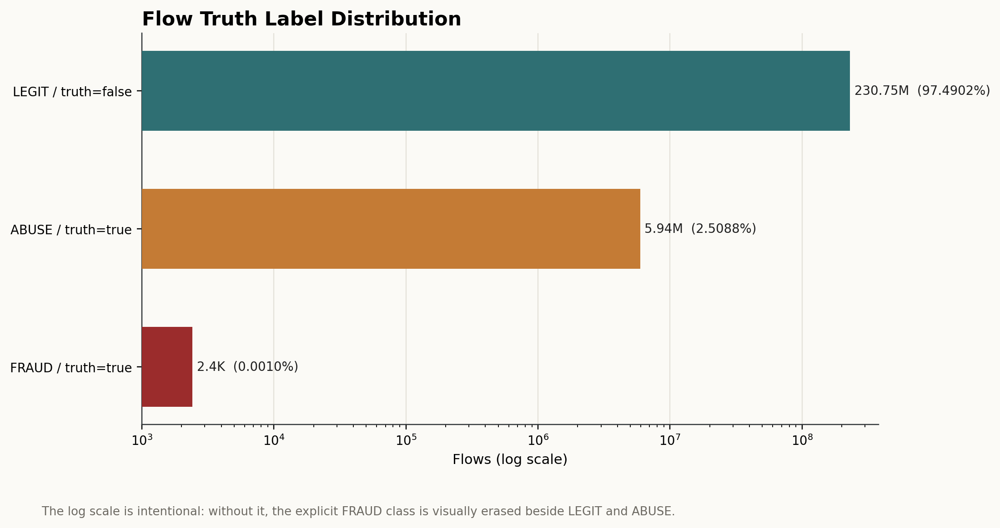
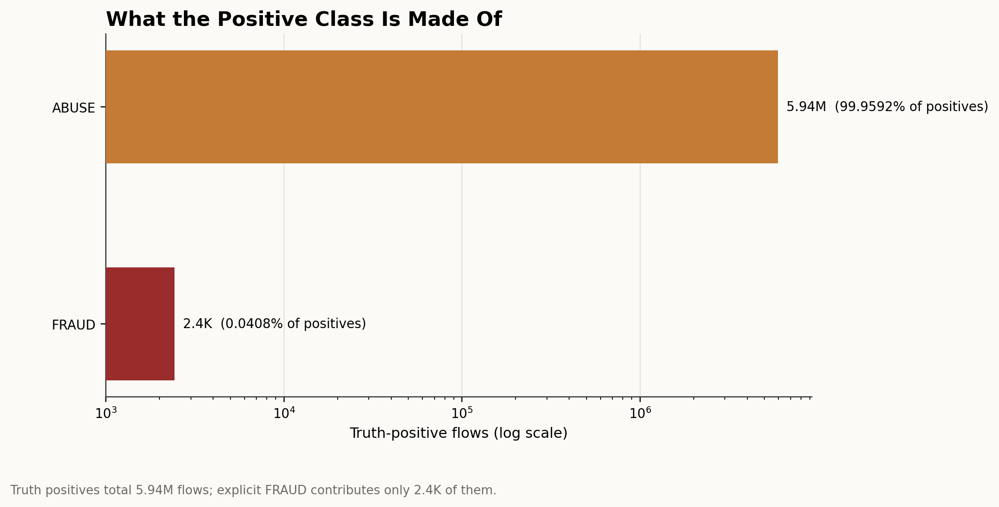
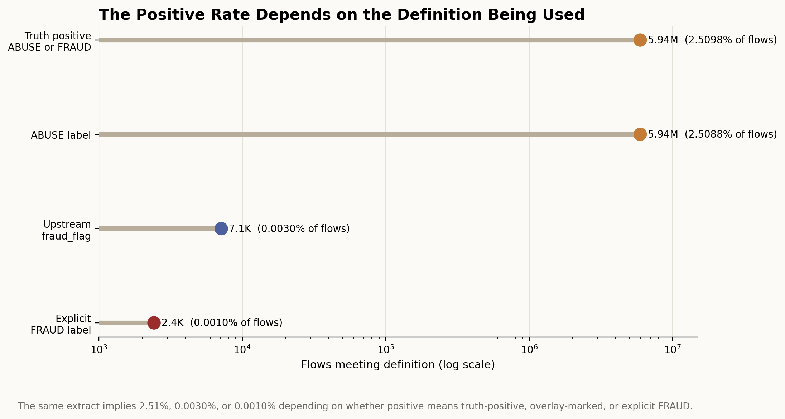
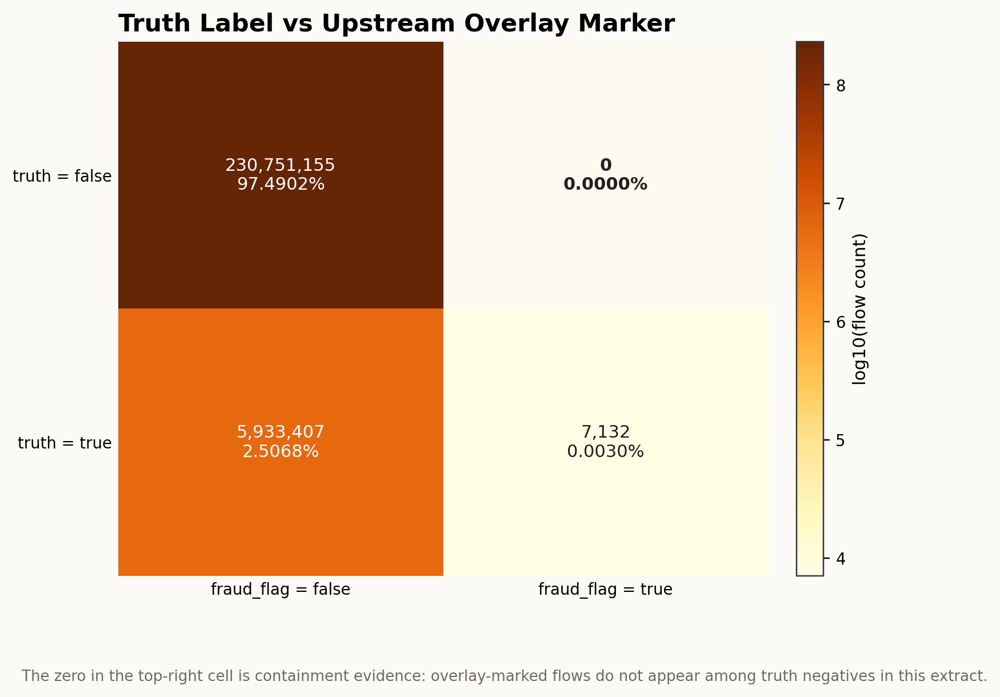
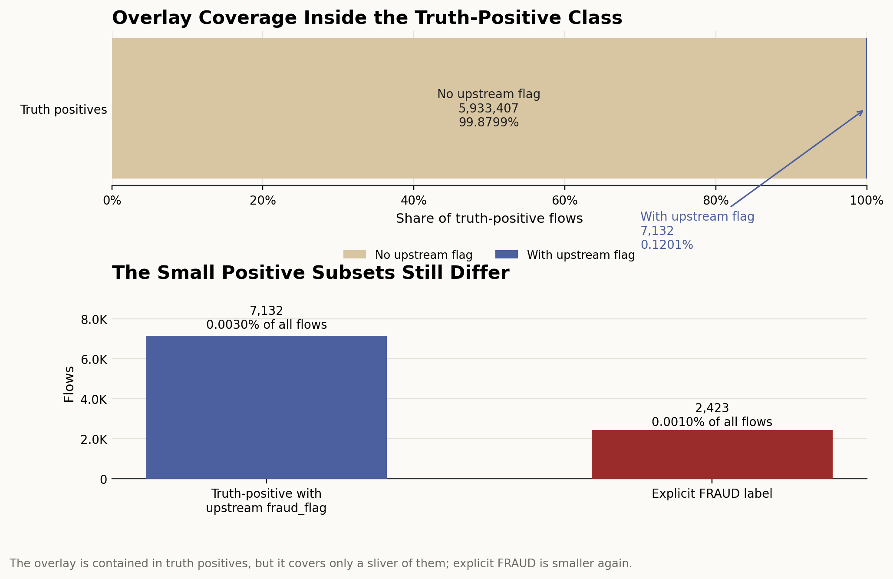

# Branch Investigation: Flow Truth Labels and Positive-Class Semantics

## Branch question

The parent truth-products investigation established that `s4_flow_truth_labels_6B` is the authoritative supervised label surface at flow grain. This branch focuses only on that surface and asks:

> What does the flow truth label actually say about the positive class, and how should that shape fraud analytics?

The immediate answer is that the truth surface does not describe the same narrow world as the sparse upstream `fraud_flag`. It defines a much broader positive judgement space dominated by `ABUSE`, with a very small explicitly labelled `FRAUD` class. That distinction is central to whether the current extract is usable for realistic fraud analytics.

## Evidence used

Primary report:

- [`truth_products_investigation.md`](../truth_products_investigation.md)

Branch exports:

- [`flow_truth_label_summary.csv`](../../../../exports/interface_world/truth_products/flow_truth_label_summary.csv)
- [`flow_truth_anchor_reconciliation.csv`](../../../../exports/interface_world/truth_products/flow_truth_anchor_reconciliation.csv)
- [`flow_truth_profile.csv`](../../../../exports/interface_world/truth_products/flow_truth_profile.csv)
- [`flow_truth_nulls.csv`](../../../../exports/interface_world/truth_products/flow_truth_nulls.csv)

Related reports:

- [`behavioural_streams_investigation.md`](../../behavioural_streams/behavioural_streams_investigation.md)
- [`baseline_vs_fraud_overlay_contract.md`](../../behavioural_streams/branches/baseline_vs_fraud_overlay_contract.md)

This branch uses compact exports already produced by the truth-products investigation. It does not rescan the raw `236.7M`-row truth surface.

## What the surface is allowed to answer

`s4_flow_truth_labels_6B` is a flow-grain supervised label surface. Its row count is the flow count:

| Metric | Value |
|---|---:|
| Rows | `236,691,694` |
| Flows | `236,691,694` |
| Truth-positive flows | `5,940,539` |
| Truth-negative flows | `230,751,155` |
| Distinct truth labels | `3` |
| Null `fraud_label` rows | `0` |

So this surface is clean as a label table: one row per flow, no missing flow IDs, no missing truth flags, no missing fraud labels, and one pinned run/scenario lineage. It is the right starting point when the analytical question is supervised ground truth.

It is not the right surface for live decision-time features, campaign membership, or case operations. Those belong to other surfaces. Here we are reading the eventual truth judgement attached to each flow.

## The positive class is broad, but its language is not simple

The truth label distribution is:

| Truth flag | Fraud label | Flows | Flow share |
|---|---|---:|---:|
| `false` | `LEGIT` | `230,751,155` | `97.4902%` |
| `true` | `ABUSE` | `5,938,116` | `2.5088%` |
| `true` | `FRAUD` | `2,423` | `0.0010%` |

At the binary level, the truth-positive rate is about `2.51%`. That is radically different from the sparse upstream fraud overlay, which marked only `7,132` exact fraud flows.

But the positive class is not semantically uniform. Almost every truth-positive flow is labelled `ABUSE`; only `2,423` flows are labelled `FRAUD`. In share terms, `ABUSE` represents more than `99.95%` of truth-positive flows, while explicit `FRAUD` is a tiny part of the positive truth surface.

That means stakeholder language matters. If we report `2.51%` as "fraud rate" without qualification, we would be collapsing abuse and fraud into one business term. If the stakeholder question is broad risk or unwanted behaviour, the binary positive class may be appropriate. If the question is explicit fraud loss, chargeback fraud, or criminal fraud, the `FRAUD` label alone is much smaller.

## Truth is not the same as the upstream fraud overlay

The reconciliation against the post-overlay flow anchor is:

| Truth flag | Anchor `fraud_flag` | Flows | Flow share |
|---|---|---:|---:|
| `false` | `false` | `230,751,155` | `97.4902%` |
| `true` | `false` | `5,933,407` | `2.5068%` |
| `true` | `true` | `7,132` | `0.0030%` |
| `false` | `true` | `0` | `0.0000%` |

This resolves part of the realism concern raised in the behavioural-stream investigation, but not all of it.

It resolves the label-surface question: the final supervised truth world is not only the `7,132` overlay-marked flows. The truth process declares `5,940,539` positive flows. So if our aim is supervised modelling or flow-level truth analytics, the extract is not limited to a `0.003%` positive class.

It does not resolve the fraud-overlay calibration concern. The upstream `fraud_flag` remains extremely sparse and low-impact as a campaign/context marker. The truth surface is telling us that most positive truth judgement exists outside that explicit overlay marker. Therefore, the right conclusion is not "the fraud concern disappears." The right conclusion is:

- `fraud_flag` is not the final label.
- `is_fraud_truth` is the final supervised binary label.
- the semantics of that binary label are dominated by `ABUSE`, not explicit `FRAUD`.

## What `fraud_flag` now means in light of truth

The anchor `fraud_flag` has perfect containment inside truth positives in this extract:

- truth-negative and `fraud_flag = true`: `0` flows
- truth-positive and `fraud_flag = true`: `7,132` flows

So the overlay marker is not producing false positives against the truth surface. Every overlay-marked flow is truth-positive.

But the reverse is not true. The truth surface has `5,933,407` positive flows with `fraud_flag = false`. That means `fraud_flag` is a narrow positive-context marker, not a coverage-complete fraud label.

For analytics, the implication is direct:

1. Use `is_fraud_truth` when calculating supervised positive rate, recall, precision, model target prevalence, or truth-based portfolio metrics.

2. Use `fraud_flag` when the question is about the explicit upstream campaign/overlay mechanism.

3. Do not use `fraud_flag` as a shortcut for truth, because it would miss almost all truth positives.

## Realism read from this branch

This branch changes our provisional fitness read.

Before truth products, the behavioural stream made the fraud world look under-seeded: only `7,132` fraud flows, low median amount, and tiny portfolio amount impact. After reading flow truth, the supervised positive class is no longer sparse in that same way. A `2.51%` flow-level positive rate is substantial enough to support modelling and labelled analytics in count terms.

However, the class semantics remain a concern for stakeholder-facing fraud analytics:

- `ABUSE` dominates the positive class.
- explicit `FRAUD` is only `2,423` flows.
- the upstream campaign overlay is only a tiny subset of truth positives.

So the data may be fit for broad abuse/fraud-risk analytics, but it is not yet proven fit for explicit fraud-loss analytics. Any stakeholder-facing work must decide whether the business question is about all truth-positive unwanted behaviour or only the explicit `FRAUD` label.

## Working conclusion

`s4_flow_truth_labels_6B` is the right flow-grain supervised label authority. It is clean, complete, and broad enough to support positive-class analytics at scale.

But the positive class must be named carefully. The binary `is_fraud_truth` flag mostly means `ABUSE` in this run, not explicit `FRAUD`. The upstream `fraud_flag` is a narrow campaign marker contained inside truth positives, while the truth surface expands the positive class far beyond that marker.

For the wider fitness-for-fraud-analytics question, this branch softens the earlier "fraud is too sparse" concern only if we define the target as broad truth-positive abuse/fraud risk. It does not by itself prove the extract is realistic for fraud-loss, chargeback-fraud, or explicit fraud-only stakeholder conclusions.

## Appendix: visual evidence and assessment

The figures below translate the compact branch exports into visual evidence. They are not separate claims from the report; they are the visible form of the same label-distribution and reconciliation evidence used above.

### Figure 1. Flow truth label distribution

This figure starts with the full truth-label surface at flow grain. The dominant bar is `LEGIT / truth=false`, with `230,751,155` flows, or `97.4902%` of the flow universe. The next visible mass is `ABUSE / truth=true`, with `5,938,116` flows, or `2.5088%`. The explicit `FRAUD / truth=true` class exists, but only at `2,423` flows, or `0.0010%` of the universe.

The x-axis is intentionally logarithmic. On a linear axis, the explicit `FRAUD` class would be visually erased by the much larger `LEGIT` and `ABUSE` counts. That choice matters because the point of the figure is not only "most flows are legitimate"; the more important investigative point is that the truth surface contains two positive labels with radically different scales. `ABUSE` is a large supervised-positive population. `FRAUD` is a very small explicit fraud population.

This figure proves that `is_fraud_truth=true` is not semantically equivalent to "explicit fraud" in this extract. It does not explain why a flow becomes `ABUSE` or `FRAUD`; that belongs to the truth-generation and case/evaluation logic outside this branch. What it does establish is the denominator problem that must govern any downstream analytics: a truth-positive rate calculated from `is_fraud_truth` is mostly an abuse-positive rate, not a direct fraud-only incidence rate.

### Figure 2. What the positive class is made of

This figure removes the `LEGIT` class and looks only inside the truth-positive population. The result is sharper than the full distribution: `ABUSE` accounts for `5,938,116` of `5,940,539` truth-positive flows, which is `99.9592%` of the positive class. Explicit `FRAUD` contributes only `2,423` flows, or `0.0408%` of truth positives.

This is the figure that explains why stakeholder language has to be disciplined. If we say "the fraud-positive class is 2.51%" without qualification, the reader may reasonably assume that the platform has labelled about 2.51% of flows as explicit fraud. That is not what the data says. The data says the binary positive class is overwhelmingly `ABUSE`, with explicit `FRAUD` present as a tiny subset.

The figure does not make the `ABUSE` label invalid. It shows that the binary target is broader than explicit fraud. That broader target may be suitable for risk modelling, abuse detection, policy enforcement, suspicious-behaviour analytics, or early-warning workflows. It is not automatically suitable for fraud-loss reporting unless the business definition intentionally groups abuse and fraud together.

### Figure 3. Positive rate by target definition

This figure compares four ways a reader might define "positive" in the same extract. If positive means `is_fraud_truth=true`, the prevalence is `5.94M` flows, or `2.5098%`. If positive means the `ABUSE` label alone, it is nearly the same, `2.5088%`, because `ABUSE` dominates the truth-positive class. If positive means the upstream `fraud_flag`, the count collapses to `7.1K` flows, or `0.0030%`. If positive means the explicit `FRAUD` label, it collapses further to `2.4K` flows, or `0.0010%`.

This is not a cosmetic difference. It changes the apparent operating reality of the platform. A `2.51%` positive rate describes a substantial supervised target population. A `0.0030%` overlay rate describes a very sparse upstream campaign/context marker. A `0.0010%` explicit fraud-label rate describes a still smaller fraud-only label population. Those are three different analytical worlds, even though they come from the same run.

The figure proves that the fitness question cannot be answered by one global "fraud rate" number. The answer depends on the definition of the target. It does not prove which definition stakeholders should use; that has to be chosen from the business question. But it does show why using `fraud_flag`, `is_fraud_truth`, `ABUSE`, and `FRAUD` interchangeably would create misleading analysis.

### Figure 4. Truth label versus upstream overlay marker

This reconciliation matrix compares the final truth flag against the upstream `fraud_flag`. The top-right cell is the containment check: there are `0` flows where `fraud_flag=true` but `is_fraud_truth=false`. In this extract, every overlay-marked flow is contained inside the final truth-positive population.

The bottom row is the more important asymmetry. There are `7,132` flows that are both truth-positive and overlay-marked, but there are `5,933,407` truth-positive flows without the upstream overlay marker. That means the overlay marker is not a coverage-complete label. It identifies a narrow subset of positive truth, while most positive truth is declared outside the explicit overlay.

This figure proves that the earlier behavioural-stream realism concern should be narrowed, not discarded. The sparse `fraud_flag` does not mean the supervised label surface has only `7,132` positives. But the `fraud_flag` itself remains sparse and should still be read as an overlay/campaign marker, not as the final fraud label. The matrix also does not tell us whether the truth-positive-without-overlay flows are realistic; it only shows that the final truth authority is broader than the overlay flag.

### Figure 5. Overlay coverage inside the truth-positive class

This figure focuses on coverage rather than raw prevalence. In the upper panel, almost the entire truth-positive bar is made of flows without upstream `fraud_flag`: `5,933,407` flows, or `99.8799%` of truth positives. The overlay-marked portion is only `7,132` flows, or `0.1201%` of truth positives.

The lower panel then separates two small positive subsets that are easy to conflate: truth-positive flows with upstream `fraud_flag`, and flows explicitly labelled `FRAUD`. The overlay subset is `7,132` flows, while the explicit `FRAUD` label is `2,423` flows. Both are tiny relative to the full flow universe, but they are not the same object. The overlay subset is a marker carried from the upstream behavioural/anchor world; the explicit `FRAUD` label is a truth-label category inside `s4_flow_truth_labels_6B`.

The figure reinforces the branch's main semantic conclusion. The supervised positive class is broad enough in count terms to support labelled modelling work, but it is broad because of `ABUSE`, not because the extract contains a large explicit fraud population. For stakeholder-facing fraud analytics, this means we should not promise explicit fraud-loss conclusions until the question and target definition are separated: broad abuse/fraud-risk, upstream overlay behaviour, and explicit fraud-only incidence are different readings of the same interface world.
