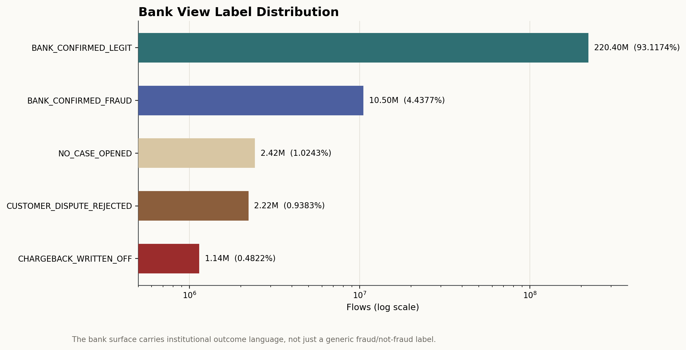
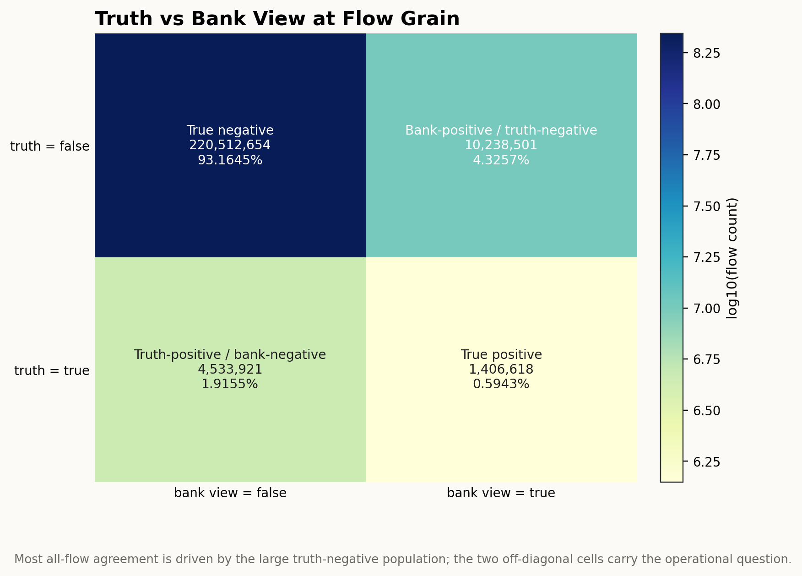
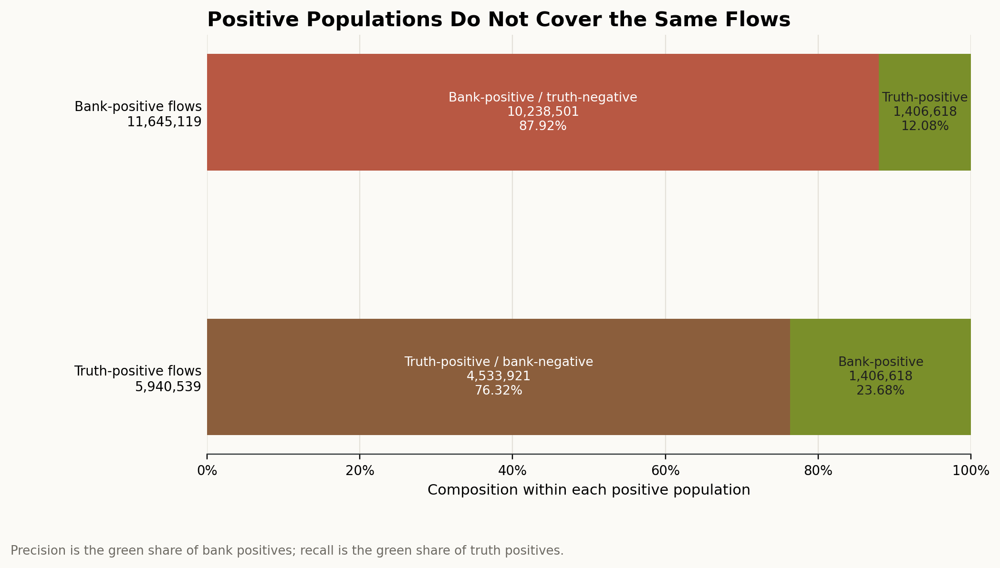
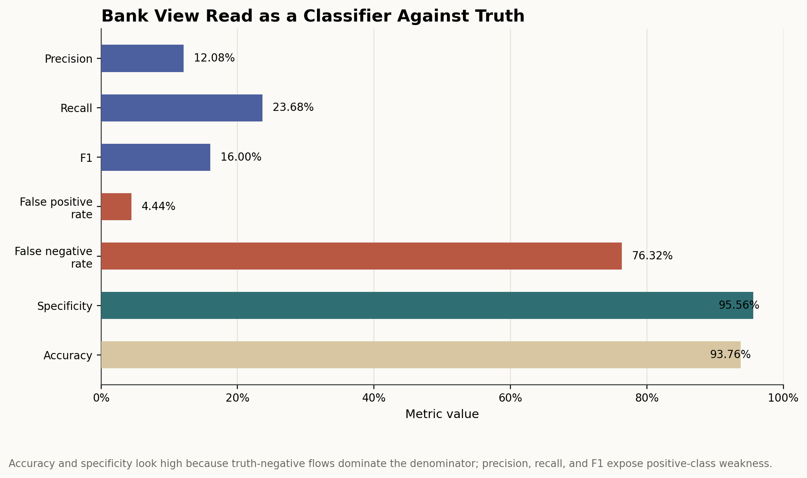
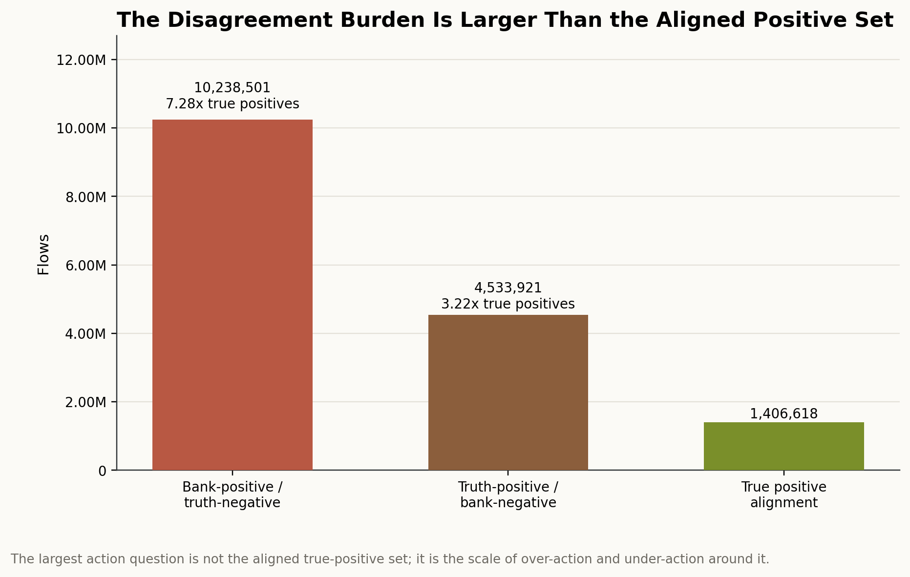

# Branch Investigation: Truth vs Bank View

## Branch question

The parent truth-products investigation established that `s4_flow_truth_labels_6B` and `s4_flow_bank_view_6B` cover the same flow universe, but they do not answer the same question. This branch asks:

> How does the institution-facing bank view diverge from supervised truth, and what does that divergence mean for fraud analytics?

The immediate answer is that the bank view is not a clean substitute for truth. It marks nearly twice as many flows as positive as the truth surface does, but only a minority of truth-positive flows are also bank-positive. That disagreement is not noise to be ignored; it is one of the main analytical objects exposed by the truth-products layer.

## Evidence used

Primary report:

- [`truth_products_investigation.md`](../truth_products_investigation.md)

Branch and parent exports:

- [`flow_truth_bank_confusion.csv`](../../../../exports/interface_world/truth_products/flow_truth_bank_confusion.csv)
- [`flow_bank_label_summary.csv`](../../../../exports/interface_world/truth_products/flow_bank_label_summary.csv)
- [`flow_bank_profile.csv`](../../../../exports/interface_world/truth_products/flow_bank_profile.csv)
- [`flow_bank_nulls.csv`](../../../../exports/interface_world/truth_products/flow_bank_nulls.csv)
- [`flow_truth_label_summary.csv`](../../../../exports/interface_world/truth_products/flow_truth_label_summary.csv)
- [`flow_truth_profile.csv`](../../../../exports/interface_world/truth_products/flow_truth_profile.csv)
- [`truth_bank_label_pair_anatomy.csv`](../../../../exports/interface_world/truth_products/branches/truth_vs_bank_view/truth_bank_label_pair_anatomy.csv)
- [`truth_bank_label_pair_anatomy_within_cell.csv`](../../../../exports/interface_world/truth_products/branches/truth_vs_bank_view/truth_bank_label_pair_anatomy_within_cell.csv)

Related branch:

- [`flow_truth_labels_positive_class_semantics.md`](flow_truth_labels_positive_class_semantics.md)

This branch primarily uses compact exports already produced by the truth-products investigation. It also adds one compact label-pair anatomy aggregate, exported in two views, produced by streaming matching truth/bank parquet part files and aggregating only the label pairs needed for this branch. The raw `236.7M` rows were not materialized into one in-memory frame.

## What is being compared

At flow grain, the two surfaces line up physically:

| Surface | Rows | Flows | Positive flag | Label column | Null label rows |
|---|---:|---:|---|---|---:|
| `s4_flow_truth_labels_6B` | `236,691,694` | `236,691,694` | `is_fraud_truth` | `fraud_label` | `0` |
| `s4_flow_bank_view_6B` | `236,691,694` | `236,691,694` | `is_fraud_bank_view` | `bank_label` | `0` |

So the comparison is not fighting a grain mismatch. Both surfaces represent one row per flow under the same pinned run/scenario lineage. The disagreement is semantic and operational, not structural.

`is_fraud_truth` is the supervised truth target. It says what the offline truth authority eventually declares about the flow. `is_fraud_bank_view` is the institution-facing action/judgement view. It says what the bank side sees, confirms, writes off, rejects, or leaves without a case.

That distinction matters because the bank view can be useful even when it disagrees with truth. It can represent operational suspicion, customer dispute outcomes, chargeback posture, institutional confirmation, or case handling. But it is not automatically the target label for supervised fraud modelling.

## Bank view has its own label language

The bank-view distribution is:

| Bank-view flag | Bank label | Flows | Flow share |
|---|---|---:|---:|
| `false` | `BANK_CONFIRMED_LEGIT` | `220,401,202` | `93.1174%` |
| `true` | `BANK_CONFIRMED_FRAUD` | `10,503,772` | `4.4377%` |
| `false` | `NO_CASE_OPENED` | `2,424,522` | `1.0243%` |
| `false` | `CUSTOMER_DISPUTE_REJECTED` | `2,220,851` | `0.9383%` |
| `true` | `CHARGEBACK_WRITTEN_OFF` | `1,141,347` | `0.4822%` |

This is already more operational than the truth surface. The truth surface has `LEGIT`, `ABUSE`, and `FRAUD`. The bank surface has labels that read like institutional outcomes: confirmed legitimate, confirmed fraud, no case opened, customer dispute rejected, and chargeback written off.

That means the bank view should not be flattened too quickly into "the bank's version of fraud." The binary flag is useful, but the label vocabulary tells us the surface is carrying action context. `BANK_CONFIRMED_FRAUD` and `CHARGEBACK_WRITTEN_OFF` both map to `is_fraud_bank_view=true`, but they are not operationally identical. One is confirmation language; the other is loss/write-off language.

## The binary disagreement surface

The flow-level truth/bank matrix is:

| Truth | Bank view | Meaning if bank view is read against truth | Flows | Flow share |
|---|---|---|---:|---:|
| `false` | `false` | true negative | `220,512,654` | `93.1645%` |
| `false` | `true` | bank-positive but truth-negative | `10,238,501` | `4.3257%` |
| `true` | `false` | truth-positive but bank-negative | `4,533,921` | `1.9155%` |
| `true` | `true` | true positive | `1,406,618` | `0.5943%` |

The biggest cell is agreement on non-positive flows. That is expected because the full population is dominated by `LEGIT` truth labels. But the important part of the matrix is not the high overall agreement produced by the majority class. The important part is the two disagreement cells:

- `10,238,501` flows are bank-positive but truth-negative.
- `4,533,921` flows are truth-positive but bank-negative.

Those two cells describe different business problems. Bank-positive/truth-negative flows are potential over-action, false-positive review, customer-friction, investigation cost, or institutional conservatism. Truth-positive/bank-negative flows are potential missed-risk, under-action, delayed recognition, or truth-positive behaviour that did not convert into bank-positive handling.

## If bank view is read as a classifier, it is weak against truth

If we temporarily read `is_fraud_bank_view` as a binary classifier against `is_fraud_truth`, the operating metrics are:

| Metric | Value |
|---|---:|
| Precision | `12.08%` |
| Recall | `23.68%` |
| Specificity | `95.56%` |
| False positive rate | `4.44%` |
| False negative rate | `76.32%` |
| Accuracy | `93.76%` |
| F1 score | `16.00%` |
| Bank-positive rate | `4.92%` |
| Truth-positive rate | `2.51%` |

The high accuracy is mostly a denominator effect. Because `97.49%` of flows are truth-negative, a surface can look accurate at the all-flow level while still doing a poor job on the positive class. Precision tells us that only about `12.08%` of bank-positive flows are truth-positive. Recall tells us that the bank-positive surface captures only about `23.68%` of truth-positive flows.

That is why this branch should not conclude that the bank view is "bad" in a generic sense. It is weak if treated as a classifier. But the bank view may not be intended to be a pure classifier. In the platform's operating context, it is an institutional action surface. It can still be extremely valuable for studying review posture, friction, chargeback/loss outcomes, operational conservatism, dispute handling, and the gap between supervised truth and what the institution acts on.

## Bank view is broader than truth, but not better aligned with truth

The bank surface marks `11,645,119` flows as positive. The truth surface marks `5,940,539` flows as positive. In count terms, the bank-positive population is about `1.96x` the truth-positive population.

That alone could make the bank view look more aggressive or more conservative depending on the lens. But the confusion matrix shows the real structure: the larger bank-positive population is not just "truth positives plus some extras." It contains `10,238,501` truth-negative flows and only `1,406,618` truth-positive flows. Meanwhile, `4,533,921` truth-positive flows remain bank-negative.

So the bank view is not simply broader coverage of the truth-positive class. It is a different judgement surface. It expands action on one side while missing much of the supervised-positive world on the other. This is precisely the kind of divergence that can become a strong stakeholder-facing analytics project, because it creates concrete questions:

- Where is the bank over-acting relative to truth?
- Where is the bank under-acting relative to truth?
- Are bank-positive/truth-negative flows concentrated by channel, country, amount, merchant, case path, or time?
- Are truth-positive/bank-negative flows mainly `ABUSE`, explicit `FRAUD`, or some operating segment not being escalated?
- Does case lifecycle explain the disagreement?

Those questions are more valuable than asking whether the bank view is "right" or "wrong" in isolation.

## Label anatomy of the disagreement

The first answer to "why do truth and bank view disagree?" is not yet causal. At this point, the responsible question is: what kind of label disagreement are we actually looking at?

To answer that, I computed a full flow-level label-pair anatomy by streaming matching parquet part files from `s4_flow_truth_labels_6B` and `s4_flow_bank_view_6B`. Each matching part was checked for row count and `flow_id` alignment before aggregation. The export is compact; the raw `236.7M` rows were not materialized into one in-memory frame.

The full label-pair surface is:

| Truth flag | Truth label | Bank flag | Bank label | Cell | Flows | Within-cell share |
|---|---|---|---|---|---:|---:|
| `false` | `LEGIT` | `false` | `BANK_CONFIRMED_LEGIT` | true-negative alignment | `220,401,202` | `99.9495%` |
| `false` | `LEGIT` | `false` | `CUSTOMER_DISPUTE_REJECTED` | true-negative alignment | `111,452` | `0.0505%` |
| `false` | `LEGIT` | `true` | `BANK_CONFIRMED_FRAUD` | bank-positive/truth-negative | `10,232,664` | `99.9430%` |
| `false` | `LEGIT` | `true` | `CHARGEBACK_WRITTEN_OFF` | bank-positive/truth-negative | `5,837` | `0.0570%` |
| `true` | `ABUSE` | `false` | `NO_CASE_OPENED` | truth-positive/bank-negative | `2,423,574` | `53.4543%` |
| `true` | `ABUSE` | `false` | `CUSTOMER_DISPUTE_REJECTED` | truth-positive/bank-negative | `2,109,342` | `46.5236%` |
| `true` | `FRAUD` | `false` | `NO_CASE_OPENED` | truth-positive/bank-negative | `948` | `0.0209%` |
| `true` | `FRAUD` | `false` | `CUSTOMER_DISPUTE_REJECTED` | truth-positive/bank-negative | `57` | `0.0013%` |
| `true` | `ABUSE` | `true` | `CHARGEBACK_WRITTEN_OFF` | true-positive alignment | `1,135,282` | `80.7100%` |
| `true` | `ABUSE` | `true` | `BANK_CONFIRMED_FRAUD` | true-positive alignment | `269,918` | `19.1891%` |
| `true` | `FRAUD` | `true` | `BANK_CONFIRMED_FRAUD` | true-positive alignment | `1,190` | `0.0846%` |
| `true` | `FRAUD` | `true` | `CHARGEBACK_WRITTEN_OFF` | true-positive alignment | `228` | `0.0162%` |

This changes the disagreement read from abstract counts into operational shape.

The bank-positive/truth-negative cell is almost entirely `LEGIT` flows labelled `BANK_CONFIRMED_FRAUD` by the bank view: `10,232,664` of `10,238,501` flows. Only `5,837` of those bank-positive/truth-negative flows are `CHARGEBACK_WRITTEN_OFF`. So the over-action side is not mainly a write-off problem in label terms. It is mainly a bank-confirmation-versus-truth disagreement: the bank view says confirmed fraud where the truth surface says `LEGIT`.

The truth-positive/bank-negative cell is almost entirely `ABUSE`, split between two bank-negative labels. `2,423,574` flows are `ABUSE` with `NO_CASE_OPENED`, and `2,109,342` are `ABUSE` with `CUSTOMER_DISPUTE_REJECTED`. Explicit `FRAUD` contributes only `1,005` flows to the truth-positive/bank-negative cell. So the missed-risk side is not an explicit-fraud miss in volume terms. It is mostly an abuse-positive population that the bank view either leaves as no-case or rejects through the customer-dispute path.

The true-positive alignment cell is also dominated by `ABUSE`, not explicit `FRAUD`. `1,135,282` aligned positives are `ABUSE / CHARGEBACK_WRITTEN_OFF`, and `269,918` are `ABUSE / BANK_CONFIRMED_FRAUD`. Explicit `FRAUD` contributes only `1,418` aligned positive flows. That matters because even where bank view and truth agree positively, the aligned positive set is still mostly abuse-risk alignment, not explicit-fraud alignment.

The true-negative alignment cell is almost entirely `LEGIT / BANK_CONFIRMED_LEGIT`. The only other true-negative label pair is `LEGIT / CUSTOMER_DISPUTE_REJECTED`, with `111,452` flows. That small cell is worth retaining as a lead because it suggests some customer disputes are rejected even where truth remains legitimate, but it is not large enough to define the branch.

So the branch can now answer the disagreement question at the label level:

- Over-action is dominated by `LEGIT` flows marked `BANK_CONFIRMED_FRAUD`.
- Under-action is dominated by `ABUSE` flows labelled `NO_CASE_OPENED` or `CUSTOMER_DISPUTE_REJECTED`.
- Positive agreement is dominated by `ABUSE / CHARGEBACK_WRITTEN_OFF`, not explicit `FRAUD`.
- Explicit `FRAUD` is too small to explain the truth/bank disagreement at portfolio scale.

This does not yet prove why the system produced those pairings. It does, however, narrow the next investigative question. If we later inspect case timeline and operational burden, we should not treat the burden as generic truth/bank mismatch. The case branch should specifically ask why large volumes of `LEGIT / BANK_CONFIRMED_FRAUD`, `ABUSE / NO_CASE_OPENED`, `ABUSE / CUSTOMER_DISPUTE_REJECTED`, and `ABUSE / CHARGEBACK_WRITTEN_OFF` exist, and what operational story each pair carries.

## What this means for later analytics

For supervised modelling, `is_fraud_truth` should remain the target unless the project brief explicitly asks for bank-action prediction. The bank view can be a comparison surface, an operational outcome, or a downstream label depending on the analytical question, but it should not silently replace truth.

For stakeholder analytics, the disagreement itself is likely useful. A risk team may care about truth-positive/bank-negative flows because they point to missed or under-handled risk. An operations or customer-experience team may care about bank-positive/truth-negative flows because they point to possible over-escalation or customer friction. A finance/loss team may care about `CHARGEBACK_WRITTEN_OFF` separately because it is closer to realized institutional cost than a generic bank-positive flag.

For realism assessment, this branch does not create the same concern as the sparse upstream `fraud_flag`. The truth/bank disagreement is not inherently unrealistic. Real financial institutions often have disagreement between eventual ground truth, operational action, customer disputes, chargebacks, and case handling. The concern would only arise if later branches show that the disagreement is mechanically patterned in an implausible way, or if the label meanings are too synthetic to support stakeholder claims.

## Working conclusion

`s4_flow_bank_view_6B` is not a substitute for `s4_flow_truth_labels_6B`. It is a separate institutional judgement surface operating over the same flow universe.

Read as a classifier, bank view has low precision and low recall against truth. Read as an operational surface, the same disagreement becomes analytically valuable: it exposes possible over-action, missed truth-positive behaviour, chargeback/write-off posture, and the gap between truth and institutional handling.

The label anatomy narrows the disagreement further: over-action is dominated by `LEGIT / BANK_CONFIRMED_FRAUD`, under-action is dominated by `ABUSE / NO_CASE_OPENED` and `ABUSE / CUSTOMER_DISPUTE_REJECTED`, and aligned positives are mostly `ABUSE / CHARGEBACK_WRITTEN_OFF`. Explicit `FRAUD` is present but too small to explain the branch at portfolio scale.

For later project briefs, this branch gives us a strong candidate area: truth/bank divergence analysis. The data can support stakeholder-facing questions about operational action quality and risk handling, provided we keep the target definition clear and do not present bank view as ground truth.

## Appendix: visual evidence and assessment

The figures below turn the branch's compact exports into visual evidence. They do not introduce a separate argument from the report; they make the truth/bank disagreement easier to inspect at the level of label language, binary alignment, positive-class overlap, metric behaviour, and operational burden.

### Figure 1. Bank view label distribution

This figure shows why `s4_flow_bank_view_6B` should not be treated as a plain replacement for the truth-label table. The largest category is `BANK_CONFIRMED_LEGIT`, with `220,401,202` flows, or `93.1174%` of the flow universe. That is the expected majority-class mass. The next largest bank outcome is `BANK_CONFIRMED_FRAUD`, with `10,503,772` flows, or `4.4377%`. The smaller but still material categories are `NO_CASE_OPENED` at `2,424,522` flows, `CUSTOMER_DISPUTE_REJECTED` at `2,220,851` flows, and `CHARGEBACK_WRITTEN_OFF` at `1,141,347` flows.

The important point is the label vocabulary. This is not merely a binary fraud/not-fraud surface with a different name. It carries institutional handling language: confirmation, case absence, customer dispute rejection, and chargeback write-off. That language tells us the surface is closer to how the institution records or acts on flows than to a pure supervised target.

The log scale is used because the bank labels span from over `220M` flows down to about `1.14M` flows. The figure proves that the bank view has operational structure inside it. It does not prove whether each institutional outcome is correct against truth. That judgment requires the truth/bank reconciliation shown in the next figures.

### Figure 2. Truth versus bank view at flow grain

This matrix is the core reconciliation surface for the branch. It compares `is_fraud_truth` and `is_fraud_bank_view` over the same flow universe. The largest cell is the true-negative cell: `220,512,654` flows are truth-negative and bank-negative. That cell explains why all-flow agreement and accuracy can look strong even when positive-class alignment is weak.

The two off-diagonal cells are the operationally interesting part. `10,238,501` flows are bank-positive but truth-negative. These are the flows that create the over-action or false-positive-style question: why did the institution-facing surface mark these flows as positive when the supervised truth surface did not? On the other side, `4,533,921` flows are truth-positive but bank-negative. These create the missed-risk or under-action question: why did the supervised truth surface mark these flows positive without the bank view also marking them positive?

The true-positive alignment cell is `1,406,618` flows. That is the overlap between the two positive concepts. It is not the majority of either positive population. So the figure proves that bank view and truth are not simply two names for the same label. It also does not prove that the bank view is defective by itself; it only proves that if we read bank view against truth, there is a large disagreement surface that needs to be investigated rather than ignored.

### Figure 3. Positive populations do not cover the same flows

This figure looks inside the positive populations rather than across the full flow universe. That matters because the full matrix is dominated by truth-negative flows. Here, the denominator changes depending on which positive population we are inspecting.

The upper bar starts with all bank-positive flows: `11,645,119` flows. Of these, `10,238,501` are truth-negative, which is `87.92%` of bank positives. Only `1,406,618`, or `12.08%`, are also truth-positive. This is the precision view: when the bank view says positive, only a small share agrees with supervised truth.

The lower bar starts with all truth-positive flows: `5,940,539` flows. Of these, `4,533,921`, or `76.32%`, are bank-negative. Only `1,406,618`, or `23.68%`, are also bank-positive. This is the recall view: when truth says positive, the bank view captures only about a quarter of that positive population.

The figure proves that the disagreement is not just a small edge effect caused by the huge full-flow denominator. It remains large even after we zoom into the positive populations. What it does not prove is why the mismatch exists. The reason could be label semantics, bank-action policy, case lifecycle, synthetic calibration, or segment-specific behaviour. Those are follow-on questions for deeper branch work.

### Figure 4. Bank view read as a classifier against truth

This figure translates the confusion matrix into standard classifier-style metrics, but the wording is deliberate: it is the bank view read as a classifier, not necessarily the bank view designed as a classifier. Precision is `12.08%`, recall is `23.68%`, and F1 is `16.00%`. Those three metrics say that positive-class alignment is weak if `is_fraud_truth` is the target.

The same chart also shows specificity at `95.56%` and accuracy at `93.76%`. Those numbers look strong, but they are dominated by the truth-negative majority. Because `97.49%` of flows are truth-negative, a surface can appear accurate at all-flow level while still missing most truth positives and producing many bank positives that do not match truth.

The figure's statistical point is therefore not "accuracy is fake." Accuracy is mathematically correct. The point is that accuracy is not the right lead metric for this branch's question. If the stakeholder question is about fraud/risk-positive behaviour, precision, recall, F1, false positives, and false negatives carry more meaning than all-flow accuracy. This is exactly the kind of metric discipline we need later when turning the investigation into stakeholder-facing analytics.

### Figure 5. Disagreement burden versus aligned positive set

This figure compares the two disagreement populations against the aligned true-positive set. The bank-positive/truth-negative population contains `10,238,501` flows, which is `7.28x` the true-positive alignment count. The truth-positive/bank-negative population contains `4,533,921` flows, which is `3.22x` the true-positive alignment count. The aligned positive set itself is `1,406,618` flows.

This is the operational burden view. If we only report the true-positive agreement, we miss the larger operating story. The bigger analytical question is not simply "how many positives agree?" It is how much work, friction, missed-risk, or review burden exists around the agreement. Bank-positive/truth-negative flows may represent over-action, false-positive review, customer friction, or conservative institutional handling. Truth-positive/bank-negative flows may represent missed risk, under-escalation, delayed recognition, or a truth-positive class that is not meant to always become bank-positive.

The figure does not assign blame to the bank view. It makes the scale of divergence visible. That scale is why this branch is useful for later project briefs: truth/bank divergence can support concrete stakeholder questions about operational quality, risk handling, review burden, and the difference between supervised truth and institutional action.
