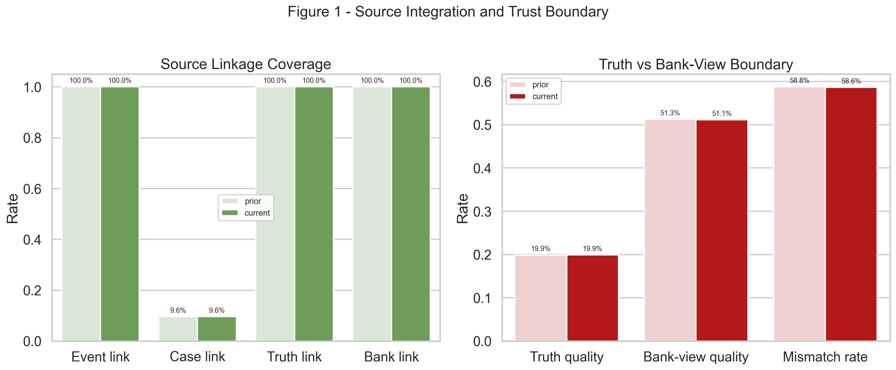
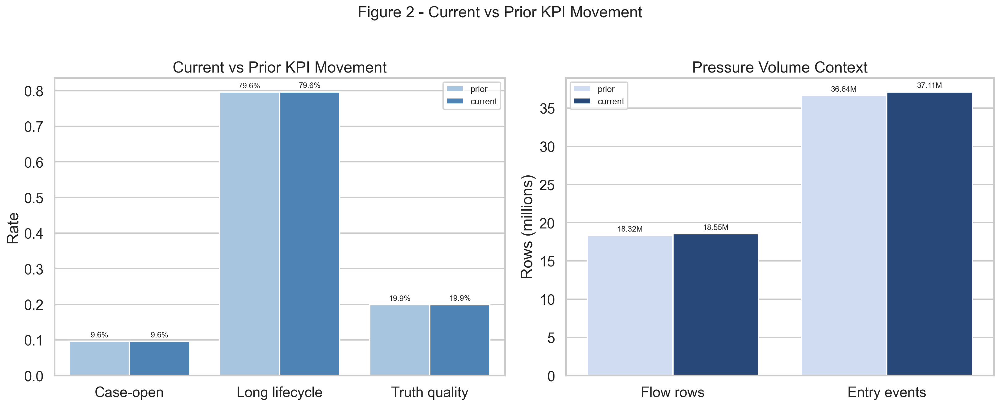
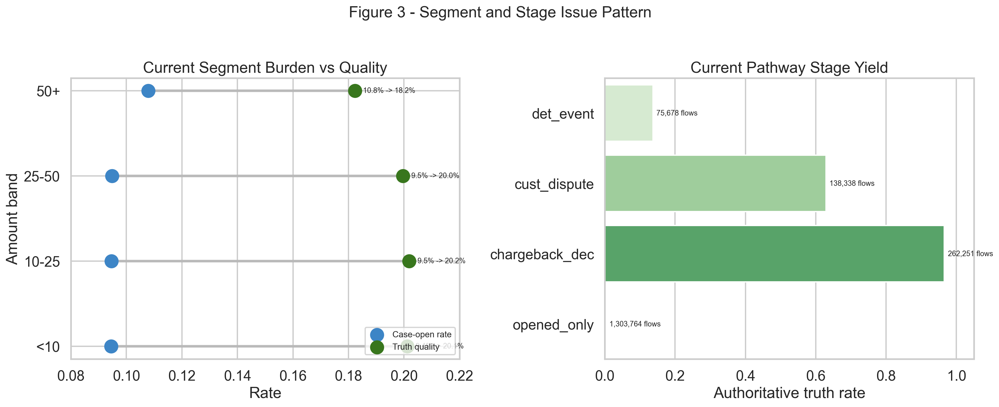

# Service Line Reporting Pack v1

This pack operationalises the bounded multi-source service-performance slice into three complementary evidence figures.

## Figure 1 - Source Integration and Trust Boundary

## Figure 2 - Current vs Prior KPI Movement

## Figure 3 - Segment and Stage Issue Pattern

