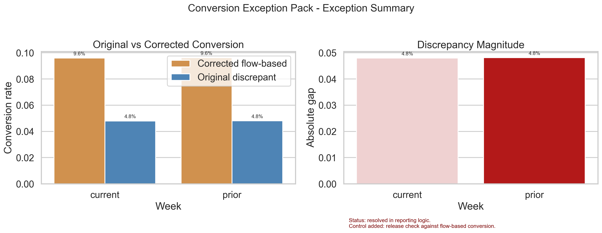
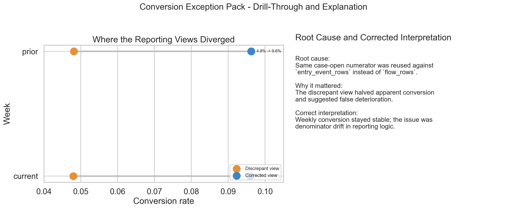

# Conversion Exception Pack v1

This pack operationalises one anomaly-to-resolution cycle for suspicious-to-case conversion.

## Page 1 - Exception Summary

## Page 2 - Drill-Through and Explanation

