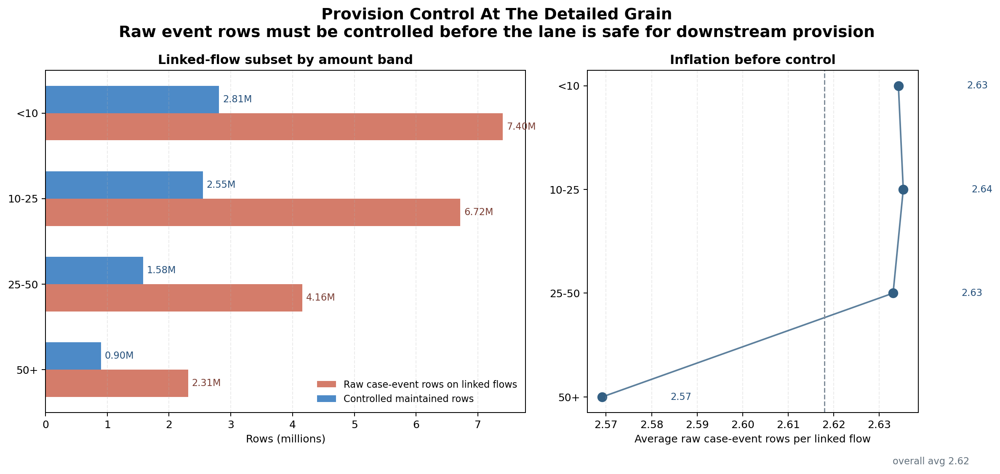
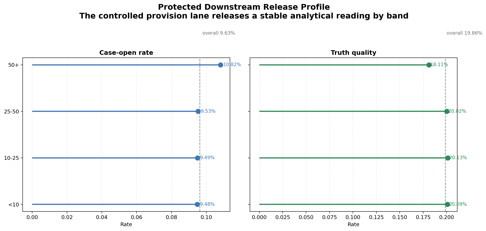

# Execution Report - Trusted Data Provision And Integrity Slice

As of `2026-04-04`

Purpose:
- record what was actually executed for the Claire House `Data & Insight Analyst` slice around production, management, protection, and integrity of data provision
- preserve the truth boundary between one bounded trusted data-provision lane and any wider claim about full organisational information-estate ownership
- package the saved facts, provision-control outputs, integrity checks, protection notes, and claim-ready evidence into one outward-facing report

Truth boundary:
- this execution was completed by widening the already-controlled InHealth `3.C` trust foundation into a Claire House-shaped provision lane
- the slice did not rebuild a broad organisational data estate
- the slice did not claim enterprise MDM, full systems integration, or broad information-governance ownership
- the slice stayed limited to one bounded monthly analytical provision path:
  - `Mar 2026`
- the honest platform analogue here is:
  - one controlled analytical provision lane
  - one explicit source-contribution path
  - one explicit field-authority layer
  - one protected downstream analytical output
- the slice therefore supports a truthful claim about supporting trusted, protected, integrity-aware data provision for downstream analytical use
- it does not support a claim that the full Claire House organisational information environment has already been industrialised

---

## 1. Executive Answer

The slice asked:

`can one bounded organisational-style analytical provision path be shown to be controlled, protected, and integrity-safe enough to support dependable downstream analytical use?`

The bounded answer is:
- one monthly provision window was fixed:
  - `Mar 2026`
- one controlled provision lane was fixed:
  - one maintained `flow_id`-grain dataset inherited from InHealth `3.C`
  - widened into a Claire House-shaped provision path with explicit source contribution and protection language
- one explicit source map was carried across `3` source surfaces
- one explicit release-safe authority layer was carried across `9` fields
- the lane was profiled and control-scoped before any widening logic was packaged
- one key protection risk remained explicit:
  - raw event-grain case rows are unsafe for direct downstream provision
- one controlled downstream output was released from the lane:
  - `1` protected monthly summary
- inherited maintained-lane validation remains `5/5` checks passed
- protected downstream reconciliation remains `4/4` amount bands matched exactly
- the protected downstream reading remains:
  - `9.63%` overall case-open rate
  - `19.86%` overall truth quality
- regeneration of the widened Claire House control pack takes about `0.51` seconds because the slice reuses compact trusted outputs instead of reopening a large raw-data build

That means this slice did not merely relabel an old stewardship pack. It turned an existing controlled maintained lane into a Claire House-shaped proof of trusted data provision, with explicit source contribution, field authority, integrity checks, and protected downstream analytical use.

## 2. Slice Summary

The slice executed was:

`one trusted multi-surface data-provision lane for a bounded monthly reporting pathway, with explicit source mapping, field authority, integrity checks, and protected downstream output`

This was chosen because it allowed a direct response to the Claire House requirement:
- support the production of data provision
- support the management of data provision
- support the protection of data provision
- support the integrity of data provision

The main delivered outputs were:
- one provision profile output
- one control-path output
- one provision integrity-check output
- one protected downstream provision summary
- one provision scope note
- one source map
- one field-authority note
- one integrity note
- one protection note
- one caveats note
- one regeneration README

## 3. How This Maps To The Slice Plan

The execution stayed aligned to the approved Claire House `3.A` slice rather than drifting into broad governance, board reporting, or a fake organisational data-platform build.

The delivered scope maps back to the planned lens responsibilities as follows:
- `03 - Data Quality, Governance, and Trusted Information Stewardship`: controlled provision-lane definition, source contribution logic, field authority, integrity checks, and explicit protection boundary
- `02 - BI, Insight, and Reporting Analytics`: one protected downstream analytical output released only from the controlled lane
- `09 - Analytical Delivery Operating Discipline`: stable regeneration logic, explicit scope note, caveats note, and regeneration README
- `05 - Business Analysis, Change, and Decision Support`: light organisational-use framing only, namely that the lane is controlled for downstream analytical use rather than loose raw extraction

The report therefore needs to be read as proof of one bounded trusted data-provision lane, not as proof that the whole Claire House organisational data environment is already governed end to end.

## 4. Execution Posture

The execution followed the intended inherit-and-widen posture rather than forcing a fresh raw rebuild.

The working discipline was:
- confirm the inherited InHealth `3.C` trust foundation first
- keep all heavy work inside `DuckDB` or inherited compact outputs
- profile the widened provision path before packaging any new claim
- reuse the maintained `flow_id`-grain lane and protected summary where that was the honest basis
- add only compact new control and provision-language layers on top of the inherited outputs
- use Python only after the SQL layer had already reduced the prior slice to compact trusted outputs

This matters for the truth of the slice because the Claire House responsibility here is about controlled data provision, and the execution should read like careful organisational-style control of a provision path rather than a raw rebuild performed for effect.

## 5. Bounded Build That Was Actually Executed

### 5.1 Inherited foundation confirmation

The first step was to confirm that the InHealth `3.C` maintained lane could legitimately support a Claire House-shaped widening.

Observed inherited foundation facts:

| Measure | Value |
| --- | ---: |
| Maintained flow-grain rows | 7,835,199 |
| Validation checks passed | 5/5 |
| Protected-output reconciliations matched | 4/4 |
| Protected overall case-open rate | 9.63% |
| Protected overall truth quality | 19.86% |

Meaning:
- the inherited maintained lane was already controlled strongly enough to act as a trusted provision base
- the widened Claire House slice could therefore focus on explicit provision control, protection, and downstream dependency rather than repeating the raw stewardship build itself

### 5.2 Provision path and control scope

The widened slice then fixed the Claire House-shaped provision path explicitly.

Observed provision scope facts:

| Measure | Value |
| --- | ---: |
| Source surfaces mapped | 3 |
| Explicit release-safe authority rules | 9 |
| Monthly flow base | 81,360,532 |
| Raw linked case-event rows treated as unsafe direct provision | 20,581,909 |
| Controlled maintained lane rows | 7,835,199 |
| Protected downstream outputs released | 1 |

The controlled path is:
- monthly flow base fixed first
- case timeline rolled to one maintained row per `flow_id`
- truth labels joined at `flow_id`
- protected downstream analytical use released only from the controlled maintained lane

This is the central Claire House reading of the slice:
- data provision is not the same as raw extraction
- it is a controlled path from source contribution through authority rules into release-safe analytical use

### 5.3 Provision integrity layer

The widened lane then materialised a compact integrity pack rather than relying on generic quality language.

Observed provision integrity results:

| Check family | Result |
| --- | ---: |
| source surfaces explicitly mapped | pass |
| release-safe authority rules explicit | pass |
| inherited maintained-lane validation | 5/5 pass |
| protected-output reconciliation by amount band | 4/4 pass |
| protected output released from controlled lane | pass |

This matters because the Claire House responsibility is not satisfied by saying “the data was good enough.” The slice needed to show:
- what the provision lane was
- where trust could be lost
- how that trust boundary was controlled
- that one downstream output was protected by those controls

### 5.4 Protected downstream output

The protected downstream proof was intentionally kept small so the slice did not drift into broader reporting-ownership territory.

Observed protected summary facts:

| Measure | Value |
| --- | ---: |
| Protected summary rows | 5 |
| Protected release bands | 4 |
| Overall case-open rate | 9.63% |
| Overall truth quality | 19.86% |

This proves that the lane is not only controlled internally. It supports one release-safe downstream analytical reading that remains exactly aligned to the inherited trusted source.

## 6. What Was Actually Added Beyond InHealth `3.C`

This Claire House slice was not meant to win by doing more raw work than InHealth `3.C`. It was meant to widen the proof object appropriately.

What was inherited directly:
- maintained dataset trust foundation
- validation and reconciliation strength
- protected downstream summary logic

What was added for Claire House `3.A`:
- explicit provision-scope framing
- explicit multi-surface source map for the provision lane
- explicit release-safe authority framing
- explicit control-path output showing the lane from intake to protected release
- explicit protection and caveat notes in organisational data-provision language

That is the correct widening:
- not a fake new build
- not mere renaming
- but a reframing of the same controlled trust base into the responsibility Claire House is actually asking for

## 7. Figures

### 7.1 Provision volume control by band

This is the core analytical control plot for the slice.

Its job is to show:
- by amount band, how many raw case-event rows sit behind the linked subset
- how that compares to the controlled maintained row count at one row per `flow_id`
- how much raw row inflation exists before the provision lane is made release-safe

The useful reading is:
- the raw event-grain surface is materially larger than the maintained release-safe lane in every band
- the control problem is therefore structural rather than cosmetic
- the maintained lane is what turns the provision path into something safe for downstream analytical use

### 7.2 Protected release profile by band

This is the downstream analytical plot for the slice.

Its job is to show:
- the case-open and truth-quality readings released from the controlled provision lane
- how each band compares with the protected overall reading
- that the release-safe output is not just internally controlled, but analytically usable

The useful reading is:
- the controlled provision lane still releases a meaningful band-level analytical profile
- the downstream output remains stable and interpretable after the raw event-grain path has been controlled

## 8. Assets Produced

The slice produced the assets that make the trusted provision lane credible.

Provision and control assets:
- provision profile output
- control-path output
- provision integrity-check output

Protected-use assets:
- protected downstream provision summary
- protection note

Definition and caveat assets:
- provision scope note
- source map
- field-authority note
- integrity note
- caveats note
- regeneration README

This is the key difference between this slice and a vague “supported data provision” claim:
- the output here is not just one sentence of positioning
- it is one bounded provision lane plus explicit evidence that the lane is controlled and safe for downstream use

## 9. What This Slice Supports Claiming

This slice supports truthful statements such as:
- supported trusted data provision through explicit source mapping, field authority, and integrity checks
- treated raw event-grain records as unsafe for direct downstream release and used a controlled maintained lane instead
- protected downstream analytical use by releasing one summary only from the controlled provision path
- widened an existing trusted analytical lane into an organisational-style data-provision proof without broadening into unsupported governance claims

The slice does not support claiming that:
- a full organisational data-estate governance programme has already been implemented
- all cross-system data provision has already been industrialised
- Claire House-style application or systems integration ownership has already been proven
- this one lane proves whole-estate information management

## 10. Candidate Resume Claim Surfaces

This section should be read as a direct response to the Claire House `3.A` responsibility, not as a generic “I am good with data quality” statement.

The requirement asks for someone who can:
- support the production of data provision
- support the management of data provision
- support the protection of data provision
- support the integrity of data provision

The claim therefore needs to answer back in evidence form:
- I controlled one bounded analytical provision lane
- I made source contribution and field authority explicit
- I used integrity checks before release
- I protected one downstream analytical output by releasing it only from that controlled lane

### 10.1 Flagship `X by Y by Z` claim

> Supported the production, management, protection, and integrity of data provision, as measured by mapping `3` source surfaces into one controlled provision lane, holding `9` release-safe authority rules explicitly across the lane, and carrying the lane through inherited `5/5` validation and `4/4` reconciliation checks before releasing `1` protected downstream output, by widening a maintained flow-grain trust foundation into a Claire House-shaped provision path with explicit source contribution, authority control, and release-safety safeguards.

### 10.2 Shorter recruiter-facing version

> Supported trusted organisational data provision, as measured by explicit source mapping, integrity checks, and one protected downstream analytical output, by turning a bounded maintained analytical lane into a controlled provision path rather than a loose collection of raw extracts.

### 10.3 Closer direct-response version

> Supported the production, management, protection, and integrity of data provision, as measured by one governed provision lane, `3` mapped source surfaces, `9` explicit authority rules, and one protected downstream output, by defining source contribution, controlling release-safe fields, and applying integrity safeguards across a bounded analytical pathway.
