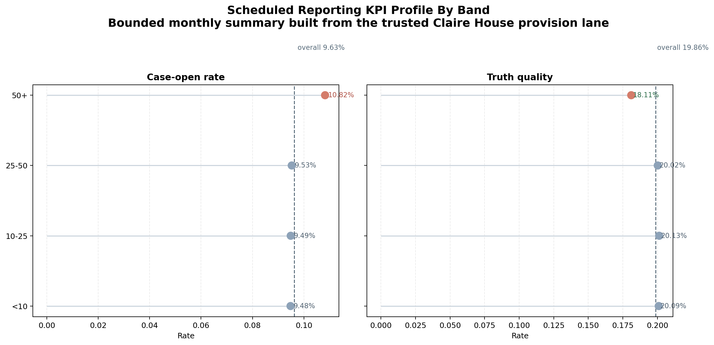
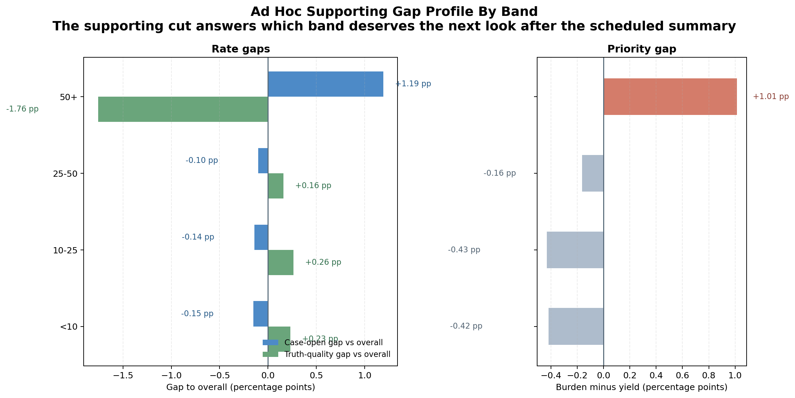

# Execution Report - Reporting, Dashboards, And Visualisation Slice

As of `2026-04-04`

Purpose:
- record what was actually executed for the Claire House `Data & Insight Analyst` slice around reports, dashboards, visualisations, and KPI-led insight outputs
- preserve the truth boundary between one bounded reporting-and-visualisation pack and any wider claim about a full organisational BI estate
- package the saved facts, scheduled and ad hoc reporting outputs, KPI definitions, release checks, and claim-ready evidence into one outward-facing report

Truth boundary:
- this execution was completed by building directly on the controlled Claire House `3.A` provision lane
- the slice did not rebuild a broad organisational reporting estate
- the slice did not claim live `Power BI`, `Business Objects`, or `Tableau` deployment
- the slice stayed limited to one bounded monthly reporting window:
  - `Mar 2026`
- the honest platform analogue here is:
  - one governed reporting base
  - one scheduled-style summary output
  - one ad hoc supporting detail cut
  - one shared KPI family used across both
- the slice therefore supports a truthful claim about producing reports, dashboards, and visualisation outputs from trusted data
- it does not support a claim that the full Claire House reporting and dashboard environment has already been implemented

---

## 1. Executive Answer

The slice asked:

`can one trusted analytical provision lane be turned into a usable organisational reporting and visualisation output without losing consistency, control, or interpretability?`

The bounded answer is:
- one reporting window was fixed:
  - `Mar 2026`
- one shared KPI family was fixed:
  - `4` KPI families
- one scheduled summary view was produced:
  - `1`
- one ad hoc supporting detail cut was produced from the same governed logic:
  - `1`
- the reporting pack stayed on one governed base inherited from Claire House `3.A`
- the summary view preserved the protected overall readings of:
  - `9.63%` case-open rate
  - `19.86%` truth quality
- the ad hoc supporting detail cut identified one clear attention band:
  - `50_plus`
- that supporting detail cut showed:
  - `+1.19 pp` case-open gap to overall
  - `-1.76 pp` truth-quality gap to overall
  - `+1.01 pp` burden-minus-yield gap
- the reporting pack passed `5/5` release checks
- regeneration takes about `0.19` seconds because the slice reuses a compact trusted provision base rather than reopening large raw analytical scope

That means this slice did not just create some charts. It turned a controlled provision lane into one bounded reporting-and-visualisation pack with a scheduled summary view, an ad hoc supporting cut, and stable KPI reuse across both.

## 2. Slice Summary

The slice executed was:

`one bounded organisational reporting pack with one dashboard-style summary page and one ad hoc supporting detail cut, built from the trusted provision lane`

This was chosen because it allowed a direct response to the Claire House requirement:
- provide scheduled reports
- provide ad hoc reports
- produce dashboards and visualisations
- track key performance indicators through visual reporting outputs

The main delivered outputs were:
- one reporting summary output
- one ad hoc supporting detail output
- one release-check output
- one reporting scope note
- one KPI definition note
- one summary reporting page
- one ad hoc supporting detail page
- one audience note
- one caveats note
- one regeneration README

## 3. How This Maps To The Slice Plan

The execution stayed aligned to the approved Claire House `3.B` slice rather than drifting into broad BI-estate ownership, board reporting, or a repeat of the trusted provision slice.

The delivered scope maps back to the planned lens responsibilities as follows:
- `02 - BI, Insight, and Reporting Analytics`: one scheduled summary output, one ad hoc supporting detail cut, one bounded reporting product structure
- `01 - Operational Performance Analytics`: one stable KPI family, one top attention band, and one supporting contrast between overall and band-level readings
- `09 - Analytical Delivery Operating Discipline`: stable KPI definitions, release checks, regeneration note, and caveat pack
- `08 - Stakeholder Translation, Communication, and Decision Influence`: light audience-usage guidance only, not a broad briefing or storytelling pack

The report therefore needs to be read as proof of one bounded reporting-and-visualisation pack from trusted data, not as proof that the whole Claire House reporting estate is already in place.

## 4. Execution Posture

The execution followed the intended KPI-first and reporting-first posture rather than figure-first packaging.

The working discipline was:
- confirm the inherited Claire House `3.A` trusted provision base first
- define the shared KPI family before packaging any reporting outputs
- keep all heavy work inside `DuckDB` or inherited compact outputs
- derive the scheduled summary and the ad hoc detail cut from the same governed logic base
- use Python only after the SQL layer had already reduced the slice to compact reporting-ready outputs

This matters for the truth of the slice because the Claire House responsibility here is about usable reporting and visualisation outputs, and the execution should reflect a controlled reporting-product build rather than ad hoc chart assembly.

## 5. Bounded Build That Was Actually Executed

### 5.1 Inherited reporting base confirmation

The first step was to confirm that the Claire House `3.A` provision lane could legitimately support one reporting-and-visualisation pack.

Observed inherited base facts:

| Measure | Value |
| --- | ---: |
| Source surfaces mapped in the trusted provision lane | 3 |
| Release-safe authority rules | 9 |
| Protected overall case-open rate | 9.63% |
| Protected overall truth quality | 19.86% |
| Claire House `3.A` release checks still green | 12/12 |

Meaning:
- the inherited base was already controlled strongly enough to support a reporting product
- the slice could therefore focus on KPI packaging, scheduled-plus-ad-hoc structure, and release safety rather than raw provision control

### 5.2 Shared KPI family

The reporting pack then fixed one small KPI family that could be reused consistently across summary and detail outputs.

Observed KPI family:

| KPI family | Use |
| --- | --- |
| flow volume | scheduled summary context |
| case-open rate | summary and supporting detail |
| truth quality | summary and supporting detail |
| burden-minus-yield gap | supporting detail priority logic |

Shared grouping dimension:
- `amount_band`
  - `<10`
  - `10-25`
  - `25-50`
  - `50+`

This matters because the Claire House requirement is not satisfied by “a report exists.” The slice needed a stable KPI family that could support both a scheduled view and a realistic ad hoc supporting cut.

### 5.3 Scheduled summary output

The scheduled output was intentionally kept compact.

Observed scheduled summary facts:

| Measure | Value |
| --- | ---: |
| Scheduled views delivered | 1 |
| Overall flow rows | 81,360,532 |
| Overall case-open rate | 9.63% |
| Overall truth quality | 19.86% |
| KPI families held consistently | 4 |

This proves that the pack supports a top-level organisational-style monthly reading from the trusted provision base.

### 5.4 Ad hoc supporting detail cut

The ad hoc output was not a second unrelated report. It was a supporting detail cut generated from the same governed logic as the scheduled summary.

Observed ad hoc supporting facts:

| Measure | Value |
| --- | ---: |
| Ad hoc supporting views delivered | 1 |
| Top attention band | `50_plus` |
| `50_plus` case-open gap to overall | +1.19 pp |
| `50_plus` truth-quality gap to overall | -1.76 pp |
| `50_plus` burden-minus-yield gap | +1.01 pp |

Meaning:
- the ad hoc supporting cut deepens the same KPI story as the summary page
- the pack therefore answers both:
  - the scheduled question:
    - what is the overall position?
  - and the ad hoc follow-up question:
    - which band deserves the next look?

### 5.5 Release and consistency checks

The pack then ran a compact release-check layer to prove that the reporting outputs remained controlled.

Observed release results:

| Check | Result |
| --- | ---: |
| protected summary contains overall row | pass |
| expected reporting bands available | pass |
| scheduled summary reuses governed overall rates | pass |
| ad hoc detail reuses same KPI logic | pass |
| inherited provision integrity pack remains green | pass |

Release verdict:
- `5/5` checks passed

This is enough for the slice because the requirement is not “prove a whole BI governance framework.” It is “produce reports, dashboards, and visualisations from trusted data in a controlled and reusable way.”

## 6. What Was Actually Added Beyond Claire House `3.A`

This Claire House slice was not meant to win by doing more trust work than `3.A`. It was meant to build the reporting layer that sits on top of that trust work.

What was inherited directly:
- trusted provision base
- protected overall readings
- source and authority control posture

What was added for Claire House `3.B`:
- one scheduled summary reporting view
- one ad hoc supporting detail cut
- one explicit `4`-KPI family reused across both
- one small release-check pack for the reporting layer
- one audience and caveat pack for the reporting product

That is the correct widening:
- not a fake BI-estate build
- not mere renaming of the trusted provision slice
- but a reporting-and-visualisation layer built directly on the controlled provision base

## 7. Assets Produced

The slice produced the assets that make the reporting pack credible.

Reporting assets:
- KPI-ready summary output
- ad hoc supporting detail output
- summary reporting page
- ad hoc supporting detail page

Control assets:
- release checks
- KPI definitions note
- audience note
- caveats note
- regeneration README

This is the key difference between this slice and a vague “built dashboards” claim:
- the output here is not just a couple of visuals
- it is one bounded reporting pack with explicit KPI reuse, explicit scheduled-plus-ad-hoc structure, and explicit release control

## 8. Figures

### 8.1 Scheduled KPI profile by band

This is the analytical summary plot for the scheduled reporting view.

Its job is to show:
- the band-level case-open profile against the protected overall baseline
- the band-level truth-quality profile against the protected overall baseline
- that the scheduled view is a real KPI-tracking product, not just a text summary

The useful reading is:
- the overall lane remains readable through a small stable KPI family
- `50+` is visibly above the overall case-open baseline and below the overall truth-quality baseline
- the same governed reporting base supports both headline and band-level interpretation

### 8.2 Ad hoc supporting gap profile

This is the analytical supporting plot for the ad hoc detail cut.

Its job is to show:
- the case-open gap to overall by band
- the truth-quality gap to overall by band
- the burden-minus-yield gap that determines which band deserves the next look

The useful reading is:
- the ad hoc cut is not a second unrelated page
- it deepens the same KPI story as the scheduled summary
- `50+` is highlighted because it is the top attention band in the executed supporting cut, not because highlighting is being used decoratively

## 9. What This Slice Supports Claiming

This slice supports truthful statements such as:
- produced reporting and visualisation outputs from a trusted provision base
- delivered one scheduled summary view and one ad hoc supporting detail cut from the same governed logic
- tracked KPI movement through a stable reporting pack rather than isolated charts
- kept the reporting layer controlled through release checks and regeneration notes

The slice does not support claiming that:
- a full organisational dashboard estate has already been implemented
- live enterprise BI tooling has already been deployed
- all Claire House reporting needs are already covered
- board, trustee, funder, or regulatory reporting ownership has already been proven by this slice

## 10. Candidate Resume Claim Surfaces

This section should be read as a direct response to the Claire House `3.B` responsibility, not as a generic “I can make dashboards” statement.

The requirement asks for someone who can:
- provide scheduled reports
- provide ad hoc reports
- produce dashboards and visualisations
- track `KPI` movement through reporting outputs

The claim therefore needs to answer back in evidence form:
- I built a bounded reporting pack from a trusted provision base
- I reused the same KPI family across summary and ad hoc outputs
- I produced reporting outputs that remained controlled and regenerable

### 10.1 Flagship `X by Y by Z` claim

> Produced scheduled and ad hoc reports, dashboards, and visualisation outputs from a trusted analytical provision lane, as measured by defining `4` KPI families consistently across `2` reporting views, generating `1` ad hoc supporting detail cut from the same governed logic, and regenerating the full pack with `5/5` release checks in `0.19` seconds, by turning a controlled provision base into a bounded organisational reporting product with explicit scheduled summary, supporting detail, and reuse controls.

### 10.2 Shorter recruiter-facing version

> Produced trusted scheduled and ad hoc reporting and visualisation outputs, as measured by stable KPI definitions, reusable scheduled and ad hoc views, and controlled regeneration from one governed base, by turning a bounded analytical lane into a usable reporting pack rather than a loose set of charts or extracts.

### 10.3 Closer direct-response version

> Produced scheduled and ad hoc reports, dashboards, and visualisations that tracked key performance indicators from a governed reporting base, as measured by one reusable reporting pack, one ad hoc supporting detail cut, and repeatable KPI logic, by defining the summary and visual structure, reusing controlled fields consistently, and packaging the outputs for organisational insight use.
