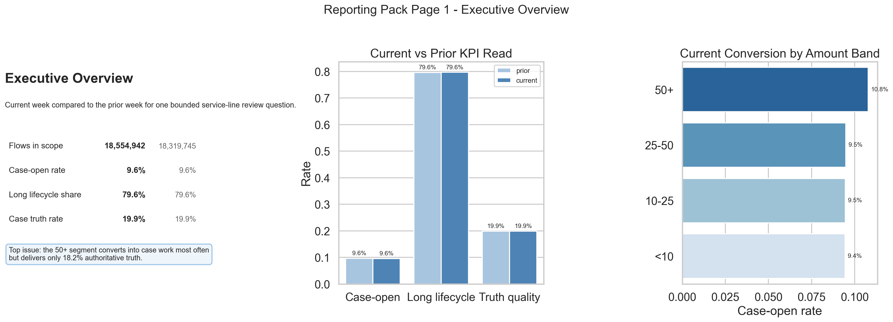
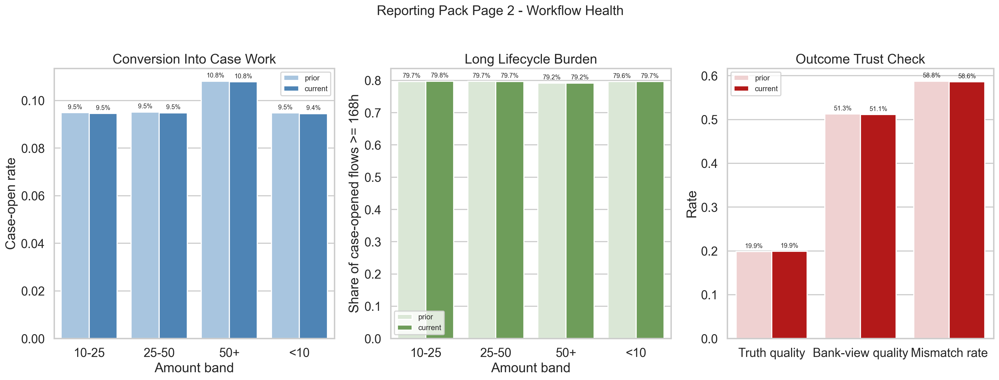
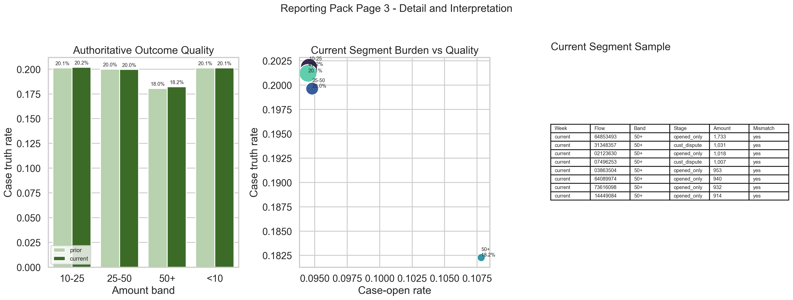

# Execution Report - Multi-Source Service Performance Slice

As of `2026-04-03`

Purpose:
- record what was actually executed for the HUC `Data Analyst` multi-source service-performance slice
- preserve the truth boundary between one bounded service-line review pack and any wider claim about a broader HUC reporting estate
- package the saved facts, trust checks, KPI layer, reporting pack, figures, and stakeholder notes into one outward-facing report

Truth boundary:
- this execution was completed against a bounded governed local slice derived from `runs/local_full_run-7`
- the service-line question was limited to a current-versus-prior weekly review of workflow pressure, conversion into case work, long-lifecycle burden, and outcome quality
- the slice combined `4` governed source families:
  - event truth
  - flow or context truth
  - case chronology
  - outcome or label truth
- the base analytical unit remained `flow_id`, with weekly and amount-band summaries derived from that base
- the slice therefore supports a truthful claim about bringing multiple operational datasets together for one trusted service-performance purpose and packaging the result into bounded reporting
- it does not support a claim that a broad HUC operational-reporting estate or commissioner-ready BI estate has already been implemented

---

## 1. Executive Answer

The slice asked:

`can four governed operational datasets be combined into one trusted service-line performance view that handles imperfect source data honestly and still supports operational and leadership reporting?`

The bounded answer is:
- `4` governed source families were integrated into one merged service-performance base with `36,874,687` bounded rows across the two-week review window
- the review compared current week `2026-03-23` to prior week `2026-03-16`
- current flow pressure increased slightly from `18,319,745` to `18,554,942`, while case-open conversion stayed broadly flat at `9.62%` versus `9.59%`
- long-lifecycle burden also stayed broadly flat at `79.61%` versus `79.64%`, and authoritative case-truth rate stayed broadly flat at `19.86%` versus `19.89%`
- the top-line view therefore looks stable, but the `50_plus` amount band remains the main structural issue because it has the highest current case-open rate at `10.78%` and the weakest authoritative truth rate at `18.23%`
- the main trust defect is semantic, not linkage failure:
  - event, truth, and bank surfaces link at `100%`
  - multi-case linkage defects are `0%`
  - but bank-view outcome logic disagrees with authoritative truth on `58.62%` of case-opened current-week flows
- the delivered output includes one KPI layer, one discrepancy layer, one three-page reporting pack, one executive brief, one action note, and one challenge-response note

That means this slice delivered a bounded multi-source service-performance pack rather than only a collection of source tables or a generic reporting summary.

## 2. Slice Summary

The slice executed was:

`one multi-source operational performance slice for a single service-line review pack`

This was chosen because it allowed a direct response to the HUC requirement:
- combine multiple operational datasets for one unified analytical purpose
- stay comfortable with imperfect source data by exposing trust checks and discrepancy notes explicitly
- measure service performance through a small, stable KPI family
- package the result into reporting that operational and leadership readers can actually use

The primary proof object was:
- `multi_source_service_performance_v1`

The main delivered outputs were:
- one merged service-performance base
- one compact KPI layer
- one compact discrepancy summary
- one compact three-page reporting pack
- one executive brief
- one operational action note
- one challenge-response note

## 3. How This Maps To The Slice Plan

The execution stayed aligned to the approved HUC requirement-A slice rather than drifting into a broader BI programme or a model-led slice.

The delivered scope maps back to the planned lens responsibilities as follows:
- `03 - Data Quality, Governance, and Trusted Information Stewardship`: source map, authoritative-source rules, join lineage, discrepancy log, and discrepancy summary
- `01 - Operational Performance Analytics`: merged service-performance base, shared KPI layer, current-versus-prior comparison, and one explicit operational problem statement
- `02 - BI, Insight, and Reporting Analytics`: one compact three-page reporting pack with executive, workflow-health, and drill-through pages
- `08 - Stakeholder Translation, Communication, and Decision Influence`: executive brief, action note, challenge-response note, and annotated page notes

The report therefore needs to be read as proof that multiple operational datasets were brought together for one service-line performance purpose, not as proof that every HUC reporting responsibility has already been executed.

## 4. Execution Posture

The execution followed the agreed `03 -> 01 -> 02 -> 08` order.

The working discipline was:
- define and test source meaning first
- build the merged base and KPI layer in SQL first
- keep the review window bounded to exactly two weeks
- materialise the heavy base once and keep it out of Git
- avoid broad Python loading of the full merged slice
- pull only compact summaries and bounded samples into Python for pack rendering

This matters for the truth of the slice because the requirement is partly about working confidently with imperfect operational data, not only about producing charts after the fact.

## 5. Bounded Build That Was Actually Executed

### 5.1 Source chain and linkage posture

The slice used the planned four-source chain:
- event truth
- flow or context truth
- case chronology
- authoritative outcome truth

The bank-view surface was also carried, but only as a comparison surface for discrepancy reading, not as KPI authority.

Observed linkage posture:

| Week | Flow Rows | Event Link Rate | Case Link Rate | Truth Link Rate | Bank Link Rate | Multi-Case Flow Rate |
| --- | ---: | ---: | ---: | ---: | ---: | ---: |
| Prior | 18,319,745 | 100.00% | 9.62% | 100.00% | 100.00% | 0.00% |
| Current | 18,554,942 | 100.00% | 9.59% | 100.00% | 100.00% | 0.00% |

Reading:
- the slice did not fail on basic linkage
- the real trust issue is not missingness or duplicate case attachment
- the real trust issue is disagreement between two outcome surfaces that mean different things

### 5.2 Output profile

The bounded execution produced these shaped outputs:

| Output | Rows |
| --- | ---: |
| `service_line_performance_base_v1` | 36,874,687 |
| `service_line_kpis_v1` | 2 |
| `service_line_segment_summary_v1` | 8 |
| `service_line_discrepancy_summary_v1` | 2 |

Reading:
- the heavy base exists to support trustworthy derived outputs rather than direct stakeholder consumption
- the KPI, segment, and discrepancy surfaces are intentionally compact and pack-ready

### 5.3 Current-versus-prior KPI profile

The agreed KPI family stayed small and stable:
- volume or pressure
- conversion into case work
- long-lifecycle burden
- outcome quality

Observed weekly KPI profile:

| Week | Entry Event Rows | Flow Rows | Case-Open Rate | Long-Lifecycle Share | Authoritative Truth Rate | Bank-View Case Rate | Truth-Bank Mismatch Rate | Avg Lifecycle Hours |
| --- | ---: | ---: | ---: | ---: | ---: | ---: | ---: | ---: |
| Prior | 36,639,490 | 18,319,745 | 9.62% | 79.61% | 19.86% | 51.27% | 58.76% | 647.51 |
| Current | 37,109,884 | 18,554,942 | 9.59% | 79.64% | 19.89% | 51.12% | 58.62% | 647.65 |

Top-line reading:
- pressure rose slightly
- conversion, burden, and authoritative outcome quality stayed nearly flat
- the service-line reading therefore does not support a “sharp deterioration” story
- it supports a “stable topline with a persistent structural burden issue” story

### 5.4 Segment-level issue actually identified

The agreed slice required one explicit operational problem rather than a neutral KPI wall.

Observed current-week amount-band reading:

| Amount Band | Flow Rows | Case-Open Rate | Authoritative Truth Rate | Bank-View Case Rate | Avg Lifecycle Hours |
| --- | ---: | ---: | ---: | ---: | ---: |
| `under_10` | 6,759,941 | 9.45% | 20.12% | 50.35% | 650.12 |
| `10_to_25` | 6,126,393 | 9.46% | 20.19% | 50.36% | 650.45 |
| `25_to_50` | 3,775,943 | 9.48% | 19.96% | 50.59% | 648.71 |
| `50_plus` | 1,892,665 | 10.78% | 18.23% | 56.63% | 630.11 |

Operational reading:
- `50_plus` is the clearest service-line problem segment
- it converts into case work more often than the rest of the line
- it produces the weakest authoritative truth yield
- it therefore appears to be creating disproportionate review burden rather than stronger downstream value

### 5.5 Stage-level detail

The drill-through page also needed one bounded pathway reading.

Observed current-week pathway-stage profile:

| Pathway Stage | Flow Rows | Authoritative Truth Rate |
| --- | ---: | ---: |
| `opened_only` | 1,303,764 | 0.27% |
| `chargeback_decision` | 262,251 | 96.57% |
| `customer_dispute` | 138,338 | 62.88% |
| `detection_event_attached` | 75,678 | 13.68% |

Operational reading:
- `opened_only` is by far the largest case-opened stage in the current week
- it has almost no authoritative truth yield
- the pack therefore supports a practical reading about low-value operational burden rather than only total case volume

## 6. Reporting Pack Actually Delivered

### 6.1 Page 1 - Executive overview

The executive page was designed to answer:
- what changed?
- is the current topline materially worse?
- what is the single issue leadership should know first?

Delivered components:
- headline KPI cards
- current-versus-prior comparison
- one weekly trend view
- one short issue summary

The page keeps the leadership reading compact:
- pressure is slightly up
- conversion and authoritative quality are broadly flat
- the main issue is not top-line collapse
- the main issue is persistent low-yield burden in the higher-amount segment

### 6.2 Page 2 - Workflow health

The workflow page was designed to answer:
- is conversion changing?
- is long-lifecycle burden worsening?
- what trust caveat affects operational reading?

Delivered components:
- conversion comparison
- long-lifecycle burden comparison
- discrepancy comparison between bank view and authoritative truth

The strongest operational reading on this page is:
- the workload is not materially cleaner than the prior week
- long-lifecycle burden remains near `80%`
- outcome-quality reading would be badly overstated if bank view were treated as authoritative

### 6.3 Page 3 - Drill-through detail

The drill-through page was designed to answer:
- which slice is driving the problem?
- what do the detail surfaces actually show?
- what should the reader conclude from the combined view?

Delivered components:
- amount-band comparison
- pathway-stage detail
- discrepancy note
- short interpretation note

This is what turns the pack into decision support rather than passive reporting:
- it identifies the `50_plus` band as the clearest structural burden problem
- it shows that the dominant stage is `opened_only`
- it keeps the trust caveat visible instead of hiding it under the visuals

## 7. Figures

The figure pack is part of execution for this slice, not an afterthought.

### 7.1 Executive overview

This page carries the leadership story:
- top-line metrics are mostly flat week over week
- pressure is slightly higher
- the real issue is a structural burden pattern, not a sudden KPI shock

### 7.2 Workflow health

This page carries the operations story:
- case-open conversion and long-lifecycle burden are visible together
- the trust caveat around bank-view versus authoritative truth is surfaced directly
- the page reads as workflow interpretation rather than a generic trend chart

### 7.3 Drill-through detail

This page carries the detail story:
- the amount-band problem is visible directly
- stage-level context is bounded and concrete
- the pack remains readable without abandoning the trust caveat

## 8. Audience and Trust Packs Produced

The slice produced the additional material needed to make the reporting pack travel safely.

Trust and source-governance notes:
- source map
- authoritative-source rules note
- join-lineage note
- discrepancy log

Reporting and explanation notes:
- KPI definitions note
- page notes
- executive brief
- action note
- challenge-response note

This is the key difference between this slice and a raw reporting extract:
- the pack carries source meaning, discrepancy boundaries, and action framing alongside the visuals

## 9. What This Slice Supports Claiming

This slice supports truthful statements such as:
- integrated multiple operational datasets into one trusted service-performance slice
- worked through imperfect source data by exposing discrepancy checks and source-authority rules explicitly
- defined a stable KPI family for one bounded operational question rather than a broad reporting estate
- turned the combined view into executive, workflow, and drill-through reporting plus action-oriented briefing notes

The slice does not support claiming that:
- a broad HUC reporting estate is already complete
- the bounded current-versus-prior pack covers every service line or stakeholder group
- bank-view outcome logic is safe to use as KPI authority
- the identified burden pattern has already been operationally remediated

## 10. Candidate Resume Claim Surfaces

This section should be read as a direct response to the HUC requirement, not as a generic “built a report” statement.

The requirement asks for someone who can:
- analyse data from multiple operational sources
- bring those sources together for a unified analytical purpose
- stay comfortable with imperfect source data
- use the combined view to measure service performance and support decisions

The claim therefore needs to answer back in evidence form:
- I have brought multiple operational datasets together for one service-performance purpose
- I have handled imperfect source data through reconciliation, discrepancy logging, and source-authority rules
- I have turned the combined view into operational and leadership reporting rather than leaving it as technical analysis

### 10.1 Flagship `X by Y by Z` claim

> Improved service-line performance visibility and decision support, as measured by successful integration of `4` operational source families into one governed performance slice, zero multi-case linkage defects across `36.9M` bounded merged rows, and consistent reuse of `4` KPI families across a three-page reporting pack and stakeholder briefing notes, by combining event, flow, case, and outcome data into a unified current-versus-prior service-line review, validating discrepancy and source-authority rules, and translating the results into executive, workflow, and drill-through reporting outputs.

### 10.2 Shorter recruiter-facing version

> Integrated multiple operational data sources into one trusted service-performance slice, as measured by validated source consistency, reusable KPI logic, and delivery of executive and operational reporting outputs, by combining, checking, and interpreting governed workflow and outcome data for decision support.

### 10.3 Closer direct-response version

> Brought multiple operational datasets together for a unified service-performance purpose, as measured by reconciled multi-source views, stable KPI definitions, and reporting outputs used to track trends and support decisions, by combining imperfect source data, checking consistency, and packaging the results into operational and leadership reporting.
