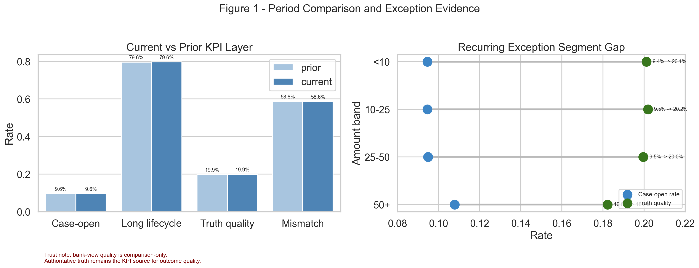
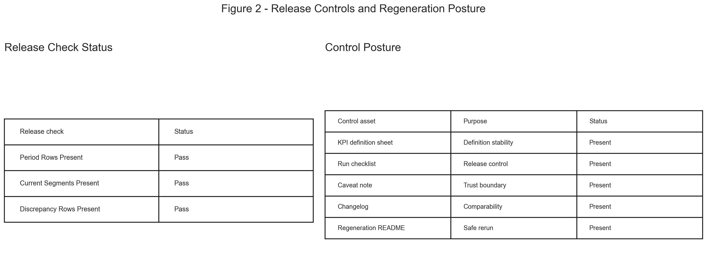

# Execution Report - Reporting Cycle Ownership Slice

As of `2026-04-03`

Purpose:
- record what was actually executed for the HUC `Data Analyst` reporting-cycle-ownership slice
- preserve the truth boundary between one bounded recurring service-line reporting cycle and any wider claim about a broader HUC reporting estate
- package the saved facts, reporting-pack structure, KPI-definition controls, rerun checklist, changelog, caveats, and stakeholder notes into one outward-facing report

Truth boundary:
- this execution was completed against compact governed outputs already produced in HUC slice `01_multi_source_service_performance`
- the slice did not rebuild or reload the full merged service-line base into memory
- the reporting lane was limited to one weekly current-versus-prior service-line analogue with `4` stable KPI families, `2` audience groups, and `3` recurring pages
- the slice therefore supports a truthful claim about owning one bounded recurring reporting cycle with stable definitions, rerun discipline, and stakeholder-ready outputs
- it does not support a claim that a broad HUC reporting estate, commissioner-wide reporting programme, or full BI platform rollout has already been implemented

---

## 1. Executive Answer

The slice asked:

`can one bounded service-line reporting pack be turned from a one-off analytical output into an owned recurring reporting cycle with stable KPI meaning, repeatable rerun logic, and clear release controls?`

The bounded answer is:
- one weekly reporting cadence was fixed for the slice
- one core audience pair was fixed:
  - operations
  - leadership
- one stable KPI family of `4` headline metrics was pinned across the pack:
- one stable KPI family of `4` headline metrics was pinned across the cycle:
  - flow pressure
  - case-open conversion
  - long-lifecycle burden
  - authoritative outcome quality
- one recurring two-figure evidence set was delivered to show operational period comparison and release-control posture
- one requirements note, one process map, one stakeholder view matrix, one KPI purpose note, one KPI definition sheet, one run checklist, one caveat note, one changelog, and one regeneration README were all produced for the same cycle
- the cycle passes `3` out of `3` release checks and can be regenerated from compact governed inputs in about `2.14` seconds
- the current-cycle topline remains stable, while the recurring exception remains the `50_plus` amount band with `10.78%` case-open rate and `18.23%` authoritative truth quality

That means this slice delivered one owned recurring reporting cycle rather than only another service-line pack.

## 2. Slice Summary

The slice executed was:

`one recurring service-line performance reporting cycle for a single governed reporting pack`

This was chosen because it allowed a direct response to the HUC requirement:
- own the reporting deliverable itself rather than only contribute analysis
- support target-driven performance tracking through stable period-comparison logic
- keep the pack usable for operations and leadership
- make the output rerunnable and controlled rather than dependent on hidden analyst steps

The primary proof object was:
- `reporting_cycle_ownership_v1`

The main delivered outputs were:
- one reporting-requirements layer
- one KPI-definition and purpose layer
- one recurring two-figure reporting evidence set
- one `what changed` note
- one intervention note
- one run checklist
- one changelog
- one caveat note
- one regeneration README

## 3. How This Maps To The Slice Plan

The execution stayed aligned to the approved HUC `3B + 3C` slice rather than drifting back into another multi-source integration proof.

The delivered scope maps back to the planned lens responsibilities as follows:
- `05 - Business Analysis, Change, and Decision Support`: reporting requirements note, process map, stakeholder view matrix, and KPI purpose notes
- `01 - Operational Performance Analytics`: stable KPI family, current-versus-prior interpretation layer, `what changed` note, and intervention note
- `02 - BI, Insight, and Reporting Analytics`: one recurring two-figure evidence set covering period comparison and release-control posture
- `09 - Analytical Delivery Operating Discipline`: KPI definition sheet, run checklist, caveats note, changelog, regeneration README, and release checks

The report therefore needs to be read as proof that one reporting lane was defined, owned, and made repeatable, not as proof that every HUC reporting requirement has already been industrialised.

## 4. Execution Posture

The execution followed the agreed `05 -> 01 -> 02 -> 09` order.

The working discipline was:
- define the reporting need before changing the pack
- reuse the bounded KPI and exception outputs from HUC slice `01` instead of rebuilding the underlying service-line integration
- build the recurring-pack and rerun-control assets from compact extracts only
- keep the reporting lane bounded to one weekly cycle
- treat release checks and regeneration path as first-class outputs rather than afterthoughts

This matters for the truth of the slice because the requirement is about reporting ownership and timeliness discipline, not just about producing another set of figures.

## 5. Bounded Build That Was Actually Executed

### 5.1 Requirement and audience layer

The slice first fixed the reporting lane and audience structure explicitly.

Delivered requirement-and-audience artefacts:
- reporting requirements note
- process map
- stakeholder view matrix
- KPI purpose notes

The lane was fixed as:
- one weekly current-versus-prior service-line performance pack
- one audience pair:
  - operations
  - leadership

This is the main distinction from HUC slice `01`:
- slice `01` proved that one trusted service-line pack could be built
- this slice proved that the reporting lane itself could be defined, owned, and rerun safely

### 5.2 Stable KPI-definition layer

The cycle fixed the same `4` headline KPI families across the pack:
- `flow_rows`
- `case_open_rate`
- `long_lifecycle_share`
- `case_truth_rate`

It also carried one supporting trust KPI:
- `truth_bank_mismatch_rate`

That KPI set remained stable across:
- the cycle-scope figure
- the period-comparison figure
- the release-control figure
- the requirement and control notes

This matters because the responsibility being answered is not only “can you report performance?” but also “can you own stable reporting logic across cycles?”

### 5.3 Reporting-cycle summary

Observed cycle summary from the bounded current week:

| Measure | Value |
| --- | ---: |
| Reporting cadence | `weekly` |
| Audience groups | `2` |
| KPI families | `4` |
| Reporting pages | `3` |
| Current-week flow rows | 18,554,942 |
| Prior-week flow rows | 18,319,745 |
| Current case-open rate | 9.59% |
| Current long-lifecycle share | 79.64% |
| Current authoritative truth rate | 19.89% |
| Current truth-bank mismatch rate | 58.62% |

Reading:
- the cycle is built around a bounded but real operating volume
- the same service-line issue from slice `01` remains present and therefore gives the cycle something real to carry forward from week to week
- the trust caveat remains part of the reporting cycle rather than being left behind in one earlier analytical report

### 5.4 Current recurring exception

The cycle needed one stable exception reading rather than only a neutral reporting template.

Observed current exception:

| Segment | Case-Open Rate | Authoritative Truth Rate |
| --- | ---: | ---: |
| `50_plus` | 10.78% | 18.23% |

Operational reading:
- this segment remains the clearest weekly exception
- it opens into case work more aggressively than the rest of the line
- it returns weaker authoritative value than lower bands
- it is therefore a suitable recurring exception note for the owned pack

### 5.5 Release and rerun posture

Observed cycle-control facts:

| Control Measure | Value |
| --- | ---: |
| Release checks passed | 3 / 3 |
| Regeneration time | 2.14 seconds |
| Hidden dependency on full base reload | No |

Reading:
- the pack is not just documented; it is actually rerunnable from compact governed inputs
- the cycle control is strong enough for a bounded proof of reporting ownership

## 6. Evidence Figures Actually Delivered

### 6.1 Figure 1 - Period comparison and exception evidence

The first figure was designed to answer:
- what does the current-versus-prior movement actually look like?
- what recurring exception deserves operational attention?
- where does the trust caveat still matter?

Delivered components:
- current-versus-prior KPI comparison
- exception-segment gap view
- on-figure trust note stating that bank-view quality is comparison-only

The strongest operational reading from this figure is:
- the weekly cycle should keep surfacing the `50+` segment as the main operational exception
- the trust caveat is still necessary when talking about outcome quality

### 6.2 Figure 2 - Release controls and regeneration posture

The second figure was designed to answer:
- does the cycle have real release discipline?
- how fast can the bounded pack be regenerated?
- what control assets make the cycle ownable?

Delivered components:
- release-check status
- regeneration posture
- stable-control summary

This is what turns the slice into reporting ownership rather than another service-line pack:
- the control posture is visible directly in the evidence set
- regeneration is explicit
- the slice reads as cycle stewardship, not dashboard repetition

## 7. Figures

The figure pack is part of execution for this slice, not an afterthought.

### 7.1 Period comparison and exception evidence

This figure carries the operational story:
- current-versus-prior KPI comparison remains stable and readable
- the exception segment gap is made explicit rather than buried in a dense table
- the trust caveat remains attached to the figure

### 7.2 Release controls and regeneration posture

This figure carries the control story:
- release checks are visible
- regeneration posture is explicit
- the cycle reads as controlled and repeatable without forcing weak pseudo-quantitative charts

## 8. Reporting-Cycle Control Assets Produced

The slice produced the control material that makes the reporting cycle ownable.

Requirements and structure:
- reporting requirements note
- process map
- stakeholder view matrix
- KPI purpose notes

KPI and pack controls:
- KPI definition sheet
- figure notes
- `what changed` note
- intervention note

Cycle controls:
- run checklist
- caveats note
- changelog
- regeneration README

This is the key difference between this slice and HUC slice `01`:
- the output here is not just the pack
- it is the pack plus the rerun, release, definition, and handover discipline around it

## 9. What This Slice Supports Claiming

This slice supports truthful statements such as:
- owned one recurring service-line reporting cycle rather than only producing one analytical pack
- stabilised a bounded KPI family across executive and operational reporting views
- documented the rerun, release, caveat, and change-control posture needed to keep the cycle usable
- translated one stable service-line question into a repeatable reporting product for operations and leadership

The slice does not support claiming that:
- a broad HUC reporting estate has already been standardized
- every service-line reporting cycle has already been operationalised
- the bounded weekly pack is already a commissioner-wide external reporting process
- the recurring exception has already been operationally resolved

## 10. Candidate Resume Claim Surfaces

This section should be read as a direct response to the HUC `3B + 3C` responsibility, not as a generic “built a report” statement.

The requirement asks for someone who can:
- own reporting deliverables for a service line
- support local and national performance-style requirements
- keep reporting usable, repeatable, and on time
- translate requirements into reporting outputs that different audiences can use

The claim therefore needs to answer back in evidence form:
- I have taken ownership of a bounded recurring reporting lane rather than only producing one pack once
- I have pinned stable KPI and pack logic rather than redefining the reporting every cycle
- I have documented rerun and release controls so the reporting cycle is actually ownable and supportable on time

### 10.1 Flagship `X by Y by Z` claim

> Owned a recurring service-line performance reporting cycle, as measured by stable reuse of `4` KPI families across `3` reporting views for operations and leadership, completion of `3/3` release checks for the weekly pack, and regeneration of the full output from controlled compact inputs in `2.14` seconds, by translating stakeholder reporting requirements into a bounded KPI framework, packaging the current-versus-prior service-line view into a structured recurring pack, and documenting the run logic, caveats, and release controls needed to keep the cycle stable, repeatable, and usable.

### 10.2 Shorter recruiter-facing version

> Owned service-line performance reporting, as measured by repeatable pack regeneration, stable KPI definitions, and consistent executive and operational views across cycles, by translating stakeholder requirements into governed KPI logic, structured reporting outputs, and documented run controls.

### 10.3 Closer direct-response version

> Took ownership of recurring performance reporting in a target-driven environment, as measured by reusable KPI logic, controlled weekly pack regeneration, and clear executive and operational tracking across periods, by defining the reporting requirements, building the governed KPI layer, packaging the outputs into service-line reports, and maintaining the checklist, caveat, and change-control notes needed to keep the cycle stable, on time, and usable.
