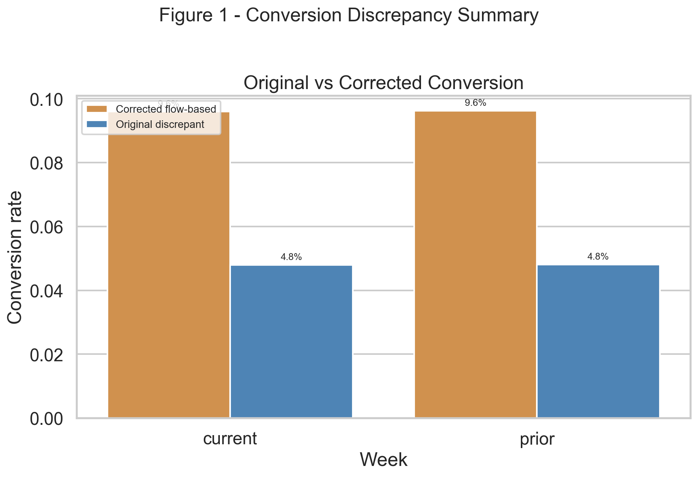
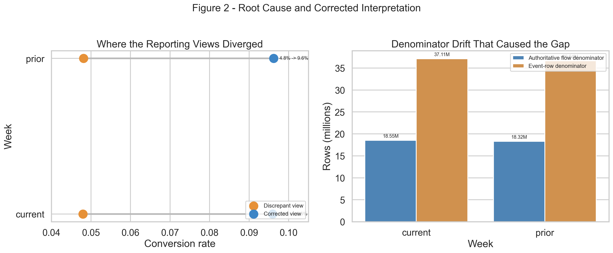

# Execution Report - Conversion Discrepancy Handling Slice

As of `2026-04-03`

Purpose:
- record what was actually executed for the HUC `Data Analyst` anomaly-detection and discrepancy-handling slice
- preserve the truth boundary between one bounded KPI anomaly-to-resolution cycle and any wider claim about a broader HUC data-quality programme
- package the saved facts, issue log, operational-impact note, release checks, and cleaned evidence figures into one outward-facing report

Truth boundary:
- this execution was completed against compact weekly KPI outputs already produced in HUC slice `01_multi_source_service_performance`
- the slice did not reload the full merged service-line base into memory
- the anomaly scope was limited to one KPI only: suspicious-to-case conversion
- the compared reporting views were both bounded weekly interpretations of the same service-line lane
- the slice therefore supports a truthful claim about spotting, investigating, correcting, and controlling one material reporting discrepancy
- it does not support a claim that a broad anomaly-monitoring estate or full HUC data-quality programme has already been industrialised

---

## 1. Executive Answer

The slice asked:

`can one weekly suspicious-to-case conversion anomaly be traced from detection to root cause, corrected in reporting logic, and controlled so the same issue does not slip through the next reporting cycle?`

The bounded answer is:
- one real discrepancy was identified across two linked weekly reporting interpretations of suspicious-to-case conversion
- the corrected flow-based current-week conversion is `9.59%`
- the discrepant event-normalized current-week conversion is `4.80%`
- the current absolute gap is therefore `4.80` percentage points
- the same discrepancy pattern was also present in the prior week:
  - corrected conversion `9.62%`
  - discrepant conversion `4.81%`
  - absolute gap `4.81` percentage points
- the current weekly lane contains `1,780,031` case-opened rows, so the discrepancy is not trivial
- the root cause was denominator drift from `flow_rows` to `entry_event_rows`
- the release-control pack now passes `3/3` checks and regenerates from compact governed inputs in `2.24` seconds

That means this slice delivered a real anomaly-to-resolution cycle rather than only a quality note or a generic exception chart.

## 2. Slice Summary

The slice executed was:

`one anomaly-to-resolution cycle on a single recurring service-line KPI pack`

This was chosen because it allowed a direct response to the HUC requirement:
- notice when something in operational reporting looks wrong
- investigate why linked views do not align
- resolve the discrepancy before it damages reporting quality or decision-making
- make the same issue easier to catch next cycle

The primary proof object was:
- `conversion_discrepancy_handling_v1`

The main delivered outputs were:
- one source map
- one source-rules note
- one lineage note
- one issue log
- one operational-impact note
- one intervention note
- one KPI definition note
- one compact exception pack
- one rerun checklist
- one caveat note
- one changelog

## 3. How This Maps To The Slice Plan

The execution stayed aligned to the approved HUC `3D` slice rather than drifting into a broad data-quality or dashboarding programme.

The delivered scope maps back to the planned lens responsibilities as follows:
- `03 - Data Quality, Governance, and Trusted Information Stewardship`: discrepancy source map, source rules, lineage note, issue log, and corrected KPI authority rule
- `01 - Operational Performance Analytics`: before-and-after KPI comparison, operational-impact note, and intervention note
- `02 - BI, Insight, and Reporting Analytics`: one compact two-figure exception pack that shows the discrepancy and the root-cause correction
- `09 - Analytical Delivery Operating Discipline`: anomaly-check README, report-run checklist, caveat note, changelog, and release checks

The report therefore needs to be read as proof that one reporting anomaly was handled end to end, not as proof that every operational discrepancy is already monitored automatically.

## 4. Execution Posture

The execution followed the agreed `03 -> 01 -> 02 -> 09` order.

The working discipline was:
- detect and quantify the discrepancy first
- trace source meaning and denominator logic before discussing operational interpretation
- reuse compact weekly KPI outputs instead of broad data reloads
- package the correction into a small, direct evidence set
- treat the rerun and release checks as part of the fix rather than a later add-on

This matters for the truth of the slice because the requirement is about anomaly detection and discrepancy handling in real reporting, not just about writing a post-hoc explanation.

## 5. Bounded Build That Was Actually Executed

### 5.1 Compared reporting views

The compared weekly reporting views were:
- one corrected flow-based suspicious-to-case conversion view
- one linked reporting interpretation that reused the same case-open numerator against `entry_event_rows`

The intended authoritative conversion rule is:
- numerator: case-opened flows
- denominator: total flows in the reporting window

The control problem was:
- the numerator remained correct
- the denominator drifted from `flow_rows` to `entry_event_rows`

### 5.2 Discrepancy profile actually observed

Observed discrepancy profile:

| Week | Corrected Flow-Based Conversion | Discrepant Conversion | Absolute Gap |
| --- | ---: | ---: | ---: |
| Current | 9.59% | 4.80% | 4.80 pp |
| Prior | 9.62% | 4.81% | 4.81 pp |

Reading:
- the discrepancy is large enough to materially change the weekly narrative
- the issue is stable across both bounded weeks rather than a one-off rendering glitch

### 5.3 Operational impact actually established

Observed operational impact:
- current weekly conversion would have been read as `4.80%` instead of `9.59%`
- the discrepant interpretation would have suggested false deterioration
- it would have made the weekly pressure look less productive than it actually was
- it could have misdirected attention toward a conversion-collapse story that was mostly denominator logic

Corrected reading:
- weekly conversion stayed broadly stable
- the real problem was reporting control failure, not sudden workflow collapse

### 5.4 Control and rerun posture

Observed control facts:

| Control Measure | Value |
| --- | ---: |
| Current case-opened rows in scope | 1,780,031 |
| Release checks passed | 3 / 3 |
| Regeneration time | 2.24 seconds |
| Hidden dependency on full base reload | No |

Reading:
- the discrepancy is attached to a real operating volume
- the fix is not only documented; it is controlled and rerunnable from compact governed inputs

## 6. Evidence Figures Actually Delivered

### 6.1 Figure 1 - Conversion discrepancy summary

The first figure was designed to answer:
- how large is the discrepancy?
- what is the corrected KPI versus the original discrepant reading?
- is the difference operationally material?

Delivered components:
- corrected versus discrepant conversion comparison
- current and prior week side-by-side

The figure makes the core point immediately:
- the discrepant interpretation halves the apparent conversion rate
- the discrepancy is large enough that it would distort weekly performance reading

### 6.2 Figure 2 - Root cause and corrected interpretation

The second figure was designed to answer:
- where did the two reporting views diverge?
- what denominator drift created the gap?
- why is the corrected reading defensible?

Delivered components:
- direct visual divergence between the two conversion views
- denominator comparison between `flow_rows` and `entry_event_rows`

This is what turns the slice into discrepancy handling rather than only discrepancy display:
- the figure shows the problem and the mechanism at the same time
- it keeps the root cause analytical rather than rhetorical

## 7. Figures

The figure pack is part of execution for this slice, not an afterthought.

### 7.1 Conversion discrepancy summary

This figure carries the discrepancy story:
- corrected and discrepant weekly readings are directly comparable
- the size of the gap is visible without needing a separate summary box

### 7.2 Root cause and corrected interpretation

This figure carries the causal story:
- the reporting views are visibly separated
- the denominator drift that caused that separation is made concrete

## 8. Control Assets Produced

The slice produced the operating material that makes the discrepancy easier to catch next cycle.

Trust and discrepancy notes:
- discrepancy source map
- source-rules note
- lineage note
- issue log

Operational interpretation notes:
- operational-impact note
- intervention note
- KPI definition note
- drill-through note

Cycle-control notes:
- anomaly-check README
- report-run checklist
- caveat note
- changelog

This is the key difference between this slice and a one-off anomaly comment:
- the discrepancy is not only explained
- it is now attached to reusable control assets

## 9. What This Slice Supports Claiming

This slice supports truthful statements such as:
- spotted when linked operational reporting views did not align
- investigated and quantified a material KPI discrepancy rather than accepting the first reported number
- traced the issue to denominator drift between `flow_rows` and `entry_event_rows`
- corrected the KPI authority rule and embedded repeatable release checks into the reporting workflow

The slice does not support claiming that:
- all reporting discrepancies have already been eliminated
- the full HUC reporting estate is now continuously anomaly-monitored
- every future source-definition change will be caught without review

## 10. Candidate Resume Claim Surfaces

This section should be read as a direct response to the HUC `3D` responsibility, not as a generic “improved reporting quality” statement.

The requirement asks for someone who can:
- spot anomalies in reporting outputs
- investigate why linked views do not align
- help resolve discrepancies before they damage reporting quality or decisions
- make the reporting workflow safer next cycle

The strongest bounded claim surfaces from this slice are therefore:

Flagship version:

> Strengthened anomaly detection and discrepancy handling in operational reporting, as measured by identifying and correcting a `4.80` percentage point suspicious-to-case conversion gap between linked weekly reporting views, validating the corrected KPI over `1,780,031` current case-opened rows, and embedding `3` repeatable release checks into the rerun workflow, by tracing the mismatch to denominator drift from `flow_rows` to `entry_event_rows`, restoring the flow-based KPI authority rule, and packaging the correction into controlled exception and root-cause evidence outputs.

Shorter recruiter-readable version:

> Improved reporting accuracy and discrepancy handling, as measured by corrected KPI outputs and repeatable release checks around a material weekly conversion mismatch, by investigating unexpected reporting divergence, tracing it to denominator logic drift, and embedding the fix into the recurring workflow.

Closest direct response version:

> Strengthened anomaly detection and discrepancy handling in weekly operational reporting, as measured by validated source consistency, corrected suspicious-to-case conversion output, and introduction of repeatable quality checks, by spotting when linked reporting views did not align, investigating the cause, resolving the issue, and preventing it from undermining reporting quality or decision-making.

## 11. Bottom Line

This slice is complete as a bounded HUC `3D` proof.

It demonstrates:
- anomaly detection
- discrepancy quantification
- root-cause tracing
- operational impact interpretation
- repeatable reporting control

It does so without overstating the scope beyond one bounded KPI anomaly in one recurring service-line lane.
