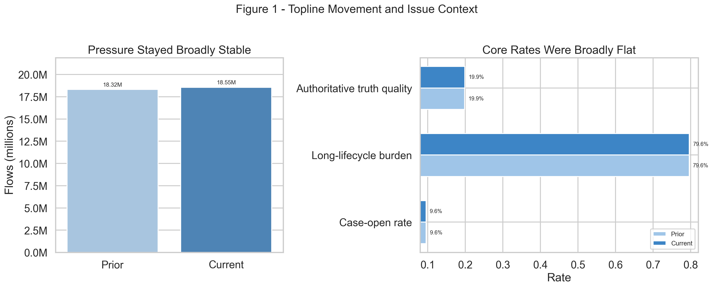
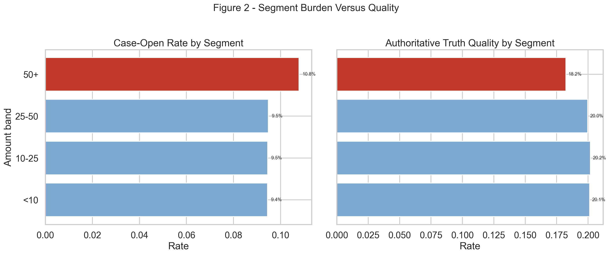

# Execution Report - Issue-To-Action Briefing Slice

As of `2026-04-03`

Purpose:
- record what was actually executed for the HUC `Data Analyst` stakeholder-communication and decision-support slice
- preserve the truth boundary between one bounded issue-to-action briefing and any wider claim about a broader HUC communication, dashboard, or board-pack programme
- package the saved facts, briefing notes, action notes, and complementary evidence figures into one outward-facing report

Truth boundary:
- this execution was completed against compact governed outputs already produced in the earlier HUC slices
- the slice did not reload the full merged service-line base into memory
- the scope was limited to one bounded weekly service-line issue only
- the selected issue was not broad deterioration; it was a concentrated burden-versus-quality issue in one segment
- the slice therefore supports a truthful claim about translating one real operational issue into plain-language action for operations and leadership
- it does not support a claim that a broad HUC communications estate, full dashboard suite, or strategic reporting programme has already been industrialised

---

## 1. Executive Answer

The slice asked:

`can one real service-line issue be explained clearly enough that leadership and operations understand what changed, why it matters, and what should happen next?`

The bounded answer is:
- the current week is broadly stable at top line rather than materially deteriorating
- pressure increased only slightly from `18.32M` to `18.55M` flows
- case-open conversion stayed broadly flat at `9.62%` versus `9.59%`
- long-lifecycle burden stayed broadly flat at `79.61%` versus `79.64%`
- authoritative truth quality stayed broadly flat at `19.86%` versus `19.89%`
- the real issue is concentrated in the `50_plus` segment rather than spread across the whole lane
- that segment still has the highest case-open rate at `10.78%`
- it also has the weakest authoritative truth quality at `18.23%`
- the selected recommendation is therefore:
  - review `50_plus` queue case-opening or escalation rules before broad lane-wide intervention
- the compact issue briefing regenerates from governed inputs in `2.52` seconds

That means this slice delivered a real analysis-to-action briefing rather than only a neutral KPI summary or a decorative reporting pack.

## 2. Slice Summary

The slice executed was:

`one what-changed and what-to-do-next service-line performance briefing for a single operational issue`

This was chosen because it allowed a direct response to the HUC requirement:
- communicate analytical findings in plain language
- tailor that communication to different audiences
- explain why the issue matters operationally
- connect the issue to a real follow-up recommendation rather than passive observation

The primary proof object was:
- `issue_to_action_briefing_v1`

The main delivered outputs were:
- one decision-question note
- one process map
- one KPI-purpose note
- one stakeholder-view matrix
- one `what changed` note
- one `why it matters` note
- one KPI definition sheet
- one compact two-figure briefing pack
- one executive brief
- one operational action note
- one challenge-response note

## 3. How This Maps To The Slice Plan

The execution stayed aligned to the approved HUC `3E + 3F` slice rather than drifting into a broader dashboard, reporting-ownership, or generic storytelling exercise.

The delivered scope maps back to the planned lens responsibilities as follows:
- `05 - Business Analysis, Change, and Decision Support`: decision-question note, process map, KPI-purpose note, and stakeholder-view matrix
- `01 - Operational Performance Analytics`: bounded KPI comparison, issue selection, `what changed` note, and `why it matters` note
- `02 - BI, Insight, and Reporting Analytics`: one compact two-figure issue briefing pack and one KPI definition sheet
- `08 - Stakeholder Translation, Communication, and Decision Influence`: executive brief, operational action note, and challenge-response note

The report therefore needs to be read as proof that one bounded issue was interpreted and translated into action, not as proof that every HUC audience or strategic forum is already covered.

## 4. Execution Posture

The execution followed the agreed `05 -> 01 -> 02 -> 08` order.

The working discipline was:
- define the decision need first
- choose the issue from the real bounded HUC evidence rather than from a preferred narrative
- keep the KPI set small enough to support one decision question
- use visual-first complementary figures rather than pseudo-dashboard pages
- keep the recommendation explicit and tied to the evidence

This matters for the truth of the slice because the requirement is not just to present charts. It is to make analytical work understandable and useful to non-technical decision-makers.

## 5. Bounded Build That Was Actually Executed

### 5.1 Decision question actually used

The decision question used in execution was:

`is the current service-line issue broad deterioration, or is one segment consuming disproportionate case effort without commensurate authoritative value, and where should attention go first?`

The bounded answer was:
- the top line is broadly stable
- the issue is concentrated rather than systemic
- the `50_plus` segment is the first place attention should go

### 5.2 KPI movement actually established

Observed top-line movement:

| KPI | Prior | Current | Reading |
| --- | ---: | ---: | --- |
| Pressure flows | 18.32M | 18.55M | Slight increase |
| Case-open rate | 9.62% | 9.59% | Broadly flat |
| Long-lifecycle burden | 79.61% | 79.64% | Broadly flat |
| Authoritative truth quality | 19.86% | 19.89% | Broadly flat |

Reading:
- the data does not support a broad service-line deterioration story
- a generic “everything is getting worse” narrative would have overstated the evidence

### 5.3 Issue concentration actually established

Observed segment issue:

| Segment | Case-Open Rate | Authoritative Truth Quality | Reading |
| --- | ---: | ---: | --- |
| `50_plus` | 10.78% | 18.23% | Highest burden, weakest quality |
| `25_to_50` | 9.48% | 19.96% | Lower burden, better quality |
| `10_to_25` | 9.46% | 20.19% | Lower burden, better quality |
| `under_10` | 9.45% | 20.12% | Lower burden, better quality |

Reading:
- the `50_plus` segment still opens to case work more aggressively than the other bounded segments
- it returns weaker authoritative truth quality than the other segments
- this makes it the clearest recurring burden pocket in the bounded lane

### 5.4 Recommendation actually produced

The explicit recommendation produced by the slice was:
- review `50_plus` queue case-opening or escalation rules before broad lane-wide intervention

Why that recommendation is the truthful one:
- the issue is concentrated
- the top line is stable
- a targeted queue review is better supported by the bounded evidence than a broad service response

## 6. Evidence Figures Actually Delivered

### 6.1 Figure 1 - Topline movement and issue context

The first figure was designed to answer:
- is the lane broadly stable or broadly deteriorating?
- are the main current-versus-prior KPI movements large enough to support a general escalation story?

Delivered components:
- one pressure comparison panel
- one rate-movement-from-prior panel

The figure makes the main communication point immediately:
- top-line pressure moved only slightly
- the core operating-rate deltas are minimal
- the reader should not leave with a false broad-deterioration story

### 6.2 Figure 2 - Segment burden versus quality

The second figure was designed to answer:
- where does the issue actually sit?
- which segment deserves attention first?
- what is the burden-versus-quality trade-off in that segment?

Delivered components:
- one segment comparison for case-open rate
- one segment comparison for authoritative truth quality

This is what turns the slice into issue-to-action communication rather than only issue description:
- the figure shows why the `50_plus` segment should be the first operational focus
- it keeps that judgment explicitly bounded to the current weekly slice
- it lets the recommendation come from the evidence rather than from extra prose

## 7. Figures

The figure pack is part of execution for this slice, not an afterthought.

### 7.1 Topline movement and issue context

This figure carries the framing story:
- the lane is broadly stable at top line
- the rate panel is shown as change from prior rather than mixed KPI magnitudes
- the briefing should therefore avoid a false broad-deterioration narrative

### 7.2 Segment burden versus quality

This figure carries the action story:
- the `50_plus` segment has the highest case-opening burden
- it also has the weakest authoritative truth quality
- it is therefore the right first operational review target in this bounded weekly lane

## 8. Communication Assets Produced

The slice produced the communication material that makes the issue understandable and actionable.

Decision and framing notes:
- decision-question note
- process map
- KPI-purpose note
- stakeholder-view matrix

Interpretation notes:
- `what changed` note
- `why it matters` note
- KPI definition sheet
- page notes

Audience-facing notes:
- executive brief
- operational action note
- challenge-response note

This is the key difference between this slice and a neutral KPI summary:
- the issue is not only described
- it is translated into audience-specific meaning and a concrete next step

## 9. What This Slice Supports Claiming

This slice supports truthful statements such as:
- explained analytical findings in plain language for different stakeholder audiences
- translated bounded KPI movement into operational meaning rather than leaving it as raw reporting
- identified when a broad deterioration story was not supported by the evidence
- turned a concentrated service-line issue into a targeted operational recommendation

The slice does not support claiming that:
- the full HUC service is already covered by a strategic communications programme
- every operational issue already has a mature action-briefing workflow
- the full leadership and commissioner reporting estate has already been implemented

## 10. Candidate Resume Claim Surfaces

This section should be read as a direct response to the HUC `3E + 3F` responsibility, not as a generic “wrote better summaries” statement.

The requirement asks for someone who can:
- communicate technical or analytical findings in plain language
- tailor the explanation to different audiences
- use analysis to support operational delivery and strategic decisions
- make reporting useful for action rather than passive observation

The strongest bounded claim surfaces from this slice are therefore:

Flagship version:

> Communicated analytical findings in plain language and turned them into operational and strategic decision support, as measured by delivery of `2` audience-shaped briefing views over a bounded weekly service-line issue, consistent reuse of `4` KPI families across the pack, and completion of one explicit follow-up recommendation to review `50_plus` queue case-opening or escalation rules, by distinguishing a concentrated segment-level burden-versus-quality problem from a false broad-deterioration story, packaging the issue into concise leadership and operational briefing materials, and explaining what changed, why it mattered, and what should happen next.

Shorter recruiter-readable version:

> Turned bounded service-line analysis into stakeholder-ready action, as measured by plain-language briefing outputs for leadership and operations and a clear follow-up recommendation, by translating KPI movement and segment-level burden into concise decision-support summaries.

Closest direct response version:

> Communicated analytical findings in plain language and used them to support operational and strategic decisions, as measured by stakeholder-ready briefing outputs, stable KPI definitions, and a clear action-oriented recommendation, by interpreting a bounded service-line issue, packaging it into audience-appropriate reporting, and explaining what changed, why it mattered, and what should happen next.

## 11. Bottom Line

This slice is complete as a bounded HUC `3E + 3F` proof.

It demonstrates:
- stakeholder communication
- plain-language analytical explanation
- audience-aware briefing
- action-oriented interpretation
- decision-support translation

It does so without overstating the scope beyond one bounded issue in one weekly service-line lane.
