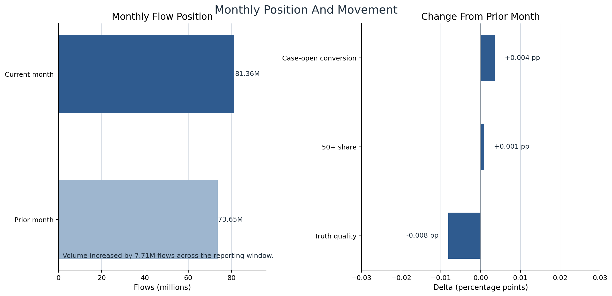
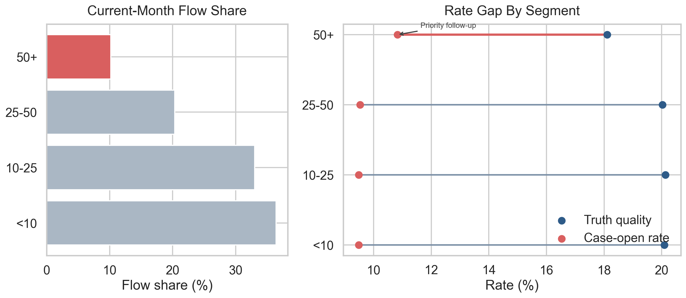

# Execution Report - Reporting Support For Operational And Regional Teams Slice

As of `2026-04-04`

Purpose:
- record what was actually executed for the InHealth `Data Analyst` slice around monthly and ad hoc reporting support for operational and regional teams
- preserve the truth boundary between one bounded reporting-support proof object and any wider claim about a full healthcare reporting estate
- package the saved facts, compact reporting outputs, audience notes, rerun controls, and supporting figures into one outward-facing report

Truth boundary:
- this execution was completed against the bounded `local_full_run-7` raw parquet surfaces, but only through filtered SQL scans and compact derived outputs
- the slice did not load broad raw source families into pandas or another in-memory dataframe layer
- the slice was limited to one monthly comparison window:
  - `Feb 2026`
  - `Mar 2026`
- the slice therefore supports a truthful claim about dependable monthly reporting plus one ad hoc follow-up output from the same governed logic base
- it does not support a claim that a broad InHealth reporting estate, patient-level stewardship programme, or full regional reporting service has already been implemented

---

## 1. Executive Answer

The slice asked:

`can one bounded programme-style lane be turned into a dependable monthly reporting pack plus one realistic ad hoc follow-up output, with stable KPI meaning and controlled rerun posture?`

The bounded answer is:
- one monthly cadence was fixed for the slice
- one audience pair was fixed:
  - operations
  - regional oversight
- one stable KPI family of `4` headline measures was pinned across both recurring and follow-up outputs:
  - flow volume
  - case-open conversion
  - authoritative truth quality
  - `50+` share as the stable follow-up lens
- one recurring monthly pack was delivered from the governed monthly summary
- one ad hoc follow-up output was delivered from the same KPI base
- one KPI definition note, one audience-usage note, one run checklist, one caveat note, and one regeneration README were all produced for the same reporting lane
- the cycle passes `4` out of `4` release checks
- the bounded regeneration takes about `184.9` seconds because the raw work stays in filtered SQL over two selected months rather than broad in-memory dataframe handling
- the monthly lane remains broadly stable in conversion and truth quality, while the current follow-up segment remains the `50+` band with:
  - `10.82%` case-open rate
  - `18.11%` truth quality
  - `10.20%` flow share

That means this slice delivered one real monthly reporting-support lane rather than only another generic report example.

## 2. Slice Summary

The slice executed was:

`one monthly operational reporting cycle plus one ad hoc follow-up cut for a single programme lane`

This was chosen because it allowed a direct response to the InHealth requirement:
- support operational and regional teams through dependable monthly reporting
- answer one realistic ad hoc follow-up need without breaking reporting consistency
- keep the reporting built from stable governed logic rather than one-off manual extracts
- show that the same KPI layer can support recurring and follow-up outputs

The primary proof object was:
- `reporting_support_for_operational_and_regional_teams_v1`

The main delivered outputs were:
- one bounded month-band aggregate
- one monthly summary output
- one ad hoc follow-up output
- one monthly reporting pack
- one follow-up pack
- one KPI definition note
- one audience-usage note
- one run checklist
- one caveat note
- one regeneration README

## 3. How This Maps To The Slice Plan

The execution stayed aligned to the approved InHealth `3.A` slice rather than drifting into a broader reporting-ownership or dataset-stewardship story.

The delivered scope maps back to the planned lens responsibilities as follows:
- `01 - Operational Performance Analytics`: one bounded KPI family, month-on-month operational reading, and the selection of one realistic follow-up segment
- `02 - BI, Insight, and Reporting Analytics`: one recurring monthly pack and one follow-up reporting output built from the same governed logic
- `09 - Analytical Delivery Operating Discipline`: release checks, rerun posture, KPI definition note, run checklist, caveats note, and regeneration README
- `08 - Stakeholder Translation, Communication, and Decision Influence`: one audience-usage note clarifying what operations and regional readers should look at first

The report therefore needs to be read as proof of dependable reporting support for one bounded lane, not as proof that all InHealth programme reporting duties have already been industrialised.

## 4. Execution Posture

The execution followed the corrected memory-safe posture rather than a casual monthly rebuild posture.

The working discipline was:
- start with summary profiling and scope checks before any slice build
- keep all heavy work inside `DuckDB`
- scan only the two required months:
  - `Feb 2026`
  - `Mar 2026`
- project only the fields needed for the KPI family
- materialise one compact month-band aggregate first
- derive the monthly pack and follow-up output from that aggregate
- use Python only after the SQL layer had already reduced the raw surfaces to compact outputs

This matters for the truth of the slice because the responsibility is about dependable reporting support, and the execution should reflect industry-style database discipline rather than toy-data assumptions.

## 5. Bounded Build That Was Actually Executed

### 5.1 Scope profiling and reporting-safe month selection

The slice first confirmed that the bounded run supports real month-level reporting rather than only weekly reporting.

Observed raw month coverage for the candidate flow surface:

| Month | Flow Rows |
| --- | ---: |
| `Jan 2026` | 81,678,596 |
| `Feb 2026` | 73,652,566 |
| `Mar 2026` | 81,360,532 |

The slice then fixed the reporting window as:
- prior month: `Feb 2026`
- current month: `Mar 2026`

That choice kept the slice:
- real at monthly grain
- bounded to two months only
- consistent with the requirement around monthly reporting support

### 5.2 Compact monthly aggregate layer

Instead of materialising a large row-level monthly base, the slice built one bounded month-band aggregate from filtered SQL scans.

Observed aggregate shape:

| Output | Rows |
| --- | ---: |
| `programme_month_band_agg_v1` | `8` |

Meaning:
- `2` months
- `4` amount bands

This compact output was enough to support:
- the recurring monthly pack
- the ad hoc follow-up output
- the release checks

without requiring a broad in-memory row-level monthly table.

### 5.3 Monthly summary output

Observed current monthly summary:

| Measure | Value |
| --- | ---: |
| Current month | `Mar 2026` |
| Prior month | `Feb 2026` |
| Current flow rows | 81,360,532 |
| Prior flow rows | 73,652,566 |
| Current case-open rate | 9.63% |
| Prior case-open rate | 9.63% |
| Current truth quality | 19.86% |
| Prior truth quality | 19.87% |
| Current `50+` share | 10.20% |

Reading:
- the monthly lane carries a real current-versus-prior comparison
- volume rises materially month on month
- conversion stays essentially flat
- truth quality stays essentially flat
- the recurring monthly pack therefore reads as dependable reporting support rather than exaggerated issue storytelling

### 5.4 Ad hoc follow-up output

The ad hoc follow-up output was intentionally kept small and derived from the same governed monthly KPI base.

Observed current follow-up segment:

| Segment | Flow Share | Case-Open Rate | Truth Quality |
| --- | ---: | ---: | ---: |
| `50+` | 10.20% | 10.82% | 18.11% |

Operational reading:
- this remains the most useful next follow-up cut
- it opens to case work more aggressively than the rest of the current-month lane
- it returns weaker truth quality than the lower bands
- it therefore proves a realistic ad hoc reporting question can be answered from the same recurring KPI logic

### 5.5 Release and rerun posture

Observed control facts:

| Control Measure | Value |
| --- | ---: |
| Release checks passed | 4 / 4 |
| Truth-link coverage | 100.00% |
| Regeneration time | 184.9 seconds |
| Broad raw-data pandas load | No |

Reading:
- the reporting-support lane is not just documented; it is actually rerunnable
- the regeneration time is longer than the compact HUC follow-on slices because this slice scans filtered raw parquet for two months rather than starting from already reduced weekly outputs
- that longer regeneration time is still acceptable for the bounded proof because the execution remained SQL-first and memory-safe

## 6. Figures Actually Delivered

### 6.1 Figure 1 - Monthly position and movement

The first figure was designed to answer:
- what is the current monthly position?
- what moved from the prior month?
- does the monthly lane look unstable or broadly steady?

Delivered components:
- current versus prior monthly flow volume
- percentage-point movement across the bounded KPI family

The strongest reading from this figure is:
- volume rose month on month
- conversion and truth quality were broadly steady
- the monthly reporting pack therefore needs one follow-up cut rather than a broad lane-wide escalation story

### 6.2 Figure 2 - Current-month follow-up by segment

The second figure was designed to answer:
- which current-month segment is the most useful next follow-up cut?
- how do case-open rate and truth quality compare across the current-month bands?

Delivered components:
- one current-month flow-share view by band
- one direct visual gap between case-open rate and truth quality by band

The strongest reading from this figure is:
- `50+` remains the correct follow-up segment
- the figure shows both why that band matters in volume terms and why it matters in conversion-versus-quality terms
- the figure supports the ad hoc pack without pretending to be a dashboard page

## 7. Figures

### 7.1 Monthly position and movement

This figure carries the recurring monthly story:
- prior and current month volume are visible directly
- movement in conversion, truth quality, and `50+` share is shown as change from prior rather than forcing unlike KPI levels onto one axis
- the monthly pack stays analytical and complementary rather than dashboard-styled

### 7.2 Current-month follow-up by segment

This figure carries the follow-up story:
- the left panel shows how much of the current-month lane each band carries
- the right panel shows the gap between case-open rate and truth quality
- the `50+` band remains visually clear as the highest-priority follow-up cut
- the figure supplements the follow-up pack rather than duplicating report prose

## 8. Reporting-Support Assets Produced

The slice produced the operational assets that make the reporting-support lane credible.

Requirements and structure:
- reporting requirements note
- KPI definition note
- audience-usage note

Recurring and follow-up outputs:
- monthly reporting pack
- ad hoc follow-up pack

Cycle controls:
- run checklist
- caveats note
- regeneration README
- release checks output

This is the key difference between this slice and a generic “built a report” claim:
- the output here is not just the monthly pack
- it is the monthly pack plus the reusable follow-up output and the bounded control posture around both

## 9. What This Slice Supports Claiming

This slice supports truthful statements such as:
- supported monthly and ad hoc reporting from one stable governed logic base
- delivered recurring and follow-up outputs without redefining KPI meaning between them
- kept the reporting-support lane bounded, repeatable, and readable for operational and regional audiences
- used SQL-first, memory-safe execution to shape industrial-scale raw data into compact reporting outputs

The slice does not support claiming that:
- a full InHealth patient-level reporting estate has already been implemented
- all regional and operational reporting needs have already been covered
- patient-level stewardship has already been proved, which belongs more naturally to InHealth `3.C`
- the bounded monthly follow-up issue has already been operationally resolved

## 10. Candidate Resume Claim Surfaces

This section should be read as a direct response to the InHealth `3.A` responsibility, not as a generic “I built a monthly report” statement.

The requirement asks for someone who can:
- produce monthly reports
- produce ad hoc reports
- support operational and regional teams through those outputs
- keep the reporting usable and dependable

The claim therefore needs to answer back in evidence form:
- I have delivered one bounded monthly reporting cycle and one follow-up output from the same governed logic base
- I have kept the KPI meanings stable between recurring and ad hoc reporting
- I have built the reporting-support lane in a way that is controlled and rerunnable rather than manual and fragile

### 10.1 Flagship `X by Y by Z` claim

> Supported operational and regional teams through dependable monthly and ad hoc reporting, as measured by delivery of one recurring monthly reporting pack and one governed follow-up output from the same KPI logic base, stable reuse of `4` KPI families across both outputs, and completion of `4/4` release checks with regeneration in `184.9` seconds, by shaping two bounded months of raw programme data into a controlled reporting lane that gave teams a clear monthly position and a realistic next-cut follow-up without falling back to one-off manual extracts.

### 10.2 Shorter recruiter-facing version

> Delivered dependable monthly and ad hoc reporting for operational and regional teams, as measured by stable KPI reuse across one recurring monthly pack and one follow-up output from the same governed base, by turning bounded programme data into repeatable reporting outputs rather than one-off manual reports.

### 10.3 Closer direct-response version

> Produced accurate monthly and ad hoc reports to support operational and regional teams, as measured by consistent recurring and follow-up outputs, reusable KPI definitions, and controlled rerun capability, by shaping bounded programme data into one monthly reporting pack and one realistic follow-up cut rather than one-off manual extracts.
