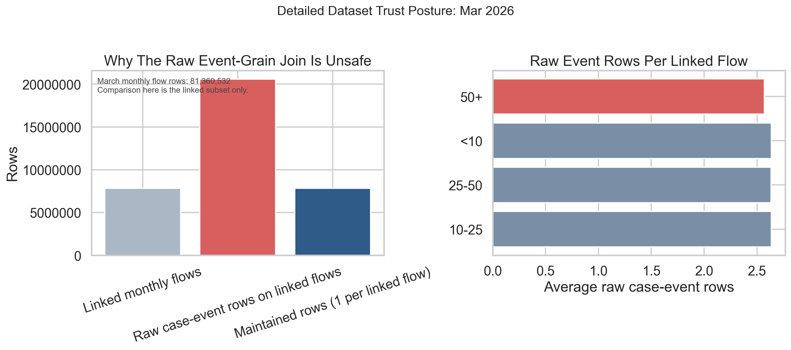
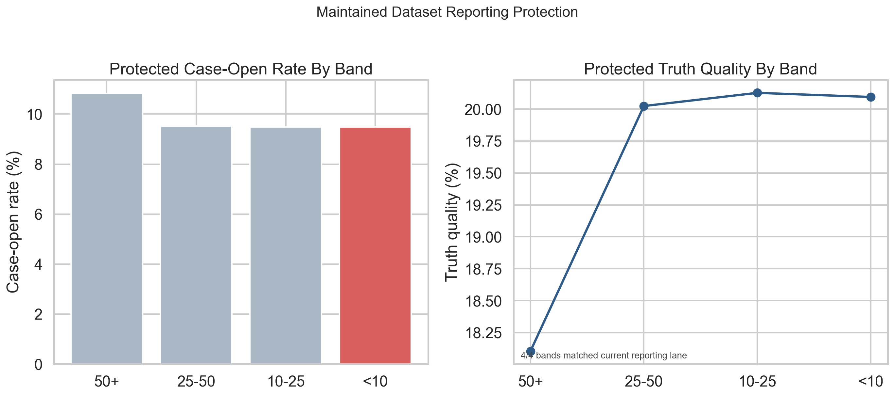

# Execution Report - Patient-Level Dataset Stewardship Slice

As of `2026-04-04`

Purpose:
- record what was actually executed for the InHealth `Data Analyst` slice around patient-level dataset maintenance, validation, and reconciliation
- preserve the truth boundary between one bounded detailed-dataset stewardship proof object and any wider claim about full healthcare patient-record ownership
- package the saved facts, maintained dataset outputs, validation and reconciliation checks, stewardship notes, and supporting figures into one outward-facing report

Truth boundary:
- this execution was completed against the bounded `local_full_run-7` raw parquet surfaces, but only through filtered SQL scans and compact derived outputs
- the slice did not load broad raw source families into pandas or another in-memory dataframe layer
- the slice was limited to one stewardship window:
  - `Mar 2026`
- the employer language is patient-level, but the honest platform analogue here is a case-level sensitive reporting dataset built from:
  - monthly flow records
  - rolled case state
  - truth labels
- the slice therefore supports a truthful claim about maintaining, validating, and reconciling one detailed reporting dataset and protecting downstream reporting accuracy through that stewardship
- it does not support a claim that a broad healthcare patient-record estate or full longitudinal stewardship programme has already been implemented

---

## 1. Executive Answer

The slice asked:

`can one bounded detailed reporting dataset be maintained, validated, and reconciled carefully enough that a downstream monthly reporting output remains accurate and defensible?`

The bounded answer is:
- one detailed monthly stewardship window was fixed:
  - `Mar 2026`
- one maintained dataset grain was fixed:
  - one row per `flow_id` where the monthly flow converted into case-opened work
- the detailed source path was profiled before materialisation
- one trust risk was identified clearly:
  - the raw case surface is event-grain, not maintained reporting grain
- one controlled fix was applied:
  - roll the case timeline to one row per `flow_id` before joining it into the maintained detailed dataset
- one maintained detailed dataset was produced with:
  - `7,835,199` rows
  - `7,835,199` distinct `flow_id`
  - `7,835,199` distinct `case_id`
- one validation pack was executed and passes `5/5` checks
- one reconciliation pack was executed and matches the current InHealth `3.A` reporting lane exactly across `4/4` amount bands
- the maintained dataset protects a downstream monthly reading of:
  - `9.63%` overall case-open rate
  - `19.86%` overall truth quality
- regeneration takes about `491.1` seconds because the slice scans a large raw monthly detailed surface in bounded SQL rather than starting from already reduced weekly outputs

That means this slice did not merely document data quality. It maintained one detailed reporting dataset carefully enough that downstream reporting could be reproduced exactly from the controlled version.

## 2. Slice Summary

The slice executed was:

`one maintained case-level reporting dataset across one monthly window for one programme lane, with explicit validation, reconciliation, and reporting-protection controls`

This was chosen because it allowed a direct response to the InHealth requirement:
- maintain patient-level datasets
- validate patient-level datasets
- reconcile patient-level datasets
- ensure reporting accuracy through that maintenance and reconciliation work

The main delivered outputs were:
- one source-profile output
- one maintained detailed dataset
- one validation-check output
- one reporting-safe summary
- one reconciliation-check output
- one source map
- one field-authority note
- one issue note
- one reporting-protection note
- one maintenance checklist
- one caveat note
- one regeneration README

## 3. How This Maps To The Slice Plan

The execution stayed aligned to the approved InHealth `3.C` slice rather than drifting into a broader reporting-support or generic quality-programme story.

The delivered scope maps back to the planned lens responsibilities as follows:
- `03 - Data Quality, Governance, and Trusted Information Stewardship`: detailed source profiling, grain definition, field-authority control, maintained dataset materialisation, validation checks, and issue identification
- `02 - BI, Insight, and Reporting Analytics`: one protected downstream reporting-safe summary and exact reconciliation back to the InHealth `3.A` reporting lane
- `09 - Analytical Delivery Operating Discipline`: stable SQL build order, maintenance checklist, caveats note, and regeneration README
- `01 - Operational Performance Analytics`: one bounded downstream operational consequence only, namely that the maintained dataset reproduces the protected current-month case-open and truth-quality readings safely

The report therefore needs to be read as proof of careful detailed-dataset stewardship for one bounded lane, not as proof that every InHealth-style detailed dataset is already operationalised.

## 4. Execution Posture

The execution followed the corrected profiling-first and memory-safe posture rather than a casual detailed-data rebuild posture.

The working discipline was:
- start with source-path, grain, and field-suitability profiling before any maintained dataset build
- keep all heavy work inside `DuckDB`
- scan only the required month:
  - `Mar 2026`
- project only the fields needed for:
  - grain confirmation
  - field authority
  - validation and reconciliation
  - downstream reporting-safe use
- materialise the maintained dataset in SQL only after the trust rules were stable
- use Python only after the SQL layer had already reduced the raw surfaces to compact outputs

This matters for the truth of the slice because the responsibility is about careful dataset stewardship, and the execution should reflect industry-style database discipline rather than toy-data assumptions.

## 5. Bounded Build That Was Actually Executed

### 5.1 Source profiling and grain confirmation

The slice first confirmed the real structure of the detailed source path rather than assuming the richer HUC-style or Midlands-style shapes carried over directly.

Observed bounded source facts used to define the maintained dataset:

| Surface | `Mar 2026` Rows | Distinct Key Reading |
| --- | ---: | ---: |
| flow anchor | 81,360,532 | 81,360,532 distinct `flow_id` |
| case timeline | 19,829,993 | 13,383,557 distinct `case_id`, 13,383,557 distinct `flow_id` |
| truth labels surface | 236,691,694 total rows | 236,691,694 distinct `flow_id` |

Important reading:
- the bounded monthly flow surface is already one row per `flow_id`
- the case surface is not reporting-safe at raw grain because it is event-grain
- the truth surface was used as a full-surface lookup and uniqueness check because it is keyed stably at `flow_id` rather than month-partitioned inside this slice

That meant the maintained dataset had to be defined as:
- one row per monthly `flow_id`
- but only where that flow converted into case-opened work
- with one rolled case state and one truth state attached

### 5.2 The trust risk that was actually found

The stewardship issue was not a null-heavy or duplicate-truth issue. The real risk was grain mismatch.

Observed current-month linkage facts:

| Measure | Value |
| --- | ---: |
| March flows linked to case activity | 7,835,199 |
| Raw case-event rows on those linked flows | 20,581,909 |
| Average raw case-event rows per linked flow | 2.63 |

Meaning:
- if the raw case timeline were joined directly into a detailed reporting dataset, linked March flows would be duplicated
- the duplication risk is structural, not cosmetic
- the maintained dataset therefore had to roll the case timeline to one row per `flow_id` before joining

This is the central stewardship proof of the slice.

### 5.3 Maintained detailed dataset

The maintained dataset was intentionally narrow and controlled.

Observed maintained dataset facts:

| Measure | Value |
| --- | ---: |
| Maintained dataset rows | 7,835,199 |
| Distinct `flow_id` | 7,835,199 |
| Distinct `case_id` | 7,835,199 |
| Average raw case-event rows behind each maintained row | 2.63 |

The maintained dataset therefore:
- preserves one row per `flow_id`
- preserves one `case_id` per retained row
- keeps the rolled case state visible through `raw_case_event_rows`
- remains fit for downstream reporting use without event-grain duplication

### 5.4 Validation layer

The validation pack was intentionally simple and hard-edged.

Observed validation results:

| Check | Result |
| --- | ---: |
| monthly flow ids unique | pass |
| truth surface unique at `flow_id` | pass |
| maintained dataset unique at `flow_id` | pass |
| maintained dataset required fields complete | pass |
| maintained dataset contains only case-opened rows | pass |

Validation verdict:
- `5/5` checks passed

This is enough for the slice because the requirement is not “build an enterprise DQ framework.” It is “maintain, validate, and reconcile a detailed dataset carefully enough to keep reporting accurate.”

### 5.5 Protected downstream summary

The downstream proof was kept intentionally small so the slice did not turn back into another reporting-ownership exercise.

Observed protected overall reporting-safe summary:

| Measure | Value |
| --- | ---: |
| Overall case-open rate | 9.63% |
| Overall truth quality | 19.86% |

Observed protected band-level readings:

| Band | Case-Open Rate | Truth Quality |
| --- | ---: | ---: |
| `<10` | 9.48% | 20.09% |
| `10-25` | 9.49% | 20.13% |
| `25-50` | 9.53% | 20.02% |
| `50+` | 10.82% | 18.11% |

This proves that the maintained dataset is not just tidy internally. It supports a real downstream monthly reading.

### 5.6 Reconciliation back to the reporting lane

The downstream protected summary was then reconciled to the current-month reporting lane from InHealth `3.A`.

Observed reconciliation results:

| Band | Flow Rows Match | Case-Opened Rows Match | Truth Rows Match | Verdict |
| --- | ---: | ---: | ---: | --- |
| `<10` | yes | yes | yes | pass |
| `10-25` | yes | yes | yes | pass |
| `25-50` | yes | yes | yes | pass |
| `50+` | yes | yes | yes | pass |

Reconciliation verdict:
- `4/4` amount bands matched exactly

This is the most important downstream proof in the slice:
- the maintained dataset is not only internally valid
- it reproduces the current reporting lane exactly once its grain is controlled

## 6. Figures Actually Delivered

### 6.1 Figure 1 - Raw case-event join risk

The first figure was designed to answer:
- why can the raw case surface not be joined directly?
- how large is the duplication risk?
- does that risk vary materially by band?

Delivered components:
- linked-subset row-count contrast between:
  - linked monthly flows
  - raw case-event rows on those linked flows
  - maintained rows after rolling to one row per linked flow
- average raw case-event rows per linked flow by amount band

The strongest reading from this figure is:
- the raw case surface is structurally unsafe for detailed reporting joins
- the maintained dataset exists because the raw event-grain path would otherwise distort reporting

### 6.2 Figure 2 - Maintained dataset reporting protection

The second figure was designed to answer:
- what downstream reporting position does the maintained dataset protect?
- do the protected rates still preserve the same operational pattern?
- was the maintained summary reconciled back to the reporting lane exactly?

Delivered components:
- protected case-open rate by band
- protected truth quality by band
- reconciliation note showing exact match to the InHealth `3.A` lane

The strongest reading from this figure is:
- the maintained dataset protects a real reporting outcome
- it preserves the current operational pattern without raw event-grain duplication

## 7. Figures

### 7.1 Raw case-event join risk

This figure carries the core stewardship story:
- the left panel stays within the linked-flow subset and shows why raw case-event rows are unsafe as a reporting grain
- the right panel shows that each linked flow carries more than one raw case-event row on average
- the maintained detailed dataset is therefore a control necessity, not a cosmetic reshape

### 7.2 Maintained dataset reporting protection

This figure carries the downstream protection story:
- the maintained dataset preserves the current-month rate pattern by band
- the reporting-safe summary remains analytically useful after the grain correction
- the slice explicitly anchors that protected summary back to the current InHealth `3.A` reporting lane

## 8. Stewardship Assets Produced

The slice produced the operational assets that make the stewardship lane credible.

Trust and definition assets:
- source map
- field-authority note
- issue note

Maintained-data and protected-reporting assets:
- maintained detailed dataset
- reporting-safe summary
- reporting-protection note

Control assets:
- validation checks
- reconciliation checks
- maintenance checklist
- caveats note
- regeneration README

This is the key difference between this slice and a generic “I cleaned some data” claim:
- the output here is not just one cleaned table
- it is one maintained dataset plus the validation, reconciliation, and downstream protection evidence around it

## 9. What This Slice Supports Claiming

This slice supports truthful statements such as:
- maintained a detailed reporting dataset at a controlled grain rather than relying on unsafe raw event joins
- validated and reconciled the maintained dataset before using it for reporting-safe output
- protected downstream monthly reporting accuracy through dataset stewardship
- used SQL-first, memory-safe execution to shape industrial-scale detailed data into a maintained reporting dataset

The slice does not support claiming that:
- a broad healthcare patient-level data estate has already been implemented
- all detailed dataset stewardship needs have already been solved
- every downstream reporting dependency has already been industrialised
- the platform now proves full healthcare data governance outside this bounded analogue

## 10. Candidate Resume Claim Surfaces

This section should be read as a direct response to the InHealth `3.C` responsibility, not as a generic “I improved data quality” statement.

The requirement asks for someone who can:
- maintain patient-level datasets
- validate patient-level datasets
- reconcile patient-level datasets
- ensure reporting accuracy through that work

The claim therefore needs to answer back in evidence form:
- I maintained one bounded detailed reporting dataset at a controlled grain
- I validated and reconciled it before releasing it for downstream reporting use
- I protected the downstream reporting lane because the maintained dataset reproduced it exactly

### 10.1 Flagship `X by Y by Z` claim

> Maintained, validated, and reconciled a detailed reporting dataset to keep monthly reporting accurate, as measured by applying `5` repeatable validation checks to a controlled `7,835,199`-row maintained dataset, reproducing the downstream reporting lane exactly across `4/4` amount bands, and regenerating the maintained dataset and protected summary in `491.1` seconds, by profiling a bounded March case-linked reporting surface, correcting the raw case timeline from unsafe event-grain joins to one rolled case state per `flow_id`, and releasing a reporting-safe detailed dataset from that controlled definition.

### 10.2 Shorter recruiter-facing version

> Maintained and reconciled a trusted detailed reporting dataset, as measured by repeatable validation checks, exact reconciliation back to the downstream monthly reporting lane, and controlled regeneration from bounded SQL logic, by replacing unsafe raw case-event joins with a maintained one-row-per-flow dataset fit for reporting use.

### 10.3 Closer direct-response version

> Maintained, validated, and reconciled a detailed reporting dataset to ensure reporting accuracy, as measured by controlled field and grain integrity, repeatable dataset checks, and a downstream reporting-safe summary that matched the reporting lane exactly, by profiling detailed records carefully, rolling the case timeline to the correct reporting grain, and releasing a maintained dataset fit for reporting use.
