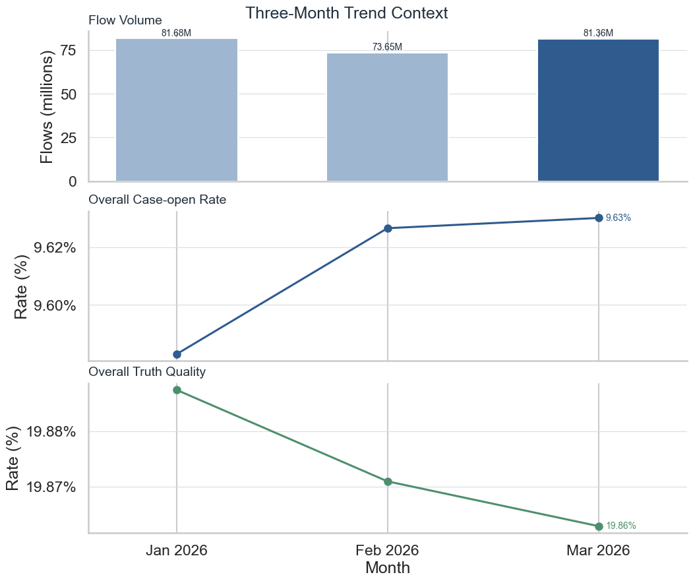
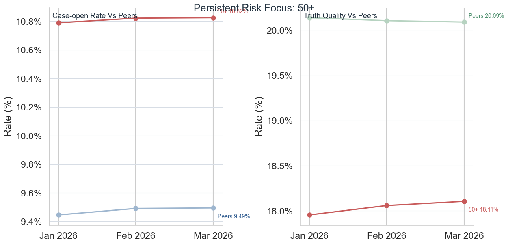

# Execution Report - Trend Risk And Opportunity Identification Slice

As of `2026-04-04`

Purpose:
- record what was actually executed for the InHealth `Data Analyst` slice around identifying trends and risks in operational data, while checking whether any bounded opportunity signal was also present
- preserve the truth boundary between one bounded rolling-month trend reading and any wider claim about full process-improvement ownership
- package the saved facts, compact comparison outputs, risk-focus notes, and supporting figures into one outward-facing report

Truth boundary:
- this execution was completed against the bounded `local_full_run-7` raw parquet surfaces, but only through filtered SQL scans and compact derived outputs
- the slice did not load broad raw source families into pandas or another in-memory dataframe layer
- the slice was limited to one rolling trend window:
  - `Jan 2026`
  - `Feb 2026`
  - `Mar 2026`
- the slice therefore supports a truthful claim about identifying one meaningful operational trend and one persistent risk pocket from a controlled monthly lane
- no material positive opportunity signal surfaced in this bounded window beyond ruling out a false broad-deterioration reading
- it does not support a claim that the underlying process has already been improved, which belongs more naturally to InHealth `3.E`

---

## 1. Executive Answer

The slice asked:

`can one bounded rolling monthly lane be read well enough to separate normal topline stability from a concentrated risk pocket that deserves attention?`

The bounded answer is:
- one rolling three-month window was fixed:
  - `Jan 2026`
  - `Feb 2026`
  - `Mar 2026`
- one stable KPI family of `4` measures was pinned across the full window:
  - flow volume
  - case-open rate
  - truth quality
  - `50+` share
- one compact month-band aggregate was built from filtered SQL scans rather than broad in-memory monthly tables
- one monthly trend comparison output and one monthly risk-focus output were delivered from that same governed base
- the topline lane remained broadly stable across the full window:
  - flow volume moved from `81.68M` to `73.65M` to `81.36M`
  - case-open rate moved from `9.58%` to `9.63%` to `9.63%`
  - truth quality moved from `19.89%` to `19.87%` to `19.86%`
- one persistent concentrated risk pocket was identified:
  - `50_plus` ranked as the top attention band in all `3` months
  - current-month `50_plus` case-open rate was `10.82%` versus peer average `9.49%`
  - current-month `50_plus` truth quality was `18.11%` versus peer average `20.09%`
- the cycle passes `4` out of `4` release checks
- bounded regeneration takes about `372.8` seconds because the raw work remains in filtered SQL across three selected months rather than broad dataframe handling

That means this slice did not merely produce another monthly pack. It identified that the lane is broadly stable overall while carrying one persistent risk pocket that merits further attention.

## 2. Slice Summary

The slice executed was:

`one rolling monthly trend-and-risk reading for a single programme lane over Jan 2026 to Mar 2026`

This was chosen because it allowed a direct response to the InHealth requirement:
- identify trends in operational data
- identify risks in operational data
- test whether any bounded positive opportunity signal is present in operational data
- surface where management attention should go without overclaiming that the process has already been improved

The main delivered outputs were:
- one month-band aggregate
- one rolling monthly comparison output
- one monthly risk-focus output
- one trend question note
- one trend reading note
- one risk note
- one usage note
- one caveat note
- one regeneration README
- one compact evidence pack

## 3. How This Maps To The Slice Plan

The execution stayed aligned to the approved InHealth `3.D` slice rather than drifting into either another reporting-support story or an early process-improvement story.

The delivered scope maps back to the planned lens responsibilities as follows:
- `01 - Operational Performance Analytics`: three-month trend reading, stable KPI family, monthly band comparison, and identification of the persistent `50_plus` risk pocket
- `02 - BI, Insight, and Reporting Analytics`: one compact monthly comparison output and one focused risk output built from the same governed aggregate
- `05 - Business Analysis, Change, and Decision Support`: one bounded management-attention framing around where the lane differs from peers and why it deserves attention
- `03 - Data Quality, Governance, and Trusted Information Stewardship`: light support only, through controlled reuse of the existing trusted monthly lane rather than new stewardship work

The report therefore needs to be read as proof of trend and risk identification for one bounded lane, not as proof that a wider process-improvement programme has already been executed.

## 4. Execution Posture

The execution followed the corrected profiling-first and memory-safe posture rather than a casual rolling-window rebuild posture.

The working discipline was:
- start with bounded month-coverage and grain checks before any slice build
- keep all heavy work inside `DuckDB`
- scan only the required months:
  - `Jan 2026`
  - `Feb 2026`
  - `Mar 2026`
- project only the fields needed for:
  - month-level KPI readings
  - amount-band comparison
  - peer-versus-focus comparisons
- materialise one compact month-band aggregate first
- derive the trend comparison and risk-focus outputs from that aggregate
- use Python only after the SQL layer had already reduced the raw surfaces to compact outputs

This matters for the truth of the slice because the responsibility is about reading industrial-scale operational data carefully enough to spot meaningful trends and risks, not about assuming a toy monthly dataset.

## 5. Bounded Build That Was Actually Executed

### 5.1 Rolling month selection and stable KPI family

The slice first confirmed that the current raw lane supports a real rolling monthly reading rather than only a current-versus-prior snapshot.

Observed bounded monthly coverage:

| Month | Flow Rows | Case-Open Rate | Truth Quality | `50+` Share |
| --- | ---: | ---: | ---: | ---: |
| `Jan 2026` | 81,678,596 | 9.58% | 19.89% | 10.20% |
| `Feb 2026` | 73,652,566 | 9.63% | 19.87% | 10.20% |
| `Mar 2026` | 81,360,532 | 9.63% | 19.86% | 10.20% |

This fixed the trend window at three months and kept the KPI family stable enough to tell whether the lane was broadening into a wider issue or staying concentrated.

### 5.2 Compact month-band aggregate layer

Instead of materialising a large row-level rolling base, the slice built one bounded month-band aggregate from filtered SQL scans.

Observed aggregate shape:

| Output | Rows |
| --- | ---: |
| `trend_month_band_agg_v1` | `12` |

Meaning:
- `3` months
- `4` amount bands

This compact aggregate was enough to support:
- the monthly trend comparison
- the risk-focus output
- the release checks

without requiring a broad in-memory rolling table.

### 5.3 Topline trend reading

Observed topline month-on-month movement:

| Month | Flow Rows | Case-Open Rate | Truth Quality |
| --- | ---: | ---: | ---: |
| `Jan 2026` | 81,678,596 | 9.58% | 19.89% |
| `Feb 2026` | 73,652,566 | 9.63% | 19.87% |
| `Mar 2026` | 81,360,532 | 9.63% | 19.86% |

Reading:
- volume moves materially in and out across the three months
- conversion remains effectively flat at topline
- truth quality drifts only slightly lower and stays broadly stable
- the rolling lane therefore does not tell a broad deterioration story

That is the first important outcome of the slice: it prevents a false escalation narrative at whole-lane level.

### 5.4 Persistent risk pocket

The monthly risk-focus output then tested whether the lane was simply stable everywhere or whether one band kept separating from the rest.

Observed current-month focus band:

| Band | Case-Open Rate | Peer Case-Open Rate | Truth Quality | Peer Truth Quality |
| --- | ---: | ---: | ---: | ---: |
| `50+` | 10.82% | 9.49% | 18.11% | 20.09% |

Observed persistence across the full rolling window:

| Month | Top Attention Band | `50+` Case-Open Rate | `50+` Truth Quality |
| --- | --- | ---: | ---: |
| `Jan 2026` | `50+` | 10.79% | 17.95% |
| `Feb 2026` | `50+` | 10.82% | 18.06% |
| `Mar 2026` | `50+` | 10.82% | 18.11% |

Meaning:
- `50+` is not a one-month outlier
- it is the top attention band in all `3` months
- it continues to open to case work more aggressively than peers while returning weaker truth quality than peers

This is the central risk-identification proof of the slice.

Observed opportunity reading:
- no band showed the reverse pattern of lower pressure with stronger quality at a scale large enough to justify an explicit opportunity claim

That means the bounded output is strongest as:
- trend identification
- risk identification

and only weakly as an opportunity scan.

### 5.5 Release and rerun posture

Observed control facts:

| Control Measure | Value |
| --- | ---: |
| Release checks passed | 4 / 4 |
| Distinct months present | 3 |
| Focus rows present | 12 |
| Persistent top band check | pass |
| Regeneration time | 372.8 seconds |
| Broad raw-data pandas load | No |

Reading:
- the trend/risk lane is not only interpretable; it is rerunnable
- regeneration is longer than the compact HUC follow-on slices because this slice scans three raw monthly partitions rather than weekly reduced outputs
- that longer regeneration time remains acceptable for the bounded proof because the execution stayed SQL-first and memory-safe

## 6. Figures Actually Delivered

### 6.1 Figure 1 - Monthly trend context

The first figure was designed to answer:
- does the lane show broad deterioration across the rolling monthly window?
- what moved materially at topline?
- should attention go to the whole lane or to a more concentrated pocket?

Delivered components:
- monthly flow volume across `Jan 2026` to `Mar 2026`
- overall case-open rate across the same three months
- overall truth quality across the same three months

The strongest reading from this figure is:
- the lane is broadly stable in the KPIs that matter most
- the trend story is therefore about concentration of risk, not whole-lane decline

### 6.2 Figure 2 - Persistent risk focus

The second figure was designed to answer:
- which band consistently separates from the rest?
- is that separation visible in both conversion and quality terms?
- is it a transient blip or a persistent focus band?

Delivered components:
- `50+` case-open rate versus peer average across all `3` months
- `50+` truth quality versus peer average across all `3` months

The strongest reading from this figure is:
- `50+` is the persistent monthly attention band
- the gap is directionally unfavourable in both case-opening pressure and truth quality
- the slice has therefore identified one real bounded risk pocket rather than inventing a lane-wide problem

## 7. Figures

### 7.1 Monthly trend context

This figure carries the rolling monthly story:
- monthly volume is visible directly in millions
- overall case-open rate remains essentially flat after the January step up
- overall truth quality remains broadly steady with only a slight downward drift
- the figure therefore supports a stable-topline reading rather than a forced deterioration narrative

### 7.2 Persistent risk focus

This figure carries the concentrated-risk story:
- the left panel shows `50+` versus peers on case-open rate across all `3` months
- the right panel shows `50+` versus peers on truth quality across the same window
- the persistence of the gap is what matters, not a single isolated point
- the figure supplements the evidence pack rather than pretending to be a dashboard page

## 8. Trend And Risk Assets Produced

The slice produced the analytical assets that make the trend/risk lane credible.

Trend and interpretation assets:
- trend question note
- trend reading note
- risk note

Governed analytical outputs:
- month-band aggregate
- monthly trend comparison output
- monthly risk-focus output

Control assets:
- usage note
- caveats note
- regeneration README
- release checks output

This is the key difference between this slice and a generic “I spotted a pattern” claim:
- the output here is not just one interpretation sentence
- it is one bounded rolling trend reading plus the controlled evidence and rerun posture around it

## 9. What This Slice Supports Claiming

This slice supports truthful statements such as:
- identified one persistent risk pocket from a bounded rolling monthly operational lane
- separated stable topline performance from concentrated segment-level risk
- used compact governed SQL outputs rather than one-off spreadsheet reading to surface the trend
- packaged the trend and risk reading into a repeatable evidence pack

The slice does not support claiming that:
- the operational process has already been improved
- the underlying risk has already been resolved
- all possible risks and opportunities across the lane have already been surfaced
- a meaningful positive opportunity signal was proved in this bounded window
- the platform now proves full service-improvement ownership outside this bounded identification slice

## 10. Candidate Resume Claim Surfaces

This section should be read as a direct response to the InHealth `3.D` responsibility, not as a generic “I analysed performance” statement.

The requirement asks for someone who can:
- identify trends in data
- identify risks in data
- test for opportunities in data without inventing them
- surface useful operational insight from those readings

The claim therefore needs to answer back in evidence form:
- I read a bounded rolling monthly lane carefully enough to separate stable topline movement from concentrated risk
- I identified one persistent attention band rather than inventing a broad worsening story
- I packaged that reading into repeatable evidence that could support next-step attention

### 10.1 Flagship `X by Y by Z` claim

> Identified a persistent operational risk from rolling monthly performance data, as measured by building a controlled `3`-month trend reading across `4` stable KPI families, confirming `50_plus` as the top attention band in all `3` months, and reproducing the evidence pack with `4/4` release checks in `372.8` seconds, by comparing bounded Jan-to-Mar programme performance at both topline and band level and distinguishing a concentrated `50_plus` pressure-versus-quality gap from a false broad-deterioration story.

### 10.2 Shorter recruiter-facing version

> Identified a persistent risk pocket from rolling monthly operational data, as measured by a repeatable three-month trend reading that isolated `50_plus` as the consistent attention band, by separating stable topline performance from a concentrated pressure-versus-quality gap in one bounded programme lane.

### 10.3 Closer direct-response version

> Identified trends and risks in operational data, as measured by one governed three-month comparison, one persistent risk-focus output, and repeatable rerun checks, by reading Jan-to-Mar performance carefully enough to show that the lane was broadly stable overall while `50_plus` remained the recurring band most in need of attention and no comparably strong positive opportunity signal surfaced.
