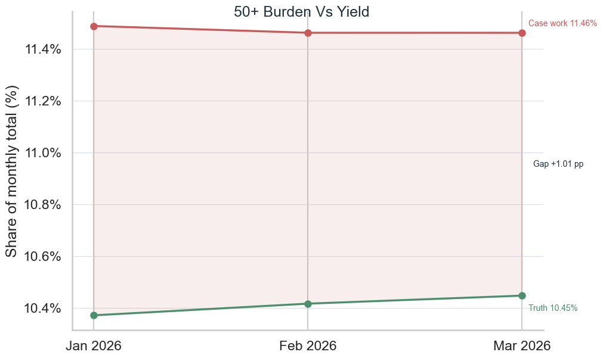
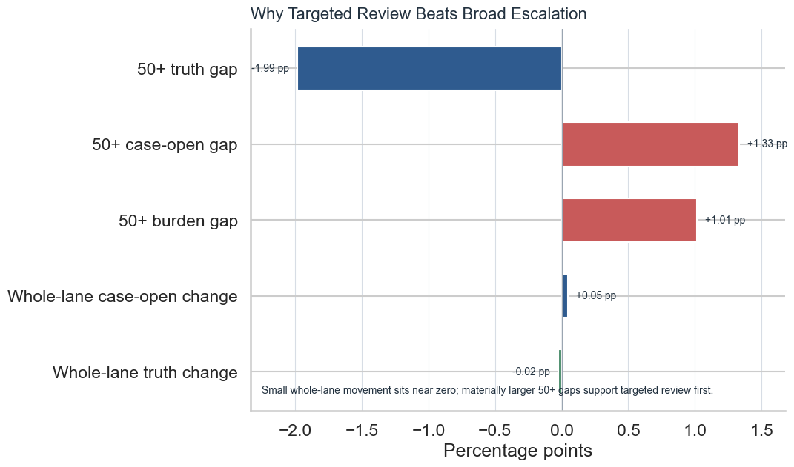

# Execution Report - Process And Efficiency Improvement Support Slice

As of `2026-04-04`

Purpose:
- record what was actually executed for the InHealth `Data Analyst` slice around supporting process and efficiency improvement with analysis
- preserve the truth boundary between one bounded improvement-support reading and any wider claim about delivered process change or efficiency gains
- package the saved facts, compact improvement-support outputs, recommendation notes, challenge framing, and supporting figures into one outward-facing report

Truth boundary:
- this execution was completed from compact governed outputs already produced in the earlier InHealth slices, not from a fresh broad raw rebuild
- the slice did not load broad raw source families into pandas or another in-memory dataframe layer
- the slice was limited to the same bounded rolling window already established in InHealth `3.D`:
  - `Jan 2026`
  - `Feb 2026`
  - `Mar 2026`
- the slice therefore supports a truthful claim about using analysis to support a targeted process or efficiency review recommendation
- it does not support a claim that the review was completed, that the process was changed, or that efficiency gains were already achieved

---

## 1. Executive Answer

The slice asked:

`can the recurring 50_plus pattern be translated into a bounded process or efficiency review recommendation without overclaiming that the process was already improved?`

The bounded answer is:
- one rolling three-month window was reused from the trusted `3.D` lane:
  - `Jan 2026`
  - `Feb 2026`
  - `Mar 2026`
- one stable KPI family of `4` measures was reused:
  - flow share
  - case-opened workload share
  - truth-output share
  - peer-gap readings
- one compact efficiency-support comparison output and one targeted-review support output were built from the same governed base
- the whole lane remained broadly stable over the full window:
  - case-open change from start was only `+0.05` percentage points
  - truth-quality change from start was only `-0.02` percentage points
- the concentrated `50_plus` issue remained materially stronger than whole-lane movement:
  - current `50_plus` case-opened workload share was `11.46%`
  - current `50_plus` truth-output share was `10.45%`
  - current burden-minus-yield gap was `+1.01` percentage points
  - current `50_plus` case-open gap to peers was `+1.33` percentage points
  - current `50_plus` truth-quality gap to peers was `-1.99` percentage points
- one explicit bounded recommendation was made:
  - review `50_plus` queue case-opening or escalation rules before any broad lane-wide intervention
- the cycle passes `5` out of `5` release checks
- bounded regeneration takes about `0.13` seconds because the slice reuses compact `3.D` outputs rather than re-reading raw monthly surfaces

That means this slice did not merely restate the `3.D` risk. It translated that risk into one proportional process/efficiency review recommendation.

## 2. Slice Summary

The slice executed was:

`one efficiency-support reading for the persistent 50_plus issue across the same Jan 2026 to Mar 2026 rolling lane`

This was chosen because it allowed a direct response to the InHealth requirement:
- support process or efficiency improvement with analysis
- use evidence to show where review should focus first
- keep the recommendation bounded and proportionate
- avoid claiming that a process change was already delivered

The main delivered outputs were:
- one efficiency-support comparison output
- one targeted-review support output
- one improvement question note
- one efficiency interpretation note
- one targeted review recommendation note
- one challenge-response note
- one caveat note
- one regeneration README
- one compact evidence pack

## 3. How This Maps To The Slice Plan

The execution stayed aligned to the approved InHealth `3.E` slice rather than drifting into either another trend-reading story or a false process-ownership story.

The delivered scope maps back to the planned lens responsibilities as follows:
- `05 - Business Analysis, Change, and Decision Support`: one bounded recommendation framing around why targeted review is more defensible than broad escalation
- `01 - Operational Performance Analytics`: one burden-versus-yield interpretation of the recurring `50_plus` pattern and one whole-lane-versus-focus comparison
- `02 - BI, Insight, and Reporting Analytics`: one compact improvement-support output pair and one supporting evidence pack
- `08 - Stakeholder Translation, Communication, and Decision Influence`: one explicit recommendation note and one challenge-response note for operational readers

The report therefore needs to be read as proof of process/efficiency improvement support for one bounded issue, not as proof that a wider improvement programme has already been implemented.

## 4. Execution Posture

The execution followed the corrected reuse-first and memory-safe posture rather than a casual fresh rebuild posture.

The working discipline was:
- start from the compact `3.D` outputs first
- confirm that the rolling window and focus-band evidence were strong enough to support a recommendation
- keep all shaped data work inside `DuckDB`
- avoid broad raw rescans because the improvement-support question could be answered from compact outputs
- use Python only after the SQL layer had already reduced the work to compact outputs and figures

This matters for the truth of the slice because the responsibility is about supporting improvement with analysis, and the engineering posture should reflect disciplined reuse of trusted outputs rather than unnecessary rebuilding.

## 5. Bounded Build That Was Actually Executed

### 5.1 Compact-output reuse gate

The slice first tested whether the trusted `3.D` outputs already contained enough signal to support a bounded recommendation.

Observed reusable foundations:

| Input | Shape |
| --- | ---: |
| `monthly_trend_compare_v1` | `3` rows |
| `monthly_risk_opportunity_focus_v1` | `12` rows |
| `trend_month_band_agg_v1` | `12` rows |

Meaning:
- the rolling monthly window was already fixed and trusted
- the persistent focus band was already established
- the slice did not need a fresh raw rebuild

That is an important result in its own right:
- the process/efficiency support slice can be built as an extension of prior analytical work rather than as a redundant heavy rerun

### 5.2 Improvement-support comparison output

The slice then built one compact efficiency-support comparison output from the month-band aggregate plus the `3.D` focus view.

Observed current-month focus-band reading:

| Measure | Value |
| --- | ---: |
| Focus band | `50_plus` |
| Flow share | 10.20% |
| Case-opened workload share | 11.46% |
| Truth-output share | 10.45% |
| Burden-minus-yield gap | +1.01 pp |
| Truth per case-opened row | 18.11% |

Interpretation:
- `50_plus` carries a larger share of case-opened workload than the share of stronger outcomes it returns
- the burden-minus-yield gap stays positive in the current month
- that is the bounded process/efficiency support signal in the slice

### 5.3 Why the recommendation is targeted rather than broad

The targeted-review support output then compared whole-lane movement against focus-band gaps.

Observed whole-lane Jan→Mar movement:

| Measure | Value |
| --- | ---: |
| Case-open change from start | +0.05 pp |
| Truth-quality change from start | -0.02 pp |

Observed current-month `50_plus` peer gaps:

| Measure | Value |
| --- | ---: |
| Case-open gap to peers | +1.33 pp |
| Truth-quality gap to peers | -1.99 pp |
| Burden gap | +1.01 pp |

Reading:
- the whole lane is broadly stable across the same window
- the focus-band gaps are materially larger than the whole-lane movement
- that is why the output supports targeted review of `50_plus` rather than broad lane-wide intervention

This is the central improvement-support proof of the slice.

### 5.4 The recommendation that was actually supported

The slice was intentionally constrained to a recommendation that remained proportional to the evidence.

Supported recommendation:
- review `50_plus` queue case-opening or escalation rules before any broad lane-wide intervention

Why this recommendation fits the evidence:
- it is focused on the recurring concentration pocket
- it does not assume the entire lane is underperforming
- it does not claim the process is already understood well enough to redesign it outright
- it is a review recommendation, not a delivered change claim

### 5.5 Release and rerun posture

Observed control facts:

| Control Measure | Value |
| --- | ---: |
| Release checks passed | 5 / 5 |
| Distinct months present | 3 |
| Efficiency rows present | 12 |
| Persistent focus band check | pass |
| Current burden gap positive | pass |
| Whole-lane change small | pass |
| Regeneration time | 0.13 seconds |
| Broad raw-data pandas load | No |

Reading:
- the improvement-support slice is not only interpretable; it is extremely cheap to rerun
- that is because it reuses compact trusted outputs from `3.D`
- the slice therefore proves a practical analytical-support extension rather than a heavy new build

## 6. Figures Actually Delivered

### 6.1 Figure 1 - `50+` burden versus yield

The first figure was designed to answer:
- does `50_plus` consume a larger share of case effort than the share of stronger outcomes it returns?
- is that pattern persistent across the rolling window?

Delivered components:
- `50_plus` case-opened workload share across all `3` months
- `50_plus` truth-output share across the same `3` months
- current burden gap annotation

The strongest reading from this figure is:
- the `50_plus` band persistently absorbs more case effort than the share of stronger outcomes it returns
- that is the bounded efficiency-support signal in the slice

### 6.2 Figure 2 - Why targeted review beats broad escalation

The second figure was designed to answer:
- is whole-lane movement large enough to justify broad escalation?
- or do the focus-band gaps make targeted review the more defensible response?

Delivered components:
- whole-lane Jan→Mar change in case-open rate and truth quality
- current-month `50_plus` case-open gap, truth-quality gap, and burden gap

The strongest reading from this figure is:
- whole-lane movement is small
- focus-band gaps are materially larger
- the slice therefore supports targeted review rather than broad lane-wide escalation

## 7. Figures

### 7.1 `50+` burden versus yield

This figure carries the concentrated burden story:
- the red line shows `50_plus` case-work share
- the green line shows `50_plus` truth-output share
- the space between them is the actionable point
- the figure therefore supports a focused efficiency-support reading rather than a broad generic “performance issue” claim

### 7.2 Why targeted review beats broad escalation

This figure carries the recommendation-support story:
- the left panel shows that whole-lane Jan→Mar movement is small
- the right panel shows that the current `50_plus` gaps are materially larger
- the figure therefore justifies a targeted review recommendation rather than broad lane-wide intervention

## 8. Improvement-Support Assets Produced

The slice produced the analytical assets that make the improvement-support lane credible.

Interpretation and recommendation assets:
- improvement question note
- efficiency interpretation note
- targeted review recommendation note
- challenge-response note

Governed analytical outputs:
- efficiency-support comparison output
- targeted-review support output

Control assets:
- caveats note
- regeneration README
- release checks output

This is the key difference between this slice and a generic “I recommended something” claim:
- the output here is not just a suggestion
- it is one bounded recommendation supported by one controlled analytical base and explicit challenge framing

## 9. What This Slice Supports Claiming

This slice supports truthful statements such as:
- used analytical evidence to support a targeted process or efficiency review
- translated a recurring operational risk into one bounded recommendation
- showed why focused review was more defensible than broad lane-wide escalation
- reused compact governed outputs to keep the improvement-support lane cheap and repeatable

The slice does not support claiming that:
- the process was already improved
- the targeted review was already completed
- quantified efficiency gains were already achieved
- a broad service-improvement programme has already been delivered

## 10. Candidate Resume Claim Surfaces

This section should be read as a direct response to the InHealth `3.E` responsibility, not as a generic “I improved efficiency” statement.

The requirement asks for someone who can:
- use data to support process or efficiency improvement
- help show where review should focus first
- make operational evidence useful for improvement discussion

The claim therefore needs to answer back in evidence form:
- I translated a recurring operational pattern into a bounded improvement-support interpretation
- I produced one explicit targeted review recommendation rather than vague commentary
- I kept the recommendation proportional to the evidence and did not overclaim delivered improvement

### 10.1 Flagship `X by Y by Z` claim

> Supported process and efficiency improvement with targeted analytical evidence, as measured by building one bounded `3`-month improvement-support reading across `4` stable KPI families, confirming a current `50_plus` burden-minus-yield gap of `+1.01` percentage points alongside peer gaps of `+1.33` percentage points in case-opening and `-1.99` percentage points in truth quality, and reproducing the recommendation pack with `5/5` release checks in `0.13` seconds, by extending the trusted Jan-to-Mar risk lane into a focused review case that showed why `50_plus` queue case-opening or escalation rules should be examined before any broad lane-wide intervention.

### 10.2 Shorter recruiter-facing version

> Used operational data to support targeted process and efficiency review, as measured by a repeatable three-month improvement-support reading and one explicit recommendation to review `50_plus` queue rules, by showing that the strongest burden-versus-yield gap was concentrated in one band rather than spread across the whole lane.

### 10.3 Closer direct-response version

> Supported process and efficiency improvement with data, as measured by one governed improvement-support output pair, one targeted review recommendation, and repeatable rerun checks, by translating the recurring `50_plus` pressure-versus-quality pattern into a bounded review case while keeping whole-lane movement and delivered-change claims in proportion.
