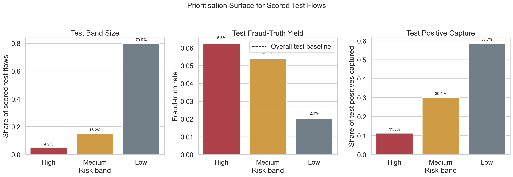
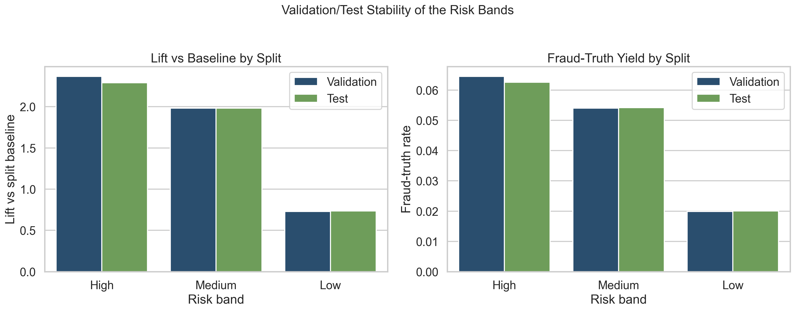
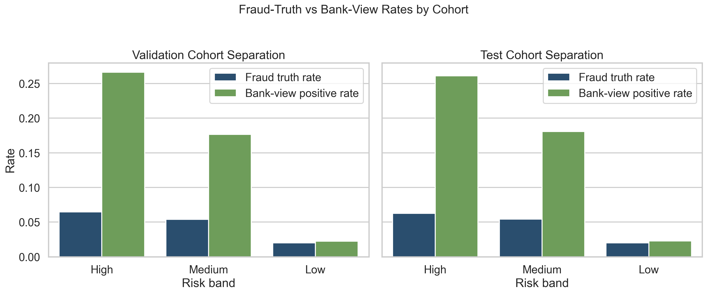
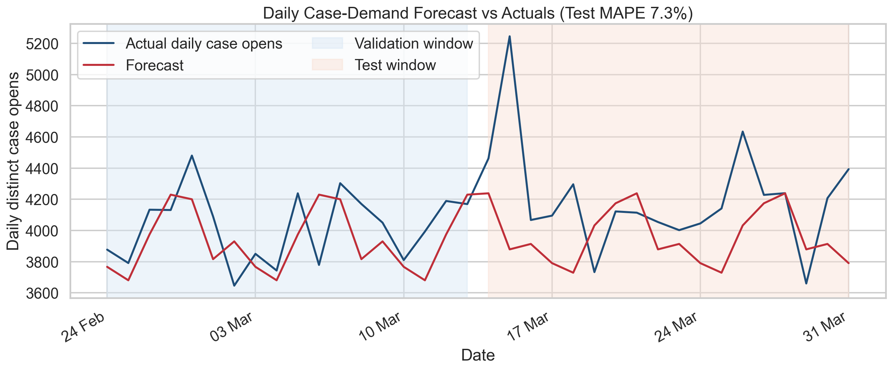

# Execution Report - Predictive Modelling Slice

As of `2026-04-03`

Purpose:
- record what was actually executed for the Midlands `Data Scientist` predictive-modelling slice
- preserve a truthful boundary between the bounded slice that was delivered and the wider analytics plane that remains out of scope
- package the saved facts, figures, and measured results into one outward-facing report for later claim-writing

Truth boundary:
- this execution was completed against a bounded governed local slice derived from `runs/local_full_run-7`
- the analytical unit was `flow_id`
- the execution used a 20-part aligned subset of the local governed surfaces, not the full run estate
- the work therefore supports a truthful claim about bounded predictive and statistical analytics delivery over governed fraud data
- it does not support a claim that the entire governed fraud world or full analytics plane has already been modelled

---

## 1. Executive Answer

The slice asked:

`which suspicious flows in this bounded governed universe should be prioritised because they are more likely to lead to authoritative fraud-confirmed outcomes, and what does that imply for near-term case demand?`

The bounded answer is:
- a flow-level risk stratification slice was built and evaluated at `flow_id` grain
- the `High` test band covered only `4.9%` of scored flows but achieved `6.26%` fraud-truth yield, or `2.29x` the overall test baseline
- the combined `High` and `Medium` queue covered `20.1%` of scored flows while capturing `41.3%` of all test positives at `2.06x` baseline yield
- the same cohorts preserved strong ordering against the secondary bank-view surface
- a bounded daily case-demand forecast was added with `7.31%` test `MAPE`

That means the slice delivered a real prioritisation surface rather than only a model metric.

## 2. Slice Summary

The slice executed was:

`flow-level risk stratification + cohort segmentation + a bounded daily case-demand forecast`

This was chosen because it allowed one compact but defensible delivery story under the Midlands `Data Scientist` requirement:
- build predictive and statistical logic in `SQL` and `Python`
- keep the work reproducible and bounded
- produce outputs that can be consumed as prioritisation surfaces rather than as private notebook analysis

The main target was:
- `s4_flow_truth_labels_6B.is_fraud_truth`

The main corroboration surface was:
- `s4_flow_bank_view_6B.is_fraud_bank_view`

The model and cohort work was built from the following local governed surfaces:
- `s2_flow_anchor_baseline_6B`
- `s4_flow_truth_labels_6B`
- `s4_flow_bank_view_6B`
- `s4_case_timeline_6B`

## 3. How This Maps To The Slice Plan

The execution stayed aligned to the original slice plan rather than drifting into broader analytics work.

The delivered scope maps back to the planned lens responsibilities as follows:
- `07 - Advanced Analytics and Data Science`: bounded target definition, feature shaping, probabilistic scoring, cohort banding, and daily demand forecasting
- `04 - Analytics Engineering and Analytical Data Product`: reusable SQL-built model base, scored outputs, cohort summary, and forecast-support tables
- `09 - Analytical Delivery Operating Discipline`: time-based splits, train-only feature encoding, saved SQL and Python logic, and bounded file-selection traceability
- `08 - Stakeholder Translation and Decision Influence`: prioritisation-ready high / medium / low cohorts, clear operating trade-offs, and compact reporting figures

The report therefore needs to be read as proof that the chosen slice was executed, not as proof that the whole analytics role has already been exhausted.

## 4. Execution Posture

The execution stayed SQL-first throughout.

The working discipline was:
- inspect schema and bounded aggregates in SQL first
- materialise a model-ready flow table in SQL
- materialise downstream cohort and forecast-support tables in SQL
- only then move the already-shaped bounded slice into Python for modelling and evaluation

This matters for the truth of the slice because the local governed run is large, and loading broad parquet surfaces into memory would have been the wrong analytical-delivery posture.

## 5. Bounded Build That Was Actually Executed

### 5.1 Model-base construction

A first model base was built from aligned bounded parquet parts and then expanded into a second version with train-only smoothed entity fraud-rate encodings.

Saved outputs:
- `flow_model_base_v1.parquet`
- `flow_model_base_v2.parquet`

The second version was the main modelling surface and contained:
- `2,073,369` full training rows
- `691,122` validation rows
- `691,122` test rows
- `17` model features

The final feature family included:
- amount and arrival-sequence transforms
- time features
- entity-frequency features
- train-only smoothed fraud-rate encodings for merchant, party, account, instrument, device, and IP

### 5.2 Modelling strategy

The first pass intentionally stayed narrow:
- one explainable probabilistic baseline in `Python`
- time-based train, validation, and test windows
- high / medium / low risk bands defined from the validation score distribution

The executed model was:
- `statsmodels` GLM binomial logistic model

That choice was pragmatic rather than ideological. The local environment did not have `scikit-learn`, so the slice used a stable available statistical implementation instead of widening scope into dependency installation or model-family churn.

### 5.3 Forecast strategy

The forecast path was only kept because it remained cheap and bounded.

The executed forecast surface was:
- daily distinct case opens linked back to the bounded model-flow universe

The final comparison tested:
- 7-day seasonal naive
- 7-day rolling mean
- weekday mean

The winning bounded model was:
- `weekday_mean`

## 6. Measured Results

### 6.1 Model discrimination

| Split | Rows | Positives | Positive Rate | ROC AUC | Average Precision |
| --- | ---: | ---: | ---: | ---: | ---: |
| Validation | 691,122 | 18,841 | 2.73% | 0.6268 | 0.0460 |
| Test | 691,122 | 18,888 | 2.73% | 0.6284 | 0.0461 |

These are bounded first-pass model scores, not a full optimisation programme. What matters here is that they remained stable across validation and test while still producing usable ranking separation downstream.

### 6.2 Test risk-band performance

| Risk Band | Rows | Positives | Fraud-Truth Rate | Lift vs Test Baseline | Positive Capture |
| --- | ---: | ---: | ---: | ---: | ---: |
| High | 33,951 | 2,125 | 6.26% | 2.29x | 11.25% |
| Medium | 104,808 | 5,682 | 5.42% | 1.98x | 30.08% |
| Low | 552,363 | 11,081 | 2.01% | 0.73x | 58.67% |

Operational meaning:
- the `High` band more than doubled fraud-truth yield against the overall test baseline
- the `Medium` band also remained materially above baseline
- the `Low` band concentrated lower-yield work as intended
- taken together, `High` and `Medium` represented only `20.1%` of scored test flows while capturing `41.3%` of test positives

### 6.3 Cohort corroboration against bank-view outcomes

The cohort separation also held against the secondary bank-view surface.

#### Validation

| Risk Band | Fraud-Truth Rate | Bank-View Positive Rate |
| --- | ---: | ---: |
| High | 6.46% | 26.65% |
| Medium | 5.40% | 17.67% |
| Low | 1.99% | 2.25% |

#### Test

| Risk Band | Fraud-Truth Rate | Bank-View Positive Rate |
| --- | ---: | ---: |
| High | 6.26% | 26.13% |
| Medium | 5.42% | 18.08% |
| Low | 2.01% | 2.29% |

This matters because the risk bands were not only separating on the primary fraud-truth target. They were also preserving a strong ordering against an adjacent operational comparison surface.

### 6.4 Bounded case-demand forecast

The daily case-open surface covered `2026-01-01` to `2026-03-31` with `90` daily observations.

The selected bounded forecast model was:
- `weekday_mean`

| Evaluation Split | MAE | RMSE | MAPE |
| --- | ---: | ---: | ---: |
| Validation | 188.1 | 220.7 | 4.67% |
| Test | 321.8 | 447.1 | 7.31% |

This is a lightweight planning signal, not a production-grade forecasting estate. Its value in the slice is that it extends the work beyond risk scoring into a bounded near-term operational planning surface without dragging the scope into a large forecasting programme.

## 7. Figures

### 7.1 Flow risk-band performance

Interpretation:
- the first panel makes the queue-size trade-off explicit: only `4.9%` of test flows fell into `High`, while `79.9%` remained in `Low`
- the second panel shows that `High` and `Medium` both sit materially above the overall test fraud-truth baseline
- the third panel shows why the bands are still a prioritisation surface rather than a magic filter: most positives remain in `Low` because it is the largest pool, so the operating decision is about yield improvement within limited review capacity

### 7.2 Validation/test stability of the risk bands

Interpretation:
- the validation and test lifts are closely aligned across all three bands
- the yield ordering also remains stable between splits
- this is important because it shows that the bands were not only created by chance on one window

### 7.3 Fraud-truth and bank-view cohort separation

Interpretation:
- ordering is preserved in both validation and test
- the gap between `High` and `Low` is large on both the primary and secondary surfaces
- this makes the cohort story easier to defend in stakeholder language than a single model-score metric alone

### 7.4 Daily case-demand forecast

Interpretation:
- the figure now separates validation and test windows directly, so the reader can see what part of the line supported model choice and what part supported final evaluation
- the bounded forecast tracks broad demand rhythm reasonably well
- it is useful as a lightweight planning aid for the same scored flow universe
- it should not be represented as a mature forecasting product

## 8. Delivery Outputs Produced

Execution logic:
- SQL shaping pack under `artefacts/analytics_slices/.../sql`
- modelling scripts under `artefacts/analytics_slices/.../models`

Compact evidence:
- metric summaries under `artefacts/analytics_slices/.../metrics`
- bounded source-file selection in `bounded_file_selection.json`
- figure pack under `artefacts/analytics_slices/.../figures`

Key machine-readable outputs:
- scored validation and test surfaces
- risk-band cohort summary
- daily case-open series
- case-demand forecast comparison series

## 9. What This Slice Supports Claiming

This slice supports truthful statements such as:
- built a bounded predictive and statistical analytics slice over governed fraud data using `SQL` and `Python`
- created a reusable model-ready flow table and scored output surface at `flow_id` grain
- defined interpretable high / medium / low risk cohorts that materially improved fraud-truth yield in the upper bands
- packaged a bounded daily case-demand forecast for short-range operational planning

The slice does not support claiming that:
- a live production scoring service was deployed
- the whole fraud platform was analytically modelled
- the full governed world was profiled or scored
- a broad forecasting platform or dashboard estate was implemented

## 10. Candidate Resume Claim Surfaces

This section should be read as a response to the Midlands responsibility, not as a generic project summary.

The responsibility asks for someone who can:
- develop predictive and statistical models in a real delivery setting
- use tools such as `Python`, `R`, and `SQL`
- apply those models to forecasting, segmentation, risk identification, or service improvement
- make the outputs usable beyond exploratory analysis

The claim therefore needs to answer:
- I have done that kind of work
- here is the measured evidence
- here is how I delivered it in a production-usable analytical form

### 10.1 Flagship `X by Y by Z` claim

> Developed and operationalised predictive and statistical fraud-prioritisation outputs for service decision-making, as measured by `2.29x` fraud-truth yield in the highest-risk test band, `41.3%` capture of all test positives within the top `20.1%` of scored flows, and `7.31%` test `MAPE` on bounded daily case-demand forecasting, by shaping reusable governed `flow_id` model-base tables in `SQL`, building flow-level risk stratification and cohort segmentation in `Python`, and packaging the outputs into production-usable prioritisation and planning artefacts.

### 10.2 Stronger risk-identification version

> Improved operational risk identification and short-range case planning, as measured by materially higher fraud-truth yield in `High` and `Medium` cohorts (`2.29x` and `1.98x` baseline respectively) and stable validation/test band performance, by developing a bounded predictive and statistical modelling workflow over governed multi-source fraud data using `SQL` and `Python`, with reusable scoring, segmentation, and cohort outputs for downstream use.

### 10.3 Shorter recruiter-facing version

> Built production-usable predictive, segmentation, and forecasting analytics over governed fraud data, as measured by `6.26%` fraud-truth yield in the highest-risk band versus a `2.73%` overall baseline and `7.31%` test forecasting `MAPE`, by creating leak-safe model-ready datasets in `SQL`, applying statistical risk scoring and cohorting in `Python`, and translating the outputs into prioritisation surfaces and planning-ready evidence.

### 10.4 Framing note

For this role, `operationalised` is safer than `deployed`.

That preserves the truth boundary:
- the slice produced reusable scoring, cohort, and planning outputs
- the slice did not create a live scoring API or full production deployment surface

## 11. Next Best Follow-on Work

The strongest next extension would be:
- convert the bounded score and cohort outputs into a more explicit decision brief
- add a compact lineage and caveat pack
- decide whether the next responsibility slice should deepen this lane or move to a different Midlands requirement

The correct next step is not:
- to overclaim this bounded slice as if the entire analytics plane is complete
