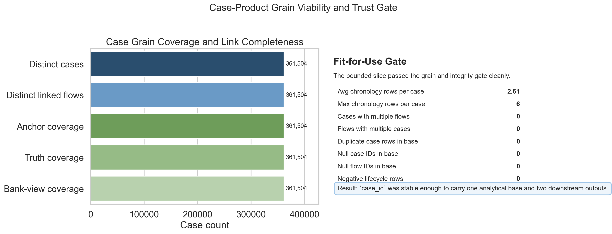
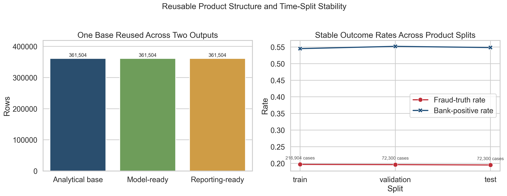
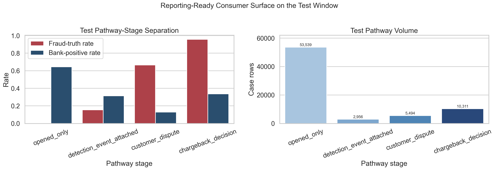

# Execution Report - Case Analytics Product Slice

As of `2026-04-03`

Purpose:
- record what was actually executed for the Midlands `Data Scientist` analytical-data-product slice
- keep the delivered evidence tied to the approved slice definition rather than drifting back into a modelling-first story
- package the bounded facts into one outward-facing report for later claim-writing

Truth boundary:
- this execution was completed against a bounded governed local slice derived from `runs/local_full_run-7`
- the proof object was a case-centric analytical preparation layer at `case_id` grain
- the execution used a 20-part aligned subset of the governed surfaces, not the full run estate
- the work therefore supports a truthful claim about designing and maintaining reusable analytical datasets, transformations, and reproducible workflows over governed fraud data
- it does not support a claim that the full platform-wide analytical product estate has already been built

---

## 1. Executive Answer

The slice asked:

`can a bounded governed case-centric preparation layer be engineered so that one stable analytical base feeds both model-ready and reporting-ready downstream use, with explicit trust, lineage, and regeneration evidence?`

The bounded answer is:
- a case-grain analytical product was successfully built and validated over `361,504` bounded cases
- the intended `case_id` grain stayed stable, with `0` null critical keys, `0` duplicate case rows after transformation, and `0` cases linked to multiple flows within the bounded slice
- one analytical base was reused to produce both `case_model_ready_v1` and `case_reporting_ready_v1`, each preserving `361,504` rows and `361,504` distinct case IDs
- the trust pack stayed clean, with `0` negative lifecycle rows and full non-null target and bank-view coverage across the engineered product
- the engineered reporting-ready output supported a real downstream consumer, with pathway stages showing large and stable fraud-truth separation across train, validation, and test

That means the slice delivered a reusable analytical preparation layer rather than only a one-off transformation exercise.

## 2. Slice Summary

The slice executed was:

`case-centric analytical preparation layer with one model-ready output and one reporting-ready output`

This was chosen because it answered the second Midlands responsibility directly:
- design or maintain analytical datasets, pipelines, and transformations
- make analysis production-usable rather than ad hoc
- keep the workflow reproducible, versioned, and handover-safe
- prove the product supports real downstream analysis without turning the slice into another full modelling programme

The primary proof object was:
- `case_analytics_product_v1`

The downstream outputs were:
- `case_model_ready_v1`
- `case_reporting_ready_v1`

The bounded source chain used was:
- `s4_case_timeline_6B`
- `s2_flow_anchor_baseline_6B`
- `s4_flow_truth_labels_6B`
- `s4_flow_bank_view_6B`

## 3. How This Maps To The Slice Plan

The execution stayed aligned to the approved slice plan rather than expanding the first predictive-modelling slice.

The delivered scope maps back to the planned lens responsibilities as follows:
- `04 - Analytics Engineering and Analytical Data Product`: one stable case-grain analytical base, one model-ready output, and one reporting-ready output
- `09 - Analytical Delivery Operating Discipline`: versioned SQL and script workflow, explicit regeneration path, documented join rules, and bounded file-selection traceability
- `03 - Data Quality, Governance, and Trusted Information Stewardship`: grain-verification gate, reconciliation checks, key coverage checks, authoritative-source rules, and usage boundaries
- `07 - Advanced Analytics and Data Science`: one light downstream analytical consumer proving the product supports real segmentation and prioritisation thinking

This report therefore needs to be read as evidence that the analytical-product responsibility was executed in a bounded way, not as evidence that the whole analytics plane has already been engineered.

## 4. Execution Posture

The execution stayed SQL-first and product-first throughout.

The working discipline was:
- verify the intended `case_id` grain before building the product chain
- materialise the chronology rollup in SQL
- materialise the analytical base in SQL
- split the base into model-ready and reporting-ready outputs in SQL
- use Python only as a light build and regeneration orchestrator, not as the primary preparation surface

This matters for the truth of the slice because the responsibility was about analytical datasets, transformations, and reproducible workflows, not about loading broad datasets into memory or proving only a model.

## 5. Bounded Build That Was Actually Executed

### 5.1 Grain-verification gate

The first gate tested whether `case_id` could honestly support the slice as its natural product grain.

Observed bounded-slice result:

| Metric | Value |
| --- | ---: |
| Distinct cases | 361,504 |
| Distinct linked flows | 361,504 |
| Null `case_id` rows | 0 |
| Null `flow_id` rows | 0 |
| Average chronology rows per case | 2.61 |
| Maximum chronology rows per case | 6 |
| Cases with multiple linked flows | 0 |
| Flows with multiple linked cases | 0 |

This was the critical early gate for the whole slice. In the bounded governed subset, `case_id` behaved cleanly enough to carry the product.

### 5.2 Product chain build

The executed product chain was:
1. profile case chronology and linkage
2. roll chronology into `case_chronology_rollup_v1`
3. attach flow context and outcomes into `case_analytics_product_v1`
4. split that base into:
- `case_model_ready_v1`
- `case_reporting_ready_v1`

Saved outputs:
- `case_chronology_rollup_v1.parquet`
- `case_analytics_product_v1.parquet`
- `case_model_ready_v1.parquet`
- `case_reporting_ready_v1.parquet`

The core product contract held:
- one bounded analytical base
- two distinct downstream consumers
- one shared governed transformation chain

### 5.3 Reproducibility and handover pack

The execution also produced the pack needed to keep the slice reusable rather than private:
- `models/build_case_analytics_product.py`
- `README_regeneration_v1.md`
- `case_product_lineage_notes_v1.md`
- `case_product_fit_for_use_checks_v1.md`
- `case_product_consumer_summary_v1.md`

That means the slice did not stop at generated tables. It also produced the regeneration and interpretation layer required by the responsibility.

## 6. Measured Results

### 6.1 Product reuse across downstream outputs

The strongest first proof for this requirement is reuse.

| Output | Rows | Distinct Case IDs |
| --- | ---: | ---: |
| `case_analytics_product_v1` | 361,504 | 361,504 |
| `case_model_ready_v1` | 361,504 | 361,504 |
| `case_reporting_ready_v1` | 361,504 | 361,504 |

Operational meaning:
- one engineered analytical base successfully fed two downstream products
- the split did not introduce row loss or duplicate-case expansion
- the product therefore behaved like a reusable preparation layer rather than a one-off extract

### 6.2 Trust and fit-for-use checks

The second proof surface for this requirement is trust.

| Check | Value |
| --- | ---: |
| Duplicate case rows in analytical base | 0 |
| Null `case_id` rows in analytical base | 0 |
| Null `flow_id` rows in analytical base | 0 |
| Negative lifecycle rows | 0 |
| Non-null target rows | 361,504 |
| Non-null bank-view rows | 361,504 |
| Cases with all linked flows present in anchor | 361,504 |
| Cases with all linked flows present in truth | 361,504 |
| Cases with all linked flows present in bank view | 361,504 |

This matters because the analytical product is only claimable if its grain, linkage, and outcome attachment are defensible. In this bounded slice, those checks stayed clean.

### 6.3 Product split stability

The downstream products were partitioned by time-ordered deciles over `case_opened_ts_utc` and `case_id`, then grouped into train, validation, and test splits.

The date ranges below are observed open-date spans within each split, not hard date-boundary rules. Because the split logic is timestamp-ordered at case level, adjacent splits can share the same calendar date.

| Split | Case Rows | Observed Open-Date Span | Fraud-Truth Rate | Bank-Positive Rate |
| --- | ---: | --- | ---: | ---: |
| Train | 216,904 | `2026-01-01` to `2026-02-24` | 19.69% | 54.51% |
| Validation | 72,300 | `2026-02-24` to `2026-03-14` | 19.62% | 55.19% |
| Test | 72,300 | `2026-03-14` to `2026-03-31` | 19.51% | 54.83% |

This is useful because it shows the product stayed stable enough to support bounded downstream use over time rather than only one collapsed snapshot.

### 6.4 Downstream analytical consumer proof

The third proof surface for this requirement is that the engineered product actually supports real analysis.

The chosen light consumer was:
- pathway-stage segmentation over `case_reporting_ready_v1`

#### Test split pathway summary

| Pathway Stage | Case Rows | Fraud-Truth Rate | Bank-Positive Rate |
| --- | ---: | ---: | ---: |
| `opened_only` | 53,539 | 0.23% | 64.50% |
| `chargeback_decision` | 10,311 | 95.79% | 33.64% |
| `customer_dispute` | 5,494 | 66.49% | 12.94% |
| `detection_event_attached` | 2,956 | 15.36% | 31.43% |

Interpretation:
- `opened_only` is the largest pool but is very low fraud-truth yield
- `chargeback_decision` is the highest-yield pathway stage by a large margin
- `customer_dispute` is also materially elevated relative to `opened_only`
- the pathway-stage ordering is preserved across train, validation, and test

That is enough to prove the engineered product supports downstream segmentation and prioritisation thinking without turning the slice back into a full predictive programme.

## 7. Figures

### 7.1 Case-grain viability and trust gate

Interpretation:
- the left panel shows that distinct cases, linked flows, and full linked-source coverage all align at `361,504`
- the right panel makes the integrity story explicit: no duplicate case rows, no null critical keys, no negative lifecycle rows, and no multi-flow case expansion in the bounded slice
- this is the figure that justifies using `case_id` as the product grain for this slice rather than treating that as an assumption

### 7.2 Reusable product structure and split stability

Interpretation:
- the left panel shows that one analytical base was reused cleanly across both downstream outputs with no row loss
- the right panel shows that fraud-truth and bank-positive rates stay stable across train, validation, and test windows, which matters for downstream reuse
- together, this figure tells the real story of the slice: not only that data was shaped, but that the shaped product was structurally reusable and temporally stable enough for bounded analytical use

### 7.3 Reporting-ready consumer surface

Interpretation:
- the left panel shows the downstream analytical value of the reporting-ready surface: pathway stages separate sharply on fraud-truth and bank-positive rates
- the right panel keeps the volume trade-off visible, showing that `opened_only` is the largest but lowest-yield pool while `chargeback_decision` is much smaller and materially higher yield
- this is enough to prove that the engineered product supports real downstream segmentation and prioritisation thinking without turning the slice back into another modelling programme

## 8. Delivery Outputs Produced

Execution logic:
- SQL shaping pack under `artefacts/analytics_slices/.../sql`
- product build script under `artefacts/analytics_slices/.../models`

Compact evidence:
- profiling and fit-check summaries under `artefacts/analytics_slices/.../metrics`
- bounded source-file selection in `bounded_file_selection.json`
- lineage, trust, consumer, and regeneration notes in the slice artefact root

Key machine-readable outputs:
- `case_chronology_rollup_v1.parquet`
- `case_analytics_product_v1.parquet`
- `case_model_ready_v1.parquet`
- `case_reporting_ready_v1.parquet`
- `case_product_consumer_summary_v1.parquet`
- `case_product_pathway_summary_v1.parquet`

## 9. What This Slice Supports Claiming

This slice supports truthful statements such as:
- built a reusable case-centric analytical preparation layer over governed fraud data
- produced one stable analytical base reused across both model-ready and reporting-ready outputs
- validated the product grain, join chain, and outcome attachment with clean bounded-slice trust checks
- packaged the product with versioned build logic, lineage notes, fit-for-use checks, and regeneration guidance
- proved the reporting-ready output supports real downstream segmentation and prioritisation analysis

The slice does not support claiming that:
- a full platform-wide analytical product estate now exists
- the observed one-case-to-one-flow shape is a whole-world invariant
- a live production service or dashboard estate was deployed
- every analytical consumer for the case product has already been built

## 10. Candidate Resume Claim Surfaces

This section should be read as a response to the Midlands responsibility, not as a generic project summary.

The responsibility asks for someone who can:
- design or maintain analytical datasets, pipelines, transformations, and reproducible workflows
- make analysis production-usable rather than ad hoc
- keep the preparation layer documented, versioned, and reusable

The claim therefore needs to answer:
- I have done that kind of work
- here is the measured evidence
- here is how the product was made reusable and trustworthy

### 10.1 Flagship `X by Y by Z` claim

> Built a reusable case-centric analytical preparation layer for downstream fraud modelling and reporting, as measured by successful reuse across model-ready and reporting-ready outputs over `361,504` bounded cases, zero duplicate case rows or null critical keys after transformation, and stable pathway-stage separation from train through test, by designing a governed case analytics product that linked chronology, flow context, authoritative fraud truth, and bank-view outcomes into stable SQL-shaped products with documented lineage, fit-for-use checks, and regeneration guidance.

### 10.2 Shorter recruiter-facing version

> Built a reusable analytical data product for downstream modelling and reporting, as measured by validated join consistency, full target and outcome coverage across `361,504` bounded cases, and reuse across multiple analytical outputs, by shaping governed multi-source fraud data into stable case-grain views, documented model-ready slices, and reporting-ready analytical tables.

### 10.3 Closest direct response to the requirement

> Made analysis production-usable, as measured by reusable model-ready and reporting-ready datasets, documented transformation logic and lineage, and clean fit-for-use checks across a bounded governed case product, by designing and maintaining a reproducible analytical preparation layer over linked case chronology, flow context, and outcome surfaces.

### 10.4 Framing note

For this role, `built` and `made production-usable` are safer than `deployed`.

That preserves the truth boundary:
- the slice produced a reusable analytical product and regeneration path
- the slice did not create a live application surface

## 11. Next Best Follow-on Work

The strongest next extension would be:
- translate the report and figures into the final outward-facing claim wording you want to carry into resume bullets
- decide whether the next Midlands responsibility should move to another distinct proof object rather than deepen the same case-product lane

The correct next step is not:
- to overclaim this bounded product slice as if the whole analytical engineering plane is complete
