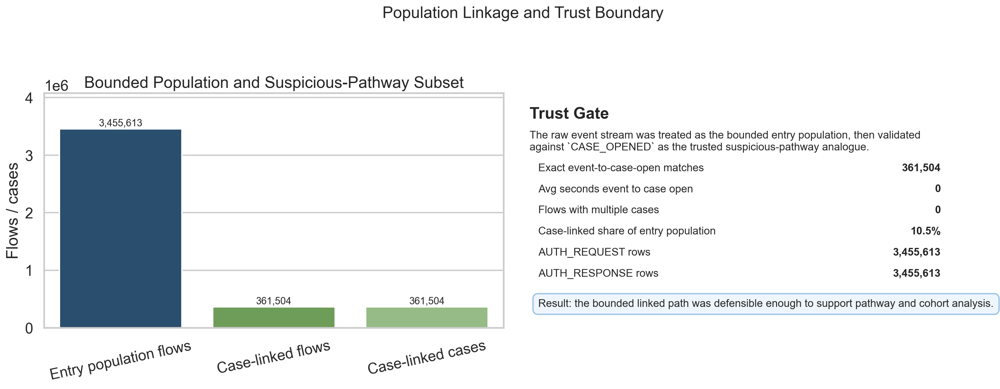
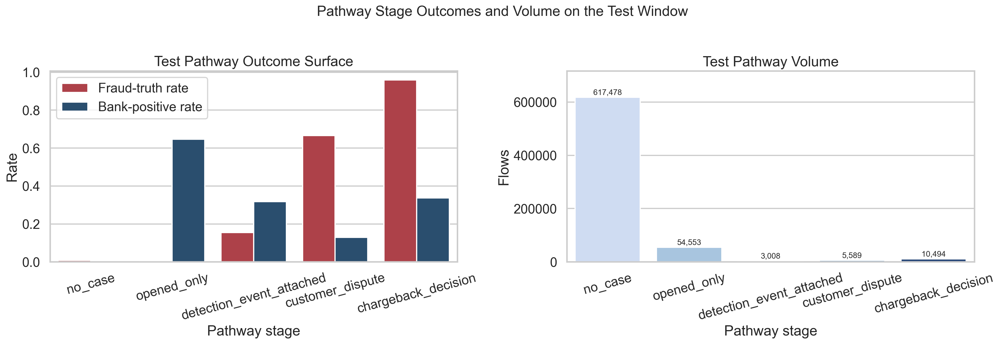
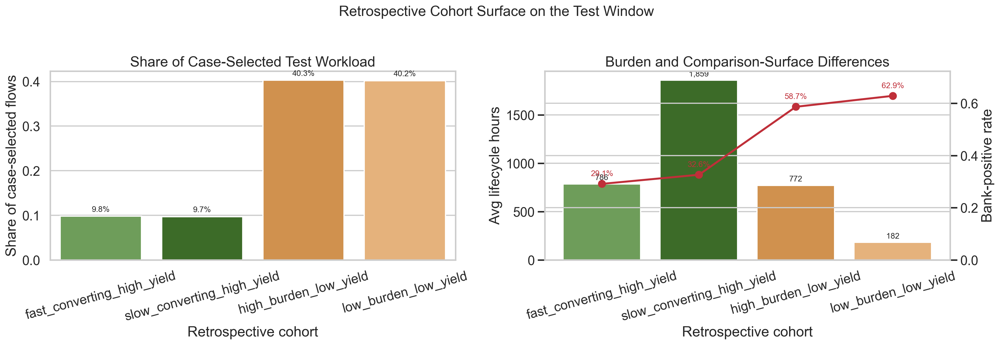

# Execution Report - Population Pathway Analysis Slice

As of `2026-04-03`

Purpose:
- record what was actually executed for the Midlands `Data Scientist` population-pathway slice
- preserve a truthful boundary between the bounded linked slice that was delivered and the wider analytics plane that remains out of scope
- package the saved facts, pathway outputs, and measured results into one outward-facing report for later claim-writing

Truth boundary:
- this execution was completed against a bounded governed local slice derived from `runs/local_full_run-7`
- the base analytical unit was `flow_id`
- the execution used a 20-part aligned subset of the local governed surfaces, not the full run estate
- the slice therefore supports a truthful claim about linked population, cohort, pathway, and outcome analysis over governed fraud data
- it does not support a claim that a full PHM-style population-analytics estate or whole-platform linked analytical layer has already been implemented

---

## 1. Executive Answer

The slice asked:

`can a bounded governed fraud population be read as a linked pathway from entry flow to case progression to outcome, with enough source discipline to support trustworthy cohort and pathway analysis?`

The bounded answer is:
- a trusted linked population-and-pathway slice was built over `3,455,613` bounded flows
- `361,504` flows formed the case-linked suspicious-pathway subset, with exact timestamp alignment between first event and `CASE_OPENED` and `0` multi-case linkage defects in the bounded slice
- one canonical linked base successfully fed cohort, pathway, KPI, and operating-problem outputs from the same governed definition set
- the test population showed `10.66%` suspicious-pathway selection and `89.34%` `no_case` flows
- inside the case-selected workload, low-yield cohorts dominated volume: `80.4%` of case-selected test flows sat in `high_burden_low_yield` or `low_burden_low_yield`
- the strongest operating pressure point was `high_burden_low_yield`, with `29,675` test flows, `0%` fraud-truth yield, and `771.6` average lifecycle hours
- the strongest counterweight was `slow_converting_high_yield`, with `7,156` test flows, `100%` fraud-truth yield, and `1,858.9` average lifecycle hours

That means the slice delivered a real linked population and pathway reading rather than only a segmented table or another model exercise.

## 2. Slice Summary

The slice executed was:

`linked population, cohort, and pathway analysis over one bounded suspicious-pathway analogue`

This was chosen because it allowed one compact but defensible response to the Midlands requirement:
- work with linked data rather than isolated tables
- identify and compare cohorts at population level
- read the pathway from entry to case progression to outcome
- keep source meaning, authoritative fields, and reporting consistency explicit

The primary proof object was:
- `population_pathway_analysis_v1`

The linked governed surfaces used were:
- `s2_event_stream_baseline_6B`
- `s2_flow_anchor_baseline_6B`
- `s4_case_timeline_6B`
- `s4_flow_truth_labels_6B`
- `s4_flow_bank_view_6B`

## 3. How This Maps To The Slice Plan

The execution stayed aligned to the approved slice plan rather than collapsing into either the predictive-modelling slice or the analytical-product slice.

The delivered scope maps back to the planned lens responsibilities as follows:
- `03 - Data Quality, Governance, and Trusted Information Stewardship`: source meaning, authoritative-source rules, join validation, exact event-to-case-open alignment checks, fit-for-use pack, and usage-boundary notes
- `07 - Advanced Analytics and Data Science`: linked population definition, cohort framework, pathway and outcome comparisons, and compact analytical summaries
- `01 - Operational Performance Analytics`: suspicious-pathway selection rate, pathway-stage reading, low-yield burden concentration, and one explicit operating problem statement
- `04 - Analytics Engineering and Analytical Data Product`: one reusable linked base and compact downstream outputs for cohort, pathway, KPI, and problem-summary use

The report therefore needs to be read as proof that the chosen linked population slice was executed, not as proof that the entire governance-heavy population-analysis responsibility has already been exhausted.

## 4. Execution Posture

The execution stayed trust-first and SQL-first throughout.

The working discipline was:
- inspect the event, flow, case, and outcome surfaces in SQL first
- test whether the raw event stream itself was a valid suspicious-entry surface
- adapt the population definition when the event stream proved to be a general transaction-entry surface rather than an explicit suspicion-labelled feed
- materialise the linked base in SQL
- materialise the cohort, pathway, KPI, and operating-problem outputs in SQL
- use Python only as a reproducible runner and compact fact-pack generator

This matters for the truth of the slice because the requirement is partly about data meaning and governance discipline, not only about producing an interesting segmentation.

## 5. Bounded Build That Was Actually Executed

### 5.1 Trust-gate finding and posture change

The first trust gate showed that `s2_event_stream_baseline_6B` was not itself a clean suspicious-label surface.

Observed bounded-slice result:

| Metric | Value |
| --- | ---: |
| Event rows | 6,911,226 |
| Event distinct flows | 3,455,613 |
| `AUTH_REQUEST` rows | 3,455,613 |
| `AUTH_RESPONSE` rows | 3,455,613 |
| Case distinct flows | 361,504 |
| Case distinct cases | 361,504 |

That meant the correct posture was:
- treat the event stream as the bounded entry population
- treat the `CASE_OPENED` subset as the trusted suspicious-pathway analogue

That adaptation was then validated:

| Metric | Value |
| --- | ---: |
| Linked event-to-case flows | 361,504 |
| Exact event-to-`CASE_OPENED` timestamp matches | 361,504 |
| Average seconds from first event to `CASE_OPENED` | 0 |
| Flows with multiple cases | 0 |

That was the key engineering decision in the slice. It kept the population story honest instead of pretending the raw event feed contained a richer suspicion state than it actually did.

### 5.2 Linked base construction

The executed linked base was:
- `population_pathway_base_v1`

It joined:
- event-entry timing
- flow context
- case chronology and progression
- authoritative truth outcome
- comparison-only bank-view outcome

The resulting bounded base contained:
- `3,455,613` rows
- `3,455,613` distinct `flow_id`
- `0` duplicate flow rows
- `0` null `flow_id`
- `361,504` case-selected flows
- `0` case-selected flows missing `case_id`

### 5.3 Cohort and pathway output family

The linked base then fed:
- `population_cohort_metrics_v1`
- `population_pathway_reporting_v1`
- `population_pathway_kpis_v1`
- `population_pathway_problem_summary_v1`

The cohort family used in the bounded slice was:
- `fast_converting_high_yield`
- `slow_converting_high_yield`
- `high_burden_low_yield`
- `low_burden_low_yield`

This is important to read correctly:
- these cohorts are retrospective analytical cohorts built from outcome and lifecycle behaviour
- they are not live triage bands or a prospective production segmentation policy

## 6. Measured Results

### 6.1 Linked coverage and fit-for-use

The strongest first proof for this requirement is trusted linkage.

| Check | Value |
| --- | ---: |
| Event flows with anchor | 3,455,613 |
| Event flows with truth | 3,455,613 |
| Event flows with bank-view | 3,455,613 |
| Event flows with case | 361,504 |
| Case flows with truth | 361,504 |
| Case flows with bank-view | 361,504 |
| Duplicate flow rows in linked base | 0 |
| Null `flow_id` rows in linked base | 0 |

This matters because the slice is only claimable if the linked population can be defined cleanly and joined consistently across the governed surfaces.

### 6.2 Population-level KPI reading

The linked population base was partitioned by time-ordered deciles over `first_event_ts_utc` and `flow_id`, then grouped into train, validation, and test splits.

| Split | Population Flows | Case-Selected Flows | Case-Selection Rate | Fraud-Truth Rate | Bank-Positive Rate |
| --- | ---: | ---: | ---: | ---: | ---: |
| Train | 2,073,369 | 215,198 | 10.38% | 2.68% | 5.66% |
| Validation | 691,122 | 72,662 | 10.51% | 2.73% | 5.79% |
| Test | 691,122 | 73,644 | 10.66% | 2.73% | 5.86% |

Operational meaning:
- the entry population is large, but only about one in ten flows enters the suspicious-pathway subset
- the split-level rates remain stable enough to support bounded comparison
- the slice therefore works as a population and pathway reading, not only as a single-window snapshot

### 6.3 Pathway-stage outcome differences

The pathway-stage summary makes the linked service-pathway analogue visible.

#### Test split

| Pathway Stage | Flow Rows | Case-Selection Rate | Fraud-Truth Rate | Bank-Positive Rate | Avg Lifecycle Hours |
| --- | ---: | ---: | ---: | ---: | ---: |
| `no_case` | 617,478 | 0.0% | 0.73% | 0.0% | n/a |
| `opened_only` | 54,553 | 100.0% | 0.23% | 64.62% | 451.3 |
| `detection_event_attached` | 3,008 | 100.0% | 15.43% | 31.78% | 543.2 |
| `customer_dispute` | 5,589 | 100.0% | 66.58% | 12.88% | 912.5 |
| `chargeback_decision` | 10,494 | 100.0% | 95.83% | 33.74% | 1,514.5 |

Interpretation:
- `opened_only` is large but very low truth yield
- `customer_dispute` and especially `chargeback_decision` are materially higher-yield pathway stages
- lifecycle burden increases sharply as the pathway progresses
- this is the closest analogue in the fraud platform to a service-pathway and outcome reading

### 6.4 Cohort differentiation

The compact cohort family separates burden and outcome value clearly inside the case-selected workload.

#### Test split

| Cohort | Flow Rows | Fraud-Truth Rate | Bank-Positive Rate | Avg Lifecycle Hours |
| --- | ---: | ---: | ---: | ---: |
| `fast_converting_high_yield` | 7,212 | 100.0% | 29.15% | 785.9 |
| `slow_converting_high_yield` | 7,156 | 100.0% | 32.64% | 1,858.9 |
| `high_burden_low_yield` | 29,675 | 0.0% | 58.69% | 771.6 |
| `low_burden_low_yield` | 29,601 | 0.0% | 62.88% | 181.7 |

Important reading note:
- because yield is part of the retrospective cohort definition, these cohort truth rates are structural rather than surprising
- the value of the cohort framework is therefore not “discovering” truth separation
- the value is exposing how burden, timing, and downstream comparison surfaces differ across analytically meaningful pathway groups

### 6.5 Operating problem surfaced by the slice

The slice identified one clear operating problem in the test window.

The test case-selected workload is dominated by low-yield cohorts:
- `high_burden_low_yield`: `29,675` flows
- `low_burden_low_yield`: `29,601` flows
- combined share of case-selected test flows: `80.4%`

The main pressure point is:
- `high_burden_low_yield`
- `29,675` flows
- `0%` fraud-truth yield by construction of the retrospective cohort
- `771.6` average lifecycle hours

The main counterweight is:
- `slow_converting_high_yield`
- `7,156` flows
- `100%` fraud-truth yield by construction of the retrospective cohort
- `1,858.9` average lifecycle hours

That gives a clear bounded operating question:
- should effort first reduce long-running low-yield burden, or accelerate the much smaller but higher-value slow-converting cohort?

## 7. Figures

The figure pack was added to make the linked population, pathway, and cohort story legible at a glance without changing the truth boundary of the slice.

### 7.1 Population linkage and trust gate

This figure carries the governance-heavy part of the requirement:
- the raw event stream is shown as the bounded entry population, not as an explicit suspicion-labelled source
- the suspicious-pathway analogue is shown as the `CASE_OPENED`-linked subset
- exact event-to-case-open alignment across `361,504` linked flows and `0` multi-case defects makes the bounded linked path defensible enough for cohort and pathway analysis

### 7.2 Test pathway stage surface

This figure carries the pathway-and-outcome part of the requirement:
- `opened_only` is high-volume but low truth yield
- `customer_dispute` and `chargeback_decision` are much smaller but materially higher-yield stages
- the stage mix therefore reads as a real workflow and outcome surface rather than only a linked table

### 7.3 Retrospective cohort burden and value surface

This figure carries the cohort-differentiation and operating-problem part of the slice:
- low-yield cohorts account for `80.4%` of case-selected test workload
- `high_burden_low_yield` combines heavy volume with long lifecycle burden
- `slow_converting_high_yield` is much smaller but materially slower and higher-value
- that makes the burden-versus-value trade-off visible without pretending these retrospective cohorts are live production bands

## 8. Delivery Outputs Produced

Execution logic:
- SQL shaping pack under `artefacts/analytics_slices/.../sql`
- build runner under `artefacts/analytics_slices/.../models`

Compact evidence:
- profiling and fit-check summaries under `artefacts/analytics_slices/.../metrics`
- bounded source-file selection in `bounded_file_selection.json`
- vocabulary, trusted-source, cohort, lineage, fit-for-use, operating, and regeneration notes in the slice artefact root

Key machine-readable outputs:
- `population_pathway_base_v1.parquet`
- `population_cohort_metrics_v1.parquet`
- `population_pathway_reporting_v1.parquet`
- `population_pathway_kpis_v1.parquet`
- `population_pathway_problem_summary_v1.parquet`

## 9. What This Slice Supports Claiming

This slice supports truthful statements such as:
- built a governed linked population and pathway analysis layer over fraud data
- defined and validated a bounded flow population with a trusted suspicious-pathway subset
- linked event, flow, case, and outcome surfaces into one canonical analytical base
- reused one consistent set of population, cohort, pathway, and KPI definitions across multiple outputs
- surfaced a real operating problem around low-yield burden concentration and slow high-value resolution

The slice does not support claiming that:
- the raw event stream is itself an explicit suspicion-labelled feed
- the retrospective cohorts are live production segmentation rules
- the whole platform now has a complete population-health analytics layer
- a live operational service or dashboard estate was deployed

## 10. Candidate Resume Claim Surfaces

This section should be read as a response to the Midlands requirement, not as a generic project summary.

The requirement asks for someone who can:
- perform population-level analysis over linked data
- identify and compare cohorts
- analyse pathways and outcomes
- understand data meaning, reporting consistency, and governance-correct use of linked data

The claim therefore needs to answer:
- I have done that kind of population-level linked-data work
- here is the measured evidence
- here is how the trust, source-meaning, and reporting-consistency layer was handled

### 10.1 Flagship `X by Y by Z` claim

> Delivered population-level cohort, pathway, and outcome analysis over linked governed fraud data, as measured by successful linkage of `5` governed data surfaces into one canonical population view, exact event-to-`CASE_OPENED` alignment across `361,504` linked flows with zero multi-case linkage defects, and identification of an operating burden pattern in which `80.4%` of case-selected test workload sat in low-yield cohorts, by defining a trusted bounded population, validating authoritative-source and join rules, and packaging consistent cohort, pathway, and KPI outputs over event, flow, case, and outcome data.

### 10.2 Governance-heavier version

> Applied governance-correct linked-data analysis to population, cohort, and pathway questions, as measured by clean multi-surface join coverage, zero duplicate flow rows in the linked base, and reuse of one canonical set of population, cohort, and KPI definitions across reporting outputs, by building a bounded governed fraud population slice with explicit source vocabulary, authoritative-field rules, fit-for-use checks, reconciliation controls, and reporting-ready summaries.

### 10.3 Shorter recruiter-facing version

> Performed linked population, cohort, pathway, and outcome analysis over governed fraud data, as measured by trusted multi-surface linkage, stable reuse of one cohort and KPI definition set, and clear differentiation in burden and outcome patterns across segments, by combining event, flow, case, and outcome surfaces into reusable analytical views and action-oriented operational summaries.

### 10.4 Framing note

For this role, `built`, `delivered`, and `packaged` are safer than `deployed`.

That preserves the truth boundary:
- the slice produced a reusable linked analytical pack and operating interpretation
- the slice did not create a live service

## 11. Next Best Follow-on Work

The strongest next extension would be:
- tighten the final claim wording for the exact resume bullet you want to carry forward
- test whether a pre-outcome cohort framework can preserve useful differentiation without relying on retrospective yield labels
- widen the bounded slice only if a larger governed window is needed to support a stronger population-pathway claim

The correct next step is not:
- to overclaim this bounded slice as if the whole population-analytics and governance requirement has been completed across the full platform
