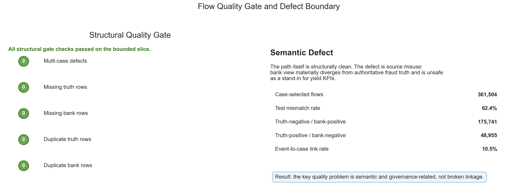
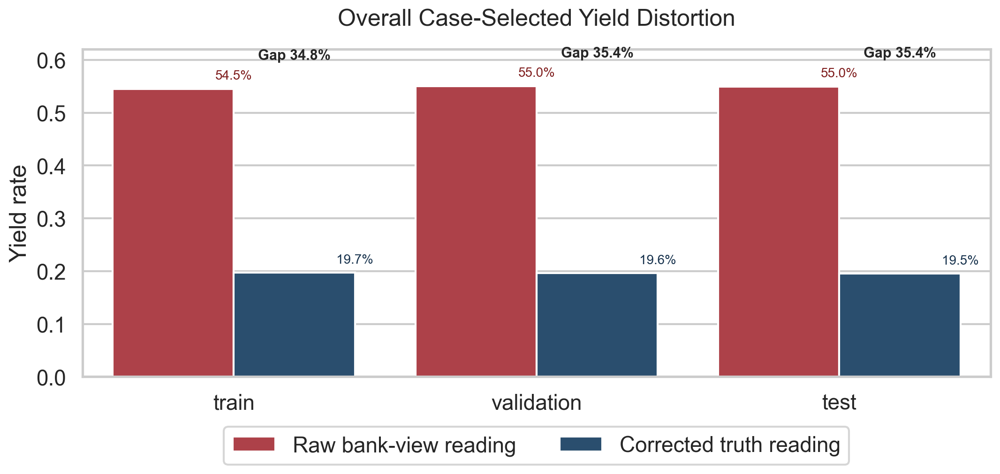
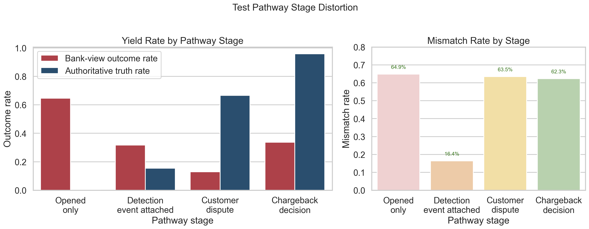

# Execution Report - Flow Quality Assurance Slice

As of `2026-04-03`

Purpose:
- record what was actually executed for the Midlands `Data Scientist` flow-quality slice
- preserve a truthful boundary between the bounded quality-assurance layer that was delivered and the wider platform governance estate that remains out of scope
- package the saved facts, anomaly outputs, and corrected KPI readings into one outward-facing report for later claim-writing

Truth boundary:
- this execution was completed against a bounded governed local slice derived from `runs/local_full_run-7`
- the base analytical unit was `flow_id`
- the execution used a 20-part aligned subset of the local governed surfaces, not the full run estate
- the slice therefore supports a truthful claim about bounded data-quality ownership over one event -> flow -> case -> outcome path
- it does not support a claim that platform-wide data-quality monitoring or full governance enforcement has already been implemented

---

## 1. Executive Answer

The slice asked:

`can one bounded governed analytical path be quality-owned in a way that finds a real defect, shows its analytical impact, and hardens the downstream consumer logic?`

The bounded answer is:
- the chosen path was structurally clean enough to isolate a semantic quality problem rather than a broken-linkage problem
- the real defect was source misuse: `s4_flow_bank_view_6B` was shown to be unsafe as an authoritative fraud-yield surface
- the path covered `361,504` case-selected flows with `0` multi-case linkage defects and full truth/bank coverage, so the defect was not missing data or join instability
- in the test split, overall case-selected yield read as `54.95%` if bank view was used, but only `19.51%` on authoritative truth, a `35.44` percentage point gap
- the distortion was strongest in `opened_only`, where the raw bank-view reading was `64.62%` and the corrected authoritative-truth reading was only `0.23%`
- the same misuse could also under-read high-value work: `chargeback_decision` read `33.74%` on bank view versus `95.83%` on authoritative truth
- the slice was resolved at the analytical-consumer layer by pinning truth as authoritative, exposing bank view as comparison-only, and packaging rerunnable checks plus a safer reporting-ready output

That means this slice delivered real data-quality ownership rather than only a validation checklist.

## 2. Slice Summary

The slice executed was:

`data-quality assurance over one governed flow-centric analytical path used for risk, cohort, and KPI interpretation`

This was chosen because it allowed one compact but defensible response to the Midlands requirement:
- detect a real anomaly or inconsistency
- reconcile the chosen analytical path
- show how the issue changes a downstream KPI reading
- embed the control into a repeatable analytical workflow

The primary proof object was:
- `flow_quality_assurance_v1`

The governed surfaces used were:
- `s2_event_stream_baseline_6B`
- `s2_flow_anchor_baseline_6B`
- `s4_case_timeline_6B`
- `s4_flow_truth_labels_6B`
- `s4_flow_bank_view_6B`

## 3. How This Maps To The Slice Plan

The execution stayed aligned to the approved slice plan rather than drifting into another modelling or product slice.

The delivered scope maps back to the planned lens responsibilities as follows:
- `03 - Data Quality, Governance, and Trusted Information Stewardship`: fit-for-use gate, authoritative-source rules, reconciliation checks, anomaly detection, issue logging, and lineage notes
- `01 - Operational Performance Analytics`: raw-versus-corrected KPI comparison and one explicit decision-risk note about false pressure and understated high-value work
- `09 - Analytical Delivery Operating Discipline`: versioned SQL checks, rerun README, definitions pack, caveats, and changelog
- `04 - Analytics Engineering and Analytical Data Product`: one safer reporting-ready output that keeps authoritative truth and bank-view comparison separate

The report therefore needs to be read as proof that one real quality problem was owned and resolved inside a bounded analytical slice, not as proof that the whole platform has already been quality-hardened.

## 4. Execution Posture

The execution stayed anomaly-first and SQL-first throughout.

The working discipline was:
- inspect field meaning and source semantics in SQL first
- confirm whether the chosen path had a structural defect or a semantic/source-governance defect
- quantify the anomaly and its mismatch classes in SQL
- quantify raw-versus-corrected KPI readings in SQL
- package a corrected reporting-ready output and rerunnable control pack
- use Python only as a reproducible runner and fact-pack generator

This matters for the truth of the slice because the requirement is about owning data quality as part of the analytical job, not only spotting suspicious numbers.

## 5. Bounded Build That Was Actually Executed

### 5.1 Quality gate result

The first quality gate showed that the chosen path was structurally clean enough to support a semantic quality issue rather than a linkage issue.

Observed bounded-slice result:

| Check | Value |
| --- | ---: |
| Event distinct flows | 3,455,613 |
| Case-selected flows | 361,504 |
| Flows with multiple case IDs | 0 |
| Event flows missing truth | 0 |
| Event flows missing bank view | 0 |
| Flows with duplicate truth rows | 0 |
| Flows with duplicate bank rows | 0 |
| Case-selected truth coverage rate | 100.0% |
| Case-selected bank coverage rate | 100.0% |

That meant the strongest defect pattern was not:
- broken event-to-case linkage
- missing outcome attachment
- duplicate row inflation from joins

The strongest defect pattern was:
- semantic misuse of the bank-view outcome surface as if it were authoritative fraud truth

### 5.2 Real anomaly class found

The anomaly search found a strong and stable mismatch class across splits.

At case-selected level:

| Split | Case-Selected Flows | Mismatch Flows | Mismatch Rate |
| --- | ---: | ---: | ---: |
| Train | 215,198 | 133,281 | 61.93% |
| Validation | 72,662 | 45,455 | 62.56% |
| Test | 73,644 | 45,960 | 62.41% |

The dominant mismatch class was:
- `truth_negative_bank_positive`

Key bounded facts:
- across the full bounded case-selected slice, `175,741` flows were truth-negative but bank-positive
- across the full bounded case-selected slice, `48,955` flows were truth-positive but bank-negative

That is what makes the issue strong enough to anchor the slice:
- the defect is real
- the defect is repeatable
- the defect materially changes interpretation

### 5.3 Root-cause reading

The label crosswalk made the semantic mismatch explicit.

In the test split, the largest combinations were:
- `LEGIT` + `BANK_CONFIRMED_FRAUD`: `36,016` case-selected flows
- `LEGIT` + `BANK_CONFIRMED_LEGIT`: `22,822`
- `ABUSE` + `CUSTOMER_DISPUTE_REJECTED`: `6,529`
- `ABUSE` + `CHARGEBACK_WRITTEN_OFF`: `3,527`
- `ABUSE` + `NO_CASE_OPENED`: `3,401`

Interpretation:
- truth labels and bank-view labels are carrying materially different meanings
- bank view can still be operationally useful, but it cannot be treated as a substitute for authoritative fraud truth when building yield-style KPIs

## 6. Measured Results

### 6.1 Overall KPI distortion

The clearest quality failure mode in this slice is KPI distortion from source misuse.

#### Overall case-selected yield

| Split | Raw Bank-View Reading | Corrected Truth Reading | Absolute Gap | Inflation Ratio |
| --- | ---: | ---: | ---: | ---: |
| Train | 54.52% | 19.69% | 34.83 pts | 2.77x |
| Validation | 55.03% | 19.62% | 35.41 pts | 2.81x |
| Test | 54.95% | 19.51% | 35.44 pts | 2.82x |

Operational meaning:
- a downstream reader using bank view as authoritative would believe case-selected workload is much more fraud-productive than it actually is

### 6.2 Pathway-stage distortion

The distortion is not uniform. It changes the pathway reading itself.

#### Test split

| Pathway Stage | Raw Bank-View Reading | Corrected Truth Reading | Absolute Gap | Inflation Ratio |
| --- | ---: | ---: | ---: | ---: |
| `opened_only` | 64.62% | 0.23% | +64.39 pts | 277.57x |
| `detection_event_attached` | 31.78% | 15.43% | +16.36 pts | 2.06x |
| `customer_dispute` | 12.88% | 66.58% | -53.69 pts | 0.19x |
| `chargeback_decision` | 33.74% | 95.83% | -62.08 pts | 0.35x |

Interpretation:
- `opened_only` becomes a false high-value pressure point if bank view is misused
- `chargeback_decision` and `customer_dispute` become under-read if bank view is misused
- this is exactly why source meaning belongs inside analytical quality ownership rather than being treated as documentation-only work

### 6.3 What the issue changes operationally

The slice surfaced one clear operational risk:
- the wrong source can create false pressure on low-value case-selected work while simultaneously understating genuinely high-value pathway stages

The most misleading example is:
- `opened_only`
- bank-view reading: `64.62%`
- truth reading: `0.23%`

The most under-read example is:
- `chargeback_decision`
- bank-view reading: `33.74%`
- truth reading: `95.83%`

That means a downstream team could:
- overstate fraud value in the wrong workload
- understate fraud value in the right workload
- make prioritisation or reporting decisions on the wrong outcome surface

## 7. Figures

The figure pack was added to make the defect boundary, KPI distortion, and pathway-stage impact legible at a glance without changing the truth boundary of the slice.

### 7.1 Structural gate and defect boundary

This figure carries the core quality-story split:
- the chosen path is structurally clean
- the defect is semantic and governance-related, not broken linkage
- the mismatch is large enough to anchor the slice as a real quality-ownership example

### 7.2 Overall case-selected yield distortion

This figure carries the headline KPI story:
- the distortion is stable across train, validation, and test
- raw bank-view yield overstates overall case-selected fraud value by about `35` points in every split
- that makes the source-governance problem hard to dismiss as a one-window anomaly

### 7.3 Test pathway-stage distortion

This figure carries the operational-reading story:
- `opened_only` becomes a false high-value pressure point under bank-view misuse
- `chargeback_decision` and `customer_dispute` become under-read
- mismatch rates stay materially high across the main pathway stages, especially outside `detection_event_attached`

## 8. Resolution Applied In This Slice

The issue was resolved at the consumer and reporting layer.

The fix applied was:
- pin `s4_flow_truth_labels_6B` as the authoritative source for fraud-yield interpretation
- keep `s4_flow_bank_view_6B` as a comparison-only surface
- expose both explicitly rather than allowing silent substitution
- package rerunnable checks that quantify the mismatch again if the logic is reused

This is what was produced:
- source rules note
- fit-for-use note
- lineage note
- issue log
- raw-versus-corrected KPI pack
- safer reporting-ready output with explicit source-rule note
- rerun README and changelog

Important boundary:
- the underlying bank-view surface was not rewritten
- the correct fix for this slice was governance and analytical-consumer hardening, not editing the governed source itself

## 9. Delivery Outputs Produced

Execution logic:
- SQL shaping pack under `artefacts/analytics_slices/.../sql`
- build runner under `artefacts/analytics_slices/.../models`

Compact evidence:
- profiling, reconciliation, anomaly, and KPI summaries under `artefacts/analytics_slices/.../metrics`
- bounded source-file selection in `bounded_file_selection.json`
- fit-for-use, source rules, lineage, issue log, definitions, caveats, operational impact, product contract, README, and changelog notes in the slice artefact root

Key machine-readable outputs:
- `flow_quality_kpi_before_after_v1.parquet`
- `flow_quality_reporting_ready_v1.parquet`

## 10. What This Slice Supports Claiming

This slice supports truthful statements such as:
- owned one real data-quality problem inside a governed analytical slice
- detected and root-caused a semantic mismatch between authoritative truth and a comparison-only operational surface
- showed how the mismatch distorted yield KPIs and pathway-stage interpretation
- embedded source rules and rerunnable validation checks into the analytical workflow
- hardened a reporting-ready consumer so authoritative truth and comparison-only fields cannot be silently conflated

The slice does not support claiming that:
- the governed source data itself was rewritten
- every downstream consumer in the platform has already been corrected
- the whole platform now has complete DQ monitoring
- all possible quality defects on the path have already been exhausted

## 11. Candidate Resume Claim Surfaces

This section should be read as a response to the Midlands requirement, not as a generic project summary.

The requirement asks for someone who can:
- detect anomalies and inconsistencies
- contribute to validation, reconciliation, and assurance
- improve dataset fitness for downstream analytics
- maintain trusted reporting and modelling inputs

The claim therefore needs to answer:
- I have owned that kind of quality problem
- here is the measured evidence
- here is how the defect was resolved in the workflow

### 11.1 Flagship `X by Y by Z` claim

> Strengthened dataset fitness for use and trusted fraud reporting inputs, as measured by exposing a `35.44` percentage point distortion between bank-view and authoritative-truth case-selected yield in the test window, identifying truth-versus-bank disagreement in `62.41%` of case-selected test flows, and validating `5` governed surfaces with zero structural linkage defects on the bounded path, by owning a semantic outcome-surface defect end to end, reconciling authoritative versus comparison-only source meaning, and embedding repeatable validation, source-rule, and before-and-after KPI controls into the analytical workflow.

### 11.2 Shorter recruiter-facing version

> Detected and resolved a material data-quality defect in downstream fraud reporting, as measured by corrected yield interpretation, repeatable mismatch checks, and validated linkage across critical governed inputs, by reconciling authoritative-truth and bank-view outcome semantics and hardening the SQL workflow so comparison fields could no longer be used as trusted yield logic.

### 11.3 Closer direct-response version

> Contributed to validation, reconciliation, and assurance of trusted analytical inputs, as measured by reproducible quality checks, anomaly detection over critical outcome fields, and corrected raw-versus-truth KPI interpretation, by treating data quality as part of the analytical job and building root-cause, source-rule, and monitoring controls directly into the workflow.

### 11.4 Framing note

For this role, `improved`, `strengthened`, and `embedded` are safer than `fixed all data quality issues`.

That preserves the truth boundary:
- the slice resolved one real quality defect at the analytical-consumer layer
- the slice did not claim total platform-wide DQ closure

## 12. Next Best Follow-on Work

The strongest next extension would be:
- test whether any other downstream consumer in the same bounded path still conflates bank view with authoritative truth
- tighten the final claim wording for the exact resume bullet you want to carry forward

The correct next step is not:
- to overclaim this bounded fix as if every platform output has already been governance-hardened
