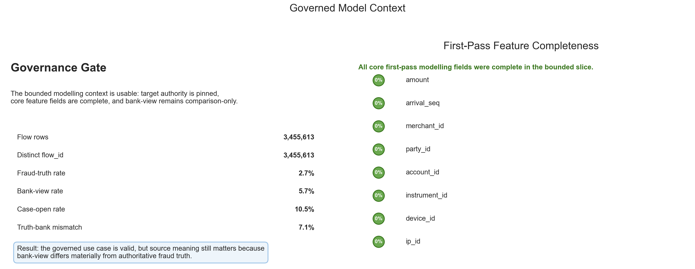
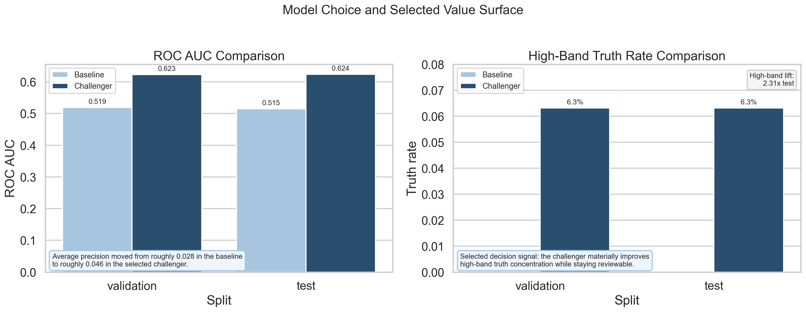
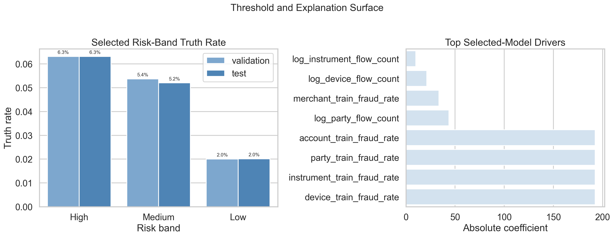

# Execution Report - Governed and Explainable AI Delivery Slice

As of `2026-04-03`

Purpose:
- record what was actually executed for the Midlands `Data Scientist` governed-and-explainable-AI slice
- preserve the truth boundary between one bounded reviewable scoring slice and any wider claim about platform-wide responsible AI maturity
- package the saved facts, model-choice evidence, threshold rules, explanation material, and stakeholder-use notes into one outward-facing report

Truth boundary:
- this execution was completed against a bounded governed local slice derived from `runs/local_full_run-7`
- the base analytical unit was `flow_id`
- the execution used a 20-part aligned subset of the local governed surfaces, not the full run estate
- the slice therefore supports a truthful claim about one governed and explainable fraud-risk scoring workflow
- it does not support a claim that full-platform responsible AI governance, fairness assurance, or live autonomous decisioning has already been implemented

---

## 1. Executive Answer

The slice asked:

`can one bounded fraud-risk scoring use case be delivered in a way that is useful, reviewable, and safe to circulate rather than functioning as an opaque black box?`

The bounded answer is:
- the governed modelling context was clean enough to support a real scored use case over `3,455,613` bounded flows, with authoritative fraud truth pinned separately from bank-view comparison fields
- the selected target remained low-prevalence but usable, with a bounded fraud-truth rate of `2.70%`, a bank-view rate of `5.72%`, and a truth-versus-bank mismatch rate of `7.15%`
- the simple structural baseline was directly explainable but too weak to justify downstream use on its own, with validation/test ROC AUC of `0.519 / 0.515`
- the encoded-history logistic challenger materially improved useful discrimination while remaining reviewable, with validation/test ROC AUC of `0.623 / 0.624` and validation/test average precision of `0.0456 / 0.0457`
- the selected challenger concentrated authoritative fraud truth into the `High` band at `6.31%` truth rate in both validation and test, delivering about `2.31x` lift against the overall bounded baseline
- thresholding was made explicit: `High` covers the top `5%` validation workload, `Medium` the next `15%`, and the score was kept strictly inside a human-review boundary
- explanation, caveat, threshold, challenge-response, and stakeholder decision materials were completed so the slice answers the governed-delivery burden rather than only the modelling burden

That means this slice delivered a bounded governed-and-explainable scoring workflow rather than merely a model that happened to score well.

## 2. Slice Summary

The slice executed was:

`a reviewable flow-level risk scoring slice with explicit model-choice, threshold, and explanation governance`

This was chosen because it allowed a compact but defensible response to the Midlands responsibility:
- build a bounded model-ready analytical slice
- show that authoritative source rules and leakage boundaries were pinned before modelling
- compare an interpretable baseline against one stronger challenger
- make an explicit model-choice decision instead of defaulting to the highest-scoring option without explanation
- document thresholding, explanation, caveats, and non-use boundaries for downstream decision support

The primary proof object was:
- `governed_explainable_ai_v1`

The governed surfaces used were:
- `s2_event_stream_baseline_6B`
- `s2_flow_anchor_baseline_6B`
- `s4_flow_truth_labels_6B`
- `s4_flow_bank_view_6B`
- `s4_case_timeline_6B`

## 3. How This Maps To The Slice Plan

The execution stayed aligned to the corrected `3F` slice definition rather than drifting back into the earlier predictive-modelling slice.

The delivered scope maps back to the planned lens responsibilities as follows:
- `03 - Data Quality, Governance, and Trusted Information Stewardship`: governed use-case note, source-authority rules, fit-for-use checks, leakage boundaries, and model-risk framing
- `07 - Advanced Analytics and Data Science`: bounded target definition, baseline-versus-challenger comparison, risk-band design, and explanation surface
- `09 - Analytical Delivery Operating Discipline`: stable definitions, assumptions and limits pack, regeneration guidance, changelog, and handover summary
- `08 - Stakeholder Translation, Communication, and Decision Influence`: decision brief, challenge-response note, annotated summary, and action note

The report therefore needs to be read as proof that one model-driven fraud use case was delivered in a governed and explainable way, not as proof that the whole platform has already completed end-to-end responsible-AI certification.

## 4. Execution Posture

The execution followed the agreed `03 -> 07 -> 09 -> 08` order.

The working discipline was:
- pin the governed prediction question first
- separate authoritative truth from comparison-only outcome fields before modelling
- screen leakage and first-pass feature completeness in SQL
- build one interpretable baseline and one stronger challenger only because the baseline proved materially weak
- force an explicit model-choice decision and threshold decision
- package explanation, assumptions, caveats, and decision-use notes as core outputs rather than as afterthoughts

This matters for the truth of the slice because the requirement is about governed and explainable AI delivery, not only about whether a model can rank flows.

## 5. Bounded Build That Was Actually Executed

### 5.1 Governance gate result

The governance gate showed that the bounded modelling context was usable and properly controlled.

Observed bounded-slice result:

| Check | Value |
| --- | ---: |
| Flow rows | 3,455,613 |
| Distinct `flow_id` | 3,455,613 |
| Earliest flow timestamp | `2026-01-01T00:00:03.574` |
| Latest flow timestamp | `2026-03-31T23:59:57.760` |
| Fraud-truth rate | 2.70% |
| Bank-view rate | 5.72% |
| Case-open rate | 10.46% |
| Truth-versus-bank mismatch rate | 7.15% |
| Core first-pass feature null rates | 0.0% across all selected fields |

The important governance reading was:
- authoritative truth remained pinned separately from bank-view comparison fields
- the bounded feature set was complete enough for first-pass modelling
- the modelling context was usable, but source meaning still mattered because bank-view and authoritative fraud truth were not interchangeable

### 5.2 Model-ready slice and split posture

The model-ready slice was built as a bounded time-based scoring problem, not a random convenience split.

Observed split profile:

| Split | Rows | Positives | Truth Rate | Span |
| --- | ---: | ---: | ---: | --- |
| Train | 2,073,369 | 55,642 | 2.68% | `2026-01-01` to `2026-02-24` |
| Validation | 691,122 | 18,841 | 2.73% | `2026-02-24` to `2026-03-14` |
| Test | 691,122 | 18,888 | 2.73% | `2026-03-14` to `2026-03-31` |

The selected encoded feature families also stayed complete in the bounded slice:
- merchant historical fraud rate
- party historical fraud rate
- account historical fraud rate
- instrument historical fraud rate
- device historical fraud rate
- IP historical fraud rate

All encoded-feature null rates were `0.0%`.

### 5.3 Model comparison actually executed

The slice did not stop at “an interpretable baseline exists.” It forced a governed comparison.

#### Baseline model

The baseline was:
- `baseline_logistic_structural`

Key observed results:

| Split | ROC AUC | Average Precision | High-Band Truth Rate |
| --- | ---: | ---: | ---: |
| Validation | 0.519 | 0.0277 | 2.13% |
| Test | 0.515 | 0.0275 | 2.19% |

Interpretation:
- the baseline was more directly explainable
- but it was too weak to justify meaningful downstream prioritisation support on its own

#### Challenger model

The challenger was:
- `challenger_logistic_encoded_history`

Key observed results:

| Split | ROC AUC | Average Precision | High-Band Truth Rate |
| --- | ---: | ---: | ---: |
| Validation | 0.623 | 0.0456 | 6.31% |
| Test | 0.624 | 0.0457 | 6.32% |

Interpretation:
- the challenger materially improved useful discrimination
- it remained reviewable because it was still logistic scoring rather than an opaque tree ensemble
- its added burden was governance and maintenance, not total loss of explainability

### 5.4 Explicit model-choice decision

The selected model was:
- `challenger_logistic_encoded_history`

Decision reason:
- the validation uplift materially exceeded the simpler baseline despite the added explanation and maintenance burden

This is the core governed-delivery point of the slice:
- the baseline was not rejected casually
- the challenger was not selected just because it scored higher
- the selection was justified against usefulness, explainability, and review burden together

The top selected-model drivers by absolute coefficient were:
- `device_train_fraud_rate`
- `instrument_train_fraud_rate`
- `party_train_fraud_rate`
- `account_train_fraud_rate`
- `log_party_flow_count`
- `merchant_train_fraud_rate`
- `log_device_flow_count`
- `log_instrument_flow_count`

That keeps the chosen model explainable enough to challenge:
- it is coefficient-based logistic scoring
- the stronger behaviour comes from encoded historical-risk features, not from an opaque model class

## 6. Measured Results

### 6.1 Selected risk-band behaviour

The selected threshold posture created usable separation without implying autonomous decisioning.

#### Validation

| Risk Band | Rows | Positives | Truth Rate | Capture | Lift |
| --- | ---: | ---: | ---: | ---: | ---: |
| High | 34,557 | 2,182 | 6.31% | 11.58% | 2.32x |
| Medium | 103,668 | 5,570 | 5.37% | 29.56% | 1.97x |
| Low | 552,897 | 11,089 | 2.01% | 58.86% | 0.74x |

#### Test

| Risk Band | Rows | Positives | Truth Rate | Capture | Lift |
| --- | ---: | ---: | ---: | ---: | ---: |
| High | 37,250 | 2,354 | 6.32% | 12.46% | 2.31x |
| Medium | 105,550 | 5,492 | 5.20% | 29.08% | 1.90x |
| Low | 548,322 | 11,042 | 2.01% | 58.46% | 0.74x |

Operational reading:
- the selected model consistently concentrates authoritative fraud truth into the `High` and `Medium` bands
- the `High` band is useful enough for prioritisation support
- the bounded-window stability between validation and test is close enough to support a reviewable decision brief

### 6.2 Threshold decision

The chosen threshold posture was:
- `High`: validation top `5%` workload threshold at probability `>= 0.00012905`
- `Medium`: validation top `20%` workload threshold at probability `>= 0.00002682`

Human-review boundary:
- `High` supports strongest review priority
- `Medium` supports secondary review support
- the score does not replace human adjudication

That matters because the slice was meant to show safe use, not just useful ranking.

## 7. Figures

The figure pack was added to make the governed context, model-choice logic, and explanation surface legible at a glance without changing the truth boundary of the slice.

### 7.1 Governed model context

This figure carries the core context story:
- the governed use case is viable
- source meaning is pinned
- first-pass feature completeness is clean
- bank view remains comparison-only rather than target-defining

### 7.2 Model choice and selected value surface

This figure carries the model-selection story:
- the baseline was more directly explainable but materially weaker
- the challenger improved ROC AUC and high-band truth concentration enough to justify selection
- the chosen model was selected because the uplift was reviewably worthwhile, not because it was a black-box benchmark winner

### 7.3 Threshold and explanation surface

This figure carries the threshold-and-explanation story:
- the selected `High`, `Medium`, and `Low` bands produce usable separation
- the model remains challengeable because the main drivers are inspectable
- the explanation surface is strong enough for review, but it still requires caveat and source-boundary notes to travel with it

## 8. Review, Caveat, and Decision Packs Produced

The slice produced the reviewable material that makes the score safe to circulate.

Governance and modelling notes:
- governed use-case note
- source rules note
- fit-for-use checks
- model-risk note
- lineage and join-path note
- model-selection decision note
- threshold note
- explanation pack

Review and operating-discipline notes:
- model definition pack
- assumptions and limits pack
- regeneration README
- model changelog
- handover summary

Stakeholder-use notes:
- decision brief
- challenge-response note
- annotated summary surface
- action note

That is the main distinction between this slice and the earlier predictive-modelling slice:
- here, the safe-use and challenge burden was treated as part of delivery rather than as extra commentary after the fact

## 9. What This Slice Supports Claiming

This slice supports truthful statements such as:
- delivered one bounded fraud-risk scoring use case in a governed and explainable way
- pinned authoritative source meaning and leakage boundaries before training
- compared a directly explainable baseline against one stronger but still reviewable challenger
- made and documented an explicit model-choice decision
- translated the selected score into threshold, caveat, challenge-response, and stakeholder decision materials

The slice does not support claiming that:
- the whole platform has full responsible-AI governance already implemented
- fairness and bias assurance are complete beyond what this bounded data can truly support
- the selected model is approved for autonomous decisioning
- explanation assets alone remove the need for human review

## 10. Candidate Resume Claim Surfaces

This section should be read as a response to the Midlands requirement, not as a generic modelling statement.

The requirement asks for someone who can:
- understand when machine learning is appropriate
- design models and datasets fit for governed deployment
- document assumptions, caveats, and usage boundaries
- consider explainability and operational risk
- support responsible AI assurance rather than shipping opaque model logic

The claim therefore needs to answer:
- I have delivered that kind of bounded governed model workflow
- here is the measured evidence
- here is how the score was kept reviewable and safely usable

### 10.1 Flagship `X by Y by Z` claim

> Delivered a governed and explainable fraud-risk scoring slice, as measured by improving bounded-window ROC AUC from `0.519` to `0.623` at validation, concentrating authoritative fraud truth into a `High` band with `6.31%` truth rate and `2.32x` lift, and completing explicit model-choice, threshold, explanation, and caveat decisions for downstream review, by building a flow-level predictive model over governed event, flow, case, and outcome data, selecting a reviewable encoded-history logistic challenger over a weaker structural baseline, and packaging the score with safe-use boundaries, challenge-response notes, and stakeholder decision materials.

### 10.2 Shorter recruiter-facing version

> Delivered a governed fraud-risk scoring workflow, as measured by stable high-band lift, explicit model-selection and threshold decisions, and a completed explanation-and-caveat pack, by comparing interpretable logistic approaches over governed fraud data and turning the selected score into a reviewable stakeholder decision surface rather than an opaque model output.

### 10.3 Closer direct-response version

> Implemented governed and explainable AI delivery for a bounded fraud-prioritisation use case, as measured by validated model uplift, documented safe-use boundaries, and completed threshold, explanation, and challenge-response materials, by designing a reviewable scoring slice over governed data and embedding model-risk, source-authority, and stakeholder-use controls into the workflow.

### 10.4 Framing note

For this role, `delivered`, `implemented`, and `packaged for reviewable use` are safer than `deployed autonomous AI`.

That preserves the truth boundary:
- the slice delivered a governed reviewable scoring workflow
- the slice did not claim live autonomous deployment or full responsible-AI closure across the platform

## 11. Delivery Outputs Produced

Execution logic:
- SQL shaping pack under `artefacts/analytics_slices/.../sql`
- reproducible runner under `artefacts/analytics_slices/.../models`

Compact evidence:
- profiling, comparison, explanation, and risk-band summaries under `artefacts/analytics_slices/.../metrics`
- bounded source-file selection in `bounded_file_selection.json`
- model-choice, threshold, explanation, assumptions, regeneration, handover, and stakeholder-use notes in the slice artefact root

Key machine-readable outputs:
- `flow_model_risk_band_summary_v1.parquet`
- `flow_model_review_summary_v1.parquet`

## 12. Next Best Follow-on Work

The strongest next extension would be:
- review the claim wording again from the call-and-response angle before final commit
- keep the selected-model explanation pack tied to the source-authority and non-use caveats whenever it is reused

The correct next step is not:
- to overclaim this bounded governed workflow as if full-platform responsible-AI governance has already been completed
