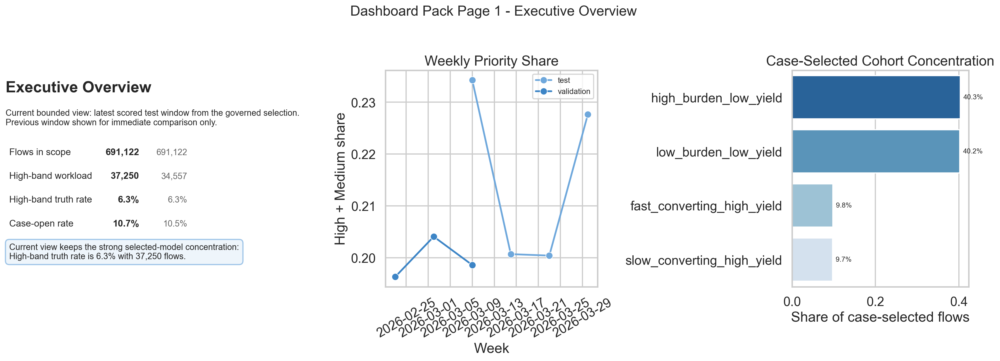
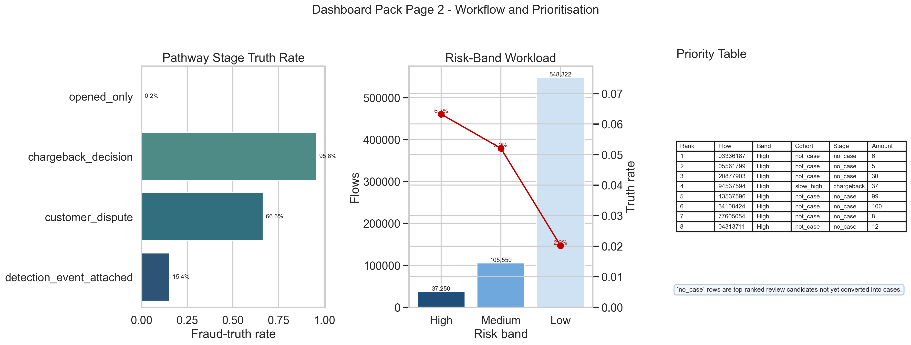
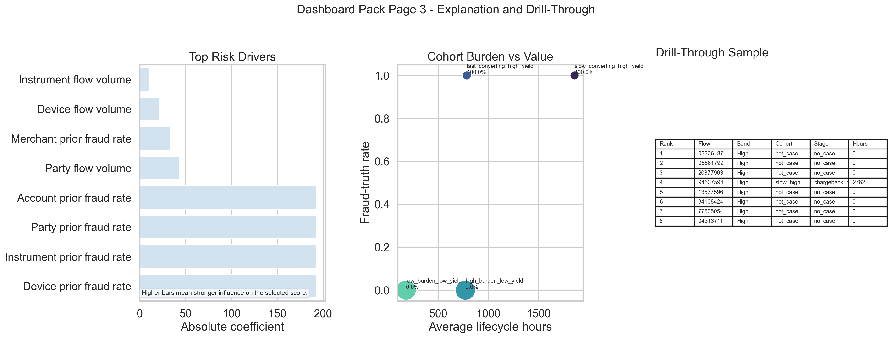

# Execution Report - Dashboard Integration and Decision Support Slice

As of `2026-04-03`

Purpose:
- record what was actually executed for the Midlands `Data Scientist` dashboard-integration-and-decision-support slice
- preserve the truth boundary between one bounded decision-support reporting pack and any wider claim about an enterprise BI estate
- package the saved facts, reporting-ready views, dashboard pages, KPI notes, and audience-facing briefs into one outward-facing report

Truth boundary:
- this execution was completed against a bounded governed local slice derived from `runs/local_full_run-7`
- the base analytical unit was `flow_id`
- the pack reused the selected governed model outputs from slice `05_governed_explainable_ai` and pathway context from slice `03_population_pathway_analysis`
- the execution used a 20-part aligned subset of the local governed surfaces, not the full run estate
- the slice therefore supports a truthful claim about turning governed model and cohort outputs into one compact dashboard and decision-support pack
- it does not support a claim that a full Power BI estate, enterprise semantic layer, or broad dashboard programme has already been implemented

---

## 1. Executive Answer

The slice asked:

`can bounded governed model and cohort outputs be turned into a reporting and decision-support pack that non-technical readers can actually use, rather than being left as technical analysis only?`

The bounded answer is:
- one reporting-ready dashboard base was built over `1,382,244` scored validation and test rows at `flow_id` grain
- that base was shaped into one compact executive-summary surface with `37` summary rows and one bounded drill-through surface with `142,800` current-priority rows
- the current bounded reporting window contains `691,122` scored test flows, with `37,250` in the `High` band and `105,550` in the `Medium` band
- the current `High` band keeps authoritative fraud truth concentrated at `6.32%`, while the overall case-open rate in the current reporting window is `10.66%`
- case-selected burden remains concentrated in `high_burden_low_yield`, which accounts for `40.3%` of case-selected current-window flows
- the largest current case-selected pathway stage is `opened_only`, but its authoritative fraud-truth rate is only `0.23%`, which gives the dashboard pack a real operational interpretation to carry rather than generic KPI display
- the delivered pack includes three audience-shaped pages, stable KPI definitions, an executive brief, an operations note, and a challenge-response note

That means this slice delivered one bounded model-to-reporting operationalisation pack rather than only a set of charts or a model result left in technical form.

## 2. Slice Summary

The slice executed was:

`a flow-level prioritisation and operations dashboard pack built from governed model and cohort outputs`

This was chosen because it allowed a compact but defensible response to the Midlands responsibility:
- shape model and cohort outputs into reporting-ready views rather than leave them in technical analysis form
- build a compact pack with distinct executive, operational, and drill-through reading paths
- keep KPI definitions stable across pages
- make the output understandable to non-technical users through annotation and briefing notes
- avoid becoming tool-locked to Power BI before the reporting logic and audience structure were already sound

The primary proof object was:
- `dashboard_decision_support_v1`

The main upstream analytical dependencies were:
- selected-model scored outputs from slice `05_governed_explainable_ai`
- pathway and cohort context from slice `03_population_pathway_analysis`

## 3. How This Maps To The Slice Plan

The execution stayed aligned to the approved `3G` slice definition rather than drifting back into pure modelling or generic BI talk.

The delivered scope maps back to the planned lens responsibilities as follows:
- `04 - Analytics Engineering and Analytical Data Product`: one reporting-ready base view, one summary view, one drill-through view, and one product contract
- `07 - Advanced Analytics and Data Science`: reuse of selected risk bands, prioritisation ordering, cohort labels, and explanation drivers worth surfacing
- `02 - BI, Insight, and Reporting Analytics`: one compact three-page dashboard pack with executive, workflow, and drill-through structure
- `08 - Stakeholder Translation, Communication, and Decision Influence`: KPI definitions, page notes, executive brief, operations note, and challenge-response note

The report therefore needs to be read as proof that one governed scoring-and-pathway output family was operationalised into stakeholder-facing decision support, not as proof that a broad BI platform rollout has already happened.

## 4. Execution Posture

The execution followed the agreed `04 -> 07 -> 02 -> 08` order.

The working discipline was:
- reuse earlier governed model and pathway outputs instead of rebuilding them
- shape a reporting-ready base before composing any page
- keep the pack bounded to exactly three pages
- keep KPI count intentionally small
- write page-level and audience-level explanation notes so the pack remained usable without oral walkthrough

This matters for the truth of the slice because the requirement is about dashboard integration and decision support, not about merely proving that plotting libraries are available.

## 5. Bounded Build That Was Actually Executed

### 5.1 Reporting-ready base and output profile

The pack did not sit directly on raw extracts. A reporting-ready flow-level layer was built first.

Observed output profile:

| Output | Rows |
| --- | ---: |
| `flow_dashboard_base_v1` | 1,382,244 |
| `flow_dashboard_summary_v1` | 37 |
| `flow_dashboard_drillthrough_v1` | 142,800 |

Reading:
- the base view carries the bounded validation and test scored population
- the summary surface is deliberately compact and page-ready rather than a broad analytical dump
- the drill-through surface is bounded to the current `High + Medium` queue, which keeps the operational page focused on the current review-first workload

### 5.2 Current reporting window profile

The pack is anchored to the current scored test window, with the earlier validation window kept only for immediate comparison.

Observed split profile:

| Split | Flow Rows | High Rows | Medium Rows | Fraud-Truth Rate | Case-Open Rate |
| --- | ---: | ---: | ---: | ---: | ---: |
| Validation | 691,122 | 34,557 | 103,668 | 2.73% | 10.51% |
| Test | 691,122 | 37,250 | 105,550 | 2.73% | 10.66% |

Current-window reading:
- the pack is working over a real bounded workload, not toy counts
- the `High + Medium` queue contains `142,800` current-window flows
- the selected-model concentration seen in slice `05` remains present in the reporting surface rather than being lost in packaging

### 5.3 Surfaced model and pathway facts

The dashboard pack reused existing governed analytical outputs rather than inventing new logic for presentation.

Current-window surfaced facts:

| Measure | Value |
| --- | ---: |
| Current scored flows | 691,122 |
| Current `High` band flows | 37,250 |
| Current `Medium` band flows | 105,550 |
| Current `High` band truth rate | 6.32% |
| Current case-open rate | 10.66% |
| Top case-selected cohort | `high_burden_low_yield` |
| Share of case-selected flows in top cohort | 40.3% |
| Top case-selected pathway stage | `opened_only` |
| Truth rate in top pathway stage | 0.23% |

Operational reading:
- the pack supports a direct “where should we look first?” answer through the `High` and `Medium` bands
- it also supports a more important second-order reading:
  - not all burden is value
  - the current workload remains heavily exposed to low-yield case-selected burden

That is what turns the pack into decision support rather than passive reporting.

## 6. Dashboard Pack Actually Delivered

### 6.1 Page 1 - Executive overview

The executive page was designed to answer:
- what changed?
- how much bounded work is in scope?
- where is value concentration holding?

Delivered components:
- headline workload and band KPIs
- one weekly priority-share trend panel
- one case-selected cohort concentration panel
- one short “what changed” annotation

The page keeps the top-line reading compact:
- the current bounded view holds `691,122` scored flows
- the selected model still concentrates truth into the `High` band at `6.3%`
- the current case-selected burden is still concentrated in low-yield cohorts

### 6.2 Page 2 - Workflow and prioritisation

The workflow page was designed to answer:
- what deserves attention first?
- how does the current queue relate to pathway and workload pressure?

Delivered components:
- pathway-stage truth-rate comparison
- risk-band workload surface
- bounded top-priority table
- on-page note explaining why some top-ranked rows still show `no_case`

The strongest operational reading on this page is:
- the largest current case-selected stage is `opened_only`
- but that stage carries only `0.23%` authoritative fraud truth
- the dashboard therefore supports a real intervention reading:
  - review priority should stay strongest in the `High` band
  - but downstream case burden still needs to be separated into high-value versus high-burden low-value work

### 6.3 Page 3 - Explanation and drill-through

The explanation page was designed to answer:
- why does this group matter?
- what is driving the selected-model ranking?
- what does a bounded priority sample actually contain?

Delivered components:
- selected-model top-driver panel translated into plainer business language
- cohort burden-versus-value contrast
- bounded drill-through sample

The page keeps the model-readable content linked to downstream decision use:
- top selected-model drivers are surfaced as a challengeable explanation family
- the cohort contrast shows where burden and value separate
- the drill-through sample shows what the current queue actually looks like at row level

## 7. Figures

The figure pack is the dashboard pack for this slice, so it is part of execution rather than an afterthought.

### 7.1 Executive overview

This page carries the executive story:
- workload is bounded and concrete
- the selected score still concentrates value into the `High` band
- case-selected burden remains concentrated in low-yield cohorts

### 7.2 Workflow and prioritisation

This page carries the operational story:
- the pack is not just reporting band counts
- it shows pathway-stage outcome differences and current risk-band workload
- it grounds the prioritisation story in a bounded queue rather than an abstract score

Important reading boundary:
- some top-ranked rows still show `no_case`
- the page now states directly that these are review-priority candidates that have not yet become cases, not a broken queue

### 7.3 Explanation and drill-through

This page carries the explanation story:
- the selected-model driver family remains visible enough to challenge without relying only on raw encoded feature names
- cohort burden and value are separated into a decision-useful contrast
- the drill-through view keeps the pack anchored in concrete bounded records

## 8. Audience Packs Produced

The slice produced the audience material that turns the visual pack into decision support.

Reporting and definition notes:
- KPI definitions note
- page notes
- product contract

Stakeholder-facing notes:
- executive brief
- operations note
- challenge-response note

Pack surface:
- compact three-page dashboard pack in markdown-plus-figure form

That is the main distinction between this slice and the earlier analytical ones:
- here, the output was translated into audience-shaped reporting and action notes rather than being left as raw analysis, model metrics, or cohort tables

## 9. What This Slice Supports Claiming

This slice supports truthful statements such as:
- operationalised governed model and cohort outputs into one compact decision-support reporting pack
- built reporting-ready base, summary, and drill-through layers rather than charting directly from raw technical outputs
- delivered distinct executive, operational, and drill-through views over the same stable KPI family
- translated the visual pack into executive, operational, and challenge-response notes for non-technical users

The slice does not support claiming that:
- a full enterprise dashboard estate has already been built
- Power BI deployment itself is the completed proof
- the dashboard pack replaces underlying model caveats or operational review
- the bounded views represent the whole fraud platform or all possible dashboard audiences

## 10. Candidate Resume Claim Surfaces

This section should be read as a response to the Midlands responsibility, not as a generic “built a dashboard” statement.

The requirement asks for someone who can:
- integrate analytical outputs into dashboards and reporting surfaces
- make model and cohort outputs understandable to non-technical users
- support decision-making through KPI presentation, explanation, and visual packaging
- operationalise analytical work into stakeholder-facing products rather than leaving it as technical analysis only

The claim therefore needs to answer back in evidence form:
- I have turned governed analytical outputs into dashboard and decision-support products
- I have done that through stable reporting-ready layers and audience-specific views, not one-off screenshots
- I have paired visuals with action notes and caveats so the pack is usable outside technical circles

### 10.1 Flagship `X by Y by Z` claim

> Operationalised governed model and cohort outputs into decision-support reporting, as measured by delivery of `3` audience-specific dashboard views, consistent reuse of one shared KPI family across executive, workflow, and drill-through pages, and regeneration of the pack from controlled reporting-ready views over `1.38M` bounded scored rows, by shaping selected model and pathway outputs into reporting-ready SQL-backed views, building a compact executive/operational/drill-through dashboard pack, and adding briefing and challenge-response notes for non-technical stakeholders.

### 10.2 Shorter recruiter-facing version

> Turned governed analytical outputs into dashboard and decision-support products, as measured by consistent KPI reuse across multiple views and completion of executive, operational, and drill-through reporting surfaces, by packaging model and cohort results into reporting-ready views and annotated dashboard summaries for non-technical users.

### 10.3 Closer direct-response version

> Integrated analytical outputs into stakeholder-facing decision-support reporting, as measured by reusable dashboard views, documented KPI logic, and completed action-oriented notes for different audiences, by translating governed model and cohort outputs into clear reporting surfaces and explanation packs rather than leaving them as technical analysis only.
