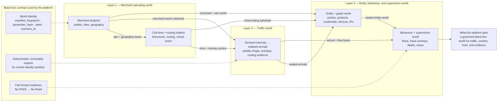
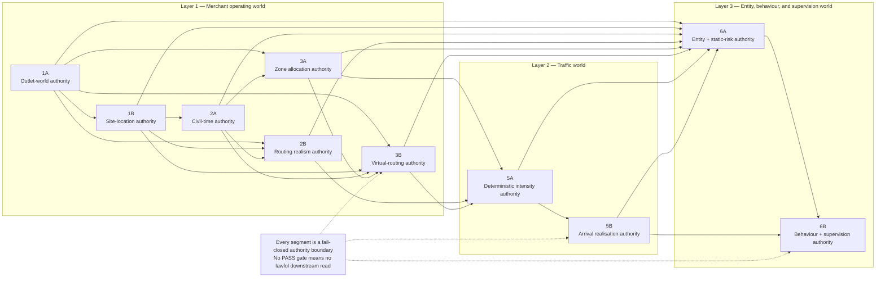
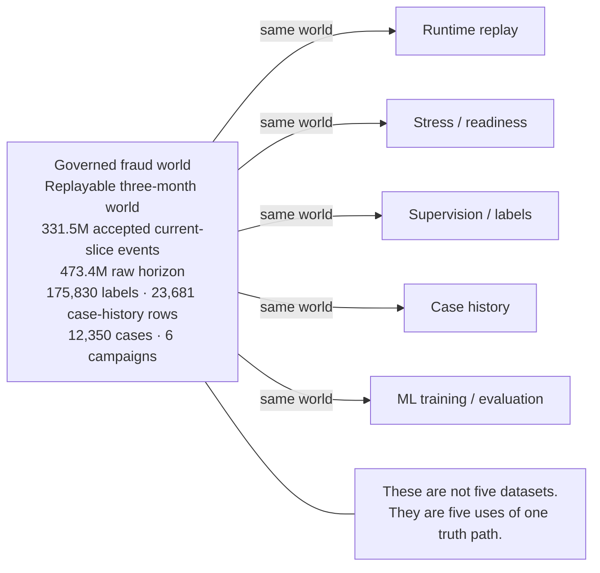
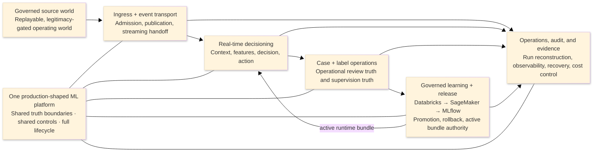
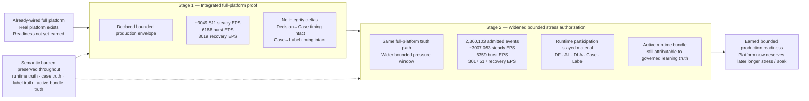
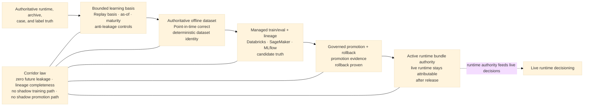
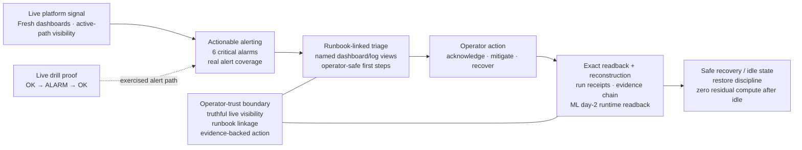
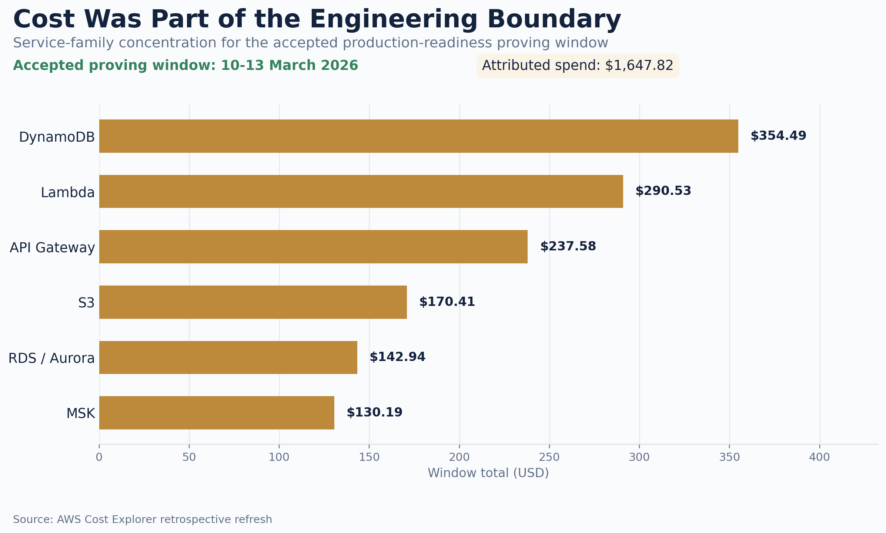
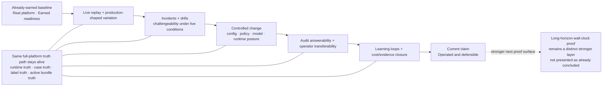
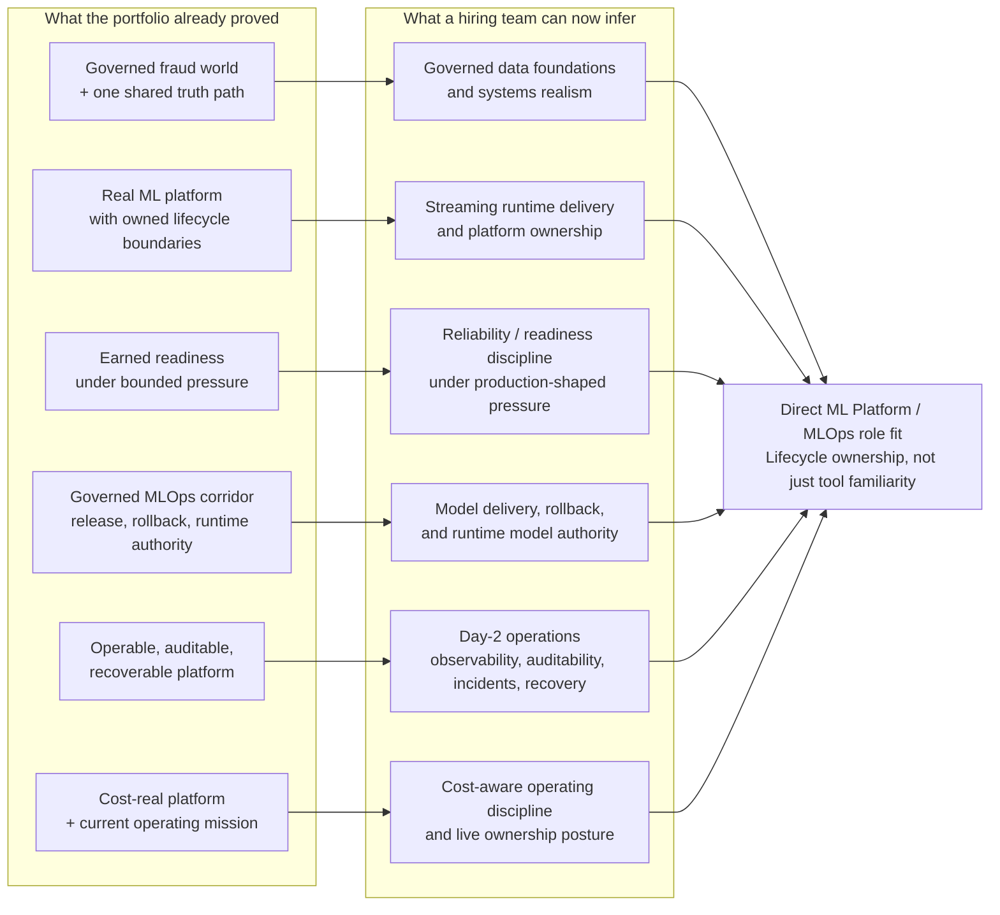

# Canonical Portfolio Source

## Section 1 — Identity, Scope, and Master Claim

**Section job**
Open the portfolio from professional identity, not from project identity. This section must answer four things immediately: who you are, what class of system problem you own, what makes that believable, and what phase the work is in now. It is the source stance for the rest of the portfolio, not a decorative introduction. 

**Recruiter doubt this section kills**
“Is this another recent graduate with a strong project?”
This section must prevent that downgrade before it starts by making the platform read as evidence for a broader capability class, not as the whole story. The portfolio doctrine is explicit that the portfolio exists to make your ML Platform / MLOps claim visible, believable, and defensible, and the speaking posture is explicit that the platform is your proof surface, not your identity.

**Section claim**
You are an ML Platform / MLOps engineer who builds production-shaped ML systems end to end, and the AWS fraud platform is the evidence chain for that scope. The platform is already real, already earned-ready on the bounded standard, and the current phase is live operating responsibility above that baseline rather than vague future work or already-concluded long-horizon proof.

**Canonical section prose**
I’m an ML Platform / MLOps engineer who builds production-shaped ML systems end to end. My scope is not “fraud” as a domain label; it is the governed data foundations, streaming runtime and learning paths, model delivery and rollback, observability, auditability, recovery, and cost-aware operating discipline required to run ML systems credibly under pressure. My recent AWS fraud platform is the proof surface for that scope: I built the governed world first, turned it into one shared operating reality, built the platform across runtime and governed learning, took it through bounded production readiness, and I’m now working in the capstone operating layer above that ready baseline. This portfolio is not a project tour. It is the visual evidence pack for the class of engineering problem I can own.

**Compressed version**
I build production-shaped ML platforms and MLOps systems end to end, and I’ve been using this AWS fraud platform to prove that scope across governed data, real runtime and learning paths, earned readiness, and now live operating conditions. 

**Why this section matters**
The portfolio doctrine says the portfolio sits between the resume and the repo/docs as a controlled narrative surface for recruiters and semi-technical readers. That means the opening section cannot behave like a README, biography, or architecture tour. It has to make the professional claim land cleanly before any detail appears, so the rest of the portfolio feels like proof rather than explanation. 

**Proof anchors allowed in this section**
Keep this section lightly anchored. The opening should not flood the reader with metrics, but it can quietly carry three truths nearby: the system is real, the platform earned bounded readiness, and the current layer is operating responsibility above that baseline. The speaking-posture material also recommends keeping one serious-world anchor, one readiness-under-pressure anchor, and one current-operating anchor mentally nearby so the opening feels real quickly without turning into a data dump. 

**Approved visual surface**
This section should stay visually restrained. The best option is a minimal opener built around four compact bands or blocks: **Identity**, **Scope**, **Proof Surface**, and **Current Edge**. A second acceptable option is a split layout with your professional claim on one side and the platform-as-evidence framing on the other. It should not use a full system graph yet, because the doctrine warns against letting diagrams outrun the claim.

**Tone guardrails**
This section must feel calm, precise, serious, non-apologetic, selective, and high-signal. It must not sound biographical, needy, tool-first, project-first, or like you are asking permission to count the work as experience. The tone target is measured force.

**What this section must not drift into**
Do not start with “I’m a recent graduate,” “I needed experience,” or “I built a fraud platform.” Do not let the tool stack appear before scope. Do not make fraud sound like your professional scope. Do not make the current phase sound like completed long-horizon production proof. The correct order is identity → scope → proof surface → current edge.

**Slide extraction note**
When this section is rendered into the deck, it should likely become Slides 1 and 2 together: the cover/identity slide and the “what this portfolio proves” slide. The slide version should stay shorter than this section, but inherit the same sequence: identity first, claim second, platform as evidence third, current edge last.

## Draft-ready version for the canonical portfolio doc

### 1. Identity, Scope, and Master Claim

I’m an ML Platform / MLOps engineer who builds production-shaped ML systems end to end. My scope spans governed data foundations, streaming runtime and learning paths, model delivery and rollback, observability, auditability, recovery, and cost-aware operation. My recent AWS fraud platform is the proof surface for that scope: a governed world, a real platform, earned bounded readiness, and now a live operating layer above that ready baseline. This portfolio exists to make that claim visible, believable, and defensible.

This opening section should not be read as “here is my project.” It should be read as “here is the class of ML Platform / MLOps ownership I can carry, and here is the evidence chain that proves it.” The platform is not my identity. It is the surface through which that broader engineering scope becomes concrete. 

Section 2 should then move straight into **what this portfolio proves**, so the recruiter sees the proof-pack logic before the deeper platform story begins.

---

## Section 2 — What This Portfolio Proves

**Section job**
Tell the reader how to read the portfolio before any deeper proof appears. This section is the contract for the whole artifact: it explains that the portfolio is not a project showcase, not a repo tour, and not a technical deep dive, but a recruiter-facing evidence pack designed to make one professional claim visible, believable, and defensible. 

**Recruiter doubt this section kills**
“Is this just a polished project deck?”
This section must close that doubt immediately. The doctrine is explicit that the portfolio is the controlled narrative surface between the resume and the implementation-heavy docs, and that the audience should not need to decode your A / Bi / Bii materials to understand what class of engineer you are. 

**Section claim**
This portfolio proves that you build and own production-shaped ML Platform / MLOps systems end to end, and that the AWS fraud platform is the evidence chain for that claim. It proves that claim through an ordered ladder: governed fraud world, shared operating world, real platform, earned bounded readiness, governed MLOps corridor, operable/cost-real system, and current operating mission. That order matters because it makes the system feel progressively more real, more credible, and more operational.  

**Canonical section prose**
This portfolio should be read as a proof pack, not as a project tour. Its purpose is to make one professional claim land clearly: I build and own production-shaped ML Platform / MLOps systems end to end, and this AWS fraud platform is the evidence chain that makes that claim believable. The platform is not the identity being sold; it is the proof surface through which the broader engineering scope becomes visible.  

To make that claim credible, the portfolio follows one ordered storyline. It begins with the governed fraud world so the platform is never judged on toy data, then shows how that world becomes one shared operating reality for runtime, supervision, cases, and ML. From there it shows the real platform, the earned readiness under bounded pressure, the governed learning and release corridor, the operable and cost-real day-2 surface, and finally the current capstone operating layer above the already-ready baseline. This is not decorative sequencing. It is the proof logic of the whole portfolio.  

The success condition is also explicit. Before a call, a recruiter should already be able to conclude that this is not toy data, not a one-off model demo, not endless unfinished building, and not someone who only understands one stage of the chain. They should already see governed data, runtime, learning/release, and operations as one owned system, with the current phase framed as live operating responsibility rather than vague future work.  

**Compressed version**
This portfolio is a recruiter-facing visual evidence pack. It uses one platform to prove a broader claim: that I build production-shaped ML Platform / MLOps systems end to end, from governed world and shared truth path, through real platform and earned readiness, into governed learning, operability, and live operating responsibility.  

**Why this section matters**
Without this section, the reader is forced to guess the meaning of the portfolio. That is exactly what the doctrine is trying to prevent. This section makes the portfolio legible before the heavy proof begins, and it pins the audience, the truth boundary, and the success condition up front. In other words, it stops the portfolio from being mistaken for a prettier README or an architecture-first deck. 

**Proof anchors allowed in this section**
This section should stay mostly structural rather than numeric. Its anchors should be the seven-stage ladder, the “platform as evidence, not identity” correction, and the success-condition conclusions the recruiter should reach before a call. If a small reality anchor is needed, it should be one short phrase like “real platform, earned readiness, live operating responsibility,” not a flood of metrics yet.  

**Approved visual surface**
The best visual here is a clean storyline map: a horizontal or rising seven-stage progression with short labels and one-line consequences. A second good option is a split visual with **professional claim** on one side and **platform as evidence chain** on the other. This is not the place for a system graph, metrics table, or dense architecture view. 

**Tone guardrails**
This section should feel calm, precise, serious, selective, and high-signal. It should sound like someone setting the proof frame for owned work, not someone trying to persuade by noise. The posture is measured force, not decoration, not hype, and not tutorial energy. 

**What this section must not drift into**
Do not let it become a biography, a tool list, a repo tour, a system graph explanation, or a metrics dump. Do not start explaining fraud as a domain in depth. Do not make the current operating layer sound like already-completed long-horizon proof. And do not let the platform become the identity instead of the evidence.  

**Slide extraction note**
When rendered into the deck, this section should likely feed **Slide 2 — What this portfolio proves** and **Slide 3 — The story in one view**. The slide version should be lighter and more visual, but it should preserve the same three things: the master claim, the seven-stage proof ladder, and the recruiter-level success condition. 

## Draft-ready version for the canonical portfolio doc

### 2. What This Portfolio Proves

This portfolio is not a project showcase. It is a recruiter-facing visual evidence pack designed to make one professional claim visible, believable, and defensible: I build and own production-shaped ML Platform / MLOps systems end to end, and this AWS fraud platform is the evidence chain that proves that scope. The platform is not my identity; it is the proof surface through which that broader engineering claim becomes concrete.  

The portfolio proves that claim through one ordered storyline: governed fraud world, shared operating world, real platform, earned bounded readiness, governed MLOps corridor, operable/cost-real platform, and current operating mission. That order matters because it lets the reader feel the system becoming more real, more credible, and more operational with each step. By the end of the portfolio, a recruiter should already be able to conclude that this is not toy data, not a one-off model demo, not endless unfinished building, and that the current work sits in live operating responsibility above an already-ready platform.  

----

Yes — here Section 3 should be **strictly the map**.

It is the section that tells the reader: **this is the order in which the claim becomes believable**. It should not start proving Stage 1 in detail yet, and it should not leak into the deep content of later sections. The doctrine is explicit that the portfolio must follow the canonical storyline in order, because that order is what makes the system feel progressively more real, more credible, and more operational. 

## Section 3 — Canonical Storyline Overview

**Section job**
Give the reader the full proof arc in one view before the portfolio starts zooming into individual stages. This section is the orientation layer for the rest of the artifact. It tells the recruiter what the ladder is, why it is ordered this way, and what kind of conclusion they should be moving toward as they go through it. 

**Recruiter doubt this section kills**
“Is this deck just a pile of unrelated claims?”
This section closes that doubt by showing that the portfolio is one structured evidence chain rather than a collection of nice-looking platform facts. The canonical storyline is the content architecture underneath the speaking posture and the portfolio, and it is meant to be inherited by all outward-facing assets.  

**Section claim**
This portfolio follows one canonical seven-stage ladder: governed fraud world, shared operating world, real ML platform, earned production readiness, governed MLOps corridor, operable/cost-real system, and current operating mission. That order is not decorative. It is the logic by which the platform moves from “interesting” to “serious,” and from “serious” to “credible for ML Platform / MLOps ownership.” 

**Canonical section prose**
This portfolio is built on one ordered storyline. It starts with the governed fraud world, because the platform should never be judged on toy data. It then shows how that world becomes one shared operating reality for runtime, supervision, case history, and ML. From there, it shows the platform itself as a real production-shaped system with owned boundaries and shared controls; the bounded readiness proof that moved it from wired to earned; the governed learning, release, and rollback corridor; the operator, audit, recovery, and cost surfaces that made it operable like a real shared system; and finally the current capstone operating layer above that already-ready baseline.  

That order matters. The doctrine says it is non-negotiable because it makes the recruiter feel the system becoming more real, more credible, and more operational with each step. In other words, the portfolio is not simply listing what exists. It is controlling how belief is earned. 

This section should also make the reading consequence explicit: by the end of the ladder, the recruiter should already feel that the work is not toy data, not a one-off model demo, not endless unfinished building, and not a candidate who only understands one stage of the lifecycle. They should feel one coherent chain: governed world, shared truth path, real platform, earned readiness, governed learning, day-2 operability, and live operating responsibility.  

**Compressed version**
The portfolio follows one seven-stage proof chain: governed world, shared operating world, real platform, earned readiness, governed MLOps, operability/cost realism, and current operating mission. The order is deliberate: it makes the system feel progressively more real, more credible, and more operational. 

**Why this section matters**
Without this section, the recruiter is forced to infer the portfolio’s structure while reading it. That weakens the effect of every later section. This overview gives them the map first, so when they see later diagrams, metrics, and proof surfaces, they already understand what those details are doing in the larger argument. The speaking-posture material is clear that the storyline is the content architecture, while the posture is the authorial voice extracted from it. This section is where that content architecture becomes visible. 

**Proof anchors allowed in this section**
This section should stay mostly structural, not numeric. The only proof anchors it really needs are the seven stages themselves and the success-condition logic they support. At most, one short reinforcing phrase such as “real platform, earned readiness, live operating responsibility” is enough. The heavier numbers belong in the later stage sections.  

**Approved visual surface**
The best visual here is a clean horizontal or rising journey graphic with seven stops:

1. Governed fraud world
2. Shared operating world
3. Real ML platform
4. Earned production readiness
5. Governed MLOps corridor
6. Operable / cost-real system
7. Current operating mission

Each stop should have a short consequence line, not a paragraph. This section is not the place for a platform diagram, a metrics table, or a dense Mermaid graph. The doctrine’s rule is that every slide must have one claim, one visual proof surface, a few proof points, and one recruiter consequence; here the visual proof surface is the ladder itself. 

**Tone guardrails**
This section should feel calm, architected, and controlled. It should sound like someone guiding the reader through an evidence chain, not someone excitedly previewing every technical accomplishment at once. The portfolio doctrine says the right emotional tone is measured force, and that is especially important here. 

**What this section must not drift into**
Do not let this section become:

* a proof-heavy summary of all seven stages
* a decorative roadmap with no consequence
* a full system tour
* a metrics preview slide
* a place where Bii is overstated as already-completed long-horizon proof

It must stay a map of the argument, not the argument itself. The doctrine is explicit that Bii should be shown as the current capstone operating mission above an already-ready platform, not vague future work and not already-concluded long-horizon proof. 

**Slide extraction note**
This section should map directly to **Slide 3 — The story in one view**. The slide should be lighter than the section text, but it should preserve three things: the seven-stage ladder, the reason the order matters, and the final recruiter consequence that the system becomes more real and more operational with each step. 

## Draft-ready version for the canonical portfolio doc

### 3. Canonical Storyline Overview

This portfolio follows one ordered proof chain. It starts with the governed fraud world, then shows how that world becomes one shared operating reality for runtime, supervision, cases, and ML. From there, it shows the real platform, the earned bounded readiness that moved it from wired to credible, the governed learning and release corridor, the operable and cost-real day-2 surface, and the current operating mission above the already-ready baseline.  

That order is deliberate. It is the logic by which the claim becomes believable. The recruiter should feel the system becoming more real, more credible, and more operational with each step, until the final conclusion is already available before a call: this is not toy data, not a one-off model demo, not endless unfinished building, but one production-shaped ML Platform / MLOps system whose current phase is live operating responsibility above an earned-ready platform.  

---

## Section 4 — Governed Fraud World

**Section job**
Prove that the platform was not hardened on toy data, mock fixtures, or one-off convenience tables. This section must show that you solved the world first, and that the platform later depended on that world through a governed black-box contract rather than by casually reaching into internal generation logic.   

**Recruiter doubt this section kills**
“Was this built on fake demo data?”
This section should make the answer feel immediate: no. The data engine was designed as a layered synthetic fraud world with explicit lineage, explicit legitimacy gates, and downstream read restrictions, so the platform was judged against an engineered reality rather than a convenient sample.  

**Section claim**
Before proving the platform, you engineered a governed fraud world. That world was layered, deterministic at the identity level, replayable, and fail-closed at the legitimacy boundary. The platform then treated the engine as a governed black box with explicit world identity, authoritative outputs, and “no PASS → no read” rules, rather than as an internal data helper.   

**Canonical section prose**
I did not begin with a model, a dashboard, or a thin runtime path. I began by engineering the world the platform would have to survive. That meant building a layered synthetic fraud data engine that constructs merchant geography and demand, routing and civil-time realism, entity and device surfaces, legitimate behaviour, fraud overlays, labels, and case chronology as one governed operating world rather than as disconnected synthetic tables. In portfolio terms, that is the important correction: the system was never meant to be proven on convenient mock data. It was meant to be proven against an engineered world with its own laws.   

That world was not only rich; it was governed. The black-box interface pins world identity through `manifest_fingerprint`, `parameter_hash`, `seed`, and `scenario_id`; it promises deterministic, immutable outputs for a fixed identity partition; and it requires segment-level HashGates so downstream consumers verify legitimacy before treating any output as authoritative. In plain language, the platform did not trust the world because files existed. It trusted the world because the world had identity, declared outputs, and fail-closed publish gates.  

The engine was also layered in a way that matters recruiter-side. `1A` establishes a lawful merchant-to-outlet world with replay validation and publish legitimacy; `1B` turns that into certified site-location truth; `2A` and `2B` make civil-time and routing law explicit; later layers close entity/product/device/static-risk truth and then behavioural, fraud, label, and case truth. That means the world was not one flat synthetic export. It was a staged operating reality with separate owned truths that had to reunify cleanly before downstream use.     

Just as important, the platform treated that engine in the right role. The production wiring notes pin the external engine world as a producer-owned, read-only source world that the platform realizes through a governed oracle boundary rather than through ad hoc copies or local shortcuts. That black-box treatment is part of why this section works recruiter-side: it shows the data engine as a serious governed proof layer, not as a loose code dependency hidden inside the platform.   

**Compressed version**
I built the governed fraud world before I proved the platform. The data engine created a layered, replayable, legitimacy-gated operating world, and the platform depended on it through a black-box contract with explicit identity, immutable outputs, and fail-closed read gates. That is why the platform was hardened on a serious world rather than on toy data.   

**Why this section matters**
Your doctrine is explicit that the data engine must appear strongly, but in the right role: not as the whole sale, and not as state-by-state research detail, but as the reason the platform was not hardened on toy data and the reason later readiness and operating claims are believable. This section is where that trust foundation gets established.  

**Proof anchors allowed in this section**
The best anchors here are: layered world construction, deterministic lineage and immutability, fail-closed publish legitimacy, and the fact that the platform consumed the engine through a black-box governed interface. One light reality anchor such as “one replayable three-month fraud world” is fine here, but the heavier scale numbers belong more strongly to Section 5, where the shared operating world becomes the focus.   

**Approved visual surface**
The best core visual here is a **layered governed-world map** or a **simplified data-engine network graph**. It should show the major world families only, such as merchant/outlet world, site/civil-time/routing world, entity/device/static-risk world, and behavioural/fraud/label/case world. A small contract strip can sit underneath it showing the black-box rules: identity, immutable outputs, and **No PASS → No Read**. That keeps the visual recruiter-facing while still making the governance burden visible. 

**Tone guardrails**
This section should feel serious, governed, and non-defensive. The point is not “look how sophisticated my synthetic data work is.” The point is “this platform stood on a world serious enough to trust.” That is exactly the role your doctrine assigns to the data engine in the portfolio. 

**What this section must not drift into**
Do not let it become a segment-by-segment implementation walkthrough, a stochastic-methods lecture, or a proof-of-research slide. Do not default into raw state IDs, remediation trails, or deep component call graphs in the core portfolio. Those details increase density faster than belief and belong in appendix or GitHub instead. 

**Slide extraction note**
This section should map directly to **Slide 4 — Governed fraud world**. The slide version should stay disciplined: one claim, one layer map, a few proof anchors, and one recruiter consequence. The key recruiter consequence is simple: **this system was not hardened on toy data.** 

## Draft-ready version for the canonical portfolio doc

### 4. Governed Fraud World

I solved the world first. Before proving the platform, I built a layered synthetic fraud data engine that constructs the governed operating world the platform would later have to survive: merchant geography and demand, site and civil-time context, routing realism, entity and device surfaces, legitimate behaviour, fraud overlays, labels, and case chronology. This was not synthetic data as a convenience layer. It was the world-definition layer for the whole platform claim.  

The platform then treated that engine as a governed black box. World identity was explicit, outputs were immutable for a fixed identity partition, downstream semantics were declared, and segment outputs were only authoritative after fail-closed gate verification. In other words, the platform was not hardened on random mock data or on files that merely happened to exist. It was hardened on a governed, replayable world with explicit legitimacy boundaries.   

The recruiter consequence is the one this section must make unmistakable: **the platform’s later runtime, readiness, and MLOps claims rest on an engineered reality, not on toy data.** 

### Core visual — layered governed-world map

This version expresses the right recruiter-facing idea:
Layer 1 certifies the merchant operating world, Layer 2 turns that into deterministic demand and realised arrivals, and Layer 3 turns the arrivals plus upstream world into entities, behaviour, labels, and cases. The platform then consumes that through a governed black-box contract rather than through engine internals.   

### Backup visual — simplified data-engine network graph

This is the better technical backup because it preserves the named authorities across `1A–6B` without dropping into state-level internals. It reflects the same layered story: Layer 1 builds the merchant operating world, Layer 2 builds the traffic world, and Layer 3 builds the entity/behaviour/supervision world.  

---

## Section 5 — One Shared Operating World

**Section job**
Prove that the governed fraud world did not feed one experiment or one narrow runtime test. This section must show that runtime replay, stress, supervision, case history, and later ML training/evaluation all lived on **one governed truth path** instead of on separate easier datasets for separate claims. That is the whole point of Stage 2 in your doctrine.  

**Recruiter doubt this section kills**
“Did each part of the system use its own convenient dataset?”
This section closes that doubt. The portfolio doctrine is explicit that the data engine must function not only as the reason the platform was not hardened on toy data, but also as the reason replay, supervision, cases, and ML all share one truth path. The canonical storyline sharpens that further: the moment runtime, supervision, case history, and ML diverge into separate data realities, the whole platform claim becomes patchwork.  

**Section claim**
You forced the runtime path, the supervision path, the case path, and the ML path to live inside one replayable governed world. The system was not exercised on one dataset for replay, another for labels, another for cases, and another for learning. It was judged on one shared operating reality, which is what makes the later platform, readiness, and MLOps claims coherent rather than assembled from separate proof packs.  

**Canonical section prose**
The data engine was not built to feed one experiment. It was built to create one **shared, replayable operating world** that the whole platform could use. That meant runtime replay, bounded stress, supervision, case history, and later ML training/evaluation all drew from the same governed world rather than from separate toy datasets tuned to make each individual claim easier. In portfolio terms, this is one of the most important transitions in the whole story: the world stops being just “serious input data” and becomes the single truth path that binds the rest of the platform together. 

That shared-world burden is exactly why this section matters recruiter-side. If runtime is exercised on one basis, labels come from another, case history is synthesized differently, and learning is built on a third dataset, then there is no single truth path and the later readiness and MLOps claims become much weaker. The canonical storyline says this plainly: one shared world is harder than multiple easier datasets, but it is precisely what makes the platform, learning corridor, and current operating layer defensible as one system rather than several loosely related experiments. 

This section is where the decisive world-scale anchors belong. The replayable three-month fraud world carried an accepted current slice of about **331.5M events**, backed by a **473.4M-event raw horizon**, with linked supervision and review surfaces carried alongside it: **175,830 flow-level truth labels**, **23,681 case-history rows**, **12,350 distinct cases**, and **6 fraud campaigns**. Those numbers matter not because “big data” is the sale, but because they show that the platform, supervision path, and ML path all had to answer to one serious operating surface rather than to convenient fragments. 

This is also the section where the coherence consequence becomes explicit. Because the same world fed replay, stress, supervision, case history, and learning, the later platform story is not “runtime over here, cases over there, ML somewhere else.” It is one world, one truth path, and therefore one meaningful chain from governed world to runtime behaviour to supervised outcomes to learned model authority. That coherence is one of the strongest recruiter-facing signals in the entire portfolio.  

**Compressed version**
I used one replayable governed fraud world for runtime replay, stress, supervision, case history, and ML. That choice made the story harder but much stronger: the platform, the review path, and the learning path were all judged against the same reality instead of against separate tailored datasets. 

**Why this section matters**
Your doctrine treats this as a major stage for a reason. It is the step that upgrades the story from “serious synthetic world” to “serious operating system.” Once everything shares one truth path, the platform stops looking like a collection of adjacent demonstrations and starts looking like one coherent ML Platform / MLOps system. 

**Proof anchors allowed in this section**
This is where the world-scale and coherence anchors belong:

* **331.5M** accepted current-slice events
* **473.4M** raw horizon
* **175,830** flow-level truth labels
* **23,681** case-history rows
* **12,350** distinct cases
* **6** fraud campaigns

Those are the right metrics here because the doctrine says the main deck should use metrics sparingly but decisively, and scale-of-world is one of the strongest metric classes when it supports seriousness and coherence rather than just impressiveness.  

**Approved visual surface**
The best visual here is a **central governed-world box** feeding five downstream consumers:

* runtime replay
* stress / readiness
* supervision / labels
* case history
* ML training / evaluation

That visual should make one thing unmistakable: these are not five datasets; they are five uses of one world. This is one of the strongest possible recruiter-facing diagrams in the whole deck because it turns “shared truth path” into something immediately legible. 

**Tone guardrails**
This section should feel serious, coherent, and deliberate. It should sound like someone who chose system coherence over convenience. The tone is not “look how large the dataset is.” The tone is “I refused to let easier proof paths weaken the platform claim.” That is one of the most senior-shaped decisions in your whole storyline. 

**What this section must not drift into**
Do not let it become:

* a raw “big numbers” slide
* a second version of Section 4
* a detailed dataset-schema explanation
* an ML-only framing
* a readiness slide in disguise

The point here is not scale alone and not the engine alone. The point is **one shared operating world**. The recruiter consequence is coherence, not just volume. 

**Slide extraction note**
This section should map directly to **Slide 5 — One shared operating world**. The slide should have:

* one claim: everything lived on one truth path
* one visual: governed world feeding runtime, stress, supervision, cases, and ML
* a few proof points: the accepted slice, raw horizon, and linked label/case anchors
* one recruiter consequence: this is one coherent operating world, not disconnected demos. 

## Draft-ready version for the canonical portfolio doc

### 5. One Shared Operating World

The governed fraud world was not built to feed one experiment. It was built to create one replayable operating reality that the whole platform had to share. Runtime replay, bounded stress, supervision, case history, and later ML training/evaluation all drew from the same world instead of from separate easier datasets for separate claims. That choice made the work harder, but it made the story much stronger: the runtime path, the review path, and the learning path were all being judged against the same governed truth. 

The scale of that shared world was already serious enough to matter. The accepted current slice alone carried about **331.5M events**, backed by a **473.4M-event raw horizon**, alongside **175,830 flow-level truth labels**, **23,681 case-history rows**, **12,350 distinct cases**, and **6 fraud campaigns**. Those numbers are not here as spectacle. They are here to show that the platform was exercised on one large, supervision-bearing operating surface rather than on a convenient subset or a stack of disconnected demo datasets. 

The recruiter consequence this section must make unmistakable is simple: **this was one coherent operating world.** The runtime story, the case story, the supervision story, and the learning story were all talking about the same reality. That is what makes the later platform, readiness, and MLOps claims feel unified rather than assembled. 

### Recruiter Facing Visual

It shows one **governed fraud world** feeding **runtime replay, stress/readiness, supervision/labels, case history, and ML training/evaluation**, which is exactly the Stage 2 claim: these are **not five datasets**, but **five uses of one governed truth path**. The scale anchors on the diagram also match the source figures you’ve been using for this section.   

Mermaid version:

---

## Section 6 — Real ML Platform

**Section job**
Show that the system is a **production-shaped ML platform**, not a loose stack of tools, a pipeline with some extras, or a set of adjacent demos. This section should make the platform itself legible: what lifecycle it covers, what truth boundaries it owns, and why those boundaries make it read like one engineered system rather than disconnected parts.  

**Recruiter doubt this section kills**
“Did he build a platform, or just wire together some services?”
This section should close that doubt directly. The canonical storyline is explicit that Stage 3 exists to show a **real platform**, not a disconnected project stack, and the portfolio doctrine says the recruiter should be able to conclude this is not a one-off model demo and not a toy system before a call.  

**Section claim**
On top of the governed shared world, you built one production-shaped ML platform across runtime, learning, and governance. It spans ingress/admission, event transport, real-time decisioning, action/output handling, case and label operations, governed learning/release, and the governance/meta surfaces that reconstruct what happened and defend the claim later. The system reads as a platform because those parts are coupled by shared contracts, shared truth boundaries, and shared closure rules rather than merely co-existing in one repo.  

**Canonical section prose**
Once the governed world and the shared operating reality existed, the next job was not “train a model” or “get a service path running.” The next job was to build the platform itself as one **production-shaped ML system**. In concrete terms, that meant a runtime side with ingress/admission, event transport, real-time context and decisioning, action/output handling, case creation, and authoritative labels; a learning side with point-in-time dataset build, managed train/eval, candidate publication, promotion, rollback, and active model/policy truth; and a governance side with exact run reconstruction, evidence readback, operator surfaces, alertability, idle/restore safety, and spend attribution. That is materially different from building a pipeline or training a model in isolation. 

What makes it a platform rather than a disconnected stack is not just that those parts exist. It is that they are tied together by shared contracts, shared truth boundaries, and shared closure rules. The production-readiness posture treats planes separately so they can be judged honestly, but it also requires them to be re-proved in coupling as enlarged working networks before promotion. That is a platform posture: shared controls, shared runtime envelope, shared telemetry, shared recovery logic, and a promoted working-platform baseline rather than a pile of green component receipts.  

The owned boundaries are also what make the platform claim strong. They are not vague handoffs between technologies. They include ingress truth, RTDL decision/action/lineage truth, case truth, label truth, offline dataset truth, model-eval truth, and active model/policy truth, with the portfolio materials explicitly warning that those truths must not silently collapse into one another. That is why this section should feel like system ownership, not service familiarity. 

The managed learning surfaces strengthen that reading rather than weakening it. The learning corridor was deliberately re-anchored to production-shaped managed surfaces — Databricks for dataset build, SageMaker for train/eval, and MLflow for lineage — specifically so the story could not fall back on hidden local authority or notebook-era convenience. In the production-wiring notes, that same corridor is described not as “datasets, jobs, and registry entries,” but as explicit truths for causal basis, dataset identity, candidate bundles, promotion and rollback governance, and deterministic runtime authority. That is exactly the kind of structure that makes the system read as a genuine ML platform architecture.  

**Compressed version**
I built one production-shaped ML platform, not a loose project stack. It spans governed ingress, streaming runtime, real-time decisioning, case/label operations, managed learning/release, and governance/evidence surfaces, with shared contracts and truth boundaries tying those parts into one system.  

**Why this section matters**
This is the section where the recruiter should stop thinking “interesting project” and start thinking “serious platform ownership.” The portfolio doctrine makes Stage 3 explicit for exactly that reason: after governed world and shared operating world are established, the next step is to show that the system itself is a production-shaped ML platform and not merely a nice arrangement of tools. 

**Proof anchors allowed in this section**
The best anchors here are structural, not highly numeric:

* ingress/admission
* event transport
* real-time decisioning
* action/output handling
* case and label operations
* governed learning/release
* governance/meta surfaces
  and then one or two decisive platform-shape anchors such as:
* shared contracts / truth boundaries / closure rules
* managed learning surfaces through Databricks, SageMaker, and MLflow.   

**Approved visual surface**
The best visual here is a **simplified platform network** or **platform planes map**. It should show only the major surfaces:

* ingress / admission
* event transport
* real-time decisioning
* action / output
* case and label operations
* learning / promotion / rollback
* governance / observability / evidence

It should not be a dense component graph. The doctrine is explicit that the main deck should show enough structure to prove the claim, but not so much detail that the claim disappears behind implementation density. 

**Tone guardrails**
This section should feel architected, deliberate, and ownership-heavy. It should not sound like “look how many AWS services I used.” The sale is capability class, not tooling quantity, and the doctrine explicitly warns against tool-obsessed portfolio slides. 

**What this section must not drift into**
Do not let it become:

* a cloud-product inventory
* a full repo walkthrough
* a component-by-component call graph
* a disguised readiness slide
* a deep MLOps deep-dive that should belong to Section 8

This section’s job is narrower: prove that the system is one **real ML platform** with owned lifecycle boundaries.  

**Slide extraction note**
This section should map directly to **Slide 6 — Real ML Platform**. The slide should carry:

* one claim: this is one production-shaped ML platform
* one visual proof surface: simplified platform network / planes map
* a few proof points: runtime, learning, governance breadth; shared truth boundaries; managed learning surfaces
* one recruiter consequence: this person built and connected a real end-to-end ML platform, not a disconnected project stack. 

## Draft-ready version for the canonical portfolio doc

### 6. Real ML Platform

On top of the governed shared world, I built the system as one production-shaped ML platform rather than a loose set of services. The runtime side spans ingress/admission, event transport, real-time context and decisioning, action/output handling, case creation, and authoritative labels. The learning side spans point-in-time dataset build, managed train/eval, candidate publication, promotion, rollback, and active runtime model/policy truth. The governance side spans exact run reconstruction, evidence readback, operator surfaces, alertability, idle/restore safety, and spend attribution. That is materially different from a pipeline, a model demo, or a handful of related cloud services. 

What makes it a platform is that these parts are not merely present; they are coupled by shared contracts, shared truth boundaries, and shared closure rules. The system owns ingress truth, RTDL decision/action/lineage truth, case truth, label truth, offline dataset truth, model-eval truth, and active runtime model/policy truth as distinct boundaries, while the learning corridor is deliberately seated on real managed surfaces — Databricks, SageMaker, and MLflow — rather than on hidden local shortcuts. The recruiter consequence this section must make clear is simple: **this was a real ML platform with owned lifecycle boundaries, not a disconnected project stack.**  

### VIsual

Yes — this is the right Section 6 graph shape.

It keeps Section 6 as a **real-platform topology** built around the seven obligation-led groups from `A`, while keeping Section 7 free to become a **readiness / proving** visual instead. That matches both your doctrine’s Stage 3 vs Stage 4 split and the A-notes’ “above paths, below the meta-goal” framing for the current wired platform. 

---

## Section 7 — Earned Production Readiness

**Section job**
Show that the platform did not stop at wiring. This section exists to prove that the already-real platform was taken through **bounded production-shaped pressure** and earned readiness through measured integrated proof and widened stress authorization, rather than being treated as “ready” just because the topology existed. In your doctrine’s ladder, this is the exact jump from **real platform** to **earned bounded readiness**.  

**Recruiter doubt this section kills**
“Did it merely exist, or was it actually proven under pressure?”
This section must kill the common downgrade where a recruiter sees architecture and assumes the system was never meaningfully exercised. Your doctrine is explicit that Stage 4 is where the platform must be shown as **pressure-tested into bounded readiness**, not merely described as built. 

**Section claim**
You took the wired full-lifecycle platform through a two-step readiness story. First, you closed **integrated end-to-end proof** on the full platform. Then you widened the pressure window on that same full-platform truth path and earned **bounded stress authorization**. The result was not “the runtime did not crash.” The result was that the platform remained semantically trustworthy, attributable, and operationally meaningful under the declared bounded envelope.  

**Canonical section prose**
Production readiness in this portfolio does not mean “services were deployed” or “a few healthy runs happened.” It means the platform was taken through a bounded proving program that asked a harder question: can this already-wired, full-lifecycle system remain credible under pressure while preserving the same full-platform truth path across runtime decisioning, case/label operations, model authority, and operator challengeability? That is why this section belongs after the real-platform section and before the governed MLOps corridor. It marks the point where the platform stops being merely shaped like production and starts being **earned-ready**.  

The readiness story has two decisive stages. The first is integrated end-to-end proof: the full platform closed at about **3049.811 steady / 6188 burst / 3019 recovery EPS**, with zero integrity drift and clean decision-to-case and case-to-label timing. That matters because the platform was not being judged as isolated planes anymore; it was being judged as one coherent system. The second stage is widened bounded stress authorization: the same full-platform truth path was then widened into a stress run that admitted about **2,360,103 events** and held about **3007.053 steady / 6359 burst / 3017.517 recovery EPS**, while integrity deltas stayed at zero and the active runtime bundle remained attributable to governed learning truth.  

What makes this section strong is the reasoning posture behind it. The readiness notes are clear that this was not a generic chronology of breakages or a lucky final green run. The point was to recover how the `A` platform posture was transformed into the production-ready posture by classifying real concerns honestly, keeping the semantic burden alive under enlarged coupling, and refusing to confuse proof-surface defects with real platform red. In other words, readiness was **earned**, not cosmetically assembled. 

This section also has an important stopping boundary. It must end at **earned readiness**, not drift into the later capstone operating claim. The production-proving document is explicit that the live 7–30 day operating program begins only **after** the platform has already been declared production-ready, and that it governs a different question: whether the ready platform can be operated like a production system over wall-clock time. So this section should say “the platform earned bounded readiness and deserved later longer stress/soak,” not “the long-horizon operating proof is already done.”  

**Compressed version**
I took the platform from fully wired to earned production readiness in two stages: first, integrated full-platform proof; then widened bounded stress authorization on that same truth path. The result was a platform that stayed semantically trustworthy and operationally attributable under bounded pressure, not just a system that happened to stay up.  

**Why this section matters**
This is one of the strongest sections in the whole portfolio because it converts the platform from “serious-looking architecture” into “serious proved system.” Your doctrine explicitly says the recruiter should be able to conclude, before a call, that the platform has already crossed both the **is it real?** and **is it ready?** thresholds. This is the section that makes the second threshold believable. 

**Proof anchors allowed in this section**
Use only the few numbers that change belief:

* integrated proof: **3049.811 steady / 6188 burst / 3019 recovery EPS**
* widened bounded stress: **2,360,103 admitted events**
* widened run: **3007.053 steady / 6359 burst / 3017.517 recovery EPS**
* integrity deltas stayed **0**
* the active runtime bundle remained tied to governed learning truth.  

**Approved visual surface**
The best visual here is **not** a topology graph. It should have a different grammar from Section 6. For Section 7, the right visual is a **readiness proving map** or a **two-stage scorecard visual**:

* left: integrated full-platform proof
* right: widened bounded stress authorization

A second strong option is a short ladder:
**wired platform → integrated closure → widened stress authorization → later longer stress/soak now deserved**.
That keeps Section 7 clearly about proving and authorization, not platform shape.  

**Tone guardrails**
This section should feel measured, controlled, and consequential. It should not sound like a defect diary, a phase log, or a noisy metrics wall. The readiness notes themselves say the reader-facing shape should recover the **reasoning behind the transformation**, not flatten everything into “phase 0, phase 1, phase 2” or “defect 1, defect 2, defect 3.” 

**What this section must not drift into**
Do not let this section become:

* a second architecture slide
* a raw metrics dump
* a chronology of breakages
* the governed MLOps slide
* the current operating mission slide
* or the long-horizon L4 operating proof

It must stay on one claim: **the platform earned bounded production readiness under pressure.**  

**Slide extraction note**
This section should map directly to **Slide 7 — Earned Production Readiness**. The slide should carry:

* one claim: the platform was pressured into readiness
* one visual proof surface: integrated proof + widened stress authorization
* a few proof points: envelope numbers, admitted-event scale, integrity continuity
* one recruiter consequence: this was measured, pressured, and earned — not just wired. 

## Draft-ready version for the canonical portfolio doc

### 7. Earned Production Readiness

I did not stop at wiring the platform. I took the already-real full-lifecycle system through a bounded production-shaped readiness program that asked whether the same full-platform truth path could remain credible under pressure. That readiness story closed in two stages: first, integrated end-to-end proof at about **3049.811 steady / 6188 burst / 3019 recovery EPS** with zero integrity drift and clean decision-to-case and case-to-label timing; then widened bounded stress authorization on that same platform, admitting about **2,360,103 events** at about **3007.053 steady / 6359 burst / 3017.517 recovery EPS** while runtime participation, downstream case/label truth, and active runtime model authority all remained intact.  

That is the important recruiter-facing consequence of this section: the platform was not merely built and then described as ready. It was **pressured into readiness**. And that readiness is the correct stopping point for this section. The later live operating program is a different layer that begins only after production-ready has already been earned. So the truthful claim here is strong and bounded: **the platform crossed the readiness threshold, and later longer stress/soak became deserved rather than guessed.**  

Yes — for **Section 7 / Slide 7**, I’d use a **proving-chain visual**, not a topology graph. The point of this section is that the platform moved from “wired” to **earned bounded readiness** through **integrated full-platform proof** and then **widened bounded stress authorization**, with the next honest question becoming longer stress/soak rather than re-litigating readiness.   

This is the version I’d use because it makes the Section 7 claim visible in one glance: **measured integrated closure first, widened stress authorization second, earned readiness as the outcome**. It also keeps Section 7 clearly different from Section 6, because this is about **pressure, proof, and authorization**, not platform shape.  

The numbers and readiness boundary in this visual come directly from your readiness materials and resume wording: integrated proof at about **3049.811 / 6188 / 3019**, widened stress at about **2,360,103 admitted events** and **3007.053 / 6359 / 3017.517**, with zero critical integrity deltas and active bundle attribution preserved. The “later longer stress/soak is now deserved” ending is also the exact posture your readiness notes pin after accepted widened stress closure.   

---

## Section 8 — Governed MLOps Corridor

**Section job**
Show that learning, release, rollback, and runtime model authority were part of the same governed system, not a side workflow bolted onto a runtime platform. In your doctrine and storyline, this is exactly what Stage 5 has to prove: the ML path is real only when runtime truth, dataset truth, candidate truth, promotion truth, rollback truth, and active runtime authority remain one continuous chain.  

**Recruiter doubt this section kills**
“Did he just train a model and add MLOps language around it?”
This section should kill that doubt. Your storyline is explicit that the governed corridor is not “we trained a model and registered it.” It is runtime truth plus label truth becoming bounded learning basis, then governed dataset truth, then managed train/eval with lineage, then candidate publication, rollback discipline, and live runtime authority that still remains attributable after release. 

**Section claim**
You built a governed MLOps corridor on the same replayable fraud world as the runtime platform. Authoritative runtime, archive, case, and label truth became a pinned learning basis with replay, `as_of`, maturity, and anti-leakage controls; that basis became an authoritative offline dataset object; that dataset became a managed train/eval and candidate-bundle boundary; promotion and rollback stayed governed; and runtime resolved the active bundle deterministically after release. That is a delivery corridor, not a one-off training workflow.  

**Canonical section prose**
The MLOps part of this platform is real because it begins with authoritative platform truth and ends in runtime authority. The learning corridor does not start from a notebook convenience dataset. It starts from archive truth, authoritative labels, and replay references, with replay basis, label `as_of`, label maturity, and anti-leakage checks pinned before learning is even allowed to begin. Your own wiring notes treat that as a distinct owned boundary called the **learning-input basis path**, which already tells the recruiter something important: the system does not let learning choose its own truth ad hoc.  

From there, the corridor becomes more governed, not less. The pinned learning basis is turned into authoritative offline dataset truth through the offline-feature system, with a committed dataset manifest, committed fingerprint, rollback recipe, point-in-time correctness, and future leakage violations forced to zero. Your readiness notes are very clear that the platform refused easy shortcuts here: no latest-data shortcut, no unmanaged file-emission shortcut, no hidden local fallback, and no ad hoc OFS basis selection. The point was to create one authoritative dataset object later model work could trust without redefining dataset truth for itself.  

That dataset then feeds a distinct **train / eval and candidate-bundle** boundary on real managed surfaces. Your docs separate this carefully from both dataset truth upstream and promotion truth downstream. The corridor had to prove that SageMaker really consumed the immutable governed basis, that training and evaluation completed on that basis, that metrics and leakage checks were tied to that same admitted basis, that MLflow lineage stayed complete enough to trace dataset → train/eval → candidate, and that the result was a provenance-complete candidate bundle rather than just “a run completed.” That is exactly why the docs insist this boundary owns stronger truth than “job ran.”   

This is also where the managed surfaces matter in the right way. Databricks, SageMaker, and MLflow strengthen the claim because they remove hidden local authority and force the corridor onto the same kind of managed surfaces a real team would depend on. Your readiness notes are explicit that helper scripts were allowed to orchestrate or probe, but not to secretly do the real work of the lane. The accepted closure only counted once SageMaker training and batch transform completed on the governed basis and MLflow lineage finished on the managed surface.  

The promotion side is governed too. Your wiring notes separate **promotion and rollback-governance** from candidate creation, and then separate **active-bundle runtime authority** from promotion itself. That means the system does not confuse “candidate exists,” “candidate promoted,” and “runtime is now deterministically consuming the right active bundle.” Promotion had to commit explicit promotion truth, rollback drills had to be executed and recorded, compatibility and fail-closed checks had to pass, and runtime had to resolve the right active bundle or policy after release. That is a much stronger story than a registry-first narrative. 

The metrics matter here, but only the ones that change belief. The recruiter-facing summary you already use is the right one: the governed basis produced a deployable candidate at about **AUC 0.91** and **Precision@50 1.00**, with **100% lineage completeness**, rollback discipline proved before promotion, and live runtime bundle resolution verified after release. Those are strong because they combine model quality, lineage quality, release control, and runtime attribution in one sentence.  

What makes the corridor governed instead of manual is that governance is enforced at every transition. The storyline says this plainly: learning basis had to come from authoritative runtime plus label truth, point-in-time and maturity controls had to pass, train/eval had to happen on managed surfaces with pinned handles, candidate publication had to carry lineage, rollback had to be proven, and active runtime authority had to remain attributable after release. That is the exact recruiter-facing summary of why this counts as real MLOps rather than “model automation.” 

This section also has to carry one very important truth-boundary. It is not just “I trained a model on Databricks and SageMaker.” It is “I owned the path from authoritative world → bounded learning basis → authoritative dataset object → candidate truth → governed promotion/rollback → live runtime authority.” That is the strongest recruiter consequence of the entire section, because it shows delivery ownership rather than tool familiarity.  

**Compressed version**
I built a governed MLOps corridor, not a one-off training workflow. Runtime, archive, case, and label truth became a replay-bounded, point-in-time-correct, leakage-safe learning basis; that basis became an authoritative dataset object; managed Databricks, SageMaker, and MLflow turned it into candidate truth with lineage; promotion and rollback remained governed; and runtime model authority stayed attributable after release.  

**Why this section matters**
This is the section that stops the portfolio from reading as “runtime system plus some ML.” Once this corridor is visible, the recruiter can see that runtime, supervision, dataset build, train/eval, release, rollback, and live serving all belong to one governed platform story. That is exactly the Stage 5 burden in your doctrine. 

**Proof anchors allowed in this section**
The decisive anchors here are:

* authoritative runtime + label truth as the learning basis
* point-in-time correctness and future leakage forced to zero
* Databricks → SageMaker → MLflow as real managed surfaces
* about **AUC 0.91**
* **Precision@50 1.00**
* **100% lineage completeness**
* rollback proved before promotion
* active runtime bundle resolution verified after release.   

**Approved visual surface**
The best visual here is a **governed corridor diagram**, not a platform topology and not a metrics table. It should show:
runtime/archive truth + labels/cases
→ learning-input basis
→ offline dataset truth
→ train/eval + candidate bundle
→ promotion + rollback governance
→ active runtime bundle authority.
That visual will read immediately as “delivery corridor” instead of “training step.” The docs support that exact five-part split.  

**Tone guardrails**
This section should feel governed, deliberate, and lifecycle-aware. It should not sound like “look at my model metrics,” and it should not sound like a tooling showcase. The speaking posture is clear that the right framing is governed world, runtime path, learning corridor, and operating controls — using managed tooling to make that real, not leading with the tools themselves. 

**What this section must not drift into**
Do not let it become:

* a notebook/training story
* an isolated model-metrics slide
* a tool list
* a Section 6 platform slide in disguise
* or a Section 9/10 operations slide in disguise

Its job is one thing: prove that learning, release, rollback, and runtime authority are one governed chain. 

**Slide extraction note**
This section should map directly to **Slide 8 — Governed MLOps Corridor**. The slide should carry:

* one claim: governed learning, release, rollback, and runtime authority
* one visual: the corridor from runtime truth to active runtime bundle
* a few proof points: leakage-safe basis, managed surfaces, metrics, lineage, rollback, runtime attribution
* one recruiter consequence: this is real MLOps lifecycle ownership, not just model training. 

## Draft-ready version for the canonical portfolio doc

### 8. Governed MLOps Corridor

I did not treat learning as a side workflow. I built a governed MLOps corridor on the same replayable fraud world as the runtime platform. Authoritative runtime, archive, case, and label truth became a replay-bounded learning-input basis with `as_of`, maturity, and anti-leakage controls pinned; that basis became an authoritative offline dataset object with deterministic identity and rollback semantics; and that dataset then fed real managed train/eval on Databricks, SageMaker, and MLflow, producing candidate truth with governed metrics, lineage, and pre-promotion operability. Promotion and rollback were explicit governed truths, and runtime bundle resolution remained attributable after release.    

The important recruiter consequence is simple: this was not “I trained a model.” It was ownership of the corridor from authoritative world → bounded learning basis → dataset truth → candidate truth → governed promotion/rollback → live runtime authority. That is what makes the MLOps part of the portfolio real.  

Next we should build the **Section 8 visual** before moving to Section 9.

---

Yes — for **Section 8**, the right visual is a **governed delivery corridor**, not a training workflow and not a tools slide.

The source docs split this corridor into five distinct owned outcomes: **learning-input basis**, **offline dataset truth**, **train/eval + candidate truth**, **promotion/rollback governance**, and **active runtime authority**. The doctrine and trap sheet also say not to lead with tools, so **Databricks / SageMaker / MLflow** should appear only as quiet sublabels inside the corridor, not as the headline of the slide.   

Use this as the **main-deck Section 8 visual**:

Why this fits the posture:

It makes the claim readable in one glance: **authoritative world truth becomes governed learning truth, then becomes governed runtime authority again**. That is exactly the group-level claim in your wiring notes, and it is also how the canonical storyline distinguishes a real MLOps corridor from “we trained a model and registered it.”  

It also keeps the most important recruiter-facing distinction visible: this corridor does **not** stop at train/eval. It continues through **promotion, rollback, and live runtime authority**, which is the precise reason your docs say this is a delivery corridor rather than a one-off training workflow.  

And it avoids the trap you’ve been guarding against: sounding like a tool user instead of a system owner. The trap sheet explicitly says not to start with tools; the visual above leads with **governed world truth, bounded basis, dataset truth, candidate truth, promotion/rollback, and live runtime authority**. The managed tools are present, but subordinated. 

---

## Section 9 — Operable, Auditable, Recoverable

**Section job**
Prove that “ready” meant more than a green bounded run. This section exists to show that the platform was made **run-able, challengeable, reconstructable, auditable, and recoverable** as a real shared service. In the portfolio doctrine, this is part of the Stage 6 burden: the platform must be shown as something that can be **observed, challenged, reconstructed, recovered, and paid for responsibly**, with the core operability proof landing before the cost-realism slide takes over. 

**Recruiter doubt this section kills**
“Could a real team actually operate and defend this system day-2, or was it just proved once?”
This section should kill that doubt directly. The doctrine’s example for the operability slide is explicit: alert/runbook/evidence/recovery map, with proof points like critical alarms, drill chain, exact readback, and zero residual compute after idle, leading to the recruiter consequence that **this could actually be run and recovered**. 

**Section claim**
You did not stop at building the platform and proving the envelope. You made the platform operable like a real shared service by adding **truthful live visibility, runbook-linked alerting, exact run reconstruction, audit-grade evidence readback, ML day-2 operator readback, and safe idle/restore discipline**. That means the platform could be challenged and defended from evidence rather than memory.  

**Canonical section prose**
By this point in the portfolio, the platform is already real and already earned-ready on the bounded readiness standard. The next question is different: can it be **operated and defended** like a serious system, or does it still collapse into “we ran it once and wrote down the metrics”? This section is where that doubt gets closed. The canonical storyline says the system had to become operable, challengeable, and cost-real, and the doctrine sharpens the first half of that into something concrete: the platform must be observable on the real live path it is actually using, reconstructable after the fact, auditable from evidence, and safe to recover or idle without leaving hidden state behind.  

The wiring notes make clear that this was not treated as “dashboards and cleanup.” Group 7 exists because the platform cannot stop at “all the other planes worked.” It must also prove that the run can be **operated, observed, reconstructed, governed, closed, and idled safely** with the same seriousness as execution itself. In other words, the system had to produce run truth that operators could actually use later, not just execution truth that looked good while the run was active. 

That group-level seriousness then breaks into the exact surfaces that matter here. One path owns **run reconstruction and receipt closure**, so earlier lane receipts become an exact run story rather than a hand-assembled summary. Another owns **drift-visible observability attestation**, which means live visibility had to be tied to the **actual active runtime path**, with freshness, alert coverage, correlation continuity, handle resolution, and active-path drift checks treated as closure truths rather than as decorative tooling. Another owns **idle-safe teardown and residual-readability**, which means the platform had to prove it could stop cleanly without hidden residual runtime, hidden cost, or unreadable post-run evidence. That is already enough to make this section read like day-2 responsibility rather than “pretty monitoring.”   

The Bi readiness notes then show how that seriousness was earned. The operator chain was not accepted when the platform merely had dashboards and alarms. The first closure candidate was explicitly withdrawn because the operator boundary was incomplete: runbook linkage was missing, fresh alert-path evidence did not yet exist, and ML day-2 mitigation was still too implicit. The key transformation happened only after the platform moved from **“alarms exist”** to **“the alert path is exercised, attributable, and operator-usable on the real live surface”** through a live `OK → ALARM → OK` drill, runbook linkage, and fresh alert-path evidence. That is a stronger claim than “we had monitoring.” It is “operators could actually move from signal to action on the real live boundary.” 

The same Bi material shows that observability here also meant **readback integrity**, not just metric freshness. The live operator surface had to prove exact run reconstruction, ML day-2 readback, full required handle and secret resolution, zero placeholder-like active handles, and enough drift visibility to block false certification. By accepted closure, the platform had earned a materially stronger claim than “we have dashboards”: it could now be seen on the same active runtime surfaces it actually used, with fresh metrics, real alert coverage, runbook linkage, clean live handles, and operator-actionable drift visibility.  

The resume already compresses the recruiter-facing version of that evidence well. The readiness closure required reproducible dashboards and alerts, runbook-linked incident response, exact run reconstruction, ML day-2 model/runtime readback, and safe idle/restore controls; by closure the platform had **6 critical alarms**, a live **OK → ALARM → OK** drill, and **zero residual compute after idle**. That is the right proof set for this section because it demonstrates that the platform could be watched, challenged, reconstructed, and safely left behind in a clean post-run state. 

What matters most is the recruiter consequence. This section should not feel like “look at my dashboards.” It should feel like: **this platform could be run, challenged, explained, recovered, and trusted after the run**. That is the real signal of day-2 ownership, and it is one of the strongest places where the portfolio stops reading like a strong project and starts reading like serious ML Platform / MLOps responsibility.  

**Compressed version**
I made the platform operable like a real shared service. Live visibility was tied to the actual active runtime path, alerts were runbook-linked and drill-proven, runs could be reconstructed exactly from evidence, ML day-2 readback was available, and the system could be brought to a safe idle state with zero forbidden residual compute and readable post-run evidence.  

**Why this section matters**
This is the section that turns readiness from “credible bounded proof” into **credible day-2 service posture**. The doctrine is explicit that the operability slide should make the recruiter conclude that the system could actually be run and recovered, and the canonical storyline says this is where the story becomes unmistakably senior-shaped: not just build and test, but monitor, challenge, recover, audit, and defend.  

**Proof anchors allowed in this section**
Use only the few proof points that change belief:

* reproducible dashboards and alerts
* runbook-linked incident response
* exact run reconstruction
* ML day-2 model/runtime readback
* **6 critical alarms**
* live **OK → ALARM → OK** drill
* safe idle/restore controls
* **zero residual compute after idle**. 

**Approved visual surface**
The best visual here is an **alert / runbook / evidence / recovery map**, not a topology graph and not a cost chart. It should make the operator chain visible in one glance:
**live signal → alert → runbook → operator action → exact readback / reconstruction → safe idle / recovery**.
That is also the visual the doctrine effectively prescribes for the operability slide. 

**Tone guardrails**
This section should feel calm, serious, and operational. It should not sound like a dashboard showcase, a list of controls, or a live-ops boast. The point is not “look at all the operational stuff I added.” The point is “this platform was made defensible and usable after the run.” 

**What this section must not drift into**
Do not let it become:

* a general architecture slide
* a raw metrics wall
* a cost slide
* the long-horizon live operating program
* or a vague “we have observability” claim

The line is important: **Section 9 proves operability surfaces already existed and mattered by readiness closure; Section 10 will prove cost realism; Section 11 will prove the later live operating mission above the ready baseline.**  

**Slide extraction note**
This section should map directly to **Slide 9 — Operable, auditable, recoverable**. The slide should carry:

* one claim: the platform was made operable like a real shared service
* one visual proof surface: alert/runbook/evidence/recovery map
* a few proof points: 6 critical alarms, live drill, exact reconstruction, ML day-2 readback, zero residual compute after idle
* one recruiter consequence: this system could actually be run, challenged, explained, and recovered. 

## Draft-ready version for the canonical portfolio doc

### 9. Operable, Auditable, Recoverable

I did not treat “ready” as “we got a green bounded run.” I made the platform operable like a real shared service. Live visibility had to be truthful to the actual active runtime path; alerts had to be real, reproducible, and runbook-linked; runs had to be reconstructable exactly from receipts and evidence; ML day-2 model/runtime readback had to exist on the live surface; and the platform had to be left in a safe idle state without hidden residual runtime or unreadable post-run evidence. In other words, the platform had to become challengeable and defensible after the run, not just describable during it.  

That posture was earned, not assumed. The operator boundary was not accepted when dashboards and alarms merely existed; it closed only once runbook linkage, exercised alert-path evidence, exact run reconstruction, ML day-2 readback, clean handle/secret resolution, and drift-visible live observability all lined up on the same boundary. By closure, the recruiter-facing proof was already strong: reproducible dashboards and alerts, runbook-linked incident response, exact run reconstruction, **6 critical alarms**, a live **OK → ALARM → OK** drill, and **zero residual compute after idle**.   

The recruiter consequence this section must make unavoidable is simple: **this platform was not just built and proved; it was made operable, auditable, recoverable, and defendable like a real shared ML service.** 

## VIsual

For the **operable / auditable / recoverable** slide, I’d use a **single day-2 operator chain** — not a dashboard collage and not a topology graph.

That matches your doctrine exactly: one claim, one visual proof surface, a few decisive proof points, and one recruiter consequence. The point of this slide is to make the recruiter feel, in one glance, that the platform could actually be **run, challenged, reconstructed, and recovered**. 

Use this as the **main-deck visual**:

Why this works:

* It makes the slide about **operability**, not architecture. Your doctrine explicitly says the operability slide should use an **alert / runbook / evidence / recovery map**, not a topology graph. 
* It carries the strongest proof anchors without flooding the reader: **6 critical alarms**, a live **OK → ALARM → OK** drill, exact run reconstruction, ML day-2 readback, and **zero residual compute after idle**. Those are the precise proof points already pinned in your resume and readiness notes.
* It expresses the stronger Bi posture too: the platform was not accepted because “dashboards existed,” but because the live operator chain became **fresh, attributable, runbook-linked, operator-usable, and evidence-backed** on the real active surface.

The recruiter consequence this visual should silently land is:

**This was not just built and proven once. It could actually be run, challenged, explained, and recovered like a real shared ML service.**

After this, the next visual should be the **cost realism** slide, which should use a totally different grammar — likely a clean service-family cost concentration chart with the March 10–13 window as the lens.

---

Good — this is where **cost stops being background cloud spend** and becomes part of the platform claim.

## Section 10 — Cost Realism

**Section job**
Prove that the platform was not only operable, but **economically governed** like a real AWS operating surface. This section should show that cost was treated as an engineering boundary with attributable spend, spend envelopes, cost-to-outcome receipts, waste retirement, and late-window proof concentration — not as vague project overhead. Your doctrine is explicit that cost must appear in the portfolio because it helps make the platform non-toy, and Stage 6 of the canonical ladder requires the system to be “paid for responsibly,” not just built and run. 

**Recruiter doubt this section kills**
“Was this just an expensive personal project with no cost discipline?”
This section should kill that doubt by showing that cost was governed the same way technical closure was governed: with explicit envelopes, attributable spend, proof-linked receipts, fail-closed blockers on unattributed spend, and active waste retirement rather than after-the-fact bill watching. The readiness notes make this very sharp: the platform was designed to answer not just *what did we spend?* but *what proof or risk-retirement outcome did that spend buy?*  

**Section claim**
You treated cloud cost as a **platform-engineering boundary**, not project overhead. In the wired platform, cost accountability already existed as a distinct closure truth with spend envelopes and cost-to-outcome receipts; in readiness, that same boundary was widened into a live production-readiness concern where unattributed spend had to stay at zero, waste had to be retired, idle burn had to be prevented, and major spend families had to remain attributable on the operator surface. The recruiter-facing version of that story is strongest in the decisive late readiness window from **10–13 March 2026**, where about **$1.65k** of attributable AWS spend was concentrated in the runtime paths doing the real proof work.   

**Canonical section prose**
Cost realism matters in this portfolio for the same reason operability matters: it helps separate a serious platform from a polished project. Your doctrine is very explicit about the correct posture. The point is not “look how much I spent.” The point is that cost must appear as **attributable spend, runtime-proof concentration, cost-to-outcome logic, and an explicit late-window lens** that makes the cloud surface feel real without turning the deck into billing trivia. That is the exact recruiter-facing framing for this section. 

The underlying system design is stronger than a slide about spend totals. In the readiness notes, cost is treated as its own object — the **cost guardrail and cost-to-outcome closure path**. That path exists because technical closure is not enough on its own. A phase may not start without a spend envelope, and a phase may not close without a cost-to-outcome receipt stating what was spent, what artifacts were emitted, and what decision or risk was retired. The notes are explicit that phase advancement should fail closed if spend exists without material proof outcome. That means cost discipline is part of the platform truth model, not an afterthought.  

The readiness history makes the story more recruiter-useful because it shows how cost moved from **post-run receipt discipline** into a **live production-readiness boundary**. The important widening was not “we added cost receipts.” It was that the platform had to detect live waste, retire it, keep major spend families attributable, and prove an idle-safe cost posture on the same operator boundary as alerts, handle integrity, and recovery. The notes call this out very directly: `A` proves cost accountability is a real closure truth; `Bi` proves that truth now governs the live platform. That is exactly the level of seriousness this slide needs to convey.  

That widening also produced the strongest engineering details for this section. The platform explicitly treated stale rejected learning artifacts, stale SageMaker resources, and the ingress Lambda zip pile as engineering waste. A later whole-platform cost review found a worse live waste shape: a stale ingress idempotency ledger and an idle EKS runtime floor that was still burning money and keeping other services hot. The response was operational rather than rhetorical: clear transient runtime waste, scale the EKS runtime into standby, and make the rebuilt operator plane show residual-runtime and service-family cost truth visibly instead of hiding it behind aggregate cloud billing. That is a serious ML Platform / MLOps story because it shows the system was being economically governed, not just billed.  

For the main portfolio, though, the doctrine is right that the **late proving window** is the right lens. Your resume already compresses it well: in the decisive late readiness window from **10–13 March 2026**, about **$1.65k** of attributable AWS spend was concentrated in the runtime paths doing the real proof work, especially **DynamoDB** for idempotency and receipts, **Lambda + API Gateway** for external ingress, **Aurora/RDS** for write pressure, **S3** for evidence and learning materialization, and **MSK** for streaming. That is exactly the kind of cloud-cost picture a recruiter can recognize as real and platform-shaped without needing your internal notebooks. 

What makes the section strong is not the dollar amount alone. It is the **logic around it**. The doctrine says the right claim is: this was a real AWS operating surface with real proof costs and explicit spend discipline. The readiness notes say the same thing in more technical language: cost should be bounded by an envelope, attributable by family, visible on the operator plane, honest about idle burn, and tied to proof or risk-retirement outcome rather than treated as ambient cloud residue. That is the right recruiter-facing synthesis.  

So the section’s real conclusion is not “I spent money on AWS.” It is: **I treated spend the way a serious platform team should treat it — attributable, bounded, challengeable, and justified by proof outcome.** That is what makes the platform feel economically real rather than merely technically ambitious.  

**Compressed version**
Cost was part of the engineering boundary, not project overhead. The platform used spend envelopes, cost-to-outcome receipts, fail-closed attribution rules, live waste retirement, and idle-burn discipline; and in the decisive **10–13 March 2026** readiness window, about **$1.65k** of attributable AWS spend was concentrated in the runtime surfaces doing the real proof work.  

**Why this section matters**
Your doctrine is explicit that cost is one of the strongest “non-toy” signals when it is framed properly. It should not read as budget boasting. It should read as evidence that the platform was run on a real AWS surface, that spend remained attributable and bounded, and that you were already thinking in the language of **economic closure**, not just technical closure. That is a strong recruiter-facing signal because real teams care about the cost shape of proofs, not just whether a demo works. 

**Proof anchors allowed in this section**
Use only the few anchors that change belief:

* the late readiness lens: **10–13 March 2026**
* about **$1.65k** attributable AWS spend in that window
* concentration in **DynamoDB**, **Lambda + API Gateway**, **Aurora/RDS**, **S3**, and **MSK**
* explicit spend envelopes
* cost-to-outcome receipts
* unattributed spend treated as a blocker
* live waste retirement and idle-burn prevention.   

**Approved visual surface**
The best visual here is a **service-family cost concentration chart** focused on the **late readiness window**, not month-to-date billing noise. A ranked bar chart is probably strongest: DynamoDB, Lambda + API Gateway, Aurora/RDS, S3, and MSK, with one small framing strip that says **“attributable spend • proof-window concentration • cost-to-outcome governed.”** That fits your doctrine exactly because it shows the right things without turning into a finance report. 

**Visuals**
Use the Section 10 cost bar chart derived from the accepted proving-window data rather than a live billing screenshot. The source CSV is light enough to stay legible and it shows a clear concentration pattern: **DynamoDB ($354.49)** is the largest family, followed by **Lambda ($290.53)** and **API Gateway ($237.58)**, which together make the ingress and hot-path execution story immediately visible. The next tier — **S3 ($170.41)**, **RDS / Aurora ($142.94)**, and **MSK ($130.19)** — shows that evidence movement, bounded state pressure, and streaming remained real cost-bearing parts of the proof window rather than decorative infrastructure. Read correctly, the chart is not saying “this platform was expensive”; it is saying the spend was concentrated in the exact runtime families that were doing the accepted readiness work, which is the recruiter consequence this section needs.

**Tone guardrails**
This section should feel controlled, economical, and serious. It should not sound proud of spending money. It should sound proud of **controlling and explaining** spend. The doctrine explicitly warns that “look how much I spent” weakens the claim; the stronger posture is “this was a real AWS operating surface with real proof costs and explicit spend discipline.” 

**What this section must not drift into**
Do not let it become:

* a personal budget story
* a finance/accounting slide
* a raw AWS bill screenshot
* an infrastructure tool slide
* or a repeat of Section 9’s operability logic

Its job is one thing: prove **cost realism** as part of the platform claim. Section 9 said the system could be operated and recovered; Section 10 says it could be **paid for responsibly and justified economically**.  

**Slide extraction note**
This section should map directly to **Slide 10 — Cost realism**. The slide should carry:

* one claim: cost was part of the engineering boundary
* one visual proof surface: late-window service-family cost concentration
* a few proof points: **10–13 March 2026**, **$1.65k**, DynamoDB / Lambda+API Gateway / Aurora-RDS / S3 / MSK, cost-to-outcome framing
* one recruiter consequence: this was a real AWS operating surface under real spend discipline, not a toy cloud project.  

## Draft-ready version for the canonical portfolio doc

### 10. Cost Realism

I treated cloud cost as a platform-engineering boundary, not as project overhead. The platform already enforced spend envelopes, cost-to-outcome receipts, and fail-closed blockers on unattributed spend; then readiness widened that same boundary into a live operator concern, where waste had to be retired, idle burn had to be prevented, major spend families had to remain attributable, and cost truth had to sit on the same operator surface as alerts, recovery, and evidence closure. In other words, technical closure and economic closure were treated as different truths, and both had to be earned.  

For the portfolio, the strongest lens is the decisive late readiness window. In **10–13 March 2026**, about **$1.65k** of attributable AWS spend was concentrated in the runtime paths doing the real proof work, especially **DynamoDB** for idempotency and receipts, **Lambda + API Gateway** for external ingress, **Aurora/RDS** for write pressure, **S3** for evidence and learning materialization, and **MSK** for streaming. That is not presented as “look how much I spent.” It is presented as: this was a real AWS operating surface with real proof costs and explicit spend discipline, judged against cost-to-outcome rules rather than left as ambient cloud billing.  

The recruiter consequence this section must make clear is simple: **this platform was not only operable; it was economically real and economically governed.** 

---

## Section 11 — Current Operating Mission

**Section job**
Show that the current phase is **not** “still building the platform” and **not** “already-finished long-horizon production proof.” It must present the truthful middle: the platform is already real, already earned-ready, and the current layer is the **capstone operating mission above that ready baseline**. In your doctrine, this is Stage 7: the move from “ready” to “operated and defensible.”  

**Recruiter doubt this section kills**
“So where is the work now — unfinished, or overstated?”
This section should kill both downgrade paths at once. The doctrine says the portfolio must preserve these truths together: **A is complete, Bi is complete, Bii is the current capstone operating layer, and the long-horizon operating proof must not be presented as already concluded**. The success condition is that a recruiter already sees the current phase as **operating responsibility, not endless unfinished building**.  

**Section claim**
The platform has already crossed the hard thresholds of **real** and **ready**. The current phase begins from that accepted baseline and focuses on the operating questions that only exist after readiness: **live replay, production-shaped variation, stress windows, incident and drill handling, controlled change, audit answerability, operator transferability, learning loops, and cost/evidence closure**. The truthful claim is strong but bounded: the platform is already ready enough that the remaining senior-level work is to **operate it, manage it, and defend that operation with evidence**; the stronger long-horizon wall-clock proof remains a distinct layer, not a finished claim.   

**Canonical section prose**
By the time this section begins, the portfolio has already established the governed world, the shared truth path, the real platform, earned bounded readiness, the governed MLOps corridor, and the operable/cost-real surface. So the question changes. It is no longer “can the platform be built?” or “can the major planes couple?” Those questions are already closed. The current question is whether the already-ready system can be **run, challenged, observed, changed, audited, and defended like a live production-style ML platform**. That is the exact role the doctrine assigns to the current operating mission.  

This section matters because it is the strongest correction your speaking posture makes. You are not supposed to sound like someone with an interesting platform who is hoping to prove something later. You are supposed to sound like someone speaking from a **real system, an earned-ready baseline, and a current operating mission**. The posture text says this directly: Bii is not vague future aspiration. It begins from the already-earned ready platform and exists to turn readiness into **live operating responsibility** — replay, load, incidents, controlled change, auditability, operator challengeability, learning loops, and cost/evidence closure.  

The canonical storyline compresses the same point in recruiter-facing terms. The current phase is the capstone operating layer above the ready system, where the real question is no longer whether the platform can be built, but whether it can be **run, challenged, recovered, and defended** like a real production ML platform. That is why the story shifts from “can it be built?” to “can it be run credibly?” and why this stage is one of the strongest senior-shaped signals in the whole portfolio.   

The Bii notes sharpen the operating burden further. This phase must preserve the **same full-platform semantic burden** that Bi already proved under bounded pressure. The claim is not “the services stayed up.” The claim is that, while live, RTDL decision and action truth remain explainable, Case and Label truth remain authoritative, the active runtime bundle remains tied to governed learning truth, and no plane looks green only because another plane silently stopped doing real work. That continuity is what makes the operating mission a live extension of the same truth path, rather than a new and weaker game.  

This section also needs the clearest truth boundary in the whole deck. The portfolio doctrine and speaking posture both insist that the stronger long-horizon operating standard still exists and must **not** be presented as already concluded. The L4 proving document is explicit that wall-clock proof begins only after production-ready is already earned and measures sustained live operation over a **7-day minimum** and **30-day maximum** window. So the right present-tense claim is **not** “I have already completed long-horizon production proof.” The right present-tense claim is: **the hard threshold has already been crossed; now the work is live operating responsibility above that earned base.**   

That is why the tone of this section has to be so carefully held. The Bii notes say the phase should be conveyed as an **authorized capstone mission, not an aspirational wish**. Without A and Bi, Bii would sound like “I hope to run this someday.” With A and Bi already complete, Bii becomes: the platform is now ready enough that the remaining senior-level work is to **operate it, manage it, and defend that operation with evidence**. That is not a weaker position. It is the exact position the earlier work earned.  

**Compressed version**
The platform is already real and already earned-ready. The current phase begins from that accepted baseline and turns readiness into live operating responsibility: replay, variation, incidents and drills, controlled change, audit answerability, operator transferability, learning loops, and cost/evidence closure. The stronger long-horizon operating proof remains a separate layer, so the truthful claim is strong but bounded: **the remaining work is to operate and defend the ready platform under live production-style conditions**.   

**Why this section matters**
This is the section that stops the whole portfolio from collapsing back into “strong build project.” The doctrine says the portfolio succeeds only if a recruiter can already see that the current phase is **operating responsibility**, not endless unfinished building. The speaking posture says the recruiter should leave feeling that you did not stop at design and are now in **operating territory**. This is the section that earns that emotional conclusion.  

**Proof anchors allowed in this section**
Keep these proof anchors structural, not over-numeric:

* platform already crossed **real** and **ready**
* current focus: **replay, load, incidents, controlled change, auditability, operator challengeability, learning loops, cost/evidence closure**
* same accepted operating envelope stays alive
* same full-platform semantic burden stays alive
* long-horizon proof remains distinct and not yet concluded.   

**Approved visual surface**
The best visual here is a **mission-strip or transition view**, not a topology and not a scorecard. It should show:
**earned-ready baseline → live operating mission**
with the mission band containing: replay, variation, incidents/drills, controlled change, audit answerability, operator transferability, learning loops, and cost/evidence closure.
That makes the section read as an **operating program above a ready platform**, which is exactly the intended posture.  

**Tone guardrails**
This section should feel calm, authorized, and forward-moving. It should not sound apologetic, vague, speculative, or triumphalist. The correct feeling is: **this platform has already earned legitimacy; the current work is the senior-shaped operating layer above that legitimacy**. That is the “measured force” version of Bii.  

**What this section must not drift into**
Do not let it become:

* “still building”
* “future plans”
* “already-finished L4 proof”
* a repeat of Section 7 readiness
* a repeat of Section 9 operability controls
* or a diary of tasks still to do

Its job is one thing: present the current layer as **authorized live operating responsibility above an already-ready platform**.  

**Slide extraction note**
This section should map directly to **Slide 11 — Current operating mission**. The slide should carry:

* one claim: the current phase is live operating responsibility above the ready baseline
* one visual proof surface: ready baseline → operating mission strip
* a few proof points: replay, incidents/drills, controlled change, auditability, operator transferability, cost/evidence closure
* one recruiter consequence: this person is already beyond build-only work and is now operating and defending a ready ML platform.  

## Draft-ready version for the canonical portfolio doc

### 11. Current Operating Mission

The platform is already real and already earned-ready. The current phase begins from that accepted baseline and turns readiness into live operating responsibility: replay, production-shaped variation, stress windows, incidents and drills, controlled change, audit answerability, operator transferability, learning loops, and cost/evidence closure. In other words, the question is no longer whether the platform can be built or hardened. The question is whether the already-ready system can be run, challenged, recovered, and defended like a real production-style ML platform.   

That claim is strong, but it is also bounded correctly. The current layer should be conveyed as an **authorized capstone mission, not an aspirational wish** and not as already-finished long-horizon production proof. The hard threshold has already been crossed; the remaining senior-level work is to operate the platform, manage it, and defend that operation with evidence on top of the earned-ready baseline. That is the truthful posture this section must make unmistakable.  

### VIsual

Yes — exactly.

From **Section 11 onward**, a network graph is no longer the right visual grammar. The docs are pretty clear that this stage is about **current operating mission above an already-ready platform**, so the best visual is a **mission strip / transition view**, not architecture. The point is to make the recruiter feel: **the hard threshold is already crossed; now the work is live operating responsibility**.

This is the visual I’d use for **Section 11 / Slide 11**:

Why this works:

It starts from the **already-earned baseline**, which is the core rule for Bii in your doctrine and posture: this phase begins from accepted authority, not from doubt.

It then shows the **actual operating program** the current phase is about: replay, variation, incidents, controlled change, audit answerability, operator transferability, learning loops, and cost/evidence closure. Those are the exact operating surfaces your Bii notes and storyline keep repeating.

It also preserves the most important truth boundary: the section must be strong **without** pretending the longer wall-clock proving layer is already done. That is why the dashed branch to long-horizon proof belongs off to the side as a distinct stronger layer, not as part of the claimed completed strip.

So yes — this is the point in the deck where the visuals should become more **posture-led and consequence-led**, not network-led.

---

## Section 12 — Why This Matters for the Role

**Section job**
Translate the whole evidence chain into **hiring meaning**. This section should not summarize the project again, and it should not sound like “please hire me.” Its job is to make the role-fit conclusion unavoidable: the portfolio has already shown governed data, shared runtime/learning truth, real platform shape, earned readiness, governed release/rollback, and day-2 operating discipline as one owned system. This is exactly what the portfolio doctrine says the artifact must achieve before a call. 

**Recruiter doubt this section kills**
“This is impressive, but how does it map to the role I’m hiring for?”
This section exists to kill that final gap. The doctrine says the portfolio only succeeds if a recruiter can already conclude that you look like a fit for **ML Platform / MLOps work before speaking to you**, and the storyline’s business lens says the portfolio solves the hiring problem of **proving lifecycle ownership, not just technical familiarity**.  

**Section claim**
This portfolio proves fit for ML Platform / MLOps roles because it shows ownership of the exact lifecycle companies hire for: governed data foundations, streaming runtime systems, model delivery and rollback, observability, auditability, incident response, recovery, and cost-aware day-2 operation. The fraud platform is simply the proof surface that makes that broader scope visible.  

**Canonical section prose**
This section is not the place to restate every earlier claim. It is the place to translate them into the hiring problem they solve. Your own doctrine is very clear: the portfolio is not there to show that you built a project; it is there to make your ML Platform / MLOps claim visible, believable, and defensible. That means the final recruiter-facing move is not “here is more proof.” It is “here is what this proof means in role terms.”  

The strongest translation is already present in your canonical storyline. This portfolio solves the problem of proving **lifecycle ownership**, not just technical familiarity. A hiring team is not only looking for someone who has touched AWS, trained a model, or wired a Kafka path. It is looking for someone who can help build and operate the paved road and the governed delivery corridor: shared controls, repeatable runtime behaviour, model release/rollback, observability, auditability, and day-2 operation as one system. That is exactly the form your evidence chain takes. 

This is also where the speaking posture matters most. Your scope is not “fraud.” Fraud is the domain of the proof surface. Your scope is governed data foundations, shared runtime and control paths, streaming transport, real-time feature serving and decisioning, case and label operations, governed learning and release, rollback and runtime authority, observability, auditability, incidents, runbooks, recovery, and cost-aware operation. That is already very close to the language real ML Platform / MLOps roles use to define scope. 

The role-fit translation becomes even stronger when stated in terms of what risk you could remove for a team. The storyline’s business lens is explicit here too: the clearest risk you could remove is **“we have ML components, but not one trustworthy operating system.”** In practical terms, that means clarifying boundaries, tightening runtime/learning continuity, improving observability and rollback realism, making audit/readback faster, and turning cost and idle behaviour into controlled surfaces instead of ambient noise. That is exactly the kind of risk reduction hiring managers care about in ML Platform and MLOps work. 

This section also has to preserve the strongest correction from your posture. You are not saying “count this because it was hard.” You are saying the work was deliberately structured around the same lifecycle responsibilities these roles hire for. The support sheet says that is the correct replacement for apologetic framing, and the speaking posture says the recruiter should leave feeling that you did not stop at design and are now in operating territory. That is the emotional outcome this section should lock in.  

So the real message of this section is not generic role alignment. It is sharper than that: **this portfolio is evidence that you can own the lifecycle of a production-shaped ML system end to end**, and that the current phase of your work already sits in operating responsibility rather than only in design or experimentation. That is why the portfolio reads like role-fit instead of like a polished technical hobby.  

**Compressed version**
This portfolio maps directly to ML Platform / MLOps role-fit because it proves lifecycle ownership across governed data, streaming runtime, release/rollback, observability, auditability, incident response, recovery, and cost-aware operation. The platform is the evidence surface; the capability being evidenced is the one hiring teams actually need.  

**Why this section matters**
Without this section, the recruiter may finish the deck respecting the work but still have to do the translation themselves. Your doctrine says not to leave that gap. The portfolio should make the recruiter feel that you already look like a fit for ML Platform / MLOps work before a call, and this section is where that inference becomes explicit without becoming needy.  

**Proof anchors allowed in this section**
Do not introduce a new flood of numbers here. The best anchors are capability categories:

* governed data foundations
* shared runtime and learning continuity
* earned readiness under pressure
* governed release / rollback / runtime authority
* observability, auditability, and incident response
* recovery and cost-aware day-2 operation
* current operating responsibility above a ready baseline.  

**Approved visual surface**
The best visual here is a **proof-to-role-fit mapping**, not a network graph and not a metrics chart. A simple two-column or arrow-based layout works best:

* governed world + shared truth path → governed data foundations / systems realism
* real platform + readiness → runtime delivery / reliability / platform ownership
* governed MLOps corridor → model delivery / rollback / runtime authority
* operability + cost realism + current mission → day-2 operations / auditability / incident discipline / operating responsibility.  

**Tone guardrails**
This section should feel calm, direct, and professionally translated. It should not beg for the fit and it should not overstate seniority. The posture says you should sound like someone reporting on owned work, not like someone asking permission to count it. 

**What this section must not drift into**
Do not let it become:

* a plea for employment
* a biography slide
* a re-summary of every technical section
* a vague “my skills include…” list
* or a salary/market-positioning argument

Its job is simpler and stronger: make the hiring relevance of the evidence chain obvious. 

**Slide extraction note**
This section should map directly to **Slide 12 — Why this matters for the role**. The slide should carry:

* one claim: this evidence maps directly to ML Platform / MLOps role scope
* one visual proof surface: proof-to-role-fit mapping
* a few proof anchors: governed data, readiness, governed delivery, day-2 operations
* one recruiter consequence: this candidate already looks relevant to the role before the call. 

## Draft-ready version for the canonical portfolio doc

### 12. Why This Matters for the Role

This portfolio matters because it does not just show technical activity; it shows lifecycle ownership in the exact shape ML Platform and MLOps teams hire for. The evidence chain covers governed data foundations, shared runtime and learning continuity, earned readiness under pressure, governed model delivery and rollback, observability, auditability, incident response, recovery, and cost-aware day-2 operation. The fraud platform is the proof surface for that scope, not the scope itself.  

That is why the hiring translation is strong. A team looking for ML Platform or MLOps ownership is usually trying to solve a harder problem than “who has used the right tools?” It is trying to solve whether someone can help build and operate one trustworthy ML operating system. This portfolio shows that I have already worked through those concerns as one system rather than only owning one stage of the chain, and that my current edge is already in operating responsibility rather than only in build-phase legitimacy.  

The recruiter consequence this section must make unavoidable is simple: **this evidence is directly relevant to the ML Platform / MLOps roles companies actually hire for.** 

### Visual

Yes — this is the right kind of visual for **Section 12**.

It should be a **clean proof → role-fit translation**, not a network graph and not a final summary slide. The doctrine says this slide exists to make the hiring relevance of the evidence chain obvious before a call, and the storyline says the hiring problem it solves is **proving lifecycle ownership, not just technical familiarity**.  

Use this as the **main-deck Section 12 visual**:

Why this works:

* It keeps the slide **recruiter-facing** by translating your proof surfaces into the exact kinds of responsibilities hiring teams recognize: governed data, runtime delivery, readiness/reliability, release/rollback, day-2 operations, and cost-aware ownership.  
* It matches your doctrine’s rule that the portfolio should make a recruiter feel you already look like a fit for **ML Platform / MLOps work before speaking to you**.  
* It avoids the common trap of ending on tools or biography. The trap sheet explicitly says to frame the work as **governed data, runtime, learning/release, observability, auditability, incident response, and cost discipline on one system with one truth path**.  

This is the version I’d freeze for **Slide 12**.

---

## Section 13 — Close / Links

**Section job**
End the portfolio cleanly and hand the reader to the rest of the asset stack without reopening the whole story. This section is not another proof section and it is not a summary dump. Its job is to close the recruiter-facing evidence pack in a way that preserves the doctrine: the portfolio sits between the resume and the deeper technical surfaces, and it should leave the reader feeling they already understand enough to take you seriously. 

**Recruiter doubt this section kills**
“I get the story, but what do I do next with this candidate?”
This section should remove friction, not add content. The doctrine places the portfolio inside a broader outward-asset stack — resume as compressed proof, LinkedIn as broader public identity, portfolio as visual expansion, GitHub/docs as technical depth, and speaking posture as verbal expression of the same claim. The close slide should simply hand the recruiter to those next surfaces cleanly. 

**Section claim**
The evidence chain is complete, and the next step is clear. You are not ending on “thanks,” “questions,” or another plea for fit. You are ending on a clean asset handoff: the portfolio has done its job, and the recruiter can now move directly to the supporting surfaces that deepen or continue the same claim. That is an inference from the doctrine’s asset-stack rule and its emphasis on measured force rather than over-explaining. 

**Canonical section prose**
The portfolio should not end by trying to prove one more thing. By this point, the governed world, shared truth path, real platform, earned readiness, governed learning corridor, operability, cost realism, and current operating mission have already done the persuasive work. The closing section should therefore behave like a clean handoff surface rather than a final argument. The doctrine is explicit that the portfolio is the visual middle layer in the outward-asset stack, and that it should make the resume, LinkedIn, GitHub/docs, and speaking posture more believable rather than competing with them. 

That means the strongest close is minimal and deliberate. It should point to the next surfaces a recruiter may reasonably want: the CV or resume for compressed claim-led proof, LinkedIn for public professional context, GitHub and technical docs for implementation depth, and a clear contact route for follow-up. The docs do not prescribe exact buttons, but they strongly support this shape because the portfolio is meant to stop before repo-native depth and then hand the reader onward cleanly. 

The tone matters here as much as the content. Your speaking posture says the audience should leave feeling that you know what kind of engineer you are, that the platform is proof of broad responsibility, and that you are already in operating territory rather than explaining a student project. So the close should feel calm, matter-of-fact, non-apologetic, and lightly compressed. No “thank you for your time” energy, no biography, no extra tool stack, no final metrics blast. Just a serious finish that preserves identity, scope, proof surface, and current edge.  

A good closing line should therefore sound like a continuation of the posture, not a different voice. Something as simple as “GitHub / technical docs, LinkedIn, CV, contact” is enough visually, with one short line underneath that keeps the claim alive without re-arguing it. The strongest reset line in your posture already gives the tone: you build production-shaped ML platforms and MLOps systems end to end, and this fraud platform is the proof surface for that scope under governed data, bounded readiness, and now live operating conditions. The close slide should inherit that same feeling, but in lighter form. 

**Compressed version**
The close slide should act as a clean handoff to the rest of the outward asset stack: CV, LinkedIn, GitHub/docs, and contact. It should end the portfolio with the same calm, serious, non-apologetic posture as the rest of the deck, not with a new summary or a plea for attention.  

**Why this section matters**
A weak ending can make a strong deck feel like a student presentation. The doctrine explicitly says the portfolio should feel calm, precise, serious, architected, selective, and high-signal — never loud, insecure, over-decorated, or tool-obsessed. The final slide is where that emotional rule either holds or breaks. 

**Approved visual surface**
The best visual here is a very clean link-and-handoff layout, not a graph. Four simple blocks or a horizontal band works best: **CV / Resume**, **LinkedIn**, **GitHub / Docs**, **Contact**. One short line underneath can reinforce the posture, such as: **ML Platform / MLOps engineer — governed world, real platform, earned readiness, live operating mission.** That last line is an inference from the doctrine and speaking-posture materials rather than a verbatim requirement, but it fits the asset-stack logic and emotional tone exactly.  

**Tone guardrails**
This section should feel finished, calm, and certain. It should not beg for a conversation, apologize, re-explain the portfolio, or try to sound impressive one last time. The posture says to speak like the engineer who carried the system, not like the person asking for credit for carrying it.  

**What this section must not drift into**
Do not let it become a final summary slide, a thank-you slide, a dense links page, a tool list, or a weak “happy to answer questions” ending. The close should lower friction and preserve the same professional stance the deck has been building all along.  

**Slide extraction note**
This section should map directly to **Slide 13 — Close / links**. The slide should carry one simple function: the proof is complete, and the next surfaces are easy to reach. No new claim is needed beyond that. 

## Draft-ready version for the canonical portfolio doc

### 13. Close / Links

The portfolio should end as a clean handoff, not as another argument. By this point the evidence chain has already done its work: governed world, shared truth path, real platform, earned readiness, governed learning, operability, cost realism, and current operating mission. The closing section should therefore point cleanly to the rest of the outward asset stack — CV, LinkedIn, GitHub / technical docs, and contact — so a recruiter can move naturally from recruiter-facing proof into deeper validation without friction. 

The tone of the close matters. It should feel calm, serious, non-apologetic, and lightly compressed, in the same posture as the rest of the portfolio. It should not turn into a thank-you slide, a final summary, or a plea for consideration. It should simply preserve the same message the deck has already made believable: this is an ML Platform / MLOps engineer using one fraud platform as the evidence surface for broader lifecycle ownership, and the next proof surfaces are now easy to reach.  

That completes the **13-section canonical portfolio source structure**.
