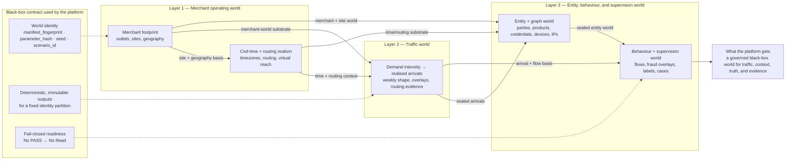
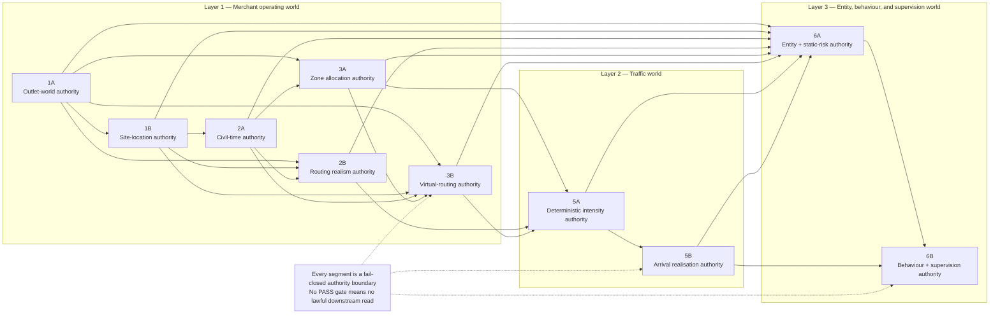
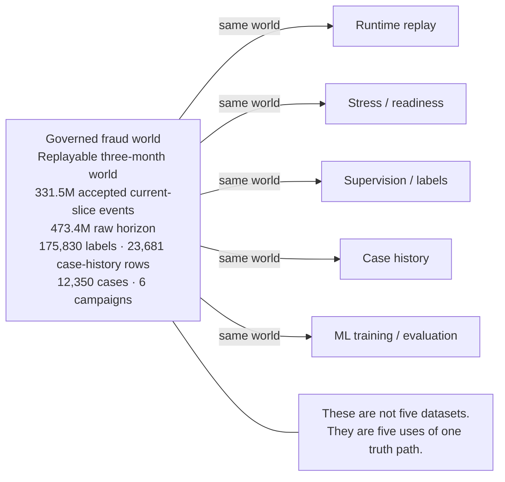

# Canonical Portfolio Source

## Section 1 — Identity, Scope, and Master Claim

**Section job**
Open the portfolio from professional identity, not from project identity. This section must answer four things immediately: who you are, what class of system problem you own, what makes that believable, and what phase the work is in now. It is the source stance for the rest of the portfolio, not a decorative introduction. 

**Recruiter doubt this section kills**
“Is this another recent graduate with a strong project?”
This section must prevent that downgrade before it starts by making the platform read as evidence for a broader capability class, not as the whole story. The portfolio doctrine is explicit that the portfolio exists to make your ML Platform / MLOps claim visible, believable, and defensible, and the speaking posture is explicit that the platform is your proof surface, not your identity.

**Section claim**
You are an ML Platform / MLOps engineer who builds production-shaped ML systems end to end, and the AWS fraud platform is the evidence chain for that scope. The platform is already real, already earned-ready on the bounded standard, and the current phase is live operating responsibility above that baseline rather than vague future work or already-concluded long-horizon proof.

**Canonical section prose**
I’m an ML Platform / MLOps engineer who builds production-shaped ML systems end to end. My scope is not “fraud” as a domain label; it is the governed data foundations, streaming runtime and learning paths, model delivery and rollback, observability, auditability, recovery, and cost-aware operating discipline required to run ML systems credibly under pressure. My recent AWS fraud platform is the proof surface for that scope: I built the governed world first, turned it into one shared operating reality, built the platform across runtime and governed learning, took it through bounded production readiness, and I’m now working in the capstone operating layer above that ready baseline. This portfolio is not a project tour. It is the visual evidence pack for the class of engineering problem I can own.

**Compressed version**
I build production-shaped ML platforms and MLOps systems end to end, and I’ve been using this AWS fraud platform to prove that scope across governed data, real runtime and learning paths, earned readiness, and now live operating conditions. 

**Why this section matters**
The portfolio doctrine says the portfolio sits between the resume and the repo/docs as a controlled narrative surface for recruiters and semi-technical readers. That means the opening section cannot behave like a README, biography, or architecture tour. It has to make the professional claim land cleanly before any detail appears, so the rest of the portfolio feels like proof rather than explanation. 

**Proof anchors allowed in this section**
Keep this section lightly anchored. The opening should not flood the reader with metrics, but it can quietly carry three truths nearby: the system is real, the platform earned bounded readiness, and the current layer is operating responsibility above that baseline. The speaking-posture material also recommends keeping one serious-world anchor, one readiness-under-pressure anchor, and one current-operating anchor mentally nearby so the opening feels real quickly without turning into a data dump. 

**Approved visual surface**
This section should stay visually restrained. The best option is a minimal opener built around four compact bands or blocks: **Identity**, **Scope**, **Proof Surface**, and **Current Edge**. A second acceptable option is a split layout with your professional claim on one side and the platform-as-evidence framing on the other. It should not use a full system graph yet, because the doctrine warns against letting diagrams outrun the claim.

**Tone guardrails**
This section must feel calm, precise, serious, non-apologetic, selective, and high-signal. It must not sound biographical, needy, tool-first, project-first, or like you are asking permission to count the work as experience. The tone target is measured force.

**What this section must not drift into**
Do not start with “I’m a recent graduate,” “I needed experience,” or “I built a fraud platform.” Do not let the tool stack appear before scope. Do not make fraud sound like your professional scope. Do not make the current phase sound like completed long-horizon production proof. The correct order is identity → scope → proof surface → current edge.

**Slide extraction note**
When this section is rendered into the deck, it should likely become Slides 1 and 2 together: the cover/identity slide and the “what this portfolio proves” slide. The slide version should stay shorter than this section, but inherit the same sequence: identity first, claim second, platform as evidence third, current edge last.

## Draft-ready version for the canonical portfolio doc

### 1. Identity, Scope, and Master Claim

I’m an ML Platform / MLOps engineer who builds production-shaped ML systems end to end. My scope spans governed data foundations, streaming runtime and learning paths, model delivery and rollback, observability, auditability, recovery, and cost-aware operation. My recent AWS fraud platform is the proof surface for that scope: a governed world, a real platform, earned bounded readiness, and now a live operating layer above that ready baseline. This portfolio exists to make that claim visible, believable, and defensible.

This opening section should not be read as “here is my project.” It should be read as “here is the class of ML Platform / MLOps ownership I can carry, and here is the evidence chain that proves it.” The platform is not my identity. It is the surface through which that broader engineering scope becomes concrete. 

Section 2 should then move straight into **what this portfolio proves**, so the recruiter sees the proof-pack logic before the deeper platform story begins.

---

## Section 2 — What This Portfolio Proves

**Section job**
Tell the reader how to read the portfolio before any deeper proof appears. This section is the contract for the whole artifact: it explains that the portfolio is not a project showcase, not a repo tour, and not a technical deep dive, but a recruiter-facing evidence pack designed to make one professional claim visible, believable, and defensible. 

**Recruiter doubt this section kills**
“Is this just a polished project deck?”
This section must close that doubt immediately. The doctrine is explicit that the portfolio is the controlled narrative surface between the resume and the implementation-heavy docs, and that the audience should not need to decode your A / Bi / Bii materials to understand what class of engineer you are. 

**Section claim**
This portfolio proves that you build and own production-shaped ML Platform / MLOps systems end to end, and that the AWS fraud platform is the evidence chain for that claim. It proves that claim through an ordered ladder: governed fraud world, shared operating world, real platform, earned bounded readiness, governed MLOps corridor, operable/cost-real system, and current operating mission. That order matters because it makes the system feel progressively more real, more credible, and more operational.  

**Canonical section prose**
This portfolio should be read as a proof pack, not as a project tour. Its purpose is to make one professional claim land clearly: I build and own production-shaped ML Platform / MLOps systems end to end, and this AWS fraud platform is the evidence chain that makes that claim believable. The platform is not the identity being sold; it is the proof surface through which the broader engineering scope becomes visible.  

To make that claim credible, the portfolio follows one ordered storyline. It begins with the governed fraud world so the platform is never judged on toy data, then shows how that world becomes one shared operating reality for runtime, supervision, cases, and ML. From there it shows the real platform, the earned readiness under bounded pressure, the governed learning and release corridor, the operable and cost-real day-2 surface, and finally the current capstone operating layer above the already-ready baseline. This is not decorative sequencing. It is the proof logic of the whole portfolio.  

The success condition is also explicit. Before a call, a recruiter should already be able to conclude that this is not toy data, not a one-off model demo, not endless unfinished building, and not someone who only understands one stage of the chain. They should already see governed data, runtime, learning/release, and operations as one owned system, with the current phase framed as live operating responsibility rather than vague future work.  

**Compressed version**
This portfolio is a recruiter-facing visual evidence pack. It uses one platform to prove a broader claim: that I build production-shaped ML Platform / MLOps systems end to end, from governed world and shared truth path, through real platform and earned readiness, into governed learning, operability, and live operating responsibility.  

**Why this section matters**
Without this section, the reader is forced to guess the meaning of the portfolio. That is exactly what the doctrine is trying to prevent. This section makes the portfolio legible before the heavy proof begins, and it pins the audience, the truth boundary, and the success condition up front. In other words, it stops the portfolio from being mistaken for a prettier README or an architecture-first deck. 

**Proof anchors allowed in this section**
This section should stay mostly structural rather than numeric. Its anchors should be the seven-stage ladder, the “platform as evidence, not identity” correction, and the success-condition conclusions the recruiter should reach before a call. If a small reality anchor is needed, it should be one short phrase like “real platform, earned readiness, live operating responsibility,” not a flood of metrics yet.  

**Approved visual surface**
The best visual here is a clean storyline map: a horizontal or rising seven-stage progression with short labels and one-line consequences. A second good option is a split visual with **professional claim** on one side and **platform as evidence chain** on the other. This is not the place for a system graph, metrics table, or dense architecture view. 

**Tone guardrails**
This section should feel calm, precise, serious, selective, and high-signal. It should sound like someone setting the proof frame for owned work, not someone trying to persuade by noise. The posture is measured force, not decoration, not hype, and not tutorial energy. 

**What this section must not drift into**
Do not let it become a biography, a tool list, a repo tour, a system graph explanation, or a metrics dump. Do not start explaining fraud as a domain in depth. Do not make the current operating layer sound like already-completed long-horizon proof. And do not let the platform become the identity instead of the evidence.  

**Slide extraction note**
When rendered into the deck, this section should likely feed **Slide 2 — What this portfolio proves** and **Slide 3 — The story in one view**. The slide version should be lighter and more visual, but it should preserve the same three things: the master claim, the seven-stage proof ladder, and the recruiter-level success condition. 

## Draft-ready version for the canonical portfolio doc

### 2. What This Portfolio Proves

This portfolio is not a project showcase. It is a recruiter-facing visual evidence pack designed to make one professional claim visible, believable, and defensible: I build and own production-shaped ML Platform / MLOps systems end to end, and this AWS fraud platform is the evidence chain that proves that scope. The platform is not my identity; it is the proof surface through which that broader engineering claim becomes concrete.  

The portfolio proves that claim through one ordered storyline: governed fraud world, shared operating world, real platform, earned bounded readiness, governed MLOps corridor, operable/cost-real platform, and current operating mission. That order matters because it lets the reader feel the system becoming more real, more credible, and more operational with each step. By the end of the portfolio, a recruiter should already be able to conclude that this is not toy data, not a one-off model demo, not endless unfinished building, and that the current work sits in live operating responsibility above an already-ready platform.  

----

Yes — here Section 3 should be **strictly the map**.

It is the section that tells the reader: **this is the order in which the claim becomes believable**. It should not start proving Stage 1 in detail yet, and it should not leak into the deep content of later sections. The doctrine is explicit that the portfolio must follow the canonical storyline in order, because that order is what makes the system feel progressively more real, more credible, and more operational. 

## Section 3 — Canonical Storyline Overview

**Section job**
Give the reader the full proof arc in one view before the portfolio starts zooming into individual stages. This section is the orientation layer for the rest of the artifact. It tells the recruiter what the ladder is, why it is ordered this way, and what kind of conclusion they should be moving toward as they go through it. 

**Recruiter doubt this section kills**
“Is this deck just a pile of unrelated claims?”
This section closes that doubt by showing that the portfolio is one structured evidence chain rather than a collection of nice-looking platform facts. The canonical storyline is the content architecture underneath the speaking posture and the portfolio, and it is meant to be inherited by all outward-facing assets.  

**Section claim**
This portfolio follows one canonical seven-stage ladder: governed fraud world, shared operating world, real ML platform, earned production readiness, governed MLOps corridor, operable/cost-real system, and current operating mission. That order is not decorative. It is the logic by which the platform moves from “interesting” to “serious,” and from “serious” to “credible for ML Platform / MLOps ownership.” 

**Canonical section prose**
This portfolio is built on one ordered storyline. It starts with the governed fraud world, because the platform should never be judged on toy data. It then shows how that world becomes one shared operating reality for runtime, supervision, case history, and ML. From there, it shows the platform itself as a real production-shaped system with owned boundaries and shared controls; the bounded readiness proof that moved it from wired to earned; the governed learning, release, and rollback corridor; the operator, audit, recovery, and cost surfaces that made it operable like a real shared system; and finally the current capstone operating layer above that already-ready baseline.  

That order matters. The doctrine says it is non-negotiable because it makes the recruiter feel the system becoming more real, more credible, and more operational with each step. In other words, the portfolio is not simply listing what exists. It is controlling how belief is earned. 

This section should also make the reading consequence explicit: by the end of the ladder, the recruiter should already feel that the work is not toy data, not a one-off model demo, not endless unfinished building, and not a candidate who only understands one stage of the lifecycle. They should feel one coherent chain: governed world, shared truth path, real platform, earned readiness, governed learning, day-2 operability, and live operating responsibility.  

**Compressed version**
The portfolio follows one seven-stage proof chain: governed world, shared operating world, real platform, earned readiness, governed MLOps, operability/cost realism, and current operating mission. The order is deliberate: it makes the system feel progressively more real, more credible, and more operational. 

**Why this section matters**
Without this section, the recruiter is forced to infer the portfolio’s structure while reading it. That weakens the effect of every later section. This overview gives them the map first, so when they see later diagrams, metrics, and proof surfaces, they already understand what those details are doing in the larger argument. The speaking-posture material is clear that the storyline is the content architecture, while the posture is the authorial voice extracted from it. This section is where that content architecture becomes visible. 

**Proof anchors allowed in this section**
This section should stay mostly structural, not numeric. The only proof anchors it really needs are the seven stages themselves and the success-condition logic they support. At most, one short reinforcing phrase such as “real platform, earned readiness, live operating responsibility” is enough. The heavier numbers belong in the later stage sections.  

**Approved visual surface**
The best visual here is a clean horizontal or rising journey graphic with seven stops:

1. Governed fraud world
2. Shared operating world
3. Real ML platform
4. Earned production readiness
5. Governed MLOps corridor
6. Operable / cost-real system
7. Current operating mission

Each stop should have a short consequence line, not a paragraph. This section is not the place for a platform diagram, a metrics table, or a dense Mermaid graph. The doctrine’s rule is that every slide must have one claim, one visual proof surface, a few proof points, and one recruiter consequence; here the visual proof surface is the ladder itself. 

**Tone guardrails**
This section should feel calm, architected, and controlled. It should sound like someone guiding the reader through an evidence chain, not someone excitedly previewing every technical accomplishment at once. The portfolio doctrine says the right emotional tone is measured force, and that is especially important here. 

**What this section must not drift into**
Do not let this section become:

* a proof-heavy summary of all seven stages
* a decorative roadmap with no consequence
* a full system tour
* a metrics preview slide
* a place where Bii is overstated as already-completed long-horizon proof

It must stay a map of the argument, not the argument itself. The doctrine is explicit that Bii should be shown as the current capstone operating mission above an already-ready platform, not vague future work and not already-concluded long-horizon proof. 

**Slide extraction note**
This section should map directly to **Slide 3 — The story in one view**. The slide should be lighter than the section text, but it should preserve three things: the seven-stage ladder, the reason the order matters, and the final recruiter consequence that the system becomes more real and more operational with each step. 

## Draft-ready version for the canonical portfolio doc

### 3. Canonical Storyline Overview

This portfolio follows one ordered proof chain. It starts with the governed fraud world, then shows how that world becomes one shared operating reality for runtime, supervision, cases, and ML. From there, it shows the real platform, the earned bounded readiness that moved it from wired to credible, the governed learning and release corridor, the operable and cost-real day-2 surface, and the current operating mission above the already-ready baseline.  

That order is deliberate. It is the logic by which the claim becomes believable. The recruiter should feel the system becoming more real, more credible, and more operational with each step, until the final conclusion is already available before a call: this is not toy data, not a one-off model demo, not endless unfinished building, but one production-shaped ML Platform / MLOps system whose current phase is live operating responsibility above an earned-ready platform.  

---

## Section 4 — Governed Fraud World

**Section job**
Prove that the platform was not hardened on toy data, mock fixtures, or one-off convenience tables. This section must show that you solved the world first, and that the platform later depended on that world through a governed black-box contract rather than by casually reaching into internal generation logic.   

**Recruiter doubt this section kills**
“Was this built on fake demo data?”
This section should make the answer feel immediate: no. The data engine was designed as a layered synthetic fraud world with explicit lineage, explicit legitimacy gates, and downstream read restrictions, so the platform was judged against an engineered reality rather than a convenient sample.  

**Section claim**
Before proving the platform, you engineered a governed fraud world. That world was layered, deterministic at the identity level, replayable, and fail-closed at the legitimacy boundary. The platform then treated the engine as a governed black box with explicit world identity, authoritative outputs, and “no PASS → no read” rules, rather than as an internal data helper.   

**Canonical section prose**
I did not begin with a model, a dashboard, or a thin runtime path. I began by engineering the world the platform would have to survive. That meant building a layered synthetic fraud data engine that constructs merchant geography and demand, routing and civil-time realism, entity and device surfaces, legitimate behaviour, fraud overlays, labels, and case chronology as one governed operating world rather than as disconnected synthetic tables. In portfolio terms, that is the important correction: the system was never meant to be proven on convenient mock data. It was meant to be proven against an engineered world with its own laws.   

That world was not only rich; it was governed. The black-box interface pins world identity through `manifest_fingerprint`, `parameter_hash`, `seed`, and `scenario_id`; it promises deterministic, immutable outputs for a fixed identity partition; and it requires segment-level HashGates so downstream consumers verify legitimacy before treating any output as authoritative. In plain language, the platform did not trust the world because files existed. It trusted the world because the world had identity, declared outputs, and fail-closed publish gates.  

The engine was also layered in a way that matters recruiter-side. `1A` establishes a lawful merchant-to-outlet world with replay validation and publish legitimacy; `1B` turns that into certified site-location truth; `2A` and `2B` make civil-time and routing law explicit; later layers close entity/product/device/static-risk truth and then behavioural, fraud, label, and case truth. That means the world was not one flat synthetic export. It was a staged operating reality with separate owned truths that had to reunify cleanly before downstream use.     

Just as important, the platform treated that engine in the right role. The production wiring notes pin the external engine world as a producer-owned, read-only source world that the platform realizes through a governed oracle boundary rather than through ad hoc copies or local shortcuts. That black-box treatment is part of why this section works recruiter-side: it shows the data engine as a serious governed proof layer, not as a loose code dependency hidden inside the platform.   

**Compressed version**
I built the governed fraud world before I proved the platform. The data engine created a layered, replayable, legitimacy-gated operating world, and the platform depended on it through a black-box contract with explicit identity, immutable outputs, and fail-closed read gates. That is why the platform was hardened on a serious world rather than on toy data.   

**Why this section matters**
Your doctrine is explicit that the data engine must appear strongly, but in the right role: not as the whole sale, and not as state-by-state research detail, but as the reason the platform was not hardened on toy data and the reason later readiness and operating claims are believable. This section is where that trust foundation gets established.  

**Proof anchors allowed in this section**
The best anchors here are: layered world construction, deterministic lineage and immutability, fail-closed publish legitimacy, and the fact that the platform consumed the engine through a black-box governed interface. One light reality anchor such as “one replayable three-month fraud world” is fine here, but the heavier scale numbers belong more strongly to Section 5, where the shared operating world becomes the focus.   

**Approved visual surface**
The best core visual here is a **layered governed-world map** or a **simplified data-engine network graph**. It should show the major world families only, such as merchant/outlet world, site/civil-time/routing world, entity/device/static-risk world, and behavioural/fraud/label/case world. A small contract strip can sit underneath it showing the black-box rules: identity, immutable outputs, and **No PASS → No Read**. That keeps the visual recruiter-facing while still making the governance burden visible. 

**Tone guardrails**
This section should feel serious, governed, and non-defensive. The point is not “look how sophisticated my synthetic data work is.” The point is “this platform stood on a world serious enough to trust.” That is exactly the role your doctrine assigns to the data engine in the portfolio. 

**What this section must not drift into**
Do not let it become a segment-by-segment implementation walkthrough, a stochastic-methods lecture, or a proof-of-research slide. Do not default into raw state IDs, remediation trails, or deep component call graphs in the core portfolio. Those details increase density faster than belief and belong in appendix or GitHub instead. 

**Slide extraction note**
This section should map directly to **Slide 4 — Governed fraud world**. The slide version should stay disciplined: one claim, one layer map, a few proof anchors, and one recruiter consequence. The key recruiter consequence is simple: **this system was not hardened on toy data.** 

## Draft-ready version for the canonical portfolio doc

### 4. Governed Fraud World

I solved the world first. Before proving the platform, I built a layered synthetic fraud data engine that constructs the governed operating world the platform would later have to survive: merchant geography and demand, site and civil-time context, routing realism, entity and device surfaces, legitimate behaviour, fraud overlays, labels, and case chronology. This was not synthetic data as a convenience layer. It was the world-definition layer for the whole platform claim.  

The platform then treated that engine as a governed black box. World identity was explicit, outputs were immutable for a fixed identity partition, downstream semantics were declared, and segment outputs were only authoritative after fail-closed gate verification. In other words, the platform was not hardened on random mock data or on files that merely happened to exist. It was hardened on a governed, replayable world with explicit legitimacy boundaries.   

The recruiter consequence is the one this section must make unmistakable: **the platform’s later runtime, readiness, and MLOps claims rest on an engineered reality, not on toy data.** 

### Core visual — layered governed-world map

This version expresses the right recruiter-facing idea:
Layer 1 certifies the merchant operating world, Layer 2 turns that into deterministic demand and realised arrivals, and Layer 3 turns the arrivals plus upstream world into entities, behaviour, labels, and cases. The platform then consumes that through a governed black-box contract rather than through engine internals.   

### Backup visual — simplified data-engine network graph

This is the better technical backup because it preserves the named authorities across `1A–6B` without dropping into state-level internals. It reflects the same layered story: Layer 1 builds the merchant operating world, Layer 2 builds the traffic world, and Layer 3 builds the entity/behaviour/supervision world.  

---

## Section 5 — One Shared Operating World

**Section job**
Prove that the governed fraud world did not feed one experiment or one narrow runtime test. This section must show that runtime replay, stress, supervision, case history, and later ML training/evaluation all lived on **one governed truth path** instead of on separate easier datasets for separate claims. That is the whole point of Stage 2 in your doctrine.  

**Recruiter doubt this section kills**
“Did each part of the system use its own convenient dataset?”
This section closes that doubt. The portfolio doctrine is explicit that the data engine must function not only as the reason the platform was not hardened on toy data, but also as the reason replay, supervision, cases, and ML all share one truth path. The canonical storyline sharpens that further: the moment runtime, supervision, case history, and ML diverge into separate data realities, the whole platform claim becomes patchwork.  

**Section claim**
You forced the runtime path, the supervision path, the case path, and the ML path to live inside one replayable governed world. The system was not exercised on one dataset for replay, another for labels, another for cases, and another for learning. It was judged on one shared operating reality, which is what makes the later platform, readiness, and MLOps claims coherent rather than assembled from separate proof packs.  

**Canonical section prose**
The data engine was not built to feed one experiment. It was built to create one **shared, replayable operating world** that the whole platform could use. That meant runtime replay, bounded stress, supervision, case history, and later ML training/evaluation all drew from the same governed world rather than from separate toy datasets tuned to make each individual claim easier. In portfolio terms, this is one of the most important transitions in the whole story: the world stops being just “serious input data” and becomes the single truth path that binds the rest of the platform together. 

That shared-world burden is exactly why this section matters recruiter-side. If runtime is exercised on one basis, labels come from another, case history is synthesized differently, and learning is built on a third dataset, then there is no single truth path and the later readiness and MLOps claims become much weaker. The canonical storyline says this plainly: one shared world is harder than multiple easier datasets, but it is precisely what makes the platform, learning corridor, and current operating layer defensible as one system rather than several loosely related experiments. 

This section is where the decisive world-scale anchors belong. The replayable three-month fraud world carried an accepted current slice of about **331.5M events**, backed by a **473.4M-event raw horizon**, with linked supervision and review surfaces carried alongside it: **175,830 flow-level truth labels**, **23,681 case-history rows**, **12,350 distinct cases**, and **6 fraud campaigns**. Those numbers matter not because “big data” is the sale, but because they show that the platform, supervision path, and ML path all had to answer to one serious operating surface rather than to convenient fragments. 

This is also the section where the coherence consequence becomes explicit. Because the same world fed replay, stress, supervision, case history, and learning, the later platform story is not “runtime over here, cases over there, ML somewhere else.” It is one world, one truth path, and therefore one meaningful chain from governed world to runtime behaviour to supervised outcomes to learned model authority. That coherence is one of the strongest recruiter-facing signals in the entire portfolio.  

**Compressed version**
I used one replayable governed fraud world for runtime replay, stress, supervision, case history, and ML. That choice made the story harder but much stronger: the platform, the review path, and the learning path were all judged against the same reality instead of against separate tailored datasets. 

**Why this section matters**
Your doctrine treats this as a major stage for a reason. It is the step that upgrades the story from “serious synthetic world” to “serious operating system.” Once everything shares one truth path, the platform stops looking like a collection of adjacent demonstrations and starts looking like one coherent ML Platform / MLOps system. 

**Proof anchors allowed in this section**
This is where the world-scale and coherence anchors belong:

* **331.5M** accepted current-slice events
* **473.4M** raw horizon
* **175,830** flow-level truth labels
* **23,681** case-history rows
* **12,350** distinct cases
* **6** fraud campaigns

Those are the right metrics here because the doctrine says the main deck should use metrics sparingly but decisively, and scale-of-world is one of the strongest metric classes when it supports seriousness and coherence rather than just impressiveness.  

**Approved visual surface**
The best visual here is a **central governed-world box** feeding five downstream consumers:

* runtime replay
* stress / readiness
* supervision / labels
* case history
* ML training / evaluation

That visual should make one thing unmistakable: these are not five datasets; they are five uses of one world. This is one of the strongest possible recruiter-facing diagrams in the whole deck because it turns “shared truth path” into something immediately legible. 

**Tone guardrails**
This section should feel serious, coherent, and deliberate. It should sound like someone who chose system coherence over convenience. The tone is not “look how large the dataset is.” The tone is “I refused to let easier proof paths weaken the platform claim.” That is one of the most senior-shaped decisions in your whole storyline. 

**What this section must not drift into**
Do not let it become:

* a raw “big numbers” slide
* a second version of Section 4
* a detailed dataset-schema explanation
* an ML-only framing
* a readiness slide in disguise

The point here is not scale alone and not the engine alone. The point is **one shared operating world**. The recruiter consequence is coherence, not just volume. 

**Slide extraction note**
This section should map directly to **Slide 5 — One shared operating world**. The slide should have:

* one claim: everything lived on one truth path
* one visual: governed world feeding runtime, stress, supervision, cases, and ML
* a few proof points: the accepted slice, raw horizon, and linked label/case anchors
* one recruiter consequence: this is one coherent operating world, not disconnected demos. 

## Draft-ready version for the canonical portfolio doc

### 5. One Shared Operating World

The governed fraud world was not built to feed one experiment. It was built to create one replayable operating reality that the whole platform had to share. Runtime replay, bounded stress, supervision, case history, and later ML training/evaluation all drew from the same world instead of from separate easier datasets for separate claims. That choice made the work harder, but it made the story much stronger: the runtime path, the review path, and the learning path were all being judged against the same governed truth. 

The scale of that shared world was already serious enough to matter. The accepted current slice alone carried about **331.5M events**, backed by a **473.4M-event raw horizon**, alongside **175,830 flow-level truth labels**, **23,681 case-history rows**, **12,350 distinct cases**, and **6 fraud campaigns**. Those numbers are not here as spectacle. They are here to show that the platform was exercised on one large, supervision-bearing operating surface rather than on a convenient subset or a stack of disconnected demo datasets. 

The recruiter consequence this section must make unmistakable is simple: **this was one coherent operating world.** The runtime story, the case story, the supervision story, and the learning story were all talking about the same reality. That is what makes the later platform, readiness, and MLOps claims feel unified rather than assembled. 

### Recruiter Facing Visual

It shows one **governed fraud world** feeding **runtime replay, stress/readiness, supervision/labels, case history, and ML training/evaluation**, which is exactly the Stage 2 claim: these are **not five datasets**, but **five uses of one governed truth path**. The scale anchors on the diagram also match the source figures you’ve been using for this section.   

Mermaid version:

This one is ready to sit under **Section 5 / Slide 5**.
