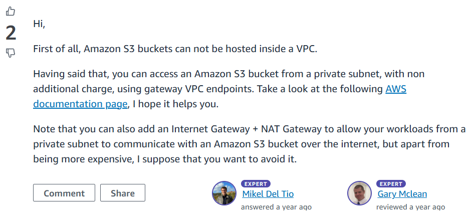

# Summary notes
Summary notes for `IAC-01: Terraform bootstrap: VPC, S3 (fraud-dl-raw, fraud-model-artifacts), IAM roles (least-privilege).`\
Most information is taking from the AWS documentation
---
### [Amazon VPCs](https://docs.aws.amazon.com/vpc/latest/userguide/what-is-amazon-vpc.html)
A VPC is a virtual network that closely resembles a traditional network that you'd operate in your own data center. After you create a VPC, you can add subnets.

**[Subnets](https://docs.aws.amazon.com/vpc/latest/userguide/how-it-works.html#how-it-works-subnet)**: A subnet is a range of IP addresses in your VPC. You launch AWS resources, such as Amazon EC2 instances, into your subnets. You can connect a subnet to the internet, other VPCs, and your own data centers, and route traffic to and from your subnets using route tables.

**[Route table](https://docs.aws.amazon.com/vpc/latest/userguide/how-it-works.html#what-is-route-tables)**: A route table contains a set of rules, called routes, that are used to determine where network traffic from your VPC is directed. You can explicitly associate a subnet with a particular route table. Otherwise, the subnet is implicitly associated with the main route table.


**[Amazon S3](https://docs.aws.amazon.com/AmazonS3/latest/userguide/Welcome.html)**: Amazon Simple Storage Service (Amazon S3) is an object storage service that offers industry-leading scalability, data availability, security, and performance. Customers of all sizes and industries can use Amazon S3 to store and protect any amount of data for a range of use cases, such as data lakes, websites, mobile applications, backup and restore, archive, enterprise applications, IoT devices, and big data analytics. Amazon S3 provides management features so that you can optimize, organize, and configure access to your data to meet your specific business, organizational, and compliance requirements.

#### [How to Access S3 Bucket from Resources within a Private VPC](https://repost.aws/questions/QUOcI2KGfNQk2nCZyS48WHHg/how-to-access-s3-bucket-from-resources-within-a-private-vpc)


### Accessing the Internet
You control how the instances that you launch into a VPC access resources outside the VPC.

A default VPC includes an internet gateway, and each default subnet is a public subnet. Each instance that you launch into a default subnet has a private IPv4 address and a public IPv4 address. These instances can communicate with the internet through the internet gateway. An internet gateway enables your instances to connect to the internet through the Amazon EC2 network edge.

By default, each instance that you launch into a nondefault subnet has a private IPv4 address, but no public IPv4 address, unless you specifically assign one at launch, or you modify the subnet's public IP address attribute. These instances can communicate with each other, but can't access the internet.

You can enable internet access for an instance launched into a nondefault subnet by attaching an internet gateway to its VPC (if its VPC is not a default VPC) and associating an Elastic IP address with the instance.

Alternatively, to allow an instance in your VPC to initiate outbound connections to the internet but prevent unsolicited inbound connections from the internet, you can use a network address translation (NAT) device. NAT maps multiple private IPv4 addresses to a single public IPv4 address. You can configure the NAT device with an Elastic IP address and connect it to the internet through an internet gateway. This makes it possible for an instance in a private subnet to connect to the internet through the NAT device, routing traffic from the instance to the internet gateway and any responses to the instance.

If you associate an IPv6 CIDR block with your VPC and assign IPv6 addresses to your instances, instances can connect to the internet over IPv6 through an internet gateway. Alternatively, instances can initiate outbound connections to the internet over IPv6 using an egress-only internet gateway. IPv6 traffic is separate from IPv4 traffic; your route tables must include separate routes for IPv6 traffic.

### [IAM users and groups](https://docs.aws.amazon.com/vpc/latest/userguide/security-iam.html) 
IAM user is an identity within your AWS account that has specific permissions for a single person or application. Where possible, we recommend relying on temporary credentials instead of creating IAM users who have long-term credentials such as passwords and access keys.

An IAM group is an identity that specifies a collection of IAM users. You can't sign in as a group. You can use groups to specify permissions for multiple users at a time. Groups make permissions easier to manage for large sets of users. For example, you could have a group named IAMAdmins and give that group permissions to administer IAM resources.

----

## IAC-01 — Terraform “Sandbox” Bootstrap

### Thinking Path
> **Outcome for Sprint-01:**
> *A reproducible Terraform stack that creates:*
>
> 1. a **sandbox VPC** (so nothing runs in your default “flat” VPC),
> 2. two **S3 buckets** (`fraud-raw-<acct>` & `fraud-artifacts-<acct>`),
> 3. one **least-privilege IAM role** future SageMaker jobs can assume.
>    *Checkov/tfsec* and the CI you already wired must pass on the first PR.

---

### 0 · Why IaC and why **now**

| Pain you’d feel without IaC                  | How Terraform solves it                     | Line you’ll say in interviews                   |
|----------------------------------------------|---------------------------------------------|-------------------------------------------------|
| “Click-ops” drift you can’t reproduce.       | Declarative source-controlled files.        | “The repo is the single source of infra truth.” |
| Hard to spin up / tear down cheap sandboxes. | `terraform apply` / `destroy` in minutes.   | “Cost control equals `make nuke`.”              |
| Proving *least-privilege* to an auditor.     | Policies are diff-able, peer-reviewed code. | “Security is code-reviewed, not tribal.”        |

Keep that mental model every time you touch .tf files.

---

### 1 · What you need to **learn / research**

1. **Terraform AWS provider docs**—resources:

   * `aws_vpc`, `aws_subnet`, `aws_internet_gateway`, `aws_route_table`, `aws_route_table_association`
   * `aws_s3_bucket`, `aws_s3_bucket_versioning`, `aws_s3_bucket_server_side_encryption_configuration`
   * `aws_iam_role`, `aws_iam_policy`, `aws_iam_role_policy_attachment`
2. **AWS Well-Architected — Security Pillar** → tags, encryption, least-privilege.
3. **IAM trust policies** vs **permission policies** (they’re different JSON docs).
4. **Terraform remote state**—why an S3 backend (+ DynamoDB lock) is safer than local.

> **Primary docs first**, blog posts only to plug gaps.

---

### 2 · Design decisions you must make (write ADR-0003 as you decide)

| Topic                          | Guiding questions                                                                                        |
|--------------------------------|----------------------------------------------------------------------------------------------------------|
| **Region**                     | Stick to one (eu-west-2?) for latency + free-tier alignment.                                             |
| **CIDR**                       | `10.10.0.0/16` is common; enough space yet far from corp ranges.                                         |
| **Public vs private sub-nets** | Do we need NAT Gateways now? (They cost \$…) → You can start **all-public** in the sandbox to stay free. |
| **Bucket naming**              | Must be globally unique; include `${var.environment}` to avoid collisions.                               |
| **Encryption**                 | SSE-S3 is free; SSE-KMS costs but meets stricter compliance—pick SSE-S3 now, document upgrade later.     |
| **Remote state**               | Implement S3 backend **next sprint**; keep local first to avoid chicken-and-egg (needs a bucket).        |
| **IAM role scope**             | Minimum: `s3:ListBucket`, `s3:GetObject`, `s3:PutObject` on the two buckets. No wildcard `*`.            |

Write those answers down; they’ll turn into variable defaults or comments in `versions.tf`.

---

### 3 · Directory layout you’ll create

```
infra/
└── terraform/
    ├── main.tf            # high-level resources
    ├── variables.tf       # region, env, tags, CIDR
    ├── outputs.tf         # bucket names, VPC ID
    ├── versions.tf        # provider & terraform required versions
    └── modules/           # leave empty now; refactor later
```

Minimal root first → refactor into `modules/` when complexity grows (you’ll feel the need).

---

### 4 · Local prerequisites & first commands

1. **Install Terraform** (`tfenv install 1.7.1` → `tfenv use 1.7.1`).
2. **AWS CLI profile** `aws configure --profile fraud-sandbox` (Access Key, Secret, default region).
3. Export creds just for `terraform` commands:

   ```bash
   export AWS_PROFILE=fraud-sandbox
   ```

---

### 5 · Process you’ll follow (“how I thought through it”)

| Step                               | What you do                                                                                   | Why                                                             |
|------------------------------------|-----------------------------------------------------------------------------------------------|-----------------------------------------------------------------|
| 1. Initialise repo                 | `terraform init`                                                                              | Downloads provider + writes `.terraform.lock.hcl` (pin hashes). |
| 2. Build resources bottom-up       | VPC → subnets → IGW → route table                                                             | Upstream IDs needed by downstream.                              |
| 3. Add S3 buckets                  | Turn on versioning + encryption + public-access-block.                                        | Free, security best-practice.                                   |
| 4. IAM role                        | Craft **assume-role** block first (trust). Attach inline JSON policy referencing bucket ARNs. |                                                                 |
| 5. `terraform plan`                | Spot typos before AWS billing spins.                                                          |                                                                 |
| 6. `terraform apply -auto-approve` | Sandbox only; later require manual.                                                           |                                                                 |
| 7. Verify in AWS Console           | Confidence building; screenshots for Sprint Review.                                           |                                                                 |
| 8. `terraform destroy`             | Cost discipline & validates teardown.                                                         |                                                                 |
| 9. Commit .tf + state lock file    | State **lock file** goes to Git; `terraform.tfstate` stays git-ignored.                       |                                                                 |
| 10. Push PR → CI                   | `terraform fmt` + **tfsec** + **Checkov** run automatically.                                  |                                                                 |

Take screenshots of the **plan** output and the two buckets in AWS Console—drop them later in the Sprint-Review doc.

---

### 6 · Acceptance criteria checklist (copy to Sprint-01 file)

* [ ] `terraform init`, `plan`, `apply`, `destroy` succeed with **zero warnings**.
* [ ] VPC appears in AWS Console → *VPCs*.
* [ ] Buckets visible, encryption: **SSE-S3**, versioning **Enabled**, public access **Blocked**.
* [ ] IAM role shows **only** S3 list/get/put on those buckets (no `*`).
* [ ] `tfsec` & `checkov` steps pass (no HIGH findings).
* [ ] PR merged → card **IAC-01** to **Done**.

---

### 7 · Reflection prompts (write answers in your journal)

1. *Why is a NAT Gateway over-kill (and costly) for this sandbox?*
2. *What risks remain with local state, and how will moving to an S3 backend solve them?*
3. *What is the difference between `aws_iam_role_policy` and `aws_iam_role_policy_attachment`?*
4. *How would you tag resources so cost explorer can filter by “project=fraud”?*

---

## IAC-01 — Code Break Down
Below is a **line-by-line walk-through** of the new Terraform bundle you shared ( `iac-code.txt` ) so that a second-year CS student can see **what each line does, why it is there, and how Terraform turns it into real AWS resources**.
I keep the original section numbers and large comment banners so you can follow along while the code is open in your editor.&#x20;

---

## 1 `versions.tf`

| Code line                                                | **What it is**                                                                                     | **Why it matters / what would break if removed**                                                                                                                                 |
|----------------------------------------------------------|----------------------------------------------------------------------------------------------------|----------------------------------------------------------------------------------------------------------------------------------------------------------------------------------|
| `required_version = "~> 1.7"`                            | “Use any Terraform **1.7.x** binary.”                                                              | Guarantees the syntax you write today runs unchanged on every teammate’s machine and CI runner. If someone had 0.14 or 1.9 installed, commands might fail or behave differently. |
| `required_providers { aws = { … version = "~> 5.36" } }` | Pins the **AWS provider** to “5.36 ≤ v < 6”.                                                       | Terraform downloads providers dynamically. Pinning avoids a future 6.x release that deprecates or renames arguments (a common source of “unknown attribute” errors).             |
| `provider "aws" { … }`                                   | Declares one AWS provider block. Every resource that lacks its own `provider =` tag will use this. | Without a provider Terraform can’t authenticate or know which API endpoints to call.                                                                                             |
| `region = var.aws_region`                                | Reads the value of the **input variable** defined later.                                           | Hard-coding the region would force London forever; passing a variable lets you reuse the same stack in `us-east-1` with a single CLI flag.                                       |
| `default_tags { … }`                                     | Adds **two tags to *every* resource** automatically.                                               | Saves you from forgetting tags on individual buckets or subnets and keeps Cost Explorer neat.                                                                                    |

---

## 2 `variables.tf`

**Variable blocks are just strongly-typed function parameters.** They allow the *same* .tf files to produce dev, test or prod stacks.

| Block                      | Key attributes                              | How Terraform uses them                                                                                                                 |
|----------------------------|---------------------------------------------|-----------------------------------------------------------------------------------------------------------------------------------------|
| `variable "aws_region"`    | `default = "eu-west-2"`                     | If the caller passes nothing, resources deploy in London. Pass `-var="aws_region=us-east-1"` to switch.                                 |
| `variable "environment"`   | Values like `"sandbox"`, `"dev"`, `"prod"`. | Flow through into tags (`environment = var.environment`) so every resource exposes what stage it belongs to.                            |
| `variable "vpc_cidr"`      | `"10.10.0.0/16"`                            | Forms the *address-space* for the whole VPC. Smaller / bigger CIDRs cost nothing but change how many subnets & hosts fit.               |
| `variable "bucket_suffix"` | **No default** → **required**.              | S3 names are global. By forcing a caller-supplied suffix (often your GitHub user or a timestamp) we avoid “BucketAlreadyExists” errors. |

**How variables arrive at runtime**

```bash
# ad-hoc
terraform plan -var="bucket_suffix=esosa-1234"

# structured
cat > terraform.tfvars <<EOF
bucket_suffix = "esosa-$(date +%s)"
EOF
terraform plan
```

---

## 3 `main.tf`

### 3.1 Networking (VPC, subnet, gateway, routing)

1. **`aws_vpc "main"`**

   * CIDR `10.10.0.0/16` gives 65 k private IPs.
   * `enable_dns_hostnames = true` lets future EC2/Lambda instances register `ip-10-10-x-x.eu-west-2.compute.internal` in Route 53 automatically.

2. **`aws_subnet "public_a"`**

   * `cidrsubnet(var.vpc_cidr, 8, 0)` is a helper that splits the /16 into 256 /24s and picks the first (`10.10.0.0/24`).
   * `map_public_ip_on_launch = true` tells AWS to attach an **Elastic IP** whenever an instance lands here.
   * `${var.aws_region}a` anchors the subnet in **Availability-Zone a** of the chosen region.

3. **Internet-facing pieces**

   * `aws_internet_gateway "gw"` → physical router that gives the VPC a path to the Internet backbone.
   * `aws_route_table "public"` → IPv4 route `0.0.0.0/0 → igw-xxx`.
   * `aws_route_table_association` links that route table to `public_a` so resources in that subnet really can reach the Internet.

> **Why no NAT Gateway?** NAT costs \~£0.04 / hour and is unnecessary if every workload can tolerate public IPs (fine in a disposable sandbox).

### 3.2 Storage (two hardened S3 buckets)

Terraform creates **four resources per bucket** because AWS splits configuration into separate APIs:

| Resource                                             | Purpose                                                                                   | Default cost                                                   |
|------------------------------------------------------|-------------------------------------------------------------------------------------------|----------------------------------------------------------------|
| `aws_s3_bucket`                                      | Physical bucket.                                                                          | £0                                                             |
| `aws_s3_bucket_versioning`                           | Turn on object history.                                                                   | £0.013 / GB-month only for *old* versions; negligible in test. |
| `aws_s3_bucket_server_side_encryption_configuration` | Forces AES-256 encryption at rest.                                                        | Free (uses Amazon-managed keys).                               |
| `aws_s3_bucket_public_access_block`                  | Switches that disable **every** way to publish objects publicly (ACL *or* Bucket Policy). | Free                                                           |

*Every security scanner expects encryption, versioning, and block-public-access to pass.*

### 3.3 IAM (least-privilege role)

| Data source / resource                             | What it builds                                               | Why it’s separate                                                                    |
|----------------------------------------------------|--------------------------------------------------------------|--------------------------------------------------------------------------------------|
| `data "aws_iam_policy_document" "sagemaker_trust"` | **Trust policy** (“who may assume the role?”)                | Separating trust from permissions keeps the JSON readable.                           |
| `data "aws_iam_policy_document" "bucket_rw"`       | **Permissions policy** (“what may the role do?”)             | Generates ARNs dynamically so if you rename a bucket the policy still matches.       |
| `aws_iam_role "sagemaker_rw"`                      | The role object that future SageMaker notebooks will assume. | Ties in the trust document.                                                          |
| `aws_iam_role_policy`                              | Inline policy containing the JSON from `bucket_rw`.          | Inline keeps resources at one per repo; attachable policy is overkill at this stage. |

> **Least privilege check:** only `GetObject`, `PutObject`, `ListBucket` on the **two bucket ARNs** – nothing else, no `s3:*`, no other resources.

---

## 4 `outputs.tf`

Outputs are Terraform’s **return values**.

* After `apply`, Terraform prints them so you can copy-paste.
* In scripts, you can fetch them programmatically:

  ```bash
  BUCKET=$(terraform -chdir=infra/terraform output -raw raw_bucket_name)
  aws s3 cp data.parquet s3://$BUCKET/2025-05-18/
  ```

They do **not** create AWS resources; they just read attributes of ones that already exist.

---

## 5 Makefile helpers

A Makefile is a thin UX layer – nothing Terraform-specific happens here, it simply invokes Terraform with the correct working directory.

| Target          | Does                                                                               | Typical use                                                                                      |
|-----------------|------------------------------------------------------------------------------------|--------------------------------------------------------------------------------------------------|
| `make tf-init`  | `terraform init` downloads the provider binary and sets up the local plugin cache. | Run once per new clone or whenever `required_providers` change.                                  |
| `make tf-plan`  | Produces a saved plan file (`plan.out`).                                           | Lets you review or commit the plan artefact to CI.                                               |
| `make tf-apply` | Replays `plan.out` **unchanged**.                                                  | Guarantees you apply exactly what you reviewed.                                                  |
| `make nuke`     | `terraform destroy -auto-approve`                                                  | Satisfies the sprint’s **OPS-02** “cost-teardown script” and is safer than `aws rm --recursive`. |

Internally it uses `-chdir=infra/terraform` so the **repo root** stays clean; you can type `make tf-init` from anywhere in the repo.

---

## 6 End-to-end: how Terraform interprets the files

1. **Parsing** – Terraform loads all `*.tf` in the directory, merges them into one in-memory graph.
2. **Init** – downloads provider `hashicorp/aws` v5.36, validates versions.
3. **Plan** – diff between desired graph and current state (empty → eight “+” creates).
4. **Apply** – calls AWS APIs in dependency order:

   1. create VPC → subnet → IGW → route table & association
   2. create both buckets → apply versioning → apply encryption → block public access
   3. build IAM role + inline policy
5. **State** – writes the physical IDs into `terraform.tfstate` so the next `plan` can detect drift.
6. **Outputs** – queries the freshly-created IDs and prints them.

---

## 7 How to verify every slice of the checklist

| Sprint acceptance criterion    | Command (local)                                                                                   | Expected result                           |                      |
|--------------------------------|---------------------------------------------------------------------------------------------------|-------------------------------------------|----------------------|
| *VPC + subnet + IGW exist*     | `aws ec2 describe-vpcs --filters Name=tag:Name,Values=fraud-sandbox-vpc`                          | JSON shows `State":"available"`.          |                      |
| *Buckets hardened*             | `aws s3api get-bucket-encryption --bucket $(terraform output -raw raw_bucket_name)`               | Returns `"SSEAlgorithm":"AES256"`.        |                      |
| *Least-privilege IAM*          | `aws iam get-role --role-name fraud-sandbox-sagemaker-rw --query "Role.AssumeRolePolicyDocument"` | Principal == `"sagemaker.amazonaws.com"`. |                      |
| *tfsec / Checkov HIGH = 0*     | `tfsec infra/terraform` ; `checkov -d infra/terraform`                                            | Exit 0 with no HIGH findings.             |                      |
| *Destroy leaves account empty* | `make nuke` ; \`aws s3 ls                                                                         | grep fraud\`                              | No matching buckets. |

---

### Recap in plain English

1. **`versions.tf`** locks toolchain versions → “works on my machine” ≈ “works everywhere.”
2. **`variables.tf`** makes the stack reusable and safe (globally-unique bucket names).
3. **`main.tf`** builds exactly eight resources with secure defaults and minimum cost.
4. **`outputs.tf`** exports the identifiers your app will need.
5. **Makefile** wraps the repetitive CLI steps and adds the mandated “nuke” command.

Follow the verification commands, and you’ll *see* each resource both in the **Terraform state** and in the **AWS console / CLI**, giving you concrete confidence that nothing is “garbage in → garbage out.” If any single step yields an unexpected value, paste the output here, and we’ll drill into that specific resource.


