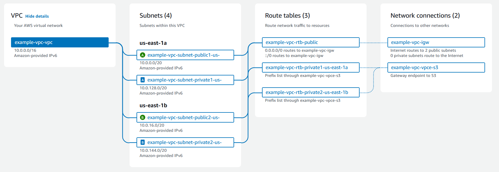

# Summary notes
Summary notes for `IAC-01: Terraform bootstrap: VPC, S3 (fraud-dl-raw, fraud-model-artifacts), IAM roles (least-privilege).`\
Most information is taking from the AWS documentation
---
### [Amazon VPCs](https://docs.aws.amazon.com/vpc/latest/userguide/what-is-amazon-vpc.html)
A VPC is a virtual network that closely resembles a traditional network that you'd operate in your own data center. After you create a VPC, you can add subnets.

**[Subnets](https://docs.aws.amazon.com/vpc/latest/userguide/how-it-works.html#how-it-works-subnet)**: A subnet is a range of IP addresses in your VPC. You launch AWS resources, such as Amazon EC2 instances, into your subnets. You can connect a subnet to the internet, other VPCs, and your own data centers, and route traffic to and from your subnets using route tables.

**[Route table](https://docs.aws.amazon.com/vpc/latest/userguide/how-it-works.html#what-is-route-tables)**: A route table contains a set of rules, called routes, that are used to determine where network traffic from your VPC is directed. You can explicitly associate a subnet with a particular route table. Otherwise, the subnet is implicitly associated with the main route table.

### Accessing the Internet
You control how the instances that you launch into a VPC access resources outside the VPC.

A default VPC includes an internet gateway, and each default subnet is a public subnet. Each instance that you launch into a default subnet has a private IPv4 address and a public IPv4 address. These instances can communicate with the internet through the internet gateway. An internet gateway enables your instances to connect to the internet through the Amazon EC2 network edge.

By default, each instance that you launch into a nondefault subnet has a private IPv4 address, but no public IPv4 address, unless you specifically assign one at launch, or you modify the subnet's public IP address attribute. These instances can communicate with each other, but can't access the internet.

You can enable internet access for an instance launched into a nondefault subnet by attaching an internet gateway to its VPC (if its VPC is not a default VPC) and associating an Elastic IP address with the instance.

Alternatively, to allow an instance in your VPC to initiate outbound connections to the internet but prevent unsolicited inbound connections from the internet, you can use a network address translation (NAT) device. NAT maps multiple private IPv4 addresses to a single public IPv4 address. You can configure the NAT device with an Elastic IP address and connect it to the internet through an internet gateway. This makes it possible for an instance in a private subnet to connect to the internet through the NAT device, routing traffic from the instance to the internet gateway and any responses to the instance.

If you associate an IPv6 CIDR block with your VPC and assign IPv6 addresses to your instances, instances can connect to the internet over IPv6 through an internet gateway. Alternatively, instances can initiate outbound connections to the internet over IPv6 using an egress-only internet gateway. IPv6 traffic is separate from IPv4 traffic; your route tables must include separate routes for IPv6 traffic.

### [IAM users and groups](https://docs.aws.amazon.com/vpc/latest/userguide/security-iam.html) 
IAM user is an identity within your AWS account that has specific permissions for a single person or application. Where possible, we recommend relying on temporary credentials instead of creating IAM users who have long-term credentials such as passwords and access keys.

An IAM group is an identity that specifies a collection of IAM users. You can't sign in as a group. You can use groups to specify permissions for multiple users at a time. Groups make permissions easier to manage for large sets of users. For example, you could have a group named IAMAdmins and give that group permissions to administer IAM resources.

