# Segment 1A — Published Assessment Report (Human‑Readable)
Date: 2026-01-30
Run: `runs\local_full_run-5\c25a2675fbfbacd952b13bb594880e92`
Scope: `data/layer1/1A` outputs only (no RNG logs), with chart-backed statistical evidence.

## 0) Why this report exists
Segment 1A is the **world‑building foundation** for the data engine. It creates the merchant/outlet universe and the scaffolding that later segments use to simulate transactions. Your goal is not “perfect reality,” but **credible realism**: outputs that feel plausible, structurally consistent, and rich enough to support reasonable fraud modeling and explanations.

This report translates the technical assessment into plain language and connects:
- **Design intent** → what 1A is supposed to represent.
- **Implementation interpretation** → how the design was translated into data.
- **Actual output** → what this run produced.
- **Realism grade** → how believable the results are for platform use.

## 1) Design intent in plain language (what 1A should represent)
1A should produce a **repeatable merchant/outlet universe** that feels like a global retail ecosystem:
- Merchants belong to countries and have **multiple outlets** (small shops, branches, locations).
- Most merchants are domestic; some are cross‑border (operate in multiple countries).
- The distribution should be **skewed**: many small merchants, a few giants with huge networks.
- There should be **policy‑driven controls**: eligibility flags, candidate sets, and gate receipts.
- Everything should be **auditable and deterministic** under a given seed and parameter hash.

## 2) Implementation interpretation (what the code actually committed to)
Key interpretation points that matter for realism:
- **S9 is the canonical validation publisher** (data is considered valid only after S9). This improves audit integrity.
- **Strict hashing and manifest fingerprints** mean outputs are tied to exact inputs; reproducibility is strong.
- **Eligibility scoping fixes** ensure “no foreign candidates” doesn’t accidentally mark a merchant as ineligible.
- **Counts parity logic** tolerates “implicit zeros” if certain count outputs are absent.

Implication for you: the data may be structurally valid even when some “approved” datasets are missing, but missing outputs **still reduce fidelity** to the design contract.

## 3) What this run actually produced (plain English inventory)
### 3.0 Priority datasets (by purpose)
If we rank by the purpose of 1A (building the merchant/outlet universe), the importance order is:
1) **outlet_catalogue** - the core world model; everything downstream depends on it.
2) **s6/membership** - actual cross-border memberships; defines real multi-country behavior.
3) **crossborder_eligibility_flags** + **hurdle_pi_probs** - policy gate + propensity that decide who becomes multi-site.
4) **s3_candidate_set** + **s3_base_weight_priors** - the candidate universe that shapes where expansion is possible.
5) **validation / receipts** - audit surfaces (critical for correctness, not realism).

These are the 1A datasets present in this run and what they mean:
- **outlet_catalogue** → the master list of merchants and their outlets (core realism surface).
- **merchant_currency** → the primary currency assigned to each merchant.
- **s3_candidate_set** → for each merchant, which countries are considered as possible foreign expansion targets.
- **s3_base_weight_priors** → baseline weights that bias country selection.
- **crossborder_eligibility_flags** → which merchants are allowed to be cross‑border.
- **crossborder_features** → numeric features (e.g., openness) used in hurdle modeling.
- **hurdle_design_matrix** + **hurdle_pi_probs** → the “propensity” model for being multi‑site.
- **s6/membership** → actual assigned foreign‑country memberships.
- **validation and receipts** → pass/fail gate artifacts and sealing receipts.

Missing (approved but not present in data output):
- **s3_integerised_counts**
- **s3_site_sequence**
- **sparse_flag**
- **merchant_abort_log**
- **hurdle_stationarity_tests**

These missing items do not automatically break realism, but they **reduce auditability and fidelity** to the intended design contract.

## 4) What the numbers say (translated for humans)
### 4.1 Outlet distribution (how “retail‑like” the merchant universe feels)
- **Merchants:** 1,238 across **77 countries**
- **Outlets per merchant:** min 2, median 16, max 2,546
- **Country coverage per merchant:** min 1, median 1, max 11
- **Multi‑country merchants:** 37.4%
- **Outlet concentration:** top 10% of merchants hold ~46% of all outlets

**Interpretation:** This is a classic heavy‑tail distribution: most merchants are small, a few are huge. That’s realistic for retail ecosystems and a good realism signal.

### 4.1A Outlet catalogue integrity checks (core dataset deep‑dive)
These are **dataset‑level sanity checks** that tell us if the outlet universe is internally coherent and realistic:

- **Rows (outlet records):** 31,257  
- **Distinct site_id values:** 2,546  
- **Distinct merchant+site pairs:** 24,555  

**Interpretation:** There are more rows than unique merchant+site pairs, which means **duplicate merchant‑site pairs exist**. This is not necessarily wrong if the duplicates represent **different legal countries** or repeated assignments.

**Duplicate pair analysis:**
- About **12.7%** of merchant‑site pairs are duplicated.
- The duplicates differ primarily by **legal_country_iso** and **final_country_outlet_count**, while other columns stay constant.

**Interpretation:** This implies a single `site_id` can be reused across different legal countries for the same merchant. That can be acceptable **only if `site_id` is a per‑merchant index**, not a globally unique location ID. If downstream assumes site IDs are unique per country, this is a realism risk.

**Flag behavior:**
- `single_vs_multi_flag` is **True for every merchant**.
- Minimum outlets per merchant is **2** (no single‑site merchants).

**Interpretation:** This is a realism weakness. Real economies have many single‑site merchants, but this dataset has **zero**. If the flag truly means “multi‑site,” then we are over‑representing multi‑site merchants and under‑representing small businesses.

**Home vs legal country mismatch:**
- **~38.6%** of rows have `home_country_iso != legal_country_iso`.

**Interpretation:** That is a **high mismatch rate**. It could be realistic for large firms with offshore legal domicile, but for typical retail it is likely too high. This is another realism lever to adjust if you want “everyday merchant” realism.

**Internal consistency check:**
- For every `(merchant_id, legal_country_iso)` pair, **actual outlet rows exactly match `final_country_outlet_count`**.
- `site_order` is **contiguous** (no gaps) for all merchants.

**Interpretation:** The dataset is **internally coherent**. The realism concerns are about population shape (single‑site absence, high legal/home mismatch), not data integrity.

### 4.1B Outlet catalogue realism grade (core dataset)
**Grade: B‑ (Moderate realism, but skewed toward multi‑site/global behavior)**  

**Reasons for this grade:**
1) **Strong realism signals:** outlet distribution is heavy‑tailed (many small, few huge), and the dataset is internally consistent (counts match, site_order contiguous).  
2) **Major realism gap:** there are **zero single‑site merchants** (min outlets = 2; `single_vs_multi_flag` is True for all merchants). This is not realistic for everyday commerce.  
3) **High legal vs home mismatch (~38.6%)** suggests a world with unusually high offshore domicile behavior, which can be realistic for large firms but is too high for typical merchant populations.  
4) **Duplicate merchant‑site pairs (~12.7%)** are acceptable only if `site_id` is an internal per‑merchant index. If downstream assumes unique physical locations, this introduces ambiguity.  

**Summary:** The universe feels plausible in shape, but it over‑represents large/global merchants and under‑represents single‑site businesses. With single‑site inclusion and a lower home/legal mismatch, this could move to A‑ realism.

### 4.1C Outlet catalogue visuals (EDA evidence)
Plots are saved in: `reports/eda/segment_1A/plots/` and embedded below.

**1) Outlets per merchant (distribution + tail)**  
`1_outlet_hist_loglog.png` and `2_outlet_ccdf_loglog.png` show a heavy‑tailed outlet distribution: the bulk of merchants sit in the low‑to‑mid range (median **16**, p90 **36**), while a small set stretches into the hundreds and thousands (p99 **~161**, max **2,546**). The CCDF’s near‑linear log‑log tail indicates the skew is structural, not a handful of outliers. This is exactly what a plausible retail ecosystem looks like—many small firms and a few giants.  

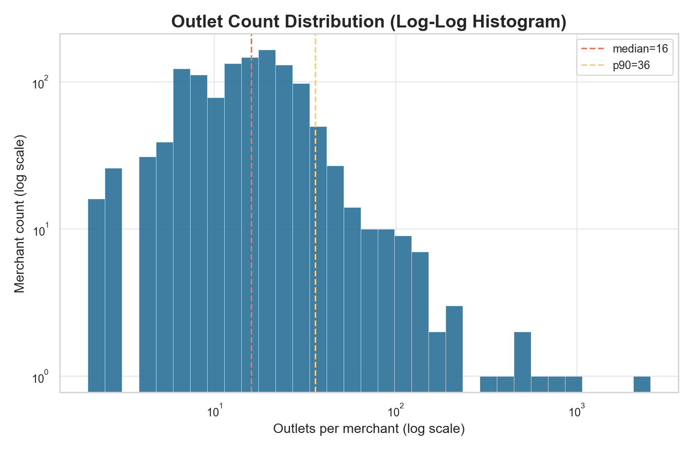

**2) Concentration / inequality**  
`3_lorenz_curve.png` (Gini **~0.53**) and `4_topk_share_curve.png` (top 10% hold **~46%**, top 1% **~24%**) quantify concentration. This level of inequality is realistic for real retail landscapes, where large chains dominate outlet counts. The curve isn’t so extreme that it implies a monopoly world, but it is sufficiently bowed to show realistic concentration.  

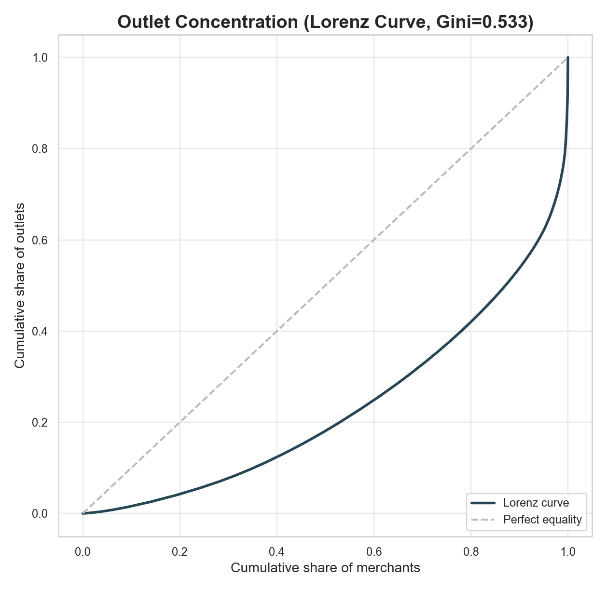
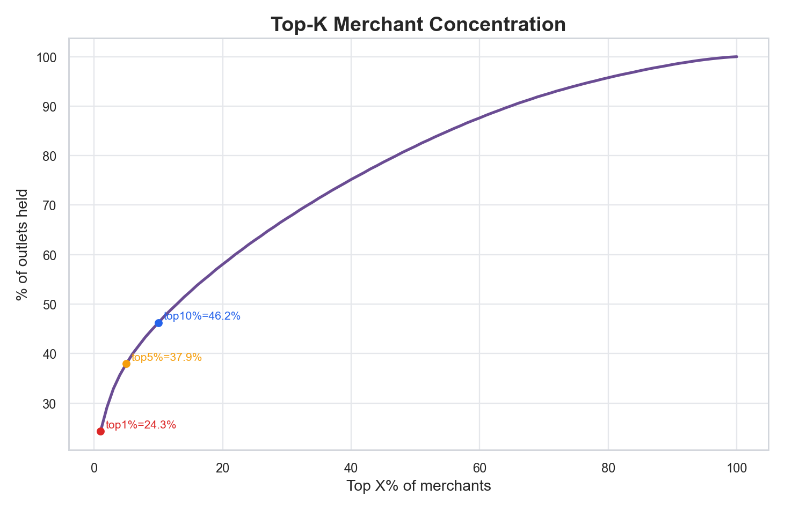

**3) Home vs legal mismatch by merchant size**  
`5_mismatch_vs_size_hex.png` and the updated `6_mismatch_by_decile.png` (now rendered with decile means + 95% CI + decile sample sizes) show mismatch rates in the **~0.35–0.48** band across almost all size buckets. The visual spread and confidence intervals indicate that this is not a small‑sample artifact in one or two deciles; it is a broad population pattern. If offshore legal domicile were mostly a large‑enterprise phenomenon, the smallest deciles should sit materially lower than the largest deciles. They do not. That means the mismatch behavior is a structural generator effect, not simply firm size composition.  

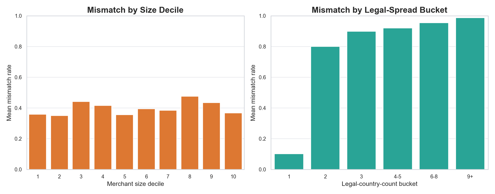

**4) Legal‑country spread per merchant**  
`7_legal_country_ecdf.png` shows most merchants are domestic (**median = 1**), but the tail is meaningful (**p90 = 5**, max 11). `8_size_vs_legal_hex.png` shows that cross‑border spread increases with merchant size, which is expected behavior: larger merchants have more international reach. This is a strong realism signal as long as the tail isn’t too dominant.  

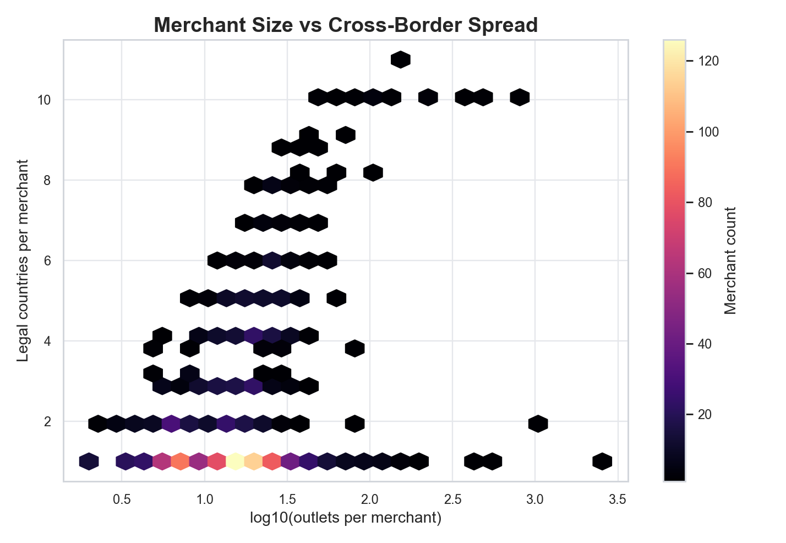

**5) Single vs multi‑site flag sanity**  
`9_flag_violin.png` was replaced with a direct flag‑coverage bar because a one‑class violin is statistically low information. The replacement plus `10_flag_jitter.png` and `15_flag_coverage_bar.png` all confirm the same anomaly: **all 1,238 merchants are flagged True**, **0 are False**. This is not a subtle skew; it is a hard boundary condition in the generated world.  

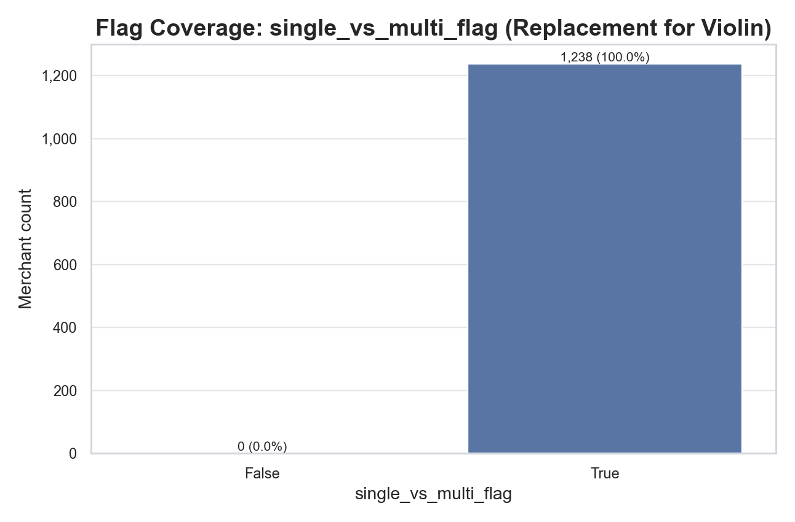
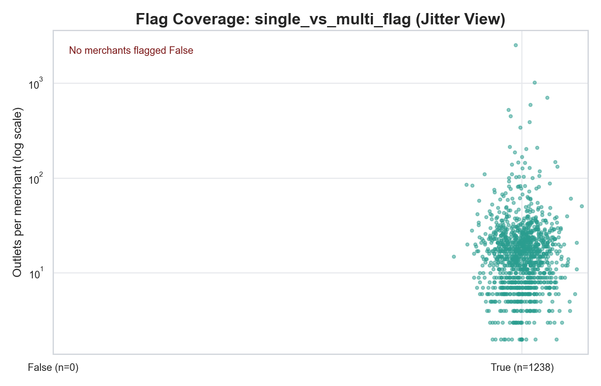

**6) Candidate breadth vs actual memberships**  
`11_candidate_vs_membership_hex.png` shows **foreign candidate counts are very high** (median **37**, total candidates median **38**) while actual memberships are sparse (median **0**, only **~46%** of merchants have any foreign membership). The correlation is weak (**~0.14**). `12_candidate_gap_ecdf.png` and the added `17_candidate_realization_ratio.png` make the under‑realization explicit: median realization ratio is **0.0**, so most merchants convert none of their foreign candidates into actual memberships.  

Interpretively, this is not just "conservative expansion." It creates a two‑stage realism tension:
1) Candidate generation behaves as if almost every merchant could expand globally.
2) Realization then collapses that breadth for most merchants.

That combination is valid for some scenarios, but for baseline realism it can look policy‑incoherent unless explicitly intended.

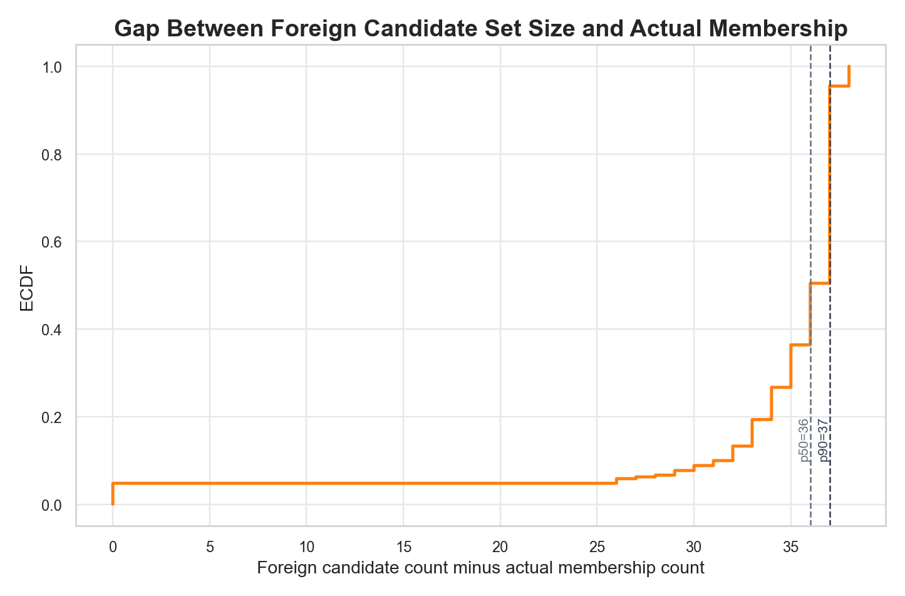

**7) Duplicate merchant‑site pairs**  
The updated `13_duplicate_site_heatmap.png` now shows duplicate anatomy by merchant and legal‑country multiplicity, and `18_duplicate_semantics_breakdown.png` quantifies mechanism:
- **37.4%** of merchants have duplicate merchant‑site pairs.
- Duplicate exposure is entirely **cross‑country reuse** in this run (same‑country duplicate‑only share **0.0%**).
- Pair‑level duplicate rate remains high (mean **~0.21**, p90 **~0.75**) via `14_dup_pair_rate_ecdf.png`.

This is strong evidence that duplication is not random duplication noise; it is a specific identity semantics choice (`site_id` reused across legal countries). That can be valid if declared as per‑merchant indexing, but it is a real downstream interpretation risk if treated as globally unique location identity.

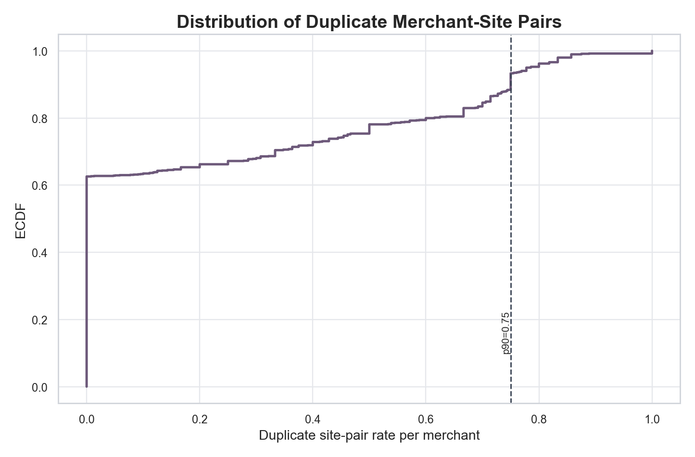
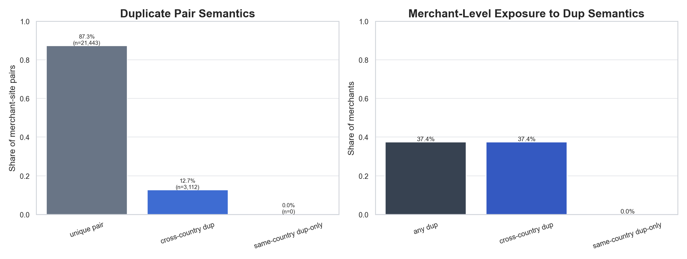

**8) Outlet pyramid sanity (new)**  
`19_outlet_pyramid.png` adds a direct merchant pyramid view using outlet-count buckets. The absence of a `1` bucket mass (single‑site merchants) is immediately visible, confirming that this realism issue is not a minor tail effect but a missing base tier in the generated merchant population.

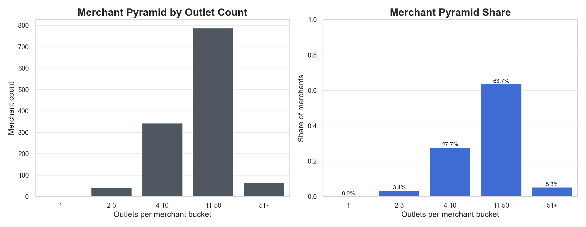

### 4.2 Candidate set breadth (how “globally open” merchants are)
- **Candidate countries per merchant:** min 1, median 38, max 39

**Interpretation:** Nearly every merchant has access to most countries. That feels **overly global**, and less realistic unless the simulated world is meant to be extremely international. This is a realism weakness because most merchants in real life are geographically constrained.

### 4.3 Cross‑border eligibility (policy gating realism)
- **Eligibility rate:** ~70.7%

**Interpretation:** Roughly 7 out of 10 merchants are eligible for cross‑border behavior. This is a plausible mix; it creates a meaningful distinction between eligible and ineligible populations.

### 4.4 Hurdle probabilities (likelihood of multi‑site behavior)
- **pi range:** ~0.00009 to 0.6797 (median ~0.142)

**Interpretation:** The model generates a spectrum of “propensity to be multi‑site.” The values are not extreme; most merchants are not forced into multi‑site behavior, which is realistic.

### 4.5 Cross‑border features (openness)
- **openness range:** ~0.02 to 0.53 (median ~0.19)

**Interpretation:** Openness scores sit in a plausible band, suggesting that merchants are not overwhelmingly global. However, because the candidate sets are huge, these openness scores are not constraining enough to counterbalance the global candidate universe.

### 4.6 Currency realism
- **Currencies:** 139 unique codes (from AED to ZWG)

**Interpretation:** Very strong signal of global coverage and variety. This is good realism for a global platform.

### 4.7 Foreign membership (actual assigned foreign countries)
- **Foreign countries per merchant:** min 1, median 2, max 12

**Interpretation:** This is believable: most cross‑border merchants expand to only a few countries. This partially offsets the “too global” candidate sets.

### 4.8 Coefficient bundle realism (hurdle + NB dispersion)
You flagged an important gap: checking only `hurdle_pi_probs` is not enough. We also need to test whether the authored model bundles themselves have realistic statistical shape, because those coefficients are the mechanism that generates `pi`, `mu`, and dispersion behavior.

Audited sealed inputs for this run:
- `config/layer1/1A/models/hurdle/exports/version=2026-01-03/20260103T184840Z/hurdle_coefficients.yaml`
- `config/layer1/1A/models/hurdle/exports/version=2026-01-03/20260103T184840Z/nb_dispersion_coefficients.yaml`
- `config/layer1/1A/models/hurdle/exports/version=2026-01-03/20260103T184840Z/bundle_selfcheck.json`

#### 4.8A Contract and integrity checks (pass)
- Dict alignment is exact across both bundles (`dict_mcc` length 290, identical ordering; `dict_ch=["CP","CNP"]`).
- Shape constraints pass:
  - `len(beta)=298` (expected `1 + |mcc| + 2 + 5`)
  - `len(beta_mu)=293` (expected `1 + |mcc| + 2`)
  - `len(beta_phi)=294` (expected `1 + |mcc| + 2 + 1`)
- `bundle_selfcheck.json` status is `PASS`.

**Interpretation:** The bundle is technically well-formed and reproducible. The question is not structural validity; it is behavioral realism.

#### 4.8B Hurdle and mean coefficients (statistically active)
- `beta` (hurdle logit) has broad spread: min `-6.865`, p50 `0.087`, p99 `1.621`, max `1.790`, std `0.881`.
- GDP-bucket hurdle terms are monotonic from lower to higher GDP bucket:
  - `[-0.784, -0.481, -0.256, -0.008, 0.390]`
- Channel effect in hurdle is non-trivial:
  - `CP=-0.288`, `CNP=-0.852` (CNP lowers multi-site propensity in this build).
- `beta_mu` (NB mean model) is also active:
  - min `-0.828`, p50 `0.006`, p99 `0.681`, max `1.781`, std `0.294`.

`pi` re-derivation from coefficient blocks and `hurdle_design_matrix` matches published values almost exactly (mean absolute error `~3.4e-09`, max absolute error `~2.8e-08`).

Observed implications in this run:
- `pi` distribution: min `0.000088`, p50 `0.142`, p99 `0.470`, max `0.680`, mean `0.161`.
- `pi` rises with GDP bucket mean (`0.104 -> 0.271` from bucket 1 to 5).

**Interpretation:** The hurdle and mean parts are not degenerate; they are carrying meaningful signal and are internally consistent with observed `pi`.

#### 4.8C NB dispersion coefficients (statistically weak realism signal)
The dispersion bundle (`beta_phi`) is where realism weakens:
- `beta_phi` is numerically very concentrated:
  - p25 `0.005756`, p50 `0.005758`, p75 `0.005761`.
- Channel terms are almost identical:
  - `0.8263497` vs `0.8263476`.
- GDP slope is near zero:
  - `beta_phi_ln_gdp = 9.27e-06`.

When we reconstruct implied merchant-level `phi` using the runtime coefficient contract (`intercept + mcc + channel + ln_gdp`):
- `phi` is almost constant across merchants:
  - min `11.931`, p50 `11.99997`, p99 `12.00022`, max `12.00041`
  - std `0.00636`, CV `0.00053`
- Contribution variability is tiny:
  - std(MCC contribution) `0.00053`
  - std(channel contribution) `8.96e-07`
  - std(ln_gdp contribution) `1.08e-05`

**Interpretation:** Dispersion is effectively fixed around `~12` for almost the entire population. That satisfies stability and rejection-control constraints, but it provides very little heterogeneity in count variance across merchant profiles.

#### 4.8D Why this matters for synthetic realism
For synthetic realism, we want both:
1) variation in expected count level (`mu`), and
2) variation in stochastic spread around that level (`phi`).

In this run, (1) is present but (2) is almost absent. This can make generated behavior look overly uniform in variance once you condition on mean intensity. It is a plausible root cause for downstream surfaces that feel "too regular" despite having heavy tails.

The current bundle is therefore:
- **Contract-valid and operationally stable**, but
- **Under-dispersed in dispersion structure** (realism weakness at the coefficient level).

#### 4.8E Coefficient realism plots (weak actual vs stronger expected shape)
The coefficient-focused plot bundle is in `docs/reports/reports/eda/segment_1A/plots`:
- `20_coeff_block_diagnostics.png`
- `21_eta_contribution_scale_compare.png`
- `22_phi_actual_vs_reference.png`
- `23_phi_by_channel_actual.png`
- `24_phi_strength_sensitivity.png`
- `25_prej_actual_vs_reference.png`

The comparison uses two profiles:
- **Actual profile**: the implied `phi` from the sealed coefficient bundle.
- **Illustrative strong reference**: a counterfactual `phi` profile (median-matched to actual) with realistic heterogeneity injected along standardized MCC/channel/ln(GDP) directions. This is not the current model output; it is a realism target shape used to show what stronger dispersion signal would look like.

**Plot-by-plot interpretation**

1) **Coefficient block diagnostics (`20_coeff_block_diagnostics.png`)**  
The hurdle (`beta`) and NB-mean (`beta_mu`) blocks show visible spread, while the NB-dispersion block (`beta_phi`) is tightly concentrated near a narrow value band except for intercept/channel constants. This visual directly supports the claim that dispersion is the weak block, not the entire bundle.

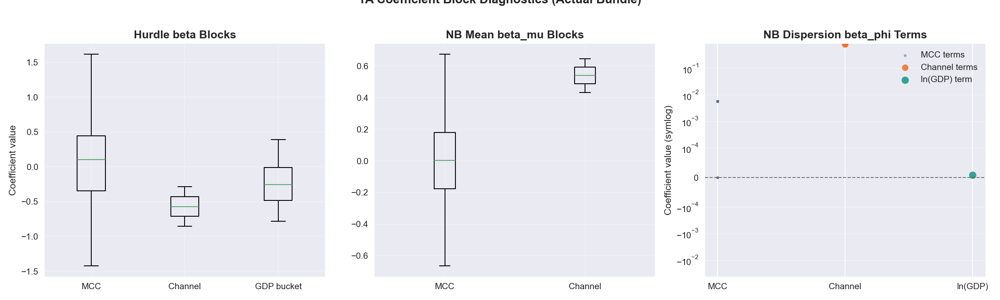

2) **Contribution-scale comparison (`21_eta_contribution_scale_compare.png`)**  
In eta space, dispersion contributions have very small variation relative to what would usually be expected for a heterogeneous synthetic world. The log-scale bars make this explicit: the channel and GDP terms in the dispersion predictor contribute almost no cross-merchant spread, while mean-model terms remain active.

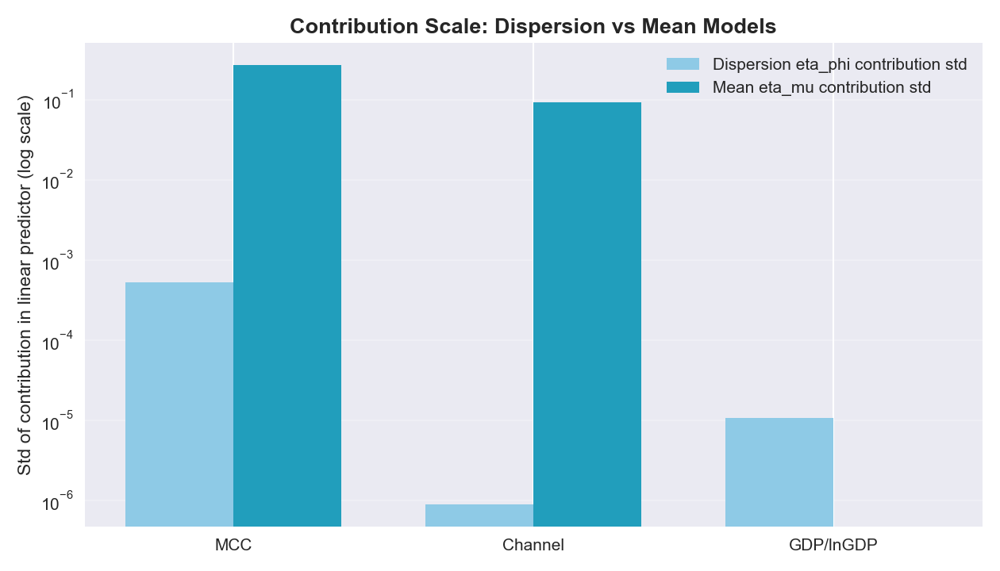

3) **Implied phi: actual vs reference (`22_phi_actual_vs_reference.png`)**  
Actual implied `phi` is nearly a vertical spike around ~12. The reference profile is visibly broader while anchored to the same median. Metrics from `coeff_bundle_metrics.json`:
- Actual: `CV(phi)=0.00053`, `P95/P05=1.00004`
- Reference: `CV(phi)=0.25249`, `P95/P05=2.25334`
This is the clearest visual/statistical evidence that the current bundle is under-dispersed.

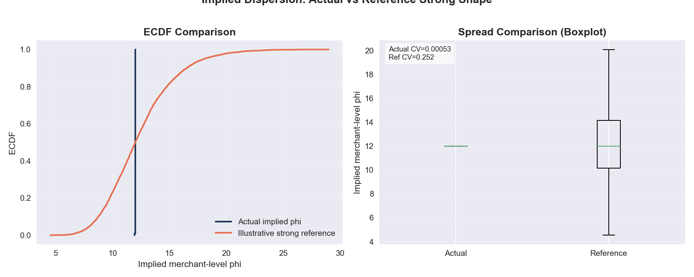

4) **Channel split in actual phi (`23_phi_by_channel_actual.png`)**  
`card_present` and `card_not_present` boxplots almost overlap completely. This confirms that channel is not creating meaningful variance heterogeneity through the dispersion path in this run.

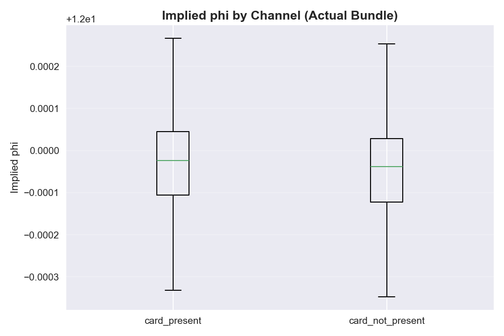

5) **Sensitivity curve (`24_phi_strength_sensitivity.png`)**  
This plot answers: "How much amplification would the current centered dispersion signal need before it looks materially heterogeneous?" The curve shows you need very large multipliers before `CV(phi)` and `P95/P05` approach plausible "strong" thresholds. That means this is not a small calibration miss; the learned dispersion signal is structurally weak.

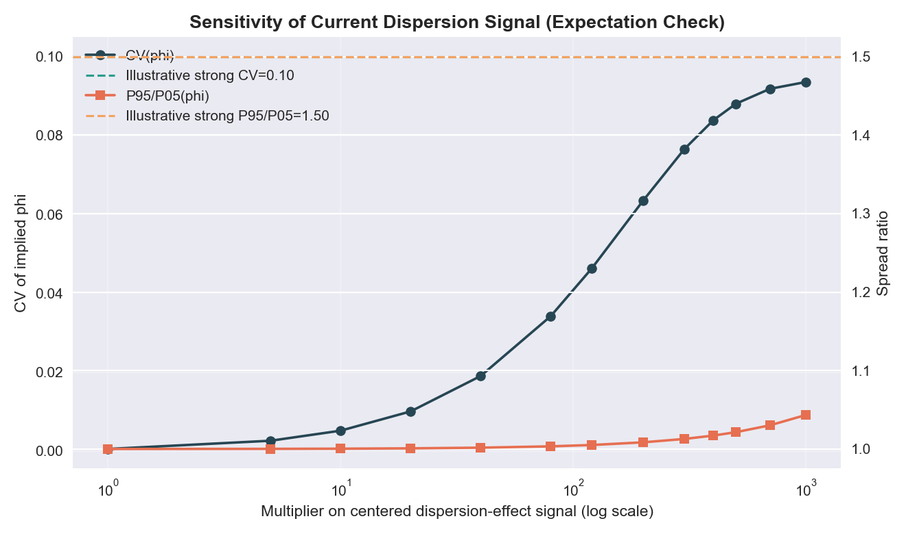

6) **Downstream rejection probability shape (`25_prej_actual_vs_reference.png`)**  
With actual `phi`, `P(N<=1)` is narrowly concentrated. Under the reference profile, the same mean surface produces a wider rejection-probability distribution (heavier upper tail), which is more consistent with profile-dependent variability. This shows the practical consequence: weak dispersion coefficients suppress stochastic diversity in generated counts.

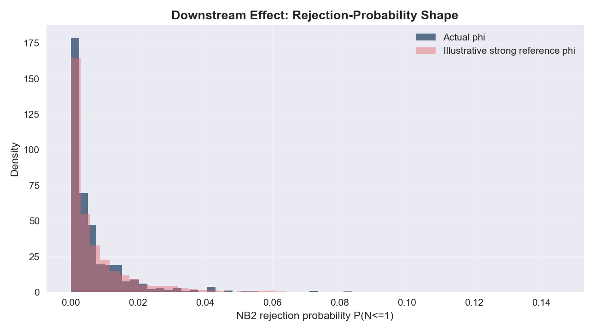

**What "strong" would have looked like in this section**
- Not a different median `phi` level only, but a meaningfully wider distribution across merchant profiles.
- Clearer separation of dispersion behavior by channel/MCC/GDP strata.
- A non-trivial spread ratio and coefficient of variation in implied `phi`, without breaking stability.

#### 4.8F Coefficient realism verdict (short)
**Verdict:** **Mixed realism** - hurdle/mean blocks are statistically active (**B**), but dispersion realism is weak (**C/C+**) because implied `phi` is nearly constant across merchants in the actual bundle.  
**Net coefficient realism verdict for 1A:** **B-** (operationally stable and coherent, but under-heterogeneous in variance structure).

## 5) Where realism is strong vs weak
### Strong realism signals
- **Heavy‑tailed outlet distribution** (few giants, many small merchants).
- **Moderate multi‑country merchant share** (not everyone is global).
- **Hurdle probabilities are not extreme** (most merchants lean toward single‑site).
- **Currency diversity is high**, supporting global realism.

### Weak realism signals
- **No single-site merchant base tier** (`single_vs_multi_flag=False` count is zero). This is a material population-shape distortion for baseline retail realism.
- **Home/legal mismatch is broadly elevated** across size buckets rather than concentrated in large/global merchants.
- **Duplicate identity semantics are cross-country by construction** (`site_id` reused across legal countries), which can create downstream interpretation risk if consumers assume globally unique sites.
- **Candidate sets are too broad** (median 38 out of 39 countries). This implies most merchants are “allowed” almost everywhere, which is uncommon in real economies.
- **NB dispersion coefficients are near-flat in effect**, implying almost constant merchant-level `phi` (~12) and weak variance heterogeneity.
- **Missing approved outputs** reduce traceability and make it harder to validate distributional assumptions (e.g., site sequencing and integerised counts).

## 6) Realism grade (1A only)
**Segment grade: B (Moderate realism)**  
**Core outlet_catalogue grade: B‑ (Moderate realism, skewed toward multi‑site/global behavior)**

**Why (segment‑level):** The outputs are internally coherent and strongly skewed in a way that matches real merchant ecosystems. However, the **global candidate universe** is too permissive, NB dispersion is effectively near-flat (weak variance heterogeneity), and several approved data artifacts are missing. This puts the segment in a “credible but improvable” state.

**Why (outlet_catalogue‑level):**
1) **Strong realism signals:** heavy‑tailed outlet distribution, realistic concentration (Gini ~0.53), and cross‑border spread increasing with merchant size.  
2) **Material realism gaps:** zero single‑site merchants, high home/legal mismatch (~39%) across sizes, and site_id reuse across legal countries (acceptable only if site_id is explicitly a per‑merchant index).  
3) **Net effect:** the world “feels” plausible in shape, but the population is too globally biased and under‑represents small, single‑site merchants.

## 7) What I would fix first (if realism is the priority)
1) **Introduce single‑site merchants** (ensure `single_vs_multi_flag=False` exists and outlet_count=1 is common). This is the biggest realism gap in outlet_catalogue.
2) **Reduce home/legal mismatch for small merchants** (keep high mismatch mostly for large, multi‑country firms). This will make the domicile pattern more believable.
3) **Clarify site_id semantics** (document it as per‑merchant index or make it globally unique). Downstream assumptions depend on this.
4) **Constrain candidate sets** so most merchants only see regional or realistically reachable country targets.
5) **Re-fit `nb_dispersion_coefficients.yaml` for heterogeneity** so `phi` varies meaningfully by merchant profile (MCC/channel/GDP), instead of collapsing to an almost constant value.
6) **Emit s3_site_sequence and s3_integerised_counts** to make site‑level realism auditable.
7) **Ensure sparse_flag and hurdle_stationarity_tests** exist so distributional shape is validated and reproducible.

## 8) Realism improvement roadmap (synthetic realism)
This roadmap assumes **no real‑world policy data**. The goal is not “true reality,” but a **credible synthetic ecosystem** that feels realistic to reviewers and can support fraud modeling.

1) **Re‑shape outlet counts into a realistic merchant pyramid.**  
   Make single‑site and small multi‑site merchants **dominant by count**, with a long tail of large chains. Use a mixture distribution (e.g., log‑normal + Pareto tail) and enforce **size‑tier rules** (small merchants rarely exceed 3–5 outlets; large merchants can exceed 50+).

2) **Constrain candidate country sets by geography and size.**  
   Replace “almost global” candidate sets with **region‑bounded sets** for small and mid‑tier merchants (e.g., home country + neighbors + trade hubs). Only large/global merchants should have broad candidate sets. This immediately raises realism because most real businesses are region‑limited.

3) **Re‑align home vs legal country for small merchants.**  
   Small merchants should almost always have **home==legal**. Allow higher mismatch only for large, multi‑country merchants to represent holding‑company or tax structures. This restores plausible domicile patterns.

4) **Clarify and stabilize `site_id` semantics.**  
   If `site_id` is a per‑merchant index, state it clearly and prevent cross‑merchant collisions. If you want globally unique site IDs, enforce uniqueness. Ambiguity here breaks downstream assumptions about “shared” physical sites.

5) **Introduce policy‑driven diversity.**  
Use MCC/channel to **shape outlet counts and expansion likelihood** (e.g., digital services more global; physical retail more local). This creates explainable heterogeneity without requiring real policy data.

6) **Increase dispersion-model heterogeneity (NB phi).**  
Re-train dispersion coefficients so `phi` is not effectively constant across merchants. Keep rejection controls and corridor checks, but widen realistic variance differences by MCC/channel/GDP tier. This preserves stability while restoring stochastic realism.

7) **Emit missing audit artefacts.**  
Output `s3_site_sequence` and `s3_integerised_counts` so the outlet distribution can be re‑verified and explained. This helps defend realism during review.

**Expected impact:**  
Implementing steps 1–3 addresses the most visible realism gaps (over‑globalization and missing single‑site merchants). Implementing step 6 is the key stochastic-realism lever. Together, these changes should move 1A toward **B+ or A‑** synthetic realism.

## 9) Bottom line for platform readiness
You can build v0 on this data, but the outlet universe currently **over‑represents multi‑site and globally legalized merchants**. If you want a platform demo that “feels real,” the first three levers are: (1) add single‑site merchants, (2) lower home/legal mismatch for small merchants, and (3) clarify or de‑duplicate site_ids. Tightening candidate sets is still important, but these outlet_catalogue gaps will be the most visible realism issues to reviewers.
