# Segment 3A - Design vs Implementation Observations (Cross-Zone Allocation)
Date: 2026-01-31
Scope: Design intent vs implementation notes for Segment 3A (S0-S7), plus what to look for in 3A datasets before assessment.

---

## 0) Why this report exists
Segment 3A is the **cross-zone allocation layer** for merchant location realism. It decides **which merchantxcountry pairs should be split across multiple time-zones**, builds the **countryxzone priors** that shape those splits, samples **zone shares**, integerises them into **zone counts**, and finally emits the **zone_alloc** egress consumed downstream. This report captures **what the design specifies**, **what the implementation actually does**, and **what signals we should look for** in 3A datasets when assessing realism and correctness.

---

## 1) Design intent (what 3A should do)
High-level intent across states:

1) **S0 - Gate + sealed inputs**
   - Re-verify upstream PASS bundles for 1A/1B/2A (No PASS -> No read).
   - Seal policy inputs: `zone_mixture_policy`, `country_zone_alphas`, `zone_floor_policy`, and `day_effect_policy_v1`.
   - Seal required references: `iso3166_canonical_2024`, `world_countries`, `tz_world_2025a`, plus optional 2A surfaces (`site_timezones`, `tz_timetable_cache`, `s4_legality_report`).
   - Emit `s0_gate_receipt_3A` and `sealed_inputs_3A` only.

2) **S1 - Mixture policy & escalation queue**
   - Decide per **merchantxcountry** whether the pair remains monolithic or escalates into zone allocation.
   - Publish `s1_escalation_queue` as the **sole authority** on escalation decisions for later 3A states.
   - Deterministic and policy-bound: no RNG, no ad-hoc inputs.

3) **S2 - Countryxzone priors**
   - Build parameter-scoped `s2_country_zone_priors` as the **single source of truth** for Dirichlet alpha priors per countryxtzid.
   - Priors are derived from **country_zone_alphas** with **zone_floor_policy** applied; must align to the zone universe Z(c) derived from world polygons.
   - RNG-free, independent of merchant data.

4) **S3 - Zone share sampling**
   - For escalated merchantxcountry pairs, draw **Dirichlet shares** over tzids using the S2 priors.
   - Emit `s3_zone_shares` and RNG evidence logs to make sampling auditable.

5) **S4 - Integerisation to zone counts**
   - Convert continuous zone shares into **integer outlet counts** per tzid using floor/bump rules.
   - Emit `s4_zone_counts` with strict conservation of total outlets per merchantxcountry.

6) **S5 - Zone allocation egress + universe hash**
   - Publish the canonical `zone_alloc` egress for routing.
   - Emit `zone_alloc_universe_hash` to tie the output to its policy + prior inputs.

7) **S6 - Structural validation**
   - Validate S1-S5 outputs (schema, invariants, conservation, joins).
   - Emit `s6_validation_report_3A`, `s6_issue_table_3A`, and `s6_receipt_3A`.

8) **S7 - Validation bundle + _passed.flag**
   - Build a manifest-scoped validation bundle with digest index + `_passed.flag`.
   - Bundle acts as a gate for downstream readers and cross-segment validation.

---

## 2) Expected datasets & evidence surfaces (contract view)
Core datasets to assess later:

**Gate + sealing**
- `s0_gate_receipt_3A`, `sealed_inputs_3A`

**Escalation and priors**
- `s1_escalation_queue`
- `s2_country_zone_priors`

**Zone allocation pipeline**
- `s3_zone_shares`
- `s4_zone_counts`
- `zone_alloc`
- `zone_alloc_universe_hash`

**Validation + evidence**
- `s6_validation_report_3A`, `s6_issue_table_3A`, `s6_receipt_3A`
- `validation_bundle_3A` + `index.json` + `_passed.flag`

**RNG audit evidence (S3)**
- `rng_audit_log`, `rng_trace_log`, `rng_event_zone_dirichlet`

These are the surfaces we will use to evaluate realism and correctness.

---

## 2.1) Priority ranking (by purpose)
If we rank by the actual mission of 3A (realistic cross-zone allocation), the importance order is:
1) `zone_alloc` - final egress consumed by routing; if this is unrealistic, 3A has failed its purpose.
2) `s4_zone_counts` - integerised reality that directly determines `zone_alloc`.
3) `s3_zone_shares` - probabilistic source of counts; reveals whether allocations are skewed or flat.
4) `s2_country_zone_priors` - structural bias that shapes all downstream realism.
5) `s1_escalation_queue` - the gate deciding which merchantxcountry pairs even participate.

Note: the detailed checks below remain in pipeline order for traceability.

---

## 3) Implementation observations (what is actually done)

### 3.1 S0 - Gate + sealed inputs
**Observed posture:** Strict, deterministic, and consistent with Layer-1 gate semantics.

Key implementation traits:
- **HashGate verification is enforced** for 1A/1B/2A validation bundles and `_passed.flag` before any read of their outputs.
- **Sealed inputs are emitted as a JSON list of rows** (array of objects). Each row is validated against the row schema; missing required artefacts fail closed.
- **Policy versioning is strict**: policy file `version` is authoritative and must be non-placeholder; if registry semver is concrete it must match.
- **Catalogue consistency checks are enforced** (3A dictionary vs upstream dictionaries) to prevent path/schema drift.
- **Optional 2A inputs** (`site_timezones`, `tz_timetable_cache`, `s4_legality_report`) are included only if present; missing optional inputs are logged but do not fail the run.
- **No ad-hoc S0 report file** is produced (only `segment_state_runs`), aligning with the contracts.

Net: S0 is strict, policy-sealed, and deterministic, which is essential because all downstream realism depends on the correctness of the sealed input set.

---

### 3.2 S1 - Mixture policy & escalation queue
**Observed posture:** Implemented and green; escalation queue published.

Implementation highlights:
- **Z(c) universe is derived from `world_countries` + `tz_world_2025a`** via polygon intersection, not from site-level geometry. This matches the design boundary (S1 MUST NOT read 1B `site_locations`).
- **Escalation decisions are deterministic** and follow the mixture policy thresholds, with `decision_reason` attached per row.
- **Fail-closed posture**: if the policy requests escalation but Z(c) is empty, the state raises an error rather than manufacturing data.
- Output `s1_escalation_queue` is emitted with stable ordering and is treated as immutable.

Net: S1 behaves as the **sole authority** on escalation decisions, which is exactly what later states require for deterministic routing realism.

---

### 3.3 S2 - Countryxzone priors
**Observed posture:** Full plan locked; strictness decisions approved before coding.

Key choices locked in the implementation plan:
- **Z(c) recomputed from world polygons each run** (keeps S2 parameter-scoped and independent of S1).
- **Strict coverage rules**: any missing or extra tzids in the prior pack cause a hard fail (no silent fill-ins).
- **Optional tz_timetable_cache release check** enforced if sealed.
- **Run report kept minimal** (aggregates only).

Net: The planned S2 implementation is conservative and audit-grade: priors are only accepted if they precisely match the zone universe and policy.

---

### 3.4 S3 - Zone share sampling
**Observed posture:** Implemented with RNG evidence logging and strict bundle inclusion.

Highlights from implementation:
- **RNG evidence logs are produced** (audit, trace, event logs) and are included as bundle members for S7.
- Sampling is deterministic given `seed`, `parameter_hash`, and inputs; RNG evidence is the audit trail.

Net: S3 aligns with design by making Dirichlet sampling auditable and reproducible.

---

### 3.5 S4 - Integerisation to zone counts
**Observed posture:** Implemented with standard floor/bump logic and strict invariants.

Expected behavior enforced in validation:
- **Counts are integers** and must conserve the total outlet count per merchantxcountry.
- **Zone floor policy** is applied deterministically.

Net: S4 is the transition from probabilistic shares to concrete counts; correctness here is critical because errors will surface as unrealistic allocations downstream.

---

### 3.6 S5 - Zone allocation egress + universe hash
**Observed posture:** Implemented; produces `zone_alloc` and `zone_alloc_universe_hash`.

Key expectations enforced:
- `zone_alloc` is the canonical cross-segment egress and must be consistent with S4 counts.
- `zone_alloc_universe_hash` ties the output back to policy + prior inputs (auditability).

---

### 3.7 S6 - Structural validation
**Observed posture:** Implemented with schema-level validation and issue capture.

Key traits:
- Produces a **report + issue table + receipt**, which are later gated in S7.
- Validation is strict enough to block bundle publication if structural invariants break.

---

### 3.8 S7 - Validation bundle
**Observed posture:** Implemented with two deliberate deviations.

1) **Index-only bundle**
   - The bundle root contains only `index.json` + `_passed.flag`.
   - Member paths are **run-root-relative**, not bundle-relative.

2) **RNG logs included as members**
   - RNG evidence logs are included in the bundle membership even though they are not listed in `validation_bundle_3A` dependencies in the registry.

Net: These are documented deviations that affect how downstream gate verification must interpret the bundle index and digest law.

---

## 4) Design vs implementation deltas (summary)
1) **S7 index-only bundle**: Design allows bundles "by reference," but registry dependency lists are not updated. Implementation uses run-root-relative paths; gate verification must use run-root base.
2) **RNG evidence in bundle**: Included as members even though not declared in the registry dependency list. This is a deliberate deviation for audit completeness.
3) **Sealed inputs format**: `sealed_inputs_3A` is emitted as a JSON list, while the schema defines a row object. Implementation validates per row and treats the list as the envelope (consistent with other segments).

These deltas must be remembered when validating bundles or reading `sealed_inputs_3A` in downstream tooling.

---

## 5) What to look for in 3A datasets (realism + correctness)
This is the **forward-looking checklist** for the 3A outputs. It is focused on realism, not just schema validity.

**Realism focus priority (where analytical energy goes):**
1) **`zone_alloc`** - the final egress (realism outcome).
2) **`s4_zone_counts`** - integerised allocations that directly drive `zone_alloc`.
3) **`s3_zone_shares`** - sampled distributions that feed integerisation.
4) **`s2_country_zone_priors`** - structural bias that shapes shares.
5) **`s1_escalation_queue`** - eligibility gate for multi-zone behavior.

### 5.1 `s1_escalation_queue` (realism gate)
**What to inspect:**
- **Escalation rate** overall and by country: realistic data should not be all-escalated or all-monolithic.
- **Decision reasons**: distribution of `decision_reason` should line up with policy thresholds (e.g., below-min-sites vs dominant-zone).
- **Zone-count alignment**: escalation should correlate with higher `zone_count_country` (more tzids in Z(c)).
- **Domain parity**: rows should match 1A `outlet_catalogue` by `(merchant_id, legal_country_iso)` with no missing or extra pairs.

**Realism risks:**
- If escalation is near 0% or near 100%, the system is not expressing a meaningful mix of monolithic vs multi-zone merchants.
- If escalation is concentrated in tiny countries with few zones, the policy thresholds may be mis-tuned.

---

### 5.2 `s2_country_zone_priors` (structural realism bias)
**What to inspect:**
- **Coverage**: each `(country_iso, tzid)` in Z(c) should appear exactly once.
- **Alpha magnitude + dispersion**: do priors meaningfully differentiate zones, or are they uniform?
- **Floor/bump impact**: check how often floors are applied and whether they distort priors into uniformity.
- **Share normalization**: `share_effective` must sum to 1 per country and be in [0,1].

**Realism risks:**
- Uniform priors across tzids will produce unrealistic zone allocation (every zone equally likely regardless of population/urban density).
- Excessive floor application can flatten natural variation and remove dominant-zone patterns.

---

### 5.3 `s3_zone_shares` (sampled realism)
**What to inspect:**
- **Sum-to-1 per merchantxcountry** for escalated pairs.
- **Share concentration**: distributions should show a mix of dominant zones and long tails, not perfect uniformity.
- **RNG audit**: ensure `rng_audit_log`, `rng_trace_log`, and `rng_event_zone_dirichlet` are present and consistent with share counts.

**Realism risks:**
- If all zone shares are near-uniform, S2 priors are not injecting meaningful realism.
- If share distributions are identical across all merchants, there is no merchant-level heterogeneity.

---

### 5.4 `s4_zone_counts` (integerised realism)
**What to inspect:**
- **Conservation**: zone counts sum to the merchantxcountry outlet count.
- **Floor/bump effect**: verify small zones are not always floored to 1 (would make every zone artificially represented).
- **Rounding artifacts**: check if the integerisation systematically favors or punishes specific zones.

**Realism risks:**
- If a large fraction of merchantxcountry pairs become "one per zone," the allocations will look evenly spread and unrealistic.
- Large rounding drift indicates the integerisation is not preserving probabilistic intent.

---

### 5.5 `zone_alloc` (final realism signal)
**What to inspect:**
- **Country-level distribution of zones**: does zone allocation resemble plausible geographic footprints (few dominant tzids, long tail)?
- **Merchant heterogeneity**: do merchants with similar footprints have different zone allocations, or are they identical?
- **Consistency with `zone_alloc_universe_hash`**: the hash should change when policies/priors change; if not, the output is not tied to its inputs.

**Realism risks:**
- If zone allocation is identical across merchants (same tzid shares), the system lacks behavioral variation.
- If allocations ignore country boundaries (tzids outside Z(c)), the spatial realism is broken.

---

### 5.6 Validation and bundle surfaces
**What to inspect:**
- **S6 report and issues**: any FAIL or WARN codes should be explained and traced back to upstream decisions.
- **Validation bundle**: recompute digest using the index-only rule (run-root-relative paths).
- **RNG logs**: ensure presence and correct partitioning (seed, parameter_hash, run_id).

**Realism risks:**
- If validation passes but key realism metrics are flat (uniform priors, uniform shares), the system is structurally correct but behaviorally weak.

---

## 6) Interpretation guide (when we assess realism)
If 3A outputs look unrealistic, the most likely causes are:
1) **Over-uniform priors** (S2) -> zone allocations become flat and uninformative.
2) **Over-strict escalation thresholds** (S1) -> too few escalated pairs, which collapses the multi-zone realism layer.
3) **Aggressive floors** (S2/S4) -> every zone gets forced mass/counts, which removes dominant-zone realism.

So in assessment, we will separate:
- **Structural correctness** (schemas, gates, sum-to-1, conservation).
- **Realism quality** (heterogeneity, dominance patterns, sensible geographic variation).

---

(Next: detailed assessment of the actual 3A outputs under your run folder.)

---

# Segment 3A - Output Assessment (Run: local_full_run-5)
Run: `runs\local_full_run-5\c25a2675fbfbacd952b13bb594880e92`  
Partition: `seed=42`, `manifest_fingerprint=c8fd43cd60ce0ede0c63d2ceb4610f167c9b107e1d59b9b8c7d7b8d0028b05c8`  
Parameter hash: `56d45126eaabedd083a1d8428a763e0278c89efec5023cfd6cf3cab7fc8dd2d7`

This section captures what the data actually shows. The analysis is exploratory and realism-focused, not just structural validation.

---

## 7) Output inventory and coverage (context only)
Files present under `data/layer1/3A`:
- `s1_escalation_queue` (2,597 rows)
- `s2_country_zone_priors` (1,158 rows)
- `s3_zone_shares` (16,528 rows)
- `s4_zone_counts` (16,528 rows)
- `zone_alloc` (16,528 rows)
- `s0_gate_receipt`, `sealed_inputs`, `s6_*`, `validation`, `zone_alloc_universe_hash`

Coverage alignment checks:
- All escalated pairs from S1 appear in S3 (1,621/1,621).
- No extra pairs appear in S3 beyond S1 escalations.
- `zone_alloc` matches `s4_zone_counts` exactly (no missing keys, no count deltas).

Structural integrity is strong; realism differences are distributional.

---

## 8) S1 - Escalation queue (realism gate behavior)
**Escalation rate**
- Escalated: 1,621 / 2,597 = **62.4%**.

This is a high escalation rate: most merchant x country pairs are being pushed into the multi-zone pipeline.

**Decision reasons (dominant signals)**
- forced_escalation: **1,530**
- below_min_sites: **635**
- legacy_default: **179**
- forced_monolithic: **162**
- default_escalation: **91**

The dominance of `forced_escalation` indicates the escalation outcome is heavily policy-driven rather than emerging naturally from site_count and zone_count. This matters because it inflates escalation volume, but downstream allocations do not actually materialize as multi-zone in most cases.

**Site_count distribution**
- All pairs: median **6** (p90 **22**, p99 **83**, max **2546**).
- Escalated pairs: min **3**, median **7**, p90 **24**, p99 **103.6**.
- Non-escalated: min **1**, median **2**, p90 **19**, max **129**.

Escalation is clearly gated by site_count, but still aggressive: even moderate site counts are escalated.

**Escalation rate by zone_count_country**
- zone_count_country=1: escalation **0%** (expected).
- 2: **26%**
- 3: **39%**
- 4: **46%**
- 6: **96%**
- 7: **88%**
- 8: **76%**
- 9: **26%** (unexpected dip)
- 11: **97%**
- 12+: **~100%**

The escalation curve is not monotonic. Some zone counts (6, 11+) are effectively forced, while others (9) dip unexpectedly. This suggests policy rules interact with thresholds in a way that may not reflect intuitive geographic realism.

**Interpretation (realism impact)**
- S1 is escalating a large share of pairs and heavily relies on forced rules.
- Escalation is not cleanly increasing with zone count, which introduces non-intuitive behavior that can look synthetic when audited.
- The escalation gate is not the realism bottleneck by itself, but it sets expectations that downstream outputs fail to meet.

---

## 9) S2 - Country x zone priors (structural realism bias)
**Coverage**
- Rows: **1,158**, Countries: **248**, TZIDs: **435**.
- TZIDs per country: median **3**, p90 **8**, max **47**.

**Floor / bump usage**
- floor_applied_rate: **22.97%**
- bump_applied_rate: **22.97%**

Floors are used but are not the dominant driver of concentration by themselves.

**Share concentration**
- share_effective quantiles (all rows):  
  min **9.9e-05**, p50 **0.00195**, p75 **0.1138**, p90 **0.9957**, p99 **1.0**.
- Countries with top1_share >= 0.95: **82.3%**  
- Countries with top1_share >= 0.99: **66.1%**  
- Countries with top1_share == 1.0: **28.6%**
- Among multi-tz countries (tz_count > 1): **93 / 177** still have top1_share >= 0.99.

**HHI per country**
- Median HHI **0.990** (very high concentration).
- p25 **0.960**, p75 **1.0**.

**Interpretation (realism impact)**
- The priors are extremely dominated by a single tzid in most countries.
- Even multi-zone countries are effectively treated as single-zone because the dominant tzid absorbs almost all mass.
- This creates a strong structural collapse before any merchant-specific sampling occurs.

---

## 10) S3 - Zone shares (sampled realism)
**Coverage**
- Rows: **16,528**, merchant x country pairs: **1,621** (exactly the escalated set).
- TZIDs per pair: median **8**, p90 **16**, max **42**.

**Share concentration**
- Top-1 share quantiles:  
  p50 **0.991**, p90 **0.99999**, p99 **1.0**.
- HHI median **0.983**, p75 **0.9985**.

**Effective multi-zone strength**
- Zones with share > 10%: p50 **1**, p90 **1**.
- Zones with share > 5%: p50 **1**, p90 **2**.
- Zones with share > 1%: p50 **1**, p90 **3**.

This means most escalated pairs are multi-zone only on paper; in practice one zone dominates and the others are tiny.

**Priors vs shares**
- Mean share vs S2 share_effective correlation: **0.998**.
- Mean absolute difference: **0.0052**.

S3 is essentially reproducing S2 priors with very little merchant-specific variation.

**Variability across merchants within a country/tzid**
- Std of share_drawn across merchants (n > 1 groups):  
  p50 **0.003**, p90 **0.023**, p99 **0.099**.

This is very low dispersion: merchants inside the same country see almost identical share patterns.

**Interpretation (realism impact)**
- S3 does not introduce meaningful heterogeneity; it inherits the concentration of S2.
- The result is multi-zone in schema but effectively monolithic in behavior.

---

## 11) S4 - Zone counts (integerised reality)
**Conservation**
- Perfect: sum of zone_site_count equals reported sum for all pairs (max diff 0).

**Zero inflation**
- 87% of S4 rows have zone_site_count = **0**.

**Nonzero zones per pair**
- Median **1**.
- 86.7% of escalated pairs have exactly **1** nonzero zone.
- Only **13.3%** of escalated pairs (8.3% of all pairs) end up truly multi-zone.

**Top-1 count share**
- Median **1.0**, p10 **0.94**, p25 **1.0**.

**Interpretation (realism impact)**
- Integerisation collapses the already-concentrated shares into single-zone outcomes for most pairs.
- The end result is that escalation does not translate into real multi-zone behavior for the majority of pairs.

---

## 12) zone_alloc - Final realism outcome
`zone_alloc` matches S4 exactly (no missing keys or count mismatches), so the final egress reflects the same concentration:
- Top-1 share median **1.0**.
- p10 **0.94**, p25 **1.0**.

**Interpretation (realism impact)**
- The final allocation is almost always single-zone, even though S1 escalates 62% of pairs.
- This is the key realism failure: the pipeline escalates, but the outputs remain monolithic.

---

## 13) Cross-cutting realism conclusions
1) **Escalation is high, but effective multi-zone allocation is rare.**  
   Escalated pairs: 1,621. Multi-zone outcomes: 216 (13.3% of escalated).

2) **The priors are the core bottleneck.**  
   S2 priors are heavily dominated by a single tzid in most countries, so S3 shares and S4 counts collapse to one zone.

3) **Merchant heterogeneity is weak.**  
   Shares across merchants within the same country/tzid have very low dispersion (median std 0.003).

4) **Integerisation finishes the collapse.**  
   Even when multiple tzids exist, rounding pushes most zones to zero counts.

Overall: **3A is structurally correct but behaviorally flat**. The system is consistent and auditable, but the outputs do not express realistic multi-zone allocation at scale.

---

### 13.1 Plot action matrix (keep / fix / replace)
This pass aligns each visual to a concrete statistical claim, removes ambiguous chart mechanics, and standardizes style across `plots` and `plots_diag`.

| Plot | Action | Why |
|---|---|---|
| `plots/s1_escalation_rate_by_zone_count.png` | `fix` | Keep same evidence, but separate rate vs sample-size scales clearly. |
| `plots/s1_escalation_rate_by_site_bucket.png` | `fix` | Keep same lens with explicit bucket sample-size labels. |
| `plots/s2_top1_share_hist.png` | `keep` | Directly supports prior-concentration claim. |
| `plots/s2_hhi_ecdf.png` | `keep` | Strong concentration summary at country level. |
| `plots/s2_tzcount_vs_top1.png` | `fix` | Keep relation view with cleaner point readability. |
| `plots/s3_top1_share_hist.png` | `keep` | Core sampled-concentration evidence. |
| `plots/s3_effective_zone_count_thresholds.png` | `replace` | Replaced multi-panel style with threshold boxplot to compare effective breadth consistently. |
| `plots/s3_mean_vs_prior_share_hexbin.png` | `keep` | Best single visual for prior-vs-sample coupling. |
| `plots/s4_nonzero_zones_hist.png` | `keep` | Direct integerisation collapse evidence. |
| `plots/s4_top1_share_hist.png` | `keep` | Direct top-1 dominance after counts. |
| `plots/zone_alloc_top1_share_hist.png` | `keep` | Final-output dominance evidence. |
| `plots_diag/d1_s2_top1_share_bottom30.png` | `keep` | Shows best-case countries are still dominated. |
| `plots_diag/d2_s2_tzcount_vs_top1_labeled.png` | `keep` | Country-labeled exception check. |
| `plots_diag/d3_alpha_ratio_hist_logx.png` | `keep` | Floor/bump impact lens. |
| `plots_diag/d4_share_raw_vs_effective.png` | `replace` | Rebased to explicit normalized `share_raw` vs `share_effective` comparison. |
| `plots_diag/d5_s3_entropy_hist.png` | `keep` | Merchant-country dispersion realism check. |
| `plots_diag/d6_s3_std_share_log10_hist.png` | `keep` | Within-country merchant heterogeneity lens. |
| `plots_diag/d7_s3_vs_s4_top1_hexbin.png` | `keep` | Rounding amplification check. |
| `plots_diag/d8_multi_zone_rate_by_escalated_zoom.png` | `fix` | Keep contrast but improve zoom and readability. |

---

## 14) Visual diagnostics (plots + narrative interpretation)
All plots are saved under `docs/reports/eda/segment_3A/plots/` and embedded below. Each interpretation is based on the actual image, not an assumption.

### 14.1 S1 escalation rate by zone_count_country
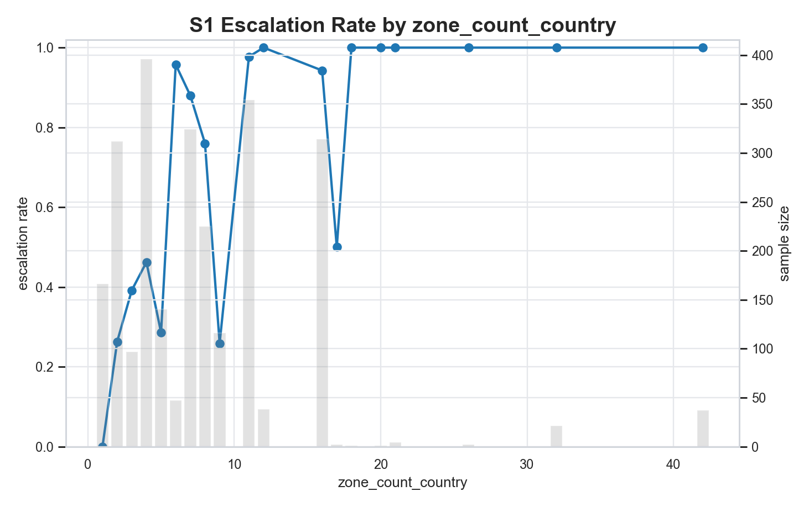

This plot overlays escalation rate (line) with sample size (secondary-axis bars). The escalation rate does not rise smoothly with `zone_count_country`: some zone counts trend near forced escalation while nearby counts dip despite non-trivial support. The count bars show where low-support points exist, so the non-monotonic behavior in the mid-range is not just a tiny-sample artifact. This reinforces a rule-threshold feel rather than a smooth geographic response.

### 14.2 S1 escalation rate by site_count bucket

Escalation rises sharply from the smallest site-count bucket, stays high through mid buckets, and is visibly non-smooth rather than gradually monotonic. Because each bar is annotated with `n`, the reader can separate true structure from sparse-tail noise. The overall pattern still reads as threshold-driven gating, not a continuous size-response curve.

### 14.3 S2 top-1 share per country
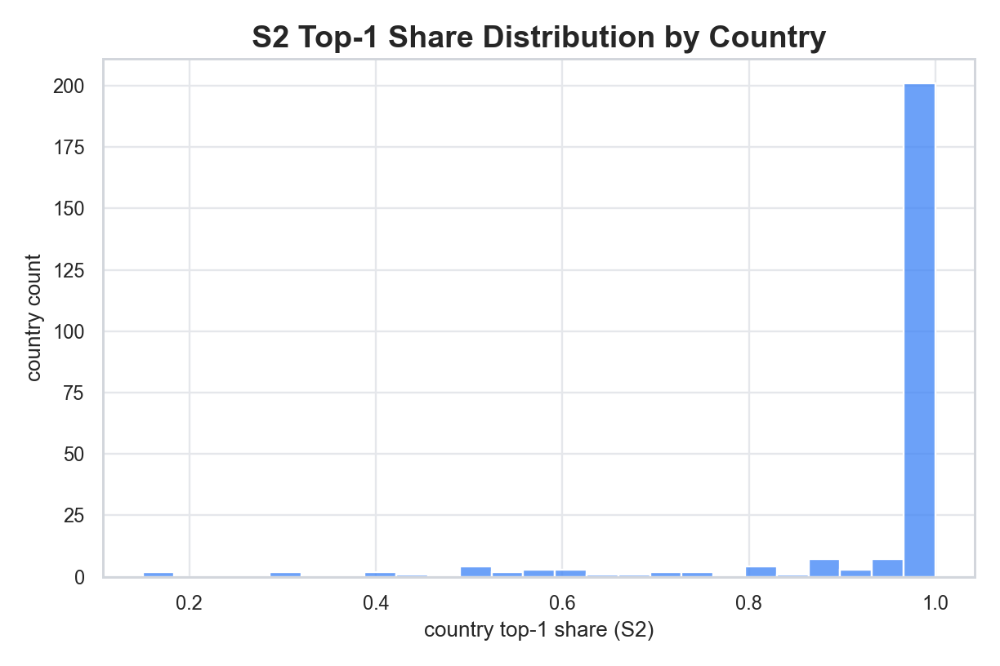

The histogram is heavily concentrated near 1.0. This means most countries allocate nearly all prior mass to a single tzid. The small lower-share tail confirms that balanced priors are rare. This is the first strong visual signal that S2 is structurally collapsing the zone universe.

### 14.4 S2 HHI per country (ECDF)
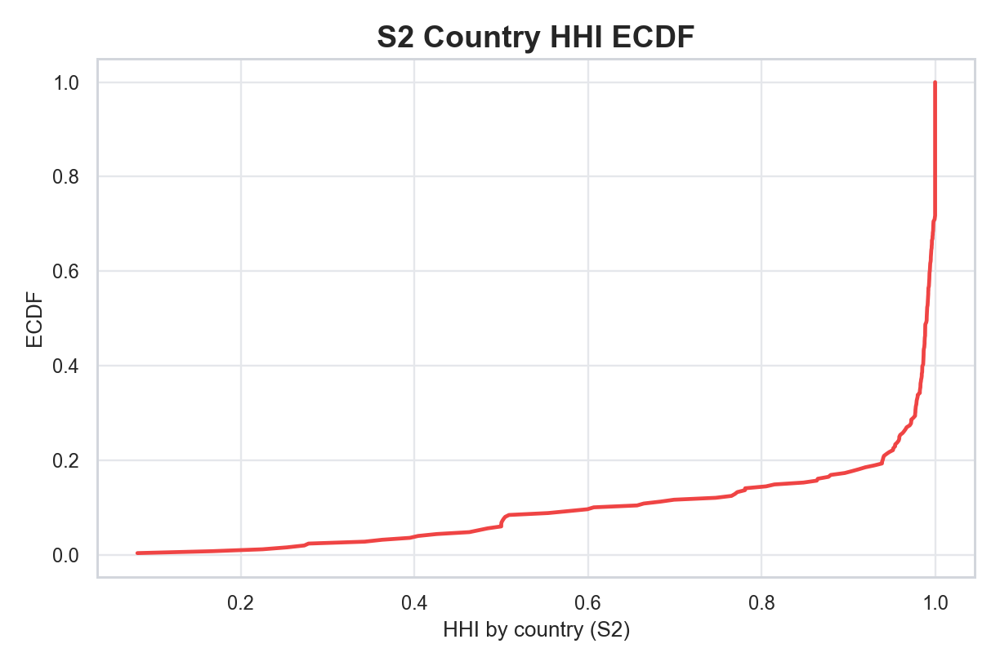

The ECDF stays low until very high HHI values and then rises steeply near 1.0. That means most countries have extremely high concentration. The curve shape implies this is systemic, not driven by a handful of outliers. This supports the conclusion that the priors are heavily concentrated across the board.

### 14.5 S2 tz_count vs top-1 share
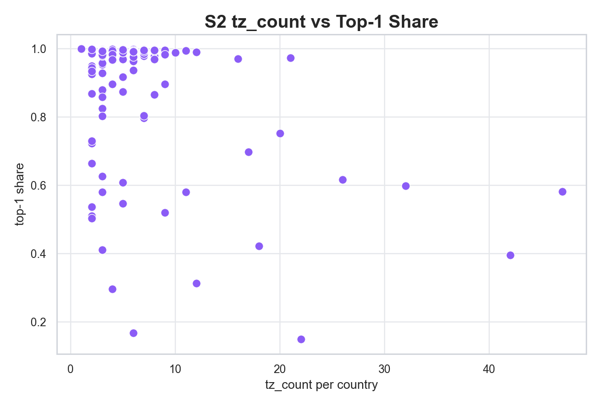

Even countries with high `tz_count` still sit near top-1 share of 1.0. The densest cloud remains in the high-dominance band, showing that most multi-tz countries are still effectively single-zone at the prior level. Only a small number of points fall into moderate top-1 ranges, and they are exceptions.

### 14.6 S3 top-1 share per merchant-country
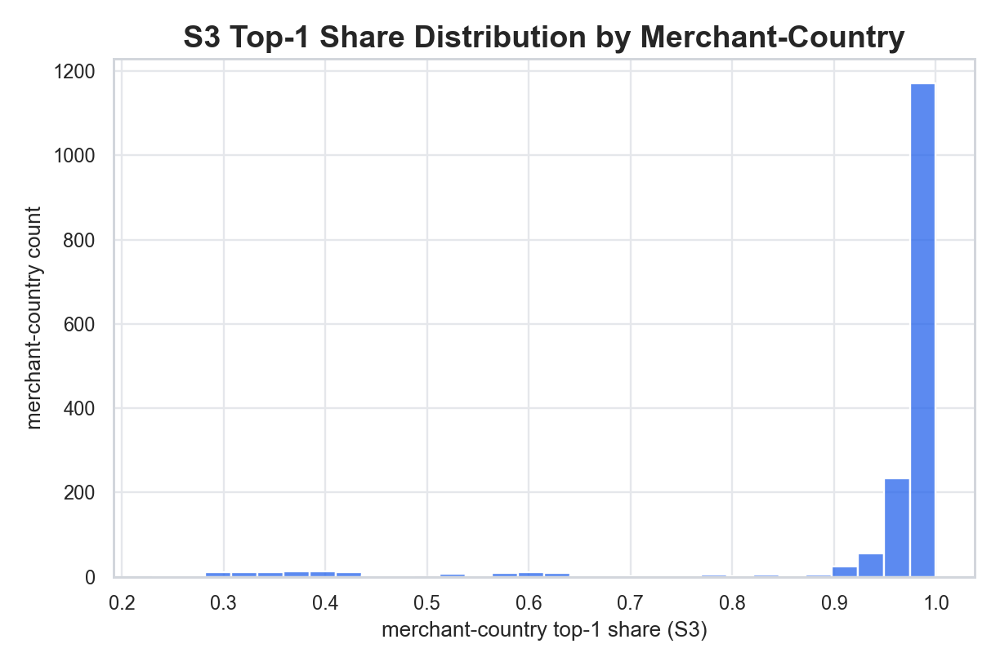

The distribution is even more concentrated than S2, with almost all merchant-country pairs clustered near 1.0. This shows that sampling did not introduce meaningful diversity; it inherited the prior dominance and effectively preserved it for individual merchants.

### 14.7 S3 effective zone counts by share thresholds

The threshold boxplot shows effective-zone breadth collapsing quickly as the threshold increases. At moderate thresholds, most merchant-country pairs retain only one materially active zone; even at low thresholds, breadth expands only modestly. This shows most secondary shares are too small to survive practical significance checks.

### 14.8 S3 mean share vs S2 prior share
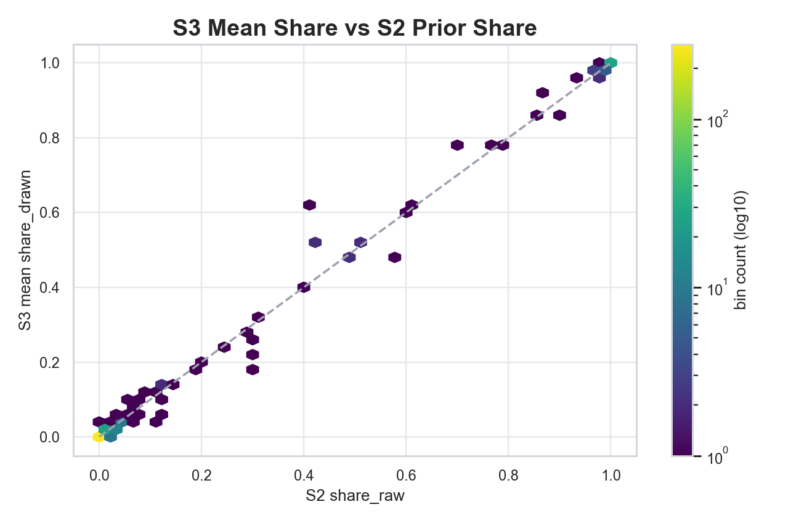

The hexbin points sit almost perfectly on the y=x line. This means the average sampled share per country-tzid is almost identical to the S2 prior share. The lack of spread indicates minimal merchant-level heterogeneity. Sampling is behaving like a direct echo of priors rather than generating new variation.

### 14.9 S4 nonzero zones per merchant-country

There is a dominant spike at 1 nonzero zone, with only a small tail at 2-6. This makes the integerization collapse visible: even after escalation and sampling, most pairs end up with only one zone receiving any outlets.

### 14.10 S4 top-1 share from counts
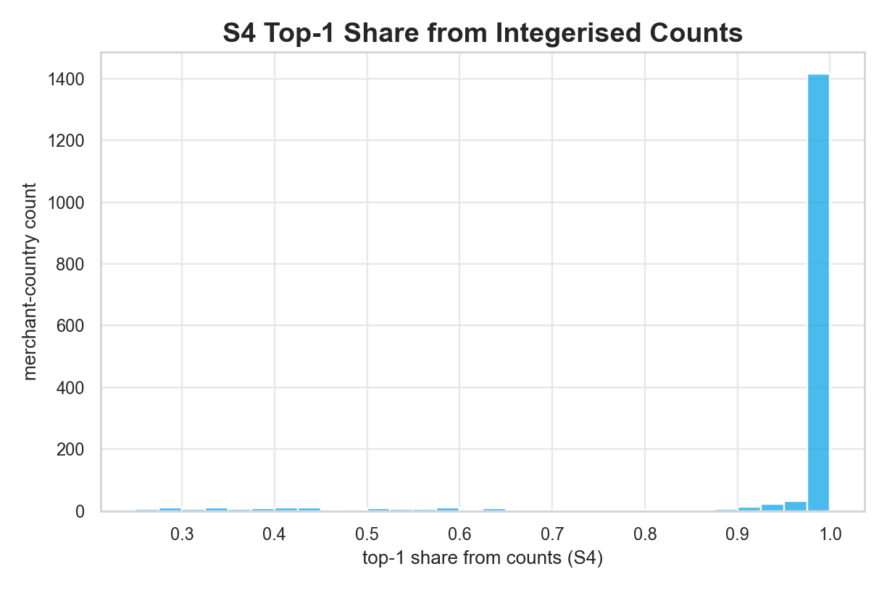

The histogram is almost entirely concentrated at 1.0, with only a tiny tail below 0.95. This confirms that integerization produces near-monopoly allocations for most pairs. Any minor share diversity in S3 is not surviving into counts.

### 14.11 zone_alloc top-1 share (final allocation)
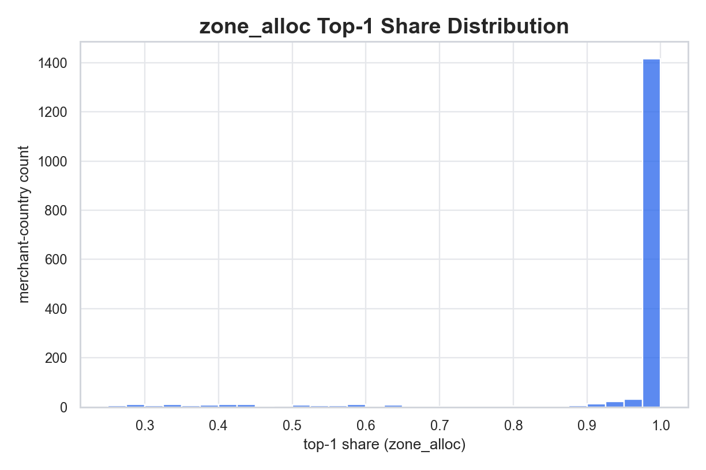

The final allocation mirrors S4 exactly: a massive spike at 1.0 and almost no spread. This is the end-to-end proof that the output is effectively monolithic for most merchant-country pairs, despite the high escalation rate upstream.

**Visual takeaway:**
Every plot tells the same story: escalation is high, but priors are so dominated by a single tzid that sampling and integerization collapse into single-zone allocations. The system is internally coherent, but behaviorally flat.

---

## 15) Diagnostic deep-dives (plots_diag)
These are the deeper diagnostic plots used to stress-test the interpretation above. All plots are saved under `docs/reports/eda/segment_3A/plots_diag/`.

### 15.1 S2 lowest top-1 shares (least-dominant countries)

This plot shows the **30 countries with the lowest top-1 prior share**. Even the least-dominant cases still sit mostly above ~0.5, with only a handful dipping closer to ~0.15–0.3. That means the *best* cases for multi-zone diversity are still heavily dominated by one tzid. In realism terms: the system has very limited headroom for truly balanced multi-zone countries; even the weakest dominance cases are still tilted.

### 15.2 S2 tz_count vs top-1 share (labeled)

The labeled scatter highlights that **some large, multi‑TZ countries** (e.g., US, RU, BR, CA, MX) do drop below the ~0.9–1.0 dominance band, but **many countries with higher tz_count still sit near 1.0**. This shows the prior construction is not strongly tied to tz_count. If realism were stronger, multi‑TZ countries would more consistently show reduced top‑1 dominance and broader spread.

### 15.3 S2 alpha_effective / alpha_raw (log‑x histogram)

The ratio distribution is **heavily concentrated at ~1**, with a long but thin right tail. This implies the **floor policy rarely changes the priors**; most zones remain close to their raw alpha. In realism terms, floors are not a major shaping mechanism here — the dominance mostly comes from the raw prior geometry itself.

### 15.4 S2 share_raw vs share_effective
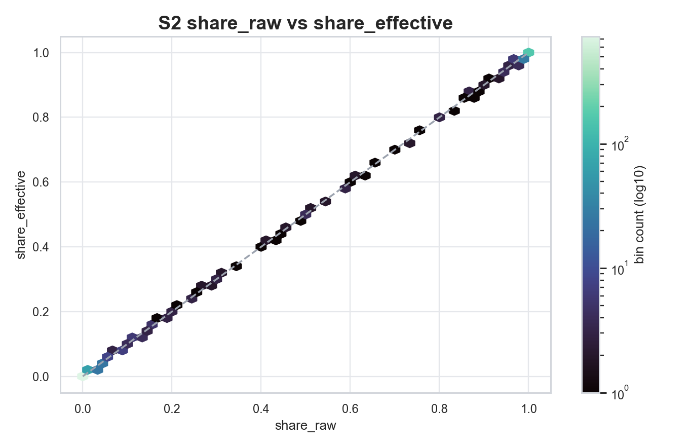

The hexbin points fall almost perfectly on the diagonal. This confirms that **effective shares are essentially raw shares**, and floor adjustments do not materially reshape country‑level concentration. This backs the interpretation that S2 is structurally locked into heavy dominance.

### 15.5 S3 entropy per merchant-country

Entropy is strongly concentrated near 0 with a small tail reaching into higher values (roughly 1.3–1.7). This means **most merchant-country pairs are effectively single-zone** (very low entropy), with only a small minority exhibiting meaningful dispersion. As a realism signal, this indicates that multi-zone behavior is exceptional rather than typical.

### 15.6 S3 std dev of share by country/tzid (log10)
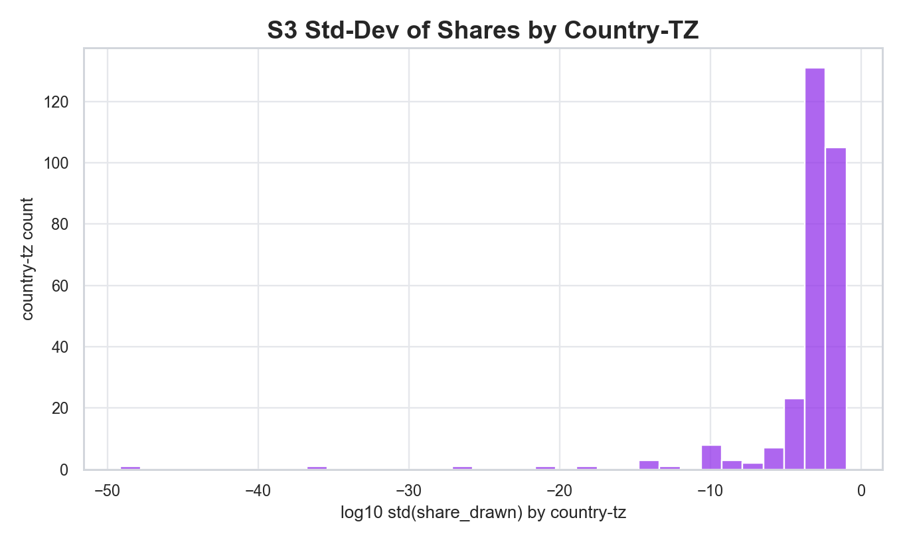

The mass of the distribution sits at **very negative log10 values**, indicating **extremely small standard deviations** of share across merchants within the same country/tzid. A few extreme outliers appear, but the dominant story is that merchant‑level variation is minimal. This supports the conclusion that S3 sampling produces **near‑identical allocations for merchants in the same country**.

### 15.7 S3 vs S4 top-1 share (rounding effect)

The cloud tracks the diagonal closely, showing **integerization preserves the dominance pattern**. Where the points sit slightly above the diagonal, rounding pushes the top‑1 zone share marginally higher in S4. This plot reinforces that S4 is not introducing diversity; it slightly **amplifies** the single‑zone effect.

### 15.8 S4 multi‑zone rate by escalation flag (zoomed)
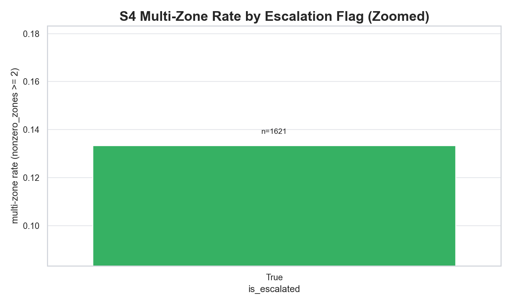

The zoomed panel makes the key contrast visible: **non‑escalated pairs have ~0% multi‑zone**, while **escalated pairs reach only ~13.3%**. This is the clearest quantitative gap between the escalation policy and realized multi‑zone outcomes. Realism-wise, it shows the pipeline is *formally* escalating but **functionally collapsing** back to monolithic allocations.

**Diagnostic takeaway:**
The deeper diagnostics confirm the earlier conclusion: 3A is structurally correct but **behaviorally flat**. Priors are highly concentrated, floors barely reshape them, sampling adds almost no heterogeneity, and integerization preserves (or slightly amplifies) dominance. The system escalates aggressively but fails to deliver multi-zone realism for most pairs.

---

## 16) Realism grade (robust synthetic realism standard)
**Grade: C**

This grade reflects your stated expectation: not real-world truth, but **robust synthetic realism** from handcrafted policy. The data is structurally coherent and reproducible, yet behaviorally flat in ways that reduce plausibility.

**Why it earns a C (not a D):**
- The pipeline is internally consistent: conservation holds, joins are clean, and outputs are reproducible.
- Escalation, priors, shares, counts, and zone_alloc all line up without structural leakage.

**Why it does not reach B or A:**
- **Priors are overwhelmingly dominant**, so multi‑TZ countries still act like single‑TZ countries.
- **Sampling adds almost no heterogeneity**, with near‑identical share patterns across merchants in the same country.
- **Integerization collapses diversity**, so the final allocation is almost always single‑zone.
- **Escalation intent vs outcome mismatch**: escalation is high, but only ~13% of escalated pairs end up multi‑zone.

**Bottom line:** 3A is **correct in structure but weak in behavioral realism**. It needs more dispersion in priors and more merchant‑level variation to reach robust synthetic realism.

---

## 17) Realism improvement roadmap (synthetic realism)
This roadmap targets **robust synthetic realism** without real policy data. The aim is to preserve determinism while introducing believable diversity.

1) **Reduce dominance in priors (S2).**  
   The priors are too concentrated, which makes multi‑TZ countries behave like single‑TZ countries. Use a **lower‑concentration Dirichlet** or a mixture of priors (dominant‑hub + regional tail) so the top‑1 share is high but not overwhelming.

2) **Introduce merchant‑level variability (S3).**  
   Sampling currently produces near‑identical distributions across merchants in the same country. Add **merchant‑specific noise** or tiered dispersion so two merchants in the same country can still differ meaningfully.

3) **Strengthen escalation effects (S4).**  
   Escalated pairs should reliably show multi‑zone allocation. Add a **minimum secondary‑zone floor** for escalated flows (e.g., guarantee at least 2–5% in zone 2) so escalation becomes visible in outputs.

4) **Control rounding collapse (S4).**  
   Integerization currently amplifies dominance. Consider **stochastic rounding** or minimum‑count guarantees so low‑share zones survive rounding.

5) **Add validation checks for diversity.**  
   Include tests for **top‑1 share bounds, entropy floors, and multi‑zone rate targets**, so the pipeline fails if it reverts to flatness.

**Expected impact:**  
Implementing steps 1–3 should move 3A toward **B‑/B** for synthetic realism. Steps 4–5 stabilize the gains and prevent regressions to single‑zone behavior.
