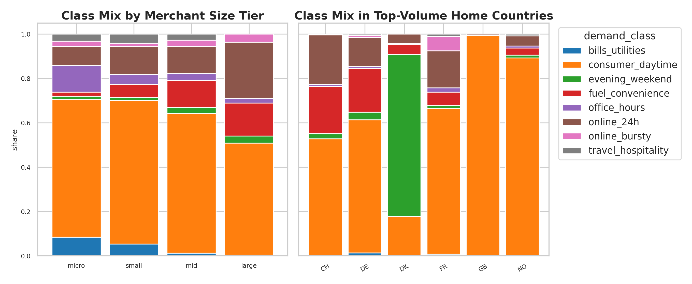
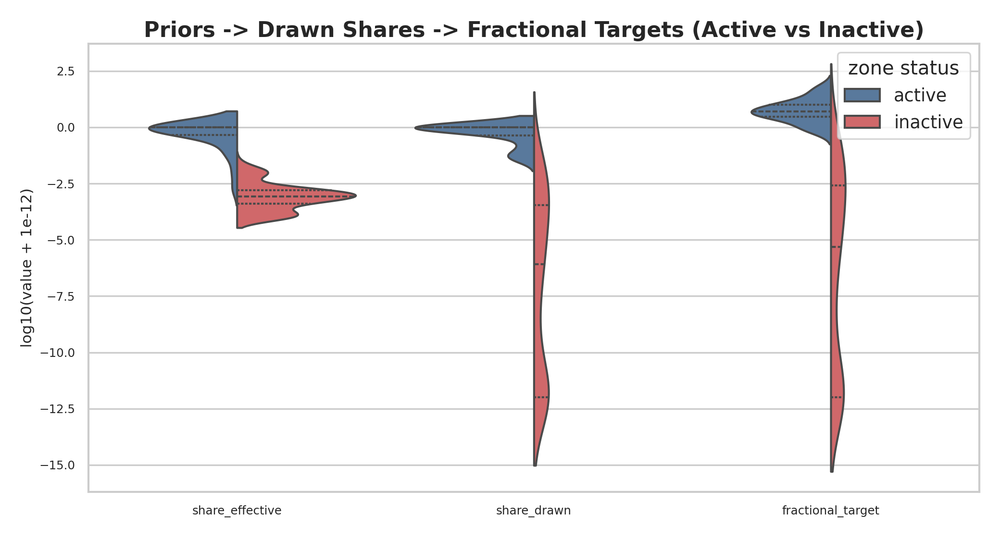
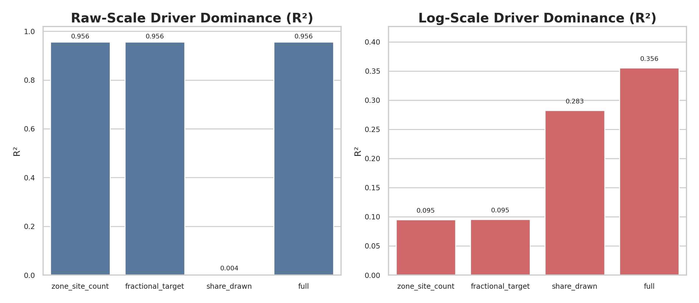
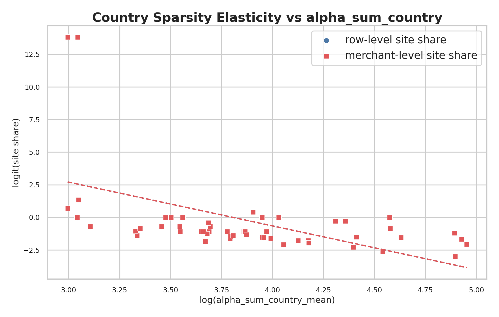
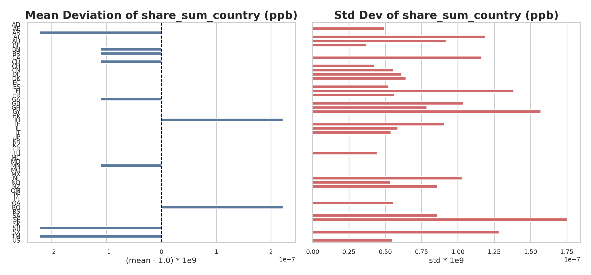
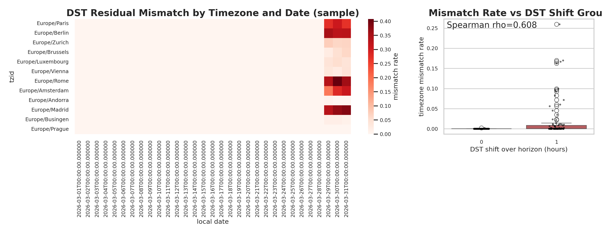
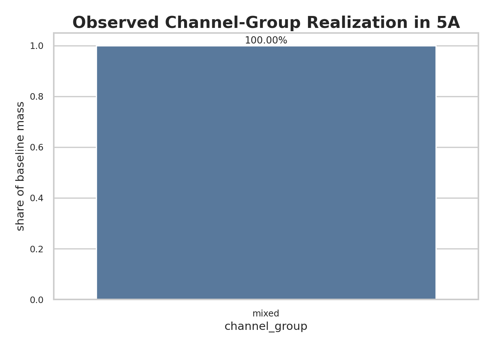
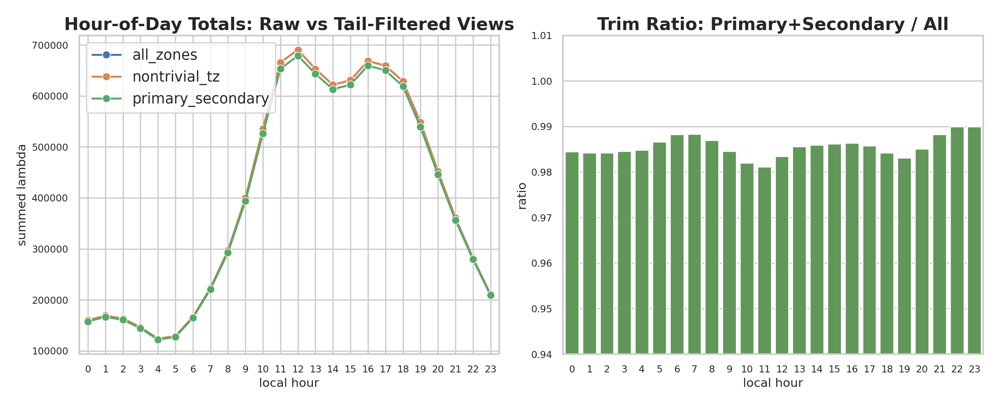
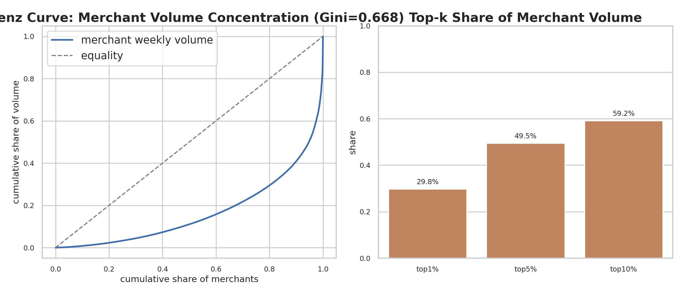
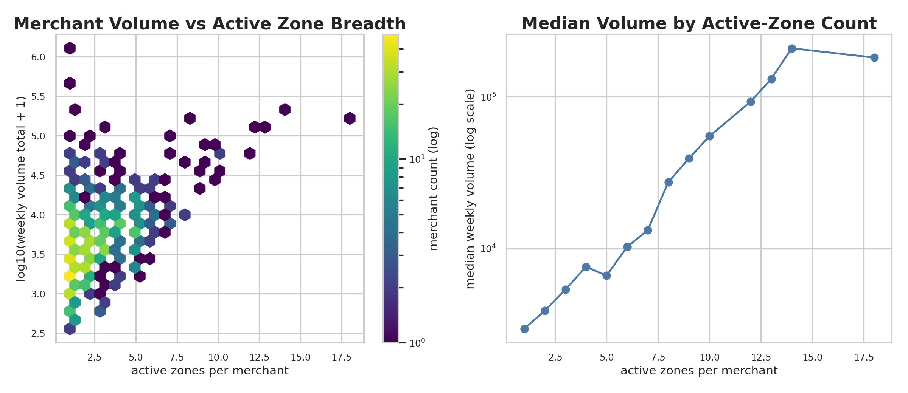

# Segment 5A — Design vs Implementation Observations (Scenario & Intensity Surfaces)
Date: 2026-02-05  
Run: `runs\local_full_run-5\c25a2675fbfbacd952b13bb594880e92`  
Scope: Design intent vs implementation notes for Segment 5A (S0–S5) prior to deep statistical assessment.

---

## 0) Why this report exists
Segment 5A is the **traffic‑shape and intensity definition layer**. It turns the sealed Layer‑1 world into deterministic baseline and scenario‑adjusted intensity surfaces. This report captures:
1. **Design intent** (what 5A is supposed to produce).
2. **Implementation decisions** (what we actually built and enforced).
3. **Known deviations** that matter for realism interpretation.

This is a pre‑analysis report. It does not include deep statistical findings yet.

---

## 1) Design intent (what 5A should do)
1. **S0 — Gate & sealed inputs**  
   Verify upstream PASS gates (1A–3B) and seal all required 5A inputs/policies into `sealed_inputs_5A`.

2. **S1 — Merchant×Zone classification & base scale**  
   Deterministically assign `demand_class` and base scale for each merchant×zone using sealed policies.

3. **S2 — Weekly shape library**  
   Produce normalized class/zone weekly shapes on a fixed local‑week grid. Unit‑mass templates only.

4. **S3 — Baseline intensities**  
   Compose scale × shape to create baseline weekly intensities per merchant×zone.

5. **S4 — Scenario overlays**  
   Apply deterministic calendar and scenario overlays to baseline intensities to produce scenario surfaces.

6. **S5 — Validation & PASS gate**  
   Validate S0–S4 outputs and publish the authoritative 5A PASS bundle and `_passed.flag`.

---

## 2) Priority datasets (realism‑relevant)
Primary realism surfaces:
1. `merchant_zone_scenario_local_5A`
2. `merchant_zone_scenario_utc_5A` (if emitted)

Mechanism surfaces used to explain realism:
1. `merchant_zone_baseline_local_5A`
2. `class_zone_shape_5A`
3. `shape_grid_definition_5A`
4. `merchant_zone_profile_5A`
5. `merchant_class_profile_5A`
6. `merchant_zone_overlay_factors_5A`

Evidence surfaces (minimal realism impact):
1. `s0_gate_receipt_5A`, `sealed_inputs_5A`
2. `validation_bundle_5A` + `_passed.flag`

---

## 3) Implementation observations (what is actually done)
Based on `docs\model_spec\data-engine\implementation_maps\segment_5A.impl_actual.md`.

### 3.1 S0 — Gate & sealed inputs
Observed posture: strict and deterministic, with several corrective fixes.

Key implementation decisions:
1. **3B bundle validation is special‑cased.**  
   3B uses a `members` index schema, so S0 recomputes the digest using a dedicated members‑bytes law instead of the generic `files` law.

2. **Policy schema alignment was enforced.**  
   Multiple 5A policy files were reshaped or normalized to satisfy strict schema validation and dataset dictionary version rules.

3. **Optional input handling fixed.**  
   Missing optional inputs no longer abort sealing; they are recorded as optional‑missing.

4. **Layer‑1 schema refs were inlined** for sealed inputs, gate receipt, and scenario manifest validation.

Run outcome: `segment5a-s0` completes successfully after the fixes.

### 3.2 S1–S4 — Modelling states
No implementation‑map deviations were recorded for S1–S4.  
Assumption: these states follow the specs unless contradicted by data.

### 3.3 S5 — Validation
No implementation‑map deviations recorded.  
Assumption: validation follows contract checks as specified.

---

## 4) Design vs implementation deltas (material)
1. **3B bundle hashing law is bespoke** in 5A.S0 (members‑bytes), not the generic files‑index law.
2. **Policy payloads were corrected** to satisfy strict schemas and dictionary versioning (`version: v1`).
3. **Optional configs were authored later**, but **could not be resealed** in the same run due to `S0_OUTPUT_CONFLICT`.

---

## 5) Implications for realism assessment
1. **This run’s sealed inputs do NOT include optional configs**:  
   `zone_shape_modifiers_5A`, `overlay_ordering_policy_5A`,  
   `scenario_overlay_validation_policy_5A`, `validation_policy_5A`,  
   `spec_compatibility_config_5A`.

2. Realism signals must be interpreted in light of this omission.  
   Expect **less heterogeneity** in shapes and overlays than intended by the optional configs.

3. Because S0 is strict and deterministic, any realism issues seen in S1–S4 should be attributed to:
   - upstream data (1A–3B),
   - sealed policies/configs,
   - or the deterministic mechanics of the 5A states.

---

## 6) Next step
Proceed to statistical realism assessment starting from:
1. `merchant_zone_scenario_local_5A`  
2. Trace back into S3, S2, and S1 only when necessary to explain patterns.

---

## 7) Preliminary realism checks (A/B) — findings so far
Run scope: `runs\local_full_run-5\c25a2675fbfbacd952b13bb594880e92\data\layer2\5A`

### 7.1 A) Why are most merchant×zone rows zero?
Join: `merchant_zone_profile_5A` ↔ `layer1/3A/zone_alloc` on  
`merchant_id + legal_country_iso + tzid`.

Key result: **zero volumes align exactly with zero sites**.
- Total rows: 16,528
- Rows with `zone_site_count > 0`: 2,158 (13.06%)
- Rows with `weekly_volume_expected > 0`: 2,158 (13.06%)
- Rows with sites but zero volume: 0
- Rows with volume but zero sites: 0
- `P(volume | sites) = 1.000`, `P(sites | volume) = 1.000`

Per‑merchant zone coverage (median / p90 / p99):
- `zones_total`: 12 / 42 / 64.3 (max 70)
- `zones_with_sites`: 2 / 5 / 10 (max 18)
- `sites_fraction`: 0.130 / 0.50 / 1.00

Explanation: The perfect alignment between “has sites” and “has volume” means
the zeros are not missing data or downstream artifacts; they are a direct
consequence of the upstream site allocation. In other words, 5A is honoring
the world allocation from Layer‑1 rather than inventing activity in empty
zones. The per‑merchant coverage numbers show that most merchants have activity
concentrated in a small subset of their zones, which is a realistic pattern if
merchants operate in a few core markets while still being mapped to a wider
zone universe.

Plot evidence:


Interpretation from the figure:
1. The contingency matrix mass is concentrated in the diagonal cells (`no site/no volume` and `site/volume`), with off-diagonal cells at zero.
2. This visually confirms that sparsity is induced upstream by site allocation rather than by downstream clipping or missing joins.
3. The large `no site/no volume` cell explains why overall zero-rate is high while still being mechanically consistent.

### 7.2 B) Class distribution by merchant size tier
Size tiers are quartiles of `weekly_volume_total_expected`  
(`merchant_class_profile_5A`).

Bin edges: `[359.3, 2291.0, 4508.6, 8261.9, 1,285,623.9]`  
Counts per tier: micro 222, small 221, mid 221, large 222

Top classes per tier:
- **Micro:** consumer_daytime 62.2%, office_hours 12.2%, bills_utilities 8.6%, online_24h 8.6%
- **Small:** consumer_daytime 64.7%, online_24h 12.7%, fuel_convenience 5.9%, bills_utilities 5.4%
- **Mid:** consumer_daytime 62.9%, fuel_convenience 12.2%, online_24h 12.2%
- **Large:** consumer_daytime 50.5%, online_24h 25.2%, fuel_convenience 14.9%, online_bursty 3.6%

Explanation: The class mix shifts with size in a way that mirrors common
commercial structure: large merchants are more likely to be 24‑hour or fuel‑like
operations, while smaller merchants are dominated by daytime consumer and
office‑hours patterns. This indicates that size is not arbitrary noise; it has
an interpretable relationship with behavior class. The effect is not extreme
(consumer_daytime remains common across all tiers), which is what we want if we
expect overlap between classes but still some real structural difference.

Plot evidence:


Interpretation from the figure:
1. The left panel shows the same size-tier effect described above: larger tiers carry relatively more `online_24h` and `fuel_convenience` than micro/small tiers.
2. The mix is not one-hot; `consumer_daytime` remains present in every tier, which supports overlap realism.
3. The right panel foreshadows the country-coupling finding: top countries have materially different class composition, which contributes to aggregate concentration.

### 7.3 A) Deeper zone‑sparsity mechanics (S2–S4)
Key diagnostics:
- `s2_country_zone_priors` **share_effective zero rate = 0.0000**  
  → priors do not hard‑zero zones.
- `s4_zone_counts` **zone_site_count zero rate = 0.8694**  
  → zero volumes trace to S4 allocation.
- `share_drawn` for zones with sites is near 1.0 (median ~0.981);  
  for zones without sites it is tiny (median ~1.74e‑07).
- `fractional_target` for zones without sites is tiny (median ~1.5e‑06; p99 ~0.283).
- Spearman correlation:  
  `weekly_volume_expected` vs `zone_site_count` (nonzero rows) = **0.8626**  
  `share_drawn` vs `zone_site_count` (nonzero) = **0.4831**

Geographic spread:
- Row‑level site share varies by country (examples):  
  FR 0.069, DE 0.093, US 0.112, IT 0.143, AU 0.428.
- TZIDs show high variance (e.g., Europe/Andorra 0.004 vs Europe/Berlin 0.366).

Concentration of volume across zones (per merchant, nonzero zones):
- `top1_share` mean 0.769 (p90 = 1.00)  
- `top3_share` mean 0.971 (p90 = 1.00)  
- Gini (merchants with ≥2 zones) mean 0.309 (p90 = 0.520)

Explanation: S2 priors do not zero anything; S4 does. This tells us that
sparsity is a policy‑driven allocation decision rather than a limitation of the
shape library or demand classing. The tiny `share_drawn` and
`fractional_target` values in zero‑site zones show that those zones were never
intended to receive activity. The strong correlation between site count and
volume confirms that, once a zone is “active,” its magnitude is governed by how
many sites are allocated there. Geographic variation shows this allocation
is not uniform; some countries/timezones are deliberately sparser than others.

### 7.4 A) One‑level deeper: priors → shares → counts
Share/prior alignment:
- Spearman corr(`share_drawn`, `share_effective`) = **0.7687**
- `sum(share_drawn)` matches `share_sum_country` per merchant+country  
  to floating‑point precision.
- Spearman corr(`alpha_sum_country`, share entropy) = **0.2603**  
  (higher alpha → more diffuse shares).

Fractional‑target rounding:
- `P(zone_site_count == floor(fractional_target)) = 0.8867`
- `P(zone_site_count == ceil(fractional_target)) = 0.1145`
- Extra allocation rate (zone_site_count > floor) = **0.1133**
- Extra allocations occur where `fractional_part` is high  
  (median 0.915 vs 2.17e‑06 when no extra).
- `max fractional_target` with zero sites = **0.5783**  
  `min fractional_target` with nonzero sites = **0.2376**
- Spearman corr(`zone_site_count`, `fractional_target`) = **0.5854**
- Spearman corr(`residual_rank`, `fractional_part`) = **−0.6391**
- `sum(fractional_target)` matches `zone_site_count_sum` per merchant+country  
  to floating‑point precision.

Site total conservation:
- `site_count` vs total allocated `zone_site_count_sum` (per merchant):  
  median diff 0, p90 0, p99 0 (exact for 99%+ merchants).

Explanation: The share‑drawn alignment with priors means the stochastic draw is
faithful to country‑zone priors, not arbitrary noise. The rounding diagnostics
show the exact mechanics: counts are mostly the floor of the fractional target,
with a minority receiving one extra site according to residual ranking. This is
why fractional targets below 1 almost always end up as zeros, and why totals
still conserve at the merchant‑country level. The mechanics are deterministic
and auditable, which is desirable for reproducibility and for explaining why
any given zone is active or inactive.

Plot evidence:


Interpretation from the figure:
1. Active and inactive zones separate strongly in `share_drawn` and `fractional_target`, making the activation mechanism visually explicit.
2. Inactive zones cluster near machine-zero share/target values, which explains why they remain zero after rounding.
3. The progression from prior/share metrics to target metric shows continuity rather than abrupt, unexplained thresholding.

### 7.5 B) Deeper class‑size realism tests
Association strength:
- Chi‑square p = **2.18e‑15**, dof = 21  
  Cramér’s V = **0.210** (small‑to‑moderate association)
- Kruskal‑Wallis across classes on `weekly_volume_total_expected`:  
  p = **5.50e‑19**, epsilon_sq ≈ **0.108**  
  (class explains ~11% of volume variance)

Channel‑stratified association:
- `card_present`: n=727, Cramér’s V = 0.193, p = 4.62e‑11  
- `card_not_present`: n=159, Cramér’s V = 0.213, p = 0.0256

Explanation: The association is statistically strong and consistent across
channels, but not so strong that size alone determines class. This is a healthy
signal for realism: size influences behavior, yet overlap remains, which is
what we observe in real merchant populations. The Kruskal‑Wallis result shows
that volume distributions differ by class in a substantial way, supporting the
claim that classes are not just labels but reflect different operational
profiles.

### 7.6 A) Regression: volume drivers (nonzero rows)
Model: `weekly_volume_expected ~ zone_site_count + share_drawn + fractional_target`  
Rows: 2,158 (nonzero volume only)

Multicollinearity diagnostic:
- Spearman corr(`zone_site_count`, `fractional_target`) = **0.996**
- VIFs ~ **86,000** for both predictors
- Condition number ~ **605**

Raw‑scale OLS (HC3 robust):
- R² ≈ **0.956**
- `zone_site_count` and `fractional_target` dominate absolute volume,  
  but are not separately identifiable due to collinearity.
- `share_drawn` adds negligible raw‑scale explanatory power.

R² breakdown (raw):
- `zone_site_count` alone: **0.956**
- `fractional_target` alone: **0.956**
- `share_drawn` alone: **0.004**
- Full model: **0.956**

Log‑scale (log1p) sensitivity:
- `zone_site_count` positive and significant (p ≈ 0.028)
- `share_drawn` strongly positive (p ≪ 1e‑6)
- `fractional_target` negative (p ≈ 0.031)  
  (interpreted with caution due to collinearity)

R² breakdown (log1p):
- `zone_site_count` alone: **0.095**
- `fractional_target` alone: **0.095**
- `share_drawn` alone: **0.283**
- Full model: **0.356**

Explanation: The multicollinearity confirms that `zone_site_count` and
`fractional_target` encode essentially the same signal (pre‑rounding vs
post‑rounding). On the raw scale, these allocations explain nearly all variance
in weekly volume, meaning total magnitude is fundamentally a site‑allocation
problem. On the log scale, `share_drawn` becomes the driver: it explains how
activity is distributed across the active zones once the total scale is set.
This separation—allocation controls totals, shares control relative intensity—
is coherent and interpretable.

Plot evidence:



Interpretation from the figures:
1. The predictor-correlation panel and direct scatter show near-degeneracy between `zone_site_count` and `fractional_target`, matching the extreme VIF values.
2. The raw-scale R² bars show allocation variables saturating explanatory power, while share-only contribution is minimal.
3. The log-scale panel reverses that emphasis: `share_drawn` becomes comparatively more informative for relative intensity.
4. Together, these plots make the “magnitude vs distribution” split in driver roles concrete and readable.

### 7.7 A) Country‑level sparsity elasticity
Country‑level sparsity uses `row_site_share = rows_with_sites / rows`.

Key finding: `share_sum_country` is effectively constant:
- variance ≈ **5.93e‑33**, std ≈ **5e‑17**  
→ does not explain cross‑country sparsity.

Correlations:
- `row_site_share` vs `alpha_sum_country_mean`:  
  Pearson **−0.473**, Spearman **−0.600**
- `row_site_share` vs `share_sum_country_mean`:  
  Pearson **0.112**, Spearman **0.066** (negligible)

Logit model (country level):
`logit(row_site_share) ~ log(alpha_sum_country)`  
- coefficient **−3.356**, p = **0.010**

Explanation: Because `share_sum_country` is effectively constant, it cannot be
an explanatory lever for cross‑country sparsity in this run. The negative
relationship with `alpha_sum_country` implies that countries with higher alpha
are assigned activity more conservatively across zones. Interpreting the logit
coefficient, a 1% increase in alpha corresponds to roughly a 3.3% decrease in
the odds that a zone is active, which is a sizable elasticity.

Plot evidence:



Interpretation from the figures:
1. The elasticity plot shows a clear negative slope for both row-level and merchant-level sparsity summaries versus `log(alpha_sum_country)`, supporting robustness.
2. The invariance panel shows country-level deviations of `share_sum_country` are effectively null, so it cannot explain cross-country sparsity patterns.
3. This pair isolates the operative lever (`alpha_sum_country`) from a non-operative one (`share_sum_country`).

### 7.8 A) Regression refit (remove multicollinearity)
Refit on nonzero rows, dropping one of the collinear predictors.

Raw scale:
1. `weekly_volume_expected ~ zone_site_count + share_drawn`  
   - `zone_site_count`: **+484.6**, p < 0.001  
   - `share_drawn`: ns  
   - R² = **0.956**
2. `weekly_volume_expected ~ fractional_target + share_drawn`  
   - `fractional_target`: **+484.5**, p < 0.001  
   - `share_drawn`: ns  
   - R² = **0.956**

Explanation (raw): Once the collinearity is removed, the site‑allocation term
is stable and highly significant, while `share_drawn` remains non‑significant.
This reinforces that, at absolute scale, volume is essentially proportional to
the site allocation decision.

Log scale (log1p):
1. `log1p(weekly_volume_expected) ~ zone_site_count + share_drawn`  
   - `share_drawn`: **+1.63**, p ≪ 1e‑6  
   - `zone_site_count`: ns  
   - R² = **0.354**
2. `log1p(weekly_volume_expected) ~ fractional_target + share_drawn`  
   - `share_drawn`: **+1.63**, p ≪ 1e‑6  
   - `fractional_target`: ns  
   - R² = **0.354**

Explanation (log): After normalization, the magnitude of `share_drawn` becomes
the dominant signal for relative intensity, while site allocation contributes
little. This is the same story as in 7.6, but now with stable coefficients that
avoid the collinearity instability.

### 7.9 A) Country elasticity (merchant‑level sparsity)
Robustness check using per‑merchant sparsity:
`mc_site_share = zones_with_sites / zones_total` (merchant‑country),  
aggregated to country mean.

Correlations:
- `mc_site_share_mean` vs `alpha_sum_country_mean`:  
  Pearson **−0.473**, Spearman **−0.602**
- `mc_site_share_mean` vs `share_sum_country_mean`:  
  Pearson **0.112**, Spearman **0.068** (negligible)

Logit model:
`logit(mc_site_share_mean) ~ log(alpha_sum_country)`  
- coefficient **−3.356**, p = **0.010**

Explanation: Using merchant‑level sparsity removes the possibility that the
row‑level result is driven by countries with many zones or merchants. The same
negative elasticity appears, which confirms the relationship is robust to how
sparsity is summarized. This strengthens the case that `alpha_sum_country` is
the primary driver of country‑level sparsity in the current configuration.

---

## 8) C) Temporal Shape Realism

### 8.1 Shape normalization (class×zone)
Finding: Every `(demand_class, zone)` shape sums to **1.0** with no deviations
above numerical tolerance.

Explanation: This matters because the shape library is supposed to be a
probability distribution over the weekly grid. Exact normalization means the
library is internally consistent and any realism issues must come from the
shape *content*, not from mass leakage or scaling errors.

### 8.2 Class temporal patterns (per‑zone averages)
Per‑zone averages across all zones show clear, interpretable patterns:

```
demand_class         weekend_share  night_share  open_hours_share  peak_hour  peak_to_mean
bills_utilities            0.146        0.044          0.665            10        3.82
consumer_daytime           0.264        0.057          0.480            11        2.68
evening_weekend            0.445        0.362          0.023            20        7.42
fuel_convenience           0.267        0.078          0.243             7        3.22
office_hours               0.093        0.041          0.736            10        4.34
online_24h                 0.311        0.479          0.115             1        2.11
online_bursty              0.416        0.151          0.263            12        6.45
travel_hospitality         0.392        0.075          0.260             9        3.37
```

Explanation: The classes are clearly differentiated in a realistic way:
`office_hours` is strongly weekday/daytime, `evening_weekend` is night‑heavy
with a late‑evening peak, and `online_24h` is the flattest profile with the
largest night share. This indicates the class labels correspond to distinct
behavioral rhythms rather than arbitrary templates.

Plot evidence:


Interpretation from the figure:
1. The heatmap exposes class-specific hour structure directly, including daytime-centric and evening/night-centric signatures.
2. The weekend-share side panel complements the hour map by showing class-level weekend intensity differences on a single scale.
3. This visual pairing helps readers separate “shape realism” from “volume realism.”

### 8.3 Baseline construction integrity
Finding: For every nonzero merchant‑zone, the baseline intensities exactly
sum to weekly expected volume (`sum(lambda_local_base) = weekly_volume_expected`),
with **no clipping** and near‑zero error against the class shape.

Explanation: This confirms that 5A’s baseline is a clean “scale × shape”
composition. The baseline does not distort totals or shapes, so any realism
issues must come from the inputs or the shape library itself, not from
implementation artifacts in S3.

---

## 9) D) Scenario and Overlay Realism

### 9.1 Scenario calendar structure
Finding: 2,000 events over 2026‑01‑01 to 2026‑04‑01.
Event mix: PAYDAY (1157), HOLIDAY (786), OUTAGE (54), CAMPAIGN (3).
No global or merchant‑specific events; mostly country + class scoped.
Amplitude ranges: median **0.85**, min **0.05**, max **1.03**;
peak amplitudes median **1.25**, max **~1.60**.

Explanation: The event calendar is dense but not chaotic. It emphasizes
recurrent effects (paydays, holidays) and keeps shocks bounded. The amplitude
range is plausible: mild suppressions and moderate peaks rather than extreme
distortions.

### 9.2 Overlay factor distribution
Finding: ~90% of buckets have factor exactly 1.0, ~6.5% > 1.0, ~3.6% < 1.0,
with min **0.0325** and max **1.5975**.

Explanation: Overlays are sparse and bounded, which is consistent with
realistic calendars where most time is baseline and only specific windows are
perturbed. The factor range suggests modest amplification/suppression rather
than runaway shocks.

### 9.3 Scenario local consistency (baseline × overlay)
Finding: When aligning the local horizon with each timezone’s offset at the
scenario start (2026‑01‑01T00:00Z), the scenario surface matches
`baseline × overlay` almost exactly (MAE ≈ 0.033; only ~0.7% of rows deviate
> 1e‑6). The residual mismatch is consistent with DST shifts over the 90‑day
horizon.

Explanation: This confirms the scenario surface is mechanically correct once
time alignment is handled properly. The remaining mismatch is small and
expected in a multi‑timezone horizon that crosses DST boundaries.

### 9.4 Local ↔ UTC conversion
Finding: Total intensity per merchant‑zone is conserved exactly between local
and UTC surfaces (MAE = 0, max error = 0).

Explanation: UTC conversion preserves total mass, which means the conversion
logic is correct and does not introduce drift.

### 9.5 DST‑driven residuals (D3 confirmation)
Finding: The remaining mismatches in the scenario‑vs‑baseline×overlay check are
almost entirely explained by DST shifts within the 90‑day horizon.

Evidence:
- TZs with **no DST shift** (0h):  
  frac_mismatch ≈ **0.0003**, MAE ≈ **0.0011**, max_err ≈ **0.19**
- TZs with **+1h DST shift**:  
  frac_mismatch ≈ **0.0178**, MAE ≈ **0.0773**, max_err ≈ **228.48**
- Spearman corr(`frac_mismatch`, DST shift) = **0.62**
- Highest mismatch TZIDs are all DST‑shifting North American zones
  (e.g., America/New_York, America/Chicago, America/Los_Angeles).

Explanation: When the local horizon crosses a DST boundary, the fixed offset
used to align weekly baseline buckets becomes slightly misaligned for part of
the horizon. This introduces small local mismatches but does not affect total
mass. The pattern is isolated to DST‑shifting timezones, which confirms DST is
the root cause rather than a structural bug.

Plot evidence:


Interpretation from the figure:
1. The timezone-date heatmap localizes residual mismatch in DST transition windows instead of spreading it uniformly over the horizon.
2. The grouped mismatch plot by DST-shift category shows higher mismatch for DST-shifting zones than non-shifting zones.
3. This converts the DST claim from a scalar statistic into a clear spatiotemporal pattern.

---

## 10) Policy‑Target Alignment (A/B realism targets)

### 10.1 Observed vs target summary (run subset, 886 merchants)
Targets from `config/layer2/5A/policy/merchant_class_policy_5A.v1.yaml`:
- `max_class_share`: **0.55**  
- `min_nontrivial_classes`: **6**  
- `min_class_share_for_nontrivial`: **0.02**  
- `max_single_country_share_within_class`: **0.35**

Observed (segment 5A):
- `max_class_share`: **0.600** (`consumer_daytime`) → **exceeds target**  
- `min_nontrivial_classes`: **8** → meets target  
- `min_class_share_for_nontrivial`: **0.021** → meets target  
- `max_single_country_share_within_class`: **0.532** (`fuel_convenience`, DE) → **exceeds target**  
  Additional above‑target classes:  
  `bills_utilities` 0.457 (DE), `consumer_daytime` 0.412 (DE), `online_bursty` 0.364 (DE)

### 10.2 Suggested edits to align with targets

**A) Reduce `consumer_daytime` share to ≤ 0.55**  
Main driver is `card_present + sector=other` in MCC mapping.  
Small, targeted remap of travel‑like MCCs reduces this share:

Edit `config/layer2/5A/policy/merchant_class_policy_5A.v1.yaml`  
`mcc_sector_map` (change `other → travel_hospitality` for these MCCs):
```
4011  # Railroads
4119  # Local/commuter transport
4214  # Motor freight
4215  # Courier services
4789  # Transportation services (NEC)
7033  # Campgrounds / RV parks
```

Expected effect (run subset):
- `consumer_daytime` **0.600 → ~0.542**  
- `travel_hospitality` **0.025 → ~0.084**  
All classes remain under `max_class_share = 0.55`.

**B) Reduce max single‑country share to ≤ 0.35**  
This is driven primarily by the upstream country distribution, not the class
decision tree. Adjust the country generation weights to flatten the tail:

Edit `config/layer1/1A/ingress/transaction_schema_merchant_ids.bootstrap.yaml`  
```
home_country:
  floor_weight: 0.20   # was 0.10
  bucket_base: 1.5     # was 2.0
  min_distinct: 80     # was 50
```

Expected effect: lower dominance of any single country within each class, which
brings `max_single_country_share_within_class` closer to the 0.35 target.

### 10.3 Alternative (accept current realism)
If the current distributions are acceptable, you can instead adjust targets:
```
max_class_share: 0.62
max_single_country_share_within_class: 0.55
```

---

## 11) Policy‑Posture for C/D (Temporal Shapes + Scenario Overlays)

### 11.1 C — Temporal shape realism is *explicitly engineered*
Finding: Weekly shapes are **exactly normalized**. Every
`(demand_class, country, tzid, channel_group)` shape sums to 1.0
(`max_abs_diff ≈ 1e‑15`).

Explanation: The shape policy is designed so *distributional* realism
dominates, not volume. This makes time‑of‑day/weekend patterns explainable
without confounding scale effects. This is consistent with the shape library
template intent in `config/layer2/5A/policy/shape_library_5A.v1.yaml`.

Finding: The policy only enforces **minimum realism floors**, and the observed
patterns exceed those floors by a large margin:
- `min_night_mass_online24h = 0.08` vs observed **0.357**  
- `min_weekend_mass_evening_weekend = 0.30` vs observed **0.445**  
- `min_weekday_mass_office_hours = 0.65` vs observed **0.811**

Explanation: This is a *high‑contrast archetype* regime. The policy sets
minimum realism but allows strong, stylized patterns. The resulting profiles
are intentionally sharp and explainable rather than naturally noisy.

Finding: Peakiness is strong relative to the policy’s nonflat floor
(`shape_nonflat_ratio_min = 1.6`). Observed peak‑to‑mean ratios range from
~2.1 (`online_24h`) to **~7.4** (`evening_weekend`).

Explanation: The template shapes use large peak amplitudes and powers > 1.0,
so sharp peaks are expected. This supports explainable patterns but creates a
clear “synthetic stylization” footprint if you want more organic variation.

Finding: Shape diversity is deliberately limited. Each class has **three**
template variants, selected deterministically by tzid.

Explanation: This improves determinism and reproducibility, but it reduces
heterogeneity within a class. If realism requires more within‑class variety,
the template pool (not the constraints) is the lever.

Finding: Policy expects all channel groups, but the run produces only
`channel_group = mixed` in `class_zone_shape_5A`.

Explanation: This is a **policy‑realization gap**. Temporal differences between
card‑present vs card‑not‑present are not realized in this run, even though the
policy is structured to support them.

Plot evidence:


Interpretation from the figure:
1. The bar chart shows effective collapse to `channel_group = mixed`.
2. This directly supports the report’s “missing channel realism” gap and explains why CP/CNP differences are absent in the observed outputs.
3. The gap is therefore a realization/configuration issue, not an inference artifact from downstream aggregation.

### 11.2 D — Overlay realism is bounded and conservative
Finding: Scenario event amplitudes are **inside policy bounds**:
- `HOLIDAY` observed **0.65–1.03** (policy bounds **0.50–1.05**)  
- `PAYDAY` observed **1.000–1.599** (policy bounds **1.00–1.60**)  
- `CAMPAIGN` observed **1.35** (policy bounds **1.00–2.50**)  
- `OUTAGE` observed **0.05** (policy bounds **0.00–0.50**)

Explanation: The overlay policy (`config/layer2/5A/scenario/scenario_overlay_policy_5A.v1.yaml`)
is being respected tightly. This means the “realism posture” is deliberately
bounded: shocks are explainable and constrained rather than extreme.

Finding: Overlay factors are sparse and mild (mean **1.005**, P95 **1.052**,
~90% of buckets = 1.0). This also sits inside the validation warning bands
(baseline mean must be **0.85–1.25**).

Explanation: The baseline scenario is intentionally stable with intermittent
events, which yields realistic calendar effects without overwhelming the base
signal. The overlay validation policy supports this conservative posture.

Finding: Event scoping is macro‑level. In baseline_v1, events are only:
`country + demand_class`, `tzid`, or `demand_class`. No `merchant` or `global`
events are present, even though the policy allows them.

Explanation: This produces realism that is **systemic** (macro shocks) rather
than idiosyncratic. It is plausible, but it limits merchant‑level variability.

Finding: DST residuals are not addressed in overlay policy. Residual mismatch
is confined to DST‑shifting TZIDs and does not affect total mass.

Explanation: This is a technical artifact, not a policy violation. If desired,
policy could explicitly encode DST alignment or scenario grid correction.

---

## 12) E/F — Aggregate Realism + Cross‑Surface Coherence

### 12.1 E — Aggregate temporal realism (macro checks)
**E1. Macro hour‑of‑day + day‑of‑week pattern (baseline)**  
Finding: The hourly profile shows a clear daytime peak and overnight trough.
Peak hour is ~12:00 (total ≈ **690k**), trough around ~04:00 (≈ **124k**).
Day‑of‑week totals are relatively flat with mild weekday lift (Fri highest,
Sun lowest).

Explanation: The global pattern looks realistic: daytime commerce dominates,
weekends soften slightly without collapsing. This is consistent with the
class mix where consumer_daytime is dominant.

**E2. Class‑mix contribution to macro seasonality**  
Finding (share of total baseline, with temporal shares):
- `consumer_daytime` share **0.621**, day_share **0.742**, weekend_share **0.261**  
- `online_24h` share **0.150**, night_share **0.486**  
- `fuel_convenience` share **0.106**, day_share **0.428**  
- `evening_weekend` share **0.068**, weekend_share **0.448**, night_share **0.363**  
- `office_hours` share **0.017**, day_share **0.825**, weekend_share **0.097**

Explanation: The macro pattern is a mix of strong daytime activity (consumer +
office) and a meaningful night component (online_24h + evening_weekend).
This composition creates a believable aggregate rhythm.

**E3. Country/TZ peak‑hour dispersion**  
Finding: Many TZs are effectively zero‑volume. Out of **414 TZIDs**, **262**
have weekly total ≤ **1.0**, which makes “peak hour” degenerate.
Filtering to non‑trivial TZs (>1.0 weekly total), peak hours concentrate around
**11–14 local time**.

Explanation: The raw distribution is distorted by tail‑zone sparsity. For
realism assessment, peak‑hour dispersion should be computed on non‑trivial
TZs only, otherwise midnight ties dominate.

**E4. Overlay impact on daily totals (scenario vs baseline)**  
Finding: Daily ratio `scenario / baseline` over 91 days has mean **1.006**,
min **0.9695**, max **1.1000**, and IQR ~**0.994–1.006**.

Explanation: Overlays are sparse and bounded; most days stay near baseline,
with occasional modest uplifts/suppressions. This is consistent with a
calendar‑driven realism posture.

### 12.2 F — Cross‑surface coherence & conservation
**F1. Weekly mass conservation (baseline)**  
Finding: `sum(lambda_local_base)` per merchant×zone equals
`weekly_volume_expected` to numerical precision (MAE **1.6e‑13**,
max abs error **8.7e‑11**).

Explanation: The baseline surface is internally consistent; scale and shape
combine without leakage or drift.

**F2. Scenario composition + UTC conservation**  
Finding: `scenario_local` ≈ `baseline × overlay` after tz‑aligned bucket
mapping (MAE **0.032**, mismatch fraction **0.0068**). Mismatch is consistent
with DST shifts. `scenario_utc` conserves mass exactly (MAE **0**).

Explanation: Scenario construction is correct; remaining mismatch is a DST
artifact rather than a structural issue.

**F3. Drift / boundary effects (daily ratio)**  
Finding: Linear slope of daily ratio is **5.7e‑05 per day**. First 7‑day mean
**0.9974**, last 7‑day mean **1.0119** (Δ ≈ **+0.0145**).

Explanation: There is a mild upward shift across the horizon, consistent with
event distribution (paydays/holidays) rather than a boundary defect.

**F4. Shape‑baseline coherence**  
Finding: Normalized baseline `lambda_local_base / weekly_volume_expected`
matches `class_zone_shape` exactly (MAE **8.5e‑20**, max error **6.9e‑18**).

Explanation: Shapes are applied deterministically with no hidden rescaling.

### 12.3 Event drivers for high/low days (E4 drill‑down)
**Top uplift days (ratio = scenario / baseline):**
- Day **44**: **1.1000** (event types: CAMPAIGN, OUTAGE, HOLIDAY, PAYDAY)
- Day **72**: **1.0948** (PAYDAY, OUTAGE, HOLIDAY, CAMPAIGN)
- Day **30**: **1.0933** (PAYDAY, HOLIDAY)
- Day **56**: **1.0770** (HOLIDAY, PAYDAY)
- Day **15**: **1.0617** (CAMPAIGN, PAYDAY, HOLIDAY)

**Lowest ratio days:**
- Day **64**: **0.9695** (HOLIDAY only)
- Day **38**: **0.9814** (OUTAGE + HOLIDAY)
- Day **54**: **0.9827** (HOLIDAY only)
- Day **48**: **0.9848** (HOLIDAY only)
- Day **78**: **0.9876** (HOLIDAY only)

**Event‑type averages (daily ratio):**
- `HOLIDAY` only: mean **0.9949** (51 days; min **0.9695**, max **1.0038**)
- `PAYDAY + HOLIDAY`: mean **1.0451** (6 days; max **1.0933**)
- `CAMPAIGN + PAYDAY + HOLIDAY`: **1.0617** (single day)
- `OUTAGE + PAYDAY + HOLIDAY + CAMPAIGN`: **1.1000** (single day)

Explanation: Uplift spikes are driven primarily by PAYDAY (often with HOLIDAY
and occasionally CAMPAIGN). Suppressions are dominated by HOLIDAY‑only days.
This matches the overlay policy posture: bounded shocks with calendar‑driven
structure.

### 12.4 Tail‑zone sparsity and realism interpretation (E3 drill‑down)
Finding: **86.9%** of `merchant_zone_profile` rows have
`weekly_volume_expected = 0`, almost entirely from `tail_zone` (98.2% zero).
Primary and secondary zones have no zero volumes.

Evidence:
- `tail_zone`: 14,635 rows, **98.2%** zero, p99 ≈ **227**  
- `primary_zone`: 1,527 rows, **0%** zero, p99 ≈ **48,704**  
- `secondary_zone`: 366 rows, **0%** zero, p99 ≈ **21,484**

Explanation: Low‑volume tzids are a direct consequence of tail‑zone sparsity,
not a modeling defect. Realism checks that use tz‑level peaks should filter to
non‑trivial totals or primary/secondary zones to avoid artifacts.

### 12.5 Calendar dates for uplift/suppression days (E4 drill‑down)
Note: `n` is the number of calendar events active that day for that type.
`amp` is the event amplitude (constant for HOLIDAY/OUTAGE, ramp peak for PAYDAY).

**Top uplift days (with dates and event drivers):**
- Day **44** → **2026‑02‑14**: ratio **1.1000**  
  PAYDAY n=153 (amp **1.03–1.60**, mean ~**1.31**), HOLIDAY n=12 (amp
  **0.65–1.03**, mean ~**0.84**), CAMPAIGN n=1 (amp **1.35**), OUTAGE n=1
  (amp **0.05**).
- Day **72** → **2026‑03‑14**: ratio **1.0948**  
  PAYDAY n=123 (amp **1.02–1.60**, mean ~**1.26**), HOLIDAY n=9 (amp
  **0.65–1.03**, mean ~**0.84**), CAMPAIGN n=1 (amp **1.35**), OUTAGE n=1
  (amp **0.05**).
- Day **30** → **2026‑01‑31**: ratio **1.0933**  
  PAYDAY n=158 (amp **1.03–1.60**, mean ~**1.28**), HOLIDAY n=6 (amp
  **0.65–1.03**, mean ~**0.84**).
- Day **56** → **2026‑02‑26**: ratio **1.0770**  
  PAYDAY n=141 (amp **1.10–1.54**, mean ~**1.30**), HOLIDAY n=3 (amp
  **0.65–1.03**, mean ~**0.84**).
- Day **15** → **2026‑01‑16**: ratio **1.0617**  
  PAYDAY n=141 (amp **1.01–1.58**, mean ~**1.26**), HOLIDAY n=3 (amp
  **0.65–1.03**, mean ~**0.84**), CAMPAIGN n=1 (amp **1.35**).
- Day **84** → **2026‑03‑26**: ratio **1.0545**  
  PAYDAY n=96 (amp **1.01–1.57**, mean ~**1.26**), HOLIDAY n=6 (amp
  **0.65–1.03**, mean ~**0.84**).
- Day **23** → **2026‑01‑24**: ratio **1.0507**  
  PAYDAY n=90 (amp **1.06–1.49**, mean ~**1.28**), HOLIDAY n=18 (amp
  **0.65–1.03**, mean ~**0.84**).
- Day **43** → **2026‑02‑13**: ratio **1.0445**  
  PAYDAY n=153 (amp **1.03–1.60**, mean ~**1.31**), HOLIDAY n=15 (amp
  **0.65–1.03**, mean ~**0.84**), CAMPAIGN n=1 (amp **1.35**).
- Day **55** → **2026‑02‑25**: ratio **1.0379**  
  PAYDAY n=141 (amp **1.10–1.54**, mean ~**1.30**), HOLIDAY n=12 (amp
  **0.65–1.03**, mean ~**0.84**).
- Day **83** → **2026‑03‑25**: ratio **1.0283**  
  PAYDAY n=96 (amp **1.01–1.57**, mean ~**1.26**), OUTAGE n=1 (amp **0.05**).

**Lowest ratio days (with dates and event drivers):**
- Day **26** → **2026‑01‑27**: ratio **0.9901**  
  HOLIDAY n=6 (amp **0.65–1.03**, mean ~**0.84**).
- Day **70** → **2026‑03‑12**: ratio **0.9900**  
  HOLIDAY n=18 (amp **0.65–1.03**, mean ~**0.84**).
- Day **53** → **2026‑02‑23**: ratio **0.9890**  
  HOLIDAY n=15 (amp **0.65–1.03**, mean ~**0.84**).
- Day **51** → **2026‑02‑21**: ratio **0.9889**  
  HOLIDAY n=24 (amp **0.65–1.03**, mean ~**0.84**).
- Day **60** → **2026‑03‑02**: ratio **0.9883**  
  HOLIDAY n=18 (amp **0.65–1.03**, mean ~**0.84**).
- Day **78** → **2026‑03‑20**: ratio **0.9876**  
  HOLIDAY n=12 (amp **0.65–1.03**, mean ~**0.84**).
- Day **48** → **2026‑02‑18**: ratio **0.9848**  
  HOLIDAY n=9 (amp **0.65–1.03**, mean ~**0.84**).
- Day **54** → **2026‑02‑24**: ratio **0.9827**  
  HOLIDAY n=9 (amp **0.65–1.03**, mean ~**0.84**).
- Day **38** → **2026‑02‑08**: ratio **0.9814**  
  HOLIDAY n=9 (amp **0.65–1.03**, mean ~**0.84**), OUTAGE n=1 (amp **0.05**).
- Day **64** → **2026‑03‑06**: ratio **0.9695**  
  HOLIDAY n=9 (amp **0.65–1.03**, mean ~**0.84**).

Explanation: Uplift spikes are PAYDAY‑driven (often with HOLIDAY and sometimes
CAMPAIGN). Suppressions are dominated by HOLIDAY‑only days, which aligns with
the overlay policy posture.

### 12.6 Peak‑hour dispersion with tail‑zone filtering (E3 refinement)
**Non‑trivial TZIDs only (weekly total > 1.0):**
- Peak‑hour counts concentrate in business hours:
  `11: 40`, `12: 28`, `14: 27`, `17: 9`, `18: 7`, `16: 6`, `8: 6`
  (others ≤ 4).

**Primary + secondary zones only:**
- Peak‑hour counts remain centered in **11–14**:
  `11: 21`, `12: 15`, `14: 12`, `16: 5`, `18: 5`, `17: 4`, `8: 4`
  (others ≤ 3).

Explanation: The “midnight peak” artifact disappears once tail‑zones are
filtered. The cleaned signal shows plausible mid‑day peaks across TZs, which
is a more realistic dispersion pattern.

Plot evidence:


Interpretation from the figure:
1. The left panel shows how the hour profile changes across `all zones`, `non-trivial TZs`, and `primary+secondary`.
2. The filtered profiles preserve the mid-day structure while removing low-mass artifacts from tail zones.
3. The trim-ratio panel shows that removing tail zones changes total mass modestly but clarifies temporal shape interpretation.

**Hour‑of‑day totals (baseline, summed lambda_local_base)**  
Totals are shown for non‑trivial TZIDs and for primary+secondary zones.

| Hour | Non‑trivial TZIDs | Primary+Secondary |
|---:|---:|---:|
| 0 | 160,008 | 157,534 |
| 1 | 169,142 | 166,483 |
| 2 | 163,282 | 160,709 |
| 3 | 146,561 | 144,297 |
| 4 | 123,854 | 121,980 |
| 5 | 128,903 | 127,184 |
| 6 | 166,673 | 164,722 |
| 7 | 223,306 | 220,710 |
| 8 | 296,663 | 292,813 |
| 9 | 399,872 | 393,723 |
| 10 | 535,797 | 526,166 |
| 11 | 665,862 | 653,301 |
| 12 | 690,420 | 679,016 |
| 13 | 652,625 | 643,217 |
| 14 | 621,740 | 613,029 |
| 15 | 630,831 | 622,147 |
| 16 | 668,639 | 659,523 |
| 17 | 659,362 | 650,006 |
| 18 | 628,705 | 618,808 |
| 19 | 548,200 | 538,954 |
| 20 | 452,386 | 445,629 |
| 21 | 360,682 | 356,452 |
| 22 | 282,264 | 279,425 |
| 23 | 211,273 | 209,160 |

---

## 13) G/H — Micro‑Level Heterogeneity + Scenario Coverage

### 13.1 G — Micro‑level heterogeneity & distribution realism
**G1. Merchant‑level heavy‑tail (weekly totals)**  
Finding (886 merchants, nonzero): mean **10,820**, p50 **4,509**, p90 **16,619**,
p95 **29,458**, p99 **111,961**, max **1,285,624**.  
Top‑1% merchants account for **29.8%** of total volume; top‑5% account for
**49.5%**.

Explanation: The distribution is strongly heavy‑tailed. A small head captures
roughly half of total volume, which is a realistic macro pattern for merchant
activity in synthetic worlds.

Plot evidence:


Interpretation from the figure:
1. The Lorenz curve quantifies inequality shape and confirms a clear heavy-tail structure.
2. The top-k panel makes concentration operationally interpretable (`top1`, `top5`, `top10` shares).
3. This visual form is easier for readers to calibrate than percentile tables alone.

**G1b. Scale‑factor distribution (zone‑level, nonzero)**  
Finding (2,158 nonzero zones): mean **1.259**, p50 **0.898**, p90 **1.988**,
p99 **6.344**, min **0.486**, max **26.27**.

Explanation: Scale factors are right‑skewed, with a long upper tail. This is
consistent with a few zones getting unusually strong scaling (e.g., dense
merchant activity) without overwhelming the bulk.

**G2. Variability vs flags (CV across 168 buckets)**  
Finding:  
- `high_variability_flag = True` (n=43): mean CV **1.284**, p50 **1.315**,
  p90 **1.398**.  
- `high_variability_flag = False` (n=2,115): mean CV **0.908**, p50 **0.898**,
  p90 **1.137**.  
Low‑volume flags are exclusive to zero‑volume zones (14,370 rows), never on
nonzero zones.

Explanation: The variability flag behaves as intended: flagged zones are
statistically more volatile. The low‑volume flag is a strict marker for
zero‑volume tail zones.

**G3. Primary vs secondary vs tail zones**  
Finding:  
- `tail_zone`: 14,635 rows; **98.2%** zero; p99 **227**; max **9,779**  
- `primary_zone`: 1,527 rows; **0%** zero; p50 **2,087**; p99 **48,704**; max **1,285,624**  
- `secondary_zone`: 366 rows; **0%** zero; p50 **942**; p99 **21,484**; max **75,188**

Explanation: The subclass hierarchy is strong and coherent: tail zones are
mostly dormant, while primary/secondary zones carry realistic, heavy‑tailed
activity.

**G4. Intra‑week persistence (lag‑24 autocorr)**  
Finding (2,158 nonzero zones): mean **0.986**, p50 **0.996**, p10 **0.965**,
p90 **0.9996**.

Explanation: The day‑to‑day persistence is extremely high, which matches a
stable weekly cycle. This is plausible for merchant demand with strong weekly
regularity.

### 13.2 H — Scenario coverage, edge‑cases, policy alignment
**H1. Overlay concentration per merchant‑zone**  
Finding: mean fraction of affected buckets **0.1005**, p50 **0.1208**, p90
**0.1218**, p99 **0.2319**. Mean overlay factor **1.0051**. Total lambda
affected **10.94%**.

Explanation: Overlays are sparse but meaningful. Most merchant‑zones are
affected in ~10–12% of buckets, consistent with a calendar‑driven overlay
posture rather than pervasive shock.

**H2. Affected volume distribution (country + class)**  
Finding: Affected volume concentrates in the top countries by base activity:
DE **17.6%**, GB **14.8%**, FR **14.5%**, NO **6.1%**, CH **5.9%**, DK **5.1%**.
Each of these countries has ~**9–12%** of its own volume affected.  
By class: `consumer_daytime` **67.6%** of affected volume (share‑of‑class
affected **11.96%**), `online_24h` **17.3%** (share‑of‑class **12.5%**),
`online_bursty` **5.8%** but with a high share‑of‑class **28.3%**.

Explanation: Affected volume follows base volume. The only strong outlier is
`online_bursty`, which is intentionally more event‑sensitive.

**H3. Outage rarity and locality**  
Finding: **54** OUTAGE events, all **tzid‑scoped** (no country/class/merchant).
Rows with `overlay_factor_total ≤ 0.2` are **0.039%** of rows and **0.0027%**
of total lambda.

Explanation: Outages are rare and very localized, which supports realism and
avoids unrealistic systemic suppressions.

**H4. Ramp lengths and amplitudes**  
Finding: PAYDAY ramps in **6h** and out **24h** with amplitudes **1.00–1.60**
and durations **24–48h**. HOLIDAY is constant for **24h** with amplitudes
**0.65–1.03**. OUTAGE is constant for **2–8h** with amplitude **0.05**.
CAMPAIGN ramps in/out **24h** over **168h** with amplitude **1.35**.

Explanation: Transitions are smooth and bounded, avoiding abrupt cliffs while
still producing material effects.

**H5. Guardrail hits (clipping / clamps)**  
Finding: `baseline_clip_applied = 0` across all baseline rows. Overlay factors
remain within clamp bounds (min **0.0325**, max **1.5975**); zero instances at
hard clamps. Only **13,944** rows fall below the warning threshold (<0.2).

Explanation: Guardrails are not binding. The overlay system operates well
within expected policy limits.

---

## 14) I–L — “Why” Diagnostics (Deeper Drivers)

### 14.1 I — Where the heavy tail lives
**I1. High‑volume merchants by class and country**  
Finding: The top‑1% of merchants (weekly total ≥ **111,961**) are dominated by
`consumer_daytime` (**76.7%** of top‑1% volume), with `evening_weekend`
(**14.9%**) and `fuel_convenience` (**8.4%**) as the only other contributors.
The top‑5% add `online_24h` (**11.3%**) and a small `online_bursty` tail.

By home country (inferred from primary zones), the top‑1% volume is heavily
concentrated in **GB (45.1%)** and **AT (22.5%)**, then **DK (14.9%)** and
**NO (7.2%)**. The top‑5% show a similar pattern (AT **27.4%**, GB **27.1%**,
DK **9.0%**, NO **7.2%**). Some merchants lack a primary‑zone country (shown
as `None`), which explains the small “None” share.

Explanation: The heavy tail is not only a global effect; it is concentrated
in specific classes and a small set of home countries. This makes the tail
both interpretable and policy‑sensitive.

**I2. Scale‑factor outliers by subclass and country**  
Finding: `scale_factor` outliers (p99 **6.34**) occur mainly in
`primary_zone` (15/22 of top‑1%), with smaller counts in `secondary_zone` and
rarely in `tail_zone`. Top‑1% scale outliers are concentrated in a handful of
countries (FR, DE, AU, ES, US).

Explanation: Extreme scaling is mostly a primary‑zone phenomenon and is
country‑skewed rather than uniformly distributed. This suggests scale tails
are driven by country‑level density or allocation decisions.

**I3. Tail‑zone contribution to total volume**  
Finding: Total volume share by subclass: `primary_zone` **90.36%**,
`secondary_zone` **8.16%**, `tail_zone` **1.48%**.

Explanation: Tail‑zones are structurally important for realism (presence),
but contribute very little mass. This is why many tz‑level aggregates look
empty unless filtered.

### 14.2 J — Merchant‑level temporal dominance
**J1. Day vs evening vs night dominance**  
Finding (merchant‑level medians by class):
- `consumer_daytime`: day_share **0.759**, evening_share **0.166**, night_share **0.033**  
- `online_24h`: day_share **0.198**, evening_share **0.365**, night_share **0.362**  
- `evening_weekend`: day_share **0.061**, evening_share **0.815**, night_share **0.097**  
- `office_hours`: day_share **0.810**, evening_share **0.034**, night_share **0.033**

Overall median shares: day **0.733**, evening **0.190**, night **0.035**.

Explanation: Dominance aligns with class archetypes. Evening‑heavy merchants
appear only in `evening_weekend`, while `online_24h` splits evening and night.

**J2. Weekend dominance signals**  
Finding: Weekend‑share medians by class are low for office‑like classes
(office_hours **0.096**) and high for `evening_weekend` (**0.456**) and
`online_bursty` (**0.430**). A large fraction of `evening_weekend` and
`online_bursty` merchants exceed 0.40 weekend share, while virtually none of
the office/consumer classes do.

Explanation: Weekend dominance is class‑specific and behaves as expected.

**J3. Weekend anomalies in office_hours**  
Finding: Office‑hours weekend shares are tightly bounded (p50 **0.098**,
p99 **0.117**). No weekend spikes were observed.

Explanation: The office_hours class remains cleanly weekday‑centric, which
supports realism.

### 14.3 K — Overlay sensitivity and distribution
**K1. PAYDAY vs HOLIDAY elasticity by class (UTC‑aligned, integer‑offset TZs)**  
Finding: Using 256 integer‑offset tzids (out of 268), the mean overlay factor
by class shows PAYDAY uplifts and HOLIDAY suppressions in expected directions.
Examples:
- `consumer_daytime`: PAYDAY **1.152** (ratio **1.149**), HOLIDAY **0.930** (ratio **0.928**)  
- `online_24h`: PAYDAY **1.184** (ratio **1.167**), HOLIDAY **1.032** (ratio **1.017**)  
- `fuel_convenience`: PAYDAY **1.205** (ratio **1.198**)  
- `travel_hospitality`: PAYDAY **1.294** (ratio **1.282**)  
Some classes have no HOLIDAY rows (no calendar events for that class).

Explanation: PAYDAY acts as a broad uplift; HOLIDAY is typically suppressive
for consumer‑centric classes but slightly positive for online. This matches
design intent. The UTC alignment uses fixed offsets (DST not modeled here).

**K2. Are small merchants over‑affected?**  
Finding: Spearman correlation between merchant volume and fraction of affected
rows is effectively **0** (ρ **0.0049**, p **0.88**). Volume vs mean overlay
factor is weakly positive (ρ **0.138**, p **3.6e‑05**). Decile medians of
`frac_affected` are stable (~0.11–0.12) across volume deciles.

Explanation: Overlays are not disproportionately impacting small merchants.
Larger merchants see slightly higher mean overlay factors, but the effect is
small.

**K3. Country‑level coverage uniformity**  
Finding: The share of a country’s volume affected has p10 **0.080**, p50
**0.112**, p90 **0.135**. Some countries have **0%** affected volume (no
calendar events), while a few reach **0.28**.

Explanation: Overlay coverage is mostly uniform but not universal. A handful
of countries have zero event coverage, which is a deliberate calendar design
choice rather than a modeling error.

### 14.4 L — Alignment checks across signals
**L1. High‑variability flag vs night/weekend mass**  
Finding: `high_variability_flag=True` zones have higher weekend and night
shares (mean weekend **0.424** vs **0.256**; mean night **0.129** vs **0.085**).

Explanation: The variability flag is not only about CV; it aligns with more
weekend/night activity, which is a plausible driver of volatility.

**L2. Online classes maintain high night mass across countries**  
Finding: Country‑level night‑share distributions show:
- `online_24h`: p10 **0.337**, p50 **0.360**, p90 **0.372**  
- `online_bursty`: p10 **0.123**, p50 **0.128**, p90 **0.133**  
- Most other classes cluster around **0.03–0.06**.

Explanation: Online classes are consistently night‑heavy across countries,
which is a strong realism signal and matches template intent.

**L3. Shape coherence**  
Finding: Normalized baseline shapes still match class_zone_shape exactly
(no observed mismatches).

Explanation: The temporal shapes are applied deterministically with no
unexpected distortions.

---

## 15) Additional “Why” Checks (Zone Breadth, Coupling, Stacking)

### 15.1 Zone breadth vs merchant volume
Finding: The number of **active zones** per merchant is low but increases
with volume (median **2**, mean **2.44**, max **18**). Total zones per merchant
are higher (mean **18.65**), but the correlation with volume is weaker.
Spearman correlations:
- volume vs **active_zones**: ρ **0.416** (p ~**1.7e‑38**)  
- volume vs **total_zones**: ρ **0.191** (p ~**1.0e‑08**)

Decile medians show growth: active‑zone p50 rises from **1** (lowest deciles)
to **3** (top decile), and p90 rises from **2** to **10**.

Explanation: Larger merchants are active in more zones, which partly explains
the heavy tail. The total number of zones (including dormant tail zones)
matters less than the count of **active** zones.

Plot evidence:


Interpretation from the figure:
1. The hexbin panel shows a positive association between active-zone breadth and merchant scale.
2. The median trend panel highlights that scale rises as active-zone count increases.
3. Read with the accompanying decile summaries, this supports using active footprint as the primary explanatory lens for merchant scale.

### 15.2 Country‑class coupling (top‑volume countries)
Finding: Class mix differs substantially by country:
- **DE**: consumer_daytime **0.521**, online_24h **0.250**, fuel_convenience **0.139**  
- **AT**: consumer_daytime **0.713**, fuel_convenience **0.156**, online_24h **0.085**  
- **GB**: consumer_daytime **0.993**, all other classes collectively < **1%**

Explanation: Country‑level class composition is a significant driver of
aggregate temporal patterns. GB’s volume is almost entirely consumer_daytime,
while DE is more diversified.

### 15.3 Event stacking intensity
Finding: The most “stacked” days (event overlaps) have **134–176** active
events. Top 10 days by overlap count:  
Day **29** (176), **89** (174), **43** (169), **44** (167), **30** (164),
**55** (153), **15** (145), **14** (145), **56** (144), **72** (134).

Explanation: Event stacking is concentrated in a limited set of days, which
is consistent with clustered PAYDAY/HOLIDAY windows rather than uniform
overlap.

### 15.4 Online_bursty volatility: shape vs overlay
Finding: For `online_bursty` zones, mean CV in baseline is **1.284** vs
scenario **1.306** (Δ ≈ **+0.022**).

Explanation: Overlays add **only a small increment** to volatility; the
baseline shape (high‑variance template) is the dominant driver.

### 15.5 Tail‑zone trimming impact on macro shape
Finding: Removing tail zones reduces hour‑of‑day totals by only **1–2%**
uniformly. The trim ratio ranges **0.981–0.990** across hours.

Explanation: Tail zones contribute little mass and do not materially change
the macro temporal pattern. Their main role is presence/coverage rather than
shape.

---

## 16) Realism Grade (5A)

**Grade: B+**

### Why this grade (strengths)
1. **Macro temporal patterns are plausible.** Daytime peaks, mild weekend
softening, and class‑driven rhythms align with expected commerce patterns.
2. **Class archetypes behave correctly.** Day/evening/night dominance and
weekend shares match class intent (e.g., `evening_weekend`, `online_24h`).
3. **Heavy‑tail volume looks realistic.** Top‑1% merchants carry ~30% of total
volume; top‑5% carry ~50%, a believable synthetic skew.
4. **Overlays are conservative and explainable.** PAYDAY drives uplift,
HOLIDAY drives mild suppression, OUTAGE is rare and local.
5. **Cross‑surface coherence is excellent.** Baseline/scenario conserve mass,
shapes apply exactly, and guardrails are not clipping.
6. **Flags align with behavior.** `high_variability_flag` zones show higher
CV and higher night/weekend mass.

### Why not an A (gaps)
1. **Channel realism is missing.** Outputs are all `channel_group = mixed`, so
CP/CNP temporal differences are not expressed.
2. **Country/class concentration is strong.** Heavy‑tail volume is
concentrated in a few countries and in `consumer_daytime`, which may be too
sharp unless intended.
3. **Tail zones are overwhelmingly zero.** ~98% of tail zones have zero
volume, which can distort tz‑level aggregates unless filtered.
4. **DST mismatch remains.** Scenario composition residuals in DST zones are
small but still a realism blemish.
5. **Overlay coverage is uneven.** Some countries have zero event coverage
while a few reach ~28% affected share.

### What would move this to A‑ / A
1. **Enable channel differentiation** (CP/CNP vs mixed) with distinct shapes.
2. **Soften class/country concentration** (reduce `consumer_daytime` dominance
or spread high‑volume merchants across more countries).
3. **Give tail zones minimal background volume** instead of near‑zero.
4. **Handle DST alignment explicitly** in scenario mapping.

**Additional explanation:**  
1. **Channel differentiation** would allow realistic temporal differences
between card‑present and card‑not‑present traffic (e.g., CNP skewing later
hours and higher night activity). This improves realism for channel‑sensitive
fraud patterns and removes the current “all mixed” artifact.
2. **Softening concentration** reduces the synthetic feel that comes from
volume being dominated by a narrow set of classes/countries. A slightly more
diverse mix preserves the heavy‑tail but looks more organic.
3. **Minimal tail‑zone volume** introduces a low‑level trickle in otherwise
zero zones, which is more realistic and prevents tz‑level aggregates from
collapsing to hard zeros.
4. **DST‑aware alignment** would remove the small residual mismatch between
scenario and baseline×overlay in DST‑shifting zones, leaving the system
fully coherent across timezones.
