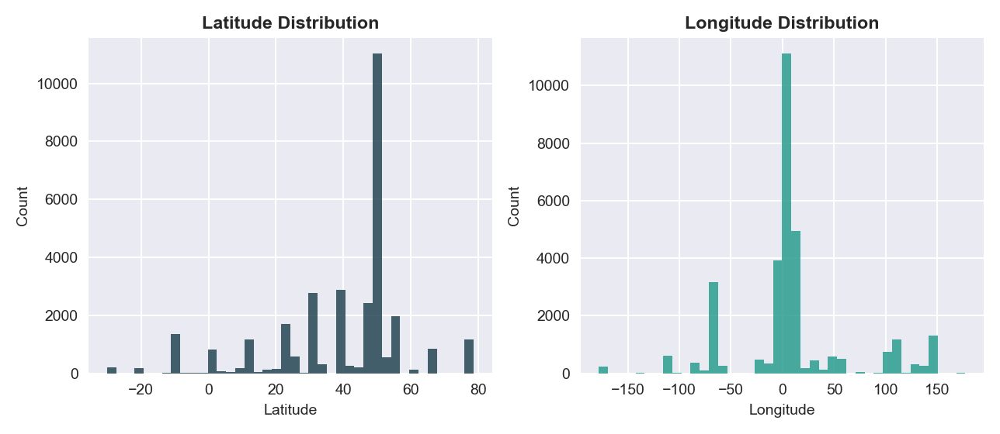
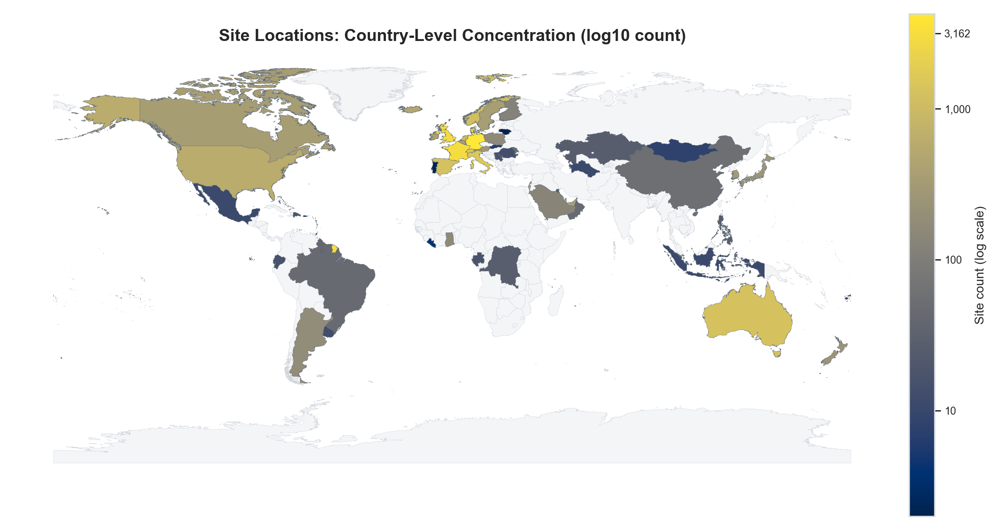
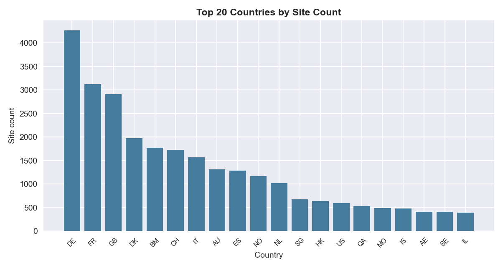

# Segment 1B — Published Report (Realism‑Focused)
Date: 2026-01-30
Run: `runs\local_full_run-5\c25a2675fbfbacd952b13bb594880e92`
Scope: 1B design/implementation context **and** measured output realism, with primary focus on `site_locations`.

---

## 0) Why this report exists
Segment 1B is the geographic realism layer. It takes the merchant/outlet universe from 1A and turns it into real‑world coordinates. This report merges:
1) **Design vs implementation intent** (what 1B is supposed to do and how the implementation decisions shape realism), and
2) **Measured output assessment** from the produced data in `data/layer1/1B`.

The goal is to answer: **How realistic does the spatial output look, and what upstream/policy choices explain the results?**

---

## 1) Design intent (what 1B should represent)
1B is expected to produce a **deterministic but believable spatial world**:
- **Country polygons + ISO codes** ensure valid geography.
- **Tile grids + tile bounds** make placement reproducible.
- **Tile weights policy** controls spatial density (population vs area).
- **Tile assignment + jitter** produce outlet coordinates.
- **Site synthesis → site_locations** is the final consumer‑facing egress.

In plain terms: 1B decides **where each outlet exists** on Earth, balancing deterministic reproducibility with plausible spatial patterns.

---

## 1.5) Priority datasets (by purpose)
If we rank by the purpose of 1B (credible geospatial placement), the importance order is:
1) **site_locations** - final egress; this is the realism surface that everyone consumes.
2) **tile_weights** - density law that determines where sites cluster.
3) **tile_bounds** + **tile_index** - the grid geometry that constrains placement.
4) **s5_site_tile_assignment**, **s6_site_jitter**, **s7_site_synthesis** - intermediate placements that explain how the final points were built.
5) **validation and receipts** - audit surfaces (critical for correctness, not realism).

---

## 2) Implementation decisions that shape realism (from impl_actual)
These implementation choices directly affect the realism that we later observe in the data:

### 2.1 Gate discipline & sealed inputs
- 1A validation bundle is strictly verified before any 1B read (**no PASS → no read**).
- Sealed inputs include: `world_countries`, `population_raster_2025`, `tz_world_2025a`, ISO list, `s2_tile_weights_policy`, `outlet_catalogue`, `s3_candidate_set`.
- **Implication:** If spatial realism looks wrong, the likely cause is **policy or reference input choices**, not pipeline drift.

### 2.2 Policy‑driven density
- The tile‑weight policy can be **area‑based or population‑based**.
- Population raster is sealed, but **may not be used** if the policy basis is area.
- **Implication:** Urban clustering realism depends on policy; a flat distribution is expected when basis = area.

### 2.3 Jitter & RNG constraints
- Jitter events are tightly bounded (fixed RNG budget per event).
- **Implication:** randomness exists but is controlled; results are smooth and reproducible but can look synthetic if tiles are large.

### 2.4 Parity enforcement (S7 → S8 → egress)
- S9 enforces strict parity between synthesis and egress outputs.
- **Implication:** site_locations should be structurally correct; any realism issues are distributional, not missing rows.

### 2.5 Write‑once validation bundles
- Bundles are immutable; reruns require explicit archive.
- **Implication:** results are stable once sealed (good for audit and realism evaluation).

### 2.6 Deterministic identity resolution
- run_receipt selection is stable; fingerprints are cross‑checked.
- **Implication:** no silent lineage drift; spatial output is reproducible for the same run.

---

## 3) Realism‑relevant risks implied by the implementation
These are not bugs; they are **realism stress points** given the chosen mechanics:
1) **Population raster may be unused** if the policy basis is `area_m2`.
2) **Upstream 1A realism propagates** (no single‑site merchants → multi‑site bias).
3) **Timezone realism** depends on tz_world alignment (not visible in site_locations itself).
4) **site_id reuse** from 1A can cause downstream ambiguity if treated as globally unique.
5) **Jitter magnitude** may be too flat if tiles are large.

---

## 4) Output inventory and structural integrity (measured)
**Files present:** `site_locations`, `s7_site_synthesis`, `s6_site_jitter`, `s5_site_tile_assignment`, `tile_index`, `tile_bounds`, `tile_weights`, plus gate/provenance artifacts.

**Row‑count parity across the pipeline:**
- `site_locations` = **31,257**
- `s7_site_synthesis` = **31,257**
- `s6_site_jitter` = **31,257**
- `s5_site_tile_assignment` = **31,257**

**Integrity checks:**
- `(merchant_id, legal_country_iso, site_order)` duplicates: **0%**
- `site_order` contiguous for every merchant‑country: **1.0**
- `site_locations` equals `s7` coordinates exactly (0 mean/max diff)
- `tile_id` matches perfectly between `s5` and `s7` (match rate **1.0**)

**Interpretation:** Pipeline integrity is clean; realism assessment can focus on distributional behavior.

---

## 5) Geographic validity and coverage (site_locations)
**Coordinate ranges:**  
- Latitude: **‑30.11 → 78.63**  
- Longitude: **‑177.96 → 177.08**  
- Out‑of‑range rate: **0.0**  

**What the plot shows (Lat/Lon distributions):**  
The latitude histogram is not smoothly distributed; it is **peaky**, with a **very large spike around the mid‑northern band (~45–55°)** and smaller clusters around ~25–35° and ~0–10°. The southern hemisphere appears **thin and fragmented** (a few smaller bumps around ~‑10 to ~‑30°), indicating weak coverage below the equator. The longitude histogram is also **clustered**, with a **dominant mass around 0–20°** (Europe/Africa longitudes), a strong secondary presence around **~‑80 to ‑60°** (Americas), and another smaller but clear cluster around **~100–150°** (East Asia/Oceania). This is not random noise; it reflects specific regional concentration rather than global uniformity.

**Interpretation:** Coordinates are valid, but the **southern hemisphere is weakly represented** and the longitude distribution is **Europe‑centric**. The visible spikes imply **country‑ or region‑level massing rather than a smooth population‑weighted distribution**, which can look synthetic if the design intent was “globally realistic.”

---

## 6) Country‑level distribution (macro realism)
### 6.1 Country concentration map (choropleth)
The choropleth is the most honest representation for a dataset of ~31k points. It shows **where the sites actually landed by country**, without giving a false sense of spatial density.  

**Interpretation:** The map clearly highlights **Europe + North America + Australia** as the dominant regions. Western/Central Europe is the brightest (highest counts), the US/Canada are strong but not dominant, and Australia is unusually high relative to many larger‑population regions. **Large areas of Africa and South America are white or near‑white**, indicating zero or minimal coverage. If your intended design is “global merchant realism,” this is a **material skew**. If the narrative is “Europe‑centric network with selective global reach,” then it is consistent but should be stated explicitly.

### 6.2 Top‑20 country bar chart

**Interpretation:** The ranking is **overwhelmingly European** (DE, FR, GB, DK, CH, IT, ES, NO, NL, BE). Several **small‑population or niche economies** (BM, MO, QA, IS) appear in the top‑20, which is a red flag if the intent was population‑weighted realism. This pattern is more consistent with **upstream merchant allocation rules** than with real‑world market size. In other words, the distribution looks “designed” rather than “emergent.”

### 6.3 Lorenz curve (country concentration)

**Interpretation:** The curve is **strongly bowed**: the first ~70–80% of countries contribute only a **small fraction** of sites, and the final ~10–20% of countries contribute most of the mass. This is consistent with the top‑20 bar chart and indicates **high geographic concentration**. High concentration is not inherently wrong, but for a global platform story it implies **coverage gaps** that could bias downstream models and use‑cases.

---

## 7) Spatial dispersion / clustering (micro realism)
The nearest‑neighbor distance distribution provides a direct view of clustering at a local scale.  

**Interpretation:** The distribution is **left‑heavy**: most sites have a nearest neighbor within **~0.1–3 km**, which indicates **local clustering** (not random global scatter). However, the tail extends to **10–1000+ km**, implying many **isolated sites or thinly populated countries/regions**. For strong urban realism you would expect an even **tighter concentration under ~1 km** with fewer long‑distance outliers. This suggests the placement is **moderately clustered but not deeply urban‑dense**.

---

## 8) Realism assessment (site_locations)
### Strong realism signals
- All coordinates fall inside valid geographic bounds.
- Local clustering exists (nearest‑neighbor distances are not uniformly large).
- Country‑level distribution is internally consistent with the top‑20 breakdown and Lorenz curve (no contradictions across plots).

### Realism gaps / likely issues
- **Global imbalance:** heavy Europe bias, weak southern‑hemisphere coverage, and visible under‑representation of Africa/South America.
- **Sparse global coverage:** large geographic blanks imply **coverage gaps** that would be noticeable in any “global” story.
- **Synthetic‑looking spikes:** the lat/lon histograms show **distinct peaks** rather than a smooth population‑weighted curve.
- **Local clustering is moderate, not strongly urban‑dense**, suggesting the placement is spatially spread rather than sharply city‑centric.

---

## 9) Realism grade (site_locations)
**Grade: C+ (Limited realism, structurally clean but geographically imbalanced)**  

**Why this grade:**  
The data is internally consistent and shows some real clustering, but the **geographic coverage is heavily skewed** and large world regions are empty. For a platform demo this is acceptable, but for “credible global realism” it falls short without upstream rebalancing.

---

## 10) Realism improvement roadmap (synthetic realism)
This roadmap aims for **credible synthetic realism** without relying on real‑world policy data. The focus is to reduce geographic bias and make site placement feel population‑aware.

1) **Rebalance the regional mix.**  
   The current distribution is heavily Europe‑weighted. Introduce a **target regional mix** (e.g., Europe/Asia/Americas/Africa/Oceania) and sample countries to meet those targets. This prevents obvious continental gaps while staying synthetic.

2) **Stratify within countries by multiple urban centers.**  
   Instead of placing most sites along narrow bands, sample **multiple city clusters** per country (major + secondary cities). This creates a more realistic intra‑country spread and improves timezone diversity downstream (2A).

3) **Add population‑weighted sampling.**  
   Use HRSL or city population proxies to weight site placement. This reduces “spiky” lat/lon histograms and produces smoother, more believable urban density.

4) **Introduce controlled rural tails.**  
   Realistic geography has urban concentration **plus** a sparse rural tail. Inject a small percentage of low‑density sites away from city centers so the nearest‑neighbor distribution looks more natural.

5) **Increase southern‑hemisphere and Africa coverage.**  
   Even in synthetic mode, global realism expects visible representation. Add explicit quotas or weighting for under‑represented regions to avoid empty map zones.

**Expected impact:**  
Implementing steps 1–3 should move 1B toward **B‑/B** for synthetic realism by fixing the most visible coverage biases while preserving structural correctness.
