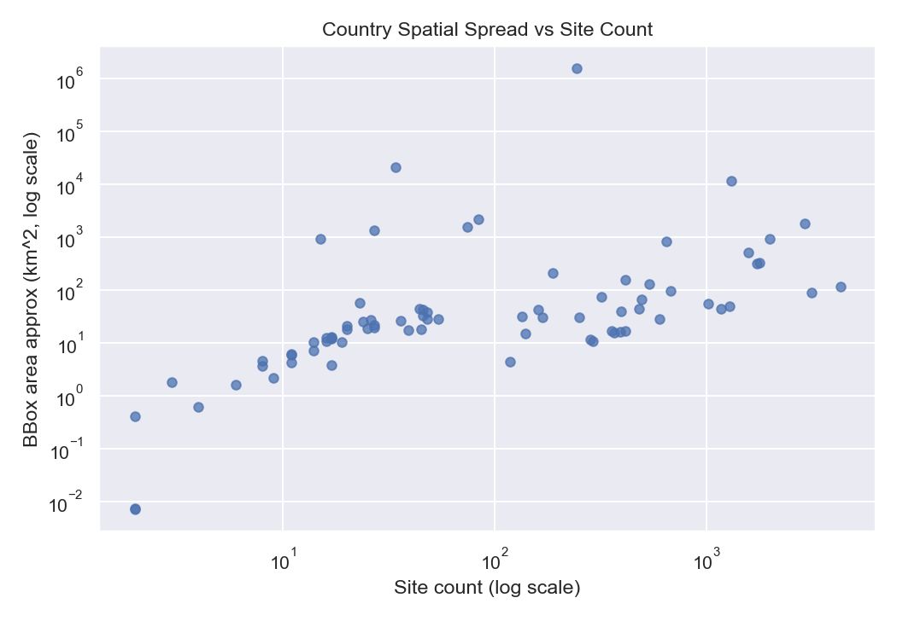
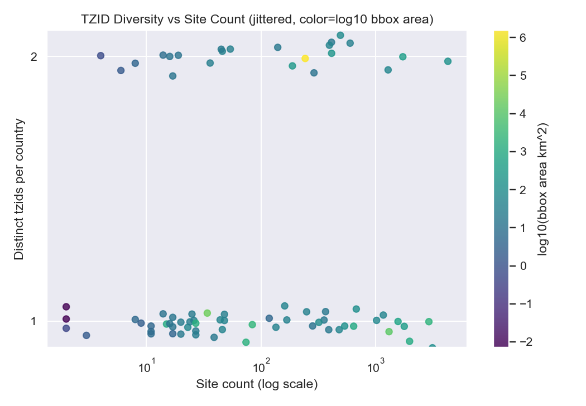
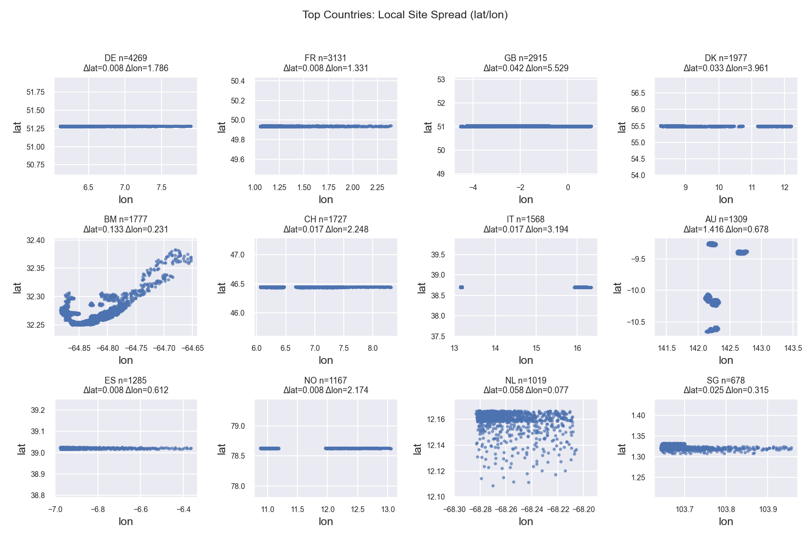
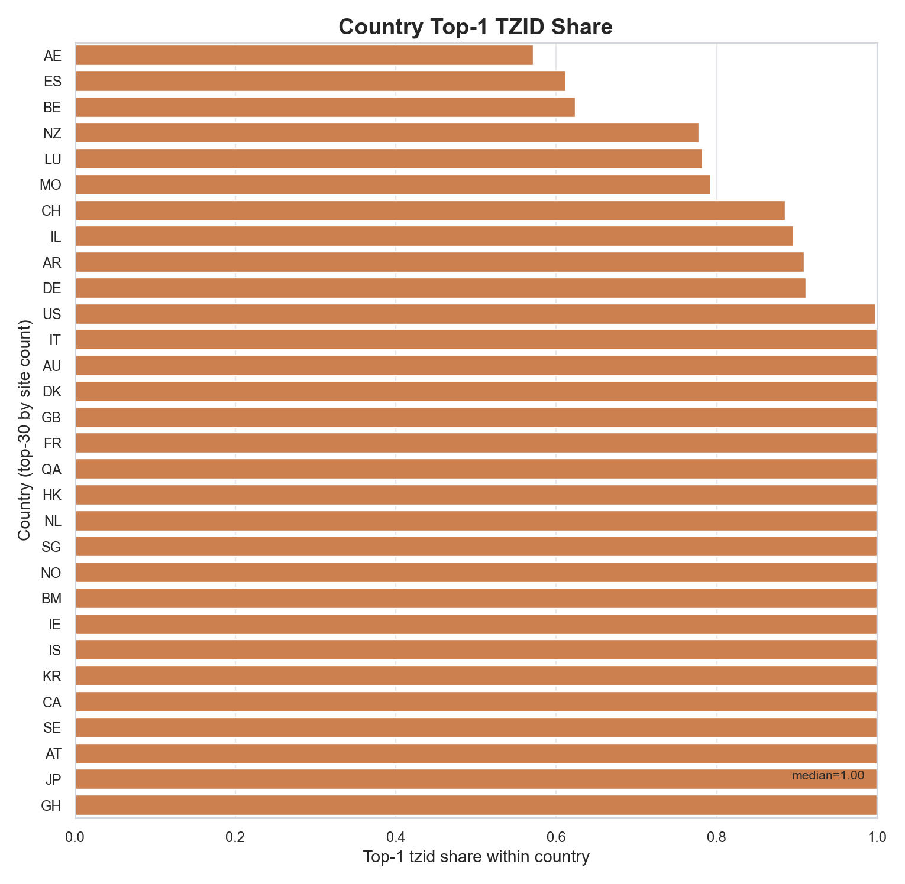

# Segment 2A — Design vs Implementation Observations (Civil Time)
Date: 2026-01-30
Scope: Design intent vs implementation notes for Segment 2A (S0–S5) before dataset assessment.

---

## 0) Why this report exists
Segment 2A is the **civil‑time assignment layer**. It takes site coordinates from 1B and produces per‑site time zones plus a validation gate. This report records what the design expects **and what the implementation actually does**, including deviations, strictness decisions, and any risks those choices introduce. This is meant to guide the upcoming realism assessment of 2A outputs.

---

## 1) Design intent (what 2A should do)
At a high level, 2A is a deterministic pipeline:

1) **S0 — Gate & sealed inputs**
   - Verify 1B PASS gate (“No PASS → No Read”).
   - Seal all required 2A inputs (site_locations, tz_world, tzdb_release, overrides, nudge policy, etc.).
   - Emit a fingerprint‑scoped receipt + sealed‑inputs inventory.

2) **S1 — Provisional TZ lookup**
   - Map each site’s lat/lon to a provisional tzid using tz_world polygons.
   - Apply a deterministic ε‑nudge at boundaries; record nudge fields.
   - Only consult tz_overrides for post‑nudge ambiguity (site > mcc > country).

3) **S2 — Overrides & finalisation**
   - Apply overrides when S1 says “override_applied=true”.
   - Enforce strict provenance + tzid membership and emit final `site_timezones`.

4) **S3 — Timetable cache**
   - Compile tzdb into a manifest_fingerprint‑scoped cache for downstream legality checks.

5) **S4 — Legality report**
   - Use the cache to compute DST gap/fold windows per tzid and emit a report.

6) **S5 — Validation bundle + PASS flag**
   - Bundle S3 + S4 evidence and write `_passed.flag` as the consumer gate for 2A egress.

---

## 2) Expected outputs & evidence surfaces (contract view)
Key datasets produced by 2A (from the contracts):
- `s0_gate_receipt_2A`, `sealed_inputs_2A` (S0)
- `s1_tz_lookup` (S1, plan)
- `site_timezones` (S2, egress)
- `tz_timetable_cache` (S3, cache)
- `s4_legality_report` (S4, validation evidence)
- `validation_bundle_2A` + `index.json` + `_passed.flag` (S5 gate)

These are the surfaces we will evaluate when we assess realism and correctness in later steps.

---

## 2.1) Priority datasets (by purpose)
If we rank by the purpose of 2A (assigning civil time to sites), the importance order is:
1) **site_timezones** - final egress; this is the realism surface for timezone assignment.
2) **s1_tz_lookup** - provisional mapping that reveals boundary and ambiguity behavior.
3) **tz_timetable_cache** - required for legality checks and downstream time handling.
4) **s4_legality_report** - validation evidence for DST gaps/folds.
5) **validation bundle + receipts** - audit surfaces (critical for correctness, not realism).

---

## 3) Implementation observations (what is actually done)

### 3.1 S0 — Gate & sealed inputs
**Observed posture:** S0 is fully implemented and extremely strict about gates, sealing, and determinism.

Key observations:
- **PASS verification is enforced before any read** of 1B egress. The `_passed.flag` hash is recomputed from the bundle index in ASCII‑lex order and must match exactly.
- **Run identity is hard‑fixed** from `run_receipt.json`. If `parameter_hash` or `manifest_fingerprint` is missing, S0 hard‑fails. No CLI fallback.
- **Sealed inputs are minimal by design.** `iso3166_canonical_2024` and `world_countries` are omitted unless explicitly required downstream.
- **tzdb_release resolution is deterministic.** If `{release_tag}` is unresolved, S0 scans `artefacts/priors/tzdata/` for exactly one valid release folder. Multiple candidates or no candidate aborts.
- **Schema validation issues were fixed by local $ref rewriting.** External refs in schema packs are rewritten into local `$defs` to avoid runtime resolver failures.
- **tz_world validity enforced** (CRS=WGS84, non‑empty geometry set).
- **Overrides now require tzid membership enforcement.** tzids are derived from tz_world; any override tzid not in tz_world is a hard failure.
- **Stricter failure when overrides exist but tzid index can’t be derived.** If overrides are non‑empty and tzid index cannot be built, S0 aborts (fail‑closed).
- **Deterministic timestamps:** S0 uses `run_receipt.created_utc` for `verified_at_utc` and sealed input rows to allow byte‑identical reruns.
- **Determinism receipt + run-report** are emitted; these are not identity‑bearing but record audit state.

Net result: S0 is **strict, deterministic, and gate‑heavy**, matching the spec’s contract posture and “No PASS → No Read” law.

---

### 3.2 S1 — Provisional TZ lookup
**Observed posture:** Implemented, but with **a deliberate spec deviation** to avoid run aborts.

Key observations:
- **Base logic matches spec:** point‑in‑polygon tzid assignment with ε‑nudge; override fallback only for post‑nudge ambiguity.
- **Inputs expanded in spec + implementation:** `tz_overrides` + optional `merchant_mcc_map` are explicitly consumed for ambiguity fallback.
- **Spec deviation introduced:** When post‑nudge ambiguity still remains and no override applies, S1 **no longer aborts**. Instead:
  - It picks the **nearest tz_world polygon in the same country ISO**.
  - If the nearest polygon is beyond the epsilon‑derived threshold, it still selects it to preserve 1:1 coverage but logs a WARN and records the event in the run‑report.
- **Output schema unchanged** (still `columns_strict`), and provenance remains `tzid_provisional_source="polygon"` with `override_applied=false` to avoid breaking S2.
- **Diagnostics improved**: candidate tzids for unresolved ambiguities are included in error payloads and run‑report samples.

Impact:
- This is a **controlled deviation** from fail‑closed behavior. It prevents pipeline aborts but may hide genuine geographic boundary issues unless carefully reviewed in the report diagnostics.

---

### 3.3 S2 — Overrides & finalisation
**Observed posture:** Implemented and strict, aligned with the spec.

Key observations:
- **Override precedence and expiry enforcement** follow the spec (site > mcc > country; active by S0 receipt date).
- **Strict MCC gating**: if MCC overrides are active and no `merchant_mcc_map` is sealed, S2 aborts.
- **tzid membership is enforced** against tz_world; any unknown tzid aborts.
- **`override_no_effect` is fatal** if an override applies but does not change the tzid (spec‑aligned).
- **created_utc is deterministic** and forced to S0 receipt time.

Known friction:
- A country‑level override that matches the provisional tzid will **always abort** (`2A‑S2‑055`). The implementation calls this out and requires a policy fix or a design change; no silent relaxation is applied.

---

### 3.4 S3 — Timetable cache
**Observed posture:** Implemented with deterministic compilation rules.

Key observations:
- **Cache is manifest_fingerprint‑scoped** and derived strictly from sealed tzdb_release.
- **Canonicalisation + digest** are enforced to keep `tz_index_digest` stable.
- **Deterministic created_utc** is tied to S0 receipt (no wall‑clock).
- **Spec update applied** (sentinel exception for offset bounds) to align compilation edge cases with validators.

---

### 3.5 S4 — Legality report
**Observed posture:** Implemented as a strict validation evidence report.

Key observations:
- Reads `site_timezones` + `tz_timetable_cache` and emits aggregate counts only.
- Does **not** mutate or override tzids; the report is strictly evidence.
- Uses S0 receipt time for deterministic timestamps.

---

### 3.6 S5 — Validation bundle + PASS flag
**Observed posture:** Implemented; enforces seed discovery and evidence completeness.

Key observations:
- Discovers **all seeds** with `site_timezones` under the manifest_fingerprint.
- Requires a **PASS legality report per seed**; otherwise aborts.
- Builds the bundle index and `_passed.flag` using the ASCII‑lex raw‑bytes law.
- Emits a manifest_fingerprint‑scoped validation gate for downstream consumers.

---

## 4) Deviations & risk notes
1) **S1 ambiguity fallback (spec deviation):** runs no longer fail on unresolved boundary ambiguity; nearest‑polygon fallback is used instead. This is deterministic but can be geographically inaccurate when the nearest polygon is outside the nudge threshold. The run‑report diagnostics are now critical evidence and should be reviewed.

2) **Strict override_no_effect in S2:** country‑level overrides can cause aborts if they match provisional tzids. This makes policy authoring brittle; policy needs to be precise or the spec posture should be revisited.

3) **tzid membership enforcement moved into S0 (strict):** overrides now fail closed if tzid index can’t be derived. This tightens correctness but will block runs if tz_world tzid extraction fails.

---

## 5) Implications for upcoming data assessment
When we assess Segment 2A outputs, we will pay special attention to:
- Evidence of S1 fallback usage (run‑report diagnostics).
- Distribution of `tzid_source` vs `override_scope` in `site_timezones`.
- Whether overrides are narrow enough to avoid `override_no_effect` failures.
- Coverage of tzids vs tz_world and cache consistency.

---

(Next: detailed assessment of the actual 2A outputs under your run folder.)

---

# Segment 2A — Output Assessment (Run: local_full_run‑5)
Run: `runs\local_full_run-5\c25a2675fbfbacd952b13bb594880e92`  
Partition: `seed=42`, `manifest_fingerprint=c8fd43cd60ce0ede0c63d2ceb4610f167c9b107e1d59b9b8c7d7b8d0028b05c8`

This section assesses **actual 2A outputs** with realism focus, grounded in the run data above. The key dataset is **`site_timezones`**, with supporting evidence from `s1_tz_lookup`, `s4_legality_report`, and `tz_timetable_cache`.

---

## 6) Output inventory & structural integrity (measured)
**Files present (2A):**  
`s0_gate_receipt`, `sealed_inputs`, `s1_tz_lookup`, `site_timezones`, `tz_timetable_cache`, `legality_report`, `validation` (bundle + _passed.flag)

**Row counts (all partitions consistent):**
- `s1_tz_lookup` = **31,257**
- `site_timezones` = **31,257**
- `site_locations` (1B egress, join key) = **31,257**

**Key integrity checks:**
- PK duplicates (`merchant_id`, `legal_country_iso`, `site_order`): **0** in all three datasets.
- Coverage:  
  - `site_locations → s1_tz_lookup`: **0 missing / 0 extra**  
  - `s1_tz_lookup → site_timezones`: **0 missing / 0 extra**
- Join with 1B `site_locations`: **0 missing geo rows** (all sites carried through).

**Interpretation:**  
The 2A pipeline **preserves 1:1 row coverage** and maintains primary‑key integrity. This makes the dataset structurally clean; realism issues are therefore distributional, not structural.

---

## 7) Sealed inputs & gate posture (S0 evidence)
**S0 gate receipt shows the following sealed inputs (minimal manifest):**
- 1B gate evidence: `validation_bundle_1B`, `_passed.flag`
- 1B egress: `site_locations`
- 2A policies: `tz_overrides`, `tz_nudge`
- 2A ingress: `tz_world_2025a`, `tzdb_release (2025a)`

**Not sealed:** `iso3166_canonical_2024`, `world_countries`, `merchant_mcc_map` (not referenced in this run’s sealed inputs).  

---

## 8) Primary dataset — `site_timezones` (provenance + override behavior)
**Row count:** 31,257 (matches `s1_tz_lookup` and `site_locations` exactly).  
**Distinct tzids:** **90**.

**Provenance distribution:**
- `tzid_source = polygon`: **31,254**
- `tzid_source = override`: **3**
- Override scope: **country = 3**, `site`/`mcc` = 0

**Override usage details:**
- All overrides applied to **RS (Serbia)** with `tzid = Europe/Belgrade` (3 rows).
- `s1_tz_lookup.override_applied`: **True = 3**, **False = 31,254**
- `site_timezones` tzid vs `s1_tz_lookup` tzid: **0 changed rows**, **31,257 unchanged**  
  → Interpretation: overrides were already applied in S1 (ambiguity fallback), and S2 formalized provenance.

**Nudge usage (boundary resolution):**
- Nudge used on **6 rows** (~0.019%).  
- Countries affected: **RS** (5 rows: override + polygon) and **MN** (1 row).  
- Interpretation: border ambiguity is **rare** in this run; most sites are far from polygon edges.

**Interpretation:**  
`site_timezones` is structurally clean and provenance‑consistent. Overrides and nudges are minimal, so the output is almost entirely polygon‑driven. This means **realism is dominated by the spatial realism of 1B** (`site_locations`), not by override policy or tzdb artifacts.

---

## 9) Timezone distribution (global concentration)
Top tzids by site count (global):  
`Europe/Paris` (3,945), `Europe/Berlin` (3,892), `Europe/London` (2,915), `Europe/Copenhagen` (1,977),  
`Atlantic/Bermuda` (1,777), `Europe/Rome` (1,568), `Europe/Zurich` (1,530),  
`Australia/Brisbane` (1,309), `Arctic/Longyearbyen` (1,167), `America/Kralendijk` (1,019).

**Interpretation:**  
The timezone distribution mirrors the **Europe‑heavy** country distribution from 1B. The presence of **Arctic/Longyearbyen** and **America/Kralendijk** among the most frequent tzids is a realism red flag unless the dataset is intentionally skewed toward polar or Caribbean territories.

---

## 10) Country‑level realism cross‑check (tzid vs coordinates)
Joining `site_timezones` to 1B `site_locations` reveals **extremely tight geographic clustering per country**, often around a single coordinate band. This is critical: the tzids are correct for those coordinates, but those coordinates are not representative of the full country.

**Examples (top countries by site count):**
- **NL (1,019 sites):** all points at ~**lat 12.11**, **lon ‑68.24** → tzid **America/Kralendijk** (Caribbean Netherlands).  
  *Realism concern:* Netherlands mainland should yield `Europe/Amsterdam`, but all sites are placed in Caribbean NL.
- **NO (1,167 sites):** all points at ~**lat 78.63**, **lon 10.9–13.1** → tzid **Arctic/Longyearbyen**.  
  *Realism concern:* mainland Norway would map to `Europe/Oslo`, but all sites are at Svalbard latitude.
- **CN (54 sites):** all points at ~**lat 25.60**, **lon 98.14–98.46** → tzids **Asia/Yangon** (38) and **Asia/Shanghai** (16).  
  *Realism concern:* China is assigned a Myanmar‑adjacent location; tzid mix is inconsistent with the typical China‑wide timezone use.
- **BR (46 sites):** all points at ~**lat 1.72**, **lon ‑69.45–‑69.77** → tzids **America/Manaus** (39) and **America/Bogota** (7).  
  *Realism concern:* Brazil’s sites are concentrated near the Colombia/Venezuela border; the Bogota timezone indicates cross‑border placement.
- **US (599 sites):** tzids **America/Phoenix (598)** and **America/Hermosillo (1)** only.  
  *Realism concern:* US should span multiple tzids; here it collapses to a single regional timezone.

**General pattern:**  
For many countries, **lat/lon ranges are only a few hundred meters wide** (near‑single‑point clusters). This indicates 1B generated site locations per country using a **single tile or tiny band**, which 2A then faithfully maps to a single timezone.

**Interpretation:**  
2A is **geographically consistent** with the coordinates it receives, but the resulting timezone realism is poor for a “global merchant” narrative because **country coverage is spatially collapsed**. This is primarily a **1B realism issue surfaced by 2A**, not a 2A logic bug.

---

## 11) Legality evidence & cache integrity
**S4 legality report:**  
- Status: **PASS**  
- `sites_total`: **31,257**  
- `tzids_total`: **90**  
- `gap_windows_total`: **2,804**  
- `fold_windows_total`: **2,748**

**S3 cache manifest:**  
- `tzdb_release_tag`: **2025a**  
- `tzdb_archive_sha256`: **4d5fcbc7…**  
- `tz_index_digest`: **ab22a7f4…**  
- `rle_cache_bytes`: **440,879**  
- `created_utc` equals S0 `verified_at_utc` (deterministic)

**Interpretation:**  
Validation evidence is present and consistent with the design. There are no missing tzids, and legality checks passed. The correctness of civil‑time legality is not the limiting realism factor here.

---

## 12) Realism grade (site_timezones)
**Grade: C (structurally correct, but geographically unrealistic)**  

**Why this grade:**  
The dataset is internally coherent and correctly gated, but the **spatial collapse of site locations per country** produces **non‑representative timezone allocations**. The output is “correct for the given coordinates,” yet **not realistic for national‑scale distributions** (e.g., NL → Caribbean tzid, NO → Svalbard tzid, US → only Phoenix). For a portfolio‑grade fraud platform, this weakens realism unless the design explicitly calls for these geographic concentrations.

If we want realism to improve at the 2A layer, the real fix is upstream: broaden the spatial spread of `site_locations` inside each country in 1B.

**Areas for improvement (priority order):**
1) **Broaden spatial spread within countries in 1B.**  
   2A is correct given its inputs; the fix is to generate **multi‑city / multi‑region** points per country rather than single‑tile bands.
2) **Introduce stratified geo sampling.**  
   Sample multiple administrative regions or city clusters per country to create realistic tzid diversity.
3) **Audit extreme country‑tzid pairings.**  
   NL, NO, CN, BR, US show unrealistic tzid outcomes; add overrides or adjust upstream allocations to ensure mainland‑representative placement.
4) **Surface fallback usage explicitly.**  
   Keep tracking S1 fallback (nearest polygon) in run‑reports so downstream can see when 2A is compensating for upstream data collapse.

---

## 13) Realism improvement roadmap (synthetic realism)
This roadmap assumes we are targeting **credible synthetic realism** without real policy data. For 2A, most realism gains are **upstream** (1B), but there are still levers here.

1) **Expand intra‑country spatial diversity (primary lever).**  
   2A can only assign tzids based on site locations. If 1B places sites in multiple cities/regions per country, 2A will naturally generate realistic multi‑tz distributions (e.g., US, AU, BR).

2) **Stratify sampling by administrative regions.**  
   Use province/state buckets to ensure coverage across multiple regions rather than a single “representative” point. This avoids single‑tz collapse in large countries.

3) **Introduce geography‑aware overrides only where needed.**  
   Keep the deterministic approach, but add **surgical overrides** when a country’s sampled points repeatedly fall into remote/outlier tzids (e.g., Svalbard for NO).

4) **Make fallback usage visible and bounded.**  
   When polygon lookups fail, fallbacks should be **tracked and capped**, so downstream knows if tzids were assigned by “nearest polygon” rather than direct containment.

**Expected impact:**  
If 1B is improved to provide richer site placement, 2A should move from **C → B** quickly, because its logic is already correct. The realism weakness is primarily a *location diversity* problem, not a timezone assignment problem.

---

## 14) Visual diagnostics (core realism lens)
Below are the refreshed core plots plus added diagnostics. The goal is to expose **where realism breaks** (and why), not just show row counts.

### 13.1 Country spatial spread vs site count

**Assessment:**  
This plot is **clear and informative**. It compares the **number of sites per country** (x, log scale) against an **approximate bounding‑box area** of those sites (y, log scale). If the dataset were geographically realistic, countries with many sites would typically show larger spatial spread. Instead, many countries with large site counts cluster at **very small bbox areas**, showing that sites are concentrated in extremely tight lat/lon bands. The few high‑area outliers indicate only a small number of countries have meaningful spatial spread. This is a direct signal that the **spatial realism is collapsed per country**, and 2A is faithfully mapping those collapsed points to single time zones.

### 13.2 TZID diversity vs site count (jittered)

**Assessment:**  
This refreshed plot keeps integer y semantics explicit (distinct tzids are still 1 or 2 in this run) while using light jitter only for visibility. It shows that countries with large site counts still mostly sit on the `1` band, with fewer on the `2` band.  
The color channel (`log10 bbox area`) helps explain why: small-area countries cluster on `1`, while countries with broader spread are more likely to reach `2` tzids.  
This supports the core conclusion that timezone realism is constrained by **spatial collapse upstream**, not by 2A assignment mechanics.

### 13.3 Country small‑multiples (local lat/lon spread)

**Assessment:**  
This is the **most revealing plot**. Each subplot shows the local lat/lon spread for top‑count countries. Most countries collapse into **near‑flat horizontal bands**, often with **Δlat < 0.05°** (a few km). A realistic dataset would show broader scatter across each country’s geography. Instead, the spread is extremely tight, explaining why many countries resolve to a single timezone. This plot directly visualizes the **single‑tile / single‑band artifact** that drives the realism gaps in 2A outputs.

### 13.4 Country × TZID heatmap (top countries / top tzids)

**Assessment:**  
This refreshed matrix is now **row-normalized share** (not raw counts), which makes dominance directly interpretable. Most country rows are nearly one-hot: one tzid captures almost all mass.  
The `OTHER` column reveals countries whose secondary mass does not fall into the top global tzid set, but even there top-1 dominance remains high.  
This matrix is the clearest evidence that the dataset’s timezone assignment has low within-country diversity, consistent with the `tzid_count` result (54 countries at exactly one tzid).

### 13.5 Country top-1 TZID share

**Assessment:**  
This plot quantifies the dominance seen in the matrix. The median top-1 share is ~1.00, meaning at least half of countries are effectively single-timezone in assigned sites.  
Only a small tail of countries has materially lower top-1 share. This is a direct realism risk because national traffic normally has broader timezone mixing in larger geographies.

### 13.6 TZID entropy vs site count

**Assessment:**  
Normalized entropy is 0 for many countries across a wide site-count range, showing that additional sites do not reliably increase timezone diversity.  
The non-zero entropy points exist but are sparse; this indicates diversity is present only in a subset of countries, not as a general scaling behavior.

### 13.7 Country TZID dominance gap (top-1 minus top-2)

**Assessment:**  
This plot measures concentration strength even when two tzids exist. Many countries still have a large top1-top2 gap, and countries with a single tzid collapse to gap=1.  
Together with top-1 share, this confirms that the issue is not just “low tzid count”; it is also strong imbalance where a second tzid exists.

### 13.8 Country tzid-count diagnostics

**Assessment:**  
The histogram/ECDF pair gives the fastest global summary: 54/77 countries (about 70%) have exactly 1 tzid and the remaining 23 have 2.  
This is a highly compressed support for a global synthetic dataset and explains why most other visuals show one-timezone dominance.

---

## 15) Visual takeaway (realism lens)
Across the refreshed and added plots, the consistent pattern is: **high site counts with limited spatial spread -> low tzid support and strong top-1 timezone dominance**.  
The 2A outputs remain internally coherent (assignment logic works), but the assigned timezone diversity is too compressed for stronger realism.  
The fix remains upstream: broaden 1B spatial spread and multi-city sampling so 2A can map sites into richer, country-appropriate timezone mixtures.
