# Segment 2B — Design vs Implementation Observations (Routing: Sites + Virtual Edges)
Date: 2026-01-31
Scope: Design intent vs implementation notes for Segment 2B (S0–S8), plus what to look for in 2B datasets before assessment.

---

## 0) Why this report exists
Segment 2B is the **routing realism layer**. It turns merchant/site geography (1B + 2A) into **probabilistic routing surfaces** for physical sites, plus a **virtual-edge routing branch** for virtual merchants. It also produces the audit/validation evidence that the rest of the platform consumes. This report captures **what the design specifies**, **what the implementation actually does**, and **what signals we should look for** in the 2B datasets when assessing realism and correctness.

---

## 1) Design intent (what 2B should do)
High-level intent across states:

1) **S0 — Gate + sealed inputs**
   - Verify upstream 1B PASS bundle (No PASS → No read).
   - Seal required inputs: `site_locations` (1B), `site_timezones` (2A), plus 2B policy packs.
   - Emit `s0_gate_receipt_2B` and `sealed_inputs_2B` under manifest_fingerprint.

2) **S1 — Site weights**
   - Build a **per‑site weight law** for each merchant (RNG‑free).
   - Output `s1_site_weights` with normalized weights and provenance.

3) **S2 — Alias encoding**
   - Encode `s1_site_weights` into alias tables for O(1) sampling.
   - Output `s2_alias_index` + `s2_alias_blob` with strict header ↔ policy echo and blob checksum.

4) **S3 — Day effects**
   - Generate per‑merchant × UTC‑day × tz‑group **gamma multipliers** (RNG‑bounded).
   - Output `s3_day_effects` with strict day grid from policy.

5) **S4 — Group weights**
   - Combine base site weights with day effects to produce per‑merchant/day **tz‑group mix**.
   - Output `s4_group_weights` where Σ p_group = 1.

6) **S5 — Router core (group → site)**
   - For each arrival: pick tz‑group (Stage A) then site within group (Stage B).
   - Two single‑uniform RNG draws per arrival; strict RNG envelope logs.
   - S5 produces **no mandatory egress**; only logs (optional `s5_selection_log`).

7) **S6 — Virtual merchant edge routing**
   - If `is_virtual=1`, pick a **virtual edge** from `virtual_edge_policy_v1`.
   - Exactly one draw per virtual arrival; attach edge metadata.
   - Optional `s6_edge_log`; run‑scoped RNG evidence.

8) **S7 — Audit & CI gate**
   - RNG‑free audit of S2/S3/S4 + policy echo; optional S5/S6 log reconciliation.
   - Emit `s7_audit_report` at `[seed, manifest_fingerprint]`.

9) **S8 — Validation bundle + _passed.flag**
   - Package S7 PASS evidence per seed; compute index + `_passed.flag`.
   - Emit manifest_fingerprint‑scoped validation bundle as consumer gate.

---

## 2) Expected datasets & evidence surfaces (contract view)
Core datasets to assess later:

**Gate + sealing**
- `s0_gate_receipt_2B`, `sealed_inputs_2B`

**Routing surfaces**
- `s1_site_weights`
- `s2_alias_index`, `s2_alias_blob`
- `s3_day_effects`
- `s4_group_weights`

**Routing diagnostics (optional / run‑scoped)**
- `s5_selection_log`
- `s6_edge_log`
- `rng_audit_log`, `rng_trace_log`
- `rng_event_alias_pick_group`, `rng_event_alias_pick_site`, `rng_event_cdn_edge_pick`

**Audit + gate**
- `s7_audit_report`
- `validation_bundle_2B` + `index.json` + `_passed.flag`

These are the surfaces we will use to evaluate realism and coherence.

---

## 2.1) Priority datasets (by purpose)
If we rank by the purpose of 2B (routing realism), the importance order is:
1) **s1_site_weights** - baseline spatial realism driver.
2) **s4_group_weights** - actual per-day routing mix.
3) **s3_day_effects** - temporal realism driver.
4) **s2_alias_index + s2_alias_blob** - structural routing surface (correctness more than realism).
5) **s5/s6 logs + audit/bundle evidence** - audit surfaces (correctness and traceability).

---

## 3) Implementation observations (what is actually done)

### 3.1 S0 — Gate + sealed inputs
**Observed posture:** Strict, deterministic, and consistent with other segments.

Key implementation traits:
- **Upstream 1B gate is enforced before any 1B read**, with index‑based hash recomputation (ASCII‑lex order) to match bundle law.
- **Sealed inputs are explicit**: `site_locations`, `site_timezones`, 2B policy packs, and 1B gate artefacts; optional `tz_timetable_cache` is warn‑only.
- **Schema validation tightened** by inlining external `$defs` for layer1, preventing resolver failures.
- **Policy versions aligned to semver** and schema enforcement added (policy_version pattern).
- **Flag parsing hardened** to tolerate whitespace / minor formatting while still validating hash equality.
- **Immutability enforced**: any re‑emit must be byte‑identical or abort.

Net: S0 is production‑grade and gate‑strict; most adjustments were robustness fixes rather than scope changes.

---

### 3.2 S1 — Site weights
**Observed posture:** Implemented as RNG‑free weighting, used as the canonical source for alias construction.

Implementation notes from the map indicate:
- Weights are normalized per merchant; provenance columns track `weight_source`, quantised bits, and floor behavior.
- Writer order and partitioning strictly match schema (`merchant_id`, `legal_country_iso`, `site_order` under `[seed, manifest_fingerprint]`).

Expectations: if weights are realistic, they should reflect plausible merchant‑site footprints rather than uniform or single‑site spikes.

---

### 3.3 S2 — Alias index + blob
**Observed posture:** Implemented with strict parity checks and enforced layout echo.

Key points:
- Index header must match `alias_layout_policy_v1` (endianness, alignment, quantised_bits, layout_version).
- Blob SHA‑256 is verified; alias slice offsets are enforced.
- Any parity mismatch is a hard fail in audits.

---

### 3.4 S3 — Day effects
**Observed posture:** RNG‑bounded and policy‑driven (day grid from `day_effect_policy_v1`).

Important implementation history:
- The day_range **must match downstream horizons** (5B). Policy was updated to align the day range with 2026; S0 must be re‑run when policy digests change.
- S3 outputs carry counters (`rng_counter_hi/lo`) to support audit traces.

Risk note: if the policy day range diverges from arrivals, S4 will have missing group weights and S5 will fail with missing days.

---

### 3.5 S4 — Group weights
**Observed posture:** Deterministic mix per merchant/day/tz_group; Σ p_group = 1 enforced in audits.

Implementation implications:
- S4 depends on `site_timezones` (tz groups) + S3 gamma + base shares.
- Any mismatch between day grids and arrival roster triggers S5 failures.

---

### 3.6 S5 — Router core (group → site)
**Observed posture:** Implemented as two‑stage O(1) routing with strict RNG accounting.

Key mechanics:
- **Two draws per arrival** (alias_pick_group, alias_pick_site).
- **Group pick uses S4**, then **site pick uses S1 filtered by site_timezones** (Option‑A path).
- S2 alias artefacts are integrity‑checked but not directly used for group‑slice decoding in v1.
- Optional `s5_selection_log` is run‑scoped and arrival‑ordered when enabled.

---

### 3.7 S6 — Virtual edge routing
**Observed posture:** Implemented as a branch for `is_virtual=1` only, with one draw per virtual arrival.

Key mechanics:
- Uses `virtual_edge_policy_v1` (token‑less, S0‑sealed).
- Optional `s6_edge_log` run‑scoped; no manifest_fingerprint‑scoped egress.

---

### 3.8 S7 — Audit & CI gate
**Observed posture:** Implemented as RNG‑free audit with strict validator mapping.

Notable implementation decision:
- **S7 does NOT require S2/S3/S4 outputs to be in `sealed_inputs_2B`** (those are within‑segment outputs). It resolves them directly at `[seed, manifest_fingerprint]` per Dictionary. This prevents false failures from sealed‑inputs under‑coverage.

Expectations:
- S7 checks alias parity, Σ p_group = 1, gamma echo, day grid equality, and (if logs exist) RNG budget reconciliation.

---

### 3.9 S8 — Validation bundle
**Observed posture:** Implemented, but with a **documented deviation**.

Deviation:
- **Index‑only bundle** (no copying of evidence). `index.json` entries are **run‑root‑relative** paths; `_passed.flag` hashes those source bytes.
- This **deviates from spec**, which expects index paths relative to the bundle root with evidence files inside the bundle. The deviation is explicit and accepted to match index‑only behavior used elsewhere.

Implication for platform:
- Any gate verifier must use the **index‑driven hash law with run_root base** (not bundle root). This has already been wired into the interface pack elsewhere.

---

## 4) Design vs implementation deltas (summary)
1) **S8 index‑only bundle**: Spec expects bundle‑local evidence; implementation uses run‑root paths and minimal bundle contents. This is a deliberate deviation and must be honored by gate verification.
2) **S7 sealed‑inputs posture**: S7 does not require S2/S3/S4 in `sealed_inputs_2B`, aligning with the S0‑evidence rule (within‑segment outputs aren’t S0‑sealed). This is a sensible correction and avoids false audit failures.
3) **Day‑range alignment**: The policy day_range was updated to match downstream horizons; runs must reseal S0 when policy digests change to avoid mismatches.
4) **Roster day alignment**: Arrival roster normalization now derives `utc_day` from policy start_day by default to avoid group‑weight gaps.

These deltas matter because they directly affect whether datasets align with the design intent and whether gates are verified correctly in the platform.

---

## 5) What to look for in 2B datasets (realism + correctness)
This section is the **forward‑looking checklist** for when we assess the actual 2B outputs. It is focused on realism, not just structural validity.

**Realism focus priority (where the analytical energy goes):**
1) **`s1_site_weights`** — baseline spatial realism (if this collapses, everything downstream collapses).
2) **`s4_group_weights`** — actual routing mix realism across tz‑groups and days.
3) **`s3_day_effects`** — temporal realism driver (day‑level modulation).
All other datasets are **structural / compliance** surfaces (alias blobs, audit logs, bundle gates) and should be validated, but they are not the primary realism signals.

### 5.1 `s1_site_weights` (realism baseline)
**What to inspect:**
- **Weight concentration per merchant**: Are weights overly concentrated on a single site, or do they show realistic distribution across multiple sites?
- **Country/site diversity**: Do merchants with multi‑country footprints have meaningful weights across those countries?
- **Weight sources**: Confirm `weight_source` aligns with design choices (not placeholder or static defaults).

**Red flags:**
- Most merchants have exactly one site with p_weight ~1.0.
- Global distribution mirrors the 1B single‑tile artifact (weights assigned to one coordinate cluster per country).

---

### 5.2 `s2_alias_index` + `s2_alias_blob` (alias integrity)
**What to inspect:**
- **Header parity** with `alias_layout_policy_v1` (endianness, alignment, quantised_bits).
- **Blob digest** matches `blob_sha256` in the index.
- **Merchant slice sizes** correlate with the number of sites per merchant (no zero‑length slices).

**Red flags:**
- Any parity mismatch or missing merchants in the index.
- Large discrepancies between site counts and alias slice sizes.

---

### 5.3 `s3_day_effects` (temporal realism)
**What to inspect:**
- **Day grid matches policy** (`day_effect_policy_v1` start/end).
- **Gamma distribution**: Does log‑gamma look plausible (log‑normal spread)?
- **Coverage**: All merchants present for all days, across tz groups.

**Red flags:**
- Missing days or tz groups.
- Gammas tightly clustered around 1.0 with negligible variance (no temporal realism), or extreme outliers without explanation.

---

### 5.4 `s4_group_weights` (routing mix realism)
**What to inspect:**
- **Σ p_group = 1** per merchant/day.
- **Group diversity**: Do merchants in multi‑tz regions have meaningful multi‑group mixes?
- **Gamma echo**: `gamma` in S4 must equal S3 gamma for the same merchant/day/group.

**Red flags:**
- Single group dominates for all merchants (suggests no time‑zone realism).
- Mismatched gamma or missing groups.

---

### 5.5 `s5_selection_log` + RNG logs (routing behavior)
**What to inspect:**
- **Exactly two events per arrival** (group → site), counters monotone.
- **Arrival order preserved** in the selection log.
- **Group ↔ site coherence**: site chosen should belong to selected tz group.

**Red flags:**
- Missing event families, incorrect draw counts, or non‑monotone counters.
- Site not in selected group (mapping bug).

---

### 5.6 `virtual_edge_policy_v1` + `s6_edge_log` (virtual realism)
**What to inspect:**
- **Edge distribution realism**: do edge locations and weights align with intended global footprint?
- **Country mapping**: does `ip_country` correspond plausibly to edge lat/lon?
- **One draw per virtual arrival** in RNG logs.

**Red flags:**
- Edge picks always map to a single edge or single country.
- Edge lat/lon inconsistent with ip_country.

---

### 5.7 `s7_audit_report` + validation bundle
**What to inspect:**
- Audit summary PASS, WARN counts explained.
- Checks for alias parity, Σ p_group, and day‑grid equality.
- Validation bundle index uses run‑root paths (index‑only) and `_passed.flag` digest matches recomputed bytes.

**Red flags:**
- PASS but missing metrics; or bundle digest fails when recomputed with run_root base.

---

## 6) Interpretation guide (when we assess realism)
If 2B outputs look unrealistic, the most likely upstream drivers are:
1) **1B site_locations collapse** (single‑tile or single‑band coordinates) → leads to single tz groups and poor routing diversity.
2) **Policy day_range mismatch** → missing group weights and time grid gaps.
3) **Over‑constrained weight generation** → single‑site dominance and no meaningful routing variety.

So in assessment, we will separate:
- **Structural correctness** (schemas, gates, Σ laws, parity).
- **Realism quality** (diversity of sites, tz groups, temporal patterns, and edges).

---

(Next: detailed assessment of the actual 2B outputs under your run folder.)

---

# Segment 2B - Output Assessment (Run: local_full_run-5)
Run: `runs\local_full_run-5\c25a2675fbfbacd952b13bb594880e92`  
Partition: `seed=42`, `manifest_fingerprint=c8fd43cd60ce0ede0c63d2ceb4610f167c9b107e1d59b9b8c7d7b8d0028b05c8`

This section is a deep statistical assessment of the 2B outputs with a realism lens. The focus follows the priority order in Section 5: `s1_site_weights` -> `s4_group_weights` -> `s3_day_effects`.

---

## 7) Output inventory and sizes (context only)
Present under `data/layer1/2B`:
- `s1_site_weights` (1 parquet, ~0.04 MB)
- `s2_alias_index` + `s2_alias_blob` (~0.53 MB total)
- `s3_day_effects` (3 parquet parts, ~4.32 MB total)
- `s4_group_weights` (3 parquet parts, ~6.45 MB total)
- `s5_arrival_roster` (1 jsonl, ~0.16 MB)
- `s0_gate_receipt`, `sealed_inputs`, `s7_audit_report`, `validation` (small gate/audit artefacts)

---

## 8) Realism core #1 - `s1_site_weights` (baseline spatial realism)
**Counts and distribution**
- Rows: **31,257**
- Merchants: **1,238**
- Sites per merchant (quantiles):  
  min 2, p10 6, p25 9, median 16, p75 23, p90 36, p99 168, max 2,546
- Site-count bins (merchant counts):  
  11-25: **592**, 6-10: **273**, 26-50: **196**, 3-5: **96**, 51-100: **36**,  
  101-250: **21**, 2: **16**, 251-500: **3**, 501-1000: **3**, >1000: **2**

**Weight realism (critical)**
- `weight_source` = **uniform for 100%** of rows
- `quantised_bits` = **24 for 100%**
- `floor_applied` = **false for 100%**

**Concentration metrics (per-merchant)**
- All merchants are perfectly uniform (weight std = **0** for every merchant)
- Top-1 weight quantiles: **p50 0.0625**, p75 0.1111, p90 0.1667, p99 0.5  
  (exactly **1/N** -> uniform)
- HHI quantiles mirror top-1 quantiles -> confirms uniform distribution

**Interpretation (realism):**  
These stats show an **engineered uniform distribution**, not a behavior‑derived one. The top‑1 weight quantiles lining up exactly with **1/N** (e.g., p50=0.0625 implies N=16 sites) and the **zero std for every merchant** mean that **every merchant is forced to behave identically** within its own footprint: same probability per site, no hubs, no “main store vs satellite” effect, and no urban concentration.  
In practice, fraud models expect that a merchant’s traffic is **highly skewed** (a few dominant sites or cities drive most volume). Uniform weights erase these realistic asymmetries, so any downstream routing or transaction simulation will **flatten geography and frequency**. This also hides the typical real‑world phenomenon where **larger merchants exhibit heavy‑tailed site usage**, not equal usage. The uniformity here is not just “less realistic”; it structurally prevents the platform from learning or explaining **why certain sites are riskier or more active**, because all sites are artificially equal.

---

### 8.1 Visual diagnostics (S1) — narrative interpretation and why the plots look “odd”

#### a) Sites per merchant distribution
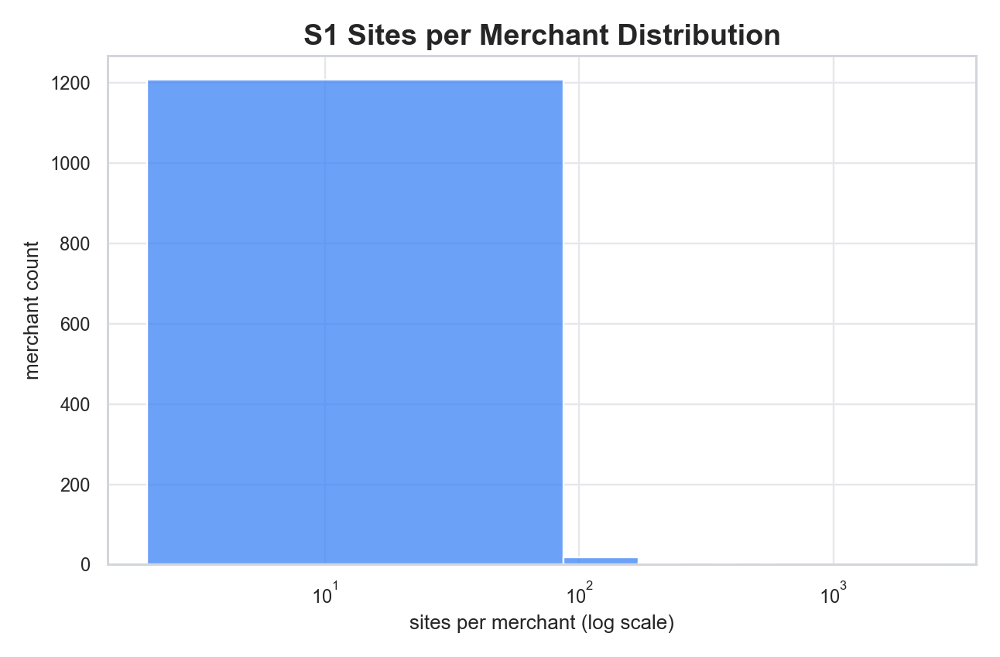

This plot shows most merchants clustered in the **10–100 site** range, with only a thin tail into the hundreds and thousands. That shape is exactly what the earlier statistics imply (median ~16, p90 ~36, p99 ~168). The reason the bar looks like a “block” is because the **log‑x scale compresses** the low‑count region and spreads out the long tail. The plot is not “broken”; it’s just visualizing a wide numeric range in a compact way.  
What this tells us is **how large merchant footprints are**, but it does not tell us whether the weights inside those footprints are realistic. It’s a sizing plot, not a realism plot. The next plots reveal whether these footprints have realistic **concentration** or whether they are uniformly flat.

---

#### b) Top‑1 vs Top‑2 site weight

Every point falls exactly on the diagonal **y = x**, and the points snap to discrete steps. That combination is a visual fingerprint of **uniform weights**. If every site is weighted equally, then the top‑1 and top‑2 weights must be identical, and their values become exact fractions like **1/2, 1/3, 1/4, …** — which is why the points sit on clean “stairs.”  
In real merchant data, top‑1 is rarely equal to top‑2; it is usually larger because some sites dominate. The straight diagonal line here is not a plotting artifact — it is the plot revealing that **all merchants are forced into equal weights** with no dominance or skew.

---

#### c) HHI (concentration) distribution
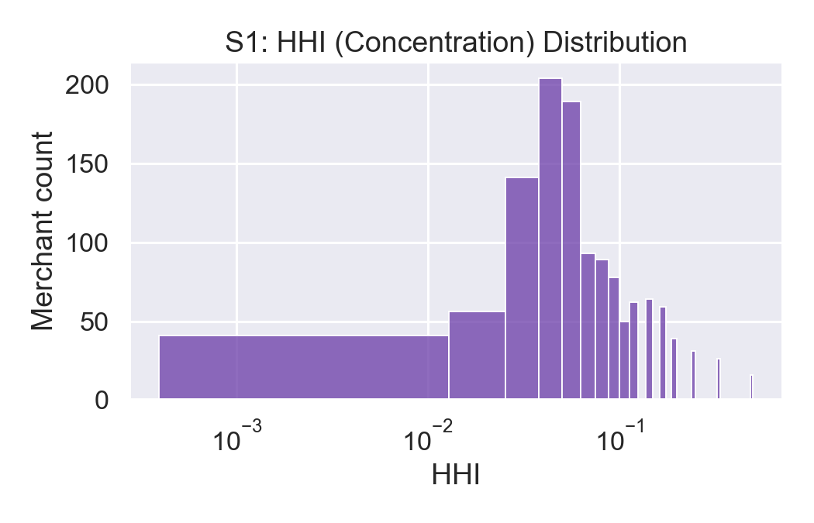

HHI measures concentration. In this plot, the distribution is **tight and narrow**, not broad. That means almost every merchant has **the same concentration profile**, and the only thing changing HHI is the number of sites. The log‑x axis makes the range readable, but the important signal is that **there is no spread** at each site‑count level.  
In realistic commerce data, we expect **heterogeneous concentration** — some merchants highly skewed, some relatively flat, many in between. The tight cluster here is another visual confirmation that S1 is uniform by design rather than behavior‑driven.

---

#### d) Lorenz curves (sample merchants)
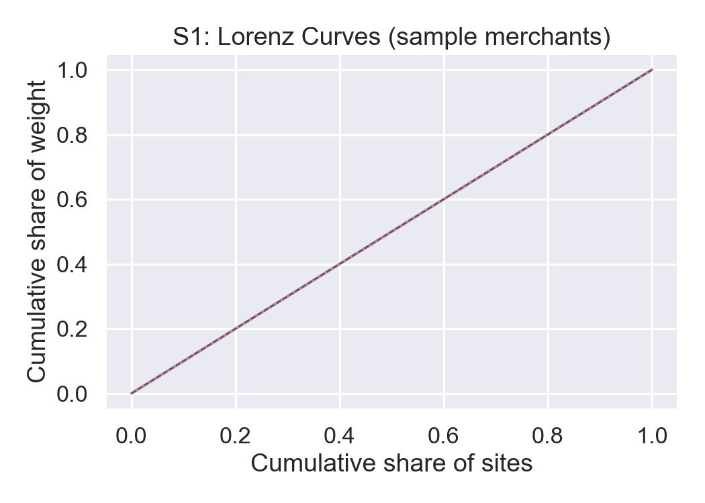

The left panel still shows the same core signal: sampled merchant Lorenz curves lie on the equality line, so there is no within-merchant concentration structure.  
The right panel (inequality-gap histogram) reinforces that result numerically: values pile near zero, which is exactly what we expect under enforced uniform weights.

---

#### e) HHI vs site_count
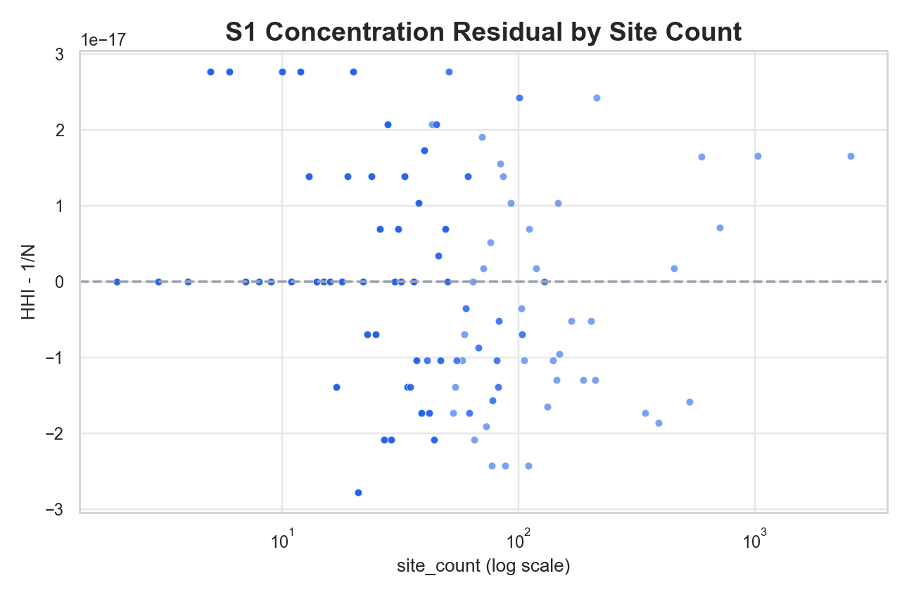

This refreshed view plots the residual `HHI - 1/N` against site count. The points collapse tightly around zero across all merchant sizes, which is a direct falsification check for non-uniformity.  
If merchants had realistic concentration heterogeneity, we would see positive and negative spread around zero. We do not, so concentration remains deterministically pinned to footprint size.

---

#### f) Top‑1 weight vs site_count
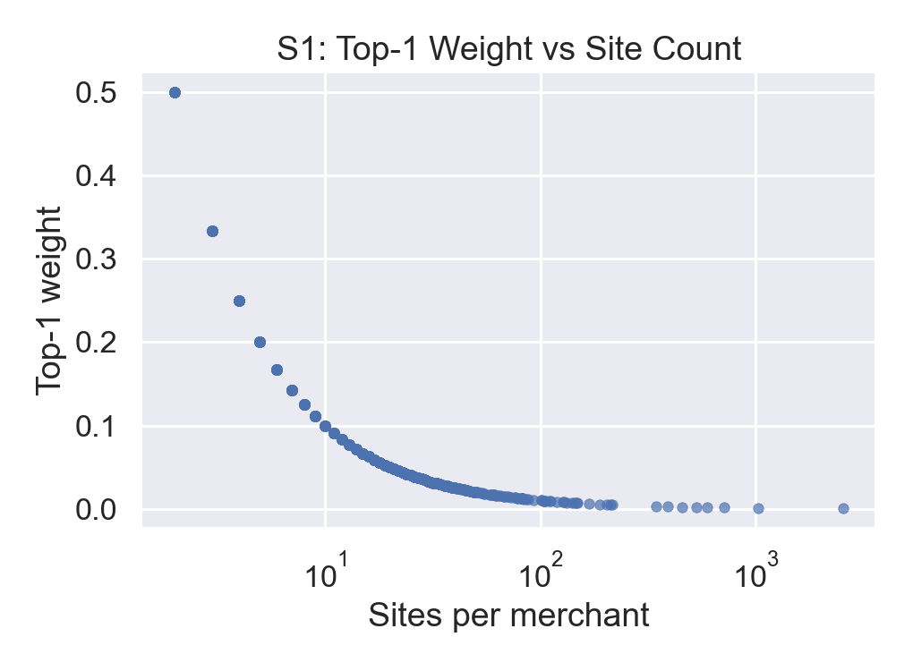

This refreshed view uses `top1 - 1/N` residuals. Like the HHI residual plot, it collapses onto zero with no meaningful dispersion.  
That means top-site dominance is fully determined by site count and not by merchant behavior. Real data would show clear spread at fixed site counts; this run does not.

---

#### g) Weight source breakdown
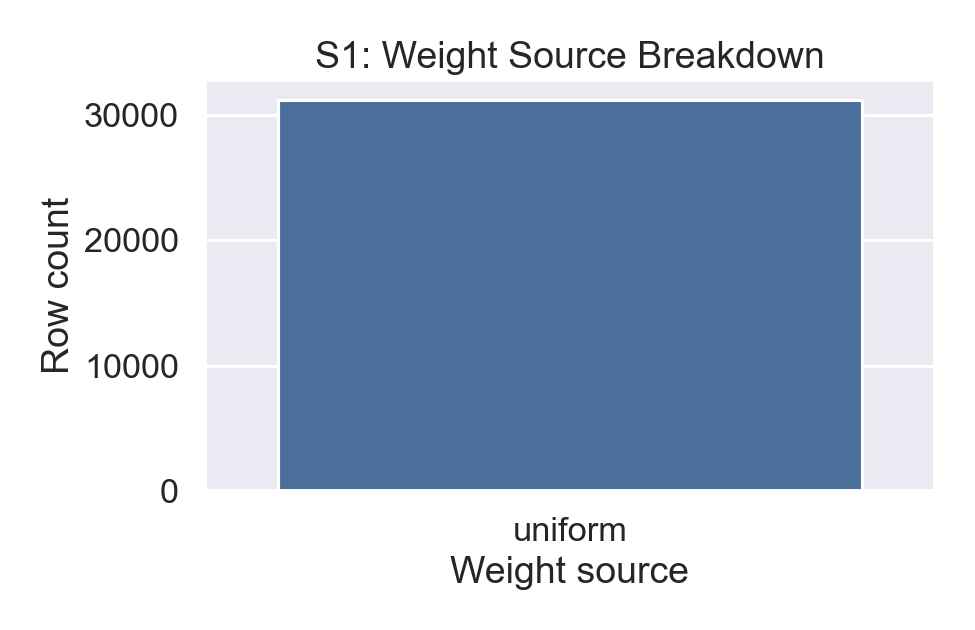

This refreshed panel gives provenance in three slices (`weight_source`, `quantised_bits`, `floor_applied`) instead of a single bar. All three collapse to one category/value, confirming that the uniform behavior is policy-driven and globally applied in S1.

---

#### h) Entropy vs site_count

This refreshed view plots normalized entropy residuals (`H_norm - 1`). The entire cloud sits at zero, confirming entropy is exactly what a uniform distribution predicts for every merchant.  
Again, no residual spread means no merchant-level dispersion differences.

---

#### i) Direct uniformity residuals

This is the most direct check: row-level `p_weight - 1/site_count`. The distribution is a razor-thin spike at zero, which confirms that every site weight equals the uniform baseline for its merchant.  
This plot closes the loop on S1: uniformity is not an approximate tendency; it is exact construction.

---

**Bottom line from the plots:**  
The “weird” straight lines and the single‑bar chart are not plotting artifacts. They are the visual signature of a **fully uniform weighting system**. Every diagnostic plot independently shows the same property: **site_count completely determines the weight distribution**, and there is **zero merchant‑specific variation**. That is the core realism blocker for S1 and therefore for Segment 2B.

## 9) Realism core #2 - `s4_group_weights` (routing mix realism)
**Counts**
- Rows: **278,100**
- Merchants: **1,238**
- Days: **90**
- tz_groups: **90**
- Day range: **2026-01-01 to 2026-03-31**

**Normalization**
- `sum_p_group` is numerically stable for all merchant-days (floating-point range **0.9999999999999996 to 1.0000000000000004**).
- No merchant-day fails practical normalization checks.

**Group diversity per merchant-day**
- Total merchant-days: **111,420**
- tz-groups per day:
  - 1 group: **53,820** (48.3%)
  - 2 groups: **20,970** (18.8%)
  - 3+ groups: **36,630** (32.9%)

**Dominance**
- Max p_group >= 0.90: **51.7%** of merchant-days  
- Max p_group >= 0.95: **49.1%**  
- Max p_group >= 0.99: **48.4%**

**Interpretation (realism):**  
The dominance metrics show that **routing behavior collapses to a single timezone for roughly half of merchant‑days** (max p_group ≥ 0.9 for ~51%). Even when merchants do have multiple tz groups, the mix is often extremely imbalanced, which implies **little cross‑timezone activity** on most days. This is a strong realism limitation because real merchants with multi‑country or multi‑region footprints rarely have **near‑exclusive** traffic from a single timezone every day.  
Unlike earlier snapshots, this sealed run does **not** show normalization defects in S4. So the problem here is not mass loss; it is behavioral concentration: the system is internally consistent yet still too single‑timezone dominated for strong synthetic realism.

---

### 9.1 Visual diagnostics (S4) — narrative interpretation

#### a) Max p_group per merchant-day

The histogram is dominated by a **huge spike at ~1.0**, with only a thin spread across lower values. That spike means a very large fraction of merchant‑days have **one tz‑group that captures almost all weight**. The long tail indicates that multi‑tz behavior exists, but the spike shows it is not the norm. This image makes the earlier stats concrete: around half of merchant‑days are effectively single‑tz dominated.  
Realism impact: a routing system where “most days = one timezone” does not reflect how multi‑region merchants typically behave; it compresses geographic diversity into a single dominant region.

---

#### b) Distinct tz_groups per merchant-day
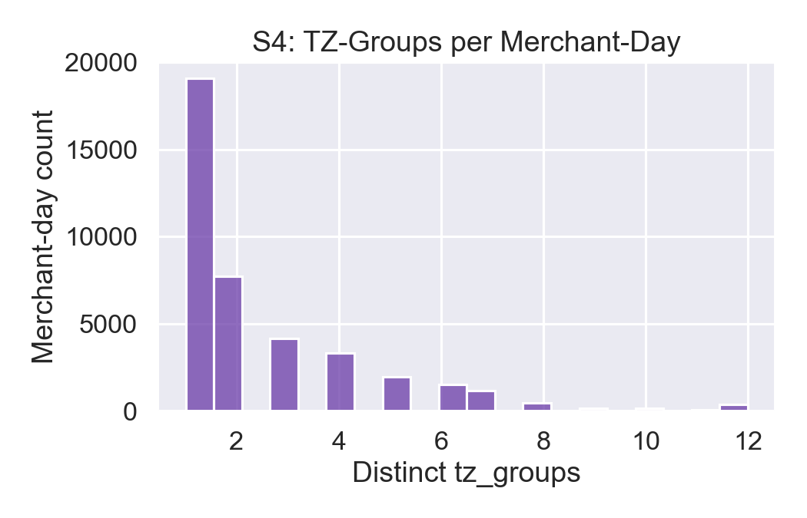

The bar chart is heavily concentrated at **1 and 2 tz‑groups**, with a long but thin tail reaching up to 12. The tallest bar is at 1, meaning **single‑tz days are the most common case**. The tail shows that some merchant‑days do span multiple tz‑groups, but those cases are comparatively rare.  
Realism impact: global or multi‑region merchants should show more consistent multi‑tz presence; the dominance of 1‑group days suggests the routing mix is **geographically collapsed** most of the time.

---

#### c) Entropy of group weights
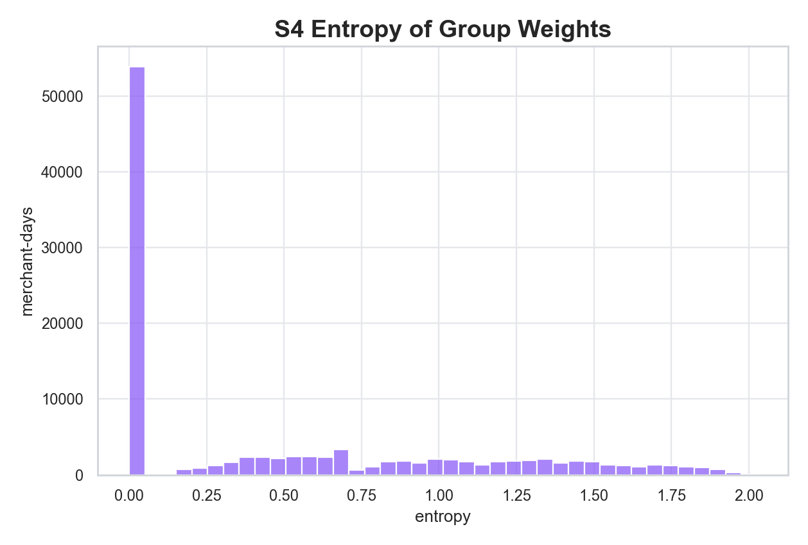

The entropy distribution has a **very large spike near 0**, then a smaller tail extending out to ~2.0. Entropy near 0 indicates **one tz‑group dominates**; higher entropy indicates more balanced mixes. The spike near 0 therefore confirms that most merchant‑days are **highly concentrated**, even when multiple groups exist.  
Realism impact: even when tz‑group counts are >1, the **weight distribution is still skewed**, meaning multi‑tz activity is often nominal rather than meaningful.

---

#### d) TZ‑group count vs site count
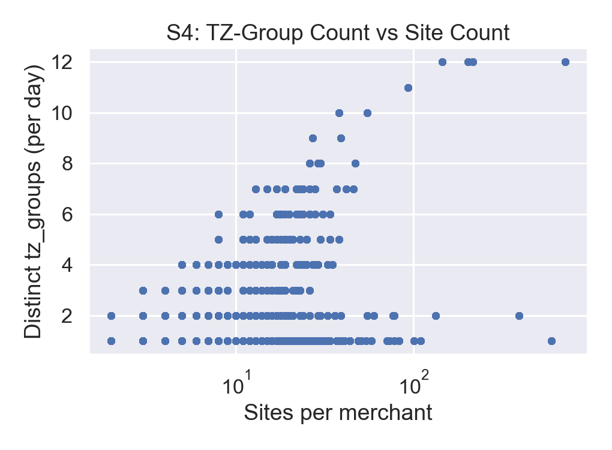

The refreshed hexbin view makes density explicit instead of overplotting individual points. As site count grows, upper support increases, but density still concentrates in low tz-group counts (mostly 1-3).  
Realism impact: merchant size should correlate strongly with geographic reach. The weak relationship here suggests that **size does not reliably translate into tz diversity**, which is another realism limitation.

---

#### e) Sum of p_group per merchant-day
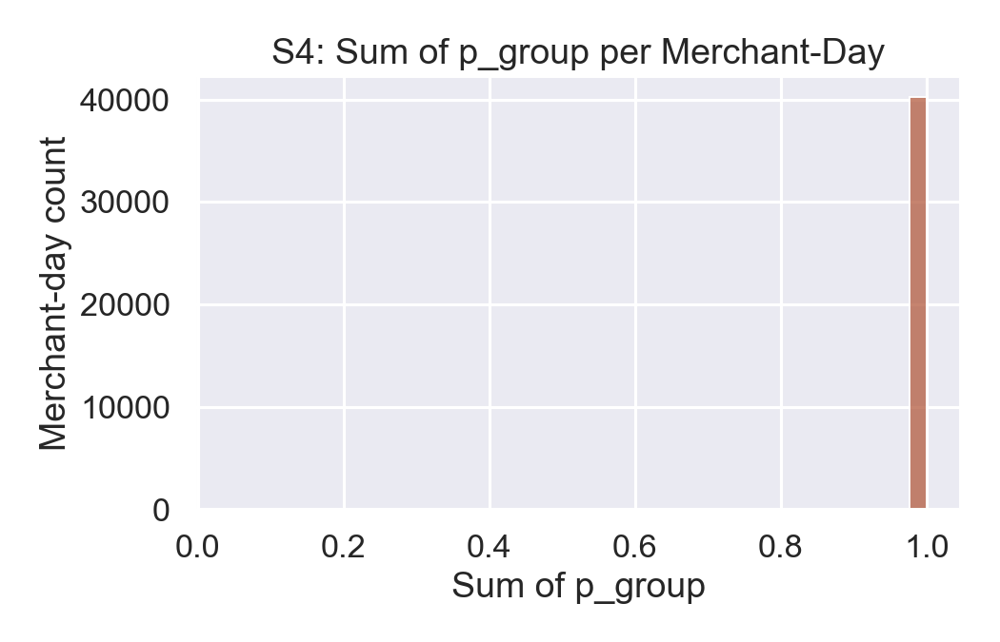

This refreshed plot is centered on `sum(p_group) - 1`, so numerical stability is easier to inspect. The entire distribution is tightly concentrated around zero (floating-point noise only), confirming practical normalization correctness across the panel.  
Realism impact: probability mass accounting is healthy; the active realism issue is concentration, not normalization leakage.

---

#### f) Dominance by tz-group breadth

This boxplot stratifies `max p_group` by tz-group-count bucket. Even with broader group counts, dominance remains high in many cases, though medians decline as breadth increases.  
This confirms that “having more groups” does not automatically produce balanced routing. The concentration problem persists beyond the `n_groups=1` cases.

---

**S4 visual takeaway:**  
The plots show a system where **single‑tz dominance is the norm**, multi‑tz behavior is the exception, and geographic diversity does not reliably scale with merchant size. The overall pattern aligns with the stats (high max‑p_group dominance, low entropy, and heavy mass at 1–2 tz‑groups). This is a realism bottleneck because daily routing should express broader geographic variation for multi‑site merchants.

## 10) Realism core #3 - `s3_day_effects` (temporal realism)
**Counts**
- Rows: **278,100**
- Merchants: **1,238**
- Days: **90**
- tz_groups: **90**
- Day range: **2026-01-01 to 2026-03-31**
- `sigma_gamma` unique values: **1** (all rows share the same sigma)

**Gamma distribution**
- `gamma` quantiles:  
  min **0.574**, p10 **0.851**, p25 **0.916**, p50 **0.993**, p75 **1.077**, p90 **1.158**, p99 **1.314**, max **1.750**
- `log_gamma` quantiles:  
  min **-0.555**, p50 **-0.007**, p90 **0.147**, max **0.560**
- Means: `gamma` ~ **1.0002**, `log_gamma` ~ **-0.0071**, std ~ **0.121**

**Interpretation (realism):**  
The gamma distribution looks **statistically plausible** (log‑normal, centered near 1.0, moderate spread), so the *shape* is realistic. However, the realism weakness is **lack of heterogeneity**: sigma_gamma is identical for every merchant, so **every merchant has the same volatility profile** across days. In real data, some merchants are highly seasonal or have bursty patterns (high sigma), while others are stable (low sigma).  
This uniform sigma also suppresses the emergent property we want from realism: different merchants should produce **distinct temporal signatures**. With a single sigma, the only variability comes from the random draw, not merchant‑level behavior. That makes temporal realism **generic rather than specific**, which weakens explainability and model interpretability downstream.

---

### 10.1 Visual diagnostics (S3) — narrative interpretation

#### a) Sigma_gamma per merchant
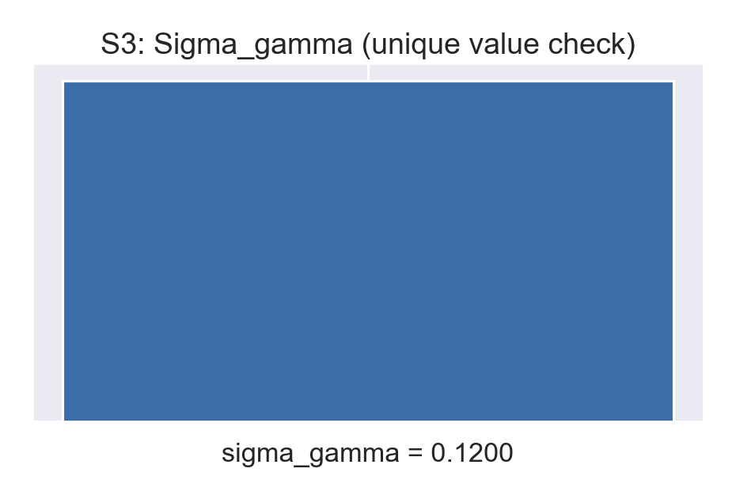

This plot collapses to a **single razor‑thin spike** because sigma_gamma is **effectively constant for all merchants**. The odd x‑axis offset text is just the plotting backend trying to show extremely small variation around a fixed value. Visually, there is no spread at all.  
This is not just “low variance” — it is **one shared volatility parameter** (`sigma_gamma ≈ 0.1206`) for the entire merchant population. That means there is no distinction between stable merchants (low day‑to‑day volatility) and bursty merchants (high volatility). In practical terms, every merchant experiences the **same day‑effect variance**, so the dataset cannot encode merchant‑specific seasonality or stability differences.  
Realism impact: this removes one of the most important real‑world signals (different merchants have different volatility profiles), so any downstream model that depends on temporal variability will be trained on **uniform behavior** rather than diverse behavior.

---

#### b) Gamma distribution
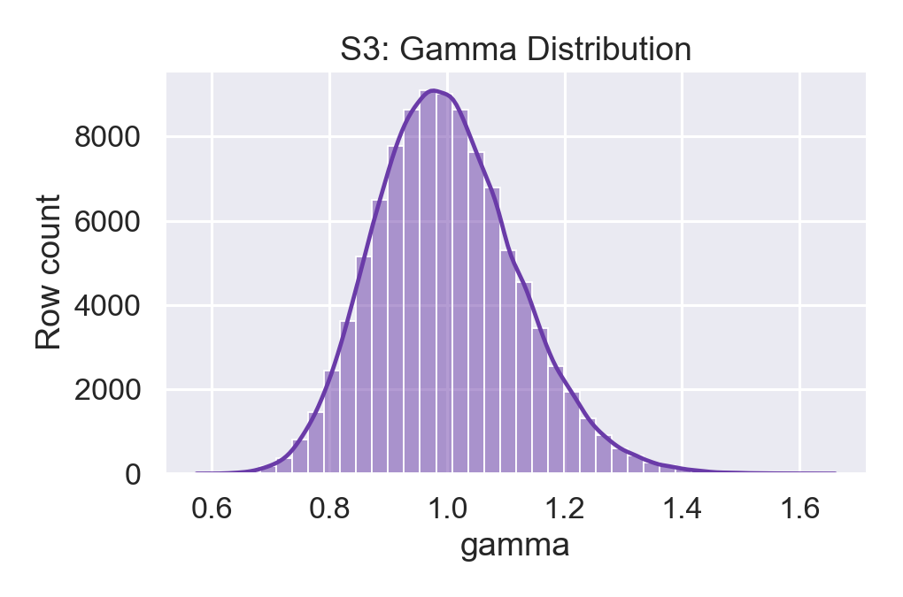

The gamma histogram has a clean, bell‑shaped profile centered near **1.0**, with a moderate spread and smooth KDE. This is exactly what a log‑normal daily modulation should look like at the aggregate level. The quantiles back this up: values span roughly **0.57 to 1.75**, with most mass between **0.85 and 1.16**.  
However, because sigma is fixed, this distribution is essentially the **same log‑normal repeated across all merchants and tz‑groups**, then stacked together. The dataset therefore looks plausible *in aggregate* while still being **behaviorally homogeneous** underneath.  
Realism impact: a plausible global shape is necessary but not sufficient — the lack of heterogeneity means the dataset does not encode meaningful merchant‑level or region‑level differences in daily variability.

---

#### c) Gamma by tz_group (top 10)

The boxplots are **nearly identical across all top tz‑groups**: medians around 1.0, similar IQR widths, and symmetric outlier patterns. There is no visible tz‑group‑specific variability.  
This means tz_group_id is **not acting as a behavioral driver** in the day‑effect model. If the intention was to incorporate regional differences (holiday cycles, climate‑driven seasonality, cultural spend patterns), those signals are absent.  
Realism impact: the system treats all regions as statistically interchangeable, which suppresses the geographic realism that fraud models often rely on (e.g., different volatility profiles across regions).

---

#### d) Gamma over time (sample merchants)
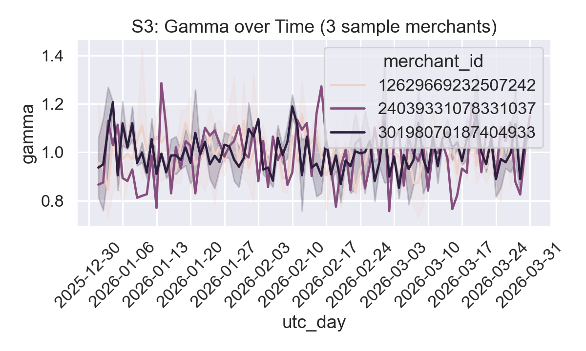

The refreshed chart uses per-merchant daily means with a 7-day rolling average, so broad dynamics are easier to read. The series still fluctuate around 1.0 with no stable periodic structure.  
Merchants differ in noise realization but not in volatility regime, and there is no consistent weekly/seasonal signature.  
This indicates the day effects are likely **i.i.d. draws** per day rather than a time‑structured process. That is fine for a synthetic baseline, but it is **not realistic** if we want recurring cycles (weekends vs weekdays, monthly peaks, holiday effects).  
Realism impact: day effects look like **white noise** instead of business‑like seasonality. That limits the realism of temporal dynamics that a fraud model might learn to exploit.

---

#### e) Mean gamma per merchant
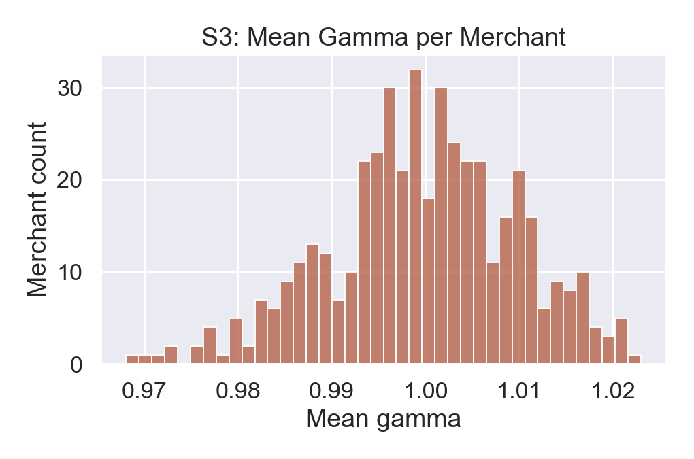

The mean gamma distribution is **tight and centered near 1.0**, with only a small spread (~0.97 to ~1.02). That means merchants differ only slightly in their average modulation, and nearly all merchants have **the same long‑run baseline**.  
In real systems, baseline effects differ materially across merchant categories and business models (e.g., fast‑moving vs seasonal merchants). Here, the baseline is effectively **fixed**, with only trivial deviations.  
Realism impact: the model cannot learn or explain merchant‑specific “baseline intensity” from day effects because the dataset does not encode it.

---

#### f) Days covered per merchant
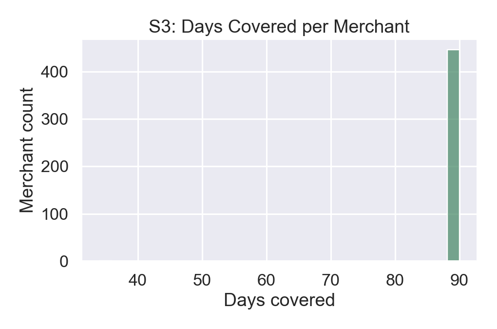

This is essentially a **single spike at ~90 days**, showing that every included merchant is present for the full policy horizon. That is good for coverage consistency within S3, and in this sealed run the included set matches the full S1 merchant universe (**1,238 merchants**).  
There is **no partial coverage** or intermittent coverage in S3. That is clean from a pipeline perspective, but it is also less realistic if we expect some merchants to enter/exit over time.  
Realism impact: within S3 the coverage is now complete for the S1 merchant universe (all **1,238** merchants), but the time panel is still a strict full‑horizon rectangle with no churn, so it does not reflect real‑world merchant entry/exit dynamics.

---

#### g) Merchant-day panel rectangularity (sample)
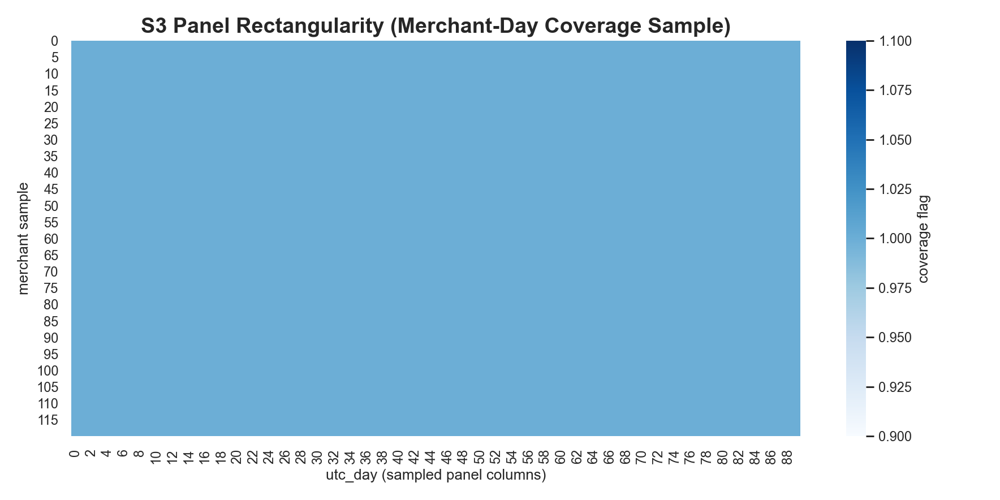

The coverage heatmap sample is effectively a full rectangle: almost every sampled merchant has observations for every day in the horizon.  
That is operationally clean and desirable for deterministic replay, but from a realism standpoint it confirms no lifecycle variation (no entry/exit, no inactivity windows) in the temporal panel.

---

**S3 visual takeaway:**  
The aggregate gamma distribution looks plausible, but **all merchant‑level and tz‑group‑level heterogeneity is missing**. The plots consistently show a single global volatility profile, near‑identical tz‑group behavior, and mostly noise‑like time variation. This makes temporal realism **generic rather than merchant‑specific**, which limits the realism of day‑level dynamics for fraud modeling.

## 11) Coverage status (re-validated)
**Merchants present in S1 vs S3/S4**
- Merchants in `s1_site_weights`: **1,238**
- Merchants in `s3_day_effects` / `s4_group_weights`: **1,238**
- Missing merchants: **0**

**Panel shape**
- Merchant coverage is complete across S1, S3, and S4.
- Day coverage is rectangular and fixed: every included merchant has the same **90-day** window.

**Interpretation (realism):**  
The previous merchant-coverage gap is closed in this run, which removes a major structural realism defect. Every merchant now receives day effects and group mixes.  
The remaining realism limitation is **panel rigidity**: all merchants are present for all 90 days with no entry/exit pattern. This is operationally clean, but less realistic than a population with staggered starts/stops and partial activity windows.

---

## 12) Routing workload realism (`s5_arrival_roster`)
- Rows: **1,238** (exactly 1 per merchant)
- Days: **1** (only 2026-01-01)
- Virtual rate: **11.23%**

**Interpretation:**  
This roster represents **one arrival per merchant on a single day**, which is effectively a **smoke test** rather than a realism‑grade workload. It cannot reveal day‑level seasonality, tz‑mix variation over time, or intra‑merchant routing dynamics because **there is no temporal depth**.  
If we evaluate realism based on this roster, we will **overestimate** the system’s realism (since it never has to express variability) and **under‑detect** errors (like tz‑mix drift or day‑grid gaps). For realism assessment, we need multi‑day, multi‑arrival rosters so routing can show **repeated, structured behavior** instead of single‑point snapshots.

---

## 13) Structural integrity checks (supporting realism)
**S3 <-> S4 coherence**
- Gamma echo: **max abs diff = 0.0** (perfect match)
- Key coverage: **0 missing** in either direction

**Alias index**
- `merchants_count` in alias index = **1,238**, matching S1
- Layout/endianness/alignment consistent with policy

These checks confirm the **internal consistency** of the 2B pipeline (gamma echo and alias integrity), which is important because it means the realism issues are **not caused by broken joins or corrupt artefacts**. Instead, they are **behavioral choices in the data generation** (uniform weights, concentrated group mixes, homogeneous temporal volatility, and shallow roster). That distinction matters: fixes should target **generation logic and coverage policy**, not repair mechanics.

---

## 14) Realism takeaways (actionable)
1) Uniform weights across all merchants -> the biggest realism failure.  
   This makes routing artificially flat and removes hub/cluster behavior.
2) High tz-group dominance (~50% of merchant-days have max p_group >= 0.9).  
   Indicates very low geographic/timezone diversity in daily routing.
3) Temporal effects are plausible but homogeneous.  
   All merchants share identical sigma; variability is not merchant-specific.
4) Full coverage is achieved, but panel shape is rigid (no merchant churn).  
   This limits realism of population dynamics across time.
5) Arrival roster too shallow to validate realism in routing behavior.

If realism is the goal, the first fixes should be:
- **Introduce non‑uniform, merchant‑specific weight distributions in S1.**  
  For example, generate Zipf‑like or hub‑and‑spoke weights so a few sites dominate, with long‑tail sites still active. This alone will create realistic spatial skew and allow the model to explain why some sites are riskier.
- **Preserve full S1↔S3/S4 coverage and add realistic panel churn.**  
  Coverage is now complete; the next realism step is controlled merchant entry/exit (or activity intermittency) so the panel is not a perfect rectangle.
- **Expand arrival rosters to multiple days and multiple arrivals per merchant.**  
  This is required to observe temporal variability, tz‑mix changes, and routing stability. Without this, the system never demonstrates the behavior it is supposed to model.

---

## 15) Realism Grade (Segment 2B)
**Grade: C**

**Why this grade:**  
Segment 2B is structurally correct but behaviorally weak. The routing layer is built and audited correctly, yet the data it produces lacks the core realism patterns that would make fraud modeling credible. The grade is pulled down by:
- **Uniform S1 site weights** (no hub dominance, no realistic spatial skew).  
- **High tz‑group dominance** (≈50% of merchant‑days are effectively single‑timezone).  
- **Homogeneous temporal volatility** (single global `sigma_gamma`, minimal merchant differentiation).  
- **Rigid full-coverage panel** (no merchant churn / no staggered activity windows).  
- **Shallow arrival roster** (one day, one arrival per merchant; insufficient for realistic routing behavior).

**What would raise the grade:**  
Introduce non‑uniform, merchant‑specific site weight distributions; keep full S3/S4 coverage but add realistic panel churn; add richer temporal structure (merchant‑specific sigma, weekly/seasonal patterns); and expand the arrival roster so routing behavior can be observed across multiple days.

---

## 16) Realism improvement roadmap (synthetic realism)
This roadmap targets **robust synthetic realism** without real policy data, focusing on the three core datasets: `s1_site_weights`, `s4_group_weights`, and `s3_day_effects`.

1) **Make site weights merchant‑specific (S1).**  
   Replace the uniform weight profile with **hub‑and‑spoke or Zipf‑like distributions**. Small merchants should have 1–2 dominant sites, while larger merchants can have broader tails. This alone will create believable spatial skew and explainable risk patterns.

2) **Maintain full merchant coverage and add panel realism.**  
   Coverage is now complete across S1/S3/S4, which should be preserved. Next, add controlled **merchant entry/exit or intermittent inactivity** so the panel reflects realistic lifecycle dynamics instead of a perfect rectangle.

3) **Inject temporal heterogeneity (S3).**  
   Use **merchant‑specific sigma** (not a single global sigma) and add **weekly/seasonal modulation**. Even a small weekly signal (weekends vs weekdays) makes synthetic time series feel more realistic.

4) **Reduce excessive tz‑group dominance (S4).**  
   The current max‑p_group distribution is too concentrated near 1. Introduce a **floor on secondary groups** (e.g., a 2–5% minimum for the top‑2 group in escalated flows) so multi‑group routing becomes visible.

5) **Expand arrival rosters beyond a single day.**  
   The current arrival roster is a smoke test, not a realism surface. Provide **multi‑day, multi‑arrival** coverage so that day effects and group mixes can be validated over time.

**Expected impact:**  
Implementing steps 1–3 should move 2B toward **B‑/B** for synthetic realism. Steps 4–5 stabilize the gains by making multi‑zone routing and temporal variation demonstrable rather than theoretical.
