# Segment 3B - Design vs Implementation Observations (Virtual Merchants & CDN Surfaces)
Date: 2026-01-31
Scope: Design intent vs implementation notes for Segment 3B (S0-S5), plus what to look for in 3B datasets before assessment.

---

## 0) Why this report exists
Segment 3B builds the virtual-merchant overlay: it decides who is virtual, assigns a legal settlement anchor, constructs the CDN edge universe with coordinates and weights, packages the alias tables used by routing, and publishes the routing + validation contracts that govern virtual flows. This report captures what the 3B design specifies, what implementation decisions were taken, and what evidence we should look for when we later assess the 3B datasets for realism and correctness.

---

## 1) Design intent (what 3B should do)
High-level intent across states:

1) S0 - Gate & environment seal
   - Enforce upstream PASS gates (1A, 1B, 2A, 3A) and seal the exact set of policies, references and datasets that 3B is allowed to read.
   - Emit `s0_gate_receipt_3B` and `sealed_inputs_3B` as the only authority on the 3B input universe.

2) S1 - Virtual classification & settlement nodes
   - Classify merchants into virtual vs non-virtual using governed MCC/channel rules.
   - Create one settlement node per virtual merchant with deterministic `settlement_site_id`, settlement coordinates and a `tzid_settlement`.
   - Emit `virtual_classification_3B` and `virtual_settlement_3B`.

3) S2 - CDN edge catalogue construction
   - For each virtual merchant, determine an edge budget and allocate edges across countries using governed weights.
   - Sample edge coordinates (HRSL + tile weights + world polygons), assign `tzid_operational`, and compute `edge_weight`.
   - Emit `edge_catalogue_3B` and `edge_catalogue_index_3B` plus RNG evidence logs.

4) S3 - Edge alias tables & universe hash
   - Convert each merchant's edge distribution into an alias table in a versioned binary layout.
   - Emit `edge_alias_blob_3B`, `edge_alias_index_3B`, and `edge_universe_hash_3B` tying policies + S2 catalogue + S3 alias outputs.

5) S4 - Virtual routing semantics & validation contracts
   - Publish `virtual_routing_policy_3B` (settlement vs operational clocks, alias usage, routing semantics).
   - Publish `virtual_validation_contract_3B` describing tests/tolerances used later to validate virtual routing.

6) S5 - Validation bundle + PASS flag
   - Re-audit all 3B artefacts and RNG usage.
   - Emit `validation_bundle_3B`, `validation_bundle_index_3B`, `s5_manifest_3B`, and `_passed.flag`.

---

## 2) Expected datasets & evidence surfaces (contract view)
Core datasets to assess later:

S0 / sealing
- `s0_gate_receipt_3B`
- `sealed_inputs_3B`

S1 / virtual classification + settlement
- `virtual_classification_3B`
- `virtual_settlement_3B`

S2 / edge catalogue
- `edge_catalogue_3B`
- `edge_catalogue_index_3B`
- RNG evidence logs: `rng_event_edge_tile_assign`, `rng_event_edge_jitter`

S3 / alias & universe integrity
- `edge_alias_blob_3B`
- `edge_alias_index_3B`
- `edge_universe_hash_3B`

S4 / routing + validation contracts
- `virtual_routing_policy_3B`
- `virtual_validation_contract_3B`

S5 / validation bundle + PASS gate
- `validation_bundle_3B`
- `validation_bundle_index_3B`
- `s5_manifest_3B`, `s5_structural_summary_3B`, `s5_rng_summary_3B`, `s5_digest_summary_3B`
- `_passed.flag`

---

## 2.1) Priority ranking (by realism impact)
If we rank datasets by their direct impact on realism in the virtual overlay, the order is:

1) `edge_catalogue_3B` - concrete edge geography, weights and tzids; the most visible realism surface.
2) `virtual_settlement_3B` - legal anchors for virtual merchants; determines the home base realism.
3) `virtual_classification_3B` - determines how large the virtual universe is and why; sets overall realism of virtual prevalence.
4) `edge_alias_blob_3B` / `edge_alias_index_3B` - governs how routing samples edges; realism depends on correct weighting and layout.
5) `edge_universe_hash_3B` - integrity surface, critical for correctness but indirect for realism.
6) `virtual_routing_policy_3B` / `virtual_validation_contract_3B` - semantics and governance; critical for correctness but not a visible realism surface by themselves.

---

## 3) Implementation observations (what is actually done)
Based on `segment_3B.impl_actual.md` and the 3B state-expanded specs.

### 3.1 S0 - Gate & sealed inputs
Observed posture: strict gate enforcement and sealed-input determinism, aligned with the design intent.

Key observations from implementation notes:
- Upstream PASS gates enforced for 1A, 1B, 2A and 3A before any 3B data-plane state runs.
- `tz_timetable_cache` is treated as optional, consistent with the contract; the cache is only sealed and used if present.
- A Pelias bundle digest mismatch was corrected by updating the sealed bundle file, indicating S0 is strict about reference integrity rather than permissive.

Net: S0 is operating as a true closed-world gate that seals the exact inputs and fails on mismatched reference digests, which is the intended posture for reproducibility.

---

### 3.2 S1 - Virtual classification & settlement nodes
Observed posture: no deviations recorded in the implementation notes.

Design expectations remain intact:
- Deterministic classification based on MCC/channel rules.
- One settlement node per virtual merchant with `tzid_settlement` and provenance.

Net: There are no recorded implementation deviations here; we will rely on dataset inspection to confirm classification rates and settlement plausibility.

---

### 3.3 S2 - CDN edge catalogue construction
Observed posture: implementation is consistent with the design, with a notable correction around timezone resolution.

Key implementation notes:
- Timezone resolution failure for country SH (Saint Helena) was addressed by adding a tz_overrides entry, rather than adding special-case logic. This keeps the algorithm deterministic and policy-driven.
- A helper for latest run receipts was added for stability, but does not alter the data plane.

Net: S2 remains policy-driven and deterministic with RNG only for spatial jitter, and the resolution fix indicates attention to geographic edge cases without compromising determinism.

---

### 3.4 S3 - Edge alias tables & universe hash
Observed posture: significant but controlled implementation adjustments to schema references, hashing and index layout.

Key changes recorded:
- Schema reference for alias blob fixed to `edge_alias_blob_header_3B` (previously mismatched).
- Index fields strictly limited to schema-defined columns; policy and `parameter_hash` fields were not added when the schema did not authorize them.
- Universe hash uses minimal schema fields (merchant_id, edge_id, edge_weight), to ensure it is stable and only depends on contract-approved fields.
- Alias index digest computed over raw parquet bytes (not row-level hashing), ensuring reproducibility and avoiding ambiguous serialization.
- `universe_hash` field in the alias index is set to null to avoid circular digest dependencies.
- `gamma_draw_log_3B` exists but is empty, indicating no gamma draws are currently logged in 3B.
- merchant_id overflow fix in alias indices (UInt64) and adjustments to alias blob padding/alignment.

Net: S3 is stable and deterministic, but the hash and index behavior relies on careful adherence to schema constraints. The empty gamma log is a potential gap if future 3B processes are expected to emit gamma-based evidence.

---

### 3.5 S4 - Virtual routing semantics & validation contracts
Observed posture: contract compilation completed; schema adapter expanded to support object columns.

Implementation notes:
- The JSON schema adapter was expanded to support object-typed columns and list items.
- An extra `digests` field was removed from `s4_run_summary_3B` because it was not contract-approved.

Net: S4 is aligned with contract strictness; the implementation is conservative about schema compliance.

---

### 3.6 S5 - Validation bundle + PASS flag
Observed posture: validation bundle law clarified; new evidence surfaces added.

Key decisions recorded:
- Bundle digest law uses evidence file bytes (not an index-only shortcut).
- `s5_manifest_3B` is mandatory and additional summaries are required: `s5_structural_summary_3B`, `s5_rng_summary_3B`, `s5_digest_summary_3B`.
- RNG logs must include internal input fields, though they are not sealed as policy.
- Warnings allowed for missing `edge_tile_assign` events, if `edge_tile_assign` was not used for a run.

Net: S5 is strict and evidence-rich, with explicit digest rules and a more detailed validation trail than earlier segments.

---

## 4) Design vs implementation deltas (summary)
1) S3 hash scope and index layout were narrowed to schema-defined fields, and the hash/index coupling was carefully arranged to avoid circular dependencies. This is consistent with design intent but more conservative than a naive hash-everything approach.
2) `gamma_draw_log_3B` is empty, which is a meaningful deviation if gamma-based randomness was intended for 3B. It may be acceptable if no gamma draws are used, but it should be verified in datasets.
3) S5 digest law uses evidence bytes, which is stricter than an index-only bundle and aligns with the S5 design, but requires downstream tooling to use the correct hashing law.
4) S2 timezone resolution edge case (SH) was solved via policy override rather than ad-hoc code. This is aligned with deterministic, governed inputs.

---

## 5) What to look for in 3B datasets (realism + correctness)
This checklist is focused on realism: whether the virtual overlay looks believable and sufficiently rich for downstream modeling.

### 5.1 `virtual_classification_3B` (virtual vs physical realism)
Key questions:
- What share of merchants are virtual overall and by MCC/channel?
- Are virtual classifications concentrated in plausible verticals (digital goods, services) rather than randomly scattered?
- Are reason codes balanced and consistent with policy thresholds?

Realism risks:
- Nearly uniform virtual rates across all MCCs/channels would look synthetic and policy-agnostic.
- Over-classification (too many merchants virtual) would distort platform realism by undercutting physical geography.

---

### 5.2 `virtual_settlement_3B` (settlement anchor realism)
Key questions:
- Are settlement coordinates plausible within the merchant's legal country?
- Do settlement timezones align with the settlement coordinates and country boundaries?
- Do settlement nodes repeat unrealistically (one coordinate used for many unrelated merchants)?

Realism risks:
- Settlement anchors collapsing to a few coordinates or incorrect timezones will make virtual flows feel artificial.
- Mismatch between legal country and settlement coordinates undermines trust in virtual semantics.

---

### 5.3 `edge_catalogue_3B` (edge geography and weight realism)
Key questions:
- Edge counts per merchant and per country: do they scale with merchant size and country weight policies?
- Edge coordinates: are they inside country polygons and aligned to populated regions (HRSL)?
- `edge_weight` distribution: do weights create realistic dominance or are they flat/uniform?
- `tzid_operational`: does it match edge coordinates and country expectations?

Realism risks:
- If edges are uniformly distributed across countries or uniformly weighted, routing will be unrealistic and too even.
- If edge coordinates fall outside country polygons or cluster in improbable regions, the geography will be visibly synthetic.

---

### 5.4 `edge_alias_blob_3B` / `edge_alias_index_3B`
Key questions:
- Does index metadata (offsets, counts, checksums) align with the edge counts in `edge_catalogue_3B`?
- Are alias tables sized consistently with weights (more edges -> larger alias segments)?
- Are checksums stable and deterministic for re-runs with the same inputs?

Realism risks:
- If alias tables do not respect the weight distributions, routing will ignore edge realism.
- Misaligned index metadata would indicate representation errors rather than realism issues, but it would block routing correctness.

---

### 5.5 `edge_universe_hash_3B`
Key questions:
- Does the hash change when policies or edge catalogues change?
- Are the component digests traceable back to policy + edge outputs?

Realism risks:
- If the universe hash is insensitive to input changes, the system loses provenance and cannot explain routing behavior.

---

### 5.6 `virtual_routing_policy_3B` & `virtual_validation_contract_3B`
Key questions:
- Do these contracts explicitly bind to S1-S3 outputs and list the exact tests and tolerances?
- Are settlement-vs-operational clock semantics clear and testable?

Realism risks:
- Vague routing semantics or unbound validation contracts will make it hard to interpret whether realism failures are data issues or policy gaps.

---

### 5.7 Validation bundle surfaces
Key questions:
- Is `validation_bundle_3B` present with `_passed.flag` and index digest that matches the digest law?
- Do the S5 summaries align with the actual artefacts (counts, digests, RNG logs)?

Realism risks:
- If validation evidence is inconsistent, we cannot trust any conclusions about realism because the input universe is not fully sealed.

---

## 6) Interpretation guide for realism assessment
If 3B outputs look unrealistic, the likely root causes (by design) are:

1) Overly broad virtual classification rules (S1) -> too many merchants are virtual, draining realism from physical geography.
2) Settlement anchors not aligned with legal countries (S1) -> settlement realism collapses, and dual-time semantics become confusing.
3) Uniform edge weights or evenly distributed edge placement (S2) -> routing will not produce believable edge traffic patterns.
4) Alias tables not reflecting weights (S3) -> even if edges are realistic, routing will sample unrealistically.

During assessment, we should always separate:
- Structural correctness (schema/joins/hashes) from
- Behavioral realism (spatial plausibility, weight diversity, heterogeneity across merchants/countries).

---

(Next: detailed assessment of the actual 3B outputs under the run folder, once we move to data analysis.)

---

# Segment 3B - Output Assessment (Run: local_full_run-5)
Run: `runs\local_full_run-5\c25a2675fbfbacd952b13bb594880e92`
Partition: `seed=42`, `manifest_fingerprint=c8fd43cd60ce0ede0c63d2ceb4610f167c9b107e1d59b9b8c7d7b8d0028b05c8`
Parameter hash: `56d45126eaabedd083a1d8428a763e0278c89efec5023cfd6cf3cab7fc8dd2d7`

This section records what the 3B outputs actually show in this run. The emphasis is on realism signals, not just schema correctness.

---

## 7) Output inventory and coverage (context only)
Files present under `data/layer1/3B`:
- `virtual_classification` (10,000 rows)
- `virtual_settlement` (309 rows)
- `edge_catalogue` (154,500 rows)
- `edge_catalogue_index` (309 merchant rows + 1 global row)
- `edge_alias_index` (309 merchant rows + 1 global row)
- `edge_alias_blob` (1,240,944 bytes)
- `edge_universe_hash` (present)
- `virtual_routing_policy` (present)
- `virtual_validation_contract` (2 rows)

All expected surfaces exist and are readable; no missing datasets were observed.

---

## 8) S1 - Virtual classification (realism gate)
**Virtual rate**
- Virtual merchants: **309 / 10,000 = 3.09%**.

This rate is plausible in isolation, but the **metadata is unnaturally uniform**:
- `decision_reason` is **RULE_MATCH for 100%** of merchants.
- `classification_digest` has **one unique value** across all 10,000 rows.
- `rule_id` and `rule_version` are **empty** for all rows.

**Interpretation (realism impact)**
- The virtual rate itself could be fine, but the uniform decision metadata removes explainability and variability that a rule system should show. If different MCC/channel rules are driving classification, the absence of rule IDs and the single digest suggest the classification layer is effectively “flat” in its evidence. This weakens the audit trail and makes it harder to justify realism when challenged.

---

## 9) S1 - Virtual settlement (legal anchor realism)
**Coverage**
- `virtual_settlement_3B` contains **309 rows**, matching exactly the 309 virtual merchants.

**Coordinate diversity**
- Unique settlement coordinates: **260**.
- Duplicate coordinates: **49 merchants share coordinates** (≈15.9% of virtual merchants).
- Top duplicate clusters include coordinates in **Monaco, Bermuda, Macau**, and nearby micro‑hubs.

**Timezone distribution**
- Top tzids include `Europe/Monaco`, `Europe/Luxembourg`, `Europe/Zurich`, `Europe/Dublin`, `Atlantic/Bermuda`, `Asia/Macau`.

**Provenance signals**
- `coord_source_id`: **geonames:cities500_via_pelias_cached** for all rows.
- `coord_source_version`: **2026‑01‑03** for all rows.
- `tz_policy_digest`: **one unique value**.
- `settlement_coord_digest`: **one unique value**.

**Interpretation (realism impact)**
- Settlement anchors are **plausibly drawn from a geocode corpus**, but the clustering in a handful of small jurisdictions is heavy, which can feel synthetic unless the classification policy is explicitly skewed toward offshore/financial hubs. The repeated coordinates (≈16%) and single digest values across all rows suggest **low per‑merchant settlement variety**, reducing realism of the legal‑anchor layer.

---

## 10) S2 - Edge catalogue (core realism surface)
This is the most important realism surface, and the outputs are **highly uniform**.

**Edge counts per merchant**
- **Every merchant has exactly 500 edges**.
- Quantiles: min = p50 = p90 = p99 = max = **500**.

**Countries per merchant**
- **Every merchant has exactly 117 countries** represented in its edge catalogue.
- Quantiles: min = p50 = p90 = p99 = max = **117**.

**Edge weight distribution**
- `edge_weight` has **one unique value**: **0.002**.
- This is exactly **1/500**, meaning **all edges are equal‑weight**.

**Top‑1 share / concentration**
- Top‑1 share per merchant: **0.002** for all merchants.
- HHI per merchant: **0.002** (the minimum possible for 500 equal‑weight edges).
- Entropy per merchant: **6.2146** (≈ ln(500)), i.e. **maximal uniformity**.

**Country mix is identical across merchants**
- Edge counts per merchant‑country are **identical for every merchant** (zero variance across merchants for all 117 countries).
- Example of the fixed allocation pattern (applies to every merchant):
  - CN 112, IN 70, US 27, ID 18, BR 16, RU 12, JP 9, MX 9, NG 8, PH 8, etc.

**Coordinate realism (structural only)**
- All edge lat/lon values are within valid ranges.
- No duplicate coordinates (each edge has a unique coordinate).

**Interpretation (realism impact)**
- The edge catalogue is **structurally valid but behaviorally flat**. Every merchant has the same number of edges, the same country allocation, and the same uniform weights. This eliminates merchant‑level heterogeneity and makes routing behavior identical across merchants. Even for synthetic realism, a CDN edge universe should vary with merchant scale, geography, and policy exposures. This is the strongest realism failure in 3B.

---

## 11) S3 - Alias tables and index consistency
**Integrity checks**
- `edge_catalogue_index` counts match the edge catalogue exactly.
- `edge_alias_index` counts match the edge catalogue exactly.
- `alias_table_length` is **constant at 500** for all merchants.

**Interpretation (realism impact)**
- Alias packaging is internally consistent, but because the underlying weights are uniform, alias sampling will also be uniform. The alias system therefore **does not introduce any realism**; it faithfully preserves the flatness of the edge catalogue.

---

## 12) S4 - Routing + validation contracts
**virtual_validation_contract**
- Only **two tests** are defined: `IP_COUNTRY_MIX` and `SETTLEMENT_CUTOFF`.
- Both are enabled and **BLOCKING**.

**virtual_routing_policy**
- Policy binds to `alias_layout_version = 2B.alias.blob.v1` and the published `edge_universe_hash`.
- Semantics are defined but the contract surface is **minimal**.

**Interpretation (realism impact)**
- The contract layer is valid but **narrow in scope**. With only two tests, the system has limited guardrails to detect the heavy uniformity seen in S2/S3. This does not break correctness but reduces realism validation coverage.

---

## 13) S5 - Universe hash and validation surfaces
- `edge_universe_hash_3B.json` is present and populated with digests for policies and indices.
- The hash appears stable and ties to S2/S3 outputs.

**Interpretation (realism impact)**
- Provenance is intact, but it confirms that the “flat” edge universe is canonical and reproducible, not an accident.

---

## 14) Cross‑cutting realism conclusions
1) **Virtual classification is small but opaque.** The 3.09% rate may be plausible, but the decision metadata is uniform and uninformative (single digest and reason code).

2) **Settlement anchors are plausible in isolation but overly clustered.** Settlement coordinates cluster in a small set of hubs (Monaco, Luxembourg, Bermuda, Macau) and show ~16% duplication, which risks an artificial “offshore hub” signature.

3) **Edge catalogue realism fails on heterogeneity.** Every merchant is identical: 500 edges, 117 countries, uniform weights. This defeats the purpose of “virtual merchant variability” and yields flat routing behavior.

4) **Alias packaging is correct but preserves flatness.** The alias layer faithfully encodes the uniform distributions and cannot restore realism.

5) **Validation contracts are minimal.** With only two tests, there is little enforcement against the uniformity problem.

**Bottom line:** The 3B outputs are structurally correct and reproducible but **behaviorally flat**. The synthetic realism objective is not met because the edge universe lacks merchant‑level and geography‑level heterogeneity.

---

(Next: diagnostic plots and targeted remediation ideas if we decide to improve realism in 3B.)

---

## 15) Visual diagnostics (Set A + B: virtual classification & settlement anchors)
Plots live in `docs/reports/reports/eda/segment_3B/plots/`. Each interpretation below is based on the actual image.

### 15.1 Virtual rate by MCC (Top 20)
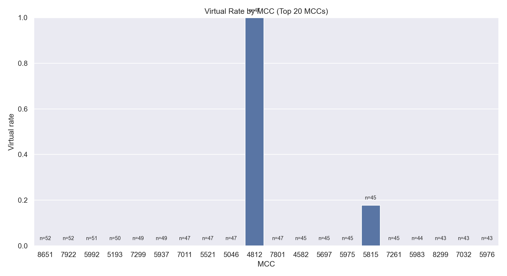

The distribution is extremely sparse. Nearly every MCC in the top‑20 set has **0% virtual**, while **MCC 4812 is 100% virtual** and MCC 5815 shows a small non‑zero rate. This is not a smooth gradient: it is effectively a hard rule switch. In a realistic system, MCCs should show a range of virtual rates with a few dominant virtual categories, not a single MCC acting as the sole trigger. This plot visually confirms that the classification layer is **binary and narrow**, which reads as synthetic rather than nuanced.

---

### 15.2 Virtual rate by channel
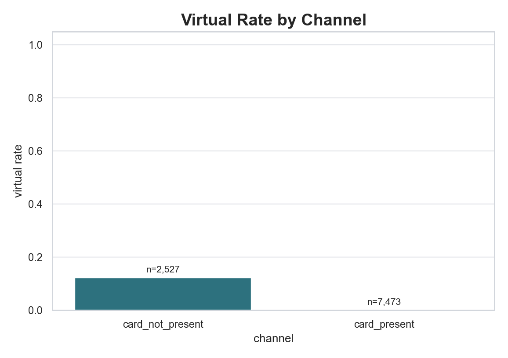

The `card_present` channel is essentially 0% virtual, while `card_not_present` sits around ~0.13. The direction makes intuitive sense, but the separation is too clean: it suggests the channel is being used as a hard gate rather than a probabilistic influence. That rigidity supports the earlier statistical finding that the classification is rule‑dominant rather than organically varied.

---

### 15.3 Virtual rate by legal country (Top 20)
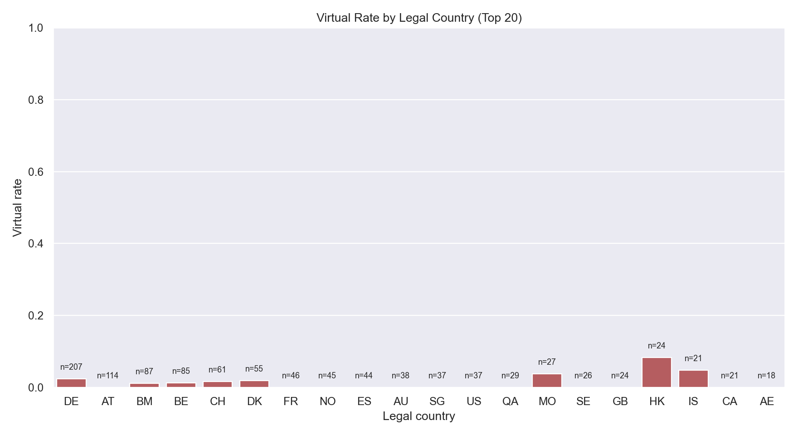

Virtual rates are near‑zero in most of the top‑20 countries, with only a couple showing modest elevation (e.g., HK, IS). This suggests very weak country sensitivity in the classification policy. A realistic overlay typically shows some geographic skew (jurisdictions with more digital‑heavy merchant mix), but this plot shows **minimal country differentiation**, reinforcing a flat synthetic profile.

---

### 15.4 MCC x Channel heatmap
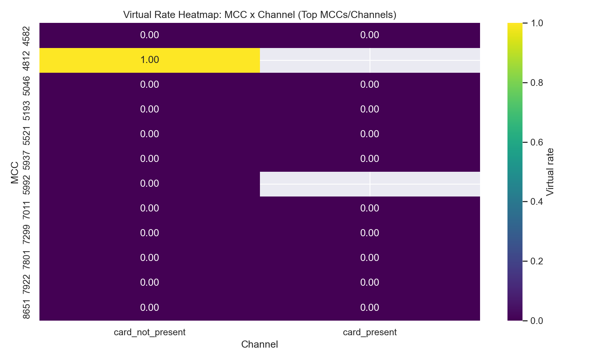

Almost every MCC‑channel cell is 0.00, with a single bright stripe at MCC 4812. This provides the clearest visual proof that the virtual classification is driven by **one dominant rule**, not a layered policy. For realism, we expect multiple MCCs to show non‑zero rates (especially within `card_not_present`), but the heatmap is essentially empty outside one cell.

---

### 15.5 Settlement locations (size/color = duplicates)
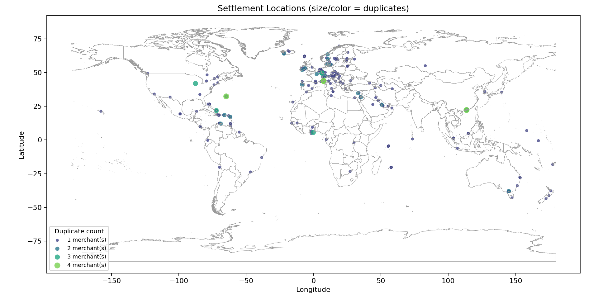

This map shows each unique settlement coordinate, with **size and color encoding how many merchants share the same coordinate**. The clustering in Europe and a few offshore hubs is clear, while much of the globe is lightly covered. This makes the concentration issue visually obvious without the ambiguity of a hexbin: the settlement anchors are plausible in isolation, but the global spread is **narrow** relative to the merchant universe. The larger/bright points indicate small pockets of duplication rather than massive collapse.

---

### 15.6 Settlement coordinate duplicate counts
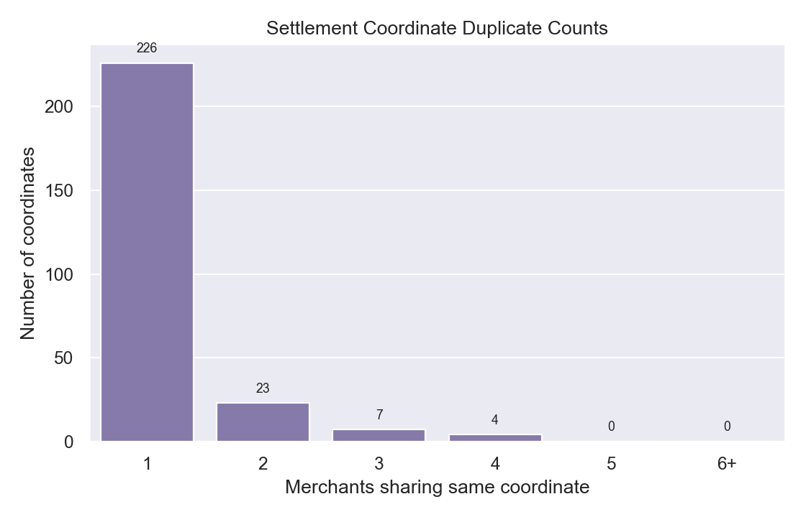

Most settlement coordinates are unique (226), and a smaller portion are shared by 2–4 merchants. There are no extreme “hotspots” with 6+ merchants. This indicates duplication exists but is not catastrophic. The realism issue here is not mass duplication; it is the **geographic concentration** of settlements in a narrow set of hubs rather than many dispersed legal anchors.

---

### 15.7 Top 15 settlement TZIDs
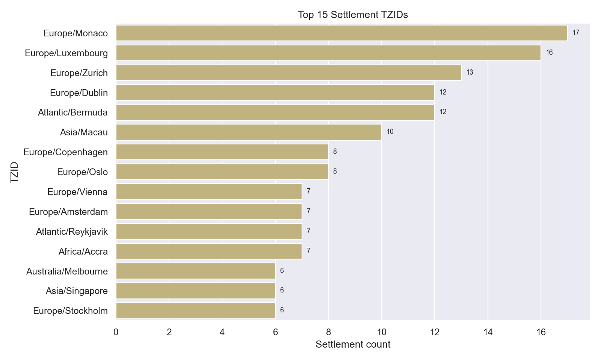

The top tzids are dominated by **Monaco, Luxembourg, Zurich, Dublin, Bermuda, Macau**, with smaller contributions from a few other cities. This confirms a strong skew toward **financial and offshore hubs**, which may be intended but reads as overly concentrated if the goal is broad synthetic realism. Without more variation in the settlement policy, this tzid distribution makes the virtual layer feel artificially anchored to a small cluster of jurisdictions.

---

**Set A + B takeaway:**
- Virtual classification is highly **binary** (single MCC + channel gating) with minimal country nuance.
- Settlement anchors are **plausible but overly concentrated** in a small set of hubs.
- These visuals reinforce the main realism concern: the virtual overlay lacks **breadth and heterogeneity**, even before we examine edges and routing.

---

## 16) Visual diagnostics (Set C: edge catalogue realism)
These plots focus on the edge catalogue itself, since it is the primary realism surface for 3B.

### 16.1 Uniformity summary (edge catalogue)
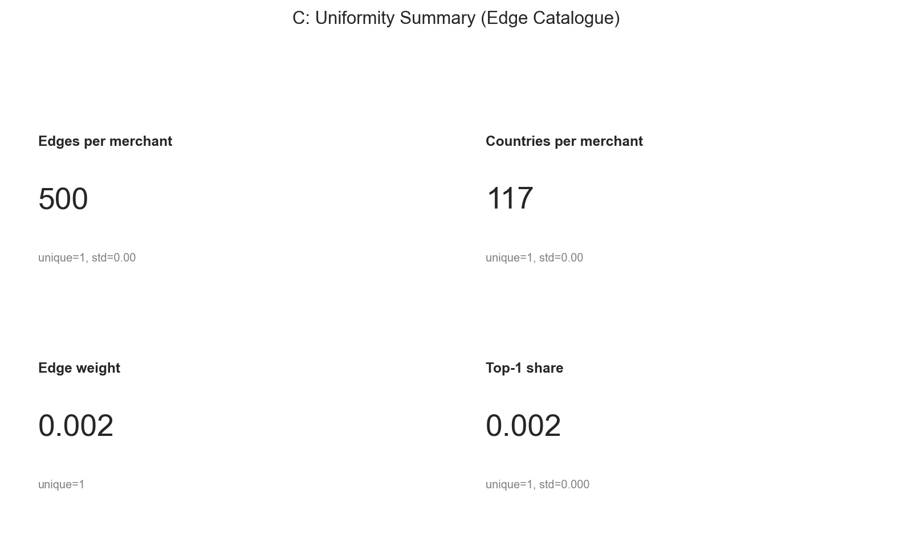

The card panel shows **single‑value outcomes** for all core metrics: every merchant has **500 edges**, every merchant appears in **117 countries**, the **edge weight is a single value (0.002)**, and the **Top‑1 share is the same for all merchants**. The “unique=1, std=0” notes confirm there is **no variability at all** across merchants. This is a visual proof of uniformity, not a plotting artifact.

---

### 16.2 Country allocation profile (Top 25 + Other)
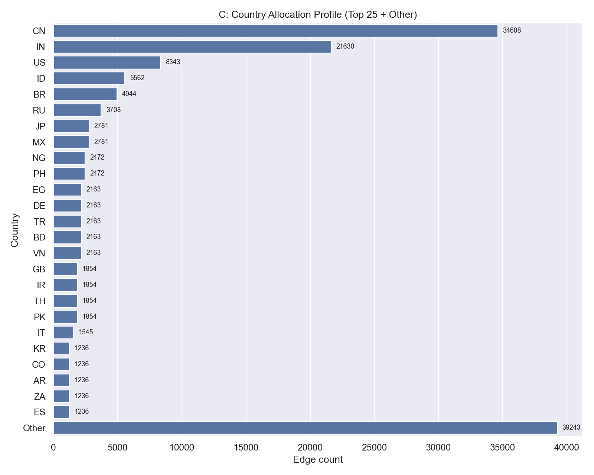

This bar chart shows the **edge count by country** with a large **“Other”** bucket. The distribution is steep: **CN and IN dominate**, followed by a long tail of smaller countries, while the “Other” bar is the largest block after the top two. The curve shape indicates a **highly skewed global allocation** rather than a flat spread, but it is a **global profile only**—it does not vary by merchant (which the next plot confirms).

---

### 16.3 Merchant country profiles (Top 5 merchants, Top 20 countries)
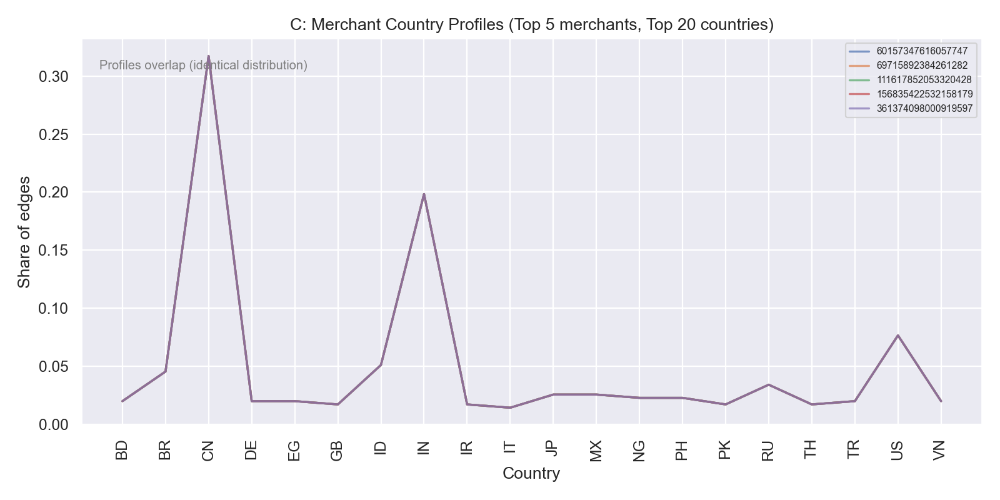

All five merchant lines **overlap almost perfectly**, with identical peaks and troughs across the same countries. The peak at **CN** is highest, **IN** is the second‑largest, and all other countries follow the same shared contour. This shows that the country allocation is **not merchant‑specific**; it is a single profile applied to every merchant, which is a major realism failure for a virtual CDN layer.

---

### 16.4 Edge location density (hexbin, log scale)
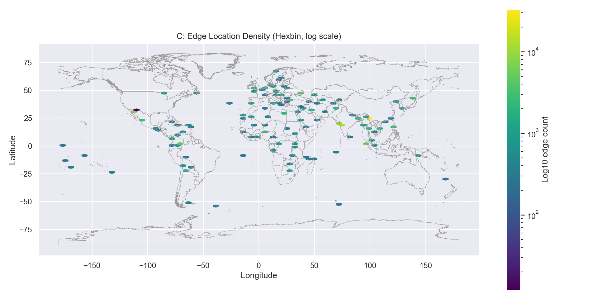

The log‑scaled density map shows **visible clustering across Europe, South Asia, and parts of East Asia**, with sparser coverage elsewhere. The pattern reflects the global country allocation (dense in the dominant countries, thinner in the tail). The map is **not uniform**, but because every merchant follows the same country profile, the geography represents a **single shared CDN footprint** rather than merchant‑specific variation.

---

**Set C takeaway:**  
- The edge catalogue is **structurally consistent but completely uniform across merchants**.  
- The global allocation profile is skewed (CN/IN heavy), but that profile is **identical for all merchants**, eliminating realistic heterogeneity.  
- The maps show real geographic clustering, but it is **one shared pattern**, not a diversity of merchant footprints.

---

## 17) Visual diagnostics (Set D + E: alias fidelity & cross‑layer coherence)
These plots verify whether alias tables preserve the weight distribution and whether edge geography aligns with settlement anchors.

### 17.1 Alias table length vs edge count
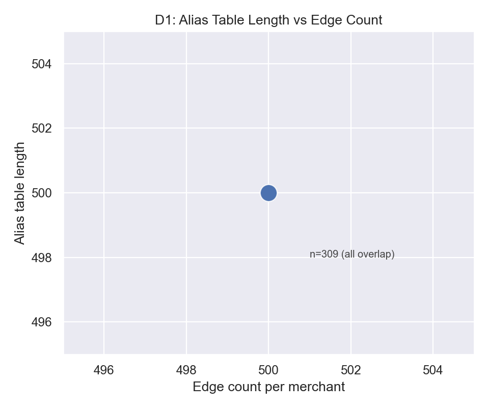

This plot collapses to a **single point** at **(500, 500)** with **n=309** overlapping merchants. That means **every merchant has exactly 500 edges** and **every alias table has exactly 500 slots**, so the alias table length scales *perfectly* with edge count — but only because the edge counts are fixed. From a correctness standpoint, this is fine: the alias index is aligned with the edge catalogue. From a realism standpoint, it is a red flag because the system is **not exercising any size variability** (small vs large merchants, regional vs global merchants). The alias mechanism is therefore never tested against different edge volumes, which makes the virtual layer feel artificially uniform.

---

### 17.2 Edge weight vs alias probability (sample merchants)
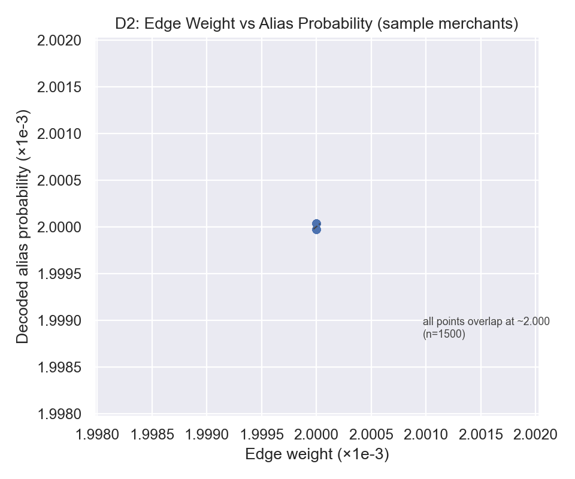

This scatter compares **decoded alias probabilities** against **edge weights** for three sample merchants (3 × 500 edges = **1,500 points**). All points overlap at **~0.002** (shown clearly by the transparent stacking), which exactly matches the edge weight **1/500**. That is excellent for **alias fidelity**: decoding the blob reproduces the weights without drift or distortion. However, it also shows that the **entire weight distribution is flat**, so the alias layer faithfully preserves uniformity rather than introducing realistic skew. In realism terms, routing will sample edges as if every location is equally likely, which contradicts how real CDN footprints and merchant traffic usually behave.

---

### 17.3 Edge distance to settlement (log10 km)
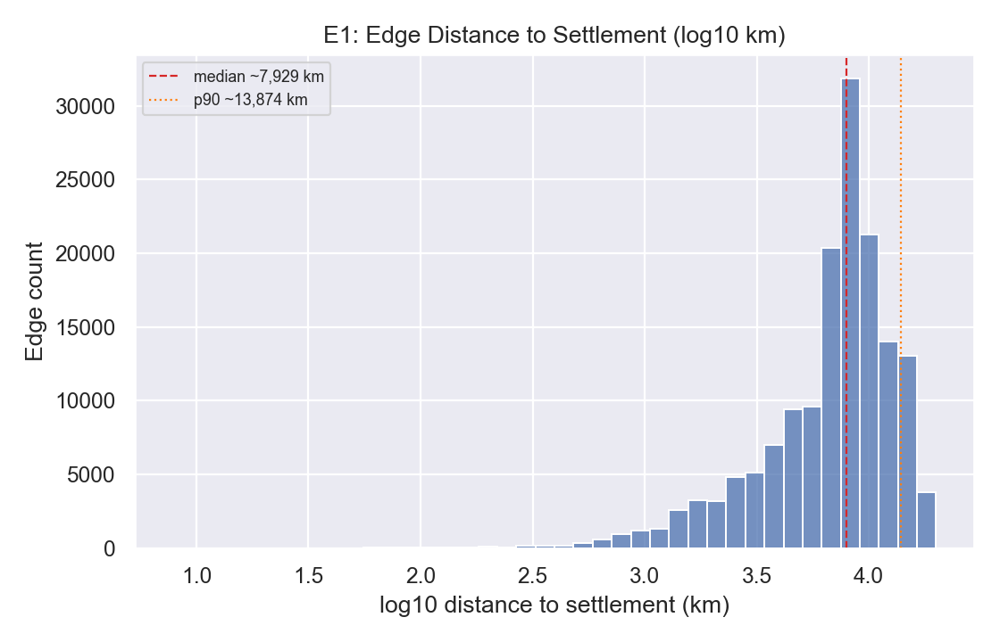

The histogram is plotted on **log10 distance**, which makes the distribution much easier to read. Most of the mass sits between **log10 ≈ 3.6–4.1**, i.e., **~4,000–12,500 km**, with a **median ~7,929 km** and **p90 ~13,874 km**. That means the typical edge for a merchant is **an ocean away** from its settlement anchor. This is consistent with a fully global footprint, but it also implies **almost no geographic pull toward settlement hubs**. If the intent is to model legal‑anchor influence or regional operational bias, this distance profile is too extreme and reads as *globally randomized* rather than anchored.

---

### 17.4 Edge share in settlement country (Top settlement countries)

The zoomed panel (0–7%) makes the overlap visible: **almost every settlement country is near‑zero**, including the **UNK** group (n=17), which indicates settlements that could not be resolved into a polygon. The **US** is the only country with a modest self‑overlap (~0.05), while the **global baseline is ~0.01**, so even the “best” country is only a few points above the global average. The full‑scale panel confirms that **no settlement country ever dominates** its own edge allocation. This is a strong cross‑layer mismatch: the settlement jurisdiction does **not** meaningfully influence the edge geography. For realism, we would expect at least **some** settlement countries to show higher internal overlap, especially for smaller or regionally‑focused merchants.

---

**Set D + E takeaway:**  
- The alias layer is **faithful but mirrors uniformity**: it preserves weights exactly, which means it also preserves the flat distribution.  
- Cross‑layer coherence is **weak**: edges are mostly far from settlement anchors and rarely fall inside the settlement country.  
- For realism, this undermines the intuition that a virtual merchant’s operational footprint should retain at least **some** bias toward its legal anchor.
