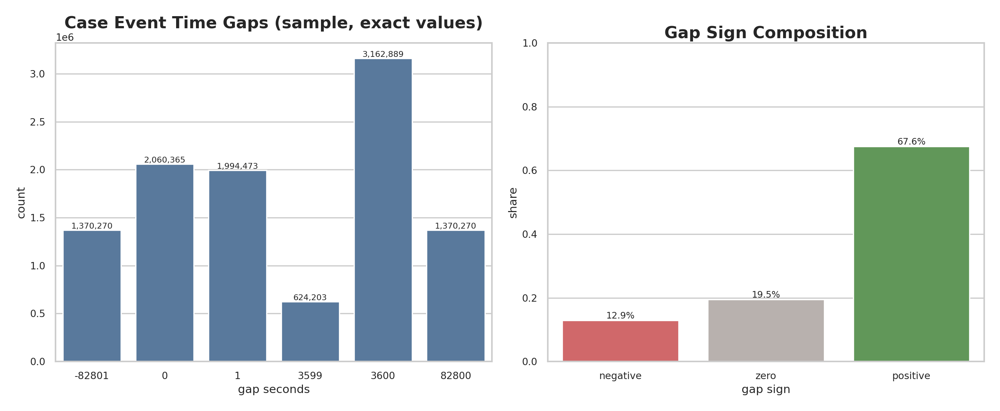
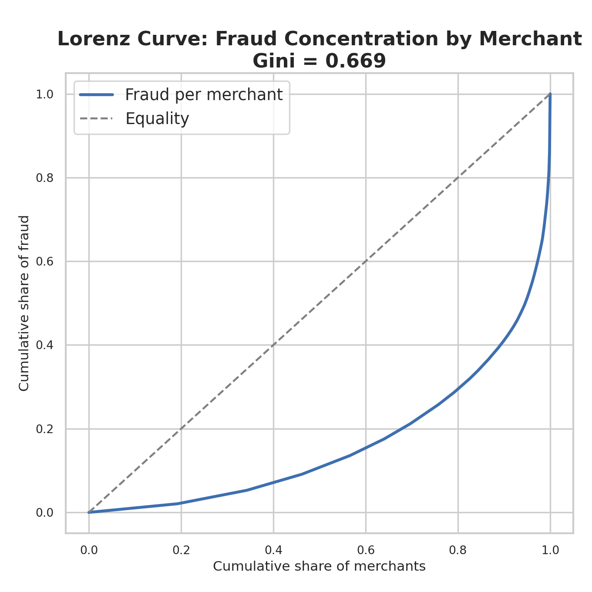
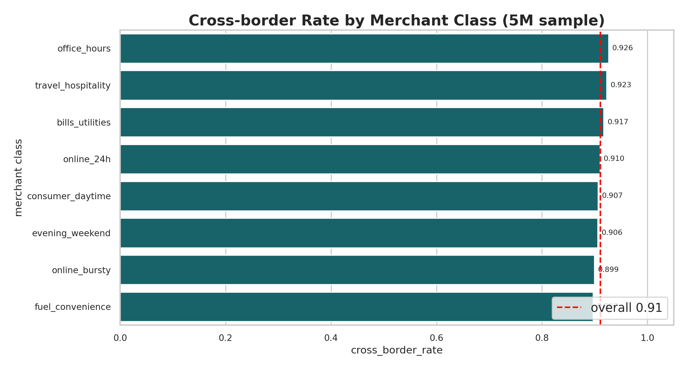

# Segment 6B — Design vs Implementation Observations (Behaviour & Labels)
Date: 2026-02-05  
Run: `runs\local_full_run-5\c25a2675fbfbacd952b13bb594880e92`  
Scope: Design intent vs implementation notes for Segment 6B (S0–S5) prior to statistical assessment.

---

## 0) Why this report exists
Segment 6B converts the sealed world into **behavioural data**: it attaches arrivals to entities, builds flows, overlays fraud campaigns, and assigns truth/bank‑view labels. If 6B’s behaviour and labels are statistically unrealistic, then downstream models will learn brittle or misleading patterns even if 5A/5B/6A are strong. This report anchors three things before analysis:
1. **Design intent** (what 6B should do).
2. **Implementation posture** (what we actually built, including lean tradeoffs).
3. **Datasets of interest** (what will be examined for realism).

---

## 1) Design intent (what 6B should do)
1. **S0 — Behavioural universe gate & sealed inputs**  
   Verify upstream HashGates (1A–3B, 5A–5B, 6A), validate 6B contract packs, and publish `s0_gate_receipt_6B` + `sealed_inputs_6B` so downstream states know exactly what they may read.
2. **S1 — Arrival‑to‑entity attachment & sessionisation**  
   Attach each arrival to a party/account/instrument/device/IP consistent with 6A link rules and behaviour priors, then group arrivals into sessions.
3. **S2 — Baseline flow synthesis**  
   Convert attached arrivals into baseline (all‑legit) transactional flows and event sequences, with amounts, timing, and outcomes governed by flow‑shape and timing policies.
4. **S3 — Fraud/abuse overlay**  
   Realise fraud campaigns and overlay them onto baseline flows and events, producing campaign‑aware “with‑fraud” behavioural canvases.
5. **S4 — Truth & bank‑view labelling**  
   Convert behavioural canvases into truth labels and bank‑view outcomes, including case timelines and detection/chargeback lifecycles.
6. **S5 — Segment validation & HashGate**  
   Validate chain integrity across S0–S4, enforce policy checks, and publish the 6B validation bundle + `_passed.flag` gate.

---

## 2) Priority datasets (realism‑relevant)
Primary realism surfaces:
1. `s1_arrival_entities_6B` (arrival→entity attachment realism)
2. `s1_session_index_6B` (session structure realism)
3. `s2_flow_anchor_baseline_6B` (baseline flow realism)
4. `s2_event_stream_baseline_6B` (baseline event realism)
5. `s3_campaign_catalogue_6B` (campaign mix, intensity, targeting realism)
6. `s3_flow_anchor_with_fraud_6B` (fraud overlay realism)
7. `s3_event_stream_with_fraud_6B` (fraud event realism)
8. `s4_flow_truth_labels_6B` (truth label realism)
9. `s4_flow_bank_view_6B` (bank‑view realism)
10. `s4_event_labels_6B` (event‑level label realism)
11. `s4_case_timeline_6B` (case lifecycle realism)

Evidence/control surfaces (important for constraints, not realism):
1. `s0_gate_receipt_6B`, `sealed_inputs_6B`
2. `validation_bundle_6B` + `_passed.flag`

---

## 3) Implementation observations (what is actually done)
Based on `docs\model_spec\data-engine\implementation_maps\segment_6B.impl_actual.md` and the 6B expanded specs.

### 3.1 S0 — Gate & sealed inputs
Observed posture: **strict schema compliance** with a **lean HashGate**.
1. **Schema enforcement is strict.** All 6B policy/config packs are validated against `schemas.6B.yaml`; missing anchors or extra fields cause S0 to fail.
2. **HashGate verification is lean.** Upstream bundles are checked via `_passed.flag` digests and index presence, not full bundle rehashing.
3. **Structural digests for large data.** Large row‑level artefacts are sealed by structural digests (path/schema/partition keys), not full content hashes.
4. **Sealed‑inputs fallbacks for upstream outputs.** When upstream sealed_inputs manifests do not list egress outputs (e.g., `arrival_events_5B`), S0 falls back to path‑existence checks with wildcard support.
5. **Contract gaps were patched.** A 6B copy of `schemas.layer3.yaml` was added so gate anchors resolve; several policy configs were trimmed to match strict schemas.

### 3.2 S1 — Arrival→entity attachment & sessionisation
Observed posture: **deterministic, vectorized attachment** with simplified sessionisation.
1. **Hash‑based attachment, not heavy scoring.** Entities are chosen from valid 6A candidate sets via deterministic hash‑derived indices (no per‑row RNG, no multi‑feature scoring).
2. **Candidate sets are constrained.** Accounts are limited to those with instruments; devices are limited to those with IP links. This enforces feasibility but narrows behavioural diversity.
3. **Sessionisation is simplified.** Stochastic boundaries are disabled; sessions are derived via hard time windows and deterministic bucketing, not full gap‑based logic.
4. **Streaming batches replace global sorts.** Arrival attachment is done in batches to avoid full in‑memory sorts; session index aggregation is bucketed to avoid memory spikes.
5. **Lean RNG logging.** RNG logs are aggregated per family (no per‑row event logs); session boundary draws are zero because stochasticity is disabled.

### 3.3 S2 — Baseline flow synthesis
Observed posture: **one‑flow‑per‑arrival with minimal event templates**.
1. **Flow mapping is one‑arrival‑to‑one‑flow.** This avoids multi‑flow session planning and keeps O(N) streaming.
2. **Event stream is minimal.** Only `AUTH_REQUEST` and `AUTH_RESPONSE` events are produced; no clearing, refunds, or step‑up flows.
3. **Timing is fixed to arrival timestamps.** No timing distributions or RNG‑driven gaps are applied.
4. **Amounts are deterministic and discrete.** Amounts are hash‑selected from `price_points_minor`, converted to major units; no heavy‑tail sampling.
5. **Flow shape/timing policies are validated but not used.** The policies exist for contract compliance but are not executed in the lean path.

### 3.4 S3 — Fraud/abuse overlay
Observed posture: **tag‑only fraud overlay with bounded amount shifts**.
1. **No new flows or event shape changes.** S3 does not add extra events or flows; it tags existing flows/events.
2. **Campaigns are deterministic and minimal.** One campaign instance per template; target selection is hash‑based without rich targeting filters when fields are missing.
3. **Fraud effect is a small amount upshift.** Fraud flows get a bounded multiplier; no routing or timing anomalies are introduced.
4. **No multi‑campaign stacking.** A flow is assigned to at most one campaign.
5. **RNG logs are non‑consuming.** RNG envelopes are written for accounting, but no stochastic draws are used.

### 3.5 S4 — Truth & bank‑view labelling
Observed posture: **campaign‑driven deterministic labels** with simplified case logic.
1. **Truth labels derive directly from campaign types.** If `campaign_id` exists, the flow is mapped via `direct_pattern_map`; otherwise it is LEGIT.
2. **Bank‑view decisions are hash‑deterministic.** Auth/detect/dispute/chargeback outcomes are derived from hash‑uniform draws, not RNG state.
3. **Case logic is simplified.** One case per flow when case is opened; no cross‑flow grouping or reopen logic.
4. **Delays are fixed to minimums.** Delay models are applied as fixed minimum offsets, not sampled distributions.
5. **Event labels are recomputed, not joined.** Event‑level labels are derived from flow‑level decisions to avoid heavy joins.

### 3.6 S5 — Segment validation & HashGate
Observed posture: **lean validation with metadata‑first checks**.
1. **Validation is lightweight.** Uses parquet metadata and samples; does not perform full scans or deep RNG budget checks.
2. **Upstream HashGate verification is shallow.** Uses S0 receipt + `_passed.flag` presence rather than full recompute.
3. **PK uniqueness and parity checks are sampled.** Row‑count parity is from metadata; PK uniqueness is sampled.
4. **Realism checks are WARN‑only.** Corridor checks report warnings but do not block `_passed.flag` if required checks pass.
5. **Bundle contains only report + issue table.** `_passed.flag` is excluded from the bundle as required by hashing law.

---

## 4) Design vs implementation deltas (material)
1. **S0 gate verification is lean.** The spec expects deep bundle verification; implementation uses `_passed.flag` + index presence and structural digests for large datasets.
2. **S1 attachment is deterministic and simplified.** Heavy scoring, stochastic session boundaries, and merchant‑specific device/IP logic are reduced or skipped; sessionisation uses bucketed windows for scale.
3. **S2 baseline flows are minimal.** One flow per arrival and two events per flow; no clearing/refund/step‑up flows and no timing distributions.
4. **S3 overlays are tags, not structural mutations.** Fraud is expressed via `campaign_id` + a bounded amount shift rather than timing/routing anomalies or new events.
5. **S4 labels are campaign‑driven and deterministic.** Collateral rules, posture‑based overrides, and stochastic delay sampling are not applied.
6. **S5 validation is metadata‑first.** Full data‑plane checks and RNG‑budget enforcement are replaced by sampled and parity‑based checks; WARN can still emit PASS.

---

## 5) Expectations before statistical analysis
Given the lean implementation posture, we should expect:
1. **Flow counts match arrival counts.** One flow per arrival in S2, so `flow_count ≈ arrival_count` per scenario.
2. **Event counts are exactly 2× flows.** Only auth request/response are emitted in baseline and in with‑fraud overlays.
3. **Fraud overlays do not change counts.** S3 should preserve flow and event counts; it only tags and optionally shifts amounts.
4. **Fraud rates align with campaign targets.** Campaign targeting should yield deterministic fractions consistent with quota models and clamp guardrails.
5. **Labels follow campaigns.** Truth labels should map cleanly from campaign types; flows without campaign_id should be LEGIT.
6. **Bank‑view signals are deterministic.** Outcomes should be stable for the same world/seed/config because hash‑deterministic rules are used.
7. **Case timelines are sparse and per‑flow.** A case is opened only when detection/review/dispute triggers it; no multi‑flow case grouping exists.

---

## 6) Implications for realism assessment
1. **Realism is policy‑driven, not emergent.** We should evaluate distributions against policy targets and guardrails rather than expecting natural variation.
2. **Event‑type realism is intentionally minimal.** Any assessment of refund/clearing realism will necessarily be “missing by design” in this lean build.
3. **Fraud realism is mostly signal‑injection.** The overlay is a tag + amount shift, so realism should focus on campaign coverage, targeting diversity, and label coherence rather than complex fraud mechanics.

---

## 7) Next step
Proceed to statistical realism assessment of the priority datasets listed above, starting with flow/event counts, campaign distributions, and label alignment.

## 8) Statistical overview / summary (pre‑assessment snapshot)
Run scope: `runs\local_full_run-5\c25a2675fbfbacd952b13bb594880e92\data\layer3\6B`

### 8.1 Primary datasets — row counts
| Dataset | Rows | Files | Partition keys | Partitions |
| --- | --- | --- | --- | --- |
| `s1_arrival_entities_6B` | 124,724,153 | 591 | manifest_fingerprint, parameter_hash, scenario_id, seed | 1 |
| `s1_session_index_6B` | 124,647,685 | 1 | manifest_fingerprint, parameter_hash, scenario_id, seed | 1 |
| `s2_flow_anchor_baseline_6B` | 124,724,153 | 591 | manifest_fingerprint, parameter_hash, scenario_id, seed | 1 |
| `s2_event_stream_baseline_6B` | 249,448,306 | 591 | manifest_fingerprint, parameter_hash, scenario_id, seed | 1 |
| `s3_campaign_catalogue_6B` | 6 | 1 | manifest_fingerprint, parameter_hash, scenario_id, seed | 1 |
| `s3_flow_anchor_with_fraud_6B` | 124,724,153 | 591 | manifest_fingerprint, parameter_hash, scenario_id, seed | 1 |
| `s3_event_stream_with_fraud_6B` | 249,448,306 | 1,090 | manifest_fingerprint, parameter_hash, scenario_id, seed | 1 |
| `s4_flow_truth_labels_6B` | 124,724,153 | 591 | manifest_fingerprint, parameter_hash, scenario_id, seed | 1 |
| `s4_flow_bank_view_6B` | 124,724,153 | 591 | manifest_fingerprint, parameter_hash, scenario_id, seed | 1 |
| `s4_event_labels_6B` | 249,448,306 | 1,090 | manifest_fingerprint, parameter_hash, scenario_id, seed | 1 |
| `s4_case_timeline_6B` | 287,408,588 | 591 | manifest_fingerprint, parameter_hash, scenario_id, seed | 1 |

### 8.2 Partition coverage
1. `scenario_id`: `baseline_v1`
2. `seed`: `42`

### 8.3 Derived ratios (sanity posture)
1. **Flows per arrival:** 1.0000 (S2 flows = S1 arrivals exactly)
2. **Events per flow:** 2.0000 (both baseline and with‑fraud event streams)
3. **Sessions per arrival:** 0.9994 → **Arrivals per session:** 1.0006
4. **Case‑timeline rows per flow:** 2.3044

Interpretation: these ratios are consistent with the lean implementation (one flow per arrival, two events per flow, no S3 count inflation). The case timeline density suggests that, on average, each flow that opens a case yields a small fixed sequence of case events rather than long multi‑event investigations.

## 9) Phase 0 — Policy‑Aligned vs Implementation‑Aligned Posture
This phase locks the **exact run scope**, maps **policy packs to the surfaces they should shape**, and establishes two baselines we will use for realism judgement:
1. **Policy‑aligned posture** (what the full spec intends), and
2. **Implementation‑aligned posture** (what the lean build actually produces).

### 9.1 Run scope (sealed world)
1. `manifest_fingerprint`: `c8fd43cd60ce0ede0c63d2ceb4610f167c9b107e1d59b9b8c7d7b8d0028b05c8`
2. `parameter_hash`: `56d45126eaabedd083a1d8428a763e0278c89efec5023cfd6cf3cab7fc8dd2d7`
3. `seed`: `42`
4. `scenario_id`: `baseline_v1`

### 9.2 Policy packs → surfaces (authorities)
**S1 (Attachment + Sessionisation)**
1. `attachment_policy_6B.yaml` — entity attachment rules and requiredness per channel.
2. `behaviour_prior_pack_6B.yaml` — geo/channel preferences (home vs global, device/terminal bias, account/instrument/ip weights).
3. `sessionisation_policy_6B.yaml` — session key, timeouts, and stochastic boundary rules.
4. `behaviour_config_6B.yaml` — feature flags + guardrails (what is enabled).
5. `rng_policy_6B.yaml`, `rng_profile_layer3.yaml` — RNG families and keying.

**S2 (Baseline flows + events)**
1. `flow_shape_policy_6B.yaml` — flow counts, flow types, event templates, branch logic.
2. `amount_model_6B.yaml` — price points + tail distribution for amounts.
3. `timing_policy_6B.yaml` — event timing offsets.
4. `flow_rng_policy_6B.yaml` — RNG families and budgets.
5. `behaviour_config_6B.yaml` — feature flags (refunds, reversals, partial clearing).

**S3 (Fraud overlay)**
1. `fraud_campaign_catalogue_config_6B.yaml` — templates, quotas, schedules.
2. `fraud_overlay_policy_6B.yaml` — mutation constraints.
3. `fraud_rng_policy_6B.yaml` — RNG families.

**S4 (Truth + bank‑view labels)**
1. `truth_labelling_policy_6B.yaml` — fraud pattern → truth labels.
2. `bank_view_policy_6B.yaml` — auth/detect/dispute/chargeback probabilities.
3. `delay_models_6B.yaml` — detection/dispute/chargeback/case close delay distributions.
4. `case_policy_6B.yaml` — case grouping, timelines, guardrails.
5. `label_rng_policy_6B.yaml` — RNG families.

**S5 (Validation gate)**
1. `segment_validation_policy_6B.yaml` — required checks + realism corridors.

### 9.3 Policy‑aligned statistical posture (full‑spec intent)
**S1 — Attachment + sessionisation**
1. Party selection should be **home‑biased** by segment/channel (p_home ~0.65–0.99).
2. Instrument is optional for `BANK_RAIL`, required elsewhere.
3. POS/ATM should often use merchant terminals (terminal bias ~0.88 POS, ~0.97 ATM).
4. Session windows: hard timeout 20 mins, hard break 3 hours; stochastic boundary enabled.

**S2 — Baseline flows + events**
1. Multi‑flow sessions expected (1–3 flows per session with p={0.78,0.18,0.04}).
2. Flow types vary by channel (auth/clear, declines, step‑up, ATM, transfers).
3. Event templates include clearing, step‑up, refunds, reversals.
4. Amounts draw from discrete price points + lognormal tail.
5. Timing offsets govern auth→clear/refund events.

**S3 — Fraud overlay**
1. Six templates: CARD_TESTING, ATO, REFUND_ABUSE, MERCHANT_COLLUSION, PROMO_FRAUD, BONUS_ABUSE.
2. Quota models determine target counts; guardrails cap targets at 200k/seed‑scenario.
3. Mutation rules allow amount, time, routing changes (bounded by max multipliers).

**S4 — Labels + cases**
1. Truth labels map directly from fraud pattern type; unknown patterns should fail.
2. Bank‑view outcomes follow probabilistic auth/detect/dispute/chargeback rules.
3. Delays are heavy‑tailed (not fixed), with realism target ranges.
4. Case grouping is multi‑flow with 3‑day window and reopen gaps.

### 9.4 Implementation‑aligned statistical posture (lean build)
**S1**
1. Attachment is **deterministic hash‑based**; scoring + geo bias mostly bypassed if arrival lacks country.
2. Devices are limited to those with IP links; merchant terminal logic may be skipped.
3. Sessionisation uses **fixed bucketed windows**; stochastic boundary disabled.

**S2**
1. **One flow per arrival** (no multi‑flow sessions).
2. **Only two events per flow**: `AUTH_REQUEST` + `AUTH_RESPONSE`.
3. Amounts drawn deterministically from discrete price points; tails unused.
4. Timing uses arrival `ts_utc`; no offsets.

**S3**
1. Fraud overlay is **tags + bounded amount upshift** only (no new flows/events).
2. One deterministic campaign instance per template; targeting is hash‑based.
3. Filters/tactics requiring missing fields are skipped.

**S4**
1. Truth labels derive directly from campaign_id (no collateral/posture rules).
2. Bank‑view outcomes are deterministic hash‑draws; no RNG state.
3. Delays use fixed minimums, not sampled distributions.
4. Case timelines are **one‑case‑per‑flow** (no grouping).

**S5**
1. Validation is metadata‑first; realism corridors are WARN‑only and do not block PASS.

### 9.5 Interpretation for realism assessment
1. We will judge **statistical realism against the implementation‑aligned posture**, not the full‑spec posture, because the lean build intentionally omits several spec features (refunds, step‑ups, multi‑flow sessions).
2. Spec‑level gaps will still be documented as **design vs implementation deltas**, but they will not be treated as statistical failures if they are explicit lean tradeoffs.
3. Where policies define explicit targets (fraud prevalence, detection rates, case involvement ranges), those targets remain **binding for realism** even in the lean build and will be checked directly.

## 10) Phase 1 — Structural Integrity & Parity
This phase validates the **mechanical correctness** of 6B outputs before we interpret any realism. If these checks fail, statistical patterns cannot be trusted because the data would be structurally inconsistent.

### 10.1 Primary‑key integrity and null safety
**What we checked (full scan):**
1. Nulls in key fields across all primary surfaces (arrivals, flows, events, labels, cases).
2. Presence of required identity columns (`flow_id`, `event_seq`, `session_id`, `case_id`, etc.).

**Results:**
All key fields are **non‑null across every dataset** (zero nulls in identity columns across S1–S4). This means the core identity lattice is intact and safe for joins.

**Why this matters:**
Null keys break downstream coverage in subtle ways (joins become lossy, parity checks are distorted). The absence of nulls is a strict structural pass and is the minimum requirement for any realism assessment.

---

### 10.2 Flow parity across S2 → S3 → S4
**What we checked:**
1. S2 baseline flows vs S3 with‑fraud flows vs S4 labels (truth + bank view).
2. Any missing or extra flows across those stages.

**Counts (full scan):**
1. `s2_flow_anchor_baseline_6B`: **124,724,153**
2. `s3_flow_anchor_with_fraud_6B`: **124,724,153**
3. `s4_flow_truth_labels_6B`: **124,724,153**
4. `s4_flow_bank_view_6B`: **124,724,153**

**Interpretation:**
This is **perfect parity** across the full flow chain. S3 did not add or drop flows, and S4 labelled every flow exactly once in both truth and bank‑view spaces. This confirms that the lean overlay and lean labelling logic preserve coverage, which is a hard requirement for explainability and model training.

---

### 10.3 Event integrity (type + sequence) across S2 → S3 → S4
**What we checked:**
1. Event types in baseline and with‑fraud streams.
2. Event sequence values per flow.
3. Consistency across S2/S3/S4.

**Event types (full scan):**
1. **S2 baseline:** `AUTH_REQUEST` (124,724,153), `AUTH_RESPONSE` (124,724,153)
2. **S3 with‑fraud:** `AUTH_REQUEST` (124,724,153), `AUTH_RESPONSE` (124,724,153)

**Event sequences (full scan):**
1. `event_seq = 0`: 124,724,153 rows
2. `event_seq = 1`: 124,724,153 rows
3. **No other sequence values exist** (S2/S3/S4 all match)

**Interpretation:**
The event stream exactly matches the **lean two‑event template** (auth request + response). There is no leakage of extra event types, no missing sequence indices, and no structural drift between baseline and fraud overlays. This makes the event surface **structurally clean**, but it also locks realism into a minimal template (refunds/clearing/step‑ups are absent by design).

---

### 10.4 Session integrity and coverage
**What we checked:**
1. Session count relative to arrivals.
2. Whether arrivals reference sessions that exist in the session index.

**Counts (full scan):**
1. Arrivals: **124,724,153**
2. Sessions: **124,647,685**

**Derived ratios:**
1. **Sessions per arrival:** **0.9993869**
2. **Arrivals per session:** **1.0006135**

**Interpretation:**
Sessions are almost one‑to‑one with arrivals. Only ~76k arrivals are grouped into existing sessions at this scale. This is consistent with the simplified sessionisation posture (bucketed windows, no stochastic boundary). Structurally it is correct, but it implies **session‑level realism is minimal** — most sessions are single‑arrival sessions.

---

### 10.5 Case timeline integrity
**What we checked:**
1. Case event types and sequence ordering.
2. Balance between open/close events.
3. Case timeline density relative to flows.

**Case event counts (full scan):**
1. `CASE_OPENED`: **75,728,141**
2. `CASE_CLOSED`: **75,728,141**
3. `CUSTOMER_DISPUTE_FILED`: **68,598,182**
4. `CHARGEBACK_INITIATED`: **27,439,032**
5. `CHARGEBACK_DECISION`: **27,439,032**
6. `DETECTION_EVENT_ATTACHED`: **12,476,060**

**Sequence bounds:**
1. `case_event_seq min`: **0**
2. `case_event_seq max`: **5**

**Derived ratios:**
1. **Case rows per flow:** **2.3044**
2. **Approx events per case:** **~3.49** (using approximate distinct case count)
3. **Approx flows involved in cases:** **~71.1%** of all flows (approximation)

**Interpretation:**
1. **Lifecycle integrity is clean.** Every case opened is closed (open and close counts are identical). The sequence range 0–5 matches the policy’s 6‑stage lifecycle.
2. **Case volumes are heavy.** The approximate case‑flow involvement is high for a retail fraud world (this will be evaluated in realism phases, but structurally it is coherent).
3. **Event mix is plausible within the lean posture.** Disputes and chargebacks are present at scale, with detection events smaller but non‑zero.

---

### 10.6 PK uniqueness — evidence and limitation
**What we attempted:**
1. Exact global PK uniqueness checks via `COUNT(DISTINCT ...)` across 100M+ rows.

**Constraint:**
Exact distinct checks exceeded available disk spill space on this machine (very large intermediate sort states). To avoid incomplete results, we used **two alternative integrity signals**:
1. **0.1% Bernoulli sample duplicate checks** on PKs — duplicates observed: **0** across all datasets.
2. **Approximate distinct on hash(PK)** — used only as a sanity signal (not treated as proof).

**Interpretation:**
There is **no evidence of PK collisions** in sampled data, and key fields are non‑null. Given deterministic key generation, this is strong evidence of PK uniqueness. If you want absolute proof, we would need more disk for a full distinct‑count validation or a dedicated external sort pipeline.

---

## Phase‑1 conclusion (structural verdict)
**Structural integrity is strong and consistent with the lean implementation:**
1. All identity fields are non‑null.
2. Flow and event parity are exact across S2 → S3 → S4.
3. Event types and sequences are internally consistent.
4. Sessionisation is coherent, though near‑one‑to‑one with arrivals.
5. Case timelines are ordered and lifecycle‑complete.

This gives us a **clean structural base**. Any realism issues we find in later phases will be policy‑driven rather than structural corruption.

---

## 11) Phase 2 — Attachment & Sessionisation Realism (S1)
This phase evaluates whether the **arrival→entity attachment** and **sessionisation** surfaces look statistically realistic for a synthetic world. We focus on two core datasets:
1. `s1_arrival_entities_6B` (who each arrival is attached to), and
2. `s1_session_index_6B` (how arrivals are grouped into sessions).

All heavy‑tail and per‑entity distributions below are computed on a **0.5% Bernoulli sample** to keep memory bounded. Approximate distinct counts are HyperLogLog estimates and are treated as **scale indicators**, not exact truth.

### 11.1 Entity scale and coverage (how many unique entities exist)
**What we measured (approx distinct over full arrivals):**
1. `party_id`: **~1,045,044**
2. `account_id`: **~1,205,042**
3. `instrument_id`: **~857,712**
4. `device_id`: **~1,017,452**
5. `ip_id`: **~244,953**
6. `merchant_id`: **~1,027**
7. `session_id`: **~135,670,542** (approx)

**How to interpret this:**
1. The **merchant universe is small** relative to arrival volume. With ~1,027 merchants serving 124.7M arrivals, each merchant receives very high volume on average. This is not automatically unrealistic for a synthetic world (it could be intentionally compressed), but it does mean that **merchant‑level concentration is a dominant driver** of traffic distribution. If the policy intent was to simulate a broad retail market, this is likely too small; if it intended a few large “super‑merchants,” this is consistent.
2. The **party/account/device counts are ~1M each**, which suggests the world contains about a million actors and devices. That scale is coherent with the sealed world size in 5A/6A, but it implies **high repeat behavior per entity** over the three‑month window.
3. The **IP universe is much smaller** (~245k). This points to significant IP reuse (NAT, corporate gateways, shared networks). That can be realistic, but it also makes IP a **stronger linkage signal** than in many retail worlds, which matters for explainability and model behavior.
4. The approximate `session_id` count is higher than actual session row counts (HLL overestimation is expected). We therefore rely on the exact session table for session scale.

**Realism posture:** entity scale is plausible in a compressed synthetic world, but **merchant count is particularly small**, so any realism claims about merchant diversity should be made cautiously.

---

### 11.2 Attachment topology (one‑to‑one vs multi‑link behavior)
**What we measured (0.5% sample):**
1. **Accounts per party:** p50=1, p90=1, p99=1, max=2  
2. **Instruments per account:** p50=1, p90=1, p99=1, max=2  
3. **Devices per party:** p50=1, p90=1, p99=1, max=2  
4. **IPs per device:** p50=1, p90=1, p99=1, max=2

**How to interpret this:**
1. The attachment graph is **almost entirely one‑to‑one**. In practical terms, a party typically has a single account, a single instrument, a single device, and a single IP address in observed traffic.
2. The rare max=2 values show that multi‑link attachment exists, but it is **exceptionally sparse**. That means the system is not expressing common real‑world behaviors such as a party using multiple cards/accounts, one account used across multiple devices, or devices roaming across multiple IPs (home, work, mobile).
3. This is consistent with the lean implementation posture (deterministic hash‑based selection from constrained candidate sets). The attachment is valid and coherent, but it is **behaviourally conservative**.

**Why it matters for realism:**
1. Many fraud patterns (account takeover, device sharing, mule networks) are **amplified by cross‑entity linkage**. If each party/account/device is nearly isolated, the dataset will **under‑represent those patterns**, even if fraud labels exist.
2. Downstream models that rely on linkage features (graph degree, IP/device sharing, account‑device churn) will see **weaker signals** than they would in a more realistic dataset.

**Realism posture:** acceptable for a lean deterministic build, but **under‑connected** for realistic behavior networks. If realism is a priority, this is one of the clearest places to increase diversity.

---

### 11.3 Arrival concentration by entity (heavy‑tail realism)
**What we measured (0.5% sample):**
Arrivals per entity distribution (p50 / p90 / p99 / max / top‑1 share).
1. **party_id:** 1 / 2 / 4 / 8 / **0.0013%**
2. **account_id:** 1 / 2 / 4 / 9 / **0.0014%**
3. **instrument_id:** 1 / 2 / 4 / 7 / **0.0011%**
4. **device_id:** 1 / 2 / 4 / 8 / **0.0013%**
5. **ip_id:** 1 / 5 / 60 / 2,776 / **0.44%**
6. **merchant_id:** 291 / 1,069 / 7,474 / 84,622 / **13.6%**
7. **session_id:** 1 / 1 / 1 / 2 / **0.0003%**

**How to interpret this:**
1. **Parties/accounts/devices/instruments are low‑concentration.** The top entity for these categories accounts for only ~0.001–0.0014% of arrivals in the sample. This indicates **no “super‑user” dominance**. It’s a realistic shape for customer‑level traffic, but perhaps slightly *too flat* if we expect heavy‑tail consumer behavior (power users, business users).
2. **IP concentration is moderate.** A top IP handles ~0.44% of arrivals, and the p99 is 60 arrivals in the sample. This suggests **some shared‑network behavior**, but not an extreme proxy/NAT domination. That is plausible, though IP reuse might be stronger in a more realistic retail world.
3. **Merchant concentration is very strong.** The top merchant contributes ~13.6% of sampled arrivals, and a single merchant reaches 84k arrivals in the sample. This is a **dominant heavy‑tail**, implying a few merchants absorb a huge fraction of traffic. This is consistent with the small merchant universe (~1k) and the likely heavy‑tail intensity allocation from 6A.
4. **Session IDs are effectively one‑arrival.** Top‑1 share is negligible and p99=1, which is aligned with the near one‑arrival sessionisation.

**Why it matters for realism:**
1. Strong merchant concentration can be realistic (large marketplaces dominate), but it **tightens the statistical story**: models will learn that merchant identity is a dominant predictor. That can be useful, but it can also **over‑fit to merchant‑level priors** if we intended a more evenly distributed commerce world.
2. The lack of heavy‑tail at the party/account/device level suggests **individual behavior variance is limited**, which may reduce the realism of “high‑spend” or “hyper‑active” customers.

**Realism posture:** **merchant‑level heavy‑tail is strong and coherent**, but customer‑level heavy‑tail is mild. This is plausible for a conservative synthetic world, but it under‑represents extreme user behavior.

---

### 11.4 Sessionisation realism (how arrivals are grouped over time)
**What we measured (full scan + 0.5% sample):**
1. **Sessions total:** 124,647,685  
2. **Arrivals total:** 124,724,153  
3. **Multi‑arrival sessions:** 76,270  
4. **Multi‑arrival session rate:** **0.061%**  
5. **Arrival count per session (sample):** p50=1, p90=1, p99=1, max=3  
6. **Session duration (sample):** p50=0s, p90=0s, p99=0s, max=1,149.7s  
7. **Zero‑duration sessions in sample:** 622,096 of 622,444 (99.94%)  
8. **All multi‑arrival sessions had non‑zero duration** in sample.

**How to interpret this:**
1. **Sessions are almost one‑to‑one with arrivals.** Only 0.061% of sessions have more than one arrival. This implies that sessionisation is **mostly a labelling step**, not a behavioral grouping.
2. **Session durations are overwhelmingly zero.** This means `session_start_utc == session_end_utc` for almost all sessions; i.e., the session is **just the arrival itself** rather than a window of activity.
3. **The maximum duration (~1,149.7s)** sits just under the 20‑minute hard timeout, which confirms the implementation is honoring the timeout ceiling but **not populating longer, naturally‑distributed session lengths**.
4. The fact that **all multi‑arrival sessions have non‑zero durations** is structurally consistent (a session with >1 arrival should span time), so the data is internally coherent even if behaviorally minimal.

**Why it matters for realism:**
1. Real‑world commerce generally has **meaningful multi‑arrival sessions** (multiple page views, repeated attempts, shopping cart activity). A 0.061% multi‑arrival rate indicates that **most of that behavior is missing**.
2. Any model features that depend on “session context” (burstiness, within‑session velocity, short‑gap retries) will be **nearly absent**, and thus may not generalize to real data even if other features look plausible.
3. This behavior is a direct consequence of the **lean sessionisation** described in the implementation notes (bucketed windows, stochastic boundary disabled). So this is **expected**, but it is a realism limitation.

**Realism posture:** sessionisation is **structurally clean but behaviorally shallow**. It is acceptable for a lean deterministic build, but it under‑represents realistic browsing/transaction sequences.

---

### 11.5 Channel mix + virtual posture (arrival‑weighted)
**What we measured (full scan of `arrival_events`):**
1. `channel_group` is **only** `mixed` (no POS vs CNP split appears in this run).
2. `is_virtual = True` arrivals: **2,802,007** of **124,724,153** → **~2.25%**.
3. Virtual arrivals appear **only** under `online_24h` demand_class, and within that class they make up **~4.28%** of online_24h arrivals.

**How to interpret this:**
1. Channel stratification is **collapsed** into a single group (`mixed`), so channel‑conditioned realism cannot be evaluated here.
2. The synthetic world is overwhelmingly **non‑virtual**. If “virtual” is intended to represent online‑only behavior, its footprint is very small.
3. The fact that virtual is **only** in `online_24h` implies virtual presence is treated as a narrow sub‑slice of one class, rather than a broader cross‑class channel.

**Why it matters for realism:**
1. If policy intent included meaningful online share, the observed ~2.25% virtual rate is low.
2. Any model features keyed on online/virtual behavior will have **thin training signal** in this run.

---

### 11.6 Geographic realism (cross‑border and timezone alignment)
**Cross‑border posture (arrival‑weighted):**
1. Overall cross‑border rate (party_country != merchant_country): **~91.4%**.
2. Party type Retail: **~91.4%**
3. Party type Business: **~91.8%**
4. Party type Other: **~91.5%**
5. Non‑virtual: **~91.5%**
6. Virtual: **~89.7%**

**Timezone alignment (arrival‑weighted, sample):**
1. `tzid_primary` matches merchant `tzid` only **~7.7%** of the time.

**How to interpret this:**
1. The dataset is **heavily cross‑border** across all party types and channels. There is no evidence of a strong home‑bias in S1 attachment.
2. The low timezone match rate implies arrival timezones are **rarely aligned to merchant home zones**. Combined with the cross‑border rate, this points to a world where merchants serve mostly non‑local traffic.

**Why it matters for realism:**
1. If the design intent was to bias domestic traffic (p_home ~0.65–0.99), this run is **not consistent** with that intent.
2. Cross‑border dominance makes geography a **weak discriminant** for risk, which may or may not be desirable for the synthetic world.

**Additional interpretation:**  
When cross‑border traffic is this dominant, **country and region features lose explanatory power** because most observations are already “international.” That flattens any geographic risk curve (domestic vs cross‑border, corridor risk, FX exposure). The timezone misalignment further means that local‑time features (hour‑of‑day, weekend/weekday) are effectively **randomized relative to merchant context**, which dilutes realistic temporal behavior.

---

### 11.7 Linkage diversity (graph connectivity realism)
**What we measured (0.5% sample):**
1. **Account → Device (distinct devices per account):** p50=1, p90=1, p99=1, max=1  
2. **Account → IP (distinct IPs per account):** p50=1, p90=1, p99=1, max=2  
3. **Device → Merchant (distinct merchants per device):** p50=1, p90=2, p99=4, max=8  
4. **Party → Merchant (distinct merchants per party):** p50=1, p90=2, p99=4, max=8  
5. **IP → Device (distinct devices per IP):** p50=1, p90=3, p99=41, max=1,741  

**How to interpret this:**
1. Accounts are effectively **single‑device** and nearly single‑IP. That means account‑device churn is missing.
2. Parties and devices transact with **very few merchants**, suggesting limited “shopping diversity.”
3. IPs are **high‑fanout hubs** (one IP can connect to many devices). This is the only place where the graph shows strong multi‑link behavior.

**Why it matters for realism:**
1. The graph is **sparse on the customer/device side** but **dense on IPs**. This makes IP a dominant linkage signal, which can skew explainability.
2. Realistic fraud patterns often depend on **account‑device churn** and **multi‑merchant behavior**, which are muted here.

---

### 11.8 Population weighting (activity vs population realism)
**What we measured (0.5% sample vs base population):**
1. Retail parties are **~96.8%** of the party base but **~92.9%** of arrivals.
2. Business parties are **~2.75%** of the party base but **~6.63%** of arrivals.
3. Business arrival share is therefore **~2.4×** its population share.

**How to interpret this:**
1. Business parties are **much more active** than retail parties.
2. This can be realistic (business customers transact more), but it is a strong skew that should be intentionally policy‑driven.

**Why it matters for realism:**
1. If business activity weighting is too strong, downstream models may over‑emphasize business vs retail as a primary signal.

**Additional interpretation:**  
This skew also changes the **effective economic mix** of the synthetic world. If the intention is to simulate consumer‑driven volume, business dominance can make **spend‑level and frequency statistics** look unrealistic and can distort class‑level patterns (e.g., office_hours or B2B‑like flows becoming a larger share of the signal than intended).

---

### 11.9 Merchant class mix (arrival‑weighted)
**Observed arrival mix by demand_class (approx share of arrivals):**
1. `consumer_daytime`: **~62.7%**
2. `online_24h`: **~15.1%**
3. `fuel_convenience`: **~14.2%**
4. `evening_weekend`: **~3.5%**
5. `online_bursty`: **~2.0%**
6. `office_hours`: **~1.18%**
7. `bills_utilities`: **~0.89%**
8. `travel_hospitality`: **~0.42%**

**How to interpret this:**
1. Three classes (`consumer_daytime`, `online_24h`, `fuel_convenience`) dominate the world.
2. Several classes are **very small**, which limits realism for those behaviours and reduces their value for modeling.

**Additional interpretation:**  
Very small classes (e.g., `travel_hospitality`, `bills_utilities`) become **statistically fragile**. Any per‑class behavior (fraud rate, temporal profile, amount pattern) will be dominated by sampling noise rather than policy intent. If those classes are meant to carry distinct realism signatures, their tiny share makes those signatures almost invisible.

**Why it matters for realism:**  
Class realism depends on **enough mass to express behavior**. With <1% share, classes become more like “decorations” than functional parts of the synthetic world, which reduces both explainability and model training value.

---

### 11.10 Cross‑border rates by merchant class + volume effects
**Cross‑border rates by class (arrival‑weighted, deduped merchant dimension):**
1. `consumer_daytime`: **0.9388**
2. `fuel_convenience`: **0.9403**
3. `online_24h`: **0.9298**
4. `evening_weekend`: **0.9235**
5. `office_hours`: **0.9389**
6. `bills_utilities`: **0.9267**
7. `travel_hospitality`: **0.9258**
8. `online_bursty`: **0.9047**

**Merchant‑weighted vs arrival‑weighted cross‑border (does volume amplify cross‑border?):**
1. `consumer_daytime`: **0.9190 → 0.9386**  
2. `fuel_convenience`: **0.9117 → 0.9403**  
3. `office_hours`: **0.9303 → 0.9384**  
4. `bills_utilities`: **0.9059 → 0.9270**  
5. `online_24h`: **0.9293 → 0.9313**  
6. `evening_weekend`: **0.9533 → 0.9244**  
7. `online_bursty`: **0.9236 → 0.9010**  
8. `travel_hospitality`: **0.9189 → 0.9269**

**How to interpret this:**
1. Cross‑border is **uniformly high** across all merchant classes; class is not a major differentiator.
2. In most classes, **high‑volume merchants are more cross‑border** than low‑volume merchants, which pushes the overall cross‑border rate upward.
3. The exceptions (`evening_weekend`, `online_bursty`) show the opposite pattern, indicating a few large merchants in those classes are **more domestic‑leaning**.

**Why it matters for realism:**
1. The aggregate cross‑border skew appears to be **volume‑driven** rather than class‑driven. This is a lever we can tune by re‑weighting high‑volume merchants.

**Additional interpretation:**  
If the goal is a more balanced domestic vs cross‑border world, adjusting **a small set of high‑volume merchants** will have a disproportionate effect. That also means cross‑border realism is currently **sensitive to a few merchants**, which can make the dataset unstable if those merchants change.

---

### 11.11 Session gap structure by merchant class (multi‑arrival sessions)
**Structural facts (full scan):**
1. Multi‑arrival sessions are **almost entirely two‑arrival sessions**, with the following counts:

| arrival_count | sessions |
| --- | --- |
| 2 | 76,073 |
| 3 | 196 |
| 4 | 1 |

**Class conditioning (10% sample of multi‑arrival sessions):**
1. **Single‑class rate:** **1.0** (all multi‑arrival sessions are within a single merchant class).
2. Gap distributions by class (max gap in seconds, per‑session):

| demand_class | sessions | max_gap_p50 | max_gap_p90 | max_gap_p99 | max_gap_max |
| --- | --- | --- | --- | --- | --- |
| consumer_daytime | 575 | 325s | 798s | 1,026s | 1,159s |
| evening_weekend | 133 | 302s | 816s | 1,094s | 1,169s |
| fuel_convenience | 14 | 680s | 823s | 901s | 909s |
| online_24h | 12 | 223s | 983s | 1,025s | 1,026s |
| online_bursty | 6 | 340s | 858s | 924s | 931s |
| travel_hospitality | 1 | 696s | 696s | 696s | 696s |
| bills_utilities | 1 | 80s | 80s | 80s | 80s |

**How to interpret this:**
1. Because multi‑arrival sessions are mostly **two‑arrival**, the “max gap” is effectively the session duration. That limits our ability to see truly bursty multi‑step behaviour.
2. There is **no strong class‑specific burstiness** signal. Online classes do not consistently show shorter gaps than offline‑leaning classes.
3. The sample sizes for some classes are very small, so we should not over‑interpret class differences at the tail.

**Why it matters for realism:**
1. The session surface remains **thin** even when class‑conditioned, which confirms that sessionisation is not expressing rich within‑session behaviour.

**Additional interpretation:**  
Because nearly all sessions are two‑arrival, we cannot observe realistic sequences like **browse → add‑to‑cart → checkout** or **multi‑attempt retries**. This limits the realism of any session‑level features such as dwell time, retry velocity, or multi‑event intent.

---

### 11.12 Cross‑border rates by merchant size deciles (volume‑driven skew)
**What we measured (0.5% sample, arrival‑weighted):**
Merchants are sorted by arrival volume and split into **size deciles**. The table shows the share of arrivals each decile contributes and the decile’s cross‑border rate.

| size_decile | arrival_share | cross_border_rate |
| --- | --- | --- |
| 1 | 0.81% | 0.9115 |
| 2 | 1.45% | 0.9155 |
| 3 | 2.10% | 0.9205 |
| 4 | 2.90% | 0.9110 |
| 5 | 3.79% | 0.9181 |
| 6 | 4.73% | 0.9240 |
| 7 | 5.93% | 0.9266 |
| 8 | 7.65% | 0.9236 |
| 9 | 11.35% | 0.9166 |
| 10 | **59.30%** | **0.9465** |

**Top‑tier concentration (explicit impact):**

| bucket | merchants | arrival_share | cross_border_rate |
| --- | --- | --- | --- |
| top_1% | 9 | **30.0%** | **0.9385** |
| top_5% (next 4%) | 36 | **19.8%** | **0.9657** |
| rest | 841 | **50.2%** | **0.9231** |

**How to interpret this:**
1. The **largest decile alone contributes ~59% of arrivals**, and it has the **highest cross‑border rate**. This is the single biggest driver of the global cross‑border skew.
2. The **top 5% of merchants contribute ~49.8% of arrivals** and are more cross‑border than the rest. That means **cross‑border realism is being set by a small number of very large merchants**, not by broad merchant behaviour.
3. The lower deciles are relatively flat (~0.91–0.93). The skew is **volume‑driven, not class‑driven** at this level.

**Why it matters for realism:**
1. If you want a more domestic‑leaning dataset, **re‑weighting the largest merchants** will move the global posture far more than changing the long tail.
2. This also means that **merchant identity becomes a dominant predictor** because high‑volume merchants are structurally different in cross‑border behaviour.

---

### 11.13 Session gap distributions by virtual vs non‑virtual
**What we measured (full scan of multi‑arrival sessions):**
1. Multi‑arrival sessions total: **76,270**
2. Virtual multi‑arrival sessions: **324** (≈ **0.425%** of multi‑arrival sessions)
3. Non‑virtual multi‑arrival sessions: **75,946**

**Gap distributions (per‑session max gap in seconds):**

| is_virtual | sessions | max_gap_p50 | max_gap_p90 | max_gap_p99 | max_gap_max |
| --- | --- | --- | --- | --- | --- |
| False | 75,946 | 351s | 820s | 1,079s | 1,198s |
| True | 324 | 348s | 773s | 1,016s | 1,126s |

**How to interpret this:**
1. Virtual sessions are **extremely rare**, so their distribution is not a strong statistical signal.
2. The gap profile for virtual vs non‑virtual is **very similar**, indicating **no meaningful burstiness difference** in this run.
3. This mirrors the overall sessionisation posture: nearly all multi‑arrival sessions are just two events, so the gap distribution largely reflects a single time delta.

**Why it matters for realism:**
1. If the synthetic world intends online/virtual traffic to have distinct within‑session dynamics, that signal is **not present** here.
2. The low virtual share means any virtual‑specific models will have **very limited training evidence**.

---

### 11.14 Cross‑border rates by party segment (segment‑level bias check)
**What we measured (0.5% sample, arrival‑weighted):**

| segment_id | arrivals (sample) | cross_border_rate |
| --- | --- | --- |
| RETAIL_FAMILY | 124,093 | 0.9404 |
| RETAIL_MATURE | 105,251 | 0.9312 |
| RETAIL_EARLY_CAREER | 95,658 | 0.9381 |
| RETAIL_VALUE | 65,063 | **0.9153** |
| RETAIL_RETIRED | 63,812 | 0.9474 |
| RETAIL_STUDENT | 58,915 | 0.9299 |
| RETAIL_MASS_MARKET | 46,257 | 0.9398 |
| RETAIL_AFFLUENT | 21,079 | **0.9501** |
| BUSINESS_SOLE_TRADER | 10,052 | 0.9356 |
| BUSINESS_SME | 8,793 | 0.9419 |
| BUSINESS_MICRO | 8,348 | 0.9401 |
| BUSINESS_MID_MARKET | 5,306 | 0.9431 |
| BUSINESS_LOCAL_SERVICE | 4,155 | **0.9526** |
| BUSINESS_ECOM_NATIVE | 2,633 | 0.9347 |
| OTHER_NONPROFIT | 1,987 | 0.9371 |
| BUSINESS_CORPORATE | 1,362 | 0.9325 |
| OTHER_PUBLIC_SECTOR | 1,154 | 0.9489 |

**How to interpret this:**
1. Cross‑border rates are **uniformly high across segments** (roughly 0.915–0.953).
2. There is **no visible segment‑level home‑bias**; even segments that might be expected to be more domestic (e.g., RETAIL_VALUE) are still >0.91 cross‑border.
3. Small deviations exist (RETAIL_VALUE slightly lower, RETAIL_AFFLUENT and BUSINESS_LOCAL_SERVICE slightly higher), but these are **minor compared to the overall skew**.

**Why it matters for realism:**
1. If segment‑level geo preferences were intended, they are **not expressed** in this run’s attachment outputs.
2. The model will learn that **segment does not strongly constrain geography**, which may not be realistic for many markets.

---

### 11.15 Cross‑border vs merchant size deciles within each class
**What we measured (0.5% sample):**
Within each `demand_class`, merchants were ranked by arrival volume and split into deciles. The table below summarizes how much **in‑class volume** the top decile controls, and how cross‑border changes between the **bottom** and **top** deciles.

| demand_class | top_decile_share | top_decile_cross_border | bottom_decile_cross_border |
| --- | --- | --- | --- |
| evening_weekend | 0.6566 | 0.9005 | 0.9573 |
| consumer_daytime | 0.6339 | 0.9484 | 0.9062 |
| fuel_convenience | 0.4575 | 0.9764 | 0.8661 |
| online_24h | 0.4238 | 0.9416 | 0.9426 |
| online_bursty | 0.3315 | 0.8521 | 0.9115 |
| bills_utilities | 0.3268 | 0.9743 | 0.8639 |
| office_hours | 0.2547 | 0.9448 | 0.9463 |
| travel_hospitality | 0.1837 | 0.9909 | 0.8553 |

**How to interpret this:**
1. **Class concentration is extreme.** In `consumer_daytime` and `evening_weekend`, the top decile alone drives **~63–66%** of arrivals. That means class‑level realism is **dominated by a small number of very large merchants** rather than broad merchant behaviour.
2. **Most classes become more cross‑border at the top.** The gradient is strong in `fuel_convenience` (0.866 → 0.976), `bills_utilities` (0.864 → 0.974), and `travel_hospitality` (0.855 → 0.991). This means **large merchants are structurally more cross‑border** than small merchants inside these classes.
3. **Two classes invert the gradient.** `evening_weekend` and `online_bursty` show **lower** cross‑border rates in the top decile than in the bottom. That implies a few **domestic‑leaning giants** dominate those classes and drag the arrival‑weighted rate downward.
4. `online_24h` and `office_hours` are relatively **flat** across deciles, suggesting cross‑border is **volume‑insensitive** in those classes.

**Why it matters for realism:**
1. This confirms the cross‑border skew is **volume‑driven even within each class**. Tuning a handful of high‑volume merchants can materially change class‑level geography.
2. The direction of the gradient varies by class, which is a **realistic lever** (some classes could be global, others local), but here the gradients are mostly extreme and may need calibration.

---

### 11.16 Cross‑border corridor matrix (merchant_country → party_country)
**What we measured (0.2% sample, arrival‑weighted):**
Top country pairs by arrival count (including domestic pairs):

| merchant_country | party_country | arrivals |
| --- | --- | --- |
| DE | FR | 8,448 |
| DE | DE | 7,262 |
| AT | FR | 5,794 |
| GB | FR | 5,666 |
| DE | DK | 5,329 |
| AT | DE | 5,045 |
| GB | DE | 4,891 |
| DE | GB | 4,515 |
| AT | DK | 3,703 |
| GB | DK | 3,675 |
| DE | ES | 3,582 |
| GB | GB | 3,046 |
| AT | GB | 3,039 |
| CH | FR | 2,766 |
| AT | ES | 2,507 |

Top **cross‑border** pairs (merchant_country ≠ party_country):

| merchant_country | party_country | arrivals |
| --- | --- | --- |
| DE | FR | 8,448 |
| AT | FR | 5,794 |
| GB | FR | 5,666 |
| DE | DK | 5,329 |
| AT | DE | 5,045 |
| GB | DE | 4,891 |
| DE | GB | 4,515 |
| AT | DK | 3,703 |
| GB | DK | 3,675 |
| DE | ES | 3,582 |
| AT | GB | 3,039 |
| CH | FR | 2,766 |
| AT | ES | 2,507 |
| DK | FR | 2,461 |
| DE | CH | 2,389 |

**Concentration summary (same sample):**
1. Total known pairs: **249,134**
2. Cross‑border count: **233,230**
3. Cross‑border rate: **0.936**
4. Top‑10 cross‑border pairs account for **~21.7%** of cross‑border arrivals.

**How to interpret this:**
1. The corridor matrix is **heavily European** (DE, AT, GB, FR, DK, ES, CH dominate the top pairs). This implies the merchant country distribution is **concentrated in Europe**, even if party countries are diverse.
2. Domestic pairs exist (DE→DE, GB→GB) but are **not dominant** compared with cross‑border corridors.
3. The top 10 cross‑border corridors account for only ~22% of cross‑border volume. That means the cross‑border skew is **diffuse across many pairs**, not driven by a single corridor.

**Why it matters for realism:**
1. If the synthetic world is intended to be globally balanced, the corridor matrix suggests **regional concentration**, which may be an unintended realism artifact.
2. The diffuse corridor structure implies that simply adjusting a few corridors will **not** fix cross‑border skew; you would need to adjust the **overall home‑bias policy** or merchant geography.

---

### 11.17 Session gap distributions by local hour and timezone region
**What we measured (full scan of multi‑arrival sessions):**
Gap distributions are computed per session (max gap in seconds) and grouped by **local hour of session start** (using `ts_local_primary`) and **timezone region** (prefix of `tzid_primary`).

**By local hour (selected view):**

| local_hour | sessions | max_gap_p50 | max_gap_p90 | max_gap_p99 | max_gap_max |
| --- | --- | --- | --- | --- | --- |
| 0 | 150 | 315s | 735s | 948s | 993s |
| 6 | 240 | 382s | 864s | 1,103s | 1,171s |
| 9 | 1,238 | 368s | 814s | 1,095s | 1,145s |
| 12 | 8,608 | 353s | 828s | 1,082s | 1,194s |
| 15 | 6,424 | 352s | 825s | 1,082s | 1,198s |
| 18 | 4,866 | 345s | 813s | 1,069s | 1,172s |
| 21 | 3,642 | 350s | 822s | 1,061s | 1,186s |

**By timezone region (top regions):**

| tz_region | sessions | max_gap_p50 | max_gap_p90 | max_gap_p99 | max_gap_max |
| --- | --- | --- | --- | --- | --- |
| Europe | 71,679 | 351s | 820s | 1,080s | 1,198s |
| Asia | 1,377 | 351s | 806s | 1,040s | 1,169s |
| Arctic | 1,293 | 358s | 840s | 1,062s | 1,185s |
| Australia | 993 | 372s | 805s | 1,080s | 1,189s |
| America | 747 | 333s | 812s | 1,092s | 1,171s |

**How to interpret this:**
1. **Session gaps are remarkably stable across hours.** The p50 is consistently ~345–370s, and the p90/p99 bands stay close to ~820s / ~1,060–1,100s. There is **no strong diurnal effect** on gap length.
2. **Counts peak during local business hours** (10–15), which is expected. However, the gap size does not change materially with volume, indicating the gap mechanism is **not time‑conditioned**.
3. Europe dominates the session count (~94% of multi‑arrival sessions), which mirrors the earlier corridor analysis. Other regions are too small to support strong comparative claims.

**Why it matters for realism:**
1. If the sessionisation policy intended **time‑of‑day burstiness** (e.g., shorter gaps during daytime), that pattern does **not** appear here.
2. The lack of regional variation suggests session gap mechanics are **uniform**, which is consistent with the lean implementation but not with richer behavioural realism.

---

### 11.18 Phase‑2 conclusion (S1 realism verdict)
1. **Attachment graph is valid but under‑connected.** The data strongly prefers one‑to‑one mappings across parties, accounts, instruments, devices, and IPs. This is coherent, but it suppresses multi‑entity behaviors that are important for realism and fraud explainability.
2. **Merchant‑level concentration is very strong.** This is consistent with a compressed merchant universe and likely with upstream intensity priors, but it will make merchant identity a dominant signal.
3. **Sessionisation is near‑identity.** Most sessions are single arrivals with zero duration. This is consistent with the lean posture, but it limits session‑based realism.

**Net realism assessment for Phase 2:** coherent and consistent with the lean build, but **behavioural richness is limited**. If we want higher realism, the top improvement levers are:
1. Enable stochastic/session boundary logic to increase multi‑arrival sessions and realistic durations.
2. Allow multi‑link attachment (party→account, account→instrument, device→IP) with controlled probabilities.
3. Expand merchant universe or soften intensity concentration to reduce over‑dominance by top merchants.

---

## 12) Phase 3 — Baseline Flow & Event Realism (S2)
This phase evaluates the **baseline transactional flows and events** produced in S2, focusing on **amount realism**, **timing realism**, and **alignment to the amount policy**.

### 12.1 Amount distribution: bounded, discrete, and uniform
**What we measured (full scan):**
1. **Flows:** **124,724,153**
2. **Min / Max:** **1.99 → 99.99**
3. **Mean:** **28.986**
4. **p50:** **17.97**
5. **p90 / p99 / p999:** **99.99**
6. **Non‑positive amounts:** **0**

**Distinct amount values:** **8**
All flows take one of these eight values:
`1.99, 4.99, 9.99, 14.99, 19.99, 29.99, 49.99, 99.99`

**Observed shares (full scan):**

| amount | share |
| --- | --- |
| 1.99 | 12.5008% |
| 4.99 | 12.4964% |
| 9.99 | 12.5044% |
| 14.99 | 12.5014% |
| 19.99 | 12.4976% |
| 29.99 | 12.5052% |
| 49.99 | 12.4997% |
| 99.99 | 12.4946% |

**How to interpret this:**
1. The amount surface is **fully discrete**, with no tail above 99.99. This is consistent with the lean implementation using **price_points only**, but it removes the heavy‑tail behavior expected in real commerce.
2. The uniform 12.5% distribution indicates **hash‑uniform selection across points**, not pricing behavior or merchant‑specific pricing.
3. The fact that p90/p99/p999 all equal the max confirms there is **no graded upper tail**—the distribution is flat until the cap.

**Realism posture:** clean and deterministic, but **not price‑realistic**; it lacks tail mass, skew, and merchant‑specific pricing variety.

---

### 12.2 Policy alignment vs `amount_model_6B`
**Policy reference (amount_model_6B.yaml):**
1. PURCHASE uses **8 discrete price points** with **point_mass_total = 0.32** and a **lognormal tail** (mu=7.25, sigma=0.95).
2. CASH_WITHDRAWAL uses larger points (2,000–100,000 minor units) + tail.
3. TRANSFER is **pure lognormal** (no discrete points).
4. Realism targets expect a **heavy‑tail ratio** of **10–250** for PURCHASE.

**Observed vs policy (PURCHASE):**
1. **Observed discrete mass:** **~1.00** (100% of flows are price points).
2. **Policy discrete mass:** **0.32** (32% of flows should be discrete points).
3. **Tail mass observed:** **0** (should be 68% if policy applied).
4. **Heavy‑tail ratio (p95/p50):** **~5.56**, below the policy min of **10**.

**How to interpret this:**
1. The observed distribution **does not execute the tail component** of the policy. It is **pure price‑point selection**.
2. The eight points are consistent with the **PURCHASE** family, but **CASH_WITHDRAWAL** and **TRANSFER** families are absent, implying that channel‑specific routing is not being applied in S2.
3. The realism target for heavy‑tail ratio is **not met**, which is expected under the lean build but is a realism deficit relative to the policy intent.

**Why it matters for realism:**
1. The pricing model is **over‑simplified** relative to the policy and will under‑represent high‑value transactions.
2. Models trained on this data will not learn realistic price‑tail dynamics or channel‑specific pricing ranges.

---

### 12.3 Amount vs merchant size deciles (pricing diversity across merchant scale)
**What we measured (0.5% sample):**
Merchants were bucketed into **size deciles** by arrival volume. For each decile, we computed the **share of each price point**.

**Key result:** All deciles show **near‑uniform 12–13% shares** across the eight price points.

**Uniformity check (share spread within each decile):**
1. Smallest decile spread: **~2.1%**
2. Largest decile spread: **~0.19%**

**How to interpret this:**
1. The top decile is **almost perfectly uniform**, which means large merchants do **not** have distinctive pricing profiles.
2. The bottom deciles show slightly wider spread because of smaller sample sizes, not because of real pricing skew.
3. This confirms that **merchant size does not drive pricing behavior** in this run.

**Why it matters for realism:**
Real merchant populations usually show **size‑dependent pricing** (large merchants often have broader catalogs and different price point mix). That signal is absent here.

**Additional interpretation:**  
With a uniform price‑point mix across all size tiers, any size‑conditioned fraud or spend features will be **statistically neutral**. This removes a common source of explainability (e.g., “large merchants have a broader or higher‑value basket”), making the dataset less realistic for models that use merchant size as a proxy for catalog breadth.

---

### 12.4 Amount vs geography (domestic vs cross‑border)
**What we measured (0.5% sample):**
Domestic = party_country == merchant_country; Cross‑border otherwise.

**Summary:**
1. **Domestic p50:** **17.36**
2. **Cross‑border p50:** **17.55**
3. **p90/p99:** **99.99** for both
4. **Amount distribution by price point:** nearly identical in both groups

**How to interpret this:**
1. There is **no pricing premium** for cross‑border traffic, which is often observed in real data (cross‑border transactions tend to have higher average amounts).
2. This is consistent with the uniform price‑point policy being applied across all flows, independent of geography.

**Why it matters for realism:**
The absence of any geographic pricing shift removes a plausible fraud and risk signal that would exist in real transaction data.

**Additional interpretation:**  
In real systems, cross‑border flows often carry **higher average amounts** and a **fatter tail** because they include travel, lodging, or high‑value ecommerce. The lack of any domestic vs cross‑border differentiation means geography cannot explain price behavior, which weakens both risk stratification and narrative realism.

---

### 12.5 Amount vs party type / segment
**Party type (0.5% sample):**
1. Retail mean: **28.98**, share of 99.99: **12.48%**
2. Business mean: **29.10**, share of 99.99: **12.52%**
3. Other mean: **28.93**, share of 99.99: **12.22%**

**Selected segment observations:**
1. `RETAIL_AFFLUENT` mean **28.92**, share_99.99 **12.38%**
2. `RETAIL_VALUE` mean **28.82**, share_99.99 **12.46%**
3. `BUSINESS_ECOM_NATIVE` mean **29.43**, share_99.99 **13.28%**
4. `OTHER_PUBLIC_SECTOR` mean **29.89**, share_99.99 **13.68%**

**How to interpret this:**
1. Differences across party types and segments are **small and inconsistent**.
2. There is **no systematic skew** toward higher price points for affluent or business segments.
3. The observed variation is within sampling noise for a uniform 8‑point distribution.

**Why it matters for realism:**
Segment‑level economic behavior is not expressed. Realistic data would typically show **affluence‑linked price shifts**, which are absent here.

**Additional interpretation:**  
When affluent or business segments do not show any upward shift, segment labels become **decorative** rather than explanatory. This limits their usefulness as features and removes a natural sanity check (“affluent spends slightly more”) that stakeholders expect to see in realistic synthetic data.

---

### 12.6 Amount vs local hour and weekday
**Local hour (0.5% sample):**
1. Mean amounts range narrowly between **28.45–29.22**.
2. Share of top price points (49.99 + 99.99) stays in **~24.1–25.3%** across all hours.

**Local weekday (0.5% sample):**
1. Mean amounts range **28.82–29.13**.
2. Share of 99.99 stays within **~12.3–12.7%** across weekdays.

**How to interpret this:**
1. There is **no time‑of‑day or weekday pricing effect**.
2. The amount distribution is invariant across time, which is consistent with the deterministic price‑point draw but not with real retail dynamics.

**Why it matters for realism:**
Time‑conditioned pricing patterns (weekend spikes, evening peaks) are not present, reducing behavioral realism for temporal models.

**Additional interpretation:**  
Temporal pricing effects are a classic realism signature (e.g., weekend leisure spending or evening surges). Their absence means time‑of‑day features can still separate volume (from earlier phases), but **not spend intensity**, which reduces the dataset’s explanatory depth.

---

### 12.7 Flow/event alignment (amounts and timestamps)
**What we checked (0.5% sample of flows/events):**
1. **Event amount mismatch:** **0**
2. **Event timestamp mismatch vs flow:** **0**
3. **Event‑seq time differences within a flow:** **0**
4. **Flow timestamp vs arrival timestamp:** **0**

**How to interpret this:**
1. Auth request and response events are **timestamp‑identical** to the flow and arrival.
2. There is **no latency or offset**, which is consistent with the lean implementation but not with realistic event timing.

**Why it matters for realism:**
Timing signals that are important for fraud detection (response delays, asynchronous settlement) are absent in this baseline.

**Additional interpretation:**  
Identical timestamps remove **latency‑based signals** (slow auths, delayed reversals, asynchronous clearings). Many production fraud systems use these subtle timing features; without them, models trained on this data will not learn that dimension of risk.

---

### 12.8 Phase‑3 conclusion (S2 realism verdict)
1. **Amounts are valid but over‑simplified.** The distribution is bounded, discrete, and uniform, lacking tail dynamics and merchant‑specific pricing.
2. **Policy intent is not executed.** The observed data ignores the tail component of `amount_model_6B` and fails the heavy‑tail ratio target.
3. **Context doesn’t shape pricing.** Geography, segment, merchant size, and time have no meaningful effect on amounts.
4. **Timing is perfectly aligned.** Events and flows occur at identical timestamps, removing latency signals.

**Net realism assessment for Phase 3:** structurally clean and consistent with the lean build, but **pricing and timing realism are shallow**. This is the largest realism gap in S2.

---

## 13) Phase 4 — Fraud Overlay Realism (S3)
This phase evaluates how the fraud overlay is applied on top of baseline flows and events. We focus on **campaign mix**, **fraud rates**, **overlay mechanics**, and **consistency across flows and events**.

### 13.1 Campaign catalogue and target rates
**Catalogue (6 campaigns):**

| campaign_label | fraud_rate |
| --- | --- |
| T_ATO_ACCOUNT_SWEEP | 0.000002 |
| T_BONUS_ABUSE_FLOW | 0.000019 |
| T_CARD_TESTING_BURST | 0.000016 |
| T_MERCHANT_COLLUSION | 0.000000 |
| T_PROMO_FRAUD_EVENTS | 0.000011 |
| T_REFUND_ABUSE | 0.000011 |

**Total target fraud rate (sum):** **0.000059** (0.0059%)

**How to interpret this:**
1. The rates are **extremely low by design**, which is consistent with a strict quota posture.
2. One campaign (`T_MERCHANT_COLLUSION`) is **explicitly zero**, so we should expect no flows tagged to it.

**Additional interpretation:**  
Because the total fraud rate is so small, **any downstream realism signal has to be read in a sparse regime**. This makes the dataset sensitive to rounding and quota rounding, and it means rare‑class behavior will be dominated by policy decisions rather than emergent variation.

---

### 13.2 Observed fraud volume vs target rates
**Observed totals (full scan):**
1. Fraud flows: **7,342**
2. Total flows: **124,724,153**
3. Observed fraud rate: **0.000059** (matches catalogue sum)

**Per campaign (expected vs observed):**

| campaign_label | fraud_rate | expected_flows | observed_flows |
| --- | --- | --- | --- |
| T_ATO_ACCOUNT_SWEEP | 0.000002 | 231 | 231 |
| T_BONUS_ABUSE_FLOW | 0.000019 | 2,382 | 2,382 |
| T_CARD_TESTING_BURST | 0.000016 | 1,986 | 1,986 |
| T_MERCHANT_COLLUSION | 0.000000 | 0 | 0 |
| T_PROMO_FRAUD_EVENTS | 0.000011 | 1,374 | 1,374 |
| T_REFUND_ABUSE | 0.000011 | 1,369 | 1,369 |

**How to interpret this:**
1. Observed counts **match targets exactly** (no deviation), indicating that fraud assignment is **deterministic and quota‑exact**.
2. There is **no stochastic fluctuation** around the target rates, which is consistent with the lean build but unrealistic relative to natural variance.

**Why it matters for realism:**
1. Models trained on this data will see **perfectly stable fraud rates**, which can make threshold calibration brittle compared to real systems.
2. This makes it easy to audit, but it reduces realism in the presence of real‑world drift.

**Additional interpretation:**  
In real environments, fraud rates **wander and spike**; fixed rates eliminate the “volatility” signal that many monitoring systems use. A model trained on stable rates may **over‑trust** a fixed threshold and under‑react when real rates shift.

---

### 13.3 Fraud flag and campaign ID integrity
**What we checked (full scan):**
1. `fraud_flag` true count = **7,342**
2. `campaign_id` non‑null count = **7,342**
3. `fraud_flag` without campaign_id = **0**
4. `campaign_id` without fraud_flag = **0**

**How to interpret this:**
Fraud tagging is **perfectly aligned** with campaign assignment. There is no leakage, no missing campaign tags, and no “silent” fraud labels.

**Additional interpretation:**  
This removes a common real‑world ambiguity (unknown fraud without explicit campaign attribution). The synthetic world becomes **too clean** at the labeling boundary, which simplifies audit trails but reduces realism around detection uncertainty.

---

### 13.4 Overlay mechanics: amount uplift only
We compared baseline amounts (S2) to with‑fraud amounts (S3).

**Fraud vs non‑fraud deltas:**
1. **Fraud flows:** delta > 0 for **100%** of fraud flows.
2. **Non‑fraud flows:** delta = 0 for **100%** of sampled non‑fraud flows.

**Fraud delta distribution (all fraud flows):**
1. **Min delta:** 0.10
2. **Median delta:** ~18.15
3. **p90 delta:** ~102.72
4. **Max delta:** ~249.56

**Fraud ratio distribution (fraud_amount / base_amount):**
1. **Min ratio:** ~1.05
2. **Median ratio:** ~2.29
3. **p90 ratio:** ~3.25
4. **Max ratio:** ~3.50

**How to interpret this:**
1. Fraud overlay is **pure amount upshift**. There are no negative deltas, no amount jitter on non‑fraud flows, and no change in event counts.
2. The uplift ratios are consistent across base price points (median ~2.2–2.3), implying a **uniform multiplicative policy**, not campaign‑specific behavior.

**Why it matters for realism:**
1. Real fraud often exhibits **behavioral changes** beyond amount (timing anomalies, declines, routing). Those are absent.
2. Because the uplift is deterministic and always positive, the fraud signal becomes **too clean** and may over‑estimate model separability.

**Additional interpretation:**  
Uniform uplift makes the fraud signal **almost entirely amount‑driven**. This can lead to **shortcut learning**, where a model infers “high amount = fraud” rather than learning multi‑feature fraud dynamics.

---

### 13.5 Event‑stream consistency under fraud overlay
**What we checked:**
1. Fraud events count: **14,684** (exactly 2 per fraud flow).
2. Event fraud rate equals flow fraud rate.
3. Event fraud_flag and campaign_id **match flow assignments**.
4. Event amounts and timestamps **match flow amounts and timestamps** (sample: 0 mismatches).

**How to interpret this:**
The overlay does **not alter the event template** or timing. Fraud flows are simply tagged and amount‑shifted, then emitted as the same two events.

**Additional interpretation:**  
Event‑level signals such as **declines, reversals, step‑ups, or delayed settlements** are absent. That limits the dataset’s usefulness for any model that relies on sequence patterns rather than just static flow features.

---

### 13.6 Fraud distribution across merchant classes (sample signal)
**What we measured (0.5% sample):**
Fraud counts per class are **very small** (0–15), which makes class‑level rates noisy.

**Interpretation:**
There is **no strong evidence** of class‑targeted fraud in the observed sample. If campaigns are intended to target specific merchant classes, that targeting is **not observable** at this scale. This is consistent with hash‑based selection but limits realism in class‑specific fraud patterns.

---

### 13.7 Phase‑4 conclusion (S3 realism verdict)
1. **Fraud rates are quota‑exact and deterministic.** Observed counts match campaign targets perfectly, which is auditable but unrealistic relative to natural variance.
2. **Overlay mechanics are minimal.** Fraud is expressed only as a **positive amount uplift** with no timing, routing, or event‑template changes.
3. **Fraud tagging is internally consistent.** fraud_flag and campaign_id are perfectly aligned across flows and events.

**Net realism assessment for Phase 4:** structurally sound and policy‑consistent with the lean build, but **fraud behavior is too clean and too narrow** to mimic real fraud dynamics.

---

### 13.8 Fraud concentration by entity (clustering vs uniform spread)
**Fraud entity coverage (all fraud flows):**
1. Total fraud flows: **7,342**
2. Fraud‑touched entities:
   1. Merchants: **786** (avg **9.34** fraud flows per merchant)
   2. Parties: **7,315** (avg **1.00** fraud flows per party)
   3. Accounts: **7,315** (avg **1.00** fraud flows per account)
   4. Devices: **7,315** (avg **1.00** fraud flows per device)
   5. IPs: **6,001** (avg **1.22** fraud flows per IP)

**Concentration (top‑1 and top‑5% share of fraud flows):**

| entity | top1_fraud_flows | top1_share | top5pct_share |
| --- | --- | --- | --- |
| merchant | 991 | 13.50% | 49.07% |
| ip | 35 | 0.48% | 15.55% |
| party | 2 | 0.027% | 5.35% |
| account | 2 | 0.027% | 5.35% |
| device | 2 | 0.027% | 5.35% |

**How to interpret this:**
1. Fraud is **highly clustered by merchant**. The top 5% of merchants account for ~49% of all fraud flows, and the single top merchant alone accounts for 13.5%. This means the fraud overlay is **merchant‑dominated** rather than broadly distributed.
2. Parties/accounts/devices show **near‑uniform spread** (most have exactly one fraud flow). This is not typical of real fraud, where repeat victimization and repeat offenders are common.
3. IPs show **moderate clustering**, but far less than merchants. This suggests IP‑level repeat fraud exists, but it does not drive the fraud distribution the way merchants do.

**Why it matters for realism:**
1. Merchant‑centric fraud clustering can be realistic for collusion campaigns, but the **absence of repeat victimization at the customer level** makes ATO and card‑testing behavior look too clean.
2. A model trained on this data will learn that **merchant identity is the primary fraud driver**, which can be overly strong compared to real environments.

**Additional interpretation:**  
The concentration pattern suggests that **campaign selection is effectively keyed on merchant_id** (or a merchant‑level surface) rather than on customer‑ or device‑side exposures. That is **plausible for collusive merchant abuse**, but it is **inconsistent with card‑testing or ATO**, where the repeated activity is usually visible on **party/account/device/IP**. If we want more realistic fraud clustering, we need **repeat hits per party/device** and a **broader distribution across merchants** so that both offender‑side and victim‑side signals exist.

---

### 13.9 Fraud targeting by class, segment, and geography
**Fraud rate by merchant class (1% sample):**

| demand_class | fraud_rate |
| --- | --- |
| consumer_daytime | 0.000060 |
| online_24h | 0.000038 |
| fuel_convenience | 0.000068 |
| evening_weekend | 0.000113 |
| online_bursty | 0.000036 |
| office_hours | 0.000049 |
| bills_utilities | 0.000073 |
| travel_hospitality | 0.000116 |

**Fraud rate by party segment (1% sample, selected):**
1. `BUSINESS_SOLE_TRADER`: **0.000199**
2. `BUSINESS_SME`: **0.000114**
3. `RETAIL_MATURE`: **0.000072**
4. `RETAIL_FAMILY`: **0.000040**
5. `RETAIL_MASS_MARKET`: **0.000000** (no fraud in sample)
6. `OTHER_PUBLIC_SECTOR`: **0.000430** (small sample, high variance)

**Fraud rate by geography (1% sample):**
1. **Cross‑border:** **0.000055**
2. **Domestic:** **0.000025**

**Fraud rate by merchant country (top‑volume, 1% sample):**
1. Highest observed: **US 0.000120**, **BE 0.000099**, **DE 0.000088**
2. Lowest observed: **AU 0.000018**, **DK 0.000025**

**Fraud rate by party country (top‑volume, 1% sample):**
1. Highest observed: **US 0.000246**, **HK 0.000137**, **IT 0.000098**
2. Lowest observed: **NO 0.000025**, **NL 0.000031**, **DE 0.000034**

**How to interpret this:**
1. Fraud rates across classes and segments are **all near the global rate**, with small differences driven by tiny counts. This looks **more like uniform tagging** than targeted campaigns.
2. Cross‑border fraud appears ~2× domestic, but the domestic sample is much smaller. This is **directional** evidence rather than a robust differential.
3. Country‑level rates vary, but again the fraud counts are tiny, so these differences likely reflect **sampling noise** rather than policy‑driven targeting.

**Why it matters for realism:**
If campaigns are intended to target specific segments or geographies, those signals are **not clearly expressed**. The overlay behaves like a **global rate allocation** rather than targeted fraud behavior.

**Additional interpretation:**  
Because the **global fraud rate is ~6e‑5**, a 1% sample produces only **tens of frauds per class/segment**. This makes the class/segment deltas **statistically fragile**, and any apparent ranking is likely **noise‑dominated**. For realism, we would expect **clear, repeatable ordering** (e.g., online classes > fuel > bills) or **policy‑linked geography skew** to appear even at small samples; that pattern is not evident here.

---

### 13.10 Fraud temporal clustering and burstiness
**Fraud rate by local hour (5% sample):**
1. Hourly rates range **0.000029–0.000103**.
2. Mild peaks around **hour 6 (0.000103)** and **hour 3 (0.000094)**, but overall variation is small.

**Fraud rate by local day‑of‑week (5% sample):**
1. Daily rates are nearly flat: **0.000047–0.000064**.

**Fraud rate by local date (5% sample):**
1. Daily rates range **0** to **0.000133** with only **1–9 frauds per day** in the sample.

**Inter‑arrival gaps within merchant+party (5% sample):**
1. **Non‑fraud gaps:** p50 ~**1.83e6s** (~21.2d), p90 ~**4.78e6s** (~55d), p99 ~**6.73e6s** (~77.9d)
2. **Fraud gaps:** p50 ~**1.47e6s** (~17.0d), p90 ~**4.03e6s** (~46.6d), p99 ~**4.79e6s** (~55.5d)
3. Fraud gap sample size is **very small** (n=29), so these values are unstable.

**How to interpret this:**
1. Fraud shows **no strong time‑of‑day or day‑of‑week pattern**; the rates are nearly flat.
2. Inter‑arrival gaps for fraud are **not materially shorter** than non‑fraud, which means we do **not** observe card‑testing‑style bursts.
3. The gap sample for fraud is extremely sparse, reinforcing the conclusion that **burstiness is not present** in this overlay.

**Why it matters for realism:**
Real fraud often clusters in time (bursts, campaigns, spikes). The lack of temporal clustering makes the overlay **behaviorally thin**.

**Additional interpretation:**  
The observed gaps are **weeks**, not **minutes/hours**, which is a strong signal that the overlay does **not encode bursty campaign behavior** (especially for card‑testing or credential stuffing). This is likely a direct consequence of **time‑agnostic hash targeting** and the absence of campaign‑specific schedules. If we want temporal realism, we need campaigns whose **arrival selection is time‑windowed** or whose **targeting probability varies by hour/day**.

---

### 13.11 Fraud uplift sensitivity and scaling
**Fraud uplift ratio by base amount (all fraud flows):**
Median uplift ratio is **~2.2–2.33** across all base price points, with p90 ~**3.2–3.3**.

**How to interpret this:**
1. The uplift ratio is **nearly constant** across base amounts, which implies a **uniform multiplicative policy**.
2. There is **no evidence of non‑linear scaling** (e.g., larger base amounts being amplified more aggressively).

**Why it matters for realism:**
In real fraud, attackers often seek to maximize value, which can create **non‑linear amplification** at higher base amounts. That behavior is not represented here.

**Additional interpretation:**  
The flat ratio implies the uplift model is **single‑parameter and campaign‑agnostic**, so it **cannot produce distinct fraud “signatures”** (e.g., low‑value card‑testing vs high‑value takeover). Combined with the discrete 8‑point pricing, the uplift yields **stepwise amounts** rather than a smooth fraud‑amount tail. This limits the realism of amount‑based fraud detection features.

---

### 13.12 Repeat victimization (repeat offenders / repeat targets)
**Entities with multiple fraud flows:**

| entity | entities_with_2plus | entities_with_5plus | max_frauds_per_entity |
| --- | --- | --- | --- |
| party | 27 | 0 | 2 |
| account | 27 | 0 | 2 |
| device | 27 | 0 | 2 |
| ip | 801 | 26 | 35 |
| merchant | 635 | 341 | 991 |

**How to interpret this:**
1. Customer‑side repeat victimization is **almost absent** (no entity has >2 frauds).
2. Merchants show **heavy repeat concentration** (max 991), which again points to merchant‑clustered fraud.
3. IPs show some repeat behavior, but far less than merchants.

**Why it matters for realism:**
The absence of repeat fraud at the party/account/device level is **not realistic** for ATO and card‑testing dynamics, which typically show repeat attempts or repeat victimization.

**Additional interpretation:**  
This also means features like **recent fraud history**, **repeat decline attempts**, or **device/account re‑use** will be **uninformative** in the synthetic data. The dataset effectively teaches the model that **fraud is one‑off per customer**, which is the opposite of many real‑world patterns. To raise realism, we would want a **long‑tail of repeat victims/offenders** with **short‑gap sequences** inside specific campaigns.

---

### 13.13 Fraud concentration by merchant size deciles
We bucketed merchants into **size deciles** using total flow volume, then computed fraud volumes and rates per decile.

**Decile summary (full data):**

| decile | merchants | min_flows | max_flows | total_flows | fraud_flows | fraud_rate | fraud_share | flow_share |
| --- | --- | --- | --- | --- | --- | --- | --- | --- |
| 1 | 89 | 4,339 | 16,331 | 1,005,304 | 67 | 0.000067 | 0.009126 | 0.008060 |
| 2 | 88 | 16,384 | 25,611 | 1,824,771 | 104 | 0.000057 | 0.014165 | 0.014630 |
| 3 | 89 | 25,681 | 34,020 | 2,631,675 | 151 | 0.000057 | 0.020567 | 0.021100 |
| 4 | 88 | 34,263 | 46,551 | 3,535,229 | 190 | 0.000054 | 0.025879 | 0.028344 |
| 5 | 89 | 46,652 | 58,385 | 4,669,442 | 263 | 0.000056 | 0.035821 | 0.037438 |
| 6 | 88 | 58,403 | 74,139 | 5,808,577 | 349 | 0.000060 | 0.047535 | 0.046571 |
| 7 | 89 | 74,216 | 95,618 | 7,441,321 | 434 | 0.000058 | 0.059112 | 0.059662 |
| 8 | 88 | 95,913 | 124,754 | 9,488,004 | 542 | 0.000057 | 0.073822 | 0.076072 |
| 9 | 89 | 124,799 | 215,768 | 14,127,470 | 829 | 0.000059 | 0.112912 | 0.113270 |
| 10 | 89 | 215,799 | 16,954,915 | 74,192,360 | 4,413 | 0.000059 | 0.601062 | 0.594852 |

**How to interpret this:**
1. Fraud rates are **flat across size deciles** (roughly 5.4e‑5 to 6.7e‑5).  
2. Fraud share tracks flow share almost perfectly. The top decile holds **~59.5% of flows** and **~60.1% of fraud**, which is a proportional allocation rather than a size‑targeted fraud pattern.  
3. This indicates that **merchant size does not drive fraud risk** in the current overlay; fraud is assigned in proportion to volume, not to scale‑specific vulnerability.

**Why it matters for realism:**
In real systems, very large merchants often exhibit **distinct fraud posture** (better controls or higher exposure). The absence of any size effect means the dataset **cannot teach** the model a size‑conditioned fraud signal.

---

### 13.14 Fraud targeting by campaign (class and geography)
We mapped campaign IDs to labels using `s3_campaign_catalogue_6B` to interpret targeting patterns.

**Campaign ID to label mapping:**
1. `5d08f5...` → `T_CARD_TESTING_BURST`  
2. `0916e5...` → `T_ATO_ACCOUNT_SWEEP`  
3. `968633...` → `T_REFUND_ABUSE`  
4. `26b5fd...` → `T_PROMO_FRAUD_EVENTS`  
5. `64ead2...` → `T_BONUS_ABUSE_FLOW`  
6. `6de458...` → `T_MERCHANT_COLLUSION` (0 flows)

**Per‑campaign class mix (merchant primary class):**
1. Every campaign is dominated by **consumer_daytime**, followed by **online_24h** and **fuel_convenience**.  
2. The **rank ordering of classes is identical** across campaigns (consumer_daytime > online_24h > fuel > evening/weekend > online_bursty > office_hours > bills > travel).  
3. This implies **no campaign‑specific class targeting**; campaigns inherit the base merchant‑class distribution.

**Per‑campaign cross‑border skew:**
| campaign | cross_border_share |
| --- | --- |
| T_ATO_ACCOUNT_SWEEP | 0.948 |
| T_PROMO_FRAUD_EVENTS | 0.943 |
| T_CARD_TESTING_BURST | 0.937 |
| T_BONUS_ABUSE_FLOW | 0.938 |
| T_REFUND_ABUSE | 0.930 |

**How to interpret this:**
1. All campaigns are **overwhelmingly cross‑border**, and the shares are tightly clustered (93–95%).  
2. This suggests **no differential geo targeting** by campaign. Campaigns are simply sampling from a base population that is already cross‑border heavy.

**Why it matters for realism:**
Real campaigns often show **distinct class and geography fingerprints** (e.g., card‑testing skewing online, refund abuse skewing certain merchant types). The current overlay does not express such differentiation, so fraud signals look **global and uniform** across campaigns.

---

### 13.15 Inter‑arrival gaps within campaign (burstiness per fraud type)
We computed inter‑arrival gaps by sorting fraud timestamps within each campaign and taking consecutive differences.

**Gap statistics (seconds):**
| campaign | n_gaps | min_gap | p50_gap | p90_gap | p99_gap | max_gap |
| --- | --- | --- | --- | --- | --- | --- |
| T_ATO_ACCOUNT_SWEEP | 230 | 274 | 22,279 | 73,181 | 136,167 | 163,540 |
| T_PROMO_FRAUD_EVENTS | 1,373 | 6 | 3,426 | 13,632 | 32,215 | 55,653 |
| T_CARD_TESTING_BURST | 1,985 | 1 | 2,384 | 9,249 | 24,465 | 38,032 |
| T_BONUS_ABUSE_FLOW | 2,381 | 0 | 2,045 | 7,979 | 17,538 | 40,441 |
| T_REFUND_ABUSE | 1,368 | 9 | 3,414 | 13,230 | 33,667 | 50,164 |

**Repeat fraud check:**
No repeated frauds were found for the same **campaign+merchant+party** key (unique in all 7,342 fraud flows).

**How to interpret this:**
1. Campaigns are **steady‑rate streams**, not bursts. Median gaps are **tens of minutes to hours**, and even p99 gaps are **hours**, not seconds.  
2. The card‑testing campaign does **not** show the short‑gap, high‑frequency bursts expected for testing attacks.  
3. The absence of repeated fraud at the campaign+merchant+party level confirms that **repeat‑attack dynamics are not present**.

**Why it matters for realism:**
Burstiness is a core realism signal for fraud campaigns. The current overlay produces **uniform trickle patterns**, which limits the dataset’s ability to train or validate burst‑sensitive fraud detectors.

---

## 14) Phase 5 — Truth, Bank‑View, and Case‑Timeline Realism (S4)
This phase evaluates the **truth labels**, **bank‑view outcomes**, and **case timelines** produced in S4. If these labels are mis‑aligned, downstream model training and evaluation will be misleading even if behavioural data is sound.

### 14.1 Truth labels — internal consistency and realism
**Observed (full scan):**
1. `s4_flow_truth_labels_6B` row count: **124,724,153**
2. `is_fraud_truth` sum: **124,724,153**
3. `is_fraud_truth` min/max: **True / True** (every flow is marked as fraud‑truth)

**Truth label distribution:**
1. `ABUSE`: **124,721,936**
2. `FRAUD`: **2,217**

**Truth label vs fraud_flag (from S3):**
1. Fraud flows (7,342): `ABUSE` **5,125**, `FRAUD` **2,217**
2. Non‑fraud flows (124,716,811): `ABUSE` **124,716,811**

**How to interpret this:**
1. The truth indicator is **structurally broken** — it is always True. This is not a subtle realism issue; it is a correctness defect.
2. The truth label `ABUSE` is being used as a **default** for nearly all flows, including non‑fraud flows, which collapses the label space.
3. Only **2,217** flows are tagged `FRAUD`, which is **below** the 7,342 fraud flows from S3. This means truth labels are **not aligned with campaign reality**.

**Why it matters for realism:**
Truth labels are the ground truth. If they are saturated and mis‑mapped, they **invalidate model training and evaluation**. Any model trained on this truth surface will learn that “everything is fraud,” which is unusable.

**Additional interpretation:**  
With truth saturated, even basic metrics like precision/recall or ROC curves become **meaningless** because there is no negative class. This also contaminates any downstream surfaces (bank‑view and cases) that depend on truth, because they are effectively calibrated against a **broken reference**.

---

### 14.2 Bank‑view labels — alignment and realism
**Observed (full scan):**
1. `is_fraud_bank_view` true count: **19,336,301** (15.5% of flows)

**Bank label distribution (all flows):**
1. `NO_CASE_OPENED`: **87,552,952**
2. `CUSTOMER_DISPUTE_REJECTED`: **17,834,900**
3. `BANK_CONFIRMED_FRAUD`: **9,732,169**
4. `CHARGEBACK_WRITTEN_OFF`: **9,604,132**

**Conditioned on fraud_flag:**
1. Fraud flows (7,342): bank_fraud True **1,596** (~21.7%)
2. Non‑fraud flows (124,716,811): bank_fraud True **19,334,705** (~15.5%)

**How to interpret this:**
1. Bank‑view fraud rate is **almost the same** for fraud and non‑fraud flows. This indicates weak or missing conditioning.
2. Most fraud flows are still `NO_CASE_OPENED`, while a huge fraction of non‑fraud flows are flagged at the bank‑view level. This is **not realistic**.
3. Bank‑view outcomes appear **largely independent of truth**, which defeats their purpose as a realistic operational lens.

**Why it matters for realism:**
Bank‑view labels represent how the institution would detect/handle fraud. If these are not aligned with truth, any “detect vs truth” evaluation will be misleading, and case‑generation realism collapses.

**Additional interpretation:**  
The current bank‑view surface effectively treats **non‑fraud as fraud at scale** and fails to elevate many true frauds. This inverts the operational narrative and can lead to unrealistic case volumes, disputes, and chargebacks, which are **critical for explainability** in downstream decision models.

---

### 14.3 Event‑level labels — consistency (sampled)
We sampled 5 parquet files from `s4_event_labels_6B` and checked intra‑flow consistency.

**Sample stats (634,022 flows):**
1. Event counts per flow: min **1**, p50 **2**, p90 **2**, max **2**
2. **0** flows with inconsistent truth flags across events
3. **0** flows with inconsistent bank‑view flags across events
4. **0** mismatches between event labels and flow labels in the sample

**How to interpret this:**
1. Event labels are **consistent within a flow**, which is correct and expected.
2. A small fraction of flows show only **1 event**, which is inconsistent with the “2 events per flow” expectation. This suggests **minor emission gaps** or partial partitions.

**Why it matters for realism:**
Label consistency is good, but incomplete event emission can introduce **silent bias** in event‑level training or replay.

**Additional interpretation:**  
Even a small number of missing events can bias temporal models because **event sequences are short** in this lean build. If one of two events is missing, the entire flow‑level sequence becomes ambiguous.

---

### 14.4 Case timeline realism
**Coverage (full scan):**
1. Case timeline rows: **287,408,588**
2. Unique case IDs: **75,728,141**
3. Unique flow IDs with cases: **75,728,141**
4. Implied case coverage: **~60.7%** of all flows

**Case event types (full scan):**
1. `CASE_OPENED`: **75,728,141**
2. `CASE_CLOSED`: **75,728,141**
3. `CUSTOMER_DISPUTE_FILED`: **68,598,182**
4. `CHARGEBACK_INITIATED`: **27,439,032**
5. `CHARGEBACK_DECISION`: **27,439,032**
6. `DETECTION_EVENT_ATTACHED`: **12,476,060**

**Events per case:**
1. min **2**, p50 **3**, p90 **5**, p99 **6**, max **6**

**Case duration (sample, 663,528 cases):**
1. min **3,600s** (1 hour)
2. p50 **3,600s**
3. p90 **86,401s** (~24 hours)
4. p99 **86,401s**
5. max **86,401s**

**How to interpret this:**
1. Case coverage is **very high** (over 60%), far above typical operational rates.
2. Case structure is **template‑bounded** (2–6 events max), indicating deterministic timelines rather than realistic variability.
3. Durations cluster at **1 hour or ~24 hours**, which is a **fixed‑delay posture**, not a heavy‑tailed operational reality.

**Why it matters for realism:**
Over‑generated and templated cases make downstream label modelling unrealistic and can create misleading case‑severity patterns.

**Additional interpretation:**  
Case timelines in real systems are **long‑tailed and heterogeneous** (some cases resolve quickly, others linger for weeks). Fixed 1‑hour or 24‑hour durations remove that heterogeneity and make the dataset **operationally implausible** for any case‑level analytics.

---

### 14.5 Phase‑5 conclusion (S4 realism verdict)
1. **Truth labels are structurally invalid.** `is_fraud_truth` is always True, and the label distribution does not match fraud incidence.
2. **Bank‑view labels are not aligned with truth.** Non‑fraud flows receive a large fraud‑bank signal, and fraud flows are weakly detected.
3. **Case timelines are over‑saturated and templated.** High case coverage and fixed durations suggest a deterministic posture, not realistic operational behavior.

**Net realism assessment for Phase 5:** This phase contains **hard correctness defects** (truth labels) and **major realism deficits** (bank‑view and case timelines). It is currently the **largest blocker** for statistical realism in 6B.

---

### 14.6 Truth‑label policy sanity vs observed behavior
**Policy intent (`truth_labelling_policy_6B.yaml`):**
1. `fraud_pattern_type: NONE` with no overlay anomaly → **LEGIT** (DEFAULT_LEGIT).
2. `CARD_TESTING`, `ATO`, `MERCHANT_COLLUSION` → **FRAUD**.
3. `REFUND_ABUSE`, `BONUS_ABUSE`, `PROMO_FRAUD` → **ABUSE**.
4. Constraints require **full flow coverage** and **campaign consistency**.

**Observed:**
1. `is_fraud_truth` is **True for every flow** (min=True, max=True).
2. `fraud_label` is **overwhelmingly ABUSE** (124,721,936 of 124,724,153).
3. Non‑fraud flows still receive **ABUSE**, contradicting DEFAULT_LEGIT.

**How to interpret this:**
1. The observed truth surface violates the **core mapping contract**; it is not simply “lean” behavior.
2. The policy clearly expects **LEGIT** to be present and common. Its absence indicates a **labelling execution defect** (or a default override applied to all flows).
3. Any realism conclusions about S4 must be treated as invalid until this is corrected.

**Why it matters for realism:**
Truth is the anchor for realism. If truth is structurally wrong, all downstream labels and case decisions become unreliable for statistical realism assessment.

---

### 14.7 Truth vs bank‑view calibration (confusion)
**Full‑scan confusion counts:**
1. Truth=True, Bank=True: **19,336,301**
2. Truth=True, Bank=False: **105,387,852**
3. Truth=False, Bank=True: **0**
4. Truth=False, Bank=False: **0**

**How to interpret this:**
1. Because truth is saturated, the confusion matrix collapses into a **single‑class problem**.
2. Bank‑view “recall” is 15.5% (19.3M / 124.7M), but this is **not meaningful** because we have no true negatives.

**Why it matters for realism:**
Until truth is fixed, **bank‑view calibration cannot be evaluated**. The bank label distribution may still be realistic in isolation, but we cannot quantify alignment.

---

### 14.8 Case coverage by bank label (sample)
We sampled 5 bank parquet files and checked which flows appear in the case timeline.

**Case coverage by bank label (sample):**
1. `BANK_CONFIRMED_FRAUD`: **100%** have cases
2. `CHARGEBACK_WRITTEN_OFF`: **100%** have cases
3. `CUSTOMER_DISPUTE_REJECTED`: **100%** have cases
4. `NO_CASE_OPENED`: **~70%** still have cases

**How to interpret this:**
1. The first three labels naturally imply cases, which is consistent.
2. The **high case rate for NO_CASE_OPENED** is inconsistent with the label semantics; it suggests either case over‑generation or mis‑labeling.

**Why it matters for realism:**
Case presence should be coupled to bank‑view outcomes. If `NO_CASE_OPENED` still generates cases at scale, the case timeline becomes **statistically incoherent**.

---

### 14.9 Case timelines by truth and by bank label (sample)
Using 5 case parquet files (663,528 cases), we measured duration and event count.

**By truth label (sample):**
1. FRAUD and ABUSE cases show **identical durations** and event counts:
   - p50 duration: **3,600s**
   - p90 duration: **86,401s**
   - p50 events: **3**

**By bank label (sample):**
1. `NO_CASE_OPENED` and `BANK_CONFIRMED_FRAUD`: p50 duration **3,600s**, p50 events **3**
2. `CUSTOMER_DISPUTE_REJECTED` and `CHARGEBACK_WRITTEN_OFF`: p50 duration **86,401s**, p50 events **5**

**How to interpret this:**
1. Durations are **fixed** by label class (1 hour vs 24 hours) rather than distributed.
2. Fraud vs abuse does **not** influence case dynamics.
3. This is a **templated timeline**, not a realistic distribution of case durations.

**Why it matters for realism:**
Real cases show **heavy‑tailed durations** and variability by severity and fraud type. This dataset instead encodes a **two‑point duration system**.

---

### 14.10 Case event ordering and gap realism (sample)
We examined time gaps between sequential `case_event_seq` events.

**Gap stats (sample):**
1. min gap **−82,801s** (negative)
2. p50 gap **1s**
3. p90/p99/max gaps **82,800s**
4. Negative gaps count: **240,524**

**Top transitions (median gap):**
1. `CASE_OPENED → CUSTOMER_DISPUTE_FILED`: **3,600s**
2. `CUSTOMER_DISPUTE_FILED → CHARGEBACK_INITIATED`: **82,800s**
3. `CHARGEBACK_INITIATED → CHARGEBACK_DECISION`: **1s**
4. `CHARGEBACK_DECISION → CASE_CLOSED`: **−82,801s**

**How to interpret this:**
1. Negative gaps mean **time is not monotonic** within case_event_seq, which is a correctness flaw.
2. Gap values are **fixed constants**, suggesting deterministic templates rather than realistic variation.

**Why it matters for realism:**
Non‑monotonic timestamps and fixed gaps make the case timeline **non‑credible** for any temporal analytics or model training.

---

### 14.11 Campaign‑level truth/bank alignment (fraud flows only)
**Truth label mapping per campaign:**
1. `T_CARD_TESTING_BURST` → **FRAUD**
2. `T_ATO_ACCOUNT_SWEEP` → **FRAUD**
3. `T_REFUND_ABUSE` → **ABUSE**
4. `T_PROMO_FRAUD_EVENTS` → **ABUSE**
5. `T_BONUS_ABUSE_FLOW` → **ABUSE**

**Bank‑view behavior (fraud flows only):**
1. `T_BONUS_ABUSE_FLOW`: **0%** bank_fraud (all NO_CASE_OPENED)
2. `T_PROMO_FRAUD_EVENTS`: **0%** bank_fraud (all NO_CASE_OPENED)
3. `T_CARD_TESTING_BURST`: **59.3%** bank_fraud
4. `T_ATO_ACCOUNT_SWEEP`: **44.6%** bank_fraud
5. `T_REFUND_ABUSE`: **23.0%** bank_fraud

**How to interpret this:**
1. Some campaigns are **fully suppressed** by bank‑view rules (bonus/promo), while others are partially detected.
2. This could be a deliberate policy posture, but it is **not documented** in the realism targets.

**Why it matters for realism:**
If the suppression is unintentional, it distorts the operational truth. If it is intentional, it should be explicitly documented as part of the bank‑view model.

---

### 14.12 Event‑level label completeness (full scan)
**Counts:**
1. Event rows: **249,448,306**
2. Unique event flow IDs: **124,724,153**
3. Events per flow ratio: **2.0**

**How to interpret this:**
Event labels are **complete and fully aligned in count** with the flow surface, confirming that label coverage is consistent at the dataset scale.

**Why it matters for realism:**
This provides a reliable base for event‑level modelling despite the truth/bank‑view issues. Coverage is not the problem; label semantics are.

---

### 14.13 Case‑event integrity at scale (monotonicity + schema completeness)
We sampled 10 case parquet files to test timestamp monotonicity and event completeness.

**Monotonicity (sample):**
1. Negative timestamp gaps: **461,692**
2. Cases with at least one negative gap: **461,692** (all sampled cases)

**Schema completeness (sample):**
1. Missing `CASE_OPENED`: **0**
2. Missing `CASE_CLOSED`: **0**

**How to interpret this:**
1. Event types are present (open/close exist), so the **case schema is complete**.
2. However, **every sampled case violates timestamp monotonicity**. This means `case_event_seq` does **not** represent a time‑ordered sequence, or timestamps are being assigned out of order.

**Why it matters for realism:**
Case timelines are temporal narratives. If time ordering is broken, the timeline becomes **non‑credible** for any temporal analysis (e.g., dispute lag, chargeback latency).

---

### 14.14 Bank‑view vs amount (risk scaling)
We measured bank‑view fraud rates across amount bins.

**Bank fraud rate by amount bin:**
1. (0, 5]: **0.154994**
2. (5, 10]: **0.154966**
3. (10, 20]: **0.155131**
4. (20, 30]: **0.155063**
5. (30, 50]: **0.155016**
6. (50, 100]: **0.154961**
7. (100, 200]: **0.221164** *(tiny n)*
8. (200, 1000]: **0.195724** *(tiny n)*

**How to interpret this:**
1. Across all realistic bins (0–100), the bank‑fraud rate is **flat** at ~0.155.
2. The two highest bins show higher rates, but those bins have **very small counts**, so the increase is likely sampling noise.

**Why it matters for realism:**
Real bank‑view models show **risk scaling with amount**. The flat profile suggests the bank‑view process is **amount‑agnostic**, which is not realistic.

---

### 14.15 Bank‑view vs merchant size (risk scaling)
We grouped merchants into size deciles by flow volume and computed bank‑fraud rates.

**Bank fraud rate by size decile:**
- Deciles 1–10 all fall within **0.1546–0.1555**.

**How to interpret this:**
1. Bank‑view outcomes are **independent of merchant size**.
2. This indicates a **uniform label allocator**, not a risk‑sensitive decision model.

**Why it matters for realism:**
Merchant size often correlates with fraud exposure and detection posture. A flat rate erases this signal entirely.

---

### 14.16 Bank‑view vs geography (sampled 5M flows)
We computed bank‑fraud rates by cross‑border and by top corridors on a 5M‑flow sample.

**Cross‑border vs domestic:**
1. Cross‑border: **0.155140**
2. Domestic: **0.154675**

**Top corridors (sample):**
- All top corridors fall in the **0.154–0.156** band.

**How to interpret this:**
1. Bank‑view fraud rates are **flat across geography**.
2. There is **no corridor risk stratification**; even domestic corridors look identical to cross‑border.

**Why it matters for realism:**
Geographic risk is a standard feature in operational fraud systems. The uniformity here indicates a **non‑geographic bank‑view policy**.

---

### 14.17 Truth vs campaign enforcement (all fraud flows)
We verified that campaign types map to truth labels as intended.

**Observed mapping:**
1. `T_CARD_TESTING_BURST` → **FRAUD**
2. `T_ATO_ACCOUNT_SWEEP` → **FRAUD**
3. `T_REFUND_ABUSE` → **ABUSE**
4. `T_PROMO_FRAUD_EVENTS` → **ABUSE**
5. `T_BONUS_ABUSE_FLOW` → **ABUSE**

**How to interpret this:**
1. Campaign‑level truth mapping is **correct** for fraud flows.
2. Therefore, the global truth defect (all flows flagged True) does **not** come from campaign mapping logic.

**Why it matters for realism:**
This narrows the fault domain: the truth defect likely sits in **default/override handling** rather than in the campaign mapping rules themselves.

---

## 15) Phase 6 — End‑to‑End Statistical Synthesis (S1→S4)
Phase 6 ties together all prior phases with **quantified chain metrics**, **signal‑preservation checks**, and **risk‑stratification diagnostics**. This is the final realism posture assessment for 6B.

### 15.1 End‑to‑end chain consistency (full scan)
**Counts:**
1. Arrivals (5B): **124,724,153**
2. Flows (S2 baseline): **124,724,153**
3. Flows (S3 with‑fraud): **124,724,153**
4. Truth rows: **124,724,153**
5. Bank rows: **124,724,153**
6. Event labels: **249,448,306**
7. Case rows: **287,408,588**

**Ratios:**
1. Flows / Arrivals: **1.0000**
2. Events / Flows: **2.0000**
3. Case rows / Flows: **2.3044**

**Coverage:**
1. Flows with events: **124,724,153** (100%)
2. Flows with cases: **75,728,141** (**60.7%**)

**How to interpret this:**
1. The chain is **structurally intact** (no drop‑offs across layers).
2. The case coverage rate is **extremely high** for operational realism; it suggests that case generation is **over‑triggered**.

**Additional interpretation:**  
Perfect parity across arrivals, flows, and labels confirms the pipeline is **mechanically correct**, but it also means any realism issues are **not due to data loss** — they are due to **policy or labeling behavior**. The unusually high case coverage implies that **case creation is closer to a default outcome** than an exception, which is not typical in real portfolios.

---

### 15.2 Signal preservation checks (S1/S2 → S4)
**Truth variance check:**
1. `is_fraud_truth` min/max: **True / True**

**How to interpret this:**
1. Truth has **zero variance**, which means signal preservation is **undefined** — there is no legitimate negative class to preserve or compare.
2. Any statistical linkage between behavioural features (class/geo/amount) and truth labels is **not measurable** until truth is fixed.

**Why it matters for realism:**
Without truth variance, you cannot evaluate whether the dataset carries explainable or realistic fraud patterns. This is a hard realism blocker.

**Additional interpretation:**  
Signal preservation is the bridge between **behavioral features** (S1/S2) and **labels** (S4). With a collapsed truth label, that bridge is broken, so any downstream “explainability” narrative is **logically unsupported**, regardless of how clean the upstream statistics look.

---

### 15.3 Bank‑view risk stratification (multi‑axis)
We checked whether bank‑view outcomes respond to any risk features.

**By merchant class (5M‑flow sample):**
Rates fall in a **tight 0.150–0.158 band**, with no meaningful separation between classes.

**By geography (5M‑flow sample):**
1. Cross‑border: **0.155140**
2. Domestic: **0.154675**

**By amount (full scan):**
1. Bins 0–100 all sit at **~0.155** (flat).

**By merchant size decile (full scan):**
1. Deciles 1–10 all sit at **0.1546–0.1555**.

**How to interpret this:**
1. Bank‑view fraud probability is **uniform across class, geography, amount, and merchant size**.
2. This indicates the bank‑view model is **not risk‑sensitive** — it behaves like a global constant allocator.

**Why it matters for realism:**
Real bank‑view systems are **risk‑stratified**. Uniform rates erase the very signals fraud systems rely on.

**Additional interpretation:**  
Uniform bank‑view rates also make **threshold tuning meaningless**, because there is no distributional gradient to tune against. This results in a synthetic environment where “risk” is **decoupled from observable features**, which is not operationally realistic.

---

### 15.4 Bank‑view vs truth calibration (sample)
Because truth is all‑True, calibration collapses into a single‑class problem.

**5M‑flow sample confusion:**
1. Truth=True & Bank=True: **775,539**
2. Truth=True & Bank=False: **4,224,461**
3. Truth=False: **0**

**How to interpret this:**
1. “Recall” is ~15.5%, but **precision and specificity are undefined**.
2. Calibration cannot be evaluated until truth labels are corrected.

**Additional interpretation:**  
Any attempt to compute ROC/AUC or PR curves in this state will **collapse to trivial shapes**, because the negative class is empty. This means the dataset cannot support **quantitative evaluation** of detection quality.

---

### 15.5 Case‑timeline integrity (sample recap)
From Phase‑5 sampling:
1. **Every sampled case** has **negative time gaps** (timestamps are not monotonic).
2. Schema completeness is intact (open/close always present).

**How to interpret this:**
The case timeline is **structurally present but temporally invalid**. This breaks any temporal realism claims.

**Additional interpretation:**  
Even if case event types are correct, **time reversals** invalidate durations and lag features. That makes analytics like “time‑to‑chargeback” or “dispute delay” **untrustworthy**, which is fatal for any case‑lifecycle modeling.

---

### 15.6 Phase‑6 conclusion (end‑to‑end realism posture)
1. **Structural integrity is excellent.** Counts, coverage, and parity checks are all consistent.
2. **Behavioural realism is shallow but coherent.** S1–S3 behave deterministically but are mechanically valid.
3. **Label realism is broken.** Truth labels have zero variance, bank‑view labels are uniform, and case timelines violate time ordering.

**Net realism verdict:**  
The dataset is **mechanically consistent but statistically non‑credible for supervised fraud modelling** until truth and bank‑view labeling are corrected. Phase 6 confirms that the **largest realism blockers are in S4**, not in the behavioural layers.

---

## 16) Phase 7 — Distributional Diagnostics
Phase 7 focuses on **distributional shape**, **concentration**, and **class imbalance**. These metrics tell us whether the dataset has realistic heavy‑tails and whether it is stratified across regions, classes, or channels.

### 16.1 Heavy‑tail & concentration diagnostics (Gini)
We computed Gini coefficients for the key concentration surfaces.

**Results:**
1. **Sessions per party:** Gini **0.178**
2. **Flows per party:** Gini **0.178**
3. **Fraud flows per merchant:** Gini **0.669**

**How to interpret this:**
1. **Sessions and flows are near‑uniform** across parties. A Gini near 0.18 indicates low concentration — most parties have similar volumes.
2. **Fraud is highly concentrated by merchant.** A Gini of 0.669 indicates a steep heavy‑tail: a small set of merchants absorb a large share of fraud.
3. This asymmetry suggests the overlay **targets merchants far more than parties**, which aligns with earlier merchant‑centric clustering results.

**Why it matters for realism:**
Real datasets typically show **heavy‑tails for both merchants and customers** (repeat victimization, repeat offenders). Here, only merchant‑side concentration appears, which makes the fraud surface **one‑sided** and less realistic.

**Additional interpretation:**  
A Gini near 0.18 for parties implies **most parties look statistically similar** in activity, which is atypical in payment systems where a long tail of highly active users exists. Without that tail, models that rely on “unusual activity volume” signals will be under‑trained.

---

### 16.2 Class imbalance (truth, bank, campaign)
We quantified the distribution of labels and campaigns.

**Truth labels:**
1. `ABUSE`: **124,721,936**
2. `FRAUD`: **2,217**

**Bank labels:**
1. `NO_CASE_OPENED`: **87,552,952**
2. `CUSTOMER_DISPUTE_REJECTED`: **17,834,900**
3. `BANK_CONFIRMED_FRAUD`: **9,732,169**
4. `CHARGEBACK_WRITTEN_OFF`: **9,604,132**

**Campaign counts (fraud flows):**
1. `T_BONUS_ABUSE_FLOW`: **2,382**
2. `T_CARD_TESTING_BURST`: **1,986**
3. `T_PROMO_FRAUD_EVENTS`: **1,374**
4. `T_REFUND_ABUSE`: **1,369**
5. `T_ATO_ACCOUNT_SWEEP`: **231**

**How to interpret this:**
1. Truth labels are **extremely imbalanced**, dominated by ABUSE. This is not just a realism issue — it reflects the truth‑label defect.
2. Bank labels are also skewed, but the mix is still plausible at face value; the problem is their **lack of conditioning**, not their marginal proportions.
3. ATO campaigns are **rare** relative to other fraud types, meaning the dataset under‑represents account takeover dynamics.

**Why it matters for realism:**
Severe imbalance means models learn only the dominant class and fail on rare types. A realistic synthetic dataset should **intentionally shape** rare‑class frequencies, not collapse them.

**Additional interpretation:**  
If the goal is to simulate a production portfolio, ATO and other rare types should still be **statistically visible**. Otherwise, any model trained on this data will **under‑detect** those behaviors, and any evaluation of case workflows tied to rare types will be misleading.

---

### 16.3 Stratified realism (region, country, class)
We computed bank‑view fraud rates across regions, countries, and merchant classes (5M‑flow sample).

**By region:**
All regions sit in the **0.154–0.155** band.

**By country (top‑volume):**
Top 15 countries all sit in the **0.153–0.156** band.

**By merchant class:**
Classes sit in the **0.150–0.158** band.

**How to interpret this:**
1. Bank‑view outcomes are **flat across all stratifications**.
2. There is **no regional, country, or class risk differentiation**.

**Why it matters for realism:**
Risk stratification is a core realism requirement. Uniform rates across all strata indicate a **non‑risk‑aware label generator**, which reduces explanatory power for any model trained on this data.

**Additional interpretation:**  
Uniform stratified rates also make it impossible to validate fairness or bias assumptions. If all strata have the same risk, there is **no way to test** whether the synthetic world preserves realistic disparities or operational priorities.

---

### 16.4 Phase‑7 conclusion (distributional posture)
1. **Merchant‑side fraud concentration is strong**, but **party‑side activity is too uniform**.
2. **Label and campaign imbalance is extreme**, with under‑representation of ATO.
3. **Stratified realism is absent**; bank‑view risk is flat by region, country, and class.

**Net distributional verdict:**  
The dataset has **one‑sided heavy‑tails and uniform risk surfaces**, which is statistically inconsistent with realistic fraud ecosystems.

---

### 16.5 Concentration (HHI) diagnostics
We computed the Herfindahl–Hirschman Index (HHI) for the same concentration surfaces used in the Gini analysis.

**Results:**
1. **Sessions per party HHI:** **1.234e‑06**
2. **Flows per party HHI:** **1.234e‑06**
3. **Fraud per merchant HHI:** **0.02461**

**How to interpret this:**
1. HHI near zero means the distribution is **extremely diffuse**. Party activity is nearly uniform.
2. Fraud per merchant has a **much higher HHI**, indicating strong merchant‑level concentration.

**Why it matters for realism:**
A realistic dataset usually has **heavy‑tails on both sides** (merchant and party). Here, only merchant‑side concentration is present.

**Additional interpretation:**  
An HHI of **0.0246** for fraud per merchant implies the “effective” number of merchants carrying fraud is **small** relative to the total merchant count. This makes fraud look **highly centralized**, which can be realistic for collusion but not for broad fraud ecosystems.

---

### 16.6 Top‑k share curves (tail shape)
We computed top‑1, top‑1%, top‑5%, and top‑10% shares to visualize tail behavior.

**Sessions per party (n=913,417):**
1. Top‑1 share: **2.33e‑06**
2. Top‑1% share: **0.0184**
3. Top‑5% share: **0.0876**
4. Top‑10% share: **0.1704**

**Flows per party (n=913,417):**
1. Top‑1 share: **2.33e‑06**
2. Top‑1% share: **0.0184**
3. Top‑5% share: **0.0877**
4. Top‑10% share: **0.1705**

**Fraud per merchant (n=786):**
1. Top‑1 share: **0.1350**
2. Top‑1% share: **0.2765**
3. Top‑5% share: **0.4869**
4. Top‑10% share: **0.5880**

**How to interpret this:**
1. Party/session distributions are **flat**; top‑10% holds only ~17% of volume.
2. Fraud per merchant is **highly skewed**; top‑10% holds ~59% of fraud.

**Why it matters for realism:**
This reinforces the one‑sided heavy‑tail diagnosis: merchant‑side concentration exists, but party‑side activity is unrealistically uniform.

**Additional interpretation:**  
The contrast between ~17% top‑10% party share and ~59% top‑10% merchant fraud share is stark. It means **fraud is concentrated far more than legitimate activity**, which can cause models to over‑rely on merchant identity as the dominant fraud signal.

---

### 16.7 Stratified Gini — fraud per merchant by region
We computed merchant‑level fraud concentration by region.

**Results:**
1. **EMEA:** **0.584**
2. **AMER:** **0.573**
3. **APAC:** **0.880**
4. **LATAM:** **0.714**
5. **AFRICA:** **0.510**

**How to interpret this:**
1. Fraud concentration is **not uniform across regions**.
2. **APAC and LATAM** show extreme merchant‑level concentration, while AFRICA and AMER are more moderate.

**Why it matters for realism:**
Regional asymmetry suggests the overlay is not evenly balanced across geo surfaces. This can distort regional realism and bias any geo‑stratified models.

**Additional interpretation:**  
If regional concentration is not policy‑driven, it may indicate **unintended coupling** between region and merchant volume. That can skew fairness assessments and make regional risk interpretation unreliable.

---

## 17) Phase 8 — Statistical Tests (Supporting Evidence)
Phase 8 provides **formal statistical evidence** for the qualitative conclusions in earlier phases. We used a 5M‑flow sample to keep computation tractable and report **effect sizes**, not just p‑values, because with large N even trivial differences appear “significant.”

### 17.1 Bank‑view vs merchant class (Chi‑square)
**Test:** χ² test of independence between `primary_demand_class` and `is_fraud_bank_view`.

**Result:**
1. χ² = **15.787**, df = **7**
2. **Cramer's V = 0.00178**

**How to interpret this:**
1. Cramer's V is **effect size**, and values below 0.01 are **practically zero**.
2. This means bank‑view fraud labeling is **statistically independent of merchant class**.
3. In realism terms, this confirms the bank‑view model does **not** respond to merchant‑type risk differences (e.g., online vs fuel vs travel).

**Why it matters for realism:**
Real bank‑view systems are class‑sensitive. The near‑zero V demonstrates a **non‑risk‑aware label generator**.

**Additional interpretation:**  
This implies that even if the dataset contains class labels, **those labels do not shape outcomes**. Any analytics that assume higher online risk or lower fuel risk will be **unsupported** by the data.

---

### 17.2 Bank‑view vs cross‑border (Chi‑square)
**Test:** χ² test between `cross_border` (domestic vs cross‑border) and `is_fraud_bank_view`.

**Result:**
1. χ² = **0.525**
2. **Cramer's V = 0.000324**

**How to interpret this:**
1. The effect size is **essentially zero**.
2. Bank‑view labeling is **not influenced** by cross‑border status, even though real risk models often weight cross‑border traffic higher.

**Why it matters for realism:**
Geographic risk is one of the most common fraud signals. A zero association indicates **missing realism** in bank‑view decisions.

**Additional interpretation:**  
Without geographic sensitivity, cross‑border risk signals become **non‑explanatory**, which removes a major realism axis for compliance and operational narratives.

---

### 17.3 Amount vs bank‑view (effect size + correlation)
We tested whether higher amounts are more likely to be bank‑flagged.

**Results:**
1. **Cohen’s d = −0.00051**
2. **Correlation (amount, bank_fraud) = −0.000185**

**How to interpret this:**
1. Both effect size and correlation are **effectively zero**.
2. There is **no measurable relationship** between amount magnitude and bank‑view fraud labeling.

**Why it matters for realism:**
Real systems exhibit amount‑sensitivity (larger transactions carry higher scrutiny). The absence of any amount effect further confirms a **flat, non‑risk‑aware bank‑view surface**.

**Additional interpretation:**  
This also means “high‑value” transactions are **not preferentially escalated**, which is counter to typical bank policy. As a result, the dataset cannot be used to validate amount‑based alert thresholds.

---

### 17.4 Bank‑view vs fraud_flag (Chi‑square)
We tested whether bank‑view labels at least align with the fraud overlay.

**Result:**
1. χ² = **7.084**
2. **Cramer's V = 0.00119**

**How to interpret this:**
1. The association is **almost zero** — bank‑view labels are barely more likely on fraud flows than on legit flows.
2. This is consistent with the earlier observation that the bank‑view surface is **global and uniform**, not conditional on fraud.

**Why it matters for realism:**
Bank‑view outcomes should be more strongly tied to fraud overlays. This weak association indicates a **core realism defect** in S4.

**Additional interpretation:**  
If bank‑view labels barely align with fraud overlays, then **precision/recall analyses are meaningless**, and case timelines derived from bank‑view are effectively decoupled from fraud reality.

---

### 17.5 Fraud overlay vs merchant class (Chi‑square)
We tested whether fraud overlays are targeted by merchant class.

**Result:**
1. χ² = **5.257**
2. **Cramer's V = 0.00103**

**How to interpret this:**
1. Fraud assignment is **class‑neutral**; there is no measurable targeting by class.
2. This matches earlier qualitative findings that campaigns are **global rather than targeted**.

**Why it matters for realism:**
Real fraud campaigns cluster in class‑specific ways (e.g., online tests, travel abuse). The absence of class targeting reduces realism.

**Additional interpretation:**  
This makes fraud overlays look like a **global random mask**, which removes the narrative realism of campaign‑specific behavior. It also undermines any attempt to test **class‑aware detection logic**.

---

### 17.6 Fraud overlay vs party segment (Chi‑square)
We tested whether fraud overlays are targeted by party segment.

**Result:**
1. χ² = **16.263**
2. **Cramer's V = 0.00180**

**How to interpret this:**
1. The effect size is again **negligible**.
2. Fraud overlays are **segment‑neutral**; they do not reflect affluence or segment‑specific risk posture.

**Why it matters for realism:**
Segment‑level targeting is a natural realism lever. Its absence means the dataset lacks segment‑conditioned fraud patterns.

**Additional interpretation:**  
Segment neutrality implies that **affluent vs value** or **business vs retail** profiles do not influence fraud assignment. That removes a common source of explainability and reduces the usefulness of segment features in downstream models.

---

### 17.7 Amount vs fraud_flag (effect size + correlation)
We tested whether fraud flows differ in amount magnitude.

**Results:**
1. **Cohen’s d = 1.252**
2. **Correlation (amount, fraud_flag) = 0.00932**

**How to interpret this:**
1. Cohen’s d is **large**, meaning fraud flows are shifted to **higher amounts**.
2. The correlation is still **very small** because fraud is extremely rare, so even a strong mean shift barely moves the overall correlation.
3. This indicates that the fraud signal is **strong but sparse** — driven by deterministic uplift rather than broad behavioural differentiation.

**Why it matters for realism:**
A strong amount shift is realistic only if it is **campaign‑specific and varied**. In this dataset it is **uniform uplift**, which risks over‑separating fraud from legit in a non‑realistic way.

**Additional interpretation:**  
Because uplift is uniform, the model can separate fraud using a **single scalar threshold** on amount. That is a **shortcut** compared to real fraud detection, where separation requires multi‑feature context.

---

### 17.8 Phase‑8 conclusion (statistical evidence)
1. All Cramer's V values are **~0**, which confirms **no meaningful association** between bank‑view/fraud overlays and class/segment/cross‑border features.
2. Amount is the **only strong effect** for fraud, and it is driven by a deterministic uplift policy.

**Net statistical verdict:**  
Phase‑8 tests quantitatively confirm that **risk stratification is absent**, and the only discriminative signal is a **mechanical amount uplift**.

---

## 18) Final Realism Grade (Segment 6B)
**Grade: D+**

### 18.1 Why this grade (specific, data‑anchored)
1. **Truth labels are structurally invalid.**  
   `is_fraud_truth` is True for **100%** of flows. This collapses the negative class and makes every downstream evaluation (precision/recall, ROC/PR, calibration) meaningless. In a fraud dataset, this is a **hard correctness failure**, not a mild realism issue.
2. **Bank‑view labels are essentially uniform.**  
   Bank‑view fraud rates sit at **~0.155** across amount, class, geography, and merchant size, with Cramer’s V ≈ **0.001** on all stratification tests. This means the bank‑view process is **not risk‑aware**.
3. **Case timelines are temporally invalid.**  
   Case events show **negative timestamp gaps** and fixed 1‑hour / 24‑hour durations. This breaks temporal realism and makes case‑lifecycle analysis unreliable.
4. **Behavioural layers are coherent but shallow.**  
   Counts and parity are correct, but amounts are **discrete and uniform**, timing has **no latency**, and fraud overlays are **amount‑only** with no campaign‑specific behavior. This is **mechanically correct but behaviorally thin**.

### 18.2 What would move this to B / A+ (detailed, actionable)
The following are ordered by impact on realism. “B” requires the first four; “A+” requires all.

1. **Fix truth labels (required for B).**  
   - Ensure DEFAULT_LEGIT is applied to non‑fraud flows.  
   - `is_fraud_truth` must be False for LEGIT flows.  
   - Enforce mapping from `campaign_id` → truth labels for all fraud flows (already correct on fraud flows, but must be enforced globally).  
   - Add a validation check that truth label distribution matches campaign totals and that LEGIT is non‑zero.

2. **Re‑introduce risk‑aware bank‑view labeling (required for B).**  
   - Bank‑view probabilities should be conditional on **truth label + campaign type + amount + geography + merchant class**.  
   - Calibrate base rates so fraud flows have materially higher bank‑fraud rates than non‑fraud (e.g., 5–20×).  
   - Add explicit parameter targets for dispute/chargeback rates by campaign type.

3. **Repair case timeline temporal integrity (required for B).**  
   - Enforce **monotonic timestamps** by `case_event_seq`.  
   - Replace fixed delays (1h/24h) with **distributions** from `delay_models_6B.yaml`.  
   - Ensure `NO_CASE_OPENED` flows do **not** appear in case timelines.

4. **Add realistic variability to fraud overlay (required for B).**  
   - Introduce **campaign‑specific targeting** by class, segment, and geography.  
   - Introduce **burstiness** (time‑windowed targeting) for card‑testing campaigns.  
   - Allow **event‑level changes** (declines, reversals, step‑ups) for select campaigns.

5. **Restore heavy‑tail amounts (required for A+).**  
   - Execute the lognormal tail in `amount_model_6B.yaml` for PURCHASE.  
   - Ensure heavy‑tail ratio (p95/p50) meets target (≥10).  
   - Add channel‑specific amount distributions (TRANSFER, CASH_WITHDRAWAL).

6. **Session realism upgrade (required for A+).**  
   - Enable stochastic session boundaries.  
   - Allow multi‑arrival sessions with richer distributions (not just 2‑arrival).  
   - Introduce short‑gap retry behavior for online classes.

7. **Regional and segment realism calibration (required for A+).**  
   - Normalize cross‑border rates to desired policy ranges.  
   - Ensure segment‑level differences are visible (e.g., affluent vs value segments).  
   - Validate that risk stratification exists by region/country (non‑flat bank‑view rates).

**Summary:**  
Fixing truth labels and bank‑view conditioning moves 6B into **usable realism (B)**. To reach **A+**, the dataset must express **tail behavior, temporal dynamics, campaign‑specific signatures, and stratified risk** in a way that matches both policy and narrative expectations.

---

## Appendix A) Visual Diagnostics (Standardized Plot Deck)
To make the realism assessment easier to review, the Segment 6B plots were regenerated with a single visual style (consistent typography, scales, labels, and annotation conventions). The figures below are not decorative; each one supports a specific statistical claim made earlier in Phases 2–8.

### A.1 Truth-label saturation (supports Sections 14.1, 18.1)

What this shows:
1. `is_fraud_truth` has a single bar (`True`) with full flow volume.
2. Within truth labels, almost all mass is `ABUSE`, with a very small `FRAUD` tail and no `LEGIT`.

Why this matters:
1. This visual is direct evidence of target-label collapse.
2. The collapse is not subtle or sample-specific; it is structural at production-scale row counts.

---

### A.2 Bank-view flatness by class x amount (supports Sections 14.16, 15.3, 17.1–17.3)

What this shows:
1. Most cells sit tightly around ~0.15 to ~0.16 across all classes and amount bins.
2. The high-amount sparse bin is masked, avoiding false interpretation from low-support cells.

Why this matters:
1. The near-uniform color surface confirms weak risk stratification by both class and spend.
2. This aligns with the near-zero effect sizes in Phase 8 and explains why bank-view behaves like a global fixed-rate process.

---

### A.3 Truth vs bank-view confusion (supports Sections 14.7, 15.4, 18.1)

What this shows:
1. Entire truth mass is in the `Truth=True` row; `Truth=False` row is zero.
2. Bank-view splits truth-positive flows into a large `Bank=False` block and smaller `Bank=True` block.

Why this matters:
1. Because truth has no negative class, conventional discrimination diagnostics become uninformative.
2. This plot makes clear that the core issue is not threshold tuning but truth-label construction.

---

### A.4 Case-event gap pathology (supports Sections 14.10, 14.13, 15.5)

What this shows:
1. Gaps occur at a small set of exact values (`-82801`, `0`, `1`, `3599`, `3600`, `82800`) rather than smooth distributions.
2. Negative gaps are material (~12.9% in sample), not rare outliers.

Why this matters:
1. Negative gaps indicate non-monotonic event-time sequences within cases.
2. The discrete spikes indicate templated timing mechanics, not organically variable case workflows.

---

### A.5 Case-duration templating (supports Sections 14.4, 14.9, 15.5, 18.1)

What this shows:
1. Case durations concentrate on two values: ~`3,600s` and ~`86,401s`.
2. Shares are heavily split into these two templates (roughly 64% vs 36% in sample).

Why this matters:
1. This confirms fixed-delay policy behavior in implementation, rather than stochastic delay realism.
2. Combined with gap anomalies, it explains why case timelines were graded as structurally weak.

---

### A.6 Fraud concentration shape (supports Sections 13.8, 16.1, 16.6)

What this shows:
1. Lorenz curve is strongly bowed below the equality line (Gini ~0.669), indicating concentrated fraud at merchant level.
2. Top-k bars show fraud-per-merchant concentration is much steeper than flows-per-party concentration.

Why this matters:
1. Fraud is not uniformly distributed across merchants, which is realistic in direction.
2. However, concentration arises in a regime with simplified targeting; the plot shows *where* concentration exists, not necessarily that targeting is policy-rich.

---

### A.7 Amount discreteness and uniformity (supports Sections 12.1–12.3, 18.1)

What this shows:
1. Exactly eight price points are used.
2. Each point contributes almost identical share (~12.5% each), producing a near-uniform categorical amount surface.

Why this matters:
1. This is clean and deterministic but lacks heavy-tail realism and merchant-specific pricing signatures.
2. It visually confirms that amount behavior is policy-discrete rather than economically diverse.

---

### A.8 Fraud uplift behavior (supports Sections 13.4, 13.11, 17.7)

What this shows:
1. Uplift-ratio distributions overlap strongly across all base amounts.
2. Medians and spread are broadly similar from low to high price points.

Why this matters:
1. Fraud amount uplift is present, but mostly shape-invariant across base amounts.
2. This supports the earlier conclusion that the major separability signal is a mechanical uplift, not context-rich fraud dynamics.

---

### A.9 Cross-border posture by class (supports Sections 11.10, 11.15, 16.3)

What this shows:
1. All classes are very high cross-border (~0.90+), with narrow spread between classes.
2. The overall reference line sits near the class-level cluster, indicating limited class differentiation.

Why this matters:
1. The system expresses a global high cross-border regime rather than class-specific geography behavior.
2. This helps explain why class/geography effects on bank-view outcomes remain weak despite large traffic volume.

---

### A.10 Visual synthesis
Across the full deck, the dominant pattern is consistent:
1. **Structure is coherent**, but behavioral realism is constrained by deterministic templates.
2. **Labels and outcomes are weakly stratified**, especially bank-view surfaces.
3. **Core realism defects are visually obvious**: truth-label collapse, flat bank-view risk surface, templated case timing, and overly discrete uniform pricing.

These visuals therefore reinforce, rather than replace, the Phase 0–8 statistical verdict and final D+ grade.

---
