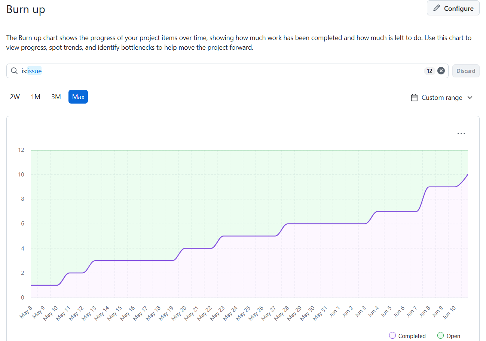

# 🚀 Sprint-01 Review  
*Period · 12 May → 10 June 2025*  
*Planned capacity · 70 h | Actual · ≈ 78 h*

---

## 🎯 Sprint Goal  

> **“Repo scaffolded, AWS sandbox cost-capped, 1 M realistic synthetic payments generated, baseline model logged end-to-end.”**

---

## 1 · Demo Walk-through  

| # | What we showed                                     | Evidence                                                                                                                          |
|---|----------------------------------------------------|-----------------------------------------------------------------------------------------------------------------------------------|
| 1 | **Terraform apply** → VPC, S3, IAM                 | screenshot in [issue #4 comment](https://github.com/EsosaOrumwese/fraud-detection-system/issues/4#issuecomment-2895862865)        |
| 2 | **Budget alert** test e-mail @60 %                 | screenshot in [issue # 5 comment](https://github.com/EsosaOrumwese/fraud-detection-system/issues/5#issuecomment-2902936910)       |
| 3 | **Generator run** (`make data`) – 1 M rows in 22 s | CLI snippet and screenshot in [pull request 16](https://github.com/EsosaOrumwese/fraud-detection-system/pull/16#issue-3117770619) |
| 4 | **Profiling report** (YData-Profiling)             | link → S3 [snippet in [pull request #16](https://github.com/EsosaOrumwese/fraud-detection-system/pull/16#issue-3117770619)]       |
| 5 | **MLflow UI** – run *baseline-xgb*                 | screenshot in [pull request #17](https://github.com/EsosaOrumwese/fraud-detection-system/pull/17#issue-3128520724)                |
| 6 | **Nuke dry-run** (`make nuke-dry`)                 | CI log (workflow “Nuke Sandbox”)                                                                                                  |

---

## 2 · Outcome Metrics  

| KPI                 | Target               | Achieved                   |
|---------------------|----------------------|----------------------------|
| Data volume         | **1 000 000** rows   | **1 000 000** ✅            |
| Parquet size        | ≤ 60 MB              | **55 MB** ✅                |
| Generation speed    | ≤ 30 s               | **22 s** ✅                 |
| Peak RAM (gen)      | ≤ 1 GB               | **480 MB** ✅               |
| Baseline **AUC-PR** | ≥ prevalence (0.003) | **0.0032** ✅               |
| CI pass rate        | 100 %                | 100 % (5/5 workflows) ✅    |
| AWS cost (sandbox)  | ≤ £50 / mo           | **£0.0000053** (to date) ✅ |

---

## 3 · Velocity & Scope  

|                       | Count                              |
|-----------------------|------------------------------------|
| Planned backlog items | 12                                 |
| Completed             | **12** (100 %)                     |
| Spill-over            | 0 (extras deferred to next sprint) |

*Two cards (DAT-02, ML-01) slipped 10 days; re-estimated and completed.*

---

## 4 · Links & Artefacts  

* **Project board:** <https://github.com/EsosaOrumwese/fraud-detection-system/projects/1>  
* **Generator PR:** <https://github.com/EsosaOrumwese/fraud-detection-system/pull/17>  
* **Baseline model PR:** <https://github.com/EsosaOrumwese/fraud-detection-system/pull/19>  
* **Nuke script PR:** <https://github.com/EsosaOrumwese/fraud-detection-system/pull/20>  
* **MLflow Run URI:** `mlruns/0/<run_id>` (see MLflow UI)  

---

## 5 · Sprint Burndown  

> *Planned vs remaining tasks – scope burn reached zero on 8 Jun.*

---

## 6 · Ready Backlog for Sprint-02 (headline)  
Refer to `sprints/Sprint-01-backlog.md`
* **Synthetic-Data Enhancements** (SD-01 → SD-03)  
* **Airflow 3.x orchestration** (ORCH-01 → ORCH-02)  
* **Feast scaffold & back-fill** (FS-01, FS-02)  
* **MLflow tracking-server upgrade** (MLF-01)

---

*(end of file)*