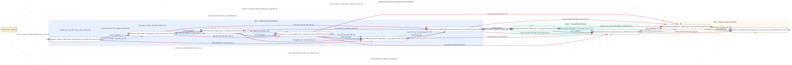

# Data Engine (packages/engine)

Production-oriented synthetic world generator for the fraud platform.

This engine is not a generic data faker. It is a state-networked system that:
1. Seals inputs into deterministic run identity.
2. Builds authority surfaces layer-by-layer (merchant footprint, space, civil time, arrivals, behavior, fraud, labels).
3. Emits validation bundles and PASS flags that gate downstream consumption (`no PASS -> no read`).

## Engine State/IO Ownership Flow



Source: `docs/design/data-engine/engine_state_network/engine_code_io_ownership_flow.graphviz.svg`

## What Is Implemented

The package implements all segment state runners from `1A` through `6B`:

1. `1A`: `S0-S9` (merchant footprint genesis + validation)
2. `1B`: `S0-S9` (geospatial realization + validation)
3. `2A`: `S0-S5` (timezone/civil-time legality + validation)
4. `2B`: `S0-S8` (routing/alias/day-effects + validation)
5. `3A`: `S0-S7` (zone realism + validation)
6. `3B`: `S0-S5` (virtual routing contract surfaces + validation)
7. `5A`: `S0-S5` (demand/baseline intensity/campaign calendar + validation)
8. `5B`: `S0-S5` (time-grid to arrival events + validation)
9. `6A`: `S0-S5` (entity graph base + fraud posture)
10. `6B`: `S0-S5` (flow/event synthesis, fraud overlay, labels, segment gate)

Implementation lives under `packages/engine/src/engine/layers/`.

## Operating Model

### 1) Run identity and sealing

`1A/S0` creates and writes run anchors:

1. `parameter_hash` from governed parameter/policy digests.
2. `manifest_fingerprint` from sealed input artefacts + git digest + parameter hash.
3. `run_id` as execution-attempt identity.
4. `run_receipt.json` at run root.

These identities are embedded through outputs/logs and used to enforce replayability.

### 2) Run isolation and path resolution

All writes are run-scoped:

1. `runs/<runs_root>/<run_id>/data/...`
2. `runs/<runs_root>/<run_id>/logs/...`
3. `runs/<runs_root>/<run_id>/reports/...`

Input resolution is:

1. run-local staged references (`run_root/reference/...`) when present,
2. then configured external roots,
3. else fail-closed.

Core implementation: `packages/engine/src/engine/core/paths.py`.

### 3) Contracts-first enforcement

Runners load dictionaries, artefact registries, and schema packs via contract source resolution:

1. model-spec layout (`docs/model_spec/data-engine/...`) or
2. contracts mirror layout (`contracts/...`).

Core implementation:

1. `packages/engine/src/engine/contracts/source.py`
2. `packages/engine/src/engine/contracts/loader.py`
3. `packages/engine/src/engine/contracts/jsonschema_adapter.py`

### 4) Gate discipline

Validation states publish bundle + pass flag. Consumers must verify required gates before read.

Boundary authority for platform integration:

1. `docs/model_spec/data-engine/interface_pack/data_engine_interface.md`
2. `docs/model_spec/data-engine/interface_pack/engine_outputs.catalogue.yaml`
3. `docs/model_spec/data-engine/interface_pack/engine_gates.map.yaml`

## Execution Surface

Primary orchestration is Makefile-driven from repo root:

1. `make segment1a`
2. `make segment1b`
3. `make segment2a`
4. `make segment2b`
5. `make segment3a`
6. `make segment3b`
7. `make segment5a`
8. `make segment5b`
9. `make segment6a`
10. `make segment6b`
11. `make all` (runs `segment1a -> ... -> segment6b` sequentially)

State-level targets also exist (for example `make segment5b-s4`, `make segment6b-s3`).

## Practical Usage

### Run a full engine chain

```bash
make all RUNS_ROOT=runs/local_full_run-8
```

### Run a single segment

```bash
make segment5b RUNS_ROOT=runs/local_full_run-8
```

### Run a single state on an existing run

```bash
make segment6b-s4 RUNS_ROOT=runs/local_full_run-8 SEG6B_S4_RUN_ID=<run_id>
```

### Direct CLI invocation (without Make)

```bash
PYTHONPATH=packages/engine/src python -m engine.cli.s4_arrival_events_5b --runs-root runs/local_full_run-8 --run-id <run_id>
```

## Key Runtime Knobs

Global:

1. `RUNS_ROOT` (default `runs/local_full_run-6`)
2. `RUN_ID` (optional explicit run selection)
3. `ENGINE_CONTRACTS_LAYOUT` (`model_spec` by default)
4. `ENGINE_CONTRACTS_ROOT` (optional override)
5. `ENGINE_EXTERNAL_ROOTS` (semicolon-separated external roots)

Performance-sensitive knobs (examples from Make defaults):

1. `ENGINE_5B_S4_BATCH_ROWS`
2. `ENGINE_5B_S4_MAX_ARRIVALS_CHUNK`
3. `ENGINE_6B_S1_BATCH_ROWS`
4. `ENGINE_6B_S2_BATCH_ROWS`
5. `ENGINE_6B_S3_BATCH_ROWS`
6. `ENGINE_6B_S4_BATCH_ROWS`

## Outputs and Contracts

Authoritative output inventory and read-gate requirements are maintained in:

1. `docs/model_spec/data-engine/interface_pack/engine_outputs.catalogue.yaml`
2. `docs/model_spec/data-engine/interface_pack/engine_gates.map.yaml`

Do not hardcode paths/joins in consumers when catalogue/gate map already define them.

## Run Hygiene

Failed remediation runs can be pruned safely with:

```bash
python tools/prune_failed_runs.py --runs-root <runs_root>
```

`make` can auto-prune failed remediation folders when `RUNS_ROOT` points under `runs/fix-data-engine` (via `ENGINE_PRUNE_FAILED_RUNS`).

## Remediation vs Production Lanes

Use separate run lanes by intent:

1. Production-style/full-chain generation: `runs/local_full_run-*`
2. Remediation experiments/tuning sweeps: `runs/fix-data-engine/segment_*`

Keep remediation lanes out of default runbook examples unless the section is explicitly about remediation workflow.

## Source-of-Truth Reading Order (for engine work)

1. `AGENTS.md` (repo root)
2. `packages/engine/AGENTS.md`
3. `docs/model_spec/data-engine/layer-1/specs/state-flow/...`
4. `docs/model_spec/data-engine/layer-2/specs/state-flow/...`
5. `docs/model_spec/data-engine/layer-3/specs/state-flow/...`
6. corresponding contract packs under each layer
7. interface boundary docs under `docs/model_spec/data-engine/interface_pack/`

This package README is operational orientation. Expanded state docs and contracts remain the binding behavior authority.
